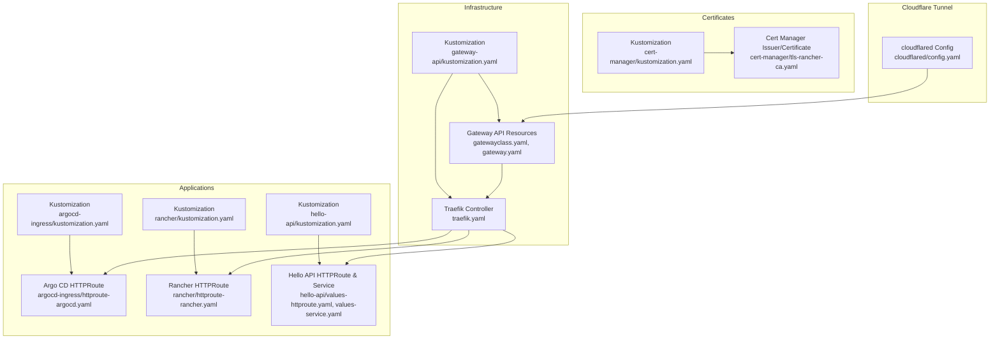
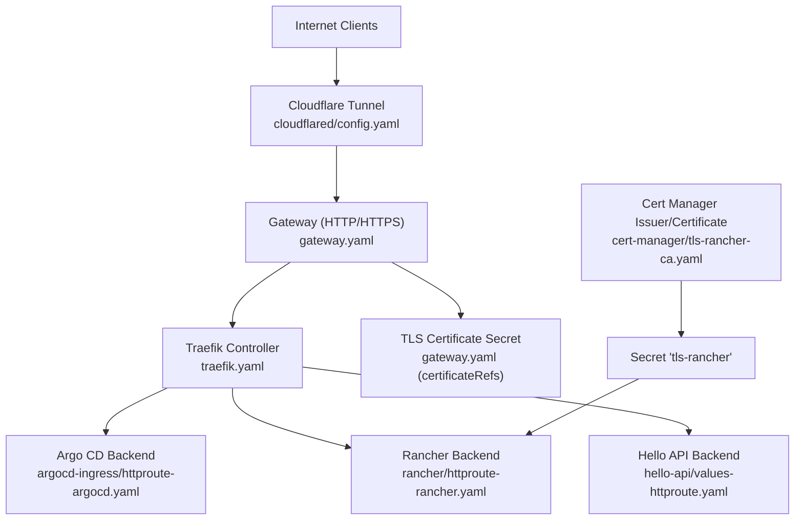
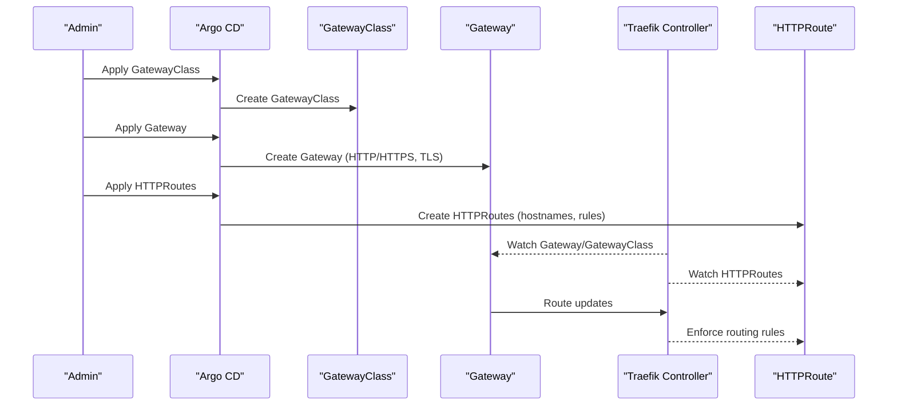
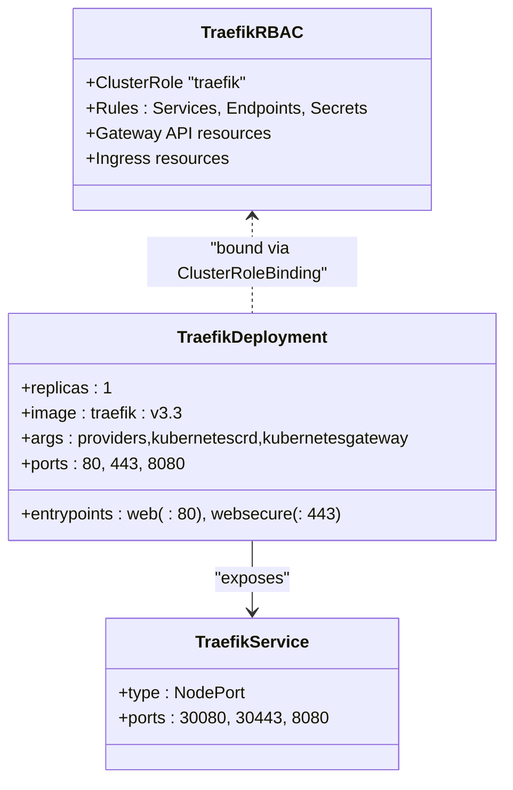
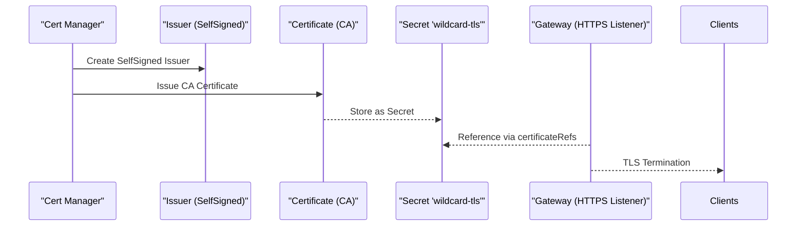
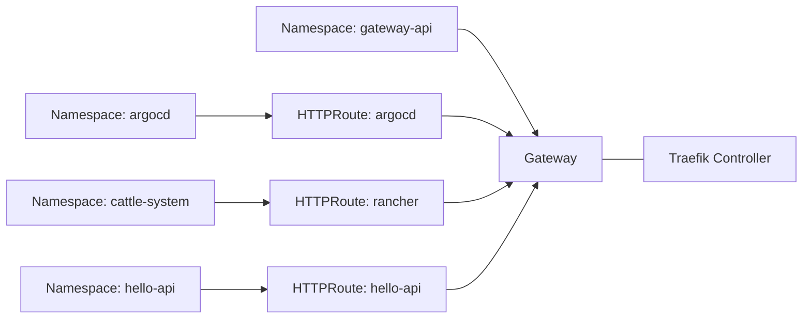
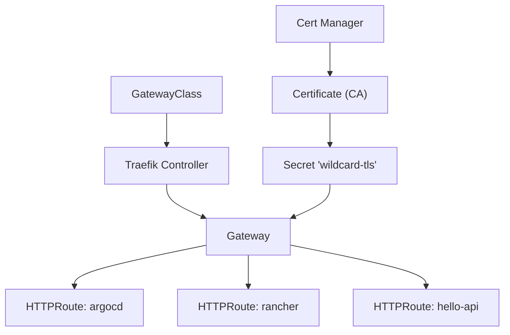

# Advanced Networking Configurations

<cite>
**Referenced Files in This Document**
- [gateway.yaml](file://apps/infra/gateway-api/chart/gateway.yaml)
- [gatewayclass.yaml](file://apps/infra/gateway-api/chart/gatewayclass.yaml)
- [traefik.yaml](file://apps/infra/gateway-api/chart/traefik.yaml)
- [httproute-argocd.yaml](file://apps/playground/argocd-ingress/chart/httproute-argocd.yaml)
- [httproute-rancher.yaml](file://apps/playground/rancher/chart/httproute-rancher.yaml)
- [values-httproute.yaml](file://apps/playground/hello-api/chart/values-httproute.yaml)
- [values-service.yaml](file://apps/playground/hello-api/chart/values-service.yaml)
- [tls-rancher-ca.yaml](file://apps/playground/cert-manager/chart/tls-rancher-ca.yaml)
- [kustomization.yaml (gateway-api)](file://apps/infra/gateway-api/kustomization.yaml)
- [kustomization.yaml (argocd-ingress)](file://apps/playground/argocd-ingress/kustomization.yaml)
- [kustomization.yaml (rancher)](file://apps/playground/rancher/kustomization.yaml)
- [kustomization.yaml (hello-api)](file://apps/playground/hello-api/kustomization.yaml)
- [kustomization.yaml (cert-manager)](file://apps/playground/cert-manager/kustomization.yaml)
- [config.yaml (cloudflared)](file://apps/infra/cloudflared/config.yaml)
- [cluster-resources.yaml](file://bootstrap/cluster-resources.yaml)
</cite>

## Table of Contents
1. [Introduction](#introduction)
2. [Project Structure](#project-structure)
3. [Core Components](#core-components)
4. [Architecture Overview](#architecture-overview)
5. [Detailed Component Analysis](#detailed-component-analysis)
6. [Dependency Analysis](#dependency-analysis)
7. [Performance Considerations](#performance-considerations)
8. [Troubleshooting Guide](#troubleshooting-guide)
9. [Conclusion](#conclusion)
10. [Appendices](#appendices)

## Introduction
This document explains advanced networking configurations and traffic management implemented in the GitOps infrastructure. It covers Gateway API-based routing, custom ingress controller deployment via Traefik, multi-application HTTP routing, TLS termination, certificate management, and operational practices for reliability, performance, and security. The focus is on real-world patterns visible in the repository: a shared Gateway, per-application HTTPRoute definitions, a Traefik controller, and a local CA for Rancher.

## Project Structure
The networking stack is organized around three primary areas:
- Infrastructure: Gateway API CRDs, GatewayClass, and Traefik controller deployment
- Applications: HTTPRoute configurations for Argo CD, Rancher, and a sample API service
- Certificates: Local CA and certificate issuance for internal workloads

**Diagram sources**
- [gatewayclass.yaml:1-10](file://apps/infra/gateway-api/chart/gatewayclass.yaml#L1-L10)
- [gateway.yaml:1-27](file://apps/infra/gateway-api/chart/gateway.yaml#L1-L27)
- [traefik.yaml:1-120](file://apps/infra/gateway-api/chart/traefik.yaml#L1-L120)
- [httproute-argocd.yaml:1-29](file://apps/playground/argocd-ingress/chart/httproute-argocd.yaml#L1-L29)
- [httproute-rancher.yaml:1-30](file://apps/playground/rancher/chart/httproute-rancher.yaml#L1-L30)
- [values-httproute.yaml:1-26](file://apps/playground/hello-api/chart/values-httproute.yaml#L1-L26)
- [values-service.yaml:1-6](file://apps/playground/hello-api/chart/values-service.yaml#L1-L6)
- [tls-rancher-ca.yaml:1-34](file://apps/playground/cert-manager/chart/tls-rancher-ca.yaml#L1-L34)
- [kustomization.yaml (gateway-api):1-9](file://apps/infra/gateway-api/kustomization.yaml#L1-L9)
- [kustomization.yaml (argocd-ingress):1-9](file://apps/playground/argocd-ingress/kustomization.yaml#L1-L9)
- [kustomization.yaml (rancher):1-9](file://apps/playground/rancher/kustomization.yaml#L1-L9)
- [kustomization.yaml (hello-api):1-8](file://apps/playground/hello-api/kustomization.yaml#L1-L8)
- [kustomization.yaml (cert-manager):1-6](file://apps/playground/cert-manager/kustomization.yaml#L1-L6)
- [config.yaml (cloudflared):1-4](file://apps/infra/cloudflared/config.yaml#L1-L4)

**Section sources**
- [kustomization.yaml (gateway-api):1-9](file://apps/infra/gateway-api/kustomization.yaml#L1-L9)
- [kustomization.yaml (argocd-ingress):1-9](file://apps/playground/argocd-ingress/kustomization.yaml#L1-L9)
- [kustomization.yaml (rancher):1-9](file://apps/playground/rancher/kustomization.yaml#L1-L9)
- [kustomization.yaml (hello-api):1-8](file://apps/playground/hello-api/kustomization.yaml#L1-L8)
- [kustomization.yaml (cert-manager):1-6](file://apps/playground/cert-manager/kustomization.yaml#L1-L6)
- [config.yaml (cloudflared):1-4](file://apps/infra/cloudflared/config.yaml#L1-L4)

## Core Components
- GatewayClass: Defines the controller responsible for managing Gateways (Traefik).
- Gateway: Declares listeners for HTTP/HTTPS and attaches TLS certificates via a Secret reference.
- HTTPRoute: Routes traffic to specific backends based on hostname and path, with header manipulation for forwarded proto/port.
- Traefik Controller: Deploys as a Kubernetes Gateway controller with RBAC and a Service exposing NodePorts.
- Cert Manager Issuer/Certificate: Creates a local CA and a certificate stored in a Secret for internal services.
- Kustomizations: Orchestrate namespace scoping and resource composition across applications.

Key implementation references:
- GatewayClass definition and controller name
- Gateway listeners and TLS termination with certificateRefs
- HTTPRoute hostnames, path matching, header filters, and backendRefs
- Traefik RBAC, Deployment, and Service with NodePorts
- Cert Manager Issuer and Certificate with CA flags and Secret storage

**Section sources**
- [gatewayclass.yaml:1-10](file://apps/infra/gateway-api/chart/gatewayclass.yaml#L1-L10)
- [gateway.yaml:1-27](file://apps/infra/gateway-api/chart/gateway.yaml#L1-L27)
- [httproute-argocd.yaml:1-29](file://apps/playground/argocd-ingress/chart/httproute-argocd.yaml#L1-L29)
- [httproute-rancher.yaml:1-30](file://apps/playground/rancher/chart/httproute-rancher.yaml#L1-L30)
- [values-httproute.yaml:1-26](file://apps/playground/hello-api/chart/values-httproute.yaml#L1-L26)
- [values-service.yaml:1-6](file://apps/playground/hello-api/chart/values-service.yaml#L1-L6)
- [traefik.yaml:1-120](file://apps/infra/gateway-api/chart/traefik.yaml#L1-L120)
- [tls-rancher-ca.yaml:1-34](file://apps/playground/cert-manager/chart/tls-rancher-ca.yaml#L1-L34)

## Architecture Overview
The system uses a shared Gateway managed by the Traefik Gateway controller. Applications register HTTPRoute resources pointing to the shared Gateway. TLS termination occurs at the Gateway using a wildcard certificate Secret. Cloudflare Tunnel proxies external traffic into the cluster, terminating at the Gateway.

**Diagram sources**
- [gateway.yaml:1-27](file://apps/infra/gateway-api/chart/gateway.yaml#L1-L27)
- [traefik.yaml:1-120](file://apps/infra/gateway-api/chart/traefik.yaml#L1-L120)
- [httproute-argocd.yaml:1-29](file://apps/playground/argocd-ingress/chart/httproute-argocd.yaml#L1-L29)
- [httproute-rancher.yaml:1-30](file://apps/playground/rancher/chart/httproute-rancher.yaml#L1-L30)
- [values-httproute.yaml:1-26](file://apps/playground/hello-api/chart/values-httproute.yaml#L1-L26)
- [tls-rancher-ca.yaml:1-34](file://apps/playground/cert-manager/chart/tls-rancher-ca.yaml#L1-L34)
- [config.yaml (cloudflared):1-4](file://apps/infra/cloudflared/config.yaml#L1-L4)

## Detailed Component Analysis

### Gateway API Controller and Shared Gateway
- GatewayClass binds the controller name to the Traefik implementation.
- Gateway declares HTTP and HTTPS listeners and allows routes from all namespaces. HTTPS terminates TLS using a wildcard certificate Secret referenced by name.
- Sync waves ensure proper ordering: GatewayClass first, then Gateway, followed by HTTPRoutes.

**Diagram sources**
- [gatewayclass.yaml:1-10](file://apps/infra/gateway-api/chart/gatewayclass.yaml#L1-L10)
- [gateway.yaml:1-27](file://apps/infra/gateway-api/chart/gateway.yaml#L1-L27)
- [httproute-argocd.yaml:1-29](file://apps/playground/argocd-ingress/chart/httproute-argocd.yaml#L1-L29)
- [httproute-rancher.yaml:1-30](file://apps/playground/rancher/chart/httproute-rancher.yaml#L1-L30)
- [traefik.yaml:1-120](file://apps/infra/gateway-api/chart/traefik.yaml#L1-L120)

**Section sources**
- [gatewayclass.yaml:1-10](file://apps/infra/gateway-api/chart/gatewayclass.yaml#L1-L10)
- [gateway.yaml:1-27](file://apps/infra/gateway-api/chart/gateway.yaml#L1-L27)
- [kustomization.yaml (gateway-api):1-9](file://apps/infra/gateway-api/kustomization.yaml#L1-L9)

### HTTPRoute Patterns and Traffic Shaping
- Argo CD and Rancher HTTPRoutes define hostnames and path-based routing rules.
- Header filters set forwarded protocol and port headers to inform upstream services.
- Backends reference service names and ports within respective namespaces.

**Diagram sources**
- [httproute-argocd.yaml:1-29](file://apps/playground/argocd-ingress/chart/httproute-argocd.yaml#L1-L29)
- [httproute-rancher.yaml:1-30](file://apps/playground/rancher/chart/httproute-rancher.yaml#L1-L30)
- [values-httproute.yaml:1-26](file://apps/playground/hello-api/chart/values-httproute.yaml#L1-L26)

**Section sources**
- [httproute-argocd.yaml:1-29](file://apps/playground/argocd-ingress/chart/httproute-argocd.yaml#L1-L29)
- [httproute-rancher.yaml:1-30](file://apps/playground/rancher/chart/httproute-rancher.yaml#L1-L30)
- [values-httproute.yaml:1-26](file://apps/playground/hello-api/chart/values-httproute.yaml#L1-L26)
- [values-service.yaml:1-6](file://apps/playground/hello-api/chart/values-service.yaml#L1-L6)

### Traefik Controller Deployment and RBAC
- RBAC grants read/watch permissions for Gateway API resources, Services, Endpoints, Secrets, and Ingress resources.
- Deployment runs a single replica with entrypoints for HTTP/HTTPS and an admin endpoint.
- Service exposes NodePorts for web, websecure, and admin.

**Diagram sources**
- [traefik.yaml:1-120](file://apps/infra/gateway-api/chart/traefik.yaml#L1-L120)

**Section sources**
- [traefik.yaml:1-120](file://apps/infra/gateway-api/chart/traefik.yaml#L1-L120)

### Certificate Management and TLS Termination
- A local CA is created via Cert Manager Issuer and Certificate, stored in a Secret named for downstream consumption.
- The Gateway references a wildcard TLS Secret for HTTPS listener termination.
- Rancher uses the generated Secret for TLS.

**Diagram sources**
- [tls-rancher-ca.yaml:1-34](file://apps/playground/cert-manager/chart/tls-rancher-ca.yaml#L1-L34)
- [gateway.yaml:23-27](file://apps/infra/gateway-api/chart/gateway.yaml#L23-L27)

**Section sources**
- [tls-rancher-ca.yaml:1-34](file://apps/playground/cert-manager/chart/tls-rancher-ca.yaml#L1-L34)
- [gateway.yaml:23-27](file://apps/infra/gateway-api/chart/gateway.yaml#L23-L27)

### Multi-Application Routing and Namespace Isolation
- HTTPRoutes are defined in separate namespaces but attach to a shared Gateway in another namespace.
- Kustomizations set namespace scoping per application.
- Sync waves ensure controller readiness before route creation.

**Diagram sources**
- [gateway.yaml:1-27](file://apps/infra/gateway-api/chart/gateway.yaml#L1-L27)
- [httproute-argocd.yaml:1-29](file://apps/playground/argocd-ingress/chart/httproute-argocd.yaml#L1-L29)
- [httproute-rancher.yaml:1-30](file://apps/playground/rancher/chart/httproute-rancher.yaml#L1-L30)
- [values-httproute.yaml:1-26](file://apps/playground/hello-api/chart/values-httproute.yaml#L1-L26)
- [kustomization.yaml (argocd-ingress):1-9](file://apps/playground/argocd-ingress/kustomization.yaml#L1-L9)
- [kustomization.yaml (rancher):1-9](file://apps/playground/rancher/kustomization.yaml#L1-L9)
- [kustomization.yaml (hello-api):1-8](file://apps/playground/hello-api/kustomization.yaml#L1-L8)

**Section sources**
- [kustomization.yaml (argocd-ingress):1-9](file://apps/playground/argocd-ingress/kustomization.yaml#L1-L9)
- [kustomization.yaml (rancher):1-9](file://apps/playground/rancher/kustomization.yaml#L1-L9)
- [kustomization.yaml (hello-api):1-8](file://apps/playground/hello-api/kustomization.yaml#L1-L8)

## Dependency Analysis
- Gateway depends on GatewayClass controller identity.
- HTTPRoutes depend on Gateway presence and controller watching.
- Traefik controller depends on RBAC and Gateway API CRDs installed in-cluster.
- Cert Manager depends on Issuer/Certificate resources to produce Secrets consumed by Gateway.

**Diagram sources**
- [gatewayclass.yaml:1-10](file://apps/infra/gateway-api/chart/gatewayclass.yaml#L1-L10)
- [gateway.yaml:1-27](file://apps/infra/gateway-api/chart/gateway.yaml#L1-L27)
- [httproute-argocd.yaml:1-29](file://apps/playground/argocd-ingress/chart/httproute-argocd.yaml#L1-L29)
- [httproute-rancher.yaml:1-30](file://apps/playground/rancher/chart/httproute-rancher.yaml#L1-L30)
- [values-httproute.yaml:1-26](file://apps/playground/hello-api/chart/values-httproute.yaml#L1-L26)
- [tls-rancher-ca.yaml:1-34](file://apps/playground/cert-manager/chart/tls-rancher-ca.yaml#L1-L34)

**Section sources**
- [gatewayclass.yaml:1-10](file://apps/infra/gateway-api/chart/gatewayclass.yaml#L1-L10)
- [gateway.yaml:1-27](file://apps/infra/gateway-api/chart/gateway.yaml#L1-L27)
- [traefik.yaml:1-120](file://apps/infra/gateway-api/chart/traefik.yaml#L1-L120)
- [tls-rancher-ca.yaml:1-34](file://apps/playground/cert-manager/chart/tls-rancher-ca.yaml#L1-L34)

## Performance Considerations
- Controller footprint: Traefik Deployment specifies modest CPU/memory requests/limits suitable for small to medium clusters.
- NodePort exposure: Service uses NodePorts for web/websecure/admin; ensure firewall policies and load balancer topology align with cluster networking.
- Path-based routing: Prefer precise path prefixes and minimal header transformations to reduce overhead.
- TLS termination: Centralized at Gateway reduces per-backend TLS compute; ensure certificate rotation cadence and secret distribution are reliable.

[No sources needed since this section provides general guidance]

## Troubleshooting Guide
Common issues and checks:
- Gateway not ready: Verify GatewayClass exists and controller is running; confirm Gateway listener ports and TLS certificateRefs are valid.
- HTTPRoute not taking effect: Confirm parentRefs reference the correct Gateway name/namespace; check hostnames and path matches; ensure header filters are applied.
- TLS handshake failures: Validate the referenced TLS Secret exists and contains valid certificate/key; review certificate expiration and SANs.
- No traffic to backend: Inspect Service ports and selectors; ensure backend Pod is healthy and listening on the specified port.
- Sync order: Review sync waves to ensure GatewayClass, Gateway, and HTTPRoutes are applied in the intended sequence.

Operational references:
- GatewayClass annotation for sync wave
- Gateway annotations for sync wave
- HTTPRoute annotations for sync wave
- Traefik Service exposing NodePorts for diagnostics

**Section sources**
- [gatewayclass.yaml:5-6](file://apps/infra/gateway-api/chart/gatewayclass.yaml#L5-L6)
- [gateway.yaml:6-8](file://apps/infra/gateway-api/chart/gateway.yaml#L6-L8)
- [httproute-argocd.yaml:6-8](file://apps/playground/argocd-ingress/chart/httproute-argocd.yaml#L6-L8)
- [httproute-rancher.yaml:6-8](file://apps/playground/rancher/chart/httproute-rancher.yaml#L6-L8)
- [values-httproute.yaml:3-4](file://apps/playground/hello-api/chart/values-httproute.yaml#L3-L4)
- [traefik.yaml:103-120](file://apps/infra/gateway-api/chart/traefik.yaml#L103-L120)

## Conclusion
The repository demonstrates a clean, GitOps-friendly networking architecture centered on Gateway API and Traefik. A shared Gateway simplifies multi-tenant routing, while HTTPRoute resources enable per-application control over hostnames, paths, and header handling. TLS termination at the Gateway centralizes security, and a local CA supports internal workloads. Adhering to sync waves and validating certificate distribution ensures predictable upgrades and reliable traffic delivery.

[No sources needed since this section summarizes without analyzing specific files]

## Appendices

### Appendix A: Sync Wave Ordering
- GatewayClass: wave 1
- Gateway: wave 2
- Traefik Service/Deployment: wave 0 (controller first)
- HTTPRoutes: wave 3 (attach after controller)
- Cert Manager resources: wave 5 (issue certs after routes)

**Section sources**
- [gatewayclass.yaml:5-6](file://apps/infra/gateway-api/chart/gatewayclass.yaml#L5-L6)
- [gateway.yaml:6-8](file://apps/infra/gateway-api/chart/gateway.yaml#L6-L8)
- [traefik.yaml:61-62](file://apps/infra/gateway-api/chart/traefik.yaml#L61-L62)
- [httproute-argocd.yaml:6-8](file://apps/playground/argocd-ingress/chart/httproute-argocd.yaml#L6-L8)
- [httproute-rancher.yaml:6-8](file://apps/playground/rancher/chart/httproute-rancher.yaml#L6-L8)
- [values-httproute.yaml:3-4](file://apps/playground/hello-api/chart/values-httproute.yaml#L3-L4)
- [tls-rancher-ca.yaml:6-7](file://apps/playground/cert-manager/chart/tls-rancher-ca.yaml#L6-L7)

### Appendix B: Namespace Scoping and Kustomizations
- Each application sets its own namespace via Kustomization.
- Gateway API resources are deployed to the dedicated namespace for the controller.

**Section sources**
- [kustomization.yaml (gateway-api)](file://apps/infra/gateway-api/kustomization.yaml#L4)
- [kustomization.yaml (argocd-ingress)](file://apps/playground/argocd-ingress/kustomization.yaml#L5)
- [kustomization.yaml (rancher)](file://apps/playground/rancher/kustomization.yaml#L4)
- [kustomization.yaml (hello-api)](file://apps/playground/hello-api/kustomization.yaml#L4)
- [kustomization.yaml (cert-manager)](file://apps/playground/cert-manager/kustomization.yaml#L3)

### Appendix C: Cloudflare Tunnel Integration
- cloudflared configuration sets a destination namespace and sync wave, enabling external access to cluster services via Cloudflare’s edge.

**Section sources**
- [config.yaml (cloudflared):1-4](file://apps/infra/cloudflared/config.yaml#L1-L4)