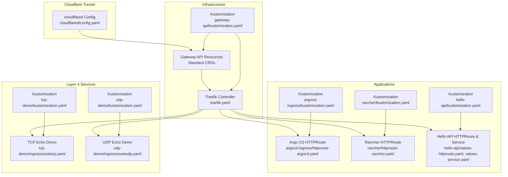
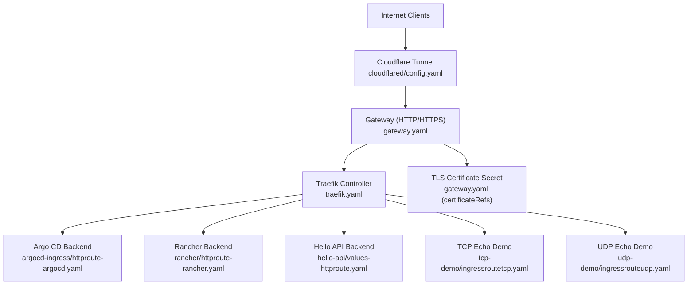
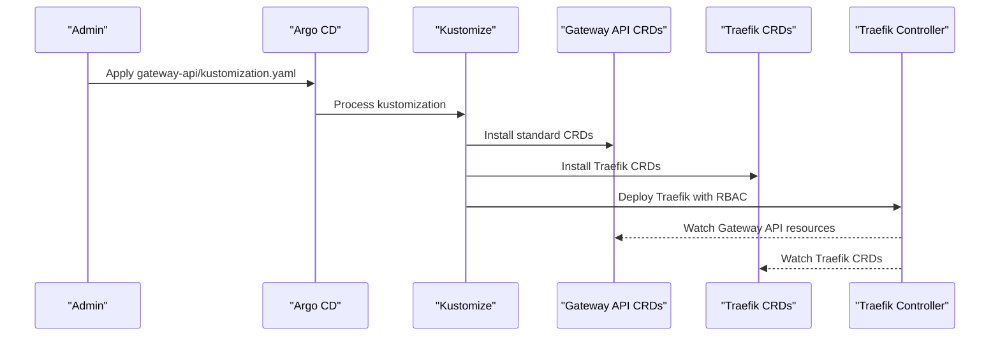
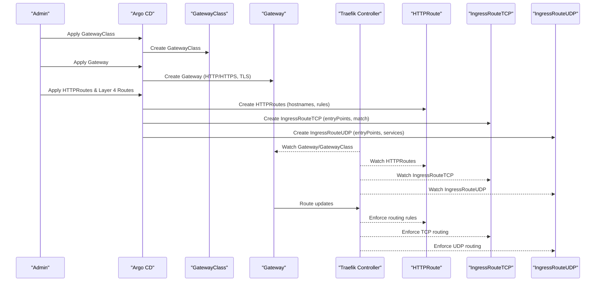
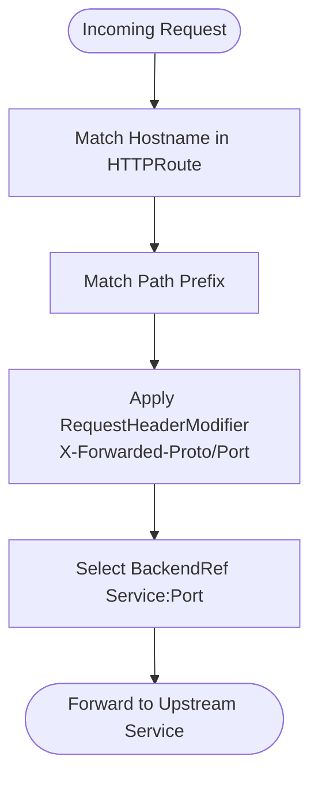
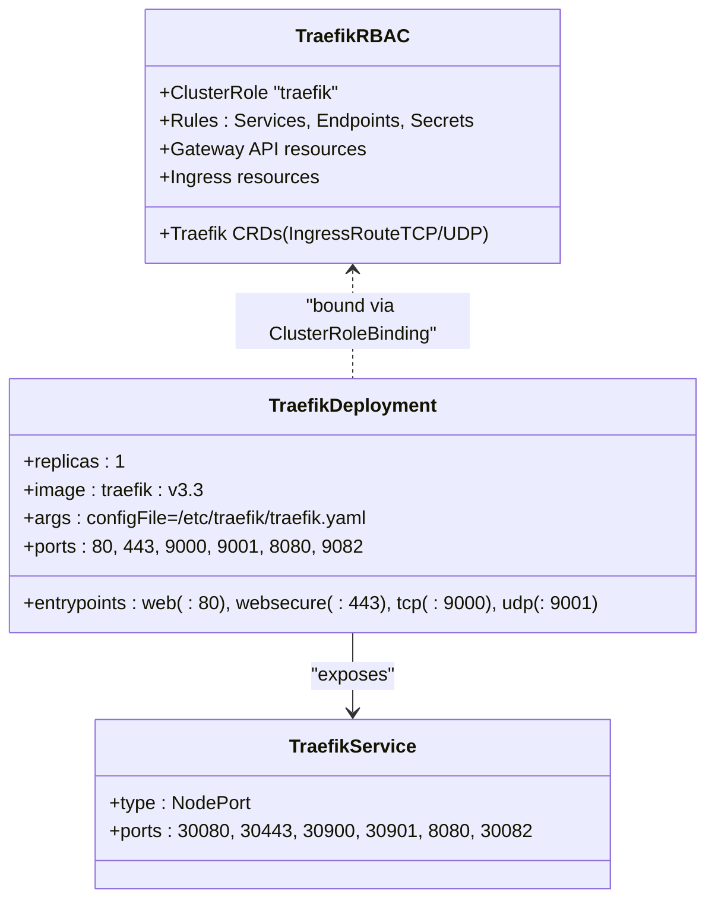
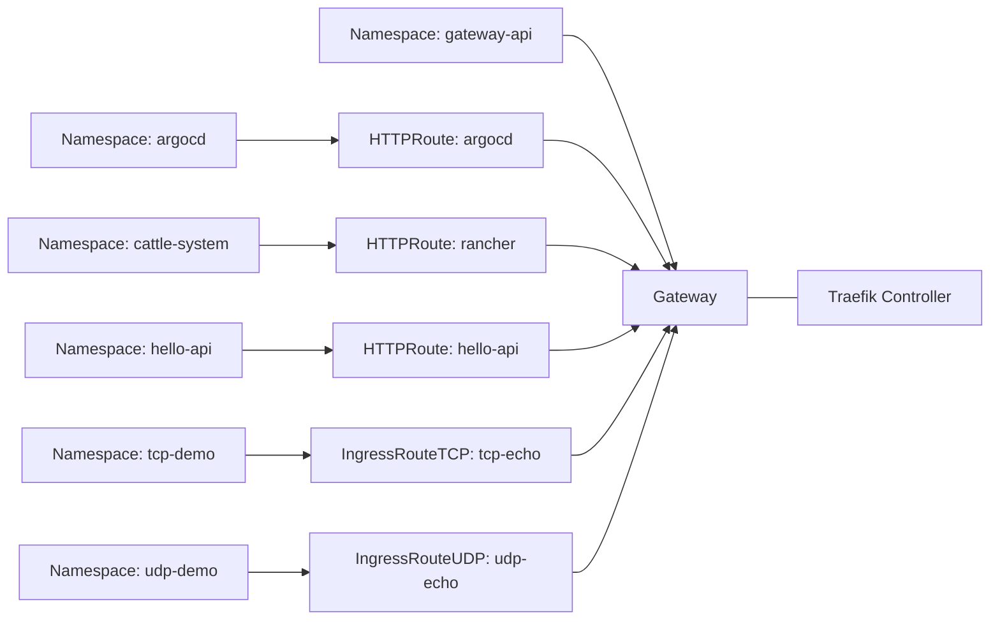
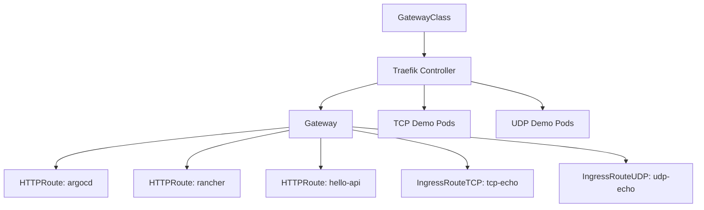

# Advanced Networking Configurations

<cite>
**Referenced Files in This Document**
- [gateway.yaml](file://apps/infra/gateway-api/chart/gateway.yaml)
- [gatewayclass.yaml](file://apps/infra/gateway-api/chart/gatewayclass.yaml)
- [traefik.yaml](file://apps/infra/gateway-api/chart/traefik.yaml)
- [kustomization.yaml (gateway-api)](file://apps/infra/gateway-api/kustomization.yaml)
- [crds/kustomization.yaml](file://apps/infra/gateway-api/crds/kustomization.yaml)
- [httproute-argocd.yaml](file://apps/infra/argocd-ingress/chart/httproute-argocd.yaml)
- [httproute-rancher.yaml](file://apps/infra/rancher/chart/httproute-rancher.yaml)
- [values-httproute.yaml](file://apps/applications/hello-api/chart/values-httproute.yaml)
- [values-service.yaml](file://apps/applications/hello-api/chart/values-service.yaml)
- [ingressroutetcp.yaml](file://apps/applications/tcp-demo/chart/ingressroutetcp.yaml)
- [ingressrouteudp.yaml](file://apps/applications/udp-demo/chart/ingressrouteudp.yaml)
- [deployment.yaml (tcp-demo)](file://apps/applications/tcp-demo/chart/deployment.yaml)
- [service.yaml (tcp-demo)](file://apps/applications/tcp-demo/chart/service.yaml)
- [deployment.yaml (udp-demo)](file://apps/applications/udp-demo/chart/deployment.yaml)
- [service.yaml (udp-demo)](file://apps/applications/udp-demo/chart/service.yaml)
- [kustomization.yaml (argocd-ingress)](file://apps/infra/argocd-ingress/kustomization.yaml)
- [kustomization.yaml (rancher)](file://apps/infra/rancher/kustomization.yaml)
- [kustomization.yaml (hello-api)](file://apps/applications/hello-api/kustomization.yaml)
- [kustomization.yaml (tcp-demo)](file://apps/applications/tcp-demo/kustomization.yaml)
- [kustomization.yaml (udp-demo)](file://apps/applications/udp-demo/kustomization.yaml)
- [config.yaml (cloudflared)](file://apps/infra/cloudflared/config.yaml)
- [README.md (tcp-udp-demo)](file://guide/tcp-udp-demo/README.md)
</cite>

## Update Summary
**Changes Made**
- Updated to reflect new CRD-based routing approach using Traefik's native CRDs instead of experimental channel-based installation
- Removed references to experimental TCP/UDP listeners and experimental-channel-based Gateway API installation
- Updated installation methodology to use standard Gateway API CRDs from the official release
- Maintained comprehensive Layer 4 routing documentation for TCP and UDP protocols
- Documented new TCP/UDP echo server examples and their configurations
- Enhanced Gateway API configuration documentation with standard installation methodology

## Table of Contents
1. [Introduction](#introduction)
2. [Project Structure](#project-structure)
3. [Core Components](#core-components)
4. [Architecture Overview](#architecture-overview)
5. [Detailed Component Analysis](#detailed-component-analysis)
6. [Standard Installation Methodology](#standard-installation-methodology)
7. [Layer 4 Routing Capabilities](#layer-4-routing-capabilities)
8. [TCP/UDP Echo Server Examples](#tcpudp-echo-server-examples)
9. [Dependency Analysis](#dependency-analysis)
10. [Performance Considerations](#performance-considerations)
11. [Troubleshooting Guide](#troubleshooting-guide)
12. [Conclusion](#conclusion)
13. [Appendices](#appendices)

## Introduction
This document explains advanced networking configurations and traffic management implemented in the GitOps infrastructure. It covers Gateway API-based routing, custom ingress controller deployment via Traefik, multi-application HTTP routing, Layer 4 TCP/UDP routing, TLS termination, certificate management, and operational practices for reliability, performance, and security. The focus is on real-world patterns visible in the repository: a shared Gateway with HTTP/HTTPS listeners, per-application routing definitions, a Traefik controller with comprehensive protocol support, and a local CA for Rancher. The implementation now uses standard CRD-based routing with official Gateway API releases and Traefik's native CRDs.

## Project Structure
The networking stack is organized around four primary areas:
- Infrastructure: Standard Gateway API CRDs, GatewayClass, and Traefik controller deployment with TCP/UDP support
- Applications: HTTPRoute configurations for Argo CD, Rancher, and a sample API service
- Layer 4 Services: TCP and UDP echo server demonstrations with IngressRouteTCP/UDP resources
- Certificates: Local CA and certificate issuance for internal workloads

**Diagram sources**
- [gateway.yaml:1-34](file://apps/infra/gateway-api/chart/gateway.yaml#L1-L34)
- [gatewayclass.yaml:1-10](file://apps/infra/gateway-api/chart/gatewayclass.yaml#L1-L10)
- [traefik.yaml:1-147](file://apps/infra/gateway-api/chart/traefik.yaml#L1-L147)
- [kustomization.yaml (gateway-api):1-10](file://apps/infra/gateway-api/kustomization.yaml#L1-L10)
- [httproute-argocd.yaml:1-29](file://apps/infra/argocd-ingress/chart/httproute-argocd.yaml#L1-L29)
- [httproute-rancher.yaml:1-30](file://apps/infra/rancher/chart/httproute-rancher.yaml#L1-L30)
- [values-httproute.yaml:1-26](file://apps/applications/hello-api/chart/values-httproute.yaml#L1-L26)
- [values-service.yaml:1-6](file://apps/applications/hello-api/chart/values-service.yaml#L1-L6)
- [ingressroutetcp.yaml:1-21](file://apps/applications/tcp-demo/chart/ingressroutetcp.yaml#L1-L21)
- [ingressrouteudp.yaml:1-20](file://apps/applications/udp-demo/chart/ingressrouteudp.yaml#L1-L20)

**Section sources**
- [kustomization.yaml (gateway-api):1-10](file://apps/infra/gateway-api/kustomization.yaml#L1-L10)

## Core Components
- GatewayClass: Defines the controller responsible for managing Gateways (Traefik).
- Gateway: Declares listeners for HTTP/HTTPS protocols and attaches TLS certificates via a Secret reference.
- HTTPRoute: Routes traffic to specific backends based on hostname and path, with header manipulation for forwarded proto/port.
- IngressRouteTCP/UDP: Routes Layer 4 TCP and UDP traffic to backend services using host SNI matching and service references.
- Traefik Controller: Deploys as a Kubernetes Gateway controller with RBAC, Service exposing NodePorts for all protocols, and comprehensive static configuration.
- Kustomizations: Orchestrate namespace scoping and resource composition across applications.

Key implementation references:
- GatewayClass definition and controller name
- Gateway listeners for HTTP/HTTPS with namespace selectors
- HTTPRoute hostnames, path matching, header filters, and backendRefs
- IngressRouteTCP/UDP entry points, host matching, and service references
- Traefik RBAC, Deployment, and Service with NodePorts for all protocols
- Standard installation methodology using official CRDs

**Section sources**
- [gatewayclass.yaml:1-10](file://apps/infra/gateway-api/chart/gatewayclass.yaml#L1-L10)
- [gateway.yaml:1-34](file://apps/infra/gateway-api/chart/gateway.yaml#L1-L34)
- [httproute-argocd.yaml:1-29](file://apps/infra/argocd-ingress/chart/httproute-argocd.yaml#L1-L29)
- [httproute-rancher.yaml:1-30](file://apps/infra/rancher/chart/httproute-rancher.yaml#L1-L30)
- [values-httproute.yaml:1-26](file://apps/applications/hello-api/chart/values-httproute.yaml#L1-L26)
- [values-service.yaml:1-6](file://apps/applications/hello-api/chart/values-service.yaml#L1-L6)
- [ingressroutetcp.yaml:1-21](file://apps/applications/tcp-demo/chart/ingressroutetcp.yaml#L1-L21)
- [ingressrouteudp.yaml:1-20](file://apps/applications/udp-demo/chart/ingressrouteudp.yaml#L1-L20)
- [traefik.yaml:1-147](file://apps/infra/gateway-api/chart/traefik.yaml#L1-L147)

## Architecture Overview
The system uses a shared Gateway managed by the Traefik Gateway controller with comprehensive protocol support. Applications register HTTPRoute resources for HTTP/HTTPS traffic and IngressRouteTCP/UDP resources for Layer 4 routing. TLS termination occurs at the Gateway using a wildcard certificate Secret. Cloudflare Tunnel proxies external traffic into the cluster, terminating at the Gateway. TCP/UDP echo servers demonstrate advanced Layer 4 routing patterns beyond traditional HTTP/HTTPS traffic.

**Diagram sources**
- [gateway.yaml:1-34](file://apps/infra/gateway-api/chart/gateway.yaml#L1-L34)
- [traefik.yaml:1-147](file://apps/infra/gateway-api/chart/traefik.yaml#L1-L147)
- [httproute-argocd.yaml:1-29](file://apps/infra/argocd-ingress/chart/httproute-argocd.yaml#L1-L29)
- [httproute-rancher.yaml:1-30](file://apps/infra/rancher/chart/httproute-rancher.yaml#L1-L30)
- [values-httproute.yaml:1-26](file://apps/applications/hello-api/chart/values-httproute.yaml#L1-L26)
- [ingressroutetcp.yaml:1-21](file://apps/applications/tcp-demo/chart/ingressroutetcp.yaml#L1-L21)
- [ingressrouteudp.yaml:1-20](file://apps/applications/udp-demo/chart/ingressrouteudp.yaml#L1-L20)
- [config.yaml (cloudflared):1-4](file://apps/infra/cloudflared/config.yaml#L1-L4)

## Detailed Component Analysis

### Standard Installation Methodology
The implementation now uses a standard installation approach with official Gateway API CRDs and Traefik's native CRDs:

- **Gateway API CRDs**: Installed from the official v1.5.1 release using the standard-install.yaml manifest
- **Traefik CRDs**: Installed from the official Traefik v3.3 documentation
- **Sync Waves**: Proper ordering ensures CRDs are installed before controllers and routes
- **Controller Deployment**: Traefik controller deployed with comprehensive RBAC and NodePort exposure

**Updated** Removed experimental-channel-based installation in favor of standard CRD installation

**Diagram sources**
- [kustomization.yaml (gateway-api):6-9](file://apps/infra/gateway-api/kustomization.yaml#L6-L9)
- [crds/kustomization.yaml:4-5](file://apps/infra/gateway-api/crds/kustomization.yaml#L4-L5)

**Section sources**
- [kustomization.yaml (gateway-api):1-10](file://apps/infra/gateway-api/kustomization.yaml#L1-L10)
- [crds/kustomization.yaml:1-9](file://apps/infra/gateway-api/crds/kustomization.yaml#L1-L9)

### Gateway API Controller and Shared Gateway
- GatewayClass binds the controller name to the Traefik implementation.
- Gateway declares HTTP and HTTPS listeners and allows routes from all namespaces. HTTPS terminates TLS using a wildcard certificate Secret referenced by name.
- Sync waves ensure proper ordering: GatewayClass first, then Gateway, followed by HTTPRoutes and Layer 4 routes.

**Diagram sources**
- [gatewayclass.yaml:1-10](file://apps/infra/gateway-api/chart/gatewayclass.yaml#L1-L10)
- [gateway.yaml:1-34](file://apps/infra/gateway-api/chart/gateway.yaml#L1-L34)
- [httproute-argocd.yaml:1-29](file://apps/infra/argocd-ingress/chart/httproute-argocd.yaml#L1-L29)
- [httproute-rancher.yaml:1-30](file://apps/infra/rancher/chart/httproute-rancher.yaml#L1-L30)
- [values-httproute.yaml:1-26](file://apps/applications/hello-api/chart/values-httproute.yaml#L1-L26)
- [ingressroutetcp.yaml:1-21](file://apps/applications/tcp-demo/chart/ingressroutetcp.yaml#L1-L21)
- [ingressrouteudp.yaml:1-20](file://apps/applications/udp-demo/chart/ingressrouteudp.yaml#L1-L20)
- [traefik.yaml:59-147](file://apps/infra/gateway-api/chart/traefik.yaml#L59-L147)

**Section sources**
- [gatewayclass.yaml:1-10](file://apps/infra/gateway-api/chart/gatewayclass.yaml#L1-L10)
- [gateway.yaml:1-34](file://apps/infra/gateway-api/chart/gateway.yaml#L1-L34)

### HTTPRoute Patterns and Traffic Shaping
- Argo CD and Rancher HTTPRoutes define hostnames and path-based routing rules.
- Header filters set forwarded protocol and port headers to inform upstream services.
- Backends reference service names and ports within respective namespaces.

**Diagram sources**
- [httproute-argocd.yaml:1-29](file://apps/infra/argocd-ingress/chart/httproute-argocd.yaml#L1-L29)
- [httproute-rancher.yaml:1-30](file://apps/infra/rancher/chart/httproute-rancher.yaml#L1-L30)
- [values-httproute.yaml:1-26](file://apps/applications/hello-api/chart/values-httproute.yaml#L1-L26)

**Section sources**
- [httproute-argocd.yaml:1-29](file://apps/infra/argocd-ingress/chart/httproute-argocd.yaml#L1-L29)
- [httproute-rancher.yaml:1-30](file://apps/infra/rancher/chart/httproute-rancher.yaml#L1-L30)
- [values-httproute.yaml:1-26](file://apps/applications/hello-api/chart/values-httproute.yaml#L1-L26)
- [values-service.yaml:1-6](file://apps/applications/hello-api/chart/values-service.yaml#L1-L6)

### Traefik Controller Deployment and RBAC
- RBAC grants read/watch permissions for Gateway API resources, Services, Endpoints, Secrets, and Ingress resources.
- Deployment runs a single replica with entrypoints for HTTP/HTTPS/TCP/UDP and an admin endpoint.
- Service exposes NodePorts for web, websecure, admin, tcp, and udp protocols.

**Diagram sources**
- [traefik.yaml:10-44](file://apps/infra/gateway-api/chart/traefik.yaml#L10-L44)
- [traefik.yaml:59-147](file://apps/infra/gateway-api/chart/traefik.yaml#L59-L147)

**Section sources**
- [traefik.yaml:1-147](file://apps/infra/gateway-api/chart/traefik.yaml#L1-L147)

### Multi-Application Routing and Namespace Isolation
- HTTPRoutes and Layer 4 routes are defined in separate namespaces but attach to a shared Gateway in another namespace.
- Kustomizations set namespace scoping per application.
- Sync waves ensure controller readiness before route creation.

**Diagram sources**
- [gateway.yaml:1-34](file://apps/infra/gateway-api/chart/gateway.yaml#L1-L34)
- [httproute-argocd.yaml:1-29](file://apps/infra/argocd-ingress/chart/httproute-argocd.yaml#L1-L29)
- [httproute-rancher.yaml:1-30](file://apps/infra/rancher/chart/httproute-rancher.yaml#L1-L30)
- [values-httproute.yaml:1-26](file://apps/applications/hello-api/chart/values-httproute.yaml#L1-L26)
- [ingressroutetcp.yaml:1-21](file://apps/applications/tcp-demo/chart/ingressroutetcp.yaml#L1-L21)
- [ingressrouteudp.yaml:1-20](file://apps/applications/udp-demo/chart/ingressrouteudp.yaml#L1-L20)

**Section sources**
- [kustomization.yaml (argocd-ingress):1-9](file://apps/infra/argocd-ingress/kustomization.yaml#L1-L9)
- [kustomization.yaml (rancher):1-9](file://apps/infra/rancher/kustomization.yaml#L1-L9)
- [kustomization.yaml (hello-api):1-8](file://apps/applications/hello-api/kustomization.yaml#L1-L8)
- [kustomization.yaml (tcp-demo):1-8](file://apps/applications/tcp-demo/kustomization.yaml#L1-L8)
- [kustomization.yaml (udp-demo):1-8](file://apps/applications/udp-demo/kustomization.yaml#L1-L8)

## Standard Installation Methodology

### Official CRD Installation
The implementation now uses standard installation methodology with official releases:

- **Gateway API CRDs**: Installed from `https://github.com/kubernetes-sigs/gateway-api/releases/download/v1.5.1/standard-install.yaml`
- **Traefik CRDs**: Installed from official Traefik v3.3 documentation
- **CRD Priority**: Set to sync wave -1 to ensure CRDs are available before controllers
- **Controller Priority**: Set to sync wave 0 for proper controller startup

**Updated** Replaced experimental-channel-based installation with standard CRD installation

**Section sources**
- [kustomization.yaml (gateway-api):6-9](file://apps/infra/gateway-api/kustomization.yaml#L6-L9)
- [crds/kustomization.yaml:4-5](file://apps/infra/gateway-api/crds/kustomization.yaml#L4-L5)

### Controller Configuration
Traefik controller is configured with comprehensive entry points for all supported protocols:

- **Entry Points**: web (:80), websecure (:443), tcp (:9000), udp (:9001/udp)
- **NodePorts**: 30080 (web), 30443 (websecure), 30900 (tcp), 30901 (udp)
- **Metrics**: Port 9082 for monitoring and observability
- **Resource Limits**: Balanced CPU and memory requests/limits for production use

**Section sources**
- [traefik.yaml:82-147](file://apps/infra/gateway-api/chart/traefik.yaml#L82-L147)

## Layer 4 Routing Capabilities

### TCP Protocol Support
The Gateway now supports TCP routing through dedicated listeners and IngressRouteTCP resources. TCP listeners operate on port 9000 and use host SNI matching for traffic routing.

**Key Features:**
- Dedicated TCP listener on port 9000
- Host SNI-based routing for TCP connections
- Support for Layer 4 load balancing without HTTP parsing
- NodePort exposure for external TCP access (30900)

**Updated** Maintained TCP routing capabilities with standard CRD installation

**Section sources**
- [gateway.yaml:10-20](file://apps/infra/gateway-api/chart/gateway.yaml#L10-L20)
- [ingressroutetcp.yaml:1-21](file://apps/applications/tcp-demo/chart/ingressroutetcp.yaml#L1-L21)
- [traefik.yaml:135-138](file://apps/infra/gateway-api/chart/traefik.yaml#L135-L138)

### UDP Protocol Support
UDP routing is implemented through IngressRouteUDP resources with dedicated listeners on port 9001. UDP support requires careful handling due to connectionless nature.

**Key Features:**
- Dedicated UDP listener on port 9001
- Stateless routing without connection tracking
- Connectionless traffic forwarding to backend services
- NodePort exposure for external UDP access (30901)

**Updated** Maintained UDP routing capabilities with standard CRD installation

**Section sources**
- [gateway.yaml:20-34](file://apps/infra/gateway-api/chart/gateway.yaml#L20-L34)
- [ingressrouteudp.yaml:1-20](file://apps/applications/udp-demo/chart/ingressrouteudp.yaml#L1-L20)
- [traefik.yaml:139-143](file://apps/infra/gateway-api/chart/traefik.yaml#L139-L143)

### Traefik Configuration for Layer 4
Traefik is configured with comprehensive entry points for all supported protocols, including TCP and UDP listeners with appropriate addressing.

**Configuration Details:**
- TCP entry point: :9000 (containerPort 9000)
- UDP entry point: :9001/udp (containerPort 9001, protocol UDP)
- Metrics entry point: :9082 for monitoring
- Access logs in JSON format for structured logging

**Section sources**
- [traefik.yaml:86-99](file://apps/infra/gateway-api/chart/traefik.yaml#L86-L99)

## TCP/UDP Echo Server Examples

### TCP Echo Server Implementation
The TCP demo demonstrates Layer 4 routing capabilities using an Alpine socat container that listens on port 7777 and echoes received data back to clients.

**Implementation Details:**
- Container: alpine/socat:latest
- Command: socat TCP-LISTEN:7777,fork,reuseaddr EXEC:cat,bindstderr
- Service: ClusterIP on port 7777 targeting container port 7777
- IngressRouteTCP: Routes TCP traffic from entryPoint "tcp" to tcp-echo service

**Testing Methods:**
- External access via NodePort 30900
- Internal cluster access via tcp-echo.tcp-demo:7777
- Verification through Traefik dashboard and access logs

**Section sources**
- [deployment.yaml (tcp-demo):1-28](file://apps/applications/tcp-demo/chart/deployment.yaml#L1-L28)
- [service.yaml (tcp-demo):1-14](file://apps/applications/tcp-demo/chart/service.yaml#L1-L14)
- [ingressroutetcp.yaml:1-21](file://apps/applications/tcp-demo/chart/ingressroutetcp.yaml#L1-L21)
- [README.md (tcp-udp-demo):18-61](file://guide/tcp-udp-demo/README.md#L18-L61)

### UDP Echo Server Implementation
The UDP demo uses socat to create a UDP echo server that responds to incoming datagrams without establishing connections.

**Implementation Details:**
- Container: alpine/socat:latest
- Command: socat UDP-LISTEN:7778,fork,reuseaddr EXEC:cat,bindstderr
- Service: ClusterIP with UDP protocol on port 7778
- IngressRouteUDP: Routes UDP traffic from entryPoint "udp" to udp-echo service
- UDP protocol specification in service manifest

**Testing Methods:**
- External access via NodePort 30901 (UDP)
- Internal cluster access via udp-echo.udp-demo:7778
- Connectionless testing with netcat UDP client (-u flag)

**Section sources**
- [deployment.yaml (udp-demo):1-29](file://apps/applications/udp-demo/chart/deployment.yaml#L1-L29)
- [service.yaml (udp-demo):1-14](file://apps/applications/udp-demo/chart/service.yaml#L1-L14)
- [ingressrouteudp.yaml:1-20](file://apps/applications/udp-demo/chart/ingressrouteudp.yaml#L1-L20)
- [README.md (tcp-udp-demo):65-97](file://guide/tcp-udp-demo/README.md#L65-L97)

### Practical Testing and Verification
Both TCP and UDP demos include comprehensive testing procedures and verification methods for different network environments.

**Testing Scenarios:**
- External testing from cluster nodes using netcat
- Internal cluster testing from debug pods
- Dashboard verification through Traefik UI
- Metrics and logs analysis for traffic validation

**Section sources**
- [README.md (tcp-udp-demo):101-184](file://guide/tcp-udp-demo/README.md#L101-L184)

## Dependency Analysis
- Gateway depends on GatewayClass controller identity.
- HTTPRoutes and Layer 4 routes depend on Gateway presence and controller watching.
- Traefik controller depends on RBAC, Gateway API CRDs, and Layer 4 protocol support.
- Layer 4 services depend on proper namespace labeling and TCP/UDP listener configuration.

**Diagram sources**
- [gatewayclass.yaml:1-10](file://apps/infra/gateway-api/chart/gatewayclass.yaml#L1-L10)
- [gateway.yaml:1-34](file://apps/infra/gateway-api/chart/gateway.yaml#L1-L34)
- [httproute-argocd.yaml:1-29](file://apps/infra/argocd-ingress/chart/httproute-argocd.yaml#L1-L29)
- [httproute-rancher.yaml:1-30](file://apps/infra/rancher/chart/httproute-rancher.yaml#L1-L30)
- [values-httproute.yaml:1-26](file://apps/applications/hello-api/chart/values-httproute.yaml#L1-L26)
- [ingressroutetcp.yaml:1-21](file://apps/applications/tcp-demo/chart/ingressroutetcp.yaml#L1-L21)
- [ingressrouteudp.yaml:1-20](file://apps/applications/udp-demo/chart/ingressrouteudp.yaml#L1-L20)

**Section sources**
- [gatewayclass.yaml:1-10](file://apps/infra/gateway-api/chart/gatewayclass.yaml#L1-L10)
- [gateway.yaml:1-34](file://apps/infra/gateway-api/chart/gateway.yaml#L1-L34)
- [traefik.yaml:1-147](file://apps/infra/gateway-api/chart/traefik.yaml#L1-L147)

## Performance Considerations
- Controller footprint: Traefik Deployment specifies modest CPU/memory requests/limits suitable for small to medium clusters.
- NodePort exposure: Service uses NodePorts for web/websecure/admin/tcp/udp; ensure firewall policies and load balancer topology align with cluster networking.
- Path-based routing: Prefer precise path prefixes and minimal header transformations to reduce overhead.
- Layer 4 routing: TCP/UDP listeners provide efficient non-parsed routing for stateful and connectionless protocols.
- TLS termination: Centralized at Gateway reduces per-backend TLS compute; ensure certificate rotation cadence and secret distribution are reliable.
- UDP considerations: Connectionless nature requires careful handling of packet loss and timing.

## Troubleshooting Guide
Common issues and checks:
- Gateway not ready: Verify GatewayClass exists and controller is running; confirm Gateway listener ports and TLS certificateRefs are valid.
- HTTPRoute not taking effect: Confirm parentRefs reference the correct Gateway name/namespace; check hostnames and path matches; ensure header filters are applied.
- IngressRouteTCP/UDP not working: Verify entryPoints match Gateway listeners; check namespace selectors allow route attachment; ensure backend services exist.
- TCP/UDP traffic issues: Validate NodePort accessibility; check UDP packet loss due to connectionless nature; verify socat container health.
- No traffic to backend: Inspect Service ports and selectors; ensure backend Pod is healthy and listening on the specified port.
- Sync order: Review sync waves to ensure GatewayClass, Gateway, HTTPRoutes, and Layer 4 routes are applied in the intended sequence.

Operational references:
- GatewayClass annotation for sync wave
- Gateway annotations for sync wave
- HTTPRoute and Layer 4 route annotations for sync wave
- Traefik Service exposing NodePorts for diagnostics

**Section sources**
- [gatewayclass.yaml:5-6](file://apps/infra/gateway-api/chart/gatewayclass.yaml#L5-L6)
- [gateway.yaml:6-7](file://apps/infra/gateway-api/chart/gateway.yaml#L6-L7)
- [httproute-argocd.yaml:6-7](file://apps/infra/argocd-ingress/chart/httproute-argocd.yaml#L6-L7)
- [httproute-rancher.yaml:6-7](file://apps/infra/rancher/chart/httproute-rancher.yaml#L6-L7)
- [values-httproute.yaml:3-4](file://apps/applications/hello-api/chart/values-httproute.yaml#L3-L4)
- [ingressroutetcp.yaml:11-12](file://apps/applications/tcp-demo/chart/ingressroutetcp.yaml#L11-L12)
- [ingressrouteudp.yaml:10-12](file://apps/applications/udp-demo/chart/ingressrouteudp.yaml#L10-L12)
- [traefik.yaml:64-65](file://apps/infra/gateway-api/chart/traefik.yaml#L64-L65)

## Conclusion
The repository demonstrates a comprehensive, GitOps-friendly networking architecture centered on Gateway API and Traefik with full Layer 4 routing capabilities. A shared Gateway with HTTP/HTTPS listeners simplifies multi-protocol traffic management, while HTTPRoute and IngressRoute resources enable per-application control over routing patterns. The implementation now uses standard CRD-based installation methodology with official releases, replacing experimental approaches. The inclusion of TCP and UDP echo servers showcases advanced routing beyond HTTP/HTTPS, demonstrating practical Layer 4 traffic management. TLS termination at the Gateway centralizes security, and a local CA supports internal workloads. Adhering to sync waves and validating certificate distribution ensures predictable upgrades and reliable traffic delivery across all supported protocols.

## Appendices

### Appendix A: Sync Wave Ordering
- GatewayClass: wave 1
- Gateway: wave 2
- Traefik Service/Deployment: wave 0 (controller first)
- HTTPRoutes: wave 3 (attach after controller)
- IngressRouteTCP/UDP: wave 3 (attach after controller)

**Section sources**
- [gatewayclass.yaml:5-6](file://apps/infra/gateway-api/chart/gatewayclass.yaml#L5-L6)
- [gateway.yaml:6-7](file://apps/infra/gateway-api/chart/gateway.yaml#L6-L7)
- [traefik.yaml:64-65](file://apps/infra/gateway-api/chart/traefik.yaml#L64-L65)
- [httproute-argocd.yaml:6-7](file://apps/infra/argocd-ingress/chart/httproute-argocd.yaml#L6-L7)
- [httproute-rancher.yaml:6-7](file://apps/infra/rancher/chart/httproute-rancher.yaml#L6-L7)
- [values-httproute.yaml:3-4](file://apps/applications/hello-api/chart/values-httproute.yaml#L3-L4)
- [ingressroutetcp.yaml:11-12](file://apps/applications/tcp-demo/chart/ingressroutetcp.yaml#L11-L12)
- [ingressrouteudp.yaml:10-12](file://apps/applications/udp-demo/chart/ingressrouteudp.yaml#L10-L12)

### Appendix B: Namespace Scoping and Kustomizations
- Each application sets its own namespace via Kustomization.
- Gateway API resources are deployed to the dedicated namespace for the controller.
- Layer 4 demo applications use dedicated namespaces with proper labeling.

**Section sources**
- [kustomization.yaml (gateway-api):4](file://apps/infra/gateway-api/kustomization.yaml#L4)
- [kustomization.yaml (argocd-ingress):5](file://apps/infra/argocd-ingress/kustomization.yaml#L5)
- [kustomization.yaml (rancher):4](file://apps/infra/rancher/kustomization.yaml#L4)
- [kustomization.yaml (hello-api):4](file://apps/applications/hello-api/kustomization.yaml#L4)
- [kustomization.yaml (tcp-demo):4](file://apps/applications/tcp-demo/kustomization.yaml#L4)
- [kustomization.yaml (udp-demo):4](file://apps/applications/udp-demo/kustomization.yaml#L4)

### Appendix C: Cloudflare Tunnel Integration
- cloudflared configuration sets a destination namespace and sync wave, enabling external access to cluster services via Cloudflare's edge.

**Section sources**
- [config.yaml (cloudflared):1-4](file://apps/infra/cloudflared/config.yaml#L1-L4)

### Appendix D: Layer 4 Protocol Configuration
- TCP listener: port 9000, entryPoint "tcp", host SNI matching
- UDP listener: port 9001, entryPoint "udp", connectionless routing
- Traefik entry points: web(:80), websecure(:443), tcp(:9000), udp(:9001/udp)
- NodePort exposure: 30900 for TCP, 30901 for UDP

**Section sources**
- [gateway.yaml:10-34](file://apps/infra/gateway-api/chart/gateway.yaml#L10-L34)
- [traefik.yaml:86-99](file://apps/infra/gateway-api/chart/traefik.yaml#L86-L99)
- [traefik.yaml:135-143](file://apps/infra/gateway-api/chart/traefik.yaml#L135-L143)