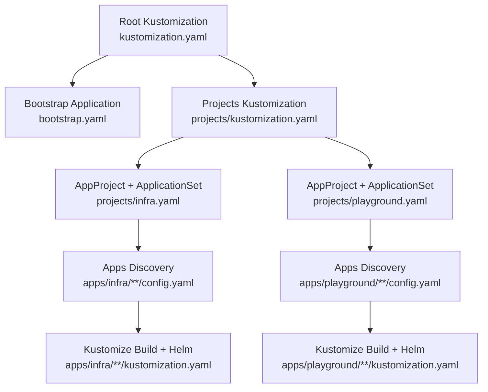
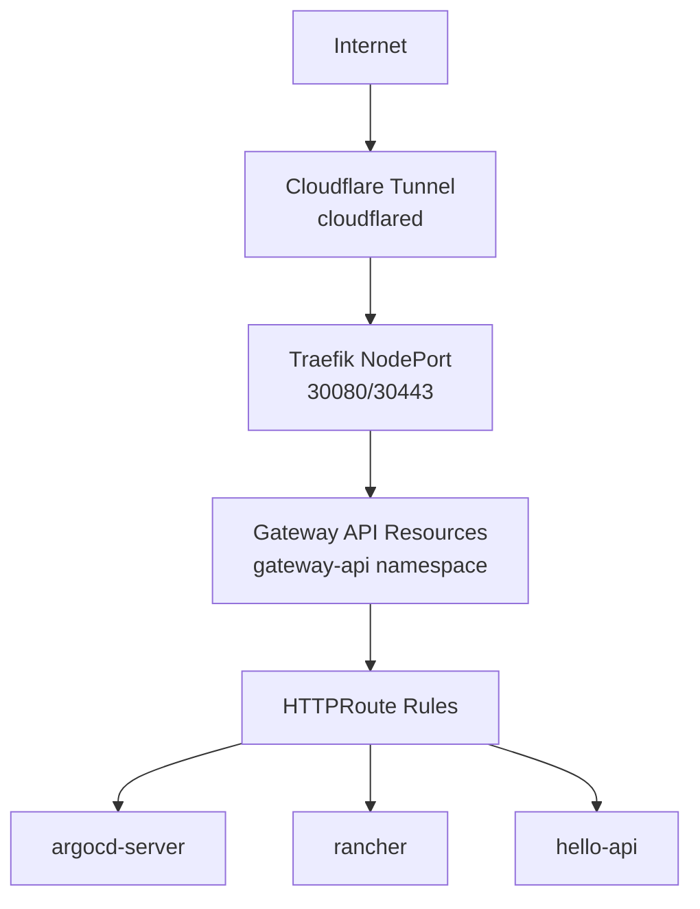
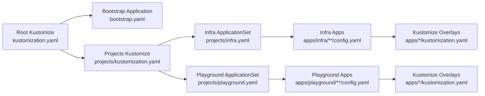

# Advanced Topics

<cite>
**Referenced Files in This Document**
- [README.md](file://README.md)
- [bootstrap.yaml](file://bootstrap.yaml)
- [kustomization.yaml](file://kustomization.yaml)
- [projects/kustomization.yaml](file://projects/kustomization.yaml)
- [projects/infra.yaml](file://projects/infra.yaml)
- [projects/playground.yaml](file://projects/playground.yaml)
- [apps/infra/cloudflared/config.yaml](file://apps/infra/cloudflared/config.yaml)
- [apps/infra/datadog/config.yaml](file://apps/infra/datadog/config.yaml)
- [apps/infra/gateway-api/config.yaml](file://apps/infra/gateway-api/config.yaml)
- [apps/playground/argocd-ingress/config.yaml](file://apps/playground/argocd-ingress/config.yaml)
- [apps/playground/cert-manager/config.yaml](file://apps/playground/cert-manager/config.yaml)
- [apps/playground/hello-api/config.yaml](file://apps/playground/hello-api/config.yaml)
- [apps/playground/rancher/config.yaml](file://apps/playground/rancher/config.yaml)
- [apps/infra/cloudflared/kustomization.yaml](file://apps/infra/cloudflared/kustomization.yaml)
- [apps/infra/datadog/kustomization.yaml](file://apps/infra/datadog/kustomization.yaml)
- [apps/infra/gateway-api/kustomization.yaml](file://apps/infra/gateway-api/kustomization.yaml)
- [apps/playground/argocd-ingress/kustomization.yaml](file://apps/playground/argocd-ingress/kustomization.yaml)
- [apps/playground/cert-manager/kustomization.yaml](file://apps/playground/cert-manager/kustomization.yaml)
- [apps/playground/hello-api/kustomization.yaml](file://apps/playground/hello-api/kustomization.yaml)
- [apps/playground/rancher/kustomization.yaml](file://apps/playground/rancher/kustomization.yaml)
</cite>

## Table of Contents
1. [Introduction](#introduction)
2. [Project Structure](#project-structure)
3. [Core Components](#core-components)
4. [Architecture Overview](#architecture-overview)
5. [Detailed Component Analysis](#detailed-component-analysis)
6. [Dependency Analysis](#dependency-analysis)
7. [Performance Considerations](#performance-considerations)
8. [Troubleshooting Guide](#troubleshooting-guide)
9. [Conclusion](#conclusion)
10. [Appendices](#appendices)

## Introduction
This document provides advanced GitOps infrastructure management guidance built on the repository’s ArgoCD, Kustomize, and Helm-based patterns. It focuses on developing custom Kustomize components, extending ApplicationSet patterns, integrating with external systems, and implementing advanced ArgoCD features such as automated rollouts, blue-green deployments, and progressive delivery strategies. It also covers integration patterns with external Helm registries and private repositories, CI/CD pipeline alignment, scaling and performance optimization, advanced networking configurations, and expert-level troubleshooting.

## Project Structure
The repository follows a layered GitOps structure:
- Root Kustomize builds a bootstrap Application manifest and injects repository URLs centrally.
- Bootstrap layer deploys the root Application, cluster resources, and private secrets.
- Projects define AppProjects and ApplicationSets that discover applications via config.yaml files.
- Apps are organized under infra and playground, each with Kustomize overlays and optional Helm charts.

**Diagram sources**
- [kustomization.yaml:1-21](file://kustomization.yaml#L1-L21)
- [bootstrap.yaml:1-26](file://bootstrap.yaml#L1-L26)
- [projects/kustomization.yaml:1-22](file://projects/kustomization.yaml#L1-L22)
- [projects/infra.yaml:1-85](file://projects/infra.yaml#L1-L85)
- [projects/playground.yaml:1-90](file://projects/playground.yaml#L1-L90)

**Section sources**
- [README.md:87-118](file://README.md#L87-L118)
- [README.md:57-86](file://README.md#L57-L86)

## Core Components
- Centralized repository URL injection via a shared component and Kustomize replacements ensures consistent repoURL propagation across bootstrap and ApplicationSets.
- ApplicationSets scan Git paths for config.yaml files and render Kustomize overlays with Helm support enabled.
- Sync waves orchestrate ordered deployment across AppProjects, cluster resources, ApplicationSets, secrets, platform components, and HTTPRoutes.

Key implementation references:
- Central replacement of repoURL in bootstrap Application
  - [kustomization.yaml:10-21](file://kustomization.yaml#L10-L21)
  - [bootstrap.yaml:15-18](file://bootstrap.yaml#L15-L18)
- ApplicationSet generators and template rendering
  - [projects/infra.yaml:33-60](file://projects/infra.yaml#L33-L60)
  - [projects/playground.yaml:33-60](file://projects/playground.yaml#L33-L60)
- Sync wave annotations and ordering
  - [projects/infra.yaml:6](file://projects/infra.yaml#L6)
  - [projects/playground.yaml:6](file://projects/playground.yaml#L6)
  - [apps/infra/cloudflared/config.yaml:3](file://apps/infra/cloudflared/config.yaml#L3)
  - [apps/infra/datadog/config.yaml:5](file://apps/infra/datadog/config.yaml#L5)
  - [apps/infra/gateway-api/config.yaml:5](file://apps/infra/gateway-api/config.yaml#L5)
  - [apps/playground/argocd-ingress/config.yaml:3](file://apps/playground/argocd-ingress/config.yaml#L3)
  - [apps/playground/cert-manager/config.yaml:3](file://apps/playground/cert-manager/config.yaml#L3)
  - [apps/playground/hello-api/config.yaml:3](file://apps/playground/hello-api/config.yaml#L3)
  - [apps/playground/rancher/config.yaml:3](file://apps/playground/rancher/config.yaml#L3)

**Section sources**
- [README.md:120-135](file://README.md#L120-L135)
- [README.md:76-86](file://README.md#L76-L86)

## Architecture Overview
The system integrates Cloudflare tunnels, Traefik as a Gateway API controller, and Gateway API resources to route traffic to ArgoCD, Rancher, and other services. Sync waves ensure proper ordering so Gateways and HTTPRoutes are ready before dependent workloads.

**Diagram sources**
- [README.md:5-48](file://README.md#L5-L48)
- [apps/playground/argocd-ingress/kustomization.yaml:1-9](file://apps/playground/argocd-ingress/kustomization.yaml#L1-L9)
- [apps/playground/rancher/kustomization.yaml:1-9](file://apps/playground/rancher/kustomization.yaml#L1-L9)
- [apps/playground/hello-api/kustomization.yaml:1-8](file://apps/playground/hello-api/kustomization.yaml#L1-L8)
- [apps/infra/gateway-api/kustomization.yaml:1-9](file://apps/infra/gateway-api/kustomization.yaml#L1-L9)

**Section sources**
- [README.md:38-56](file://README.md#L38-L56)

## Detailed Component Analysis

### Custom Kustomize Components
- Develop reusable overlays by adding new directories under apps/infra or apps/playground with a kustomization.yaml that sets namespace and references chart resources.
- Use Kustomize buildOptions to enable Helm processing during ArgoCD sync.
- Leverage per-app config.yaml to override destination namespace and set sync waves.

Recommended patterns:
- Per-app Kustomize overlay
  - [apps/infra/cloudflared/kustomization.yaml:1-8](file://apps/infra/cloudflared/kustomization.yaml#L1-L8)
  - [apps/infra/datadog/kustomization.yaml:1-8](file://apps/infra/datadog/kustomization.yaml#L1-L8)
  - [apps/infra/gateway-api/kustomization.yaml:1-9](file://apps/infra/gateway-api/kustomization.yaml#L1-L9)
  - [apps/playground/argocd-ingress/kustomization.yaml:1-9](file://apps/playground/argocd-ingress/kustomization.yaml#L1-L9)
  - [apps/playground/cert-manager/kustomization.yaml:1-6](file://apps/playground/cert-manager/kustomization.yaml#L1-L6)
  - [apps/playground/hello-api/kustomization.yaml:1-8](file://apps/playground/hello-api/kustomization.yaml#L1-L8)
  - [apps/playground/rancher/kustomization.yaml:1-9](file://apps/playground/rancher/kustomization.yaml#L1-L9)
- Per-app configuration overrides
  - [apps/infra/cloudflared/config.yaml:1-4](file://apps/infra/cloudflared/config.yaml#L1-L4)
  - [apps/infra/datadog/config.yaml:1-6](file://apps/infra/datadog/config.yaml#L1-L6)
  - [apps/infra/gateway-api/config.yaml:1-6](file://apps/infra/gateway-api/config.yaml#L1-L6)
  - [apps/playground/argocd-ingress/config.yaml:1-4](file://apps/playground/argocd-ingress/config.yaml#L1-L4)
  - [apps/playground/cert-manager/config.yaml:1-5](file://apps/playground/cert-manager/config.yaml#L1-L5)
  - [apps/playground/hello-api/config.yaml:1-4](file://apps/playground/hello-api/config.yaml#L1-L4)
  - [apps/playground/rancher/config.yaml:1-5](file://apps/playground/rancher/config.yaml#L1-L5)

**Section sources**
- [README.md:128-135](file://README.md#L128-L135)

### Extending ApplicationSet Patterns
- Extend discovery by adding new paths under apps/infra/**/config.yaml or apps/playground/**/config.yaml.
- Use generator values and templatePatch to inject labels, annotations, and dynamic namespacing.
- Control sync behavior with per-application annotations and syncOptions.

References:
- Generator scanning and template rendering
  - [projects/infra.yaml:33-60](file://projects/infra.yaml#L33-L60)
  - [projects/playground.yaml:33-60](file://projects/playground.yaml#L33-L60)
- TemplatePatch for labels and annotations
  - [projects/infra.yaml:74-85](file://projects/infra.yaml#L74-L85)
  - [projects/playground.yaml:75-90](file://projects/playground.yaml#L75-L90)
- Retry policy and automated sync
  - [projects/infra.yaml:61-72](file://projects/infra.yaml#L61-L72)
  - [projects/playground.yaml:61-75](file://projects/playground.yaml#L61-L75)

**Section sources**
- [README.md:128-135](file://README.md#L128-L135)

### Integrating with External Systems
- Private secrets: sync a dedicated private repository via bootstrap/secrets.yaml to avoid committing sensitive data to the public repository.
- External Helm registries: reference OCI or HTTPS Helm repositories in chart values or Kustomize overlays; ensure credentials are provisioned via ArgoCD or mounted Secrets.
- CI/CD pipelines: align pipeline triggers with Git push events; leverage ApplicationSet requeue intervals and ArgoCD auto-sync to reconcile changes.

References:
- Private secrets synchronization
  - [README.md:160-163](file://README.md#L160-L163)
- Helm registry preference
  - [README.md:125-126](file://README.md#L125-L126)

**Section sources**
- [README.md:125-126](file://README.md#L125-L126)
- [README.md:160-163](file://README.md#L160-L163)

### Advanced ArgoCD Features: Automated Rollouts, Blue-Green, Progressive Delivery
- Automated rollouts: enable automated sync with prune and self-heal to maintain drift-free state.
- Blue-green deployments: implement dual ApplicationSets or multiple ArgoCD Applications targeting different service endpoints; coordinate with Gateway API HTTPRoute host selection.
- Progressive delivery: use rollout strategies via Kustomize patches or Helm values to manage traffic splitting; combine with ApplicationSet templatePatch for dynamic configuration.

References:
- Automated sync and pruning
  - [projects/infra.yaml:61-65](file://projects/infra.yaml#L61-L65)
  - [projects/playground.yaml:61-65](file://projects/playground.yaml#L61-L65)
- TemplatePatch for dynamic configuration
  - [projects/infra.yaml:74-85](file://projects/infra.yaml#L74-L85)
  - [projects/playground.yaml:75-90](file://projects/playground.yaml#L75-L90)

**Section sources**
- [projects/infra.yaml:61-65](file://projects/infra.yaml#L61-L65)
- [projects/playground.yaml:61-65](file://projects/playground.yaml#L61-L65)
- [projects/infra.yaml:74-85](file://projects/infra.yaml#L74-L85)
- [projects/playground.yaml:75-90](file://projects/playground.yaml#L75-L90)

### Integration Patterns with External Helm Registries and Private Repositories
- Helm OCI: reference OCI Helm charts via Kustomize helmChart blocks; ensure ArgoCD has access to the OCI registry.
- HTTPS Helm repos: configure Helm repositories and credentials in ArgoCD; reference charts in Kustomize overlays.
- Private repositories: keep sensitive manifests in a separate private repository and sync via bootstrap/secrets.yaml.

References:
- Helm enablement in Kustomize buildOptions
  - [projects/infra.yaml:59](file://projects/infra.yaml#L59)
  - [projects/playground.yaml:59](file://projects/playground.yaml#L59)
- Private secrets repository
  - [README.md:160-163](file://README.md#L160-L163)

**Section sources**
- [projects/infra.yaml:59](file://projects/infra.yaml#L59)
- [projects/playground.yaml:59](file://projects/playground.yaml#L59)
- [README.md:160-163](file://README.md#L160-L163)

### Scaling Considerations and Performance Optimization
- Reduce sync churn: tune ApplicationSet requeueAfterSeconds to balance freshness vs. load.
- Optimize retry/backoff: adjust retry limits and backoff durations to handle transient failures gracefully.
- Namespace isolation: use per-app namespaces and AppProjects to minimize cross-project contention.
- Network path efficiency: ensure Gateway and HTTPRoute resources are applied in earlier waves to avoid repeated reconciliation.

References:
- Requeue interval and retry/backoff
  - [projects/infra.yaml:37](file://projects/infra.yaml#L37)
  - [projects/infra.yaml:66-72](file://projects/infra.yaml#L66-L72)
  - [projects/playground.yaml:37](file://projects/playground.yaml#L37)
  - [projects/playground.yaml:66-71](file://projects/playground.yaml#L66-L71)
- Sync wave ordering
  - [README.md:76-86](file://README.md#L76-L86)

**Section sources**
- [projects/infra.yaml:37](file://projects/infra.yaml#L37)
- [projects/infra.yaml:66-72](file://projects/infra.yaml#L66-L72)
- [projects/playground.yaml:37](file://projects/playground.yaml#L37)
- [projects/playground.yaml:66-71](file://projects/playground.yaml#L66-L71)
- [README.md:76-86](file://README.md#L76-L86)

### Advanced Networking Configurations
- Gateway API CRDs and controller: install Gateway API CRDs first, then deploy Traefik as the controller and expose services via HTTPRoute.
- Multi-tenant routing: use per-app HTTPRoute hostnames and TLS certificates managed by cert-manager.
- Cloudflare tunnel: route external traffic via cloudflared to internal services.

References:
- Gateway API installation and controller
  - [apps/infra/gateway-api/kustomization.yaml:1-9](file://apps/infra/gateway-api/kustomization.yaml#L1-L9)
- HTTPRoute exposure for ArgoCD
  - [apps/playground/argocd-ingress/kustomization.yaml:1-9](file://apps/playground/argocd-ingress/kustomization.yaml#L1-L9)
- Cloudflare tunnel integration
  - [README.md:5-48](file://README.md#L5-L48)

**Section sources**
- [apps/infra/gateway-api/kustomization.yaml:1-9](file://apps/infra/gateway-api/kustomization.yaml#L1-L9)
- [apps/playground/argocd-ingress/kustomization.yaml:1-9](file://apps/playground/argocd-ingress/kustomization.yaml#L1-L9)
- [README.md:5-48](file://README.md#L5-L48)

### Expert-Level Configuration Management
- Centralized repo URL management: propagate repoURL via a shared component and Kustomize replacements to avoid duplication.
- Strict sync ordering: use annotations to enforce sync waves across AppProjects, cluster resources, ApplicationSets, secrets, platform components, and HTTPRoutes.
- Idempotent and safe sync: enable prune and self-heal while carefully managing syncOptions to prevent destructive changes.

References:
- Central replacement of repoURL
  - [kustomization.yaml:10-21](file://kustomization.yaml#L10-L21)
  - [projects/kustomization.yaml:11-22](file://projects/kustomization.yaml#L11-L22)
- Sync wave annotations
  - [projects/infra.yaml:6](file://projects/infra.yaml#L6)
  - [projects/playground.yaml:6](file://projects/playground.yaml#L6)
  - [apps/infra/cloudflared/config.yaml:3](file://apps/infra/cloudflared/config.yaml#L3)
  - [apps/infra/datadog/config.yaml:5](file://apps/infra/datadog/config.yaml#L5)
  - [apps/infra/gateway-api/config.yaml:5](file://apps/infra/gateway-api/config.yaml#L5)
  - [apps/playground/argocd-ingress/config.yaml:3](file://apps/playground/argocd-ingress/config.yaml#L3)
  - [apps/playground/cert-manager/config.yaml:3](file://apps/playground/cert-manager/config.yaml#L3)
  - [apps/playground/hello-api/config.yaml:3](file://apps/playground/hello-api/config.yaml#L3)
  - [apps/playground/rancher/config.yaml:3](file://apps/playground/rancher/config.yaml#L3)

**Section sources**
- [kustomization.yaml:10-21](file://kustomization.yaml#L10-L21)
- [projects/kustomization.yaml:11-22](file://projects/kustomization.yaml#L11-L22)
- [README.md:76-86](file://README.md#L76-L86)

## Dependency Analysis
The dependency chain flows from root Kustomize to bootstrap, then to projects/Applications, and finally to app overlays and Helm charts. Centralized repo URL replacement ensures consistent configuration across all layers.

**Diagram sources**
- [kustomization.yaml:1-21](file://kustomization.yaml#L1-L21)
- [bootstrap.yaml:1-26](file://bootstrap.yaml#L1-L26)
- [projects/kustomization.yaml:1-22](file://projects/kustomization.yaml#L1-L22)
- [projects/infra.yaml:1-85](file://projects/infra.yaml#L1-L85)
- [projects/playground.yaml:1-90](file://projects/playground.yaml#L1-L90)

**Section sources**
- [README.md:57-75](file://README.md#L57-L75)

## Performance Considerations
- Tune ApplicationSet requeue intervals to balance freshness and API pressure.
- Use retry/backoff policies to handle transient failures without overwhelming the cluster.
- Apply sync waves to reduce contention and ensure prerequisites are present before dependent resources are reconciled.
- Enable Helm processing only when necessary to avoid unnecessary overhead.

[No sources needed since this section provides general guidance]

## Troubleshooting Guide
- Drift and divergence: rely on automated prune and self-heal; verify syncOptions and ensure no manual kubectl changes are made outside Git.
- Secret visibility: confirm private secrets are synced from the private repository and referenced by applications.
- Network routing: validate Gateway API resources exist before HTTPRoutes; check sync waves and namespace creation.
- ApplicationSet discovery: verify generator paths and values; confirm templatePatch does not introduce invalid configurations.

References:
- Automated sync and pruning
  - [projects/infra.yaml:61-65](file://projects/infra.yaml#L61-L65)
  - [projects/playground.yaml:61-65](file://projects/playground.yaml#L61-L65)
- Private secrets repository
  - [README.md:160-163](file://README.md#L160-L163)
- Sync wave ordering
  - [README.md:76-86](file://README.md#L76-L86)

**Section sources**
- [projects/infra.yaml:61-65](file://projects/infra.yaml#L61-L65)
- [projects/playground.yaml:61-65](file://projects/playground.yaml#L61-L65)
- [README.md:76-86](file://README.md#L76-L86)
- [README.md:160-163](file://README.md#L160-L163)

## Conclusion
This repository demonstrates a robust GitOps foundation using ArgoCD, Kustomize, and Helm. By leveraging centralized repo URL management, structured ApplicationSet patterns, and strict sync wave ordering, teams can scale safely while enabling advanced deployment strategies such as automated rollouts, blue-green deployments, and progressive delivery. Integration with external Helm registries and private repositories, combined with careful networking and performance tuning, supports production-grade infrastructure management.

[No sources needed since this section summarizes without analyzing specific files]

## Appendices
- Adding a new application: create a folder under apps/infra or apps/playground, add config.yaml and kustomization.yaml, and reference Helm charts via Kustomize with --enable-helm.
- Best practices: avoid manual kubectl edits, use Git for all changes, and prefer OCI Helm charts where possible.

**Section sources**
- [README.md:128-135](file://README.md#L128-L135)
- [README.md:120-127](file://README.md#L120-L127)