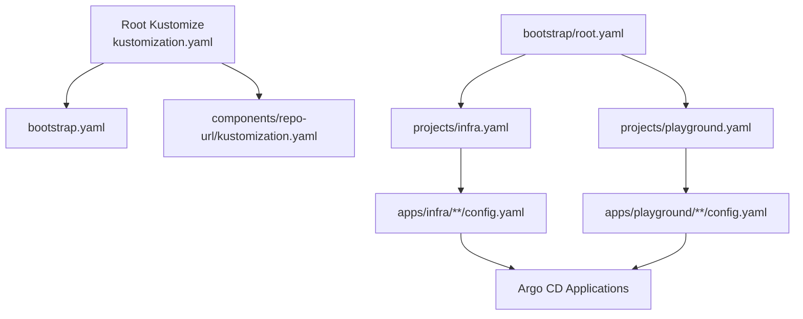
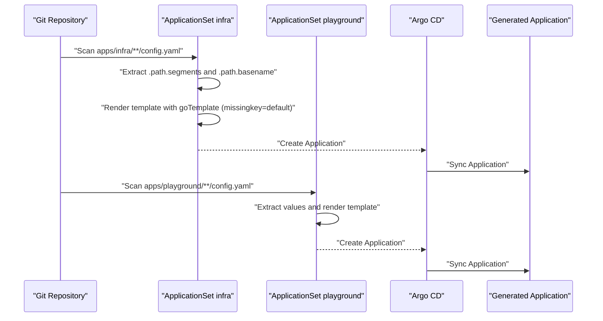
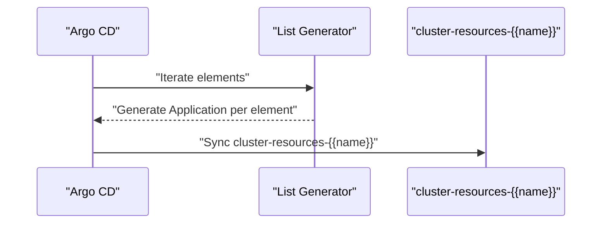
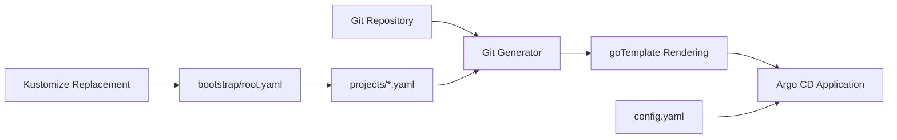

# ApplicationSet Patterns and Generators

<cite>
**Referenced Files in This Document**
- [README.md](file://README.md)
- [bootstrap.yaml](file://bootstrap.yaml)
- [kustomization.yaml](file://kustomization.yaml)
- [components/repo-url/kustomization.yaml](file://components/repo-url/kustomization.yaml)
- [bootstrap/root.yaml](file://bootstrap/root.yaml)
- [bootstrap/cluster-resources.yaml](file://bootstrap/cluster-resources.yaml)
- [projects/infra.yaml](file://projects/infra.yaml)
- [projects/playground.yaml](file://projects/playground.yaml)
- [apps/infra/gateway-api/config.yaml](file://apps/infra/gateway-api/config.yaml)
- [apps/playground/argocd-ingress/config.yaml](file://apps/playground/argocd-ingress/config.yaml)
- [apps/playground/rancher/config.yaml](file://apps/playground/rancher/config.yaml)
</cite>

## Table of Contents
1. [Introduction](#introduction)
2. [Project Structure](#project-structure)
3. [Core Components](#core-components)
4. [Architecture Overview](#architecture-overview)
5. [Detailed Component Analysis](#detailed-component-analysis)
6. [Dependency Analysis](#dependency-analysis)
7. [Performance Considerations](#performance-considerations)
8. [Troubleshooting Guide](#troubleshooting-guide)
9. [Conclusion](#conclusion)

## Introduction
This document explains ApplicationSet patterns and advanced generator configurations used in this GitOps repository. It focuses on the Git-based generator implementation, file path templating, dynamic value extraction, and the goTemplate engine with missingkey handling. It also documents advanced generator configurations such as cluster selection, namespace mapping, and application naming conventions, along with practical examples of complex generator setups, template patching mechanisms, and conditional application creation based on repository structure.

## Project Structure
The repository follows a layered GitOps structure:
- Root Kustomize build produces a bootstrap Application that injects repository URLs from a shared component.
- Bootstrap applies the root Application, which points to the projects directory containing AppProjects and ApplicationSets.
- ApplicationSets scan the apps tree for config.yaml files to generate per-application Argo CD Applications.
- Per-app config.yaml files define optional overrides such as destination namespace and sync wave.

**Diagram sources**
- [kustomization.yaml:1-21](file://kustomization.yaml#L1-L21)
- [bootstrap.yaml:1-26](file://bootstrap.yaml#L1-L26)
- [components/repo-url/kustomization.yaml:1-11](file://components/repo-url/kustomization.yaml#L1-L11)
- [bootstrap/root.yaml:1-37](file://bootstrap/root.yaml#L1-L37)
- [projects/infra.yaml:1-85](file://projects/infra.yaml#L1-L85)
- [projects/playground.yaml:1-90](file://projects/playground.yaml#L1-L90)

**Section sources**
- [README.md:57-118](file://README.md#L57-L118)
- [kustomization.yaml:1-21](file://kustomization.yaml#L1-L21)
- [bootstrap.yaml:1-26](file://bootstrap.yaml#L1-L26)
- [bootstrap/root.yaml:1-37](file://bootstrap/root.yaml#L1-L37)

## Core Components
- Root Kustomize and replacement pipeline: centralizes repo URLs and injects them into bootstrap and downstream resources.
- Bootstrap root Application: points to projects and ignores transient annotations for deterministic sync.
- ApplicationSets (infra and playground): use Git generators to discover apps by scanning config.yaml files and derive dynamic values from file paths.
- Per-app config.yaml: optional overrides for destination namespace, annotations (including sync wave), and other metadata.

Key implementation highlights:
- Git generator scans apps/*/config.yaml and exposes .path.path, .path.basename, and .path.segments for templating.
- goTemplate enabled with missingkey=default to prevent panics on undefined variables.
- Dynamic values cluster, project, app_path, name, repoURL extracted from path segments and basename.
- TemplatePatch merges labels and annotations from config.yaml into generated Applications.

**Section sources**
- [README.md:68-74](file://README.md#L68-L74)
- [projects/infra.yaml:33-45](file://projects/infra.yaml#L33-L45)
- [projects/playground.yaml:33-45](file://projects/playground.yaml#L33-L45)
- [projects/infra.yaml:31-32](file://projects/infra.yaml#L31-L32)
- [projects/playground.yaml:31-32](file://projects/playground.yaml#L31-L32)
- [projects/infra.yaml:74-84](file://projects/infra.yaml#L74-L84)
- [projects/playground.yaml:75-89](file://projects/playground.yaml#L75-L89)

## Architecture Overview
The ApplicationSet architecture uses a Git-based generator to discover applications and a goTemplate engine to render Argo CD Applications dynamically.

**Diagram sources**
- [projects/infra.yaml:33-60](file://projects/infra.yaml#L33-L60)
- [projects/playground.yaml:33-60](file://projects/playground.yaml#L33-L60)
- [projects/infra.yaml:46-58](file://projects/infra.yaml#L46-L58)
- [projects/playground.yaml:46-58](file://projects/playground.yaml#L46-L58)

## Detailed Component Analysis

### Git Generator and File Path Templating
- Generator type: git
- Revision: fixed base-manifest
- Requeue interval: 20 seconds
- Discovery pattern: apps/{infra,playground}/**/config.yaml
- Values extracted:
  - cluster: derived from path segment 1
  - project: derived from path segment 1
  - app_path: full path to config.yaml
  - name: basename of config.yaml
  - repoURL: placeholder resolved via Kustomize replacement

Dynamic value extraction and template substitution:
- .path.segments: array of path parts enabling structured access (e.g., index 1 for cluster, index 2 for app name).
- .path.basename: filename of config.yaml.
- .path.path: absolute path to config.yaml.

These values feed into template fields such as metadata.name, destination.namespace, and source.path.

**Section sources**
- [projects/infra.yaml:34-45](file://projects/infra.yaml#L34-L45)
- [projects/playground.yaml:34-45](file://projects/playground.yaml#L34-L45)
- [projects/infra.yaml:46-58](file://projects/infra.yaml#L46-L58)
- [projects/playground.yaml:46-58](file://projects/playground.yaml#L46-L58)

### goTemplate Engine and Missingkey Handling
- goTemplate flag enabled for both ApplicationSets.
- goTemplateOptions includes missingkey=default to avoid panics when accessing undefined keys in templates.
- Template expressions use constructs like default, printf, and trimSuffix to produce robust rendering.

Practical effects:
- If .appName or .destNamespace are absent, defaults resolve safely.
- String manipulation ensures correct derivation of application names and source paths.

**Section sources**
- [projects/infra.yaml:31-32](file://projects/infra.yaml#L31-L32)
- [projects/playground.yaml:31-32](file://projects/playground.yaml#L31-L32)
- [projects/infra.yaml:48](file://projects/infra.yaml#L48)
- [projects/infra.yaml:52](file://projects/infra.yaml#L52)
- [projects/infra.yaml:58](file://projects/infra.yaml#L58)

### Advanced Generator Configurations
- Cluster selection: cluster and project values are derived from path segments, allowing multi-cluster routing by organizing apps under different top-level folders.
- Namespace mapping: destination.namespace resolves to either the value from config.yaml (.destNamespace) or falls back to the app’s directory name.
- Application naming conventions: metadata.name uses a composite of project and app directory name, with an override via .appName if present.

Per-app overrides:
- apps/infra/gateway-api/config.yaml sets destNamespace to gateway-api and adds syncOptions.
- apps/playground/argocd-ingress/config.yaml sets destNamespace to argocd and adds a sync wave annotation.
- apps/playground/rancher/config.yaml sets destNamespace to cattle-system and adds a sync wave annotation.

**Section sources**
- [projects/infra.yaml:46-58](file://projects/infra.yaml#L46-L58)
- [projects/playground.yaml:46-58](file://projects/playground.yaml#L46-L58)
- [apps/infra/gateway-api/config.yaml:1-6](file://apps/infra/gateway-api/config.yaml#L1-L6)
- [apps/playground/argocd-ingress/config.yaml:1-4](file://apps/playground/argocd-ingress/config.yaml#L1-L4)
- [apps/playground/rancher/config.yaml:1-5](file://apps/playground/rancher/config.yaml#L1-L5)

### Template Patching Mechanisms
Both ApplicationSets define templatePatch to merge labels and annotations from config.yaml into generated Applications:
- Iterates over .labels and .annotations to inject key-value pairs.
- Enables flexible labeling and annotation propagation without hardcoding in the main template.

Additionally, playground ApplicationSet augments syncOptions via templatePatch to enable namespace creation and skip-dry-run behaviors.

**Section sources**
- [projects/infra.yaml:74-84](file://projects/infra.yaml#L74-L84)
- [projects/playground.yaml:75-89](file://projects/playground.yaml#L75-L89)

### Conditional Application Creation Based on Repository Structure
- The Git generator conditionally creates Applications only when a config.yaml exists at the expected path.
- Per-app config.yaml can alter behavior:
  - destNamespace controls the target namespace.
  - annotations can set sync waves for ordered synchronization.
  - syncPolicy and syncOptions can be extended via templatePatch.

This enables selective activation of applications depending on presence and content of config.yaml.

**Section sources**
- [projects/infra.yaml:38-39](file://projects/infra.yaml#L38-L39)
- [projects/playground.yaml:38-39](file://projects/playground.yaml#L38-L39)
- [apps/infra/gateway-api/config.yaml:1-6](file://apps/infra/gateway-api/config.yaml#L1-L6)
- [apps/playground/argocd-ingress/config.yaml:1-4](file://apps/playground/argocd-ingress/config.yaml#L1-L4)
- [apps/playground/rancher/config.yaml:1-5](file://apps/playground/rancher/config.yaml#L1-L5)

### List Generator for Cluster Resources
While not part of the Git generator family, the cluster-resources ApplicationSet demonstrates a complementary generator (list) to provision shared cluster resources consistently across environments.

**Diagram sources**
- [bootstrap/cluster-resources.yaml:9-32](file://bootstrap/cluster-resources.yaml#L9-L32)

**Section sources**
- [bootstrap/cluster-resources.yaml:1-33](file://bootstrap/cluster-resources.yaml#L1-L33)

## Dependency Analysis
The system relies on a strict dependency chain:
- Root Kustomize build depends on components/repo-url to supply repo URLs.
- bootstrap/root.yaml depends on projects and ignores transient differences for stability.
- ApplicationSets depend on Git repository structure and config.yaml presence.
- Per-app config.yaml overrides influence final Application behavior.

**Diagram sources**
- [kustomization.yaml:10-20](file://kustomization.yaml#L10-L20)
- [bootstrap/root.yaml:15-17](file://bootstrap/root.yaml#L15-L17)
- [projects/infra.yaml:33-60](file://projects/infra.yaml#L33-L60)
- [projects/playground.yaml:33-60](file://projects/playground.yaml#L33-L60)

**Section sources**
- [kustomization.yaml:1-21](file://kustomization.yaml#L1-L21)
- [bootstrap/root.yaml:19-28](file://bootstrap/root.yaml#L19-L28)
- [projects/infra.yaml:33-60](file://projects/infra.yaml#L33-L60)
- [projects/playground.yaml:33-60](file://projects/playground.yaml#L33-L60)

## Performance Considerations
- Requeue interval: generators check for changes every 20 seconds, balancing responsiveness with load.
- goTemplateOptions: missingkey=default prevents template evaluation failures and reduces retries.
- Kustomize buildOptions: --enable-helm allows complex chart rendering without manual steps.
- Sync waves: ordered waves reduce contention and race conditions during startup sequences.

[No sources needed since this section provides general guidance]

## Troubleshooting Guide
Common issues and resolutions:
- Undefined template variables: ensure goTemplateOptions includes missingkey=default to avoid panics.
- Incorrect destination namespace: verify .destNamespace in config.yaml and fallback logic in template.
- Missing Applications: confirm Git generator path matches actual config.yaml locations and that files are committed.
- Namespace creation failures: enable CreateNamespace via syncOptions in templatePatch for new namespaces.
- Sync order problems: adjust annotations for argocd.argoproj.io/sync-wave in config.yaml.

**Section sources**
- [projects/infra.yaml:31-32](file://projects/infra.yaml#L31-L32)
- [projects/playground.yaml:72-74](file://projects/playground.yaml#L72-L74)
- [apps/playground/argocd-ingress/config.yaml:2-3](file://apps/playground/argocd-ingress/config.yaml#L2-L3)
- [apps/playground/rancher/config.yaml:2-3](file://apps/playground/rancher/config.yaml#L2-L3)

## Conclusion
This repository demonstrates a robust ApplicationSet-driven GitOps pipeline:
- Git generators scan the repository for config.yaml files and derive dynamic values from file paths.
- goTemplate with missingkey=default ensures resilient rendering.
- Advanced configurations support multi-cluster routing, namespace mapping, and naming conventions.
- TemplatePatch enables flexible label/annotation propagation and sync behavior customization.
- The structure supports ordered synchronization via sync waves and reliable namespace provisioning through list generators.

[No sources needed since this section summarizes without analyzing specific files]