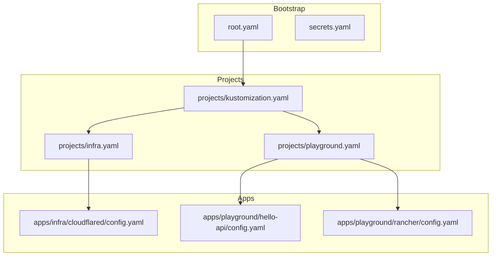
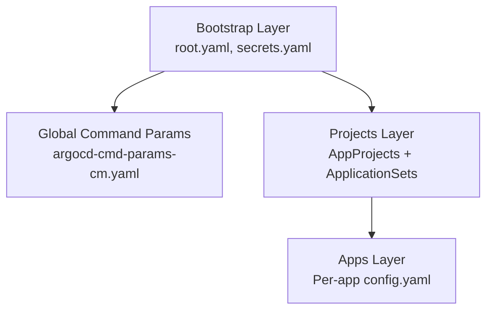
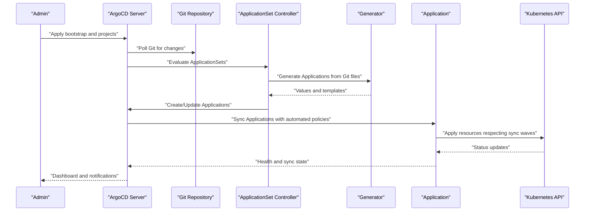
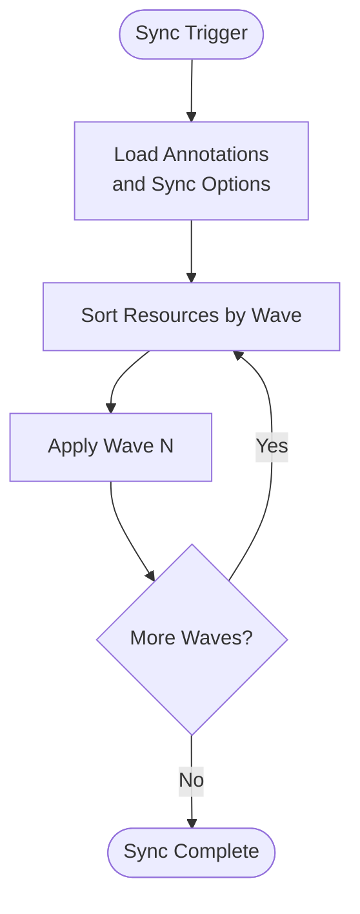
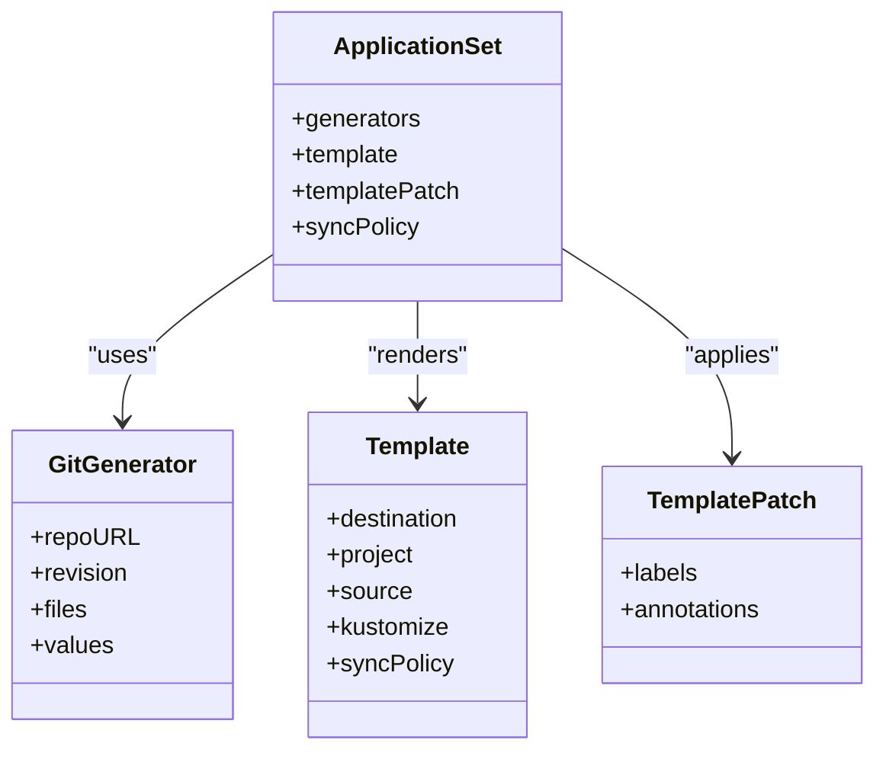
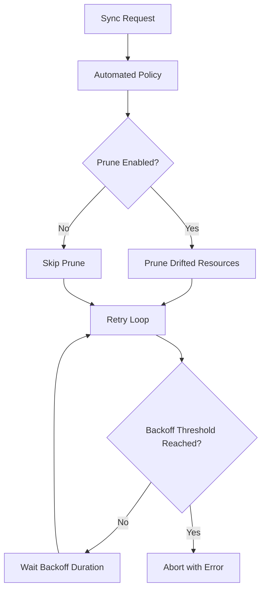
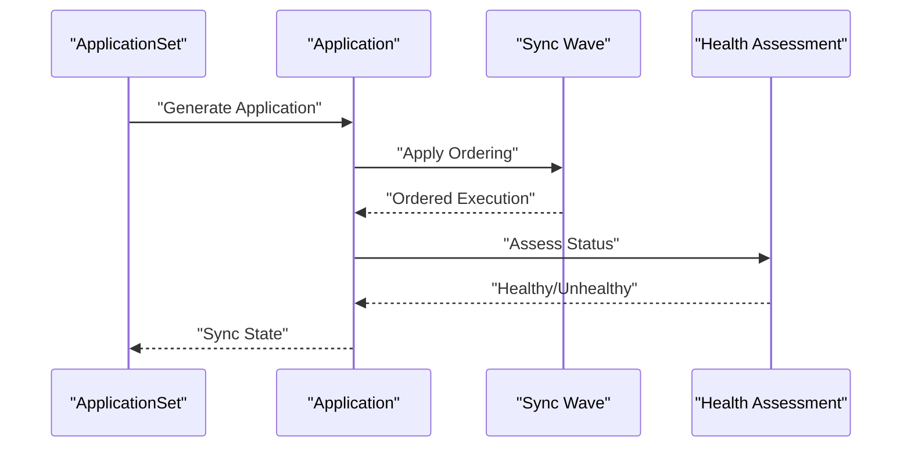
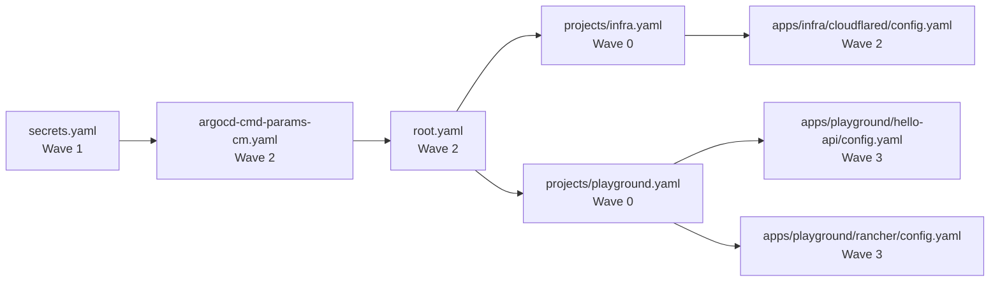

# ArgoCD Advanced Features

<cite>
**Referenced Files in This Document**
- [argocd-cmd-params-cm.yaml](file://apps/playground/argocd-ingress/chart/argocd-cmd-params-cm.yaml)
- [root.yaml](file://bootstrap/root.yaml)
- [secrets.yaml](file://bootstrap/secrets.yaml)
- [argo_cd.md](file://guide/argocd/argo_cd.md)
- [argo_cd.md](file://guide/k8s_manifest_secrets/argo_cd.md)
- [kustomization.yaml](file://projects/kustomization.yaml)
- [infra.yaml](file://projects/infra.yaml)
- [playground.yaml](file://projects/playground.yaml)
- [cloudflared config.yaml](file://apps/infra/cloudflared/config.yaml)
- [hello-api config.yaml](file://apps/playground/hello-api/config.yaml)
- [rancher config.yaml](file://apps/playground/rancher/config.yaml)
</cite>

## Table of Contents
1. [Introduction](#introduction)
2. [Project Structure](#project-structure)
3. [Core Components](#core-components)
4. [Architecture Overview](#architecture-overview)
5. [Detailed Component Analysis](#detailed-component-analysis)
6. [Dependency Analysis](#dependency-analysis)
7. [Performance Considerations](#performance-considerations)
8. [Troubleshooting Guide](#troubleshooting-guide)
9. [Conclusion](#conclusion)

## Introduction
This document explains advanced ArgoCD features and configuration patterns demonstrated in the repository. It focuses on automated rollout strategies via sync waves, advanced ApplicationSet patterns with Git generators and dynamic resource allocation, robust sync policies with retry mechanisms, automated dependency management, health assessment overrides, custom sync behaviors, and integration with external systems through plugins and webhooks. The content is derived from real manifests and guides within the repository.

## Project Structure
The repository organizes ArgoCD configuration across several layers:
- Bootstrap layer defines foundational Applications and global settings.
- Projects layer defines AppProjects and ApplicationSets per environment (infra, playground).
- Apps layer contains per-application configurations and per-environment settings.
- Guides provide installation steps and operational notes.

**Diagram sources**
- [root.yaml:1-37](file://bootstrap/root.yaml#L1-L37)
- [secrets.yaml:1-24](file://bootstrap/secrets.yaml#L1-L24)
- [kustomization.yaml:1-22](file://projects/kustomization.yaml#L1-L22)
- [infra.yaml:1-85](file://projects/infra.yaml#L1-L85)
- [playground.yaml:1-90](file://projects/playground.yaml#L1-L90)
- [cloudflared config.yaml:1-4](file://apps/infra/cloudflared/config.yaml#L1-L4)
- [hello-api config.yaml:1-4](file://apps/playground/hello-api/config.yaml#L1-L4)
- [rancher config.yaml:1-5](file://apps/playground/rancher/config.yaml#L1-L5)

**Section sources**
- [root.yaml:1-37](file://bootstrap/root.yaml#L1-L37)
- [secrets.yaml:1-24](file://bootstrap/secrets.yaml#L1-L24)
- [kustomization.yaml:1-22](file://projects/kustomization.yaml#L1-L22)
- [infra.yaml:1-85](file://projects/infra.yaml#L1-L85)
- [playground.yaml:1-90](file://projects/playground.yaml#L1-L90)

## Core Components
- Root Application: Orchestrates top-level synchronization with automated policies, pruning, and self-healing. It also ignores differences for ApplicationSet and a ConfigMap to stabilize bootstrapping.
- Secrets Application: Manages sensitive resources with a dedicated sync wave to ensure prerequisites are applied first.
- Infra ApplicationSet: Generates Applications from Git paths under apps/infra, applying automated sync and retry policies.
- Playground ApplicationSet: Similar to infra but tailored for development workloads, with additional sync options.
- Per-app Configurations: Provide per-directory annotations and destination namespaces to control ordering and placement.

Key advanced features visible in these components:
- Sync waves via annotations to enforce ordering across resources.
- Automated sync with pruning and self-healing.
- Retry policies with bounded backoff.
- Dynamic resource allocation via ApplicationSet Git generators and templatePatch.
- Kustomize build options enabling Helm support.

**Section sources**
- [root.yaml:19-36](file://bootstrap/root.yaml#L19-L36)
- [secrets.yaml:6-23](file://bootstrap/secrets.yaml#L6-L23)
- [infra.yaml:33-85](file://projects/infra.yaml#L33-L85)
- [playground.yaml:33-90](file://projects/playground.yaml#L33-L90)
- [cloudflared config.yaml:1-4](file://apps/infra/cloudflared/config.yaml#L1-L4)
- [hello-api config.yaml:1-4](file://apps/playground/hello-api/config.yaml#L1-L4)
- [rancher config.yaml:1-5](file://apps/playground/rancher/config.yaml#L1-L5)

## Architecture Overview
The system follows a layered approach:
- Bootstrap layer applies foundational resources and global command parameters.
- Projects layer defines AppProjects and ApplicationSets that generate Applications from Git.
- Apps layer supplies per-application configuration files that influence sync ordering and destination.

**Diagram sources**
- [root.yaml:1-37](file://bootstrap/root.yaml#L1-L37)
- [secrets.yaml:1-24](file://bootstrap/secrets.yaml#L1-L24)
- [argocd-cmd-params-cm.yaml:1-13](file://apps/playground/argocd-ingress/chart/argocd-cmd-params-cm.yaml#L1-L13)
- [infra.yaml:1-85](file://projects/infra.yaml#L1-L85)
- [playground.yaml:1-90](file://projects/playground.yaml#L1-L90)

## Detailed Component Analysis

### Root Application and Global Settings
- Automated sync: allowEmpty, prune, selfHeal.
- Global sync options: allowEmpty and CreateNamespace.
- Ignores differences for ApplicationSet and a ConfigMap to avoid spurious drift during bootstrap.
- Destination: local cluster service account.

Operational implications:
- Ensures idempotent bootstrap and prevents destructive pruning until dependencies are established.
- Simplifies initial setup by tolerating empty diffs and creating namespaces automatically.

**Section sources**
- [root.yaml:19-36](file://bootstrap/root.yaml#L19-L36)

### Secrets Application with Sync Waves
- Finalizers configured for safe deletion.
- Dedicated sync wave annotation ensures secrets are applied before dependent resources.
- Automated sync with pruning and self-healing.

Operational implications:
- Prevents race conditions where dependent resources might fail to find required secrets.
- Supports controlled teardown with finalizers.

**Section sources**
- [secrets.yaml:6-23](file://bootstrap/secrets.yaml#L6-L23)

### Infra ApplicationSet: Git Generator and Template Patch
- Generator: Reads Git files matching apps/infra/**/config.yaml, extracting values such as cluster, project, app_path, name, and repoURL.
- Template: Sets destination, project, source repoURL, targetRevision, path, and Kustomize build options.
- Automated sync with pruning and self-healing.
- Retry policy: bounded backoff with fixed duration and max duration.
- TemplatePatch: Adds labels and annotations dynamically, including per-app overrides.

Operational implications:
- Centralized generation of Applications from a single Git path pattern.
- Consistent sync behavior across generated Applications with shared retry strategy.
- Dynamic customization per app via templatePatch.

**Section sources**
- [infra.yaml:33-85](file://projects/infra.yaml#L33-L85)

### Playground ApplicationSet: Development Workflows
- Similar generator and template to infra.
- Additional sync options: CreateNamespace and SkipDryRunOnMissingResource.
- TemplatePatch supports per-app overrides and sync options.

Operational implications:
- Tailored behavior for development environments with relaxed dry-run checks.
- Streamlined creation of namespaces for ephemeral workloads.

**Section sources**
- [playground.yaml:33-90](file://projects/playground.yaml#L33-L90)

### Per-Application Configurations and Sync Waves
- apps/infra/cloudflared/config.yaml: Sets destination namespace and adds a sync wave to ensure late application after prerequisites.
- apps/playground/hello-api/config.yaml: Sets destination namespace and adds a sync wave to ensure late application after prerequisites.
- apps/playground/rancher/config.yaml: Sets destination namespace and adds a sync wave to ensure late application after prerequisites.

Operational implications:
- Enforces deterministic ordering across resources within an application.
- Prevents partial application of dependent resources.

**Section sources**
- [cloudflared config.yaml:1-4](file://apps/infra/cloudflared/config.yaml#L1-L4)
- [hello-api config.yaml:1-4](file://apps/playground/hello-api/config.yaml#L1-L4)
- [rancher config.yaml:1-5](file://apps/playground/rancher/config.yaml#L1-L5)

### Kustomization and Repo URL Replacement
- Replaces repoURL in ApplicationSet generators using a ConfigMap value.
- Enables centralized repository configuration without editing each ApplicationSet.

Operational implications:
- Simplifies multi-cluster or multi-repo setups by changing a single ConfigMap.
- Reduces duplication and human error.

**Section sources**
- [kustomization.yaml:11-22](file://projects/kustomization.yaml#L11-L22)

### Global Command Parameters
- argocd-cmd-params-cm: Sets server insecure mode and assigns a sync wave to ensure it is applied after secrets.
- Supports Kustomize build options enabling Helm.

Operational implications:
- Provides global server configuration with predictable ordering.
- Extends Kustomize capabilities for advanced templating.

**Section sources**
- [argocd-cmd-params-cm.yaml:1-13](file://apps/playground/argocd-ingress/chart/argocd-cmd-params-cm.yaml#L1-L13)

### Installation and Operational Guidance
- Installation steps for ArgoCD, exposing the UI, applying repository secrets, and bootstrapping.
- Notes on deleting bootstrap safely using finalizers.

Operational implications:
- Standardized setup and teardown procedures.
- Security posture improved by centralizing repository credentials.

**Section sources**
- [argo_cd.md:1-34](file://guide/argocd/argo_cd.md#L1-L34)

## Architecture Overview

**Diagram sources**
- [root.yaml:1-37](file://bootstrap/root.yaml#L1-L37)
- [infra.yaml:33-85](file://projects/infra.yaml#L33-L85)
- [playground.yaml:33-90](file://projects/playground.yaml#L33-L90)
- [cloudflared config.yaml:1-4](file://apps/infra/cloudflared/config.yaml#L1-L4)
- [hello-api config.yaml:1-4](file://apps/playground/hello-api/config.yaml#L1-L4)
- [rancher config.yaml:1-5](file://apps/playground/rancher/config.yaml#L1-L5)

## Detailed Component Analysis

### Automated Rollout Strategies Using Sync Waves
- Sync waves are implemented via annotations on ConfigMaps, Secrets, and per-app config files.
- Wave values define execution order: earlier waves apply prerequisites, later waves apply dependent resources.
- Combined with automated sync, this enables controlled rollouts across clusters and namespaces.

**Diagram sources**
- [secrets.yaml:6-7](file://bootstrap/secrets.yaml#L6-L7)
- [argocd-cmd-params-cm.yaml:10-10](file://apps/playground/argocd-ingress/chart/argocd-cmd-params-cm.yaml#L10-L10)
- [cloudflared config.yaml:3-3](file://apps/infra/cloudflared/config.yaml#L3-L3)
- [hello-api config.yaml:3-3](file://apps/playground/hello-api/config.yaml#L3-L3)
- [rancher config.yaml:3-3](file://apps/playground/rancher/config.yaml#L3-L3)

**Section sources**
- [secrets.yaml:6-7](file://bootstrap/secrets.yaml#L6-L7)
- [argocd-cmd-params-cm.yaml:10-10](file://apps/playground/argocd-ingress/chart/argocd-cmd-params-cm.yaml#L10-L10)
- [cloudflared config.yaml:3-3](file://apps/infra/cloudflared/config.yaml#L3-L3)
- [hello-api config.yaml:3-3](file://apps/playground/hello-api/config.yaml#L3-L3)
- [rancher config.yaml:3-3](file://apps/playground/rancher/config.yaml#L3-L3)

### Advanced ApplicationSet Patterns
- Git generator scans specific paths and extracts structured values for template rendering.
- TemplatePatch enables dynamic label and annotation injection, including per-app overrides.
- Kustomize build options enable advanced templating and Helm support.

**Diagram sources**
- [infra.yaml:33-85](file://projects/infra.yaml#L33-L85)
- [playground.yaml:33-90](file://projects/playground.yaml#L33-L90)

**Section sources**
- [infra.yaml:33-85](file://projects/infra.yaml#L33-L85)
- [playground.yaml:33-90](file://projects/playground.yaml#L33-L90)

### Advanced Sync Policies, Retry Mechanisms, and Error Handling
- Automated sync with prune and selfHeal enabled.
- Retry policy with bounded backoff and maximum duration.
- Sync options include CreateNamespace and SkipDryRunOnMissingResource for robustness.

**Diagram sources**
- [infra.yaml:61-71](file://projects/infra.yaml#L61-L71)
- [playground.yaml:61-74](file://projects/playground.yaml#L61-L74)

**Section sources**
- [infra.yaml:61-71](file://projects/infra.yaml#L61-L71)
- [playground.yaml:61-74](file://projects/playground.yaml#L61-L74)

### Automated Dependency Management and Health Overrides
- Sync waves enforce dependency ordering across resources.
- Automated policies ensure reconciliation and healing.
- Health overrides can be managed via ApplicationSet templates and per-app configs.

**Diagram sources**
- [root.yaml:19-36](file://bootstrap/root.yaml#L19-L36)
- [infra.yaml:33-85](file://projects/infra.yaml#L33-L85)
- [playground.yaml:33-90](file://projects/playground.yaml#L33-L90)

**Section sources**
- [root.yaml:19-36](file://bootstrap/root.yaml#L19-L36)
- [infra.yaml:33-85](file://projects/infra.yaml#L33-L85)
- [playground.yaml:33-90](file://projects/playground.yaml#L33-L90)

### Custom Sync Behaviors and Kustomize Build Options
- Kustomize build options enable advanced templating and Helm support.
- Sync options such as CreateNamespace and SkipDryRunOnMissingResource tailor behavior per environment.

**Section sources**
- [infra.yaml:59-60](file://projects/infra.yaml#L59-L60)
- [playground.yaml:59-74](file://projects/playground.yaml#L59-L74)
- [kustomization.yaml:11-22](file://projects/kustomization.yaml#L11-L22)

### Integration with External Systems
- Plugins: Kustomize build options enable integration with external tools and Helm charts.
- Webhooks: Not explicitly configured in the repository; can be integrated externally via ArgoCD’s webhook controller.
- Custom Controllers: Not shown in the repository; can be introduced alongside ApplicationSets for specialized workflows.

**Section sources**
- [argocd-cmd-params-cm.yaml:11-12](file://apps/playground/argocd-ingress/chart/argocd-cmd-params-cm.yaml#L11-L12)
- [argo_cd.md:1-34](file://guide/argocd/argo_cd.md#L1-L34)

## Dependency Analysis
The following diagram shows how bootstrap, projects, and apps depend on each other and how sync waves influence execution order.

**Diagram sources**
- [secrets.yaml:6-7](file://bootstrap/secrets.yaml#L6-L7)
- [argocd-cmd-params-cm.yaml:10-10](file://apps/playground/argocd-ingress/chart/argocd-cmd-params-cm.yaml#L10-L10)
- [root.yaml:1-37](file://bootstrap/root.yaml#L1-L37)
- [infra.yaml:26-27](file://projects/infra.yaml#L26-L27)
- [playground.yaml:25-27](file://projects/playground.yaml#L25-L27)
- [cloudflared config.yaml:3-3](file://apps/infra/cloudflared/config.yaml#L3-L3)
- [hello-api config.yaml:3-3](file://apps/playground/hello-api/config.yaml#L3-L3)
- [rancher config.yaml:3-3](file://apps/playground/rancher/config.yaml#L3-L3)

**Section sources**
- [secrets.yaml:6-7](file://bootstrap/secrets.yaml#L6-L7)
- [argocd-cmd-params-cm.yaml:10-10](file://apps/playground/argocd-ingress/chart/argocd-cmd-params-cm.yaml#L10-L10)
- [root.yaml:1-37](file://bootstrap/root.yaml#L1-L37)
- [infra.yaml:26-27](file://projects/infra.yaml#L26-L27)
- [playground.yaml:25-27](file://projects/playground.yaml#L25-L27)
- [cloudflared config.yaml:3-3](file://apps/infra/cloudflared/config.yaml#L3-L3)
- [hello-api config.yaml:3-3](file://apps/playground/hello-api/config.yaml#L3-L3)
- [rancher config.yaml:3-3](file://apps/playground/rancher/config.yaml#L3-L3)

## Performance Considerations
- Use requeueAfterSeconds in ApplicationSet generators to balance freshness and load.
- Prefer bounded retry backoff to avoid thundering herds.
- Limit dry-run operations where appropriate using SkipDryRunOnMissingResource to reduce API pressure.
- Centralize repository URLs via Kustomize replacements to minimize repeated configuration churn.

## Troubleshooting Guide
- Bootstrap deletion: Remove finalizers before force-deleting the bootstrap Application to avoid orphaned resources.
- Secrets availability: Ensure the secrets Application runs before dependent resources by verifying sync wave ordering.
- Sync failures: Review automated policies and retry configuration; confirm Kustomize build options are compatible with target resources.
- Ordering issues: Adjust sync wave annotations to ensure prerequisites are applied before dependents.

**Section sources**
- [argo_cd.md:29-33](file://guide/argocd/argo_cd.md#L29-L33)
- [secrets.yaml:8-9](file://bootstrap/secrets.yaml#L8-L9)
- [infra.yaml:61-71](file://projects/infra.yaml#L61-L71)
- [playground.yaml:61-74](file://projects/playground.yaml#L61-L74)

## Conclusion
This repository demonstrates a production-ready ArgoCD setup emphasizing:
- Controlled rollout ordering via sync waves.
- Scalable ApplicationSet generation with Git-based templates and dynamic overrides.
- Robust sync policies with retries and configurable options.
- Centralized repository configuration and Kustomize enhancements.
These patterns provide a solid foundation for advanced deployment strategies, including blue-green, canary, and progressive delivery when combined with Git-based branching and tag-based release workflows.