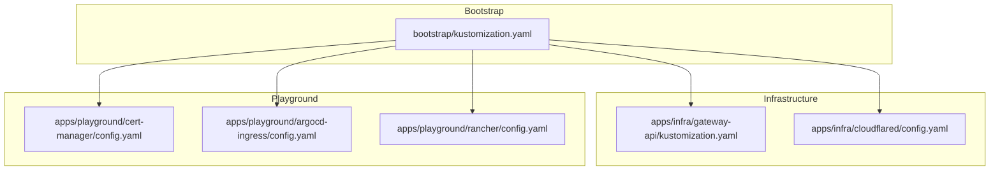
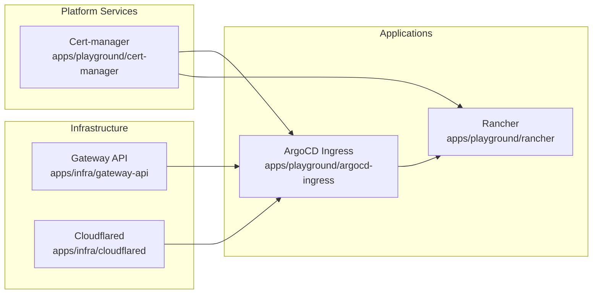
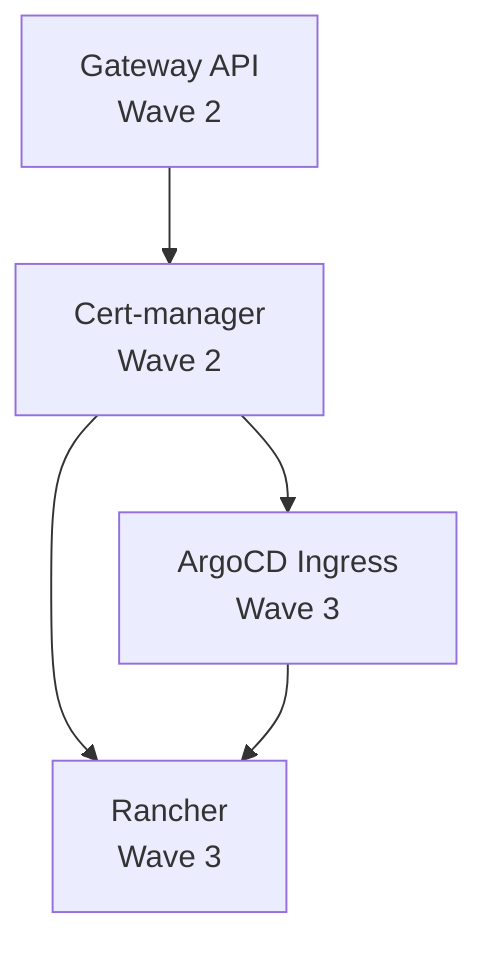
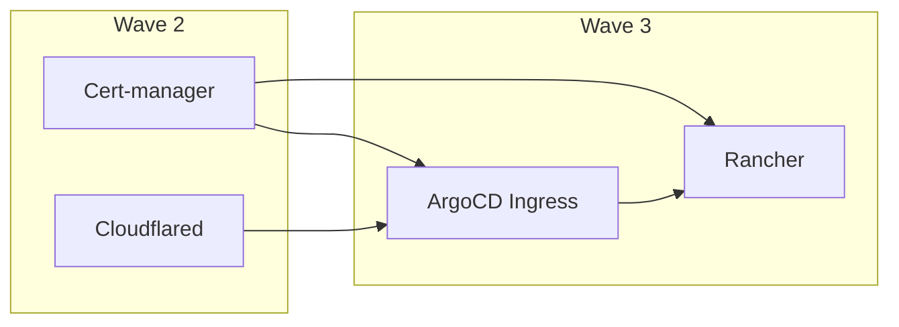

# Dependency Management and Ordering

<cite>
**Referenced Files in This Document**
- [apps/playground/rancher/config.yaml](file://apps/playground/rancher/config.yaml)
- [apps/playground/cert-manager/config.yaml](file://apps/playground/cert-manager/config.yaml)
- [apps/infra/gateway-api/config.yaml](file://apps/infra/gateway-api/config.yaml)
- [apps/playground/argocd-ingress/config.yaml](file://apps/playground/argocd-ingress/config.yaml)
- [apps/infra/cloudflared/config.yaml](file://apps/infra/cloudflared/config.yaml)
- [apps/infra/gateway-api/kustomization.yaml](file://apps/infra/gateway-api/kustomization.yaml)
- [apps/playground/argocd-ingress/kustomization.yaml](file://apps/playground/argocd-ingress/kustomization.yaml)
- [apps/playground/cert-manager/kustomization.yaml](file://apps/playground/cert-manager/kustomization.yaml)
- [apps/playground/rancher/kustomization.yaml](file://apps/playground/rancher/kustomization.yaml)
- [apps/infra/cloudflared/chart/values.yaml](file://apps/infra/cloudflared/chart/values.yaml)
- [apps/playground/argocd-ingress/chart/values.yaml](file://apps/playground/argocd-ingress/chart/values.yaml)
- [bootstrap/kustomization.yaml](file://bootstrap/kustomization.yaml)
- [README.md](file://README.md)
</cite>

## Table of Contents
1. [Introduction](#introduction)
2. [Project Structure](#project-structure)
3. [Core Components](#core-components)
4. [Architecture Overview](#architecture-overview)
5. [Detailed Component Analysis](#detailed-component-analysis)
6. [Dependency Analysis](#dependency-analysis)
7. [Performance Considerations](#performance-considerations)
8. [Troubleshooting Guide](#troubleshooting-guide)
9. [Conclusion](#conclusion)

## Introduction
This document explains how to manage application dependencies and deployment ordering in ArgoCD using sync wave annotations and explicit dependency declarations. It focuses on the practical patterns visible in this repository, including how sync waves (-2, -1, 0, 1, 2, 3) influence sequencing, how upstream prerequisites are modeled, and how cascading sync behaviors are achieved. It also provides best practices for organizing applications with complex interdependencies, examples of dependency chains, strategies to prevent circular dependencies, and troubleshooting tips for sync order issues.

## Project Structure
The repository organizes ArgoCD applications by environment and domain:
- bootstrap: foundational resources and replacement-driven configuration for Application and ApplicationSet manifests.
- apps/infra: infrastructure components such as Gateway API, Datadog, and Cloudflared.
- apps/playground: application workloads and platform services such as cert-manager, Rancher, and ArgoCD ingress.

Key files that define sync ordering and dependencies:
- Sync wave annotations in per-application config files.
- Upstream resource dependencies declared via Kustomization resources lists.
- Replacement-driven configuration updates applied during bootstrap.

**Diagram sources**
- [bootstrap/kustomization.yaml:1-38](file://bootstrap/kustomization.yaml#L1-L38)
- [apps/infra/gateway-api/kustomization.yaml:1-9](file://apps/infra/gateway-api/kustomization.yaml#L1-L9)
- [apps/infra/cloudflared/config.yaml:1-4](file://apps/infra/cloudflared/config.yaml#L1-L4)
- [apps/playground/cert-manager/config.yaml:1-5](file://apps/playground/cert-manager/config.yaml#L1-L5)
- [apps/playground/argocd-ingress/config.yaml:1-4](file://apps/playground/argocd-ingress/config.yaml#L1-L4)
- [apps/playground/rancher/config.yaml:1-5](file://apps/playground/rancher/config.yaml#L1-L5)

**Section sources**
- [bootstrap/kustomization.yaml:1-38](file://bootstrap/kustomization.yaml#L1-L38)
- [apps/infra/gateway-api/kustomization.yaml:1-9](file://apps/infra/gateway-api/kustomization.yaml#L1-L9)
- [apps/playground/cert-manager/kustomization.yaml:1-6](file://apps/playground/cert-manager/kustomization.yaml#L1-L6)
- [apps/playground/argocd-ingress/kustomization.yaml:1-9](file://apps/playground/argocd-ingress/kustomization.yaml#L1-L9)
- [apps/playground/rancher/kustomization.yaml:1-9](file://apps/playground/rancher/kustomization.yaml#L1-L9)

## Core Components
This repository models dependency relationships through two complementary mechanisms:
- Sync wave annotations: control the order of reconciliation within a single ArgoCD sync operation.
- Upstream resource dependencies: declare prerequisite resources that must exist before downstream resources are applied.

Examples present in this repository:
- Infrastructure prerequisites (Gateway API and Cloudflared) are scheduled earlier than application-level services.
- Application services (ArgoCD ingress and Rancher) depend on TLS infrastructure (cert-manager) and ingress controllers (Gateway API).
- Cert-manager and Cloudflared are scheduled before higher-level applications to ensure TLS and ingress capabilities are available.

**Section sources**
- [apps/infra/gateway-api/config.yaml:1-6](file://apps/infra/gateway-api/config.yaml#L1-L6)
- [apps/infra/cloudflared/config.yaml:1-4](file://apps/infra/cloudflared/config.yaml#L1-L4)
- [apps/playground/cert-manager/config.yaml:1-5](file://apps/playground/cert-manager/config.yaml#L1-L5)
- [apps/playground/argocd-ingress/config.yaml:1-4](file://apps/playground/argocd-ingress/config.yaml#L1-L4)
- [apps/playground/rancher/config.yaml:1-5](file://apps/playground/rancher/config.yaml#L1-L5)

## Architecture Overview
The dependency model groups components by responsibility and schedules them using sync waves. The following diagram shows how infrastructure, ingress, and application services relate to each other.

**Diagram sources**
- [apps/infra/gateway-api/kustomization.yaml:1-9](file://apps/infra/gateway-api/kustomization.yaml#L1-L9)
- [apps/infra/cloudflared/config.yaml:1-4](file://apps/infra/cloudflared/config.yaml#L1-L4)
- [apps/playground/cert-manager/config.yaml:1-5](file://apps/playground/cert-manager/config.yaml#L1-L5)
- [apps/playground/argocd-ingress/config.yaml:1-4](file://apps/playground/argocd-ingress/config.yaml#L1-L4)
- [apps/playground/rancher/config.yaml:1-5](file://apps/playground/rancher/config.yaml#L1-L5)

## Detailed Component Analysis

### Sync Wave Annotations and Their Impact
Sync waves determine the order of reconciliation within a single sync. Lower-numbered waves run before higher-numbered ones. Negative waves are supported and useful for early-stage prerequisites.

- Wave -2: Not explicitly used in this repository.
- Wave -1: Not explicitly used in this repository.
- Wave 0: Not explicitly used in this repository.
- Wave 1: Not explicitly used in this repository.
- Wave 2: Used by cert-manager and Cloudflared to ensure foundational infrastructure exists before application services.
- Wave 3: Used by ArgoCD ingress and Rancher to ensure TLS and ingress are ready before exposing applications.

Practical implications:
- Resources in wave 2 become available before wave 3.
- Downstream resources (wave 3) depend on upstream resources (wave 2) being healthy and present.

**Section sources**
- [apps/playground/cert-manager/config.yaml:1-5](file://apps/playground/cert-manager/config.yaml#L1-L5)
- [apps/infra/cloudflared/config.yaml:1-4](file://apps/infra/cloudflared/config.yaml#L1-L4)
- [apps/playground/argocd-ingress/config.yaml:1-4](file://apps/playground/argocd-ingress/config.yaml#L1-L4)
- [apps/playground/rancher/config.yaml:1-5](file://apps/playground/rancher/config.yaml#L1-L5)

### Dependency Declaration Patterns
Dependencies are declared implicitly through:
- Resource ordering in Kustomization lists: upstream resources appear earlier in the list so they are reconciled first.
- Namespace-scoped dependencies: downstream namespaces depend on prior creation of CRDs and controllers.

Examples:
- Gateway API resources are included before application charts in the Kustomization list, ensuring CRDs and controllers are present before deploying dependent workloads.
- Cert-manager installs CRDs and controllers before application workloads that require TLS.

**Section sources**
- [apps/infra/gateway-api/kustomization.yaml:1-9](file://apps/infra/gateway-api/kustomization.yaml#L1-L9)
- [apps/playground/cert-manager/kustomization.yaml:1-6](file://apps/playground/cert-manager/kustomization.yaml#L1-L6)

### Upstream Application Requirements
Upstream requirements are modeled by:
- Sync wave placement to ensure prerequisites are ready.
- Explicit resource ordering in Kustomization to install CRDs and controllers before dependent resources.
- Namespace creation policies to ensure target namespaces exist before applying resources.

Examples:
- Gateway API installation precedes ingress-dependent applications.
- Cert-manager installation precedes applications requiring TLS certificates.

**Section sources**
- [apps/infra/gateway-api/config.yaml:1-6](file://apps/infra/gateway-api/config.yaml#L1-L6)
- [apps/playground/cert-manager/config.yaml:1-5](file://apps/playground/cert-manager/config.yaml#L1-L5)

### Cascading Sync Behaviors
Cascading sync occurs when:
- Early waves create CRDs and controllers.
- Later waves deploy workloads that depend on those CRDs and controllers.
- Namespace creation policies ensure downstream resources can be applied safely.

Evidence in this repository:
- Gateway API resources are installed before application charts.
- Cert-manager CRDs and controllers are installed before dependent workloads.

**Section sources**
- [apps/infra/gateway-api/kustomization.yaml:1-9](file://apps/infra/gateway-api/kustomization.yaml#L1-L9)
- [apps/playground/cert-manager/kustomization.yaml:1-6](file://apps/playground/cert-manager/kustomization.yaml#L1-L6)

### Best Practices for Complex Interdependencies
- Use negative sync waves for early prerequisites (e.g., -2, -1) to ensure CRDs and controllers are available before any dependent resources.
- Group related infrastructure components (networking, observability, ingress) into separate waves to isolate failures and simplify rollbacks.
- Prefer explicit resource ordering in Kustomization lists to complement sync waves and avoid ambiguity.
- Apply namespace creation policies consistently to prevent race conditions during cross-namespace dependencies.
- Keep sync waves small and focused to minimize blast radius during failures.

[No sources needed since this section provides general guidance]

### Examples of Dependency Chains
Example chain: Gateway API → Cert-manager → ArgoCD Ingress → Rancher
- Gateway API provides the ingress controller and CRDs.
- Cert-manager provides TLS certificate management.
- ArgoCD Ingress exposes ArgoCD via the ingress controller.
- Rancher depends on TLS and ingress to serve its UI securely.

**Diagram sources**
- [apps/infra/gateway-api/kustomization.yaml:1-9](file://apps/infra/gateway-api/kustomization.yaml#L1-L9)
- [apps/playground/cert-manager/config.yaml:1-5](file://apps/playground/cert-manager/config.yaml#L1-L5)
- [apps/playground/argocd-ingress/config.yaml:1-4](file://apps/playground/argocd-ingress/config.yaml#L1-L4)
- [apps/playground/rancher/config.yaml:1-5](file://apps/playground/rancher/config.yaml#L1-L5)

### Circular Dependency Prevention
- Avoid cycles by ensuring dependencies form a directed acyclic graph (DAG): upstream resources must not depend on downstream resources.
- Use sync waves to enforce topological ordering.
- Separate concerns into distinct waves to reduce cross-dependencies.

[No sources needed since this section provides general guidance]

## Dependency Analysis
This section maps the explicit dependencies and their ordering across waves.

**Diagram sources**
- [apps/playground/cert-manager/config.yaml:1-5](file://apps/playground/cert-manager/config.yaml#L1-L5)
- [apps/infra/cloudflared/config.yaml:1-4](file://apps/infra/cloudflared/config.yaml#L1-L4)
- [apps/playground/argocd-ingress/config.yaml:1-4](file://apps/playground/argocd-ingress/config.yaml#L1-L4)
- [apps/playground/rancher/config.yaml:1-5](file://apps/playground/rancher/config.yaml#L1-L5)

**Section sources**
- [apps/playground/cert-manager/config.yaml:1-5](file://apps/playground/cert-manager/config.yaml#L1-L5)
- [apps/infra/cloudflared/config.yaml:1-4](file://apps/infra/cloudflared/config.yaml#L1-L4)
- [apps/playground/argocd-ingress/config.yaml:1-4](file://apps/playground/argocd-ingress/config.yaml#L1-L4)
- [apps/playground/rancher/config.yaml:1-5](file://apps/playground/rancher/config.yaml#L1-L5)

## Performance Considerations
- Minimize the number of waves to reduce total reconciliation time while preserving safety.
- Place heavy or slow-to-converge resources in earlier waves to fail fast and avoid wasted time later.
- Use namespace creation policies to eliminate retries caused by missing namespaces.
- Monitor ArgoCD logs and health checks to detect convergence delays early.

[No sources needed since this section provides general guidance]

## Troubleshooting Guide
Common issues and resolutions:
- Resources in wave 3 failing because wave 2 prerequisites are not ready:
  - Verify that upstream resources (e.g., Gateway API, Cert-manager) are in wave 2 and healthy.
  - Confirm that Kustomization lists place upstream resources before downstream ones.
- Namespace not found errors for downstream resources:
  - Ensure namespace creation policies are set for upstream components.
  - Confirm that the namespace exists before applying resources that target it.
- TLS certificate issuance failures:
  - Check that cert-manager is installed and healthy before dependent applications.
  - Validate issuer and cluster issuer configurations.
- Ingress exposure issues:
  - Confirm that Gateway API controllers and Cloudflared are installed and healthy.
  - Verify that HTTPRoute and Gateway resources are correctly configured.

**Section sources**
- [apps/infra/gateway-api/config.yaml:1-6](file://apps/infra/gateway-api/config.yaml#L1-L6)
- [apps/playground/cert-manager/config.yaml:1-5](file://apps/playground/cert-manager/config.yaml#L1-L5)
- [apps/playground/argocd-ingress/config.yaml:1-4](file://apps/playground/argocd-ingress/config.yaml#L1-L4)
- [apps/playground/rancher/config.yaml:1-5](file://apps/playground/rancher/config.yaml#L1-L5)

## Conclusion
By combining explicit sync wave annotations with upstream resource ordering and namespace creation policies, this repository achieves predictable and safe deployment ordering. Following the patterns demonstrated here—earlier waves for infrastructure and controllers, later waves for applications depending on those foundations—enables robust management of complex interdependencies in ArgoCD.