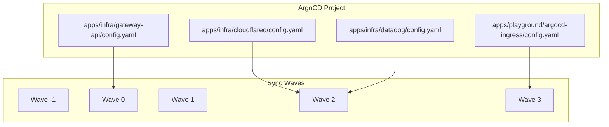
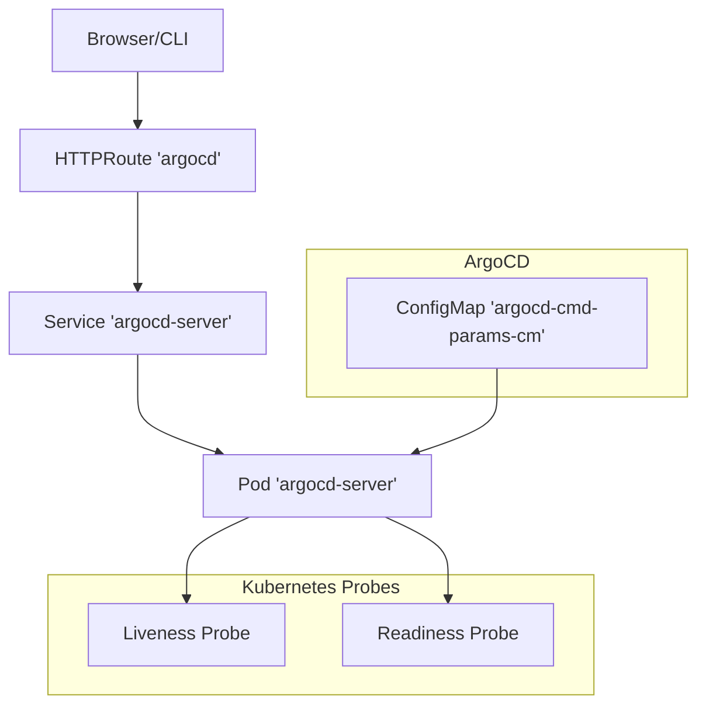
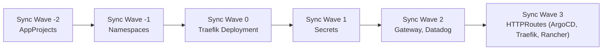
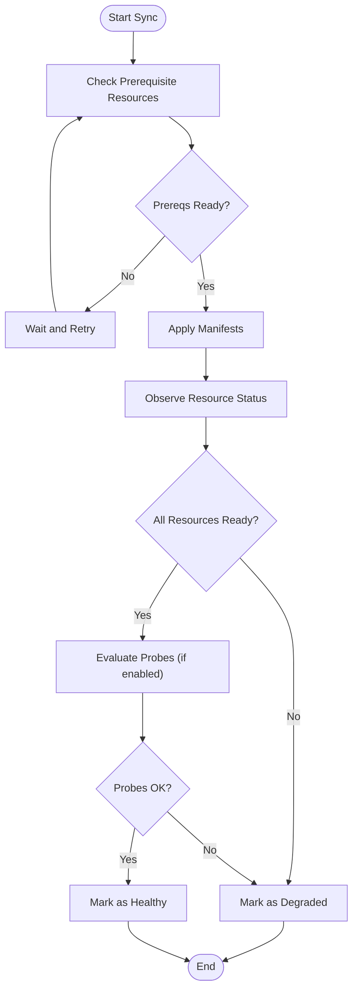

# Health Assessment and Customization

<cite>
**Referenced Files in This Document**
- [README.md](file://README.md)
- [argo_cd.md](file://guide/argocd/argo_cd.md)
- [argocd-cmd-params-cm.yaml](file://apps/playground/argocd-ingress/chart/argocd-cmd-params-cm.yaml)
- [httproute-argocd.yaml](file://apps/playground/argocd-ingress/chart/httproute-argocd.yaml)
- [values.yaml](file://apps/infra/cloudflared/chart/values.yaml)
- [values.yaml](file://apps/infra/datadog/chart/values.yaml)
- [config.yaml](file://apps/infra/cloudflared/config.yaml)
- [config.yaml](file://apps/infra/datadog/config.yaml)
- [config.yaml](file://apps/infra/gateway-api/config.yaml)
- [config.yaml](file://apps/playground/argocd-ingress/config.yaml)
- [sre.md](file://.opencode/agents/sre.md)
</cite>

## Table of Contents
1. [Introduction](#introduction)
2. [Project Structure](#project-structure)
3. [Core Components](#core-components)
4. [Architecture Overview](#architecture-overview)
5. [Detailed Component Analysis](#detailed-component-analysis)
6. [Dependency Analysis](#dependency-analysis)
7. [Performance Considerations](#performance-considerations)
8. [Troubleshooting Guide](#troubleshooting-guide)
9. [Conclusion](#conclusion)
10. [Appendices](#appendices)

## Introduction
This document explains how health assessment and monitoring are approached across the repository’s ArgoCD-managed workloads. It focuses on:
- How ArgoCD evaluates application health and readiness
- How Kubernetes readiness/liveness probes integrate with ArgoCD health status
- How to configure health assessment overrides and failure detection
- Practical patterns for custom health indicators and monitoring integration
- Troubleshooting common health assessment issues

Where applicable, we reference concrete files and annotations used in this repository to ground the guidance in actual manifests and configurations.

## Project Structure
The repository organizes ArgoCD-managed applications by project and environment, with explicit sync ordering via annotations to ensure dependent resources are created in the correct sequence. This ordering is crucial for accurate health assessment because downstream components depend on upstream ones (for example, HTTPRoute depends on Gateway existing).

Key characteristics:
- Applications are grouped under apps/infra and apps/playground
- Each application exposes a config.yaml that defines destination namespace and optional sync-wave annotation
- Sync waves are used to control order of creation and thus health evaluation timing
- Some applications include explicit probe configurations in their chart values

**Diagram sources**
- [config.yaml:1-4](file://apps/infra/cloudflared/config.yaml#L1-L4)
- [config.yaml:1-6](file://apps/infra/datadog/config.yaml#L1-L6)
- [config.yaml:1-6](file://apps/infra/gateway-api/config.yaml#L1-L6)
- [config.yaml:1-4](file://apps/playground/argocd-ingress/config.yaml#L1-L4)

**Section sources**
- [README.md:68-158](file://README.md#L68-L158)

## Core Components
- ArgoCD server configuration and exposure: The argocd-cmd-params-cm enables insecure mode for demonstration and exposes the server via an HTTPRoute.
- Kubernetes probes: The cloudflared chart explicitly disables liveness/readiness probes in its values; Datadog chart values define monitoring agent configuration.
- Application health signals: Applications declare destination namespaces and optional sync-wave annotations to influence health evaluation order.

These components collectively shape how ArgoCD assesses health and how Kubernetes determines pod readiness.

**Section sources**
- [argocd-cmd-params-cm.yaml:1-13](file://apps/playground/argocd-ingress/chart/argocd-cmd-params-cm.yaml#L1-L13)
- [httproute-argocd.yaml:1-29](file://apps/playground/argocd-ingress/chart/httproute-argocd.yaml#L1-L29)
- [values.yaml:22-26](file://apps/infra/cloudflared/chart/values.yaml#L22-L26)
- [values.yaml:1-89](file://apps/infra/datadog/chart/values.yaml#L1-L89)
- [config.yaml:1-4](file://apps/infra/cloudflared/config.yaml#L1-L4)
- [config.yaml:1-6](file://apps/infra/datadog/config.yaml#L1-L6)
- [config.yaml:1-6](file://apps/infra/gateway-api/config.yaml#L1-L6)
- [config.yaml:1-4](file://apps/playground/argocd-ingress/config.yaml#L1-L4)

## Architecture Overview
The health assessment pipeline integrates ArgoCD with Kubernetes probes and Gateway API routing:

- ArgoCD server runs in the argocd namespace and is exposed via an HTTPRoute backed by the argocd-server service.
- Applications are deployed into target namespaces and may rely on Gateway API resources that are created earlier via sync waves.
- Probes configured in application charts inform Kubernetes readiness/liveness; ArgoCD consumes these signals to compute application health.

**Diagram sources**
- [httproute-argocd.yaml:1-29](file://apps/playground/argocd-ingress/chart/httproute-argocd.yaml#L1-L29)
- [argocd-cmd-params-cm.yaml:1-13](file://apps/playground/argocd-ingress/chart/argocd-cmd-params-cm.yaml#L1-L13)
- [values.yaml:22-26](file://apps/infra/cloudflared/chart/values.yaml#L22-L26)

## Detailed Component Analysis

### ArgoCD Server Exposure and Health
- The argocd-cmd-params-cm toggles server.insecure to enable UI access without TLS termination at the ingress layer.
- The HTTPRoute “argocd” forwards traffic to the argocd-server service on port 80 and sets forwarded headers to simulate HTTPS.

Impact on health:
- With server.insecure enabled, ArgoCD server responds to HTTP requests; however, ArgoCD health assessment primarily relies on observed Kubernetes resources and application state rather than HTTP endpoint reachability alone.
- Proper Gateway API setup (via earlier sync waves) ensures the route exists before clients attempt to connect, indirectly supporting successful health checks.

**Section sources**
- [argocd-cmd-params-cm.yaml:1-13](file://apps/playground/argocd-ingress/chart/argocd-cmd-params-cm.yaml#L1-L13)
- [httproute-argocd.yaml:1-29](file://apps/playground/argocd-ingress/chart/httproute-argocd.yaml#L1-L29)

### Kubernetes Probes and Application Readiness
- The cloudflared chart explicitly disables both liveness and readiness probes in its values.
- Implication: Kubernetes will not gate startup/drainage based on probe results; ArgoCD health will reflect the application’s sync state and resource conditions rather than probe outcomes.

Recommendation:
- Enable and tune probes for stateful or latency-sensitive workloads to improve failure detection and recovery behavior.
- Align probe thresholds with application startup/shutdown characteristics to avoid oscillating health states.

**Section sources**
- [values.yaml:22-26](file://apps/infra/cloudflared/chart/values.yaml#L22-L26)

### Monitoring Agent Configuration and Observability Signals
- The Datadog chart values configure the Datadog agent, cluster agent, logs, APM, and process collection.
- While this does not directly alter ArgoCD health, robust observability helps diagnose why an application might fail health checks.

Integration pattern:
- Use Datadog dashboards and alerts to monitor pod restarts, slow starts, and resource contention—common causes of failing health assessments.

**Section sources**
- [values.yaml:1-89](file://apps/infra/datadog/chart/values.yaml#L1-L89)

### Application-Level Health Indicators and Sync Waves
- Applications declare destination namespaces and optional sync-wave annotations to control creation order.
- Correct ordering ensures dependent resources (for example, Gateway before HTTPRoute) exist before ArgoCD evaluates readiness, reducing premature failures.

Operational guidance:
- Use sync waves to stage creation so that prerequisite CRDs, Gateways, and Secrets are present before dependent resources.
- Keep wave assignments consistent across environments to minimize drift.

**Section sources**
- [config.yaml:1-4](file://apps/infra/cloudflared/config.yaml#L1-L4)
- [config.yaml:1-6](file://apps/infra/datadog/config.yaml#L1-L6)
- [config.yaml:1-6](file://apps/infra/gateway-api/config.yaml#L1-L6)
- [config.yaml:1-4](file://apps/playground/argocd-ingress/config.yaml#L1-L4)
- [README.md:76-86](file://README.md#L76-L86)

### Health Assessment Overrides and Failure Detection
- ArgoCD health is derived from observed Kubernetes resources and their statuses. There is no explicit health override configuration in the referenced files.
- To influence health behavior, tune:
  - Probe thresholds and timeouts (where probes are enabled)
  - Sync waves to ensure prerequisites exist
  - Resource readiness (for example, ensuring Services and Gateways are Ready before clients connect)

Failure detection mechanisms:
- ArgoCD marks applications as Degraded or Missing when observed resources are not Ready or do not exist.
- Use ArgoCD logs and events to correlate with Kubernetes events and probe failures.

**Section sources**
- [README.md:76-86](file://README.md#L76-L86)

## Dependency Analysis
The health of ArgoCD-managed applications depends on the correct sequencing of resource creation and the presence of required infrastructure.

**Diagram sources**
- [README.md:76-86](file://README.md#L76-L86)

**Section sources**
- [README.md:76-86](file://README.md#L76-L86)

## Performance Considerations
- Minimize unnecessary probe churn by tuning probe intervals and timeouts to match workload behavior.
- Prefer conservative thresholds to avoid flapping health states during normal scaling or startup.
- Ensure Gateway API resources are created early (wave -1 or earlier) to prevent repeated route reconciliation failures.

[No sources needed since this section provides general guidance]

## Troubleshooting Guide
Common issues and remedies:

- ArgoCD UI not reachable via HTTPRoute
  - Verify the HTTPRoute “argocd” targets the correct Service and port.
  - Confirm the Gateway exists and is Ready before the HTTPRoute is applied.
  - Check that server.insecure is set appropriately for the environment.

- Application marked Degraded despite healthy pods
  - Inspect observed resource statuses (Deployments, Services, Gateways).
  - Confirm sync waves place prerequisites before dependent resources.
  - Review Kubernetes events for transient errors.

- Frequent restarts or flapping health
  - Evaluate probe thresholds and schedules.
  - Investigate resource limits and startup times.
  - Use Datadog metrics to identify CPU/memory pressure or slow initialization.

- Misordered sync leading to health failures
  - Revisit sync-wave annotations and ensure consistent ordering across environments.
  - Validate that prerequisite CRDs and Secrets are created before dependent resources.

**Section sources**
- [httproute-argocd.yaml:1-29](file://apps/playground/argocd-ingress/chart/httproute-argocd.yaml#L1-L29)
- [argocd-cmd-params-cm.yaml:1-13](file://apps/playground/argocd-ingress/chart/argocd-cmd-params-cm.yaml#L1-L13)
- [values.yaml:22-26](file://apps/infra/cloudflared/chart/values.yaml#L22-L26)
- [README.md:76-86](file://README.md#L76-L86)
- [sre.md:11-16](file://.opencode/agents/sre.md#L11-L16)

## Conclusion
This repository demonstrates a pragmatic approach to health assessment and monitoring:
- ArgoCD health is primarily driven by observed Kubernetes resource states and sync progress.
- Kubernetes probes can influence readiness but are not mandatory; their absence shifts health focus to resource conditions.
- Carefully orchestrated sync waves ensure prerequisites exist, improving health assessment accuracy.
- Observability (Datadog) supports diagnosis of root causes behind health issues.

[No sources needed since this section summarizes without analyzing specific files]

## Appendices

### Appendix A: Health Assessment Flow (Conceptual)

[No sources needed since this diagram shows conceptual workflow, not actual code structure]