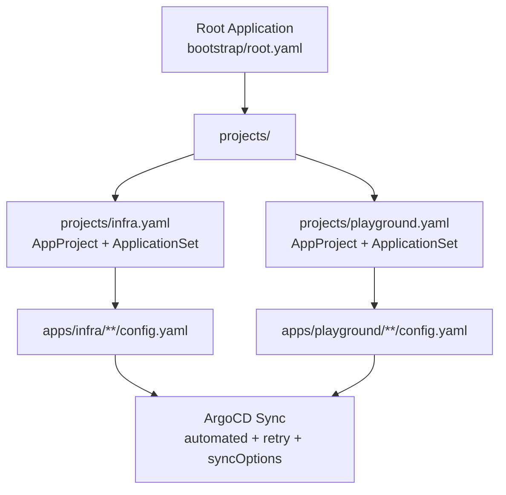
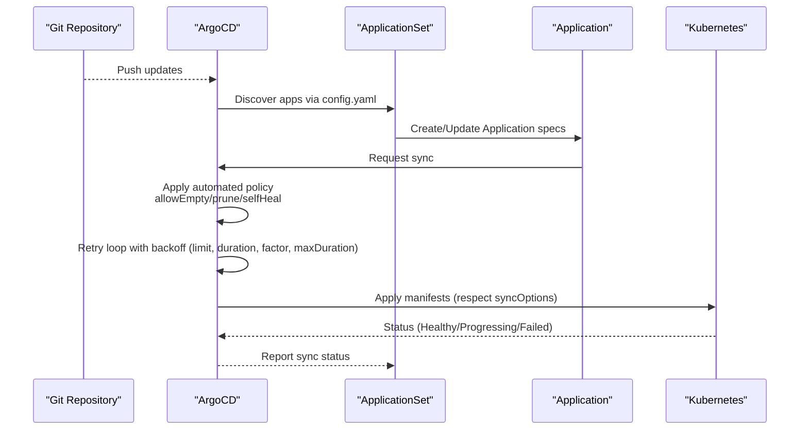
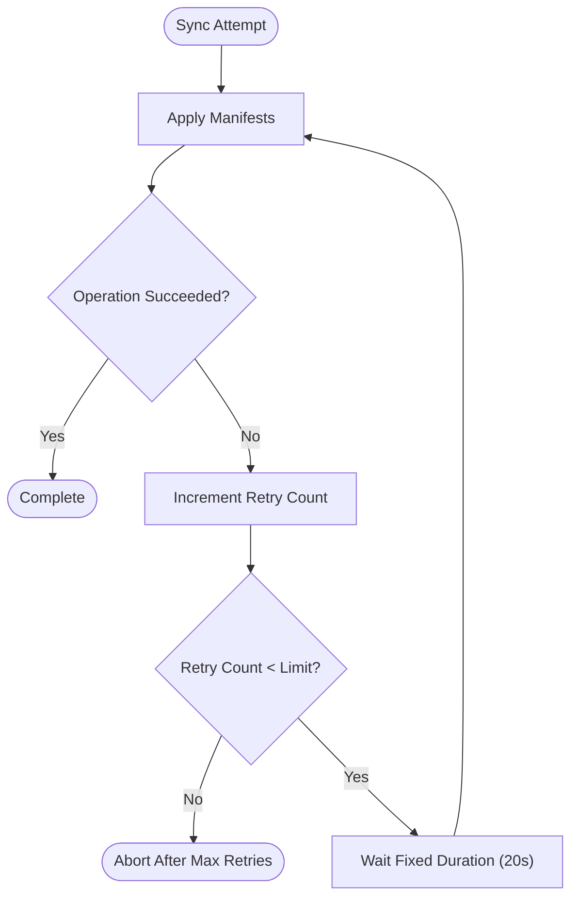
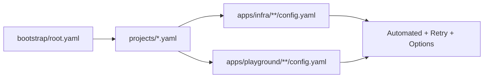

# Sync Policies and Retry Strategies

<cite>
**Referenced Files in This Document**
- [README.md](file://README.md)
- [root.yaml](file://bootstrap/root.yaml)
- [cluster-resources.yaml](file://bootstrap/cluster-resources.yaml)
- [secrets.yaml](file://bootstrap/secrets.yaml)
- [infra.yaml](file://projects/infra.yaml)
- [playground.yaml](file://projects/playground.yaml)
- [gateway-api config.yaml](file://apps/infra/gateway-api/config.yaml)
- [cloudflared config.yaml](file://apps/infra/cloudflared/config.yaml)
- [argocd-ingress config.yaml](file://apps/playground/argocd-ingress/config.yaml)
- [rancher config.yaml](file://apps/playground/rancher/config.yaml)
- [cert-manager config.yaml](file://apps/playground/cert-manager/config.yaml)
</cite>

## Table of Contents
1. [Introduction](#introduction)
2. [Project Structure](#project-structure)
3. [Core Components](#core-components)
4. [Architecture Overview](#architecture-overview)
5. [Detailed Component Analysis](#detailed-component-analysis)
6. [Dependency Analysis](#dependency-analysis)
7. [Performance Considerations](#performance-considerations)
8. [Troubleshooting Guide](#troubleshooting-guide)
9. [Conclusion](#conclusion)
10. [Appendices](#appendices)

## Introduction
This document explains advanced sync policies and retry mechanisms in ArgoCD as configured in this repository. It covers automated sync behaviors (allowEmpty, prune, selfHeal), explicit sync ordering via sync waves, retry policies with fixed backoff, and practical configuration examples. It also provides guidance on health overrides, custom sync behaviors, performance considerations, and monitoring approaches.

## Project Structure
The repository follows a GitOps pattern with ArgoCD managing cluster state declaratively:
- Root Application points to the projects directory to bootstrap AppProjects and ApplicationSets.
- Projects define AppProjects and ApplicationSets that discover applications via config.yaml files.
- Applications are rendered by Kustomize (with Helm support) and synced according to sync waves and retry policies.

**Diagram sources**
- [root.yaml:10-37](file://bootstrap/root.yaml#L10-L37)
- [infra.yaml:23-85](file://projects/infra.yaml#L23-L85)
- [playground.yaml:23-90](file://projects/playground.yaml#L23-L90)

**Section sources**
- [README.md:68-118](file://README.md#L68-L118)
- [root.yaml:10-37](file://bootstrap/root.yaml#L10-L37)
- [infra.yaml:23-85](file://projects/infra.yaml#L23-L85)
- [playground.yaml:23-90](file://projects/playground.yaml#L23-L90)

## Core Components
- Automated sync configuration
  - allowEmpty: Allows empty manifests during sync.
  - prune: Enables pruning of resources not present in the repo.
  - selfHeal: Automatically reconciles drift by re-applying desired state.
- Retry policy
  - limit: Maximum number of retries.
  - backoff: Fixed-duration backoff with duration, factor, and maxDuration.
- Sync options
  - CreateNamespace: Creates missing destination namespaces.
  - SkipDryRunOnMissingResource: Skips dry-run for missing resources (playground).
- Sync waves
  - Ordered deployment across AppProject, cluster-resources, ApplicationSets/Traefik, secrets, mid-tier, and HTTPRoutes.

**Section sources**
- [root.yaml:29-37](file://bootstrap/root.yaml#L29-L37)
- [cluster-resources.yaml:29-33](file://bootstrap/cluster-resources.yaml#L29-L33)
- [secrets.yaml:18-24](file://bootstrap/secrets.yaml#L18-L24)
- [infra.yaml:61-74](file://projects/infra.yaml#L61-L74)
- [playground.yaml:66-75](file://projects/playground.yaml#L66-L75)
- [README.md:76-86](file://README.md#L76-L86)

## Architecture Overview
The sync pipeline integrates ArgoCD’s automated sync, retry backoff, and sync waves to ensure reliable, ordered deployments across infrastructure and playground applications.

**Diagram sources**
- [root.yaml:29-37](file://bootstrap/root.yaml#L29-L37)
- [infra.yaml:61-74](file://projects/infra.yaml#L61-L74)
- [playground.yaml:66-75](file://projects/playground.yaml#L66-L75)

## Detailed Component Analysis

### Automated Sync Policies
- Root Application
  - allowEmpty: true
  - prune: true
  - selfHeal: true
  - syncOptions: allowEmpty=true, CreateNamespace=true
- Cluster-resources ApplicationSet
  - automated: allowEmpty=true, selfHeal=true
- Secrets Application
  - automated: prune=true, selfHeal=true
  - syncOptions: CreateNamespace=true
- Infra ApplicationSet
  - automated: allowEmpty=true, prune=true, selfHeal=true
  - retry: limit=30, backoff duration=20s, factor=1, maxDuration=20s
- Playground ApplicationSet
  - automated: allowEmpty=true, prune=true, selfHeal=true
  - retry: limit=30, backoff duration=20s, factor=1, maxDuration=20s
  - syncOptions: CreateNamespace=true, SkipDryRunOnMissingResource=true

These policies ensure robust reconciliation and predictable cleanup while allowing safe handling of empty or missing resources.

**Section sources**
- [root.yaml:29-37](file://bootstrap/root.yaml#L29-L37)
- [cluster-resources.yaml:29-33](file://bootstrap/cluster-resources.yaml#L29-L33)
- [secrets.yaml:18-24](file://bootstrap/secrets.yaml#L18-L24)
- [infra.yaml:61-74](file://projects/infra.yaml#L61-L74)
- [playground.yaml:66-75](file://projects/playground.yaml#L66-L75)

### Retry Policy with Fixed Backoff
- Retry configuration is defined at the ApplicationSet level with:
  - limit: 30 attempts
  - backoff:
    - duration: 20s
    - factor: 1 (fixed backoff)
    - maxDuration: 20s
- This ensures a steady, predictable delay between retries without exponential growth.

**Diagram sources**
- [infra.yaml:66-71](file://projects/infra.yaml#L66-L71)
- [playground.yaml:66-71](file://projects/playground.yaml#L66-L71)

**Section sources**
- [infra.yaml:66-71](file://projects/infra.yaml#L66-L71)
- [playground.yaml:66-71](file://projects/playground.yaml#L66-L71)

### Sync Waves for Ordered Deployments
- AppProject wave: -2
- Cluster-resources wave: -1
- ApplicationSets and Traefik wave: 0
- Secrets wave: 1
- Mid-tier resources (e.g., Gateway, Datadog) wave: 2
- HTTPRoutes wave: 3 (applied after Gateway exists)

Applications can override wave ordering via annotations in their config.yaml:
- apps/infra/gateway-api: wave 0 (explicitly set)
- apps/infra/cloudflared: wave 2
- apps/playground/argocd-ingress: wave 3
- apps/playground/rancher: wave 3
- apps/playground/cert-manager: wave 2

```mermaid
gantt
title Sync Waves Across Applications
dateFormat X
axisFormat :week
section AppProject
Wave -2 : 0, 1
section Cluster Resources
Wave -1 : 1, 1
section ApplicationSets & Traefik
Wave 0 : 2, 1
section Secrets
Wave 1 : 3, 1
section Mid-Tier (e.g., Gateway, Datadog)
Wave 2 : 4, 1
section HTTPRoutes
Wave 3 : 5, 1
```

**Diagram sources**
- [README.md:76-86](file://README.md#L76-L86)
- [cluster-resources.yaml:4-5](file://bootstrap/cluster-resources.yaml#L4-L5)
- [infra.yaml:26-27](file://projects/infra.yaml#L26-L27)
- [cloudflared config.yaml:3](file://apps/infra/cloudflared/config.yaml#L3)
- [argocd-ingress config.yaml:3](file://apps/playground/argocd-ingress/config.yaml#L3)
- [rancher config.yaml:3](file://apps/playground/rancher/config.yaml#L3)
- [cert-manager config.yaml:3](file://apps/playground/cert-manager/config.yaml#L3)

**Section sources**
- [README.md:76-86](file://README.md#L76-L86)
- [cluster-resources.yaml:4-5](file://bootstrap/cluster-resources.yaml#L4-L5)
- [infra.yaml:26-27](file://projects/infra.yaml#L26-L27)
- [cloudflared config.yaml:3](file://apps/infra/cloudflared/config.yaml#L3)
- [argocd-ingress config.yaml:3](file://apps/playground/argocd-ingress/config.yaml#L3)
- [rancher config.yaml:3](file://apps/playground/rancher/config.yaml#L3)
- [cert-manager config.yaml:3](file://apps/playground/cert-manager/config.yaml#L3)

### Health Check Overrides and Custom Sync Behaviors
- Health overrides
  - Use ignoreDifferences in Application specs to stabilize health checks for known divergences (e.g., auto-generated fields).
  - Example patterns are shown in the root Application’s ignoreDifferences configuration.
- Custom sync behaviors
  - CreateNamespace=true ensures destination namespaces are provisioned automatically.
  - SkipDryRunOnMissingResource=true reduces unnecessary dry-run failures for missing resources in playground workloads.

**Section sources**
- [root.yaml:19-28](file://bootstrap/root.yaml#L19-L28)
- [root.yaml:34-36](file://bootstrap/root.yaml#L34-L36)
- [playground.yaml:72-74](file://projects/playground.yaml#L72-L74)

### Application-Level Examples
- apps/infra/gateway-api
  - destNamespace: gateway-api
  - syncOptions: CreateNamespace=true
- apps/infra/cloudflared
  - destNamespace: cloudflared
  - annotations: argocd.argoproj.io/sync-wave: "2"
- apps/playground/argocd-ingress
  - destNamespace: argocd
  - annotations: argocd.argoproj.io/sync-wave: "3"
- apps/playground/rancher
  - destNamespace: cattle-system
  - annotations: argocd.argoproj.io/sync-wave: "3"
- apps/playground/cert-manager
  - destNamespace: cert-manager
  - annotations: argocd.argoproj.io/sync-wave: "2"

These demonstrate per-application namespace targeting and wave customization.

**Section sources**
- [gateway-api config.yaml:1-6](file://apps/infra/gateway-api/config.yaml#L1-L6)
- [cloudflared config.yaml:1-4](file://apps/infra/cloudflared/config.yaml#L1-L4)
- [argocd-ingress config.yaml:1-4](file://apps/playground/argocd-ingress/config.yaml#L1-L4)
- [rancher config.yaml:1-5](file://apps/playground/rancher/config.yaml#L1-L5)
- [cert-manager config.yaml:1-5](file://apps/playground/cert-manager/config.yaml#L1-L5)

## Dependency Analysis
- Root Application depends on projects/ to establish AppProjects and ApplicationSets.
- ApplicationSets depend on config.yaml files to discover and render applications.
- Applications inherit automated sync, retry, and syncOptions from their parent ApplicationSet templates.
- Sync waves propagate ordering from AppProject down to individual Applications.

**Diagram sources**
- [root.yaml:10-18](file://bootstrap/root.yaml#L10-L18)
- [infra.yaml:33-45](file://projects/infra.yaml#L33-L45)
- [playground.yaml:33-45](file://projects/playground.yaml#L33-L45)

**Section sources**
- [root.yaml:10-18](file://bootstrap/root.yaml#L10-L18)
- [infra.yaml:33-45](file://projects/infra.yaml#L33-L45)
- [playground.yaml:33-45](file://projects/playground.yaml#L33-L45)

## Performance Considerations
- Fixed backoff (factor=1) keeps retry delays constant, reducing variability but potentially increasing contention if many Applications retry simultaneously. Consider staggering requeueAfterSeconds at the ApplicationSet generator level to distribute load.
- Pruning and self-heal reduce manual intervention but can increase API churn; tune pruneLast and wave ordering to minimize destructive operations during early waves.
- Dry-run skipping (SkipDryRunOnMissingResource) reduces sync time for missing resources but may mask issues; use judiciously in experimental environments.
- CreateNamespace=true avoids repeated failures due to missing namespaces, improving reliability.

[No sources needed since this section provides general guidance]

## Troubleshooting Guide
- Symptom: Repeated sync failures
  - Verify retry.limit and backoff settings; confirm that maxDuration is appropriate for workload size.
  - Check for intermittent network or registry issues; consider increasing requeueAfterSeconds at the ApplicationSet generator.
- Symptom: Unexpected deletions
  - Review prune behavior and pruneLast annotation on AppProject; ensure wave ordering prevents premature deletion of dependent resources.
- Symptom: Missing namespaces
  - Confirm CreateNamespace=true is enabled; verify destination namespace permissions.
- Symptom: Health flapping
  - Use ignoreDifferences to stabilize health checks for known auto-generated fields.
- Monitoring
  - Observe ArgoCD logs and events for sync status transitions.
  - Track Application conditions (Healthy, Progressing, Degraded) and sync operation metrics.

**Section sources**
- [infra.yaml:5, 66-71:5-71](file://projects/infra.yaml#L5-L71)
- [playground.yaml:5, 66-75:5-75](file://projects/playground.yaml#L5-L75)
- [root.yaml:19-28](file://bootstrap/root.yaml#L19-L28)

## Conclusion
This repository configures ArgoCD with robust automated sync policies, fixed-backoff retries, and strict wave ordering to achieve reliable, ordered deployments. By combining allowEmpty, prune, selfHeal, and targeted syncOptions, teams can maintain a stable platform while enabling rapid iteration in experimental workloads. Proper monitoring and periodic tuning of retry and wave strategies ensure predictable outcomes at scale.

[No sources needed since this section summarizes without analyzing specific files]

## Appendices
- Practical configuration references
  - Root Application automated and syncOptions: [root.yaml:29-37](file://bootstrap/root.yaml#L29-L37)
  - Cluster-resources automated: [cluster-resources.yaml:29-33](file://bootstrap/cluster-resources.yaml#L29-L33)
  - Secrets automated and syncOptions: [secrets.yaml:18-24](file://bootstrap/secrets.yaml#L18-L24)
  - Infra ApplicationSet automated + retry: [infra.yaml:61-74](file://projects/infra.yaml#L61-L74)
  - Playground ApplicationSet automated + retry + syncOptions: [playground.yaml:61-90](file://projects/playground.yaml#L61-L90)
  - Application-level wave annotations: 
    - [cloudflared config.yaml:3](file://apps/infra/cloudflared/config.yaml#L3)
    - [argocd-ingress config.yaml:3](file://apps/playground/argocd-ingress/config.yaml#L3)
    - [rancher config.yaml:3](file://apps/playground/rancher/config.yaml#L3)
    - [cert-manager config.yaml:3](file://apps/playground/cert-manager/config.yaml#L3)
    - [gateway-api config.yaml:1-6](file://apps/infra/gateway-api/config.yaml#L1-L6)

[No sources needed since this section aggregates references already cited above]