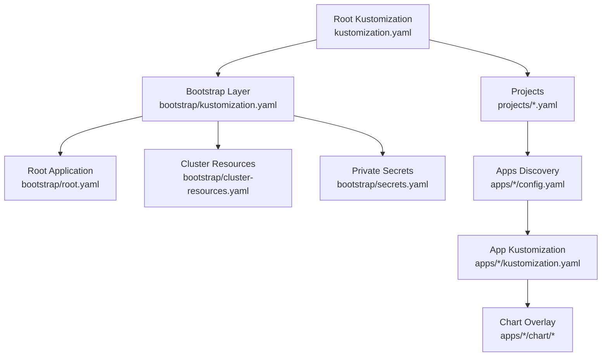
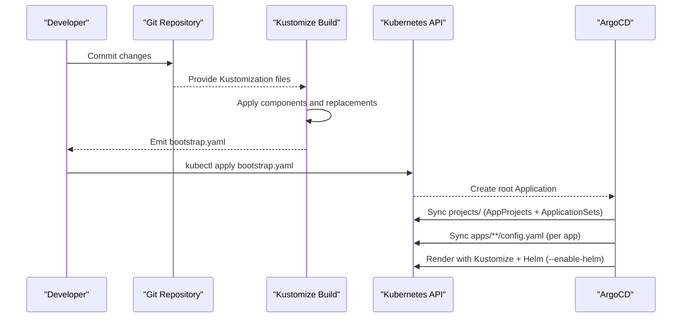
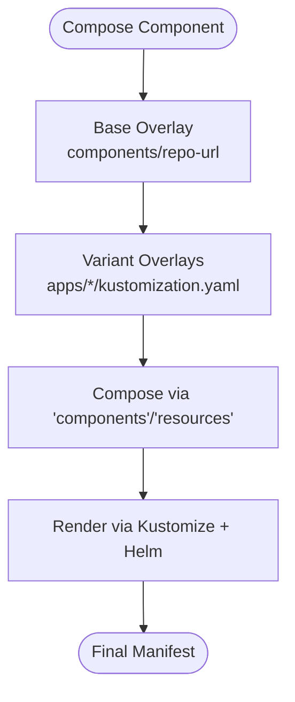
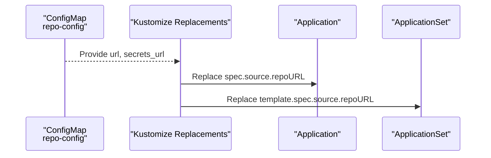
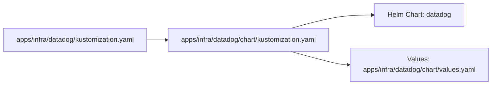
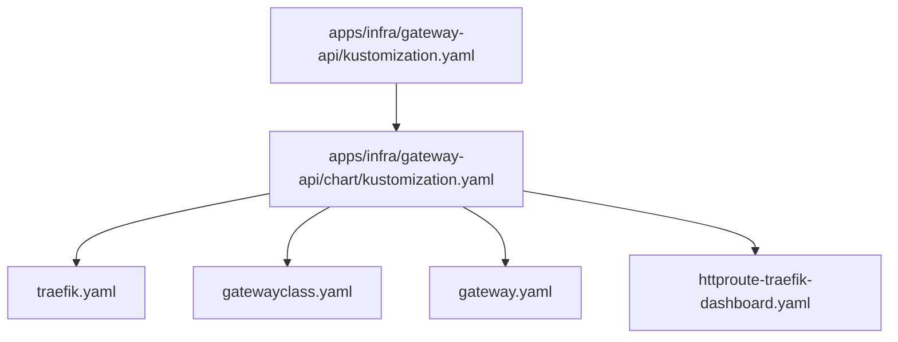
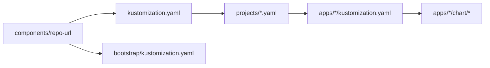

# Custom Component Development

<cite>
**Referenced Files in This Document**
- [README.md](file://README.md)
- [kustomization.yaml](file://kustomization.yaml)
- [bootstrap/kustomization.yaml](file://bootstrap/kustomization.yaml)
- [apps/infra/cloudflared/kustomization.yaml](file://apps/infra/cloudflared/kustomization.yaml)
- [apps/infra/cloudflared/chart/kustomization.yaml](file://apps/infra/cloudflared/chart/kustomization.yaml)
- [apps/infra/cloudflared/chart/values.yaml](file://apps/infra/cloudflared/chart/values.yaml)
- [apps/infra/datadog/kustomization.yaml](file://apps/infra/datadog/kustomization.yaml)
- [apps/infra/datadog/chart/kustomization.yaml](file://apps/infra/datadog/chart/kustomization.yaml)
- [apps/infra/datadog/chart/values.yaml](file://apps/infra/datadog/chart/values.yaml)
- [apps/infra/gateway-api/kustomization.yaml](file://apps/infra/gateway-api/kustomization.yaml)
- [apps/infra/gateway-api/chart/kustomization.yaml](file://apps/infra/gateway-api/chart/kustomization.yaml)
- [apps/infra/gateway-api/chart/traefik.yaml](file://apps/infra/gateway-api/chart/traefik.yaml)
- [apps/infra/gateway-api/chart/gatewayclass.yaml](file://apps/infra/gateway-api/chart/gatewayclass.yaml)
- [apps/infra/gateway-api/chart/gateway.yaml](file://apps/infra/gateway-api/chart/gateway.yaml)
- [apps/infra/gateway-api/chart/httproute-traefik-dashboard.yaml](file://apps/infra/gateway-api/chart/httproute-traefik-dashboard.yaml)
- [apps/playground/argocd-ingress/kustomization.yaml](file://apps/playground/argocd-ingress/kustomization.yaml)
- [apps/playground/cert-manager/kustomization.yaml](file://apps/playground/cert-manager/kustomization.yaml)
</cite>

## Table of Contents
1. [Introduction](#introduction)
2. [Project Structure](#project-structure)
3. [Core Components](#core-components)
4. [Architecture Overview](#architecture-overview)
5. [Detailed Component Analysis](#detailed-component-analysis)
6. [Dependency Analysis](#dependency-analysis)
7. [Performance Considerations](#performance-considerations)
8. [Troubleshooting Guide](#troubleshooting-guide)
9. [Conclusion](#conclusion)
10. [Appendices](#appendices)

## Introduction
This document explains how to develop custom Kustomize components for GitOps infrastructure using ArgoCD and Helm. It focuses on building reusable component bases, defining inheritance patterns, composing overlays, and structuring components across base, staging, and production variants. It also covers variable substitution, overlay patterns, and practical examples for common infrastructure patterns such as monitoring stacks, ingress controllers, and database deployments. Guidance is grounded in the repository’s existing patterns for components, Helm integration, and sync-wave ordering.

## Project Structure
The repository organizes GitOps resources into a layered structure:
- Root Kustomization builds a bootstrap manifest and injects repository URLs via a shared component.
- Bootstrap layer applies the root Application, cluster namespaces, and private secrets.
- Projects define AppProjects and ApplicationSets that discover per-app configurations.
- Apps are grouped into infra and playground categories, each with a config and a Kustomization that may include a Helm chart directory.

Key structural patterns:
- Centralized repository URL replacement via a shared component.
- Per-app Kustomization files that optionally wrap Helm charts.
- Explicit sync ordering via annotations to ensure prerequisites are ready before dependents.

**Diagram sources**
- [kustomization.yaml:1-21](file://kustomization.yaml#L1-L21)
- [bootstrap/kustomization.yaml:1-38](file://bootstrap/kustomization.yaml#L1-L38)

**Section sources**
- [README.md:87-118](file://README.md#L87-L118)
- [README.md:57-86](file://README.md#L57-L86)
- [kustomization.yaml:1-21](file://kustomization.yaml#L1-L21)
- [bootstrap/kustomization.yaml:1-38](file://bootstrap/kustomization.yaml#L1-L38)

## Core Components
Reusable components are implemented as Kustomization overlays that encapsulate shared configuration and expose variables for customization. The repository demonstrates:
- A shared component for injecting repository URLs into Applications and ApplicationSets.
- Per-app components that wrap Helm charts and set namespace scoping.
- Chart overlays that define Helm chart references, versions, and values files.

Key patterns:
- Component composition via the components directory and the components field in Kustomization.
- Variable substitution via replacements that bind ConfigMap fields into Application spec fields.
- Helm integration via helmCharts blocks inside chart overlays.

Practical implications:
- Keep component bases minimal and generic; specialize via overlays.
- Use replacements to avoid hardcoding repository URLs across environments.
- Encapsulate Helm chart configuration in chart overlays for easy reuse.

**Section sources**
- [kustomization.yaml:4-21](file://kustomization.yaml#L4-L21)
- [bootstrap/kustomization.yaml:4-38](file://bootstrap/kustomization.yaml#L4-L38)
- [apps/infra/cloudflared/kustomization.yaml:1-8](file://apps/infra/cloudflared/kustomization.yaml#L1-L8)
- [apps/infra/cloudflared/chart/kustomization.yaml:4-11](file://apps/infra/cloudflared/chart/kustomization.yaml#L4-L11)
- [apps/infra/datadog/kustomization.yaml:1-8](file://apps/infra/datadog/kustomization.yaml#L1-L8)
- [apps/infra/datadog/chart/kustomization.yaml:4-11](file://apps/infra/datadog/chart/kustomization.yaml#L4-L11)

## Architecture Overview
The GitOps pipeline follows a deterministic bootstrap chain with explicit sync waves to ensure prerequisites are established before dependents.

**Diagram sources**
- [README.md:58-75](file://README.md#L58-L75)
- [kustomization.yaml:1-21](file://kustomization.yaml#L1-L21)
- [bootstrap/kustomization.yaml:1-38](file://bootstrap/kustomization.yaml#L1-L38)

## Detailed Component Analysis

### Component Inheritance and Composition Patterns
- Base component: A reusable overlay that defines common fields (e.g., repository URL injection).
- Variant overlays: Specialize base behavior by adding or overriding fields (e.g., namespace scoping, Helm chart references).
- Composition: Multiple overlays are composed via the components and resources fields in Kustomization.

Evidence in repository:
- Root Kustomization composes a shared repo URL component and emits bootstrap artifacts.
- App Kustomization composes a chart overlay and sets a namespace.
- Chart overlay composes a Helm chart with a pinned version and values file.

**Diagram sources**
- [kustomization.yaml:4-8](file://kustomization.yaml#L4-L8)
- [apps/infra/cloudflared/kustomization.yaml:4-8](file://apps/infra/cloudflared/kustomization.yaml#L4-L8)
- [apps/infra/cloudflared/chart/kustomization.yaml:4-11](file://apps/infra/cloudflared/chart/kustomization.yaml#L4-L11)

**Section sources**
- [kustomization.yaml:4-21](file://kustomization.yaml#L4-L21)
- [apps/infra/cloudflared/kustomization.yaml:1-8](file://apps/infra/cloudflared/kustomization.yaml#L1-L8)
- [apps/infra/cloudflared/chart/kustomization.yaml:4-11](file://apps/infra/cloudflared/chart/kustomization.yaml#L4-L11)

### Variable Substitution Mechanisms
The repository centralizes repository URLs and secrets URLs in a shared component and substitutes them into Applications and ApplicationSets using replacements. This enables environment-specific configuration without duplicating manifests.

**Diagram sources**
- [kustomization.yaml:10-21](file://kustomization.yaml#L10-L21)
- [bootstrap/kustomization.yaml:12-38](file://bootstrap/kustomization.yaml#L12-L38)

**Section sources**
- [kustomization.yaml:10-21](file://kustomization.yaml#L10-L21)
- [bootstrap/kustomization.yaml:12-38](file://bootstrap/kustomization.yaml#L12-L38)

### Component Structure: Base/Staging/Production Variants
To implement base/staging/production variants:
- Base: Define common fields (e.g., shared Helm chart version, common labels).
- Staging: Override base with staging-specific values (e.g., replicas, resource requests).
- Production: Further override staging with production-specific values (e.g., higher replicas, stricter security contexts).

Implementation approach:
- Create variant overlays under apps/<env>/<component>/kustomization.yaml that inherit from the base overlay.
- Use strategic merge patches or new fields to adjust images, replicas, and security contexts.
- Keep environment-specific values in separate values files or ConfigMaps and reference them via valuesFile.

[No sources needed since this section provides general guidance]

### Practical Examples

#### Monitoring Stack (Datadog)
Datadog is implemented as a Helm-based component with a pinned chart version and values file. The chart overlay references the upstream Helm chart repository and specifies the release name and namespace.

**Diagram sources**
- [apps/infra/datadog/kustomization.yaml:1-8](file://apps/infra/datadog/kustomization.yaml#L1-L8)
- [apps/infra/datadog/chart/kustomization.yaml:4-11](file://apps/infra/datadog/chart/kustomization.yaml#L4-L11)
- [apps/infra/datadog/chart/values.yaml:1-89](file://apps/infra/datadog/chart/values.yaml#L1-L89)

**Section sources**
- [apps/infra/datadog/kustomization.yaml:1-8](file://apps/infra/datadog/kustomization.yaml#L1-L8)
- [apps/infra/datadog/chart/kustomization.yaml:4-11](file://apps/infra/datadog/chart/kustomization.yaml#L4-L11)
- [apps/infra/datadog/chart/values.yaml:1-89](file://apps/infra/datadog/chart/values.yaml#L1-L89)

#### Ingress Controller (Traefik via Gateway API)
The Gateway API component installs CRDs, a GatewayClass, a Gateway, and HTTPRoutes. It uses sync-wave annotations to enforce ordering so Gateways and GatewaysClasses exist before HTTPRoutes.

**Diagram sources**
- [apps/infra/gateway-api/kustomization.yaml:1-9](file://apps/infra/gateway-api/kustomization.yaml#L1-L9)
- [apps/infra/gateway-api/chart/kustomization.yaml:4-8](file://apps/infra/gateway-api/chart/kustomization.yaml#L4-L8)
- [apps/infra/gateway-api/chart/traefik.yaml:62-120](file://apps/infra/gateway-api/chart/traefik.yaml#L62-L120)
- [apps/infra/gateway-api/chart/gatewayclass.yaml:1-10](file://apps/infra/gateway-api/chart/gatewayclass.yaml#L1-L10)
- [apps/infra/gateway-api/chart/gateway.yaml:1-27](file://apps/infra/gateway-api/chart/gateway.yaml#L1-L27)
- [apps/infra/gateway-api/chart/httproute-traefik-dashboard.yaml:1-30](file://apps/infra/gateway-api/chart/httproute-traefik-dashboard.yaml#L1-L30)

**Section sources**
- [apps/infra/gateway-api/kustomization.yaml:1-9](file://apps/infra/gateway-api/kustomization.yaml#L1-L9)
- [apps/infra/gateway-api/chart/kustomization.yaml:4-8](file://apps/infra/gateway-api/chart/kustomization.yaml#L4-L8)
- [apps/infra/gateway-api/chart/traefik.yaml:62-120](file://apps/infra/gateway-api/chart/traefik.yaml#L62-L120)
- [apps/infra/gateway-api/chart/gatewayclass.yaml:1-10](file://apps/infra/gateway-api/chart/gatewayclass.yaml#L1-L10)
- [apps/infra/gateway-api/chart/gateway.yaml:1-27](file://apps/infra/gateway-api/chart/gateway.yaml#L1-L27)
- [apps/infra/gateway-api/chart/httproute-traefik-dashboard.yaml:1-30](file://apps/infra/gateway-api/chart/httproute-traefik-dashboard.yaml#L1-L30)

#### Database Deployment (Conceptual Pattern)
For databases, define a base overlay with common security contexts, persistent volume claims, and resource requests. Create staging and production overlays that increase replicas, storage, and CPU/memory limits. Reference a database Helm chart in the chart overlay and supply environment-specific values via values files.

[No sources needed since this section provides general guidance]

### Component Metadata Management
- Use annotations for sync ordering (e.g., sync-wave) to control reconciliation order.
- Use labels and annotations to identify component ownership and environment.
- Store component metadata (e.g., chart versions, image tags) in values files or overlays for traceability.

Evidence in repository:
- Sync waves are applied via annotations on Kubernetes resources to ensure proper ordering.

**Section sources**
- [apps/infra/gateway-api/chart/traefik.yaml:61-120](file://apps/infra/gateway-api/chart/traefik.yaml#L61-L120)
- [apps/infra/gateway-api/chart/gatewayclass.yaml:5-10](file://apps/infra/gateway-api/chart/gatewayclass.yaml#L5-L10)
- [apps/infra/gateway-api/chart/gateway.yaml:6-27](file://apps/infra/gateway-api/chart/gateway.yaml#L6-L27)
- [apps/infra/gateway-api/chart/httproute-traefik-dashboard.yaml:6-30](file://apps/infra/gateway-api/chart/httproute-traefik-dashboard.yaml#L6-L30)

### Versioning Strategies
- Pin Helm chart versions in chart overlays to ensure reproducible deployments.
- Use Git tags or branches for Kustomize components to track releases.
- Maintain a changelog in the repository to document breaking changes and migration steps.

Evidence in repository:
- Helm chart versions are pinned in chart overlays.

**Section sources**
- [apps/infra/cloudflared/chart/kustomization.yaml:9](file://apps/infra/cloudflared/chart/kustomization.yaml#L9)
- [apps/infra/datadog/chart/kustomization.yaml:7](file://apps/infra/datadog/chart/kustomization.yaml#L7)

### Best Practices for Distribution and Consumption
- Distribute components as reusable overlays under a components directory.
- Consume components by importing them in app-level Kustomization files.
- Use values files to externalize environment-specific configuration.
- Enforce sync waves to prevent race conditions during bootstrapping.

Evidence in repository:
- Components are imported via the components field.
- Sync waves are enforced across cluster-resources, Traefik, and HTTPRoutes.

**Section sources**
- [kustomization.yaml:4-8](file://kustomization.yaml#L4-L8)
- [bootstrap/kustomization.yaml:9-10](file://bootstrap/kustomization.yaml#L9-L10)
- [README.md:76-86](file://README.md#L76-L86)

## Dependency Analysis
Components depend on each other through composition and replacement rules. The root Kustomization depends on the shared repo URL component and produces bootstrap artifacts. Bootstrap Kustomization depends on the same component and applies root, cluster resources, and secrets. App Kustomization depends on chart overlays and may depend on shared namespaces.

**Diagram sources**
- [kustomization.yaml:4-8](file://kustomization.yaml#L4-L8)
- [bootstrap/kustomization.yaml:4-10](file://bootstrap/kustomization.yaml#L4-L10)
- [apps/infra/cloudflared/kustomization.yaml:6-8](file://apps/infra/cloudflared/kustomization.yaml#L6-L8)
- [apps/infra/cloudflared/chart/kustomization.yaml:4-11](file://apps/infra/cloudflared/chart/kustomization.yaml#L4-L11)

**Section sources**
- [kustomization.yaml:4-8](file://kustomization.yaml#L4-L8)
- [bootstrap/kustomization.yaml:4-10](file://bootstrap/kustomization.yaml#L4-L10)
- [apps/infra/cloudflared/kustomization.yaml:6-8](file://apps/infra/cloudflared/kustomization.yaml#L6-L8)
- [apps/infra/cloudflared/chart/kustomization.yaml:4-11](file://apps/infra/cloudflared/chart/kustomization.yaml#L4-L11)

## Performance Considerations
- Prefer Helm charts for complex workloads to reduce manual maintenance overhead.
- Pin chart versions to avoid unexpected upgrades during sync.
- Use sync waves to minimize churn and reduce contention for shared resources.
- Keep overlays minimal to reduce render time and complexity.

[No sources needed since this section provides general guidance]

## Troubleshooting Guide
Common issues and resolutions:
- Repository URL mismatch: Verify replacements bind the correct ConfigMap fields into Applications and ApplicationSets.
- Missing prerequisites: Confirm sync waves are set appropriately so Gateways, GatewaysClasses, and Secrets are created before dependents.
- Helm chart failures: Check chart overlay for correct repository, release name, and values file references.

**Section sources**
- [kustomization.yaml:10-21](file://kustomization.yaml#L10-L21)
- [bootstrap/kustomization.yaml:12-38](file://bootstrap/kustomization.yaml#L12-L38)
- [README.md:76-86](file://README.md#L76-L86)

## Conclusion
By leveraging Kustomize components, Helm integration, and explicit sync waves, this repository demonstrates a scalable approach to building and operating custom components for GitOps. Use shared components for common configuration, compose overlays for variants, and manage environment-specific settings via values files and replacements. Adopt version pinning, metadata annotations, and clear distribution practices to ensure reliability and maintainability across applications.

[No sources needed since this section summarizes without analyzing specific files]

## Appendices

### Appendix A: Adding a New App (Step-by-Step)
- Create a folder under apps/infra/<name>/ or apps/playground/<name>/.
- Add config.yaml for ApplicationSet discovery (optional destNamespace and annotations).
- Add kustomization.yaml and a chart/ directory if using Helm.
- Commit and push; ArgoCD discovers and syncs automatically.

**Section sources**
- [README.md:128-135](file://README.md#L128-L135)