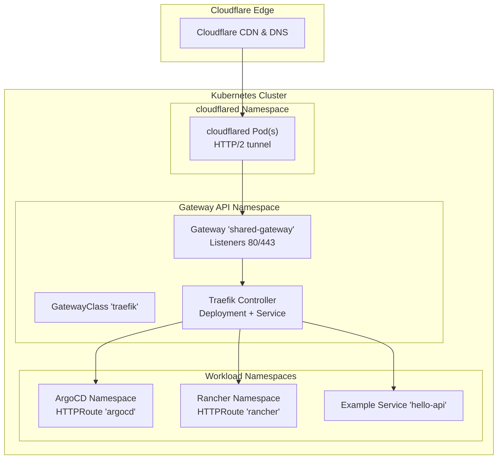
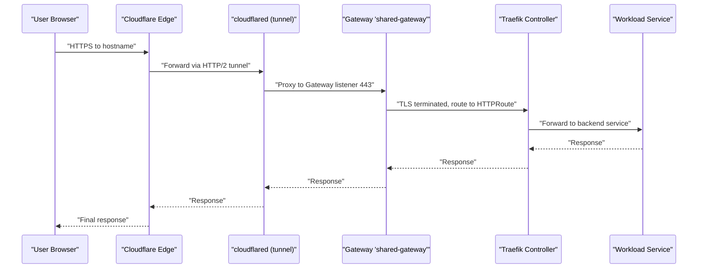
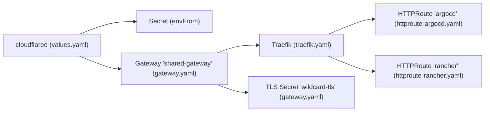

# Cloudflare Tunnel Integration

<cite>
**Referenced Files in This Document**
- [values.yaml](file://apps/infra/cloudflared/chart/values.yaml)
- [config.yaml](file://apps/infra/cloudflared/config.yaml)
- [kustomization.yaml](file://apps/infra/cloudflared/kustomization.yaml)
- [gateway.yaml](file://apps/infra/gateway-api/chart/gateway.yaml)
- [gatewayclass.yaml](file://apps/infra/gateway-api/chart/gatewayclass.yaml)
- [traefik.yaml](file://apps/infra/gateway-api/chart/traefik.yaml)
- [httproute-argocd.yaml](file://apps/playground/argocd-ingress/chart/httproute-argocd.yaml)
- [argocd-cmd-params-cm.yaml](file://apps/playground/argocd-ingress/chart/argocd-cmd-params-cm.yaml)
- [httproute-rancher.yaml](file://apps/playground/rancher/chart/httproute-rancher.yaml)
- [values.yaml](file://apps/playground/rancher/chart/values.yaml)
- [values.yaml](file://apps/playground/hello-api/chart/values.yaml)
- [tls-rancher-ca.yaml](file://apps/playground/cert-manager/chart/tls-rancher-ca.yaml)
- [secrets.yaml](file://bootstrap/secrets.yaml)
- [kustomization.yaml](file://kustomization.yaml)
</cite>

## Table of Contents
1. [Introduction](#introduction)
2. [Project Structure](#project-structure)
3. [Core Components](#core-components)
4. [Architecture Overview](#architecture-overview)
5. [Detailed Component Analysis](#detailed-component-analysis)
6. [Dependency Analysis](#dependency-analysis)
7. [Performance Considerations](#performance-considerations)
8. [Troubleshooting Guide](#troubleshooting-guide)
9. [Conclusion](#conclusion)
10. [Appendices](#appendices)

## Introduction
This document explains how Cloudflare Tunnel (cloudflared) integrates with the Kubernetes infrastructure in this repository. It covers the network flow from Cloudflare’s edge through the cloudflared tunnel to cluster services, HTTP/2 tunnel configuration, traffic routing via the Gateway API, and operational topics such as tunnel token management, DNS integration, certificate handling, security, monitoring, and performance optimization. It also clarifies the relationship between cloudflared and the Gateway API ingress controller (Traefik) used in this setup.

## Project Structure
The Cloudflare Tunnel integration is implemented as a Helm-based Kustomize overlay under apps/infra/cloudflared. The Gateway API stack (GatewayClass, Gateway, and Traefik controller) resides under apps/infra/gateway-api. Example workloads and routes (ArgoCD, Rancher) are under apps/playground and route via the shared Gateway.

**Diagram sources**
- [values.yaml:1-40](file://apps/infra/cloudflared/chart/values.yaml#L1-L40)
- [gatewayclass.yaml:1-10](file://apps/infra/gateway-api/chart/gatewayclass.yaml#L1-L10)
- [gateway.yaml:1-27](file://apps/infra/gateway-api/chart/gateway.yaml#L1-L27)
- [traefik.yaml:1-120](file://apps/infra/gateway-api/chart/traefik.yaml#L1-L120)
- [httproute-argocd.yaml:1-29](file://apps/playground/argocd-ingress/chart/httproute-argocd.yaml#L1-L29)
- [httproute-rancher.yaml:1-30](file://apps/playground/rancher/chart/httproute-rancher.yaml#L1-L30)
- [values.yaml:1-23](file://apps/playground/hello-api/chart/values.yaml#L1-L23)

**Section sources**
- [kustomization.yaml:1-8](file://apps/infra/cloudflared/kustomization.yaml#L1-L8)
- [kustomization.yaml:1-8](file://apps/infra/gateway-api/kustomization.yaml#L1-L8)
- [kustomization.yaml:1-9](file://apps/playground/argocd-ingress/kustomization.yaml#L1-L9)
- [kustomization.yaml:1-9](file://apps/playground/rancher/kustomization.yaml#L1-L9)

## Core Components
- cloudflared tunnel
  - Runs as a DaemonSet or Deployment (per repository configuration) with HTTP/2 tunnel mode and a token sourced from a Kubernetes Secret.
  - Exposed via a Service or headless access depending on deployment topology; here, the chart disables a Service for cloudflared.
- Gateway API stack
  - Defines a GatewayClass “traefik” and a Gateway “shared-gateway” with HTTP/HTTPS listeners.
  - Traefik runs as a Deployment with RBAC and exposes ports for HTTP/HTTPS/admin.
- Example routes and workloads
  - HTTPRoute for ArgoCD and Rancher attach to the shared Gateway and forward to respective services.
  - Example workload “hello-api” demonstrates a simple HTTP echo service.

Key configuration anchors:
- cloudflared arguments and token injection via environment variables from a Secret.
- GatewayClass controller name and Gateway listeners with TLS termination and certificate references.
- HTTPRoute hostnames and backendRefs to cluster services.

**Section sources**
- [values.yaml:1-40](file://apps/infra/cloudflared/chart/values.yaml#L1-L40)
- [gatewayclass.yaml:1-10](file://apps/infra/gateway-api/chart/gatewayclass.yaml#L1-L10)
- [gateway.yaml:1-27](file://apps/infra/gateway-api/chart/gateway.yaml#L1-L27)
- [traefik.yaml:1-120](file://apps/infra/gateway-api/chart/traefik.yaml#L1-L120)
- [httproute-argocd.yaml:1-29](file://apps/playground/argocd-ingress/chart/httproute-argocd.yaml#L1-L29)
- [httproute-rancher.yaml:1-30](file://apps/playground/rancher/chart/httproute-rancher.yaml#L1-L30)
- [values.yaml:1-23](file://apps/playground/hello-api/chart/values.yaml#L1-L23)

## Architecture Overview
The end-to-end flow:
- Cloudflare edge receives inbound traffic and proxies it to the configured origin.
- cloudflared runs inside the cluster and establishes an outbound HTTP/2 tunnel to Cloudflare.
- The Gateway API Gateway “shared-gateway” terminates TLS and forwards traffic to Traefik.
- Traefik, as the Gateway API controller, enforces routing rules defined by HTTPRoute resources.
- HTTPRoute selects the appropriate backend service in the workload namespace.

**Diagram sources**
- [values.yaml:11-18](file://apps/infra/cloudflared/chart/values.yaml#L11-L18)
- [gateway.yaml:17-26](file://apps/infra/gateway-api/chart/gateway.yaml#L17-L26)
- [traefik.yaml:74-96](file://apps/infra/gateway-api/chart/traefik.yaml#L74-L96)
- [httproute-argocd.yaml:9-29](file://apps/playground/argocd-ingress/chart/httproute-argocd.yaml#L9-L29)
- [httproute-rancher.yaml:9-29](file://apps/playground/rancher/chart/httproute-rancher.yaml#L9-L29)

## Detailed Component Analysis

### cloudflared Deployment and Tunnel Configuration
- Container image and version are pinned in the chart values.
- Arguments include tunnel mode, HTTP/2 protocol, and token sourcing from an environment variable backed by a Kubernetes Secret.
- Probes are disabled; resource requests/limits are modest.
- The chart intentionally disables a Service for cloudflared, implying in-cluster access via pod IP or headless discovery.

Operational implications:
- Token management relies on a Secret mounted via envFrom; ensure the Secret exists in the cloudflared namespace.
- HTTP/2 tunnel reduces latency and overhead compared to HTTP/1.1, improving throughput for edge routing.

**Section sources**
- [values.yaml:1-40](file://apps/infra/cloudflared/chart/values.yaml#L1-L40)
- [config.yaml:1-4](file://apps/infra/cloudflared/config.yaml#L1-L4)
- [kustomization.yaml:1-8](file://apps/infra/cloudflared/kustomization.yaml#L1-L8)

### Gateway API Stack (GatewayClass, Gateway, Traefik)
- GatewayClass defines the controller “traefik.io/gateway-controller”.
- Gateway “shared-gateway” exposes HTTP (port 80) and HTTPS (port 443) listeners, with TLS termination and a certificate reference.
- Traefik controller Deployment enables Gateway API providers and exposes ports for HTTP/HTTPS/admin.

Routing behavior:
- HTTPRoute resources attach to the Gateway and define hostnames and backendRefs to services.
- Request header modifiers can be used to propagate forwarded proto/port for upstream services that require it.

**Section sources**
- [gatewayclass.yaml:1-10](file://apps/infra/gateway-api/chart/gatewayclass.yaml#L1-L10)
- [gateway.yaml:1-27](file://apps/infra/gateway-api/chart/gateway.yaml#L1-L27)
- [traefik.yaml:1-120](file://apps/infra/gateway-api/chart/traefik.yaml#L1-L120)

### Example Routes and Workloads
- ArgoCD HTTPRoute attaches to the shared Gateway, sets forwarded headers, and targets the ArgoCD service.
- Rancher HTTPRoute similarly attaches to the shared Gateway and targets the Rancher service.
- Example “hello-api” service demonstrates a simple HTTP echo endpoint for testing.

These routes illustrate:
- Hostname-based routing to distinct namespaces.
- Header manipulation to inform upstream services about the original scheme and port.
- BackendRefs pointing to internal services.

**Section sources**
- [httproute-argocd.yaml:1-29](file://apps/playground/argocd-ingress/chart/httproute-argocd.yaml#L1-L29)
- [argocd-cmd-params-cm.yaml:1-13](file://apps/playground/argocd-ingress/chart/argocd-cmd-params-cm.yaml#L1-L13)
- [httproute-rancher.yaml:1-30](file://apps/playground/rancher/chart/httproute-rancher.yaml#L1-L30)
- [values.yaml:1-9](file://apps/playground/rancher/chart/values.yaml#L1-L9)
- [values.yaml:1-23](file://apps/playground/hello-api/chart/values.yaml#L1-L23)

### Certificate Management
- The Gateway references a TLS certificate Secret named “wildcard-tls”.
- A separate CA Certificate and Issuer are defined under cert-manager for Rancher, demonstrating a pattern for internal PKI use cases.

Operational note:
- Ensure the referenced TLS Secret exists and is valid for the hostnames used in HTTPRoute.
- For internal systems, cert-manager can automate issuance; for public domains, Cloudflare SSL/TLS policies can offload certificates at the edge.

**Section sources**
- [gateway.yaml:23-26](file://apps/infra/gateway-api/chart/gateway.yaml#L23-L26)
- [tls-rancher-ca.yaml:1-34](file://apps/playground/cert-manager/chart/tls-rancher-ca.yaml#L1-L34)

## Dependency Analysis
- cloudflared depends on:
  - A Kubernetes Secret containing the tunnel token (envFrom).
  - Network connectivity to Cloudflare’s tunnel endpoints.
- Gateway API depends on:
  - A functioning GatewayClass controller (Traefik).
  - HTTPRoute resources attached to the Gateway.
  - Backend services referenced by HTTPRoute.
- Certificates depend on:
  - Valid Secrets or cert-manager Issuers/Certificates for TLS termination.

**Diagram sources**
- [values.yaml:11-21](file://apps/infra/cloudflared/chart/values.yaml#L11-L21)
- [gateway.yaml:1-27](file://apps/infra/gateway-api/chart/gateway.yaml#L1-L27)
- [traefik.yaml:1-120](file://apps/infra/gateway-api/chart/traefik.yaml#L1-L120)
- [httproute-argocd.yaml:1-29](file://apps/playground/argocd-ingress/chart/httproute-argocd.yaml#L1-L29)
- [httproute-rancher.yaml:1-30](file://apps/playground/rancher/chart/httproute-rancher.yaml#L1-L30)

**Section sources**
- [values.yaml:1-40](file://apps/infra/cloudflared/chart/values.yaml#L1-L40)
- [gateway.yaml:1-27](file://apps/infra/gateway-api/chart/gateway.yaml#L1-L27)
- [traefik.yaml:1-120](file://apps/infra/gateway-api/chart/traefik.yaml#L1-L120)
- [httproute-argocd.yaml:1-29](file://apps/playground/argocd-ingress/chart/httproute-argocd.yaml#L1-L29)
- [httproute-rancher.yaml:1-30](file://apps/playground/rancher/chart/httproute-rancher.yaml#L1-L30)

## Performance Considerations
- Prefer HTTP/2 tunnel mode for reduced overhead and improved multiplexing.
- Right-size cloudflared resources to handle expected concurrency; adjust CPU/memory requests/limits as needed.
- Use a single shared Gateway for multiple routes to minimize controller overhead.
- Enable connection pooling and keep-alive at the application layer where applicable.
- Monitor Gateway API controller metrics and tune Traefik entrypoints and admin endpoints for observability.

[No sources needed since this section provides general guidance]

## Troubleshooting Guide
Common issues and checks:
- Tunnel connectivity
  - Verify the tunnel token Secret exists and is mounted to cloudflared.
  - Confirm cloudflared logs show successful tunnel establishment and heartbeat.
  - Ensure firewall/NAT rules allow outbound connections from cloudflared to Cloudflare endpoints.
- TLS termination and certificates
  - Confirm the referenced TLS Secret exists and contains valid certificate/key material for the hostnames.
  - Validate that HTTPRoute hostnames match the certificate subject or SANs.
- Routing and backends
  - Ensure HTTPRoute parentRefs reference the correct Gateway and namespace.
  - Verify backend services exist and are reachable from the Gateway controller.
  - Check that the Gateway listeners accept the protocols and ports used by routes.
- Header forwarding
  - Confirm RequestHeaderModifier filters set X-Forwarded-Proto and X-Forwarded-Port appropriately for upstream services that require it.

**Section sources**
- [values.yaml:11-21](file://apps/infra/cloudflared/chart/values.yaml#L11-L21)
- [gateway.yaml:17-26](file://apps/infra/gateway-api/chart/gateway.yaml#L17-L26)
- [httproute-argocd.yaml:19-26](file://apps/playground/argocd-ingress/chart/httproute-argocd.yaml#L19-L26)
- [httproute-rancher.yaml:19-26](file://apps/playground/rancher/chart/httproute-rancher.yaml#L19-L26)

## Conclusion
This repository integrates Cloudflare Tunnel with a Gateway API-based ingress stack. cloudflared runs inside the cluster in HTTP/2 tunnel mode, while Traefik acts as the Gateway API controller. HTTPRoute resources define hostname-based routing to services across namespaces. Proper token management, certificate provisioning, and route configuration are essential for secure and reliable operation. Monitoring and tuning of cloudflared and Traefik resources ensures optimal performance for edge routing.

[No sources needed since this section summarizes without analyzing specific files]

## Appendices

### Practical Setup Examples
- Create the tunnel token Secret in the cloudflared namespace and reference it via envFrom in the cloudflared values.
- Define a GatewayClass and Gateway with TLS termination and a certificate Secret.
- Create HTTPRoute resources that attach to the Gateway and point to backend services.
- Validate connectivity by checking cloudflared logs and Gateway controller status.

**Section sources**
- [values.yaml:11-21](file://apps/infra/cloudflared/chart/values.yaml#L11-L21)
- [gatewayclass.yaml:1-10](file://apps/infra/gateway-api/chart/gatewayclass.yaml#L1-L10)
- [gateway.yaml:17-26](file://apps/infra/gateway-api/chart/gateway.yaml#L17-L26)
- [httproute-argocd.yaml:9-29](file://apps/playground/argocd-ingress/chart/httproute-argocd.yaml#L9-L29)
- [httproute-rancher.yaml:9-29](file://apps/playground/rancher/chart/httproute-rancher.yaml#L9-L29)

### Security Considerations
- Restrict cloudflared network access to Cloudflare endpoints only.
- Use short-lived tokens and rotate them regularly; store tokens in Kubernetes Secrets.
- Enforce TLS termination at the Gateway and validate certificates against known issuers.
- Apply least-privilege RBAC to the Traefik controller and limit exposure of admin endpoints.

**Section sources**
- [values.yaml:11-18](file://apps/infra/cloudflared/chart/values.yaml#L11-L18)
- [traefik.yaml:10-50](file://apps/infra/gateway-api/chart/traefik.yaml#L10-L50)

### Monitoring and Health
- Observe cloudflared metrics and logs for tunnel health and latency.
- Monitor Traefik Gateway API controller logs and metrics for route reconciliation and traffic.
- Use Kubernetes events and Gateway status conditions to detect misconfigurations.

**Section sources**
- [values.yaml:23-26](file://apps/infra/cloudflared/chart/values.yaml#L23-L26)
- [traefik.yaml:60-96](file://apps/infra/gateway-api/chart/traefik.yaml#L60-L96)