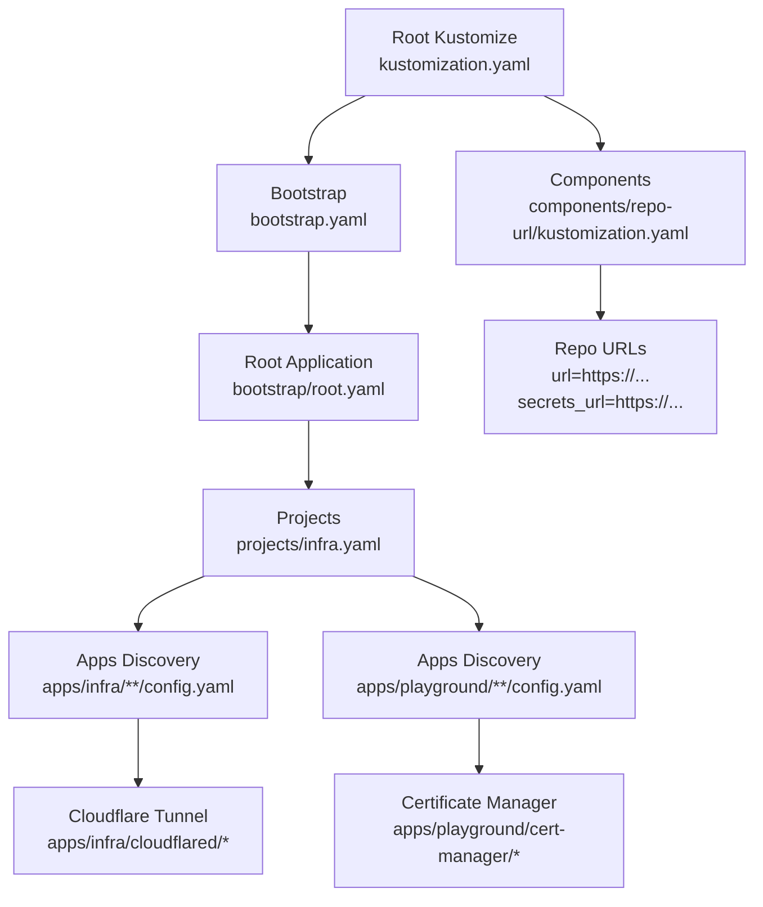
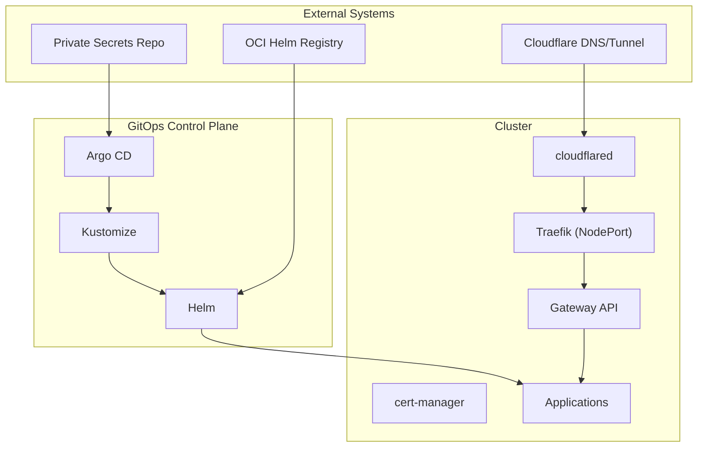
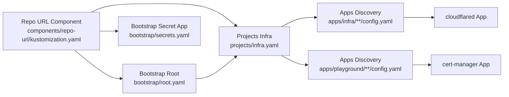

# External System Integrations

<cite>
**Referenced Files in This Document**
- [README.md](file://README.md)
- [bootstrap.yaml](file://bootstrap.yaml)
- [opencode.json](file://opencode.json)
- [components/repo-url/kustomization.yaml](file://components/repo-url/kustomization.yaml)
- [bootstrap/root.yaml](file://bootstrap/root.yaml)
- [bootstrap/cluster-resources.yaml](file://bootstrap/cluster-resources.yaml)
- [bootstrap/secrets.yaml](file://bootstrap/secrets.yaml)
- [projects/infra.yaml](file://projects/infra.yaml)
- [apps/infra/cloudflared/kustomization.yaml](file://apps/infra/cloudflared/kustomization.yaml)
- [apps/infra/cloudflared/config.yaml](file://apps/infra/cloudflared/config.yaml)
- [apps/playground/cert-manager/kustomization.yaml](file://apps/playground/cert-manager/kustomization.yaml)
- [apps/playground/cert-manager/config.yaml](file://apps/playground/cert-manager/config.yaml)
</cite>

## Table of Contents
1. [Introduction](#introduction)
2. [Project Structure](#project-structure)
3. [Core Components](#core-components)
4. [Architecture Overview](#architecture-overview)
5. [Detailed Component Analysis](#detailed-component-analysis)
6. [Dependency Analysis](#dependency-analysis)
7. [Performance Considerations](#performance-considerations)
8. [Troubleshooting Guide](#troubleshooting-guide)
9. [Conclusion](#conclusion)
10. [Appendices](#appendices)

## Introduction
This document explains how the GitOps infrastructure integrates with external systems and services. It covers:
- External Helm registries and private Git repositories
- CI/CD pipeline integration patterns
- Cloudflare Tunnel connectivity
- External DNS and certificate management
- OpenCode AI agent integration, rule-based automation, and skill development
- Webhook configurations, notifications, and alerting
- Security considerations for credentials and access control

The repository follows a GitOps model using Argo CD, Kustomize, and Helm. External integrations are configured through centralized repository URLs, secret synchronization from a private repository, and declarative manifests.

## Project Structure
The repository organizes integration-related components as follows:
- Centralized repository URL definitions via a Kustomize component
- Bootstrap chain that installs Argo CD, cluster resources, and secrets
- Projects that define AppProjects and ApplicationSets for discovering applications
- Application packages under apps/infra and apps/playground that expose services and integrate with external systems

**Diagram sources**
- [README.md:87-118](file://README.md#L87-L118)
- [components/repo-url/kustomization.yaml:1-11](file://components/repo-url/kustomization.yaml#L1-L11)
- [bootstrap.yaml:1-26](file://bootstrap.yaml#L1-L26)
- [bootstrap/root.yaml:1-37](file://bootstrap/root.yaml#L1-L37)
- [projects/infra.yaml:1-85](file://projects/infra.yaml#L1-L85)
- [apps/infra/cloudflared/kustomization.yaml:1-8](file://apps/infra/cloudflared/kustomization.yaml#L1-L8)
- [apps/playground/cert-manager/kustomization.yaml:1-6](file://apps/playground/cert-manager/kustomization.yaml#L1-L6)

**Section sources**
- [README.md:87-118](file://README.md#L87-L118)
- [components/repo-url/kustomization.yaml:1-11](file://components/repo-url/kustomization.yaml#L1-L11)
- [bootstrap.yaml:1-26](file://bootstrap.yaml#L1-L26)
- [bootstrap/root.yaml:1-37](file://bootstrap/root.yaml#L1-L37)
- [projects/infra.yaml:1-85](file://projects/infra.yaml#L1-L85)

## Core Components
- Central repository URL component: Provides shared repoURL and secrets_url values used across bootstrap and project manifests.
- Bootstrap root Application: References the projects directory and ignores differences for dynamic resources.
- Cluster resources ApplicationSet: Creates shared cluster objects with a defined sync wave.
- Secrets Application: Synchronizes secrets from a private repository into the cluster.
- Infra AppProject and ApplicationSet: Discovers infrastructure apps (e.g., cloudflared) via config.yaml files.
- Playground AppProject and ApplicationSet: Discovers user-facing apps (e.g., cert-manager) via config.yaml files.

Key integration touchpoints:
- External Helm registry usage is encouraged via OCI references.
- Private repository secrets are isolated from the public repository.
- Sync waves ensure proper ordering for dependencies (e.g., Gateway before HTTPRoutes).

**Section sources**
- [components/repo-url/kustomization.yaml:1-11](file://components/repo-url/kustomization.yaml#L1-L11)
- [bootstrap/root.yaml:19-28](file://bootstrap/root.yaml#L19-L28)
- [bootstrap/cluster-resources.yaml:4-5](file://bootstrap/cluster-resources.yaml#L4-L5)
- [bootstrap/secrets.yaml:6-7](file://bootstrap/secrets.yaml#L6-L7)
- [projects/infra.yaml:4-21](file://projects/infra.yaml#L4-L21)
- [README.md:120-127](file://README.md#L120-L127)
- [README.md:76-85](file://README.md#L76-L85)

## Architecture Overview
The external integration architecture connects the GitOps control plane with external systems through:
- Argo CD as the GitOps engine
- Kustomize for templating and composition
- Helm for chart-based deployments
- Private repository for secrets
- Cloudflare Tunnel for secure ingress
- cert-manager for TLS certificates

**Diagram sources**
- [README.md:5-48](file://README.md#L5-L48)
- [README.md:120-127](file://README.md#L120-L127)
- [README.md:160-163](file://README.md#L160-L163)
- [apps/infra/cloudflared/config.yaml:1-4](file://apps/infra/cloudflared/config.yaml#L1-L4)
- [apps/playground/cert-manager/config.yaml:1-5](file://apps/playground/cert-manager/config.yaml#L1-L5)

## Detailed Component Analysis

### External Helm Registries
- The repository encourages using OCI Helm charts from a hosted registry and references a public Helm charts repository.
- Helm charts are enabled via Kustomize build options in ApplicationSets, allowing seamless integration with external OCI registries.

Integration pattern:
- Reference OCI chart repositories in Kustomize helmChart blocks.
- Use Argo CD’s automated sync to reconcile chart versions.

Security and reliability:
- Pin chart versions or use semver ranges.
- Monitor registry availability and chart provenance.

**Section sources**
- [README.md:120-127](file://README.md#L120-L127)
- [projects/infra.yaml:59-60](file://projects/infra.yaml#L59-L60)

### Private Git Repositories (Secrets)
- A dedicated private repository synchronizes secrets into the cluster.
- The secrets Application sets a sync wave to ensure prerequisites exist before applying secrets.
- The root Application ignores differences for ConfigMaps containing repository URLs to avoid drift during replacement.

Integration pattern:
- Store sensitive values in the private repository.
- Reference the private repo URL via the centralized repo URL component.
- Apply the secrets ApplicationSet to sync secrets into target namespaces.

Operational notes:
- Keep the private repository read-only to Argo CD unless explicit write permissions are required.
- Use branch protection and least privilege access controls.

**Section sources**
- [README.md:160-163](file://README.md#L160-L163)
- [bootstrap/secrets.yaml:6-7](file://bootstrap/secrets.yaml#L6-L7)
- [bootstrap/root.yaml:19-28](file://bootstrap/root.yaml#L19-L28)
- [components/repo-url/kustomization.yaml:4-10](file://components/repo-url/kustomization.yaml#L4-L10)

### CI/CD Pipeline Integration
- The bootstrap chain demonstrates a recommended CI/CD flow: build with Kustomize, apply bootstrap, then let Argo CD discover and sync applications.
- ApplicationSets scan for config.yaml files across apps/infra and apps/playground, enabling CI-triggered updates when new apps are added.

Integration pattern:
- CI job builds the root Kustomize manifest and applies bootstrap.
- Subsequent Argo CD sync reconciles discovered applications with Helm support.

Best practices:
- Validate manifests in CI before applying bootstrap.
- Gate ApplicationSet changes with review and approval policies.

**Section sources**
- [README.md:57-75](file://README.md#L57-L75)
- [projects/infra.yaml:33-44](file://projects/infra.yaml#L33-L44)

### Cloudflare Tunnel Integration
- The cloudflared application is packaged as an infrastructure app and annotated with a sync wave to ensure it deploys before ingress is established.
- The network flow shows Cloudflare edge terminating TLS, tunneled to cloudflared, then forwarded to Traefik and Gateway API.

Integration pattern:
- Deploy cloudflared as an app under apps/infra/cloudflared.
- Configure DNS records to point to Cloudflare, which tunnels traffic into the cluster.
- Use Gateway API HTTPRoutes to route traffic to backend services.

Operational notes:
- Ensure cloudflared has appropriate RBAC and service account permissions.
- Monitor tunnel health and rotation of Cloudflare credentials.

**Section sources**
- [README.md:5-48](file://README.md#L5-L48)
- [apps/infra/cloudflared/kustomization.yaml:1-8](file://apps/infra/cloudflared/kustomization.yaml#L1-L8)
- [apps/infra/cloudflared/config.yaml:1-4](file://apps/infra/cloudflared/config.yaml#L1-L4)

### External DNS Providers and Certificate Management
- cert-manager is packaged as a playground app and annotated with a sync wave suitable for TLS issuance.
- The setup supports wildcard certificates and integration with external DNS providers via DNS01 solvers.

Integration pattern:
- Deploy cert-manager as an app under apps/playground/cert-manager.
- Configure ClusterIssuer or Issuer resources pointing to external DNS providers.
- Use cert-manager to provision TLS certificates for ingresses exposed via Gateway API.

Operational notes:
- Store DNS provider credentials securely (e.g., in the private secrets repository).
- Monitor certificate renewals and issuer status.

**Section sources**
- [README.md:148-158](file://README.md#L148-L158)
- [apps/playground/cert-manager/kustomization.yaml:1-6](file://apps/playground/cert-manager/kustomization.yaml#L1-L6)
- [apps/playground/cert-manager/config.yaml:1-5](file://apps/playground/cert-manager/config.yaml#L1-L5)

### OpenCode AI Agent Integration, Rules, and Skills
- The repository includes OpenCode configuration that defines agents, roles, and instruction rules.
- Agents include DevOps, Solution Architect, Site Reliability Engineer, Researcher, Git Operator, and Docs Writer.
- Instruction rules cover GitOps practices, web research, and agent behavior.

Integration pattern:
- Use the OpenCode agents to propose, review, and implement changes to the GitOps repository.
- Leverage the Researcher agent for external references and implementation details.
- Use the Git Operator agent to perform repository operations (status, pull, commit, push, PR).

Operational notes:
- Assign permissions per agent (e.g., deny editing for SA/SRE, allow webfetch for Researcher).
- Align agent actions with the GitOps principle of immutability and auditability.

**Section sources**
- [opencode.json:1-52](file://opencode.json#L1-L52)

### Webhooks, Notifications, and Alerting
- The repository does not include explicit webhook or alerting configurations.
- Recommended patterns:
  - Use Argo CD notifications to send alerts on sync failures or health changes.
  - Integrate with external alerting systems (e.g., PagerDuty, Slack) via Argo CD notification plugins.
  - Configure webhooks in CI/CD to trigger Argo CD sync upon commits to application repos.

Implementation guidance:
- Define NotificationChannels and Applications with event-based triggers.
- Secure webhook endpoints and validate signatures.

[No sources needed since this section provides general guidance]

### Security Considerations
- Credential management:
  - Store secrets in the private repository and reference via Argo CD Application resources.
  - Avoid embedding secrets in public manifests.
- Access control:
  - Restrict Argo CD project permissions to trusted repositories and namespaces.
  - Enforce least privilege for service accounts used by apps (e.g., cloudflared, cert-manager).
- Supply chain:
  - Pin Helm chart versions and verify OCI image digests when possible.
  - Audit external dependencies and update regularly.

**Section sources**
- [README.md:160-163](file://README.md#L160-L163)
- [README.md:120-127](file://README.md#L120-L127)

## Dependency Analysis
The integration dependencies across components are driven by sync waves and repository URL substitution.

**Diagram sources**
- [components/repo-url/kustomization.yaml:1-11](file://components/repo-url/kustomization.yaml#L1-L11)
- [bootstrap/root.yaml:15-17](file://bootstrap/root.yaml#L15-L17)
- [bootstrap/secrets.yaml:12-13](file://bootstrap/secrets.yaml#L12-L13)
- [projects/infra.yaml:34-45](file://projects/infra.yaml#L34-L45)
- [apps/infra/cloudflared/config.yaml:1-4](file://apps/infra/cloudflared/config.yaml#L1-L4)
- [apps/playground/cert-manager/config.yaml:1-5](file://apps/playground/cert-manager/config.yaml#L1-L5)

**Section sources**
- [components/repo-url/kustomization.yaml:1-11](file://components/repo-url/kustomization.yaml#L1-L11)
- [bootstrap/root.yaml:15-17](file://bootstrap/root.yaml#L15-L17)
- [bootstrap/secrets.yaml:12-13](file://bootstrap/secrets.yaml#L12-L13)
- [projects/infra.yaml:34-45](file://projects/infra.yaml#L34-L45)

## Performance Considerations
- Minimize reconciliation churn by pinning chart versions and avoiding frequent image tag updates.
- Use ApplicationSet generators judiciously to reduce scanning overhead.
- Apply sync waves to prevent cascading failures during startup sequences.
- Monitor Argo CD sync durations and adjust retry/backoff policies as needed.

[No sources needed since this section provides general guidance]

## Troubleshooting Guide
- Secrets not applied:
  - Verify the private repository URL is correctly substituted and reachable.
  - Confirm the secrets Application has the correct sync wave and destination namespace.
- Ingress routing issues:
  - Ensure cloudflared is deployed before Gateway and HTTPRoute resources.
  - Validate DNS resolution and Cloudflare tunnel connectivity.
- Certificate provisioning failures:
  - Check cert-manager logs and issuer configuration.
  - Verify DNS01 solver credentials and record propagation.
- Argo CD drift:
  - Review ignored differences for ConfigMaps and ApplicationSets.
  - Reconcile manual changes back into Git.

**Section sources**
- [bootstrap/secrets.yaml:6-7](file://bootstrap/secrets.yaml#L6-L7)
- [README.md:5-48](file://README.md#L5-L48)
- [apps/playground/cert-manager/config.yaml:1-5](file://apps/playground/cert-manager/config.yaml#L1-L5)
- [bootstrap/root.yaml:19-28](file://bootstrap/root.yaml#L19-L28)

## Conclusion
This GitOps infrastructure integrates external systems through a structured bootstrap chain, centralized repository URL management, and declarative application manifests. By leveraging Argo CD, Kustomize, and Helm, the repository supports secure and reliable integrations with external Helm registries, private Git repositories, Cloudflare Tunnel, and cert-manager. OpenCode agents enable rule-based automation and collaborative development. Adhering to sync waves, strict credential management, and least privilege access ensures robust and maintainable external integrations.

[No sources needed since this section summarizes without analyzing specific files]

## Appendices
- Network flow and hostnames are documented in the repository’s main guide.
- Adding new applications follows a consistent pattern of config.yaml discovery and Kustomize/Helm rendering.

**Section sources**
- [README.md:38-56](file://README.md#L38-L56)
- [README.md:128-134](file://README.md#L128-L134)