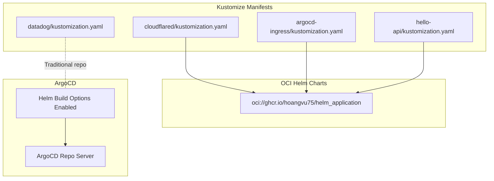
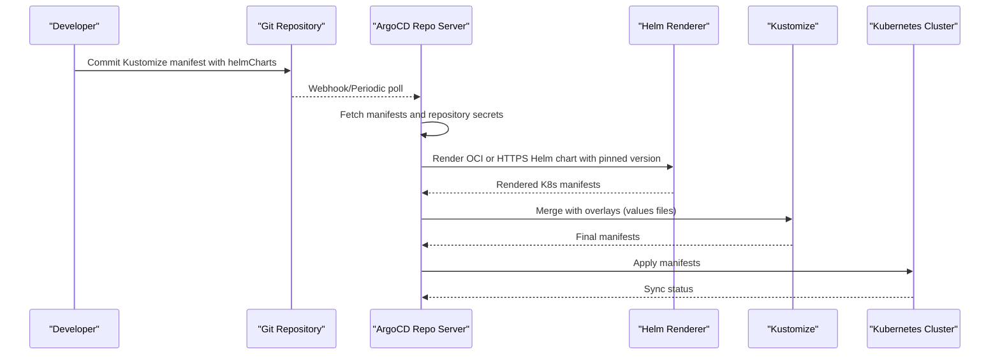
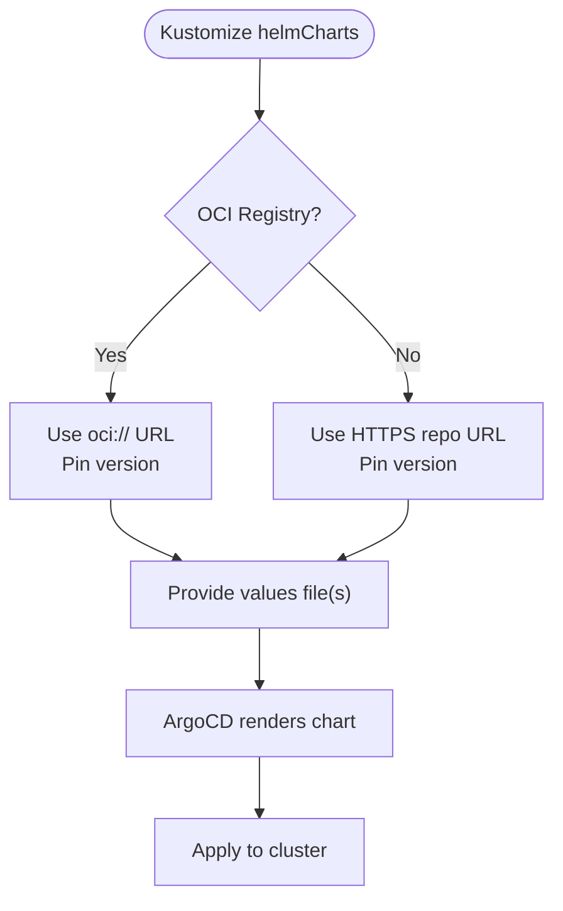
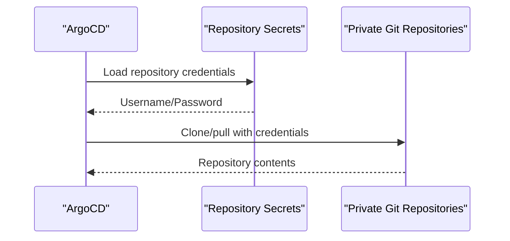
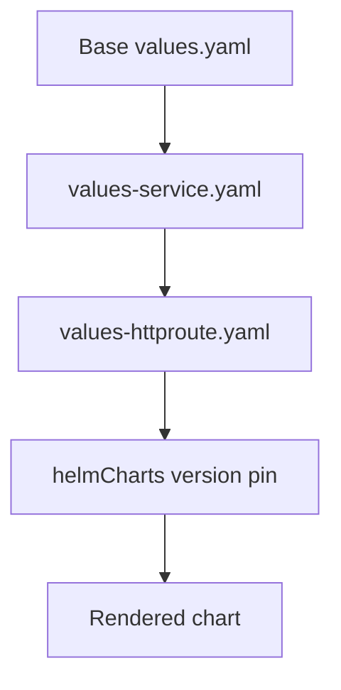
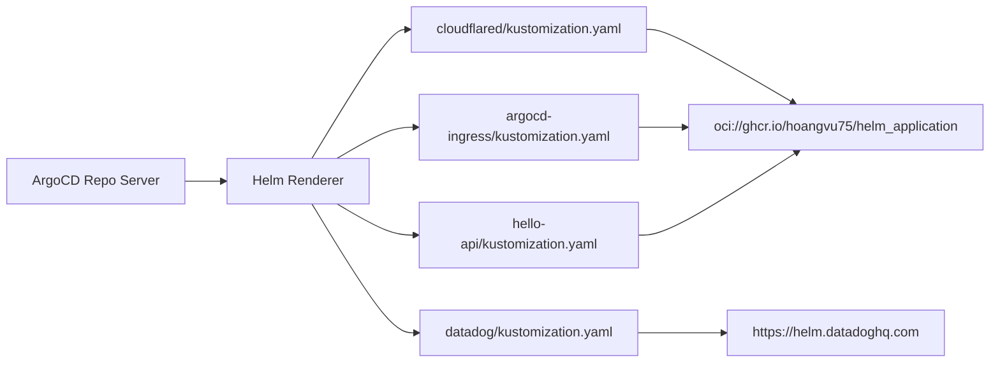

# Helm Registry Integration

<cite>
**Referenced Files in This Document**
- [apps/infra/cloudflared/chart/kustomization.yaml](file://apps/infra/cloudflared/chart/kustomization.yaml)
- [apps/infra/cloudflared/chart/values.yaml](file://apps/infra/cloudflared/chart/values.yaml)
- [apps/infra/datadog/chart/kustomization.yaml](file://apps/infra/datadog/chart/kustomization.yaml)
- [apps/infra/datadog/chart/values.yaml](file://apps/infra/datadog/chart/values.yaml)
- [apps/playground/argocd-ingress/chart/kustomization.yaml](file://apps/playground/argocd-ingress/chart/kustomization.yaml)
- [apps/playground/argocd-ingress/chart/values.yaml](file://apps/playground/argocd-ingress/chart/values.yaml)
- [apps/playground/hello-api/chart/kustomization.yaml](file://apps/playground/hello-api/chart/kustomization.yaml)
- [apps/playground/hello-api/chart/values.yaml](file://apps/playground/hello-api/chart/values.yaml)
- [.opencode/rules/gitops.md](file://.opencode/rules/gitops.md)
- [guide/argocd/argo_cd.md](file://guide/argocd/argo_cd.md)
- [guide/argocd/argocd-repository-secrets.yaml](file://guide/argocd/argocd-repository-secrets.yaml)
- [components/repo-url/kustomization.yaml](file://components/repo-url/kustomization.yaml)
- [bootstrap/secrets.yaml](file://bootstrap/secrets.yaml)
</cite>

## Table of Contents
1. [Introduction](#introduction)
2. [Project Structure](#project-structure)
3. [Core Components](#core-components)
4. [Architecture Overview](#architecture-overview)
5. [Detailed Component Analysis](#detailed-component-analysis)
6. [Dependency Analysis](#dependency-analysis)
7. [Performance Considerations](#performance-considerations)
8. [Troubleshooting Guide](#troubleshooting-guide)
9. [Conclusion](#conclusion)

## Introduction
This document explains how Helm charts are integrated into the GitOps infrastructure using Kustomize and ArgoCD. It focuses on OCI registry usage with ghcr.io/hoangvu75/helm_application, demonstrates chart references in Kustomize manifests, outlines authentication and access control patterns, and provides guidance on version pinning, dependency resolution, image pulling policies, and performance optimization for chart distribution.

## Project Structure
The repository organizes applications under apps/<team>/<app>/chart with Kustomize manifests and values files. OCI-based Helm charts are referenced via helmCharts entries in Kustomize, while traditional chart repositories are also used for select components. ArgoCD is configured to enable Helm support and manage synchronization.

**Diagram sources**
- [apps/infra/cloudflared/chart/kustomization.yaml:1-11](file://apps/infra/cloudflared/chart/kustomization.yaml#L1-L11)
- [apps/playground/argocd-ingress/chart/kustomization.yaml:1-14](file://apps/playground/argocd-ingress/chart/kustomization.yaml#L1-L14)
- [apps/playground/hello-api/chart/kustomization.yaml:1-13](file://apps/playground/hello-api/chart/kustomization.yaml#L1-L13)
- [apps/infra/datadog/chart/kustomization.yaml:1-11](file://apps/infra/datadog/chart/kustomization.yaml#L1-L11)
- [guide/argocd/argo_cd.md:7-8](file://guide/argocd/argo_cd.md#L7-L8)

**Section sources**
- [apps/infra/cloudflared/chart/kustomization.yaml:1-11](file://apps/infra/cloudflared/chart/kustomization.yaml#L1-L11)
- [apps/infra/datadog/chart/kustomization.yaml:1-11](file://apps/infra/datadog/chart/kustomization.yaml#L1-L11)
- [apps/playground/argocd-ingress/chart/kustomization.yaml:1-14](file://apps/playground/argocd-ingress/chart/kustomization.yaml#L1-L14)
- [apps/playground/hello-api/chart/kustomization.yaml:1-13](file://apps/playground/hello-api/chart/kustomization.yaml#L1-L13)
- [guide/argocd/argo_cd.md:7-8](file://guide/argocd/argo_cd.md#L7-L8)

## Core Components
- OCI Helm chart references: The preferred pattern is to reference charts from the OCI registry ghcr.io/hoangvu75/helm_application using the oci:// scheme in Kustomize helmCharts blocks. Version pinning is enforced per chart.
- Traditional Helm repositories: Some components still use HTTPS-based Helm repositories for chart sources.
- ArgoCD configuration: The repository enables Helm support in ArgoCD via build options and restarts the repo server to apply changes.
- Authentication and access control: Private repositories are secured using ArgoCD repository secrets with username/password credentials.

Key implementation references:
- OCI chart usage and version pinning in Kustomize manifests
- ArgoCD Helm build option enabling
- Repository secrets for private Git repositories

**Section sources**
- [.opencode/rules/gitops.md:8-17](file://.opencode/rules/gitops.md#L8-L17)
- [apps/infra/cloudflared/chart/kustomization.yaml:4-10](file://apps/infra/cloudflared/chart/kustomization.yaml#L4-L10)
- [apps/playground/argocd-ingress/chart/kustomization.yaml:4-10](file://apps/playground/argocd-ingress/chart/kustomization.yaml#L4-L10)
- [apps/playground/hello-api/chart/kustomization.yaml:4-10](file://apps/playground/hello-api/chart/kustomization.yaml#L4-L10)
- [guide/argocd/argo_cd.md:7-8](file://guide/argocd/argo_cd.md#L7-L8)
- [guide/argocd/argocd-repository-secrets.yaml:1-30](file://guide/argocd/argocd-repository-secrets.yaml#L1-L30)

## Architecture Overview
The GitOps pipeline integrates Kustomize, ArgoCD, and Helm as follows:
- Kustomize consumes Helm charts from OCI registries or traditional Helm repositories.
- ArgoCD’s repo server runs with Helm support enabled to render charts during sync.
- Private repositories are accessed using ArgoCD repository secrets.
- Charts are rendered with pinned versions and merged with overlays (values files) before applying to the cluster.

**Diagram sources**
- [guide/argocd/argo_cd.md:7-8](file://guide/argocd/argo_cd.md#L7-L8)
- [apps/infra/cloudflared/chart/kustomization.yaml:4-10](file://apps/infra/cloudflared/chart/kustomization.yaml#L4-L10)
- [apps/playground/argocd-ingress/chart/kustomization.yaml:4-10](file://apps/playground/argocd-ingress/chart/kustomization.yaml#L4-L10)
- [apps/playground/hello-api/chart/kustomization.yaml:4-10](file://apps/playground/hello-api/chart/kustomization.yaml#L4-L10)
- [guide/argocd/argocd-repository-secrets.yaml:1-30](file://guide/argocd/argocd-repository-secrets.yaml#L1-L30)

## Detailed Component Analysis

### OCI Helm Chart References
Preferred approach:
- Use oci://ghcr.io/hoangvu75/helm_application as the repo URL in Kustomize helmCharts.
- Pin the chart version per release to ensure deterministic deployments.
- Provide values files to customize chart behavior without forking charts.

Examples:
- Cloudflared application references the OCI chart with a pinned version and a values file.
- Argocd ingress and hello-api applications similarly reference the OCI chart with pinned versions and overlay values.

**Diagram sources**
- [apps/infra/cloudflared/chart/kustomization.yaml:4-10](file://apps/infra/cloudflared/chart/kustomization.yaml#L4-L10)
- [apps/playground/argocd-ingress/chart/kustomization.yaml:4-10](file://apps/playground/argocd-ingress/chart/kustomization.yaml#L4-L10)
- [apps/playground/hello-api/chart/kustomization.yaml:4-10](file://apps/playground/hello-api/chart/kustomization.yaml#L4-L10)

**Section sources**
- [.opencode/rules/gitops.md:8-17](file://.opencode/rules/gitops.md#L8-L17)
- [apps/infra/cloudflared/chart/kustomization.yaml:4-10](file://apps/infra/cloudflared/chart/kustomization.yaml#L4-L10)
- [apps/playground/argocd-ingress/chart/kustomization.yaml:4-10](file://apps/playground/argocd-ingress/chart/kustomization.yaml#L4-L10)
- [apps/playground/hello-api/chart/kustomization.yaml:4-10](file://apps/playground/hello-api/chart/kustomization.yaml#L4-L10)

### Authentication and Access Control
- Private Git repositories are granted access via ArgoCD repository secrets with username and password fields.
- These secrets label repositories for ArgoCD to use during sync operations.
- Bootstrap application manages secrets repository access with automation settings.

**Diagram sources**
- [guide/argocd/argocd-repository-secrets.yaml:1-30](file://guide/argocd/argocd-repository-secrets.yaml#L1-L30)
- [bootstrap/secrets.yaml:1-24](file://bootstrap/secrets.yaml#L1-L24)

**Section sources**
- [guide/argocd/argocd-repository-secrets.yaml:1-30](file://guide/argocd/argocd-repository-secrets.yaml#L1-L30)
- [bootstrap/secrets.yaml:1-24](file://bootstrap/secrets.yaml#L1-L24)

### Chart Version Management and Overlays
- Version pinning: Each helmCharts block specifies a version to avoid drift across environments.
- Overlay values: Additional values files can be layered for environment-specific overrides.
- Example: hello-api uses multiple values files to split service and HTTPRoute configurations.

**Diagram sources**
- [apps/playground/hello-api/chart/kustomization.yaml:11-13](file://apps/playground/hello-api/chart/kustomization.yaml#L11-L13)
- [apps/playground/hello-api/chart/values.yaml:1-23](file://apps/playground/hello-api/chart/values.yaml#L1-L23)

**Section sources**
- [apps/playground/hello-api/chart/kustomization.yaml:11-13](file://apps/playground/hello-api/chart/kustomization.yaml#L11-L13)
- [apps/playground/hello-api/chart/values.yaml:1-23](file://apps/playground/hello-api/chart/values.yaml#L1-L23)

### Image Pulling Policies and Resource Requests
- Image pull policy: Charts commonly set pullPolicy to avoid unnecessary pulls in controlled environments.
- Resource requests and limits: Defined to constrain resource usage and improve cluster scheduling predictability.
- Example: cloudflared and hello-api define image tags and resource allocations.

**Section sources**
- [apps/infra/cloudflared/chart/values.yaml:6-37](file://apps/infra/cloudflared/chart/values.yaml#L6-L37)
- [apps/playground/hello-api/chart/values.yaml:6-22](file://apps/playground/hello-api/chart/values.yaml#L6-L22)

### Dependency Resolution
- OCI charts: Dependencies are resolved by the Helm renderer when rendering the chart.
- Traditional repositories: Dependencies are resolved from the specified HTTPS repository.
- Ensure repository credentials are configured for private OCI registries if applicable.

**Section sources**
- [apps/infra/datadog/chart/kustomization.yaml:5-10](file://apps/infra/datadog/chart/kustomization.yaml#L5-L10)
- [apps/infra/cloudflared/chart/kustomization.yaml:5-6](file://apps/infra/cloudflared/chart/kustomization.yaml#L5-L6)

## Dependency Analysis
The following diagram shows how Kustomize manifests depend on OCI and HTTPS Helm repositories and how ArgoCD orchestrates rendering and application.

**Diagram sources**
- [apps/infra/cloudflared/chart/kustomization.yaml:4-10](file://apps/infra/cloudflared/chart/kustomization.yaml#L4-L10)
- [apps/playground/argocd-ingress/chart/kustomization.yaml:4-10](file://apps/playground/argocd-ingress/chart/kustomization.yaml#L4-L10)
- [apps/playground/hello-api/chart/kustomization.yaml:4-10](file://apps/playground/hello-api/chart/kustomization.yaml#L4-L10)
- [apps/infra/datadog/chart/kustomization.yaml:5-10](file://apps/infra/datadog/chart/kustomization.yaml#L5-L10)

**Section sources**
- [apps/infra/cloudflared/chart/kustomization.yaml:4-10](file://apps/infra/cloudflared/chart/kustomization.yaml#L4-L10)
- [apps/playground/argocd-ingress/chart/kustomization.yaml:4-10](file://apps/playground/argocd-ingress/chart/kustomization.yaml#L4-L10)
- [apps/playground/hello-api/chart/kustomization.yaml:4-10](file://apps/playground/hello-api/chart/kustomization.yaml#L4-L10)
- [apps/infra/datadog/chart/kustomization.yaml:5-10](file://apps/infra/datadog/chart/kustomization.yaml#L5-L10)

## Performance Considerations
- Prefer OCI charts for improved distribution and reduced latency compared to HTTPS repository polling.
- Pin chart versions to avoid frequent re-downloads and ensure reproducibility.
- Minimize chart complexity by using overlays (values files) instead of duplicating chart sources.
- Keep ArgoCD repo server updated with Helm support to reduce render-time overhead.
- Limit concurrent syncs and use sync waves to stagger deployments when necessary.

## Troubleshooting Guide
Common registry connectivity issues and resolutions:
- OCI registry access failures:
  - Verify the oci:// URL and chart name are correct.
  - Confirm network egress allows outbound to ghcr.io.
  - Ensure ArgoCD repo server has Helm support enabled and is restarted after configuration changes.
- Private repository access failures:
  - Validate repository secrets exist with correct labels and credentials.
  - Confirm the secret’s URL matches the repository being accessed.
  - Check that the bootstrap application is applied and secrets are reconciled.
- Version mismatch or drift:
  - Re-pin the helmCharts version in Kustomize manifests.
  - Re-render locally to confirm the intended chart version is used.
- Rendering errors:
  - Review values files for invalid keys or unsupported types.
  - Temporarily remove overlays to isolate problematic configuration.

Operational references:
- Enabling Helm support and restarting the repo server
- Repository secrets for private Git repositories
- Bootstrap application for secrets management

**Section sources**
- [guide/argocd/argo_cd.md:7-8](file://guide/argocd/argo_cd.md#L7-L8)
- [guide/argocd/argocd-repository-secrets.yaml:1-30](file://guide/argocd/argocd-repository-secrets.yaml#L1-L30)
- [bootstrap/secrets.yaml:1-24](file://bootstrap/secrets.yaml#L1-L24)

## Conclusion
The repository adopts OCI-based Helm charts as the preferred method for distributing charts within the GitOps workflow. By pinning versions, leveraging overlays, and securing private repositories with ArgoCD repository secrets, teams can achieve reliable, auditable, and secure deployments. ArgoCD’s Helm support ensures consistent rendering and application of charts across environments.