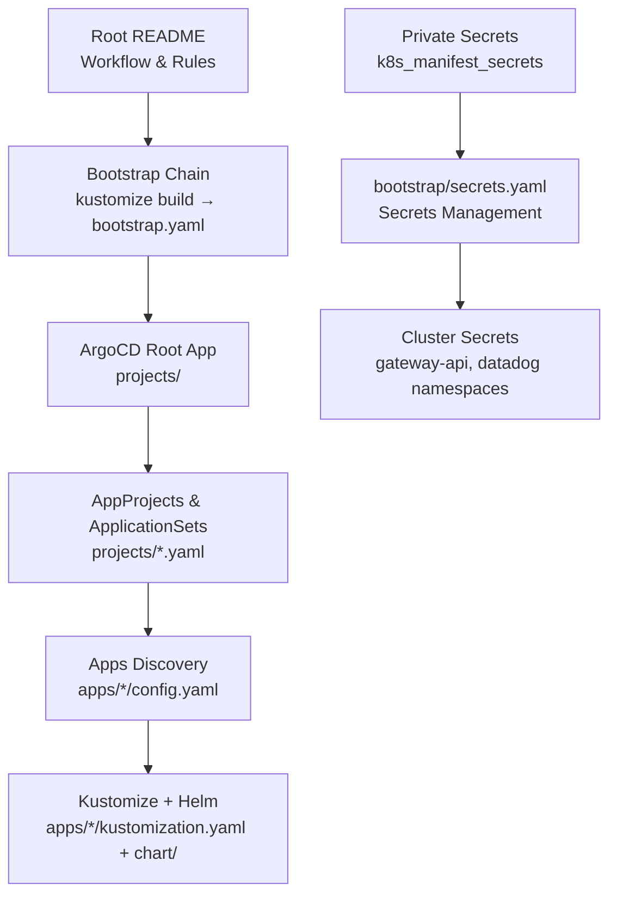
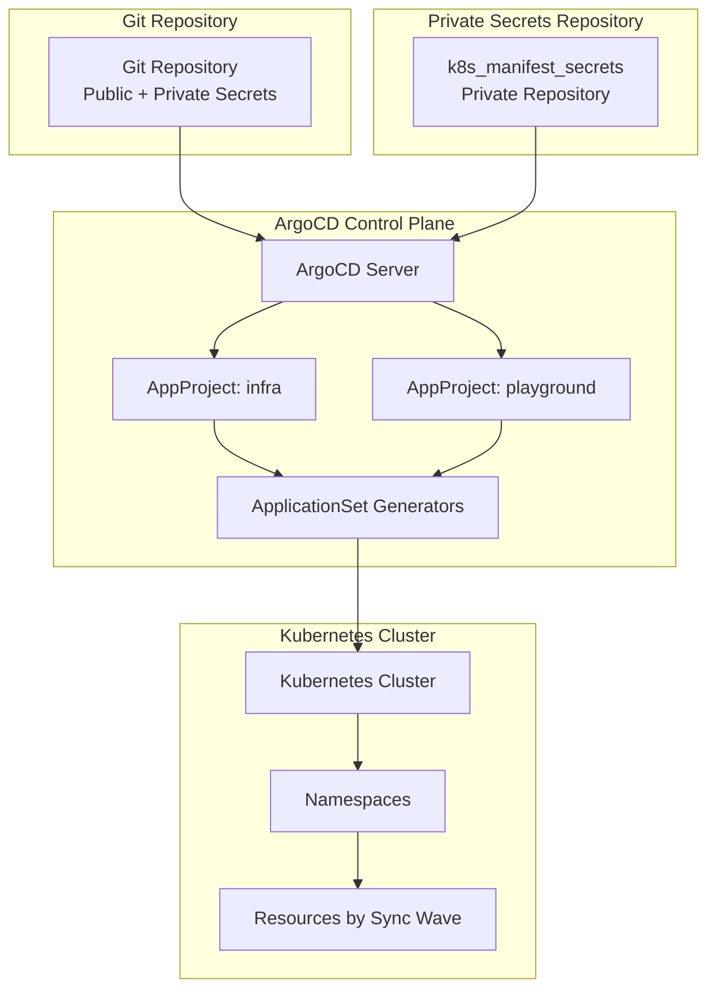
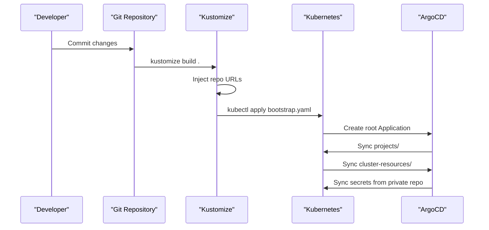
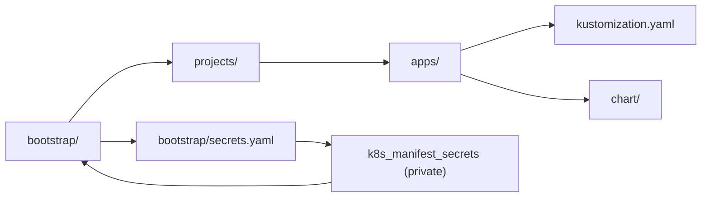

# OpenCode AI Agent Integration

<cite>
**Referenced Files in This Document**
- [README.md](file://README.md)
- [guide/argocd/argo_cd.md](file://guide/argocd/argo_cd.md)
- [guide/k8s_manifest_secrets/argo_cd.md](file://guide/k8s_manifest_secrets/argo_cd.md)
- [projects/infra.yaml](file://projects/infra.yaml)
- [projects/playground.yaml](file://projects/playground.yaml)
- [apps/infra/datadog/config.yaml](file://apps/infra/datadog/config.yaml)
</cite>

## Update Summary
**Changes Made**
- Removed all sections documenting OpenCode AI agent configuration and automation
- Updated repository structure to reflect current state without AI agent files
- Removed references to opencode.json, .opencode/agents/, and .opencode/rules/ directories
- Updated architecture diagrams to remove AI agent components
- Revised troubleshooting guide to remove AI-related sections
- Updated security considerations to focus on traditional GitOps practices

## Table of Contents
1. [Introduction](#introduction)
2. [Project Structure](#project-structure)
3. [Core Components](#core-components)
4. [Architecture Overview](#architecture-overview)
5. [Detailed Component Analysis](#detailed-component-analysis)
6. [Dependency Analysis](#dependency-analysis)
7. [Performance Considerations](#performance-considerations)
8. [Troubleshooting Guide](#troubleshooting-guide)
9. [Conclusion](#conclusion)
10. [Appendices](#appendices)

## Introduction
This document explains the GitOps workflow for Kubernetes infrastructure management using ArgoCD, Kustomize, and Helm. The repository follows a GitOps-first approach where all infrastructure changes are managed through Git commits and automatically synchronized to the cluster via ArgoCD. This document covers the operational workflows, sync ordering, and best practices for managing Kubernetes resources in a declarative manner.

**Updated** Removed all references to OpenCode AI agent integration as the AI automation system has been completely removed from the repository.

## Project Structure
The repository follows a GitOps-first structure with Kustomize, ArgoCD, and Helm. The structure is organized into bootstrap components, project definitions, shared cluster resources, application manifests, and operational guides. The README provides comprehensive documentation of the network flow, sync order, and operational rules.

**Diagram sources**
- [README.md:57-118](file://README.md#L57-L118)

**Section sources**
- [README.md:1-163](file://README.md#L1-L163)

## Core Components
- **Bootstrap Chain**: Initial setup process that builds and applies bootstrap manifests containing placeholder repository URLs
- **ArgoCD Projects**: AppProject and ApplicationSet definitions that discover and manage applications
- **Kustomize Manifests**: Base configurations with overlays for different environments and applications
- **Helm Charts**: OCI-based chart deployments integrated through Kustomize
- **Sync Waves**: Ordered deployment sequence ensuring proper resource creation order

Key capabilities:
- Automated application discovery through ApplicationSets
- Ordered deployment using sync-wave annotations
- Private secrets management through dedicated repository
- Multi-project organization (infra vs playground)

**Section sources**
- [README.md:57-86](file://README.md#L57-L86)
- [projects/infra.yaml:1-53](file://projects/infra.yaml#L1-L53)
- [projects/playground.yaml:1-53](file://projects/playground.yaml#L1-L53)

## Architecture Overview
The GitOps architecture enforces a strict pipeline where all changes flow through Git and are automatically applied to the cluster. The system uses ArgoCD for continuous synchronization, with careful ordering to ensure dependencies are met before dependent resources are created.

**Diagram sources**
- [README.md:57-86](file://README.md#L57-L86)
- [projects/infra.yaml:1-53](file://projects/infra.yaml#L1-L53)
- [projects/playground.yaml:1-53](file://projects/playground.yaml#L1-L53)

## Detailed Component Analysis

### Bootstrap Process
The bootstrap chain establishes the foundation for GitOps operations by creating the root ArgoCD application and configuring project-level settings.

**Diagram sources**
- [README.md:59-75](file://README.md#L59-L75)

**Section sources**
- [README.md:57-86](file://README.md#L57-L86)

### Application Discovery and Management
ApplicationSets automatically discover applications by scanning for config.yaml files and creating corresponding ArgoCD Applications.

**Section sources**
- [projects/infra.yaml:23-53](file://projects/infra.yaml#L23-L53)
- [projects/playground.yaml:23-53](file://projects/playground.yaml#L23-L53)

### Sync Ordering and Dependencies
The sync-wave system ensures proper resource creation order, preventing race conditions and dependency failures.

**Section sources**
- [README.md:76-86](file://README.md#L76-L86)

### Private Secrets Management
Sensitive data is managed in a separate private repository and synchronized through ArgoCD using repository secrets.

**Section sources**
- [README.md:160-163](file://README.md#L160-L163)
- [guide/k8s_manifest_secrets/argo_cd.md:1-46](file://guide/k8s_manifest_secrets/argo_cd.md#L1-L46)

## Dependency Analysis
The system has clear dependencies between bootstrap components, project definitions, and application manifests. Private secrets are isolated from the public repository for security.

**Diagram sources**
- [README.md:87-118](file://README.md#L87-L118)

**Section sources**
- [README.md:87-118](file://README.md#L87-L118)

## Performance Considerations
- Minimize unnecessary commits to reduce ArgoCD sync frequency
- Use sync waves to batch related resources and reduce conflicts
- Prefer OCI Helm charts for faster dependency resolution
- Leverage ApplicationSet generators to avoid manual application creation
- Monitor ArgoCD logs for sync failures and resolve promptly

## Troubleshooting Guide
Common issues and resolutions:
- **Bootstrap failures**: Verify kustomize build completes successfully and all placeholder URLs are replaced
- **Application sync errors**: Check ApplicationSet generator configuration and config.yaml annotations
- **Secret synchronization**: Ensure repository secrets are properly configured and private repo is accessible
- **Sync ordering issues**: Verify sync-wave annotations are correctly set and dependencies are satisfied
- **Network connectivity**: Confirm Cloudflare tunnel and Traefik ingress are functioning properly

**Section sources**
- [guide/argocd/argo_cd.md:18-34](file://guide/argocd/argo_cd.md#L18-L34)
- [guide/k8s_manifest_secrets/argo_cd.md:18-46](file://guide/k8s_manifest_secrets/argo_cd.md#L18-L46)

## Conclusion
The GitOps workflow established through ArgoCD, Kustomize, and Helm provides a robust, declarative approach to Kubernetes infrastructure management. By following the bootstrap chain, sync ordering, and best practices outlined in this documentation, teams can maintain reliable, auditable, and automated infrastructure deployments. The system emphasizes security through private secrets management and operational excellence through structured deployment ordering.

## Appendices

### Practical Examples

- **Adding a New Application**
  - Create application directory under apps/infra/ or apps/playground/
  - Add config.yaml with destination namespace and sync-wave annotations
  - Implement kustomization.yaml and optional chart/ directory
  - Commit and push changes for automatic ArgoCD discovery

- **Managing Secrets**
  - Store sensitive data in k8s_manifest_secrets repository
  - Reference secrets in bootstrap/secrets.yaml
  - Configure ArgoCD repository secrets for private access
  - Use sync-wave `1` for secrets to ensure they're available before dependent resources

- **Resource Optimization**
  - Use sync waves to minimize conflicts during concurrent deployments
  - Leverage ApplicationSets for scalable application management
  - Implement proper namespace organization for resource isolation

### Security Considerations
- **Repository Separation**: Keep sensitive data in private k8s_manifest_secrets repository
- **Access Control**: Configure ArgoCD repository secrets for secure private repository access
- **Network Security**: Utilize Cloudflare tunnel for secure external access to cluster services
- **Audit Trail**: All changes flow through Git commits, providing complete audit history
- **Principle of Least Privilege**: Limit ArgoCD permissions to necessary Kubernetes resources

**Section sources**
- [README.md:160-163](file://README.md#L160-L163)
- [guide/argocd/argo_cd.md:18-22](file://guide/argocd/argo_cd.md#L18-L22)
- [guide/k8s_manifest_secrets/argo_cd.md:18-46](file://guide/k8s_manifest_secrets/argo_cd.md#L18-L46)