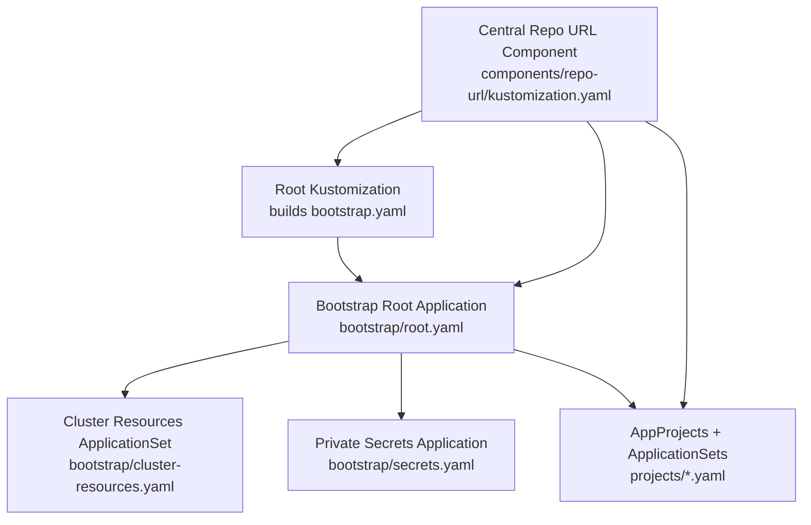
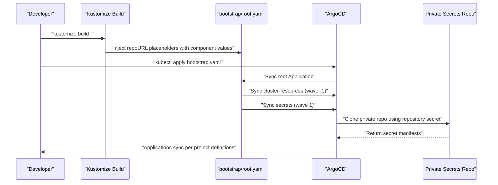
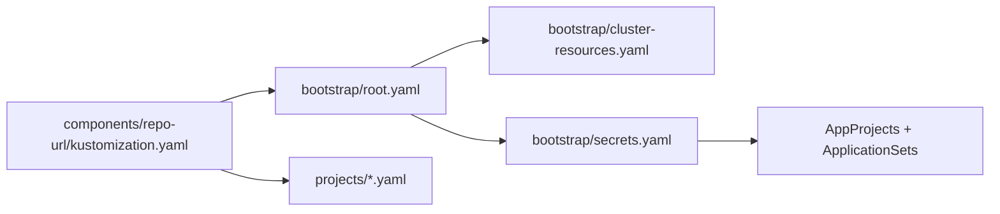

# Private Git Repository Integration

<cite>
**Referenced Files in This Document**
- [README.md](file://README.md)
- [bootstrap/root.yaml](file://bootstrap/root.yaml)
- [bootstrap/cluster-resources.yaml](file://bootstrap/cluster-resources.yaml)
- [bootstrap/secrets.yaml](file://bootstrap/secrets.yaml)
- [components/repo-url/kustomization.yaml](file://components/repo-url/kustomization.yaml)
- [projects/infra.yaml](file://projects/infra.yaml)
- [projects/playground.yaml](file://projects/playground.yaml)
- [guide/argocd/argocd-repository-secrets.yaml](file://guide/argocd/argocd-repository-secrets.yaml)
- [guide/k8s_manifest_secrets/argo_cd.md](file://guide/k8s_manifest_secrets/argo_cd.md)
</cite>

## Table of Contents
1. [Introduction](#introduction)
2. [Project Structure](#project-structure)
3. [Core Components](#core-components)
4. [Architecture Overview](#architecture-overview)
5. [Detailed Component Analysis](#detailed-component-analysis)
6. [Dependency Analysis](#dependency-analysis)
7. [Performance Considerations](#performance-considerations)
8. [Troubleshooting Guide](#troubleshooting-guide)
9. [Conclusion](#conclusion)
10. [Appendices](#appendices)

## Introduction
This document explains how private Git repositories are integrated into the ArgoCD GitOps workflow in this repository. It covers the secret management pattern for private repository access, including Personal Access Tokens (PATs), repository URL substitution mechanisms, bootstrap synchronization of private secrets, credential rotation strategies, and security best practices. It also provides step-by-step configuration examples, troubleshooting guidance, and operational considerations for managing multiple private repositories, namespace isolation, RBAC, and monitoring access patterns.

## Project Structure
The repository organizes ArgoCD bootstrap and application manifests across several directories. The bootstrap chain injects real repository URLs from a central component and orchestrates the order of sync using sync waves. Private secrets are kept in a separate private repository and synchronized via a dedicated bootstrap Application.

**Diagram sources**
- [README.md:68-86](file://README.md#L68-L86)
- [components/repo-url/kustomization.yaml:1-11](file://components/repo-url/kustomization.yaml#L1-L11)
- [bootstrap/root.yaml:1-37](file://bootstrap/root.yaml#L1-L37)
- [bootstrap/cluster-resources.yaml:1-33](file://bootstrap/cluster-resources.yaml#L1-L33)
- [bootstrap/secrets.yaml:1-24](file://bootstrap/secrets.yaml#L1-L24)
- [projects/infra.yaml:1-85](file://projects/infra.yaml#L1-L85)
- [projects/playground.yaml:1-90](file://projects/playground.yaml#L1-L90)

**Section sources**
- [README.md:68-118](file://README.md#L68-L118)
- [components/repo-url/kustomization.yaml:1-11](file://components/repo-url/kustomization.yaml#L1-L11)

## Core Components
- Centralized repository URL definitions: A Kustomize Component defines shared URLs for the main manifest repository and the private secrets repository. These values are injected during build time to replace placeholders in bootstrap and project manifests.
- Bootstrap chain: The bootstrap chain applies the root Application, cluster resources, and private secrets in a controlled order using sync waves.
- Private secrets repository: A dedicated Application synchronizes secrets from a private repository into the argocd namespace, enabling secure access to credentials without exposing them in the public repository.
- AppProjects and ApplicationSets: Projects define permissions and boundaries; ApplicationSets discover applications via config files and render them with Kustomize and Helm.

Key implementation references:
- Central URL component: [components/repo-url/kustomization.yaml:4-10](file://components/repo-url/kustomization.yaml#L4-L10)
- Bootstrap root Application: [bootstrap/root.yaml:15-18](file://bootstrap/root.yaml#L15-L18)
- Cluster resources ApplicationSet: [bootstrap/cluster-resources.yaml:26-28](file://bootstrap/cluster-resources.yaml#L26-L28)
- Private secrets Application: [bootstrap/secrets.yaml:13](file://bootstrap/secrets.yaml#L13)
- AppProject and ApplicationSet definitions: [projects/infra.yaml:23-85](file://projects/infra.yaml#L23-L85), [projects/playground.yaml:24-90](file://projects/playground.yaml#L24-L90)

**Section sources**
- [README.md:68-86](file://README.md#L68-L86)
- [components/repo-url/kustomization.yaml:1-11](file://components/repo-url/kustomization.yaml#L1-L11)
- [bootstrap/root.yaml:1-37](file://bootstrap/root.yaml#L1-L37)
- [bootstrap/cluster-resources.yaml:1-33](file://bootstrap/cluster-resources.yaml#L1-L33)
- [bootstrap/secrets.yaml:1-24](file://bootstrap/secrets.yaml#L1-L24)
- [projects/infra.yaml:1-85](file://projects/infra.yaml#L1-L85)
- [projects/playground.yaml:1-90](file://projects/playground.yaml#L1-L90)

## Architecture Overview
The private repository integration follows a layered approach:
- Build-time URL substitution: The central component supplies repository URLs that replace placeholders in bootstrap and project manifests.
- Controlled bootstrap order: Sync waves ensure namespaces and AppProjects exist before ApplicationSets run, and private secrets are synchronized prior to dependent applications.
- Secret-driven repository access: ArgoCD repository secrets are stored as Kubernetes Secrets labeled for repository access, enabling authenticated cloning of private repositories.

**Diagram sources**
- [README.md:68-86](file://README.md#L68-L86)
- [components/repo-url/kustomization.yaml:4-10](file://components/repo-url/kustomization.yaml#L4-L10)
- [bootstrap/root.yaml:15-18](file://bootstrap/root.yaml#L15-L18)
- [bootstrap/cluster-resources.yaml:26-28](file://bootstrap/cluster-resources.yaml#L26-L28)
- [bootstrap/secrets.yaml:13](file://bootstrap/secrets.yaml#L13)

## Detailed Component Analysis

### Secret Management Pattern for Private Repositories
- Repository secret model: Kubernetes Secrets labeled for repository access carry credentials for private Git repositories. The secret type is git, with url, username, and password fields. This enables ArgoCD to authenticate when cloning private repositories.
- Private secrets repository: A dedicated Application synchronizes secrets from a separate private repository into the argocd namespace. This isolates sensitive credentials from the main public repository.
- URL substitution: The central component defines repository URLs. During build, placeholders in bootstrap and project manifests are replaced with these URLs, ensuring ArgoCD targets the correct repositories.

Implementation references:
- Repository secret definition pattern: [guide/argocd/argocd-repository-secrets.yaml:5-30](file://guide/argocd/argocd-repository-secrets.yaml#L5-L30)
- Private secrets repository Application: [bootstrap/secrets.yaml:12-15](file://bootstrap/secrets.yaml#L12-L15)
- Central URL component: [components/repo-url/kustomization.yaml:4-10](file://components/repo-url/kustomization.yaml#L4-L10)

**Section sources**
- [guide/argocd/argocd-repository-secrets.yaml:1-30](file://guide/argocd/argocd-repository-secrets.yaml#L1-L30)
- [bootstrap/secrets.yaml:1-24](file://bootstrap/secrets.yaml#L1-L24)
- [components/repo-url/kustomization.yaml:1-11](file://components/repo-url/kustomization.yaml#L1-L11)

### Bootstrap Process for Private Secrets Synchronization
- Initial bootstrap: The root Application points to the projects directory and is applied after URL substitution. It orchestrates downstream resources.
- Cluster resources: An ApplicationSet ensures shared namespaces and cluster objects exist before application deployments.
- Private secrets sync: The secrets Application clones the private secrets repository and creates Kubernetes Secrets in the argocd namespace. This happens after cluster resources but before application-specific resources.
- AppProjects and ApplicationSets: Projects define boundaries and permissions; ApplicationSets discover and render applications from their respective repositories.

Implementation references:
- Bootstrap root Application: [bootstrap/root.yaml:10-24](file://bootstrap/root.yaml#L10-L24)
- Cluster resources ApplicationSet: [bootstrap/cluster-resources.yaml:9-14](file://bootstrap/cluster-resources.yaml#L9-L14)
- Private secrets Application: [bootstrap/secrets.yaml:18-24](file://bootstrap/secrets.yaml#L18-L24)
- AppProjects and ApplicationSets: [projects/infra.yaml:23-85](file://projects/infra.yaml#L23-L85), [projects/playground.yaml:24-90](file://projects/playground.yaml#L24-L90)

**Section sources**
- [README.md:68-86](file://README.md#L68-L86)
- [bootstrap/root.yaml:1-37](file://bootstrap/root.yaml#L1-L37)
- [bootstrap/cluster-resources.yaml:1-33](file://bootstrap/cluster-resources.yaml#L1-L33)
- [bootstrap/secrets.yaml:1-24](file://bootstrap/secrets.yaml#L1-L24)
- [projects/infra.yaml:1-85](file://projects/infra.yaml#L1-L85)
- [projects/playground.yaml:1-90](file://projects/playground.yaml#L1-L90)

### Credential Rotation Strategies
- Rotate PATs without redeploying secrets: Update the repository secret’s password field to the new PAT while keeping the same secret name and labels. ArgoCD will reconcile the secret and re-authenticate on next sync.
- Replace repository secret entries: If changing the repository URL or credentials, update the repository secret and ensure the ApplicationSet or Application source references the correct secret name.
- Audit and revoke old tokens: After successful rotation, revoke the old PAT from the provider and remove outdated secrets from the cluster.

Implementation references:
- Repository secret structure: [guide/argocd/argocd-repository-secrets.yaml:12-16](file://guide/argocd/argocd-repository-secrets.yaml#L12-L16)
- Private secrets repository example: [guide/k8s_manifest_secrets/argo_cd.md:10-46](file://guide/k8s_manifest_secrets/argo_cd.md#L10-L46)

**Section sources**
- [guide/argocd/argocd-repository-secrets.yaml:1-30](file://guide/argocd/argocd-repository-secrets.yaml#L1-L30)
- [guide/k8s_manifest_secrets/argo_cd.md:1-46](file://guide/k8s_manifest_secrets/argo_cd.md#L1-L46)

### Security Best Practices for Repository Access
- Least privilege: Grant the PAT minimal scopes required for repository access.
- Secret labeling: Use the repository secret label to restrict ArgoCD’s repository access to intended repositories.
- Namespace isolation: Store repository secrets in the argocd namespace and avoid embedding credentials in application manifests.
- Separation of concerns: Keep private secrets in a separate repository from application manifests.
- Monitoring and alerts: Track ArgoCD logs and events for failed syncs due to authentication errors.

Implementation references:
- Repository secret label: [guide/argocd/argocd-repository-secrets.yaml:10](file://guide/argocd/argocd-repository-secrets.yaml#L10)
- Private secrets repository note: [README.md:160-163](file://README.md#L160-L163)

**Section sources**
- [guide/argocd/argocd-repository-secrets.yaml:1-30](file://guide/argocd/argocd-repository-secrets.yaml#L1-L30)
- [README.md:160-163](file://README.md#L160-L163)

### Step-by-Step Configuration Examples

#### Configure a Private Repository Using PAT
- Create a repository secret in the argocd namespace with type git, url, username, and password fields.
- Ensure the Application or ApplicationSet source references the correct repository secret name.
- Apply the bootstrap manifests after URL substitution so ArgoCD can authenticate and clone the private repository.

References:
- [guide/argocd/argocd-repository-secrets.yaml:5-30](file://guide/argocd/argocd-repository-secrets.yaml#L5-L30)

#### Manage Multiple Private Repositories
- Create a separate repository secret for each private repository.
- Reference the appropriate secret in each Application or ApplicationSet source.
- Keep each private repository focused on a specific domain (e.g., infrastructure vs. application secrets).

References:
- [guide/argocd/argocd-repository-secrets.yaml:18-30](file://guide/argocd/argocd-repository-secrets.yaml#L18-L30)

#### Use URL Substitution Mechanism
- Define repository URLs in the central component.
- Build and apply bootstrap manifests so placeholders are replaced with real URLs.
- Confirm that root, cluster-resources, and secrets Applications target the correct repositories.

References:
- [components/repo-url/kustomization.yaml:4-10](file://components/repo-url/kustomization.yaml#L4-L10)
- [bootstrap/root.yaml:15-18](file://bootstrap/root.yaml#L15-L18)
- [bootstrap/cluster-resources.yaml:26-28](file://bootstrap/cluster-resources.yaml#L26-L28)
- [bootstrap/secrets.yaml:13](file://bootstrap/secrets.yaml#L13)

#### Namespace Isolation and RBAC Considerations
- Store repository secrets in the argocd namespace.
- Limit AppProject destinations and sourceRepos to trusted namespaces and repositories.
- Use ArgoCD RBAC policies to restrict who can manage Applications and secrets.

References:
- [projects/infra.yaml:9-21](file://projects/infra.yaml#L9-L21)
- [projects/playground.yaml:9-21](file://projects/playground.yaml#L9-L21)

#### Monitoring Repository Access Patterns
- Observe ArgoCD logs for authentication failures or network errors.
- Use Application sync status and events to detect connectivity issues.
- Alert on repeated sync failures indicating invalid credentials or revoked tokens.

References:
- [README.md:68-86](file://README.md#L68-L86)

## Dependency Analysis
The bootstrap chain depends on centralized URL definitions and strict sync ordering. Private secrets must be available before dependent applications can render and sync.

**Diagram sources**
- [components/repo-url/kustomization.yaml:1-11](file://components/repo-url/kustomization.yaml#L1-L11)
- [bootstrap/root.yaml:1-37](file://bootstrap/root.yaml#L1-L37)
- [bootstrap/cluster-resources.yaml:1-33](file://bootstrap/cluster-resources.yaml#L1-L33)
- [bootstrap/secrets.yaml:1-24](file://bootstrap/secrets.yaml#L1-L24)
- [projects/infra.yaml:1-85](file://projects/infra.yaml#L1-L85)
- [projects/playground.yaml:1-90](file://projects/playground.yaml#L1-L90)

**Section sources**
- [README.md:68-86](file://README.md#L68-L86)
- [components/repo-url/kustomization.yaml:1-11](file://components/repo-url/kustomization.yaml#L1-L11)
- [bootstrap/root.yaml:1-37](file://bootstrap/root.yaml#L1-L37)
- [bootstrap/cluster-resources.yaml:1-33](file://bootstrap/cluster-resources.yaml#L1-L33)
- [bootstrap/secrets.yaml:1-24](file://bootstrap/secrets.yaml#L1-L24)
- [projects/infra.yaml:1-85](file://projects/infra.yaml#L1-L85)
- [projects/playground.yaml:1-90](file://projects/playground.yaml#L1-L90)

## Performance Considerations
- Minimize sync frequency: Use ApplicationSet generators with appropriate requeue intervals to avoid excessive polling.
- Reduce drift: Enable self-heal and pruning judiciously; test changes in non-production environments first.
- Network reliability: Ensure stable connectivity to private repositories; consider caching or mirror strategies if latency is high.

## Troubleshooting Guide
Common issues and resolutions:
- Authentication failures:
  - Verify the repository secret exists in the argocd namespace and is labeled for repository access.
  - Confirm the PAT is valid and has not been revoked.
  - Check Application or ApplicationSet source references match the secret name.
- Connectivity problems:
  - Validate the repository URL in the secret and confirm it matches the intended remote.
  - Review ArgoCD logs for network errors or TLS issues.
- Sync order issues:
  - Ensure sync waves are configured correctly so private secrets are available before dependent applications.
  - Confirm the bootstrap chain applies in the expected order.

References:
- [guide/argocd/argocd-repository-secrets.yaml:10](file://guide/argocd/argocd-repository-secrets.yaml#L10)
- [README.md:68-86](file://README.md#L68-L86)

**Section sources**
- [guide/argocd/argocd-repository-secrets.yaml:1-30](file://guide/argocd/argocd-repository-secrets.yaml#L1-L30)
- [README.md:68-86](file://README.md#L68-L86)

## Conclusion
By centralizing repository URLs, enforcing strict bootstrap sync waves, and storing private credentials in a dedicated repository synchronized via ArgoCD, this setup achieves secure, auditable, and repeatable GitOps workflows for private repositories. Adopting the recommended practices for secret management, rotation, and monitoring further strengthens security and operational reliability.

## Appendices
- Example repository secret structure: [guide/argocd/argocd-repository-secrets.yaml:5-30](file://guide/argocd/argocd-repository-secrets.yaml#L5-L30)
- Private secrets repository example: [guide/k8s_manifest_secrets/argo_cd.md:10-46](file://guide/k8s_manifest_secrets/argo_cd.md#L10-L46)
- Central URL component: [components/repo-url/kustomization.yaml:4-10](file://components/repo-url/kustomization.yaml#L4-L10)