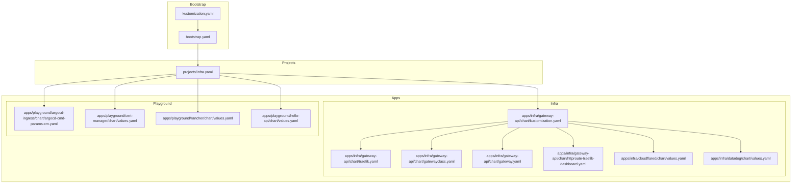
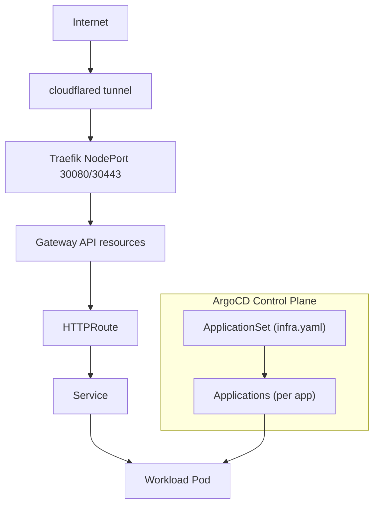
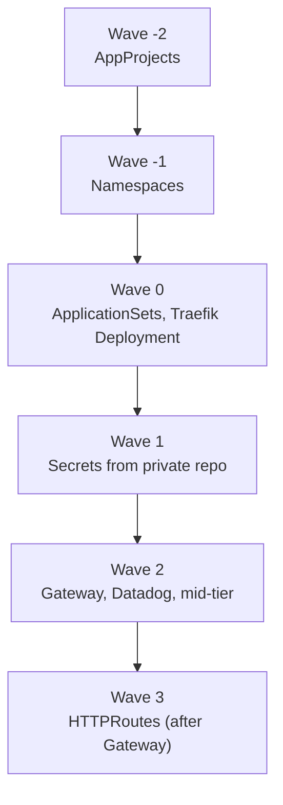
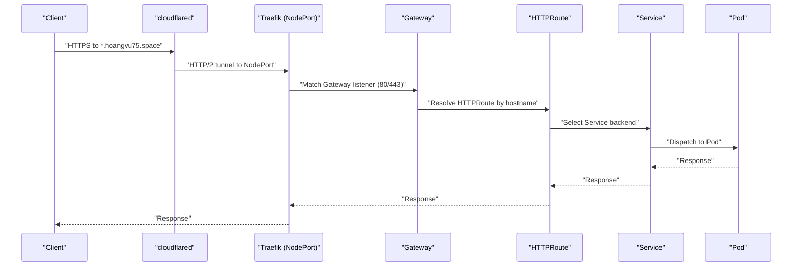
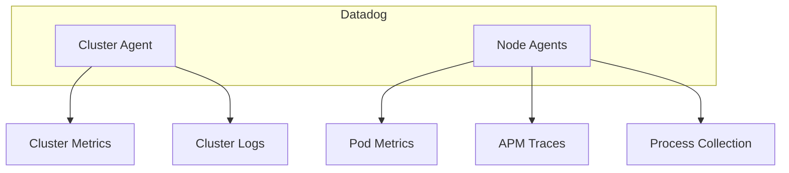
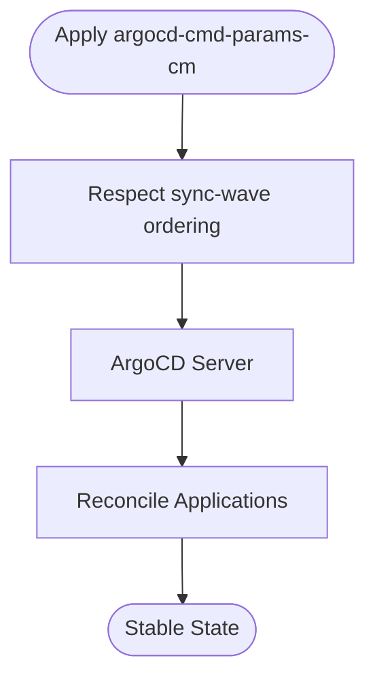
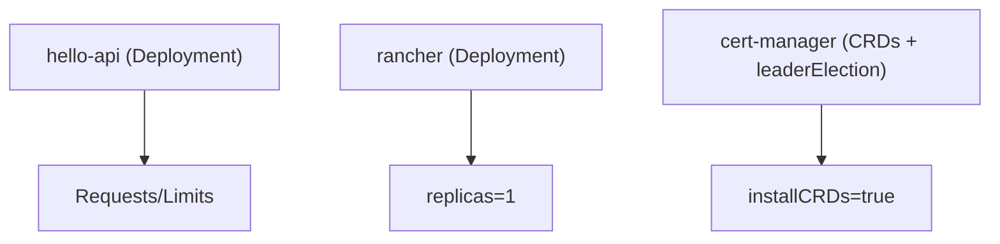
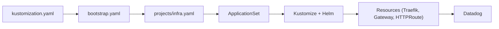

# Performance and Scaling

<cite>
**Referenced Files in This Document**
- [README.md](file://README.md)
- [bootstrap.yaml](file://bootstrap.yaml)
- [kustomization.yaml](file://kustomization.yaml)
- [projects/infra.yaml](file://projects/infra.yaml)
- [cluster-resources/default/namespace.yaml](file://cluster-resources/default/namespace.yaml)
- [apps/infra/gateway-api/chart/kustomization.yaml](file://apps/infra/gateway-api/chart/kustomization.yaml)
- [apps/infra/gateway-api/chart/traefik.yaml](file://apps/infra/gateway-api/chart/traefik.yaml)
- [apps/infra/gateway-api/chart/gateway.yaml](file://apps/infra/gateway-api/chart/gateway.yaml)
- [apps/infra/gateway-api/chart/gatewayclass.yaml](file://apps/infra/gateway-api/chart/gatewayclass.yaml)
- [apps/infra/gateway-api/chart/httproute-traefik-dashboard.yaml](file://apps/infra/gateway-api/chart/httproute-traefik-dashboard.yaml)
- [apps/infra/cloudflared/chart/values.yaml](file://apps/infra/cloudflared/chart/values.yaml)
- [apps/infra/datadog/chart/values.yaml](file://apps/infra/datadog/chart/values.yaml)
- [apps/playground/argocd-ingress/chart/argocd-cmd-params-cm.yaml](file://apps/playground/argocd-ingress/chart/argocd-cmd-params-cm.yaml)
- [apps/playground/cert-manager/chart/values.yaml](file://apps/playground/cert-manager/chart/values.yaml)
- [apps/playground/rancher/chart/values.yaml](file://apps/playground/rancher/chart/values.yaml)
- [apps/playground/hello-api/chart/values.yaml](file://apps/playground/hello-api/chart/values.yaml)
</cite>

## Table of Contents
1. [Introduction](#introduction)
2. [Project Structure](#project-structure)
3. [Core Components](#core-components)
4. [Architecture Overview](#architecture-overview)
5. [Detailed Component Analysis](#detailed-component-analysis)
6. [Dependency Analysis](#dependency-analysis)
7. [Performance Considerations](#performance-considerations)
8. [Troubleshooting Guide](#troubleshooting-guide)
9. [Conclusion](#conclusion)
10. [Appendices](#appendices)

## Introduction
This document focuses on performance optimization and scaling considerations for GitOps infrastructure managed with ArgoCD, Kustomize, and Helm. It synthesizes the repository’s sync-wave ordering, ingress and routing topology, monitoring stack, and resource sizing to provide actionable guidance for large-scale deployments, capacity planning, and operational excellence. It also outlines strategies for mitigating resource contention, identifying bottlenecks, and optimizing costs while maintaining reliability.

## Project Structure
The repository organizes infrastructure and applications across three primary layers:
- Bootstrap: initializes ArgoCD root Application and injects repository URLs.
- Projects: defines AppProjects and ApplicationSets that discover and render applications.
- Apps: platform and playground components packaged as Kustomize overlays with optional Helm charts.

Key performance-relevant aspects:
- Centralized repository URL injection via Kustomize replacements.
- Strict sync-wave ordering to ensure prerequisites exist before dependent resources.
- Gateway API-based ingress with Traefik as the controller, exposing services via NodePorts and HTTPRoutes.

**Diagram sources**
- [kustomization.yaml:1-21](file://kustomization.yaml#L1-L21)
- [bootstrap.yaml:1-26](file://bootstrap.yaml#L1-L26)
- [projects/infra.yaml:1-85](file://projects/infra.yaml#L1-L85)
- [apps/infra/gateway-api/chart/kustomization.yaml:1-8](file://apps/infra/gateway-api/chart/kustomization.yaml#L1-L8)
- [apps/infra/gateway-api/chart/traefik.yaml:1-120](file://apps/infra/gateway-api/chart/traefik.yaml#L1-L120)
- [apps/infra/gateway-api/chart/gatewayclass.yaml:1-10](file://apps/infra/gateway-api/chart/gatewayclass.yaml#L1-L10)
- [apps/infra/gateway-api/chart/gateway.yaml:1-27](file://apps/infra/gateway-api/chart/gateway.yaml#L1-L27)
- [apps/infra/gateway-api/chart/httproute-traefik-dashboard.yaml:1-30](file://apps/infra/gateway-api/chart/httproute-traefik-dashboard.yaml#L1-L30)
- [apps/infra/cloudflared/chart/values.yaml:1-40](file://apps/infra/cloudflared/chart/values.yaml#L1-L40)
- [apps/infra/datadog/chart/values.yaml:1-89](file://apps/infra/datadog/chart/values.yaml#L1-L89)
- [apps/playground/argocd-ingress/chart/argocd-cmd-params-cm.yaml:1-13](file://apps/playground/argocd-ingress/chart/argocd-cmd-params-cm.yaml#L1-L13)
- [apps/playground/cert-manager/chart/values.yaml:1-6](file://apps/playground/cert-manager/chart/values.yaml#L1-L6)
- [apps/playground/rancher/chart/values.yaml:1-9](file://apps/playground/rancher/chart/values.yaml#L1-L9)
- [apps/playground/hello-api/chart/values.yaml:1-23](file://apps/playground/hello-api/chart/values.yaml#L1-L23)

**Section sources**
- [README.md:1-163](file://README.md#L1-L163)
- [kustomization.yaml:1-21](file://kustomization.yaml#L1-L21)
- [bootstrap.yaml:1-26](file://bootstrap.yaml#L1-L26)
- [projects/infra.yaml:1-85](file://projects/infra.yaml#L1-L85)

## Core Components
- ArgoCD bootstrap Application: centralizes repository URL substitution and triggers the bootstrap chain.
- ApplicationSet discovery: scans app folders for config.yaml and renders Kustomize overlays with Helm support.
- Gateway API ingress: Traefik as the Gateway API controller, exposing services via NodePorts and HTTPRoutes.
- Observability: Datadog agent and cluster agent deployed for metrics, logs, APM, and process insights.
- Ingress exposure: ArgoCD command parameters ConfigMap annotated for controlled sync timing.

Performance-relevant configurations:
- Sync waves ensure prerequisites exist before dependents, reducing retries and conflicts.
- Resource requests/limits are defined for Traefik, Datadog agent, and sample workloads.
- Horizontal scaling via replicas is configured for cloudflared and can be extended to Traefik and other controllers.

**Section sources**
- [README.md:76-86](file://README.md#L76-L86)
- [README.md:120-135](file://README.md#L120-L135)
- [projects/infra.yaml:33-46](file://projects/infra.yaml#L33-L46)
- [apps/infra/gateway-api/chart/traefik.yaml:56-97](file://apps/infra/gateway-api/chart/traefik.yaml#L56-L97)
- [apps/infra/datadog/chart/values.yaml:48-89](file://apps/infra/datadog/chart/values.yaml#L48-L89)
- [apps/infra/cloudflared/chart/values.yaml:3-5](file://apps/infra/cloudflared/chart/values.yaml#L3-L5)
- [apps/playground/argocd-ingress/chart/argocd-cmd-params-cm.yaml:9-12](file://apps/playground/argocd-ingress/chart/argocd-cmd-params-cm.yaml#L9-L12)

## Architecture Overview
The network and sync flow are designed for predictable, scalable operation:
- Cloudflare edge traffic enters via cloudflared tunnels, decapsulated inside the cluster.
- Traefik (NodePort) receives traffic and acts as the Gateway API controller.
- Gateway API resources route traffic to backend Services and Pods.
- ArgoCD ApplicationSets continuously reconcile applications with retry/backoff policies.

**Diagram sources**
- [README.md:38-48](file://README.md#L38-L48)
- [apps/infra/gateway-api/chart/traefik.yaml:106-120](file://apps/infra/gateway-api/chart/traefik.yaml#L106-L120)
- [apps/infra/gateway-api/chart/gateway.yaml:1-27](file://apps/infra/gateway-api/chart/gateway.yaml#L1-L27)
- [apps/infra/gateway-api/chart/httproute-traefik-dashboard.yaml:1-30](file://apps/infra/gateway-api/chart/httproute-traefik-dashboard.yaml#L1-L30)
- [projects/infra.yaml:33-46](file://projects/infra.yaml#L33-L46)

**Section sources**
- [README.md:5-48](file://README.md#L5-L48)
- [apps/infra/gateway-api/chart/traefik.yaml:106-120](file://apps/infra/gateway-api/chart/traefik.yaml#L106-L120)

## Detailed Component Analysis

### Sync Wave Ordering and Parallelization
Sync waves enforce deterministic ordering across cluster resources, AppProjects, ApplicationSets, and application workloads. This minimizes contention and reduces failed reconciliations.

**Diagram sources**
- [README.md:76-86](file://README.md#L76-L86)
- [cluster-resources/default/namespace.yaml:1-52](file://cluster-resources/default/namespace.yaml#L1-L52)
- [apps/infra/gateway-api/chart/gatewayclass.yaml:1-10](file://apps/infra/gateway-api/chart/gatewayclass.yaml#L1-L10)
- [apps/infra/gateway-api/chart/traefik.yaml:56-62](file://apps/infra/gateway-api/chart/traefik.yaml#L56-L62)
- [apps/infra/datadog/chart/values.yaml:1-89](file://apps/infra/datadog/chart/values.yaml#L1-L89)
- [apps/infra/gateway-api/chart/httproute-traefik-dashboard.yaml:1-30](file://apps/infra/gateway-api/chart/httproute-traefik-dashboard.yaml#L1-L30)

Operational implications:
- Use negative waves for cluster-level prerequisites to avoid race conditions.
- Keep waves close to zero for core controllers to reduce startup latency.
- Place HTTPRoutes last to ensure Gateway exists before route creation.

**Section sources**
- [README.md:76-86](file://README.md#L76-L86)
- [cluster-resources/default/namespace.yaml:1-52](file://cluster-resources/default/namespace.yaml#L1-L52)
- [apps/infra/gateway-api/chart/gatewayclass.yaml:1-10](file://apps/infra/gateway-api/chart/gatewayclass.yaml#L1-L10)
- [apps/infra/gateway-api/chart/traefik.yaml:56-62](file://apps/infra/gateway-api/chart/traefik.yaml#L56-L62)
- [apps/infra/gateway-api/chart/httproute-traefik-dashboard.yaml:1-30](file://apps/infra/gateway-api/chart/httproute-traefik-dashboard.yaml#L1-L30)

### Ingress and Routing: Traefik and Gateway API
Traefik runs as a single-replica Deployment with minimal resource requests and NodePort exposure. The Gateway API resources define listeners and HTTPRoutes for backend services.

**Diagram sources**
- [apps/infra/gateway-api/chart/traefik.yaml:56-120](file://apps/infra/gateway-api/chart/traefik.yaml#L56-L120)
- [apps/infra/gateway-api/chart/gateway.yaml:1-27](file://apps/infra/gateway-api/chart/gateway.yaml#L1-L27)
- [apps/infra/gateway-api/chart/httproute-traefik-dashboard.yaml:1-30](file://apps/infra/gateway-api/chart/httproute-traefik-dashboard.yaml#L1-L30)

Scaling strategies:
- Increase Traefik replicas cautiously; ensure leader election and shared leases are considered.
- Use autoscaling for backend workloads behind HTTPRoutes.
- Monitor Gateway API controller logs and metrics for hot-path performance.

**Section sources**
- [apps/infra/gateway-api/chart/traefik.yaml:56-120](file://apps/infra/gateway-api/chart/traefik.yaml#L56-L120)
- [apps/infra/gateway-api/chart/gateway.yaml:1-27](file://apps/infra/gateway-api/chart/gateway.yaml#L1-L27)
- [apps/infra/gateway-api/chart/httproute-traefik-dashboard.yaml:1-30](file://apps/infra/gateway-api/chart/httproute-traefik-dashboard.yaml#L1-L30)

### Observability Stack: Datadog
Datadog is configured with cluster agent and node agents, enabling metrics, logs, APM, and process insights. Resource requests/limits are defined for the agents.

**Diagram sources**
- [apps/infra/datadog/chart/values.yaml:37-89](file://apps/infra/datadog/chart/values.yaml#L37-L89)

Best practices:
- Enable orchestrator explorer and container scrubbing for accurate attribution.
- Use cluster agent for cluster-wide telemetry and node agents for per-node insights.
- Tune log collection and APM sampling for high-volume environments.

**Section sources**
- [apps/infra/datadog/chart/values.yaml:1-89](file://apps/infra/datadog/chart/values.yaml#L1-L89)

### ArgoCD Exposure and Command Parameters
ArgoCD command parameters are tuned for secure operation and controlled sync behavior. Annotated sync-wave ensures proper sequencing.

**Diagram sources**
- [apps/playground/argocd-ingress/chart/argocd-cmd-params-cm.yaml:1-13](file://apps/playground/argocd-ingress/chart/argocd-cmd-params-cm.yaml#L1-L13)

**Section sources**
- [apps/playground/argocd-ingress/chart/argocd-cmd-params-cm.yaml:1-13](file://apps/playground/argocd-ingress/chart/argocd-cmd-params-cm.yaml#L1-L13)

### Workload Resource Efficiency: Sample Apps
Sample applications demonstrate small, efficient resource footprints suitable for development and low-throughput scenarios.

- hello-api: minimal CPU/memory requests/limits for lightweight demo.
- rancher: single replica for non-production environments.
- cert-manager: installs CRDs and sets leader election namespace.

**Diagram sources**
- [apps/playground/hello-api/chart/values.yaml:1-23](file://apps/playground/hello-api/chart/values.yaml#L1-L23)
- [apps/playground/rancher/chart/values.yaml:1-9](file://apps/playground/rancher/chart/values.yaml#L1-L9)
- [apps/playground/cert-manager/chart/values.yaml:1-6](file://apps/playground/cert-manager/chart/values.yaml#L1-L6)

**Section sources**
- [apps/playground/hello-api/chart/values.yaml:1-23](file://apps/playground/hello-api/chart/values.yaml#L1-L23)
- [apps/playground/rancher/chart/values.yaml:1-9](file://apps/playground/rancher/chart/values.yaml#L1-L9)
- [apps/playground/cert-manager/chart/values.yaml:1-6](file://apps/playground/cert-manager/chart/values.yaml#L1-L6)

## Dependency Analysis
The system exhibits layered dependencies:
- Kustomize builds bootstrap.yaml and injects repository URLs centrally.
- ArgoCD ApplicationSet discovers apps and renders Kustomize overlays with Helm support.
- Gateway API resources depend on GatewayClass and Gateway existence.
- HTTPRoutes depend on Gateway presence.

**Diagram sources**
- [kustomization.yaml:1-21](file://kustomization.yaml#L1-L21)
- [bootstrap.yaml:1-26](file://bootstrap.yaml#L1-L26)
- [projects/infra.yaml:33-46](file://projects/infra.yaml#L33-L46)
- [apps/infra/gateway-api/chart/kustomization.yaml:1-8](file://apps/infra/gateway-api/chart/kustomization.yaml#L1-L8)
- [apps/infra/datadog/chart/values.yaml:1-89](file://apps/infra/datadog/chart/values.yaml#L1-L89)

**Section sources**
- [kustomization.yaml:1-21](file://kustomization.yaml#L1-L21)
- [bootstrap.yaml:1-26](file://bootstrap.yaml#L1-L26)
- [projects/infra.yaml:33-46](file://projects/infra.yaml#L33-L46)

## Performance Considerations
This section consolidates practical guidance derived from the repository’s configurations and documented workflows.

- Sync wave optimization
  - Keep critical controllers (GatewayClass, Gateway, Traefik) in early waves to minimize startup races.
  - Place HTTPRoutes in the latest wave to ensure routing primitives exist.
  - Use negative waves for Namespaces and AppProjects to guarantee prerequisites.

- Parallel deployment patterns
  - ApplicationSets scan app directories concurrently; tune requeue intervals to balance responsiveness and load.
  - Use per-app sync waves to stagger deployments and reduce contention on shared resources.

- Resource contention mitigation
  - Define explicit CPU/memory requests/limits for all workloads.
  - Separate high-priority workloads (ingress, monitoring) onto dedicated namespaces with appropriate scheduling.
  - Use NodePorts judiciously; consider LoadBalancer or IngressClass for production traffic.

- Horizontal vs vertical scaling
  - Traefik: evaluate increasing replicas after validating leader election and health checks.
  - cloudflared: currently scaled to 2 replicas; can be increased for high ingress volume.
  - Backend workloads: enable HPA based on CPU/utilization or custom metrics.

- Capacity planning
  - Estimate peak ingress connections and route resolution overhead.
  - Size cluster nodes to accommodate ingress controller replicas and monitoring agents.
  - Plan for ApplicationSet reconciliation cadence and retry backoff to avoid sync storms.

- Cost optimization
  - Right-size resource requests/limits to reduce overprovisioning.
  - Consolidate monitoring and ingress into shared namespaces to lower overhead.
  - Use spot instances for non-critical workloads where feasible.

- Performance testing methodologies
  - Simulate traffic bursts to HTTPRoutes and measure latency and error rates.
  - Benchmark ArgoCD reconciliation throughput under concurrent ApplicationSet updates.
  - Validate sync wave effectiveness by measuring convergence time and failure rates.

[No sources needed since this section provides general guidance]

## Troubleshooting Guide
Common issues and remedies grounded in repository configurations:

- HTTPRoute not taking effect
  - Verify Gateway exists and is ready before applying HTTPRoutes.
  - Confirm hostname matches the HTTPRoute hostnames and Gateway listeners.

- ArgoCD sync failures
  - Review ApplicationSet generator configuration and requeue interval.
  - Inspect retry/backoff settings and ensure they align with workload stability.

- Ingress connectivity issues
  - Check Traefik NodePort exposure and service selectors.
  - Validate GatewayClass controller name and readiness.

- Observability gaps
  - Ensure Datadog cluster agent and node agents are running and reporting.
  - Confirm API key secret availability and permissions.

**Section sources**
- [apps/infra/gateway-api/chart/httproute-traefik-dashboard.yaml:1-30](file://apps/infra/gateway-api/chart/httproute-traefik-dashboard.yaml#L1-L30)
- [apps/infra/gateway-api/chart/gateway.yaml:1-27](file://apps/infra/gateway-api/chart/gateway.yaml#L1-L27)
- [apps/infra/gateway-api/chart/traefik.yaml:56-120](file://apps/infra/gateway-api/chart/traefik.yaml#L56-L120)
- [apps/infra/datadog/chart/values.yaml:1-89](file://apps/infra/datadog/chart/values.yaml#L1-L89)
- [projects/infra.yaml:33-46](file://projects/infra.yaml#L33-L46)

## Conclusion
By leveraging strict sync waves, a Gateway API-based ingress model, and a robust observability stack, this repository establishes a scalable and maintainable foundation for GitOps infrastructure. Applying the outlined strategies for parallelization, resource efficiency, and capacity planning enables reliable operations at scale while controlling costs and improving performance.

[No sources needed since this section summarizes without analyzing specific files]

## Appendices

### Appendix A: Sync Wave Reference
- Wave -2: AppProjects
- Wave -1: Namespaces
- Wave 0: ApplicationSets, Traefik Deployment
- Wave 1: Secrets from private repo
- Wave 2: Gateway, Datadog, and mid-tier resources
- Wave 3: HTTPRoutes (applied after Gateway)

**Section sources**
- [README.md:76-86](file://README.md#L76-L86)
- [cluster-resources/default/namespace.yaml:1-52](file://cluster-resources/default/namespace.yaml#L1-L52)
- [apps/infra/gateway-api/chart/gatewayclass.yaml:1-10](file://apps/infra/gateway-api/chart/gatewayclass.yaml#L1-L10)
- [apps/infra/gateway-api/chart/traefik.yaml:56-62](file://apps/infra/gateway-api/chart/traefik.yaml#L56-L62)
- [apps/infra/datadog/chart/values.yaml:1-89](file://apps/infra/datadog/chart/values.yaml#L1-L89)
- [apps/infra/gateway-api/chart/httproute-traefik-dashboard.yaml:1-30](file://apps/infra/gateway-api/chart/httproute-traefik-dashboard.yaml#L1-L30)