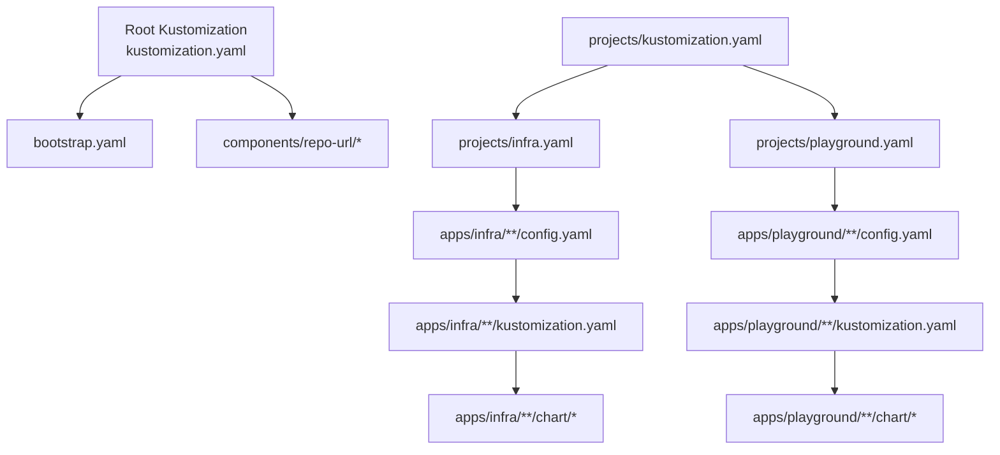
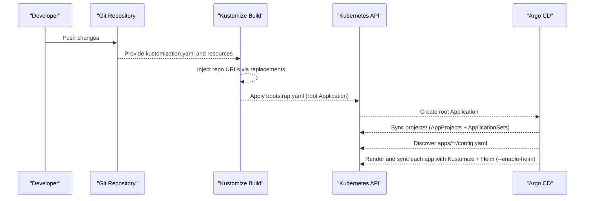
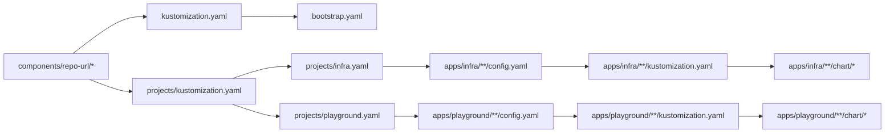

# Application Configuration

<cite>
**Referenced Files in This Document**
- [README.md](file://README.md)
- [bootstrap.yaml](file://bootstrap.yaml)
- [kustomization.yaml](file://kustomization.yaml)
- [projects/kustomization.yaml](file://projects/kustomization.yaml)
- [projects/infra.yaml](file://projects/infra.yaml)
- [projects/playground.yaml](file://projects/playground.yaml)
- [apps/infra/cloudflared/config.yaml](file://apps/infra/cloudflared/config.yaml)
- [apps/infra/datadog/config.yaml](file://apps/infra/datadog/config.yaml)
- [apps/infra/gateway-api/config.yaml](file://apps/infra/gateway-api/config.yaml)
- [apps/playground/rancher/config.yaml](file://apps/playground/rancher/config.yaml)
- [apps/playground/hello-api/config.yaml](file://apps/playground/hello-api/config.yaml)
- [apps/infra/cloudflared/kustomization.yaml](file://apps/infra/cloudflared/kustomization.yaml)
- [apps/infra/cloudflared/chart/kustomization.yaml](file://apps/infra/cloudflared/chart/kustomization.yaml)
- [apps/infra/cloudflared/chart/values.yaml](file://apps/infra/cloudflared/chart/values.yaml)
- [apps/playground/hello-api/chart/kustomization.yaml](file://apps/playground/hello-api/chart/kustomization.yaml)
- [apps/playground/hello-api/chart/values.yaml](file://apps/playground/hello-api/chart/values.yaml)
</cite>

## Table of Contents
1. [Introduction](#introduction)
2. [Project Structure](#project-structure)
3. [Core Components](#core-components)
4. [Architecture Overview](#architecture-overview)
5. [Detailed Component Analysis](#detailed-component-analysis)
6. [Dependency Analysis](#dependency-analysis)
7. [Performance Considerations](#performance-considerations)
8. [Troubleshooting Guide](#troubleshooting-guide)
9. [Conclusion](#conclusion)
10. [Appendices](#appendices)

## Introduction
This document explains application configuration patterns and best practices for managing Kubernetes applications with Argo CD, Kustomize, and Helm. It covers the standard application structure using config.yaml, kustomization.yaml, and optional chart/ directories, along with Kustomize configuration patterns, Helm chart integration via --enable-helm, and namespace management strategies. It also details how application configuration participates in the broader GitOps workflow, provides examples of different application types and their deployment patterns, and explains how applications inherit from base configurations while customizing settings per environment. Finally, it addresses common configuration mistakes and offers troubleshooting approaches for deployment failures.

## Project Structure
The repository organizes GitOps resources into a layered structure:
- Root Kustomize injects repository URLs and builds bootstrap.yaml.
- bootstrap/ contains the root Argo CD Application and related bootstrap resources.
- projects/ defines AppProjects and ApplicationSets that discover applications under apps/.
- apps/ contains application folders grouped by project (infra and playground), each with:
  - config.yaml for ApplicationSet discovery and per-app overrides.
  - kustomization.yaml to assemble manifests and optionally a chart/ directory.
  - chart/ directory containing Helm chart integration via Kustomize helmCharts.

**Diagram sources**
- [kustomization.yaml:1-21](file://kustomization.yaml#L1-L21)
- [projects/kustomization.yaml:1-22](file://projects/kustomization.yaml#L1-L22)
- [projects/infra.yaml:1-85](file://projects/infra.yaml#L1-L85)
- [projects/playground.yaml:1-90](file://projects/playground.yaml#L1-L90)

**Section sources**
- [README.md:87-118](file://README.md#L87-L118)
- [README.md:128-134](file://README.md#L128-L134)

## Core Components
- Root Kustomize and bootstrap pipeline:
  - Root Kustomize composes bootstrap.yaml and injects repo URLs from components/repo-url.
  - bootstrap.yaml defines the root Argo CD Application pointing to the bootstrap path.
- Projects and ApplicationSets:
  - projects/infra.yaml and projects/playground.yaml define AppProjects and ApplicationSets.
  - Generators scan apps/infra/**/config.yaml and apps/playground/**/config.yaml respectively.
  - Templates set destination namespace, project, and enable Helm via Kustomize buildOptions.
- Application-level configuration:
  - config.yaml controls destination namespace and sync wave per app.
  - kustomization.yaml composes resources and optionally references chart/.
  - chart/ integrates Helm charts via Kustomize helmCharts with values files.

Key behaviors:
- Centralized repo URL replacement ensures consistent source references across the stack.
- Sync waves enforce ordered application deployment across the cluster.
- Helm integration is enabled globally for discovered apps via Kustomize buildOptions.

**Section sources**
- [kustomization.yaml:1-21](file://kustomization.yaml#L1-L21)
- [bootstrap.yaml:1-26](file://bootstrap.yaml#L1-L26)
- [projects/kustomization.yaml:1-22](file://projects/kustomization.yaml#L1-L22)
- [projects/infra.yaml:33-60](file://projects/infra.yaml#L33-L60)
- [projects/playground.yaml:34-60](file://projects/playground.yaml#L34-L60)
- [apps/infra/cloudflared/config.yaml:1-4](file://apps/infra/cloudflared/config.yaml#L1-L4)
- [apps/infra/gateway-api/config.yaml:1-6](file://apps/infra/gateway-api/config.yaml#L1-L6)
- [apps/playground/rancher/config.yaml:1-5](file://apps/playground/rancher/config.yaml#L1-L5)

## Architecture Overview
The GitOps workflow proceeds through a bootstrap chain that installs Argo CD, sets up AppProjects and ApplicationSets, and then discovers and deploys applications from apps/.

**Diagram sources**
- [README.md:57-75](file://README.md#L57-L75)
- [kustomization.yaml:10-21](file://kustomization.yaml#L10-L21)
- [projects/kustomization.yaml:11-22](file://projects/kustomization.yaml#L11-L22)
- [projects/infra.yaml:33-60](file://projects/infra.yaml#L33-L60)
- [projects/playground.yaml:34-60](file://projects/playground.yaml#L34-L60)

## Detailed Component Analysis

### Standard Application Structure and Patterns
Each application follows a consistent structure:
- apps/<project>/<app>/config.yaml: Declares destination namespace and optional sync wave.
- apps/<project>/<app>/kustomization.yaml: Defines namespace and resources; optionally includes chart/.
- apps/<project>/<app>/chart/: Contains Helm chart integration via Kustomize helmCharts and values files.

Patterns:
- Namespace management: Use config.yaml destNamespace to override the default derived from the app folder name.
- Sync ordering: Use annotations with argocd.argoproj.io/sync-wave to control deployment order.
- Helm integration: Enable --enable-helm in ApplicationSet templates; reference chart/ via Kustomize resources.

Examples:
- Infra app (cloudflared): Uses a dedicated namespace and Helm chart with values from chart/values.yaml.
- Playground app (hello-api): Demonstrates multi-values composition via additionalValuesFiles.

**Section sources**
- [README.md:128-134](file://README.md#L128-L134)
- [apps/infra/cloudflared/config.yaml:1-4](file://apps/infra/cloudflared/config.yaml#L1-L4)
- [apps/infra/cloudflared/kustomization.yaml:1-8](file://apps/infra/cloudflared/kustomization.yaml#L1-L8)
- [apps/infra/cloudflared/chart/kustomization.yaml:1-11](file://apps/infra/cloudflared/chart/kustomization.yaml#L1-L11)
- [apps/playground/hello-api/chart/kustomization.yaml:1-14](file://apps/playground/hello-api/chart/kustomization.yaml#L1-L14)

### Kustomize Configuration Patterns
- Root and project-level Kustomize:
  - Root kustomization.yaml composes bootstrap.yaml and injects repo URLs via replacements.
  - projects/kustomization.yaml composes infra.yaml and playground.yaml and performs the same replacement.
- Application-level Kustomize:
  - apps/<project>/<app>/kustomization.yaml sets namespace and includes chart/.
  - apps/<project>/<app>/chart/kustomization.yaml defines helmCharts with repo, releaseName, version, and valuesFile(s).

Best practices:
- Keep namespace declarations at the application level to avoid cross-project leakage.
- Use valuesFile and additionalValuesFiles to split concerns (e.g., service vs. HTTPRoute-specific values).
- Leverage Kustomize replacements centrally to avoid hardcoding repo URLs in multiple places.

**Section sources**
- [kustomization.yaml:1-21](file://kustomization.yaml#L1-L21)
- [projects/kustomization.yaml:1-22](file://projects/kustomization.yaml#L1-L22)
- [apps/infra/cloudflared/kustomization.yaml:1-8](file://apps/infra/cloudflared/kustomization.yaml#L1-L8)
- [apps/infra/cloudflared/chart/kustomization.yaml:1-11](file://apps/infra/cloudflared/chart/kustomization.yaml#L1-L11)
- [apps/playground/hello-api/chart/kustomization.yaml:1-14](file://apps/playground/hello-api/chart/kustomization.yaml#L1-L14)

### Helm Chart Integration Using --enable-helm
- Global enablement:
  - ApplicationSet templates set kustomize.buildOptions to --enable-helm so Helm releases are rendered during Kustomize build.
- Per-app Helm configuration:
  - helmCharts entries specify chart name, OCI repository, release name, target namespace, version, and values files.
  - Values files can be combined using additionalValuesFiles for layered customization.

Example references:
- cloudflared Helm chart integration and values.
- hello-api Helm chart integration with multiple values files.

**Section sources**
- [projects/infra.yaml:59-60](file://projects/infra.yaml#L59-L60)
- [projects/playground.yaml:59-60](file://projects/playground.yaml#L59-L60)
- [apps/infra/cloudflared/chart/kustomization.yaml:4-11](file://apps/infra/cloudflared/chart/kustomization.yaml#L4-L11)
- [apps/playground/hello-api/chart/kustomization.yaml:4-14](file://apps/playground/hello-api/chart/kustomization.yaml#L4-L14)

### Namespace Management Strategies
- Shared namespaces:
  - cluster-resources/default/namespace.yaml defines shared namespaces applied with sync-wave -1 to ensure availability before apps deploy.
- Per-app namespaces:
  - config.yaml can override the default derived namespace via destNamespace.
  - ApplicationSet templates use the overridden namespace when present; otherwise, they derive it from the app folder name.
- Special-case namespaces:
  - Some apps require pre-existing namespaces (e.g., cattle-system for Rancher) and rely on sync waves to ensure prerequisites exist.

**Section sources**
- [README.md:144-147](file://README.md#L144-L147)
- [apps/infra/gateway-api/config.yaml:1-6](file://apps/infra/gateway-api/config.yaml#L1-L6)
- [apps/playground/rancher/config.yaml:1-5](file://apps/playground/rancher/config.yaml#L1-L5)
- [projects/playground.yaml:72-74](file://projects/playground.yaml#L72-L74)

### Relationship Between Application Configuration and GitOps Workflow
- Discovery:
  - ApplicationSets scan apps/infra/**/config.yaml and apps/playground/**/config.yaml to discover applications.
- Rendering:
  - For each discovered app, Argo CD renders the app’s kustomization.yaml with --enable-helm and applies the resulting manifests.
- Ordering:
  - Sync waves in config.yaml and project-level annotations ensure correct sequencing across the cluster.

**Section sources**
- [README.md:57-75](file://README.md#L57-L75)
- [projects/infra.yaml:33-60](file://projects/infra.yaml#L33-L60)
- [projects/playground.yaml:34-60](file://projects/playground.yaml#L34-L60)

### Examples of Different Application Types and Deployment Patterns
- Infrastructure app (cloudflared):
  - Purpose: Cloudflare tunnel connectivity.
  - Pattern: Helm chart via OCI registry, values from values.yaml, dedicated namespace.
- Monitoring app (Datadog):
  - Purpose: Observability agent.
  - Pattern: Helm chart via OCI registry, values from values.yaml, dedicated namespace.
- Gateway API stack (gateway-api):
  - Purpose: Ingress controller via Gateway API.
  - Pattern: Requires CRDs first; uses dedicated namespace and CreateNamespace sync option.
- Playground app (hello-api):
  - Purpose: Sample HTTP echo service.
  - Pattern: Helm chart with multiple values files for service and HTTPRoute configuration.
- Exposure app (argocd-ingress):
  - Purpose: Expose Argo CD UI via HTTPRoute.
  - Pattern: Uses HTTPRoute and values from chart/values.yaml.
- Management app (Rancher):
  - Purpose: Cluster management UI.
  - Pattern: Requires cattle-system namespace and higher sync wave to deploy after prerequisites.

**Section sources**
- [apps/infra/cloudflared/config.yaml:1-4](file://apps/infra/cloudflared/config.yaml#L1-L4)
- [apps/infra/datadog/config.yaml:1-6](file://apps/infra/datadog/config.yaml#L1-L6)
- [apps/infra/gateway-api/config.yaml:1-6](file://apps/infra/gateway-api/config.yaml#L1-L6)
- [apps/playground/hello-api/config.yaml:1-4](file://apps/playground/hello-api/config.yaml#L1-L4)
- [apps/playground/rancher/config.yaml:1-5](file://apps/playground/rancher/config.yaml#L1-L5)

### How Applications Inherit From Base Configurations and Customize Settings
- Inheritance:
  - Root and project-level Kustomize inject repo URLs centrally, avoiding duplication.
  - ApplicationSet templates derive path-based values (project, app name, repoURL) and pass them to each app.
- Customization:
  - config.yaml overrides destination namespace and adds sync wave annotations.
  - chart/values.yaml and additionalValuesFiles tailor chart behavior per environment or concern.
  - kustomization.yaml can set namespace and include chart/ selectively.

**Section sources**
- [kustomization.yaml:10-21](file://kustomization.yaml#L10-L21)
- [projects/kustomization.yaml:11-22](file://projects/kustomization.yaml#L11-L22)
- [projects/infra.yaml:40-58](file://projects/infra.yaml#L40-L58)
- [projects/playground.yaml:40-58](file://projects/playground.yaml#L40-L58)
- [apps/infra/cloudflared/kustomization.yaml:1-8](file://apps/infra/cloudflared/kustomization.yaml#L1-L8)
- [apps/playground/hello-api/chart/kustomization.yaml:11-14](file://apps/playground/hello-api/chart/kustomization.yaml#L11-L14)

## Dependency Analysis
The configuration depends on a strict order of operations:
- Root Kustomize depends on components/repo-url for centralized repo URL injection.
- projects/ depends on components/repo-url and composes AppProjects and ApplicationSets.
- ApplicationSets depend on apps/**/config.yaml for discovery and per-app overrides.
- Applications depend on chart/ and values files for Helm rendering.

**Diagram sources**
- [kustomization.yaml:4-6](file://kustomization.yaml#L4-L6)
- [projects/kustomization.yaml:4-5](file://projects/kustomization.yaml#L4-L5)
- [projects/infra.yaml:33-58](file://projects/infra.yaml#L33-L58)
- [projects/playground.yaml:34-58](file://projects/playground.yaml#L34-L58)

**Section sources**
- [kustomization.yaml:1-21](file://kustomization.yaml#L1-L21)
- [projects/kustomization.yaml:1-22](file://projects/kustomization.yaml#L1-L22)
- [projects/infra.yaml:33-60](file://projects/infra.yaml#L33-L60)
- [projects/playground.yaml:34-60](file://projects/playground.yaml#L34-L60)

## Performance Considerations
- Minimize redundant Kustomize transformations by consolidating shared overlays and values where appropriate.
- Use sync waves judiciously to prevent unnecessary contention during initial bootstrapping.
- Prefer OCI Helm charts for faster pulls and consistent versions.
- Keep values files small and focused; use additionalValuesFiles to compose environment-specific settings without duplicating large blocks.

## Troubleshooting Guide
Common configuration mistakes and resolutions:
- Missing namespace:
  - Symptom: Application fails to render or prune due to missing namespace.
  - Resolution: Set destNamespace in config.yaml or enable CreateNamespace in syncOptions.
  - References: [apps/infra/gateway-api/config.yaml:1-6](file://apps/infra/gateway-api/config.yaml#L1-L6), [projects/playground.yaml:72-74](file://projects/playground.yaml#L72-L74)
- Incorrect repo URL injection:
  - Symptom: ApplicationSet cannot discover apps or Helm charts fail to render.
  - Resolution: Verify components/repo-url and replacements in root and project-level Kustomize.
  - References: [kustomization.yaml:10-21](file://kustomization.yaml#L10-L21), [projects/kustomization.yaml:11-22](file://projects/kustomization.yaml#L11-L22)
- Misordered sync waves:
  - Symptom: HTTPRoute or dependent resources fail because Gateway does not exist yet.
  - Resolution: Adjust argocd.argoproj.io/sync-wave in config.yaml or project-level annotations.
  - References: [README.md:76-85](file://README.md#L76-L85), [apps/infra/gateway-api/config.yaml:1-6](file://apps/infra/gateway-api/config.yaml#L1-L6)
- Helm chart rendering errors:
  - Symptom: Kustomize build fails with Helm-related errors.
  - Resolution: Ensure --enable-helm is set in ApplicationSet templates and helmCharts entries are valid.
  - References: [projects/infra.yaml:59-60](file://projects/infra.yaml#L59-L60), [projects/playground.yaml:59-60](file://projects/playground.yaml#L59-L60), [apps/infra/cloudflared/chart/kustomization.yaml:4-11](file://apps/infra/cloudflared/chart/kustomization.yaml#L4-L11)
- Values file conflicts:
  - Symptom: Unexpected chart behavior or missing overrides.
  - Resolution: Review values.yaml and additionalValuesFiles ordering and ensure keys match the target chart.
  - References: [apps/infra/cloudflared/chart/values.yaml:1-40](file://apps/infra/cloudflared/chart/values.yaml#L1-L40), [apps/playground/hello-api/chart/values.yaml:1-23](file://apps/playground/hello-api/chart/values.yaml#L1-L23), [apps/playground/hello-api/chart/kustomization.yaml:11-14](file://apps/playground/hello-api/chart/kustomization.yaml#L11-L14)

**Section sources**
- [README.md:76-85](file://README.md#L76-L85)
- [apps/infra/gateway-api/config.yaml:1-6](file://apps/infra/gateway-api/config.yaml#L1-L6)
- [projects/playground.yaml:72-74](file://projects/playground.yaml#L72-L74)
- [kustomization.yaml:10-21](file://kustomization.yaml#L10-L21)
- [projects/kustomization.yaml:11-22](file://projects/kustomization.yaml#L11-L22)
- [projects/infra.yaml:59-60](file://projects/infra.yaml#L59-L60)
- [projects/playground.yaml:59-60](file://projects/playground.yaml#L59-L60)
- [apps/infra/cloudflared/chart/kustomization.yaml:4-11](file://apps/infra/cloudflared/chart/kustomization.yaml#L4-L11)
- [apps/playground/hello-api/chart/kustomization.yaml:11-14](file://apps/playground/hello-api/chart/kustomization.yaml#L11-L14)
- [apps/infra/cloudflared/chart/values.yaml:1-40](file://apps/infra/cloudflared/chart/values.yaml#L1-L40)
- [apps/playground/hello-api/chart/values.yaml:1-23](file://apps/playground/hello-api/chart/values.yaml#L1-L23)

## Conclusion
This configuration model leverages Kustomize for templating and composition, Helm for chart-driven deployments, and Argo CD for GitOps orchestration. By centralizing repository URL management, enforcing sync waves, and structuring applications consistently with config.yaml, kustomization.yaml, and chart/, teams can reliably manage diverse workloads across environments. Following the patterns outlined here minimizes drift, reduces errors, and accelerates onboarding of new applications.

## Appendices
- Adding a new application:
  - Create a folder under apps/infra/<name>/ or apps/playground/<name>/.
  - Add config.yaml to declare destNamespace and optional sync wave.
  - Add kustomization.yaml and an optional chart/ directory.
  - Reference Helm charts via Kustomize helmCharts blocks with --enable-helm.
  - Commit and push; Argo CD will detect and sync automatically.
  - References: [README.md:128-134](file://README.md#L128-L134)