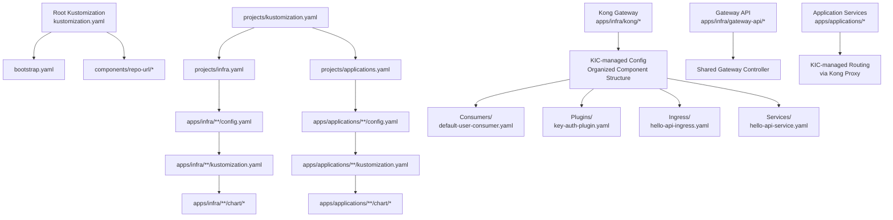
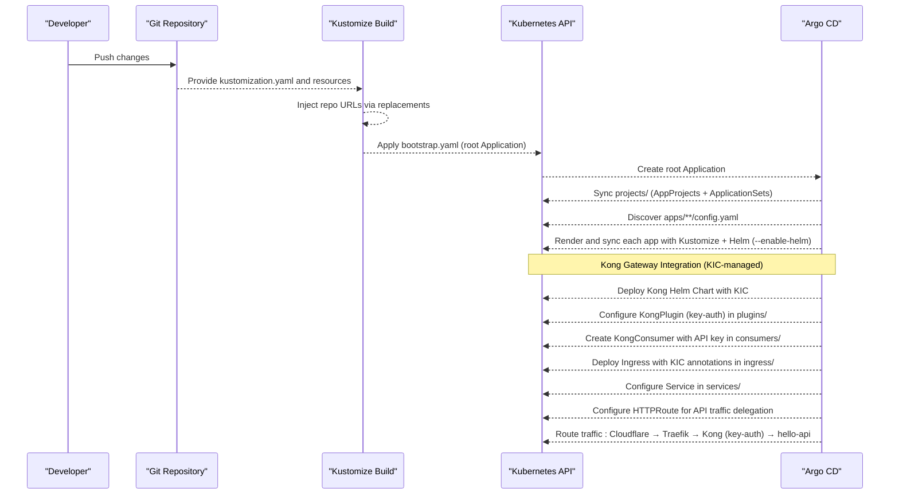
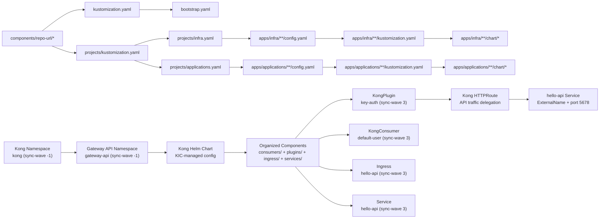

# Application Configuration

<cite>
**Referenced Files in This Document**
- [README.md](file://README.md)
- [bootstrap.yaml](file://bootstrap.yaml)
- [kustomization.yaml](file://kustomization.yaml)
- [projects/kustomization.yaml](file://projects/kustomization.yaml)
- [projects/infra.yaml](file://projects/infra.yaml)
- [projects/applications.yaml](file://projects/applications.yaml)
- [apps/infra/cloudflared/config.yaml](file://apps/infra/cloudflared/config.yaml)
- [apps/infra/datadog/config.yaml](file://apps/infra/datadog/config.yaml)
- [apps/infra/gateway-api/config.yaml](file://apps/infra/gateway-api/config.yaml)
- [apps/applications/rancher/config.yaml](file://apps/applications/rancher/config.yaml)
- [apps/applications/hello-api/config.yaml](file://apps/applications/hello-api/config.yaml)
- [apps/infra/cloudflared/kustomization.yaml](file://apps/infra/cloudflared/kustomization.yaml)
- [apps/infra/cloudflared/chart/kustomization.yaml](file://apps/infra/cloudflared/chart/kustomization.yaml)
- [apps/infra/cloudflared/chart/values.yaml](file://apps/infra/cloudflared/chart/values.yaml)
- [apps/applications/hello-api/chart/kustomization.yaml](file://apps/applications/hello-api/chart/kustomization.yaml)
- [apps/applications/hello-api/chart/values-httproute.yaml](file://apps/applications/hello-api/chart/values-httproute.yaml)
- [apps/applications/hello-api/chart/values-service.yaml](file://apps/applications/hello-api/chart/values-service.yaml)
- [apps/applications/hello-api/chart/values.yaml](file://apps/applications/hello-api/chart/values.yaml)
- [apps/infra/kong/config.yaml](file://apps/infra/kong/config.yaml)
- [apps/infra/kong/kustomization.yaml](file://apps/infra/kong/kustomization.yaml)
- [apps/infra/kong/chart/kustomization.yaml](file://apps/infra/kong/chart/kustomization.yaml)
- [apps/infra/kong/chart/values.yaml](file://apps/infra/kong/chart/values.yaml)
- [apps/infra/kong/chart/httproute-kong.yaml](file://apps/infra/kong/chart/httproute-kong.yaml)
- [apps/infra/kong/chart/consumers/default-user-consumer.yaml](file://apps/infra/kong/chart/consumers/default-user-consumer.yaml)
- [apps/infra/kong/chart/consumers/kustomization.yaml](file://apps/infra/kong/chart/consumers/kustomization.yaml)
- [apps/infra/kong/chart/ingress/hello-api-ingress.yaml](file://apps/infra/kong/chart/ingress/hello-api-ingress.yaml)
- [apps/infra/kong/chart/ingress/kustomization.yaml](file://apps/infra/kong/chart/ingress/kustomization.yaml)
- [apps/infra/kong/chart/plugins/key-auth-plugin.yaml](file://apps/infra/kong/chart/plugins/key-auth-plugin.yaml)
- [apps/infra/kong/chart/plugins/kustomization.yaml](file://apps/infra/kong/chart/plugins/kustomization.yaml)
- [apps/infra/kong/chart/services/hello-api-service.yaml](file://apps/infra/kong/chart/services/hello-api-service.yaml)
- [apps/infra/kong/chart/services/kustomization.yaml](file://apps/infra/kong/chart/services/kustomization.yaml)
- [cluster-resources/default/namespace.yaml](file://cluster-resources/default/namespace.yaml)
</cite>

## Update Summary
**Changes Made**
- Updated Kong Gateway integration patterns to reflect new directory structure with organized subdirectories
- Enhanced documentation with KongPlugin, KongConsumer, Ingress, and Service component organization
- Updated references to kong-consumer.yaml, kong-plugin-key-auth.yaml, hello-api-ingress.yaml moved to new subdirectory locations
- Improved Kustomize configuration patterns with enhanced discovery mechanisms
- Added comprehensive Kong Gateway KIC-managed integration documentation

## Table of Contents
1. [Introduction](#introduction)
2. [Project Structure](#project-structure)
3. [Core Components](#core-components)
4. [Architecture Overview](#architecture-overview)
5. [Detailed Component Analysis](#detailed-component-analysis)
6. [Dependency Analysis](#dependency-analysis)
7. [Performance Considerations](#performance-considerations)
8. [Troubleshooting Guide](#troubleshooting-guide)
9. [Conclusion](#conclusion)
10. [Appendices](#appendices)

## Introduction
This document explains application configuration patterns and best practices for managing Kubernetes applications with Argo CD, Kustomize, and Helm. It covers the standard application structure using config.yaml, kustomization.yaml, and optional chart/ directories, along with Kustomize configuration patterns, Helm chart integration via --enable-helm, and namespace management strategies. It also details how application configuration participates in the broader GitOps workflow, provides examples of different application types and their deployment patterns, and explains how applications inherit from base configurations while customizing settings per environment. The document now includes comprehensive coverage of Kong Gateway integration using KIC-managed approach with advanced API authentication and routing capabilities, organized into structured component directories.

## Project Structure
The repository organizes GitOps resources into a layered structure:
- Root Kustomize injects repository URLs and builds bootstrap.yaml.
- bootstrap/ contains the root Argo CD Application and related bootstrap resources.
- projects/ defines AppProjects and ApplicationSets that discover applications under apps/.
- apps/ contains application folders grouped by project (infra and applications), each with:
  - config.yaml for ApplicationSet discovery and per-app overrides.
  - kustomization.yaml to assemble manifests and optionally a chart/ directory.
  - chart/ directory containing Helm chart integration via Kustomize helmCharts.

**Updated** Enhanced with Kong Gateway as a centralized API proxy with KIC-managed configuration and comprehensive authentication setup organized into structured component directories.

**Diagram sources**
- [kustomization.yaml:1-21](file://kustomization.yaml#L1-L21)
- [projects/kustomization.yaml:1-22](file://projects/kustomization.yaml#L1-L22)
- [projects/infra.yaml:1-85](file://projects/infra.yaml#L1-L85)
- [projects/applications.yaml:1-90](file://projects/applications.yaml#L1-L90)
- [apps/infra/kong/kustomization.yaml:1-9](file://apps/infra/kong/kustomization.yaml#L1-L9)
- [apps/infra/gateway-api/kustomization.yaml:1-20](file://apps/infra/gateway-api/kustomization.yaml#L1-L20)
- [apps/infra/kong/chart/kustomization.yaml:12-17](file://apps/infra/kong/chart/kustomization.yaml#L12-L17)

**Section sources**
- [README.md:87-118](file://README.md#L87-L118)
- [README.md:128-134](file://README.md#L128-L134)
- [apps/infra/kong/config.yaml:1-4](file://apps/infra/kong/config.yaml#L1-L4)
- [apps/infra/kong/kustomization.yaml:1-9](file://apps/infra/kong/kustomization.yaml#L1-L9)

## Core Components
- Root Kustomize and bootstrap pipeline:
  - Root Kustomize composes bootstrap.yaml and injects repo URLs from components/repo-url.
  - bootstrap.yaml defines the root Argo CD Application pointing to the bootstrap path.
- Projects and ApplicationSets:
  - projects/infra.yaml and projects/applications.yaml define AppProjects and ApplicationSets.
  - Generators scan apps/infra/**/config.yaml and apps/applications/**/config.yaml respectively.
  - Templates set destination namespace, project, and enable Helm via Kustomize buildOptions.
- Application-level configuration:
  - config.yaml controls destination namespace and sync wave per app.
  - kustomization.yaml composes resources and optionally references chart/.
  - chart/ integrates Helm charts via Kustomize helmCharts with values files.

**Updated** Enhanced with Kong Gateway KIC-managed integration patterns and centralized API authentication organized into structured component directories.

Key behaviors:
- Centralized repo URL replacement ensures consistent source references across the stack.
- Sync waves enforce ordered application deployment across the cluster.
- Helm integration is enabled globally for discovered apps via Kustomize buildOptions.
- Kong Gateway provides centralized API authentication and routing with KIC-managed configuration organized into consumers, plugins, ingress, and services subdirectories.

**Section sources**
- [kustomization.yaml:1-21](file://kustomization.yaml#L1-L21)
- [bootstrap.yaml:1-26](file://bootstrap.yaml#L1-L26)
- [projects/kustomization.yaml:1-22](file://projects/kustomization.yaml#L1-L22)
- [projects/infra.yaml:33-60](file://projects/infra.yaml#L33-L60)
- [projects/applications.yaml:34-60](file://projects/applications.yaml#L34-L60)
- [apps/infra/cloudflared/config.yaml:1-4](file://apps/infra/cloudflared/config.yaml#L1-L4)
- [apps/infra/gateway-api/config.yaml:1-6](file://apps/infra/gateway-api/config.yaml#L1-L6)
- [apps/applications/rancher/config.yaml:1-5](file://apps/applications/rancher/config.yaml#L1-L5)
- [apps/infra/kong/config.yaml:1-4](file://apps/infra/kong/config.yaml#L1-L4)

## Architecture Overview
The GitOps workflow proceeds through a bootstrap chain that installs Argo CD, sets up AppProjects and ApplicationSets, and then discovers and deploys applications from apps/. The new Kong Gateway integration adds centralized API proxy functionality with KIC-managed configuration, advanced routing capabilities, and comprehensive API authentication organized into structured component directories.

**Updated** Added Kong Gateway as a centralized API proxy with KIC-managed configuration, key-based authentication, and HTTPRoute delegation organized into consumers, plugins, ingress, and services subdirectories.

**Diagram sources**
- [README.md:57-75](file://README.md#L57-L75)
- [kustomization.yaml:10-21](file://kustomization.yaml#L10-L21)
- [projects/kustomization.yaml:11-22](file://projects/kustomization.yaml#L11-L22)
- [projects/infra.yaml:33-60](file://projects/infra.yaml#L33-L60)
- [projects/applications.yaml:34-60](file://projects/applications.yaml#L34-L60)
- [apps/infra/kong/chart/kustomization.yaml:4-18](file://apps/infra/kong/chart/kustomization.yaml#L4-L18)
- [apps/infra/kong/chart/values.yaml:1-43](file://apps/infra/kong/chart/values.yaml#L1-L43)

## Detailed Component Analysis

### Standard Application Structure and Patterns
Each application follows a consistent structure:
- apps/<project>/<app>/config.yaml: Declares destination namespace and optional sync wave.
- apps/<project>/<app>/kustomization.yaml: Defines namespace and resources; optionally includes chart/.
- apps/<project>/<app>/chart/: Contains Helm chart integration via Kustomize helmCharts and values files.

**Updated** Enhanced with Kong Gateway KIC-managed patterns for API proxy integration and centralized authentication organized into structured component directories.

Patterns:
- Namespace management: Use config.yaml destNamespace to override the default derived from the app folder name.
- Sync ordering: Use annotations with argocd.argoproj.io/sync-wave to control deployment order.
- Helm integration: Enable --enable-helm in ApplicationSet templates; reference chart/ via Kustomize resources.
- Kong integration: Deploy Kong Helm chart with KIC-managed configuration and centralized HTTPRoute delegation organized into consumers, plugins, ingress, and services subdirectories.

Examples:
- Infra app (cloudflared): Uses a dedicated namespace and Helm chart with values from chart/values.yaml.
- Applications app (hello-api): Now uses Kong-managed routing instead of direct HTTPRoute.
- **New** Kong app: Provides centralized API proxy with KIC-managed configuration, key-based authentication, and HTTPRoute delegation organized into structured component directories.

**Section sources**
- [README.md:128-134](file://README.md#L128-L134)
- [apps/infra/cloudflared/config.yaml:1-4](file://apps/infra/cloudflared/config.yaml#L1-L4)
- [apps/infra/cloudflared/kustomization.yaml:1-8](file://apps/infra/cloudflared/kustomization.yaml#L1-L8)
- [apps/infra/cloudflared/chart/kustomization.yaml:1-11](file://apps/infra/cloudflared/chart/kustomization.yaml#L1-L11)
- [apps/applications/hello-api/chart/kustomization.yaml:1-14](file://apps/applications/hello-api/chart/kustomization.yaml#L1-L14)
- [apps/infra/kong/config.yaml:1-4](file://apps/infra/kong/config.yaml#L1-L4)
- [apps/infra/kong/kustomization.yaml:1-9](file://apps/infra/kong/kustomization.yaml#L1-L9)
- [apps/infra/kong/chart/kustomization.yaml:1-18](file://apps/infra/kong/chart/kustomization.yaml#L1-L18)

### Kustomize Configuration Patterns
- Root and project-level Kustomize:
  - Root kustomization.yaml composes bootstrap.yaml and injects repo URLs via replacements.
  - projects/kustomization.yaml composes infra.yaml and applications.yaml and performs the same replacement.
- Application-level Kustomize:
  - apps/<project>/<app>/kustomization.yaml sets namespace and includes chart/.
  - apps/<project>/<app>/chart/kustomization.yaml defines helmCharts with repo, releaseName, version, and valuesFile(s).

**Updated** Added Kong-specific Kustomize patterns for KIC-managed Helm chart integration and component resource management organized into structured subdirectories.

Best practices:
- Keep namespace declarations at the application level to avoid cross-project leakage.
- Use valuesFile and additionalValuesFiles to split concerns (e.g., service vs. HTTPRoute-specific values).
- Leverage Kustomize replacements centrally to avoid hardcoding repo URLs in multiple places.
- **New** Use dedicated namespaces for API proxy infrastructure (kong) with appropriate sync waves.
- **New** Coordinate KIC component deployment with explicit sync wave ordering using organized subdirectory structure.
- **New** Organize Kong components into consumers/, plugins/, ingress/, and services/ subdirectories for better maintainability.

**Section sources**
- [kustomization.yaml:1-21](file://kustomization.yaml#L1-L21)
- [projects/kustomization.yaml:1-22](file://projects/kustomization.yaml#L1-L22)
- [apps/infra/cloudflared/kustomization.yaml:1-8](file://apps/infra/cloudflared/kustomization.yaml#L1-L8)
- [apps/infra/cloudflared/chart/kustomization.yaml:1-11](file://apps/infra/cloudflared/chart/kustomization.yaml#L1-L11)
- [apps/applications/hello-api/chart/kustomization.yaml:1-14](file://apps/applications/hello-api/chart/kustomization.yaml#L1-L14)
- [apps/infra/kong/chart/kustomization.yaml:1-18](file://apps/infra/kong/chart/kustomization.yaml#L1-L18)

### Helm Chart Integration Using --enable-helm
- Global enablement:
  - ApplicationSet templates set kustomize.buildOptions to --enable-helm so Helm releases are rendered during Kustomize build.
- Per-app Helm configuration:
  - helmCharts entries specify chart name, OCI repository, release name, target namespace, version, and values files.
  - Values files can be combined using additionalValuesFiles for layered customization.

**Updated** Enhanced with Kong Helm chart integration for KIC-managed API proxy deployment organized into structured component directories.

Example references:
- cloudflared Helm chart integration and values.
- hello-api Helm chart integration with multiple values files.
- **New** Kong Helm chart integration with KIC-managed configuration and component resources organized into consumers/, plugins/, ingress/, and services/ subdirectories.

**Section sources**
- [projects/infra.yaml:59-60](file://projects/infra.yaml#L59-L60)
- [projects/applications.yaml:59-60](file://projects/applications.yaml#L59-L60)
- [apps/infra/cloudflared/chart/kustomization.yaml:4-11](file://apps/infra/cloudflared/chart/kustomization.yaml#L4-L11)
- [apps/applications/hello-api/chart/kustomization.yaml:4-14](file://apps/applications/hello-api/chart/kustomization.yaml#L4-L14)
- [apps/infra/kong/chart/kustomization.yaml:4-18](file://apps/infra/kong/chart/kustomization.yaml#L4-L18)

### Namespace Management Strategies
- Shared namespaces:
  - cluster-resources/default/namespace.yaml defines shared namespaces applied with sync-wave -1 to ensure availability before apps deploy.
  - **New** Kong namespace (kong) is created with KIC-managed infrastructure exposure.
- Per-app namespaces:
  - config.yaml can override the default derived namespace via destNamespace.
  - ApplicationSet templates use the overridden namespace when present; otherwise, they derive it from the app folder name.
- Special-case namespaces:
  - Some apps require pre-existing namespaces (e.g., cattle-system for Rancher) and rely on sync waves to ensure prerequisites exist.
  - **New** Gateway API namespace (gateway-api) provides shared ingress controller infrastructure for KIC.

**Updated** Added Kong-specific namespace management with dedicated KIC infrastructure.

**Section sources**
- [README.md:144-147](file://README.md#L144-L147)
- [apps/infra/gateway-api/config.yaml:1-6](file://apps/infra/gateway-api/config.yaml#L1-L6)
- [apps/applications/rancher/config.yaml:1-5](file://apps/applications/rancher/config.yaml#L1-L5)
- [projects/applications.yaml:72-74](file://projects/applications.yaml#L72-L74)
- [cluster-resources/default/namespace.yaml:79-84](file://cluster-resources/default/namespace.yaml#L79-L84)

### Kong Gateway Integration Patterns (KIC-managed)
**New** The Kong Gateway provides centralized API proxy functionality with KIC-managed configuration, advanced routing capabilities, and comprehensive key-based authentication organized into structured component directories.

Key components:
- **Kong Helm Chart**: Deployed via Helm with KIC-managed configuration for simplified operations.
- **KIC Configuration**: Uses custom Kong Ingress Controller images with DB-less mode for streamlined management.
- **KongPlugin**: Provides centralized key-auth plugin configuration with custom key names and credential hiding.
- **KongConsumer**: Manages API consumers with associated credentials for authentication.
- **Ingress Resources**: KIC-managed Ingress resources with plugin associations and path-based routing.
- **Service Resources**: Kong-managed services for backend application connectivity.
- **HTTPRoute Integration**: Delegates API traffic from Gateway API to KIC-managed Kong proxy.

**Updated** Enhanced with organized component structure in consumers/, plugins/, ingress/, and services/ subdirectories.

Configuration patterns:
- **Values File**: Defines KIC images, Kong DB-less configuration, proxy service configuration, and enterprise settings.
- **Component Resources**: Separate YAML files for KongPlugin, KongConsumer, Ingress, and Service organized into dedicated subdirectories.
- **Plugin Configuration**: Enables key-auth plugin with custom key names (X-API-Key) and credential hiding.
- **Consumer Management**: Creates default user with development API key for testing.
- **Ingress Annotations**: Associates plugins and routing behavior with KIC.
- **Component Organization**: Structured directory layout improves maintainability and discoverability.

**Section sources**
- [apps/infra/kong/config.yaml:1-4](file://apps/infra/kong/config.yaml#L1-L4)
- [apps/infra/kong/kustomization.yaml:1-9](file://apps/infra/kong/kustomization.yaml#L1-L9)
- [apps/infra/kong/chart/kustomization.yaml:1-18](file://apps/infra/kong/chart/kustomization.yaml#L1-L18)
- [apps/infra/kong/chart/values.yaml:1-43](file://apps/infra/kong/chart/values.yaml#L1-L43)
- [apps/infra/kong/chart/httproute-kong.yaml:1-30](file://apps/infra/kong/chart/httproute-kong.yaml#L1-L30)
- [apps/infra/kong/chart/consumers/default-user-consumer.yaml:1-24](file://apps/infra/kong/chart/consumers/default-user-consumer.yaml#L1-L24)
- [apps/infra/kong/chart/plugins/key-auth-plugin.yaml:1-12](file://apps/infra/kong/chart/plugins/key-auth-plugin.yaml#L1-L12)
- [apps/infra/kong/chart/ingress/hello-api-ingress.yaml:1-21](file://apps/infra/kong/chart/ingress/hello-api-ingress.yaml#L1-L21)
- [apps/infra/kong/chart/services/hello-api-service.yaml:1-15](file://apps/infra/kong/chart/services/hello-api-service.yaml#L1-L15)

### HTTPRoute Configuration Patterns with Kong Integration
**New** HTTPRoute configurations now support delegation to KIC-managed Kong Gateway for advanced API traffic management.

Pattern components:
- **Parent Reference**: HTTPRoute references shared gateway from gateway-api namespace.
- **Hostname Configuration**: Defines API domain (api.hoangvu75.space) for traffic routing.
- **Path-based Routing**: Routes all paths (/) to Kong proxy service.
- **Request Header Modification**: Adds forwarded protocol and port headers for upstream services.
- **Backend Reference**: Points to Kong proxy service (kong-proxy) on port 80.

Integration benefits:
- **Centralized Control**: Single HTTPRoute manages API traffic flow.
- **Advanced Features**: Leverages Kong's key-auth plugin for API security.
- **Scalable Architecture**: Supports multiple services behind unified API gateway.
- **Security Enhancement**: Key-based authentication prevents unauthorized access.
- **KIC Coordination**: Explicit sync wave ordering ensures proper component deployment.

**Section sources**
- [apps/infra/kong/chart/httproute-kong.yaml:1-30](file://apps/infra/kong/chart/httproute-kong.yaml#L1-L30)
- [apps/applications/hello-api/chart/values-httproute.yaml:1-28](file://apps/applications/hello-api/chart/values-httproute.yaml#L1-L28)

### Relationship Between Application Configuration and GitOps Workflow
- Discovery:
  - ApplicationSets scan apps/infra/**/config.yaml and apps/applications/**/config.yaml to discover applications.
- Rendering:
  - For each discovered app, Argo CD renders the app's kustomization.yaml with --enable-helm and applies the resulting manifests.
- Ordering:
  - Sync waves in config.yaml and project-level annotations ensure correct sequencing across the cluster.
- **New** Kong Integration (KIC-managed):
  - Kong Gateway deploys with sync wave -1 to ensure infrastructure availability.
  - KongPlugin and KongConsumer deploy with sync wave 3 for authentication setup.
  - Ingress resources deploy with sync wave 3 for routing configuration.
  - HTTPRoute deploys with sync wave 3 to establish API traffic routing after gateway deployment.
  - Component organization in subdirectories improves deployment coordination.

**Updated** Added Kong Gateway KIC-managed deployment coordination with explicit sync wave ordering and organized component structure.

**Section sources**
- [README.md:57-75](file://README.md#L57-L75)
- [projects/infra.yaml:33-60](file://projects/infra.yaml#L33-L60)
- [projects/applications.yaml:34-60](file://projects/applications.yaml#L34-L60)
- [apps/infra/kong/config.yaml:1-4](file://apps/infra/kong/config.yaml#L1-L4)

### Examples of Different Application Types and Deployment Patterns
- Infrastructure app (cloudflared):
  - Purpose: Cloudflare tunnel connectivity.
  - Pattern: Helm chart via OCI registry, values from values.yaml, dedicated namespace.
- Monitoring app (Datadog):
  - Purpose: Observability agent.
  - Pattern: Helm chart via OCI registry, values from values.yaml, dedicated namespace.
- Gateway API stack (gateway-api):
  - Purpose: Ingress controller via Gateway API.
  - Pattern: Requires CRDs first; uses dedicated namespace and CreateNamespace sync option.
- **New** API Gateway app (kong):
  - Purpose: Centralized API proxy with KIC-managed configuration and key-based authentication.
  - Pattern: Helm chart with KIC images, component resources organized in consumers/, plugins/, ingress/, and services/ subdirectories, dedicated kong namespace.
- Applications app (hello-api):
  - Purpose: Sample HTTP echo service.
  - Pattern: Helm chart with multiple values files for service and HTTPRoute configuration.
  - **Updated** Now uses KIC-managed routing via Kong instead of direct HTTPRoute.
- Exposure app (argocd-ingress):
  - Purpose: Expose Argo CD UI via HTTPRoute.
  - Pattern: Uses HTTPRoute and values from chart/values.yaml.
- Management app (rancher):
  - Purpose: Cluster management UI.
  - Pattern: Requires cattle-system namespace and higher sync wave to deploy after prerequisites.

**Updated** Added Kong Gateway as a new infrastructure component with comprehensive KIC-managed API proxy functionality organized into structured component directories.

**Section sources**
- [apps/infra/cloudflared/config.yaml:1-4](file://apps/infra/cloudflared/config.yaml#L1-L4)
- [apps/infra/datadog/config.yaml:1-6](file://apps/infra/datadog/config.yaml#L1-L6)
- [apps/infra/gateway-api/config.yaml:1-6](file://apps/infra/gateway-api/config.yaml#L1-L6)
- [apps/infra/kong/config.yaml:1-4](file://apps/infra/kong/config.yaml#L1-L4)
- [apps/applications/hello-api/config.yaml:1-4](file://apps/applications/hello-api/config.yaml#L1-L4)
- [apps/applications/rancher/config.yaml:1-5](file://apps/applications/rancher/config.yaml#L1-L5)

### How Applications Inherit From Base Configurations and Customize Settings
- Inheritance:
  - Root and project-level Kustomize inject repo URLs centrally, avoiding duplication.
  - ApplicationSet templates derive path-based values (project, app name, repoURL) and pass them to each app.
- Customization:
  - config.yaml overrides destination namespace and adds sync wave annotations.
  - chart/values.yaml and additionalValuesFiles tailor chart behavior per environment or concern.
  - kustomization.yaml can set namespace and include chart/ selectively.
- **New** Kong Integration (KIC-managed):
  - Kong values.yaml provides centralized KIC configuration with custom images and DB-less mode.
  - Component resources (KongPlugin, KongConsumer, Ingress, Service) organized in dedicated subdirectories enable comprehensive API authentication.
  - HTTPRoute configuration delegates traffic to KIC-managed Kong proxy service.
  - Consumer and plugin configurations enable API key authentication with custom key names.
  - Structured component organization improves maintainability and deployment coordination.

**Updated** Enhanced with Kong-specific KIC-managed inheritance patterns for API proxy configuration organized into structured component directories.

**Section sources**
- [kustomization.yaml:10-21](file://kustomization.yaml#L10-L21)
- [projects/kustomization.yaml:11-22](file://projects/kustomization.yaml#L11-L22)
- [projects/infra.yaml:40-58](file://projects/infra.yaml#L40-L58)
- [projects/applications.yaml:40-58](file://projects/applications.yaml#L40-L58)
- [apps/infra/cloudflared/kustomization.yaml:1-8](file://apps/infra/cloudflared/kustomization.yaml#L1-L8)
- [apps/applications/hello-api/chart/kustomization.yaml:11-14](file://apps/applications/hello-api/chart/kustomization.yaml#L11-L14)
- [apps/infra/kong/chart/values.yaml:1-43](file://apps/infra/kong/chart/values.yaml#L1-L43)

## Dependency Analysis
The configuration depends on a strict order of operations:
- Root Kustomize depends on components/repo-url for centralized repo URL injection.
- projects/ depends on components/repo-url and composes AppProjects and ApplicationSets.
- ApplicationSets depend on apps/**/config.yaml for discovery and per-app overrides.
- Applications depend on chart/ and values files for Helm rendering.
- **New** Kong Gateway depends on gateway-api infrastructure and requires proper namespace management.
- **New** KIC-managed components require explicit sync wave coordination for proper deployment order.
- **New** Component organization in subdirectories improves dependency management and deployment coordination.

**Updated** Added Kong Gateway KIC-managed dependency relationships and infrastructure ordering with organized component structure.

**Diagram sources**
- [kustomization.yaml:4-6](file://kustomization.yaml#L4-L6)
- [projects/kustomization.yaml:4-5](file://projects/kustomization.yaml#L4-L5)
- [projects/infra.yaml:33-58](file://projects/infra.yaml#L33-L58)
- [projects/applications.yaml:34-58](file://projects/applications.yaml#L34-L58)
- [cluster-resources/default/namespace.yaml:79-84](file://cluster-resources/default/namespace.yaml#L79-L84)
- [apps/infra/kong/chart/kustomization.yaml:4-18](file://apps/infra/kong/chart/kustomization.yaml#L4-L18)

**Section sources**
- [kustomization.yaml:1-21](file://kustomization.yaml#L1-L21)
- [projects/kustomization.yaml:1-22](file://projects/kustomization.yaml#L1-L22)
- [projects/infra.yaml:33-60](file://projects/infra.yaml#L33-L60)
- [projects/applications.yaml:34-60](file://projects/applications.yaml#L34-L60)
- [cluster-resources/default/namespace.yaml:79-84](file://cluster-resources/default/namespace.yaml#L79-L84)

## Performance Considerations
- Minimize redundant Kustomize transformations by consolidating shared overlays and values where appropriate.
- Use sync waves judiciously to prevent unnecessary contention during initial bootstrapping.
- Prefer OCI Helm charts for faster pulls and consistent versions.
- Keep values files small and focused; use additionalValuesFiles to compose environment-specific settings without duplicating large blocks.
- **New** Optimize Kong performance with KIC-managed configuration for reduced overhead.
- **New** Leverage Kong's centralized caching and connection pooling for improved API proxy performance.
- **New** Use ExternalName services for efficient service bridging in KIC-managed environments.
- **New** Organized component directories improve deployment performance and reduce build complexity.

**Updated** Added performance considerations specific to Kong Gateway KIC-managed integration and organized component structure.

## Troubleshooting Guide
Common configuration mistakes and resolutions:
- Missing namespace:
  - Symptom: Application fails to render or prune due to missing namespace.
  - Resolution: Set destNamespace in config.yaml or enable CreateNamespace in syncOptions.
  - References: [apps/infra/gateway-api/config.yaml:1-6](file://apps/infra/gateway-api/config.yaml#L1-L6), [projects/applications.yaml:72-74](file://projects/applications.yaml#L72-L74)
- Incorrect repo URL injection:
  - Symptom: ApplicationSet cannot discover apps or Helm charts fail to render.
  - Resolution: Verify components/repo-url and replacements in root and project-level Kustomize.
  - References: [kustomization.yaml:10-21](file://kustomization.yaml#L10-L21), [projects/kustomization.yaml:11-22](file://projects/kustomization.yaml#L11-L22)
- Misordered sync waves:
  - Symptom: HTTPRoute or dependent resources fail because Gateway does not exist yet.
  - Resolution: Adjust argocd.argoproj.io/sync-wave in config.yaml or project-level annotations.
  - References: [README.md:76-85](file://README.md#L76-L85), [apps/infra/gateway-api/config.yaml:1-6](file://apps/infra/gateway-api/config.yaml#L1-L6)
- Helm chart rendering errors:
  - Symptom: Kustomize build fails with Helm-related errors.
  - Resolution: Ensure --enable-helm is set in ApplicationSet templates and helmCharts entries are valid.
  - References: [projects/infra.yaml:59-60](file://projects/infra.yaml#L59-L60), [projects/applications.yaml:59-60](file://projects/applications.yaml#L59-L60), [apps/infra/cloudflared/chart/kustomization.yaml:4-11](file://apps/infra/cloudflared/chart/kustomization.yaml#L4-L11)
- Values file conflicts:
  - Symptom: Unexpected chart behavior or missing overrides.
  - Resolution: Review values.yaml and additionalValuesFiles ordering and ensure keys match the target chart.
  - References: [apps/infra/cloudflared/chart/values.yaml:1-40](file://apps/infra/cloudflared/chart/values.yaml#L1-L40), [apps/applications/hello-api/chart/values.yaml:1-23](file://apps/applications/hello-api/chart/values.yaml#L1-L23), [apps/applications/hello-api/chart/kustomization.yaml:11-14](file://apps/applications/hello-api/chart/kustomization.yaml#L11-L14)
- **New** Kong-specific issues:
  - Symptom: API requests fail with authentication errors.
  - Resolution: Verify KongPlugin configuration and API key credentials in consumers/default-user-consumer.yaml.
  - Symptom: Kong proxy service not reachable.
  - Resolution: Check Kong proxy service configuration and HTTPRoute backend reference.
  - Symptom: KIC-managed configuration not applied.
  - Resolution: Verify KIC images in values.yaml and component resource sync waves.
  - Symptom: Ingress routing not working.
  - Resolution: Check Ingress annotations (konghq.com/plugins, konghq.com/strip-path) and service references.
  - Symptom: Component organization issues.
  - Resolution: Verify subdirectory structure (consumers/, plugins/, ingress/, services/) and proper Kustomize resource references.
  - Symptom: ExternalName service not resolving.
  - Resolution: Verify ExternalName points to correct target service DNS.

**Updated** Added comprehensive Kong Gateway KIC-managed troubleshooting guidance with organized component structure.

**Section sources**
- [README.md:76-85](file://README.md#L76-L85)
- [apps/infra/gateway-api/config.yaml:1-6](file://apps/infra/gateway-api/config.yaml#L1-L6)
- [projects/applications.yaml:72-74](file://projects/applications.yaml#L72-L74)
- [kustomization.yaml:10-21](file://kustomization.yaml#L10-L21)
- [projects/kustomization.yaml:11-22](file://projects/kustomization.yaml#L11-L22)
- [projects/infra.yaml:59-60](file://projects/infra.yaml#L59-L60)
- [projects/applications.yaml:59-60](file://projects/applications.yaml#L59-L60)
- [apps/infra/cloudflared/chart/kustomization.yaml:4-11](file://apps/infra/cloudflared/chart/kustomization.yaml#L4-L11)
- [apps/applications/hello-api/chart/kustomization.yaml:11-14](file://apps/applications/hello-api/chart/kustomization.yaml#L11-L14)
- [apps/infra/cloudflared/chart/values.yaml:1-40](file://apps/infra/cloudflared/chart/values.yaml#L1-L40)
- [apps/applications/hello-api/chart/values.yaml:1-23](file://apps/applications/hello-api/chart/values.yaml#L1-L23)
- [apps/infra/kong/chart/values.yaml:1-43](file://apps/infra/kong/chart/values.yaml#L1-L43)
- [apps/infra/kong/chart/consumers/default-user-consumer.yaml:1-24](file://apps/infra/kong/chart/consumers/default-user-consumer.yaml#L1-L24)
- [apps/infra/kong/chart/ingress/hello-api-ingress.yaml:1-21](file://apps/infra/kong/chart/ingress/hello-api-ingress.yaml#L1-L21)

## Conclusion
This configuration model leverages Kustomize for templating and composition, Helm for chart-driven deployments, and Argo CD for GitOps orchestration. By centralizing repository URL management, enforcing sync waves, and structuring applications consistently with config.yaml, kustomization.yaml, and chart/, teams can reliably manage diverse workloads across environments. The new Kong Gateway integration with KIC-managed approach enhances this model with centralized API proxy functionality, providing advanced routing capabilities, comprehensive key-based authentication, and scalable traffic management organized into structured component directories. Following the patterns outlined here minimizes drift, reduces errors, and accelerates onboarding of new applications while maintaining robust API security and performance.

**Updated** Enhanced conclusion to reflect Kong Gateway KIC-managed integration and its benefits for API traffic management with organized component structure.

## Appendices
- Adding a new application:
  - Create a folder under apps/infra/<name>/ or apps/applications/<name>/.
  - Add config.yaml to declare destNamespace and optional sync wave.
  - Add kustomization.yaml and an optional chart/ directory.
  - Reference Helm charts via Kustomize helmCharts blocks with --enable-helm.
  - Commit and push; Argo CD will detect and sync automatically.
  - References: [README.md:128-134](file://README.md#L128-L134)
- **New** Adding Kong Gateway KIC-managed integration:
  - Deploy Kong Helm chart with KIC-managed configuration for centralized API proxy.
  - Configure KongPlugin (key-auth) with custom key names and credential hiding in plugins/ subdirectory.
  - Create KongConsumer with associated API key credentials in consumers/ subdirectory.
  - Deploy Ingress resources with KIC annotations for routing management in ingress/ subdirectory.
  - Configure Service resources for backend application connectivity in services/ subdirectory.
  - Set up ExternalName service for efficient service bridging.
  - Configure HTTPRoute to delegate API traffic to KIC-managed Kong proxy.
  - Coordinate deployment with proper sync waves (-1 for infrastructure, 3 for components).
  - Organize components into structured subdirectories (consumers/, plugins/, ingress/, services/) for maintainability.
  - References: [apps/infra/kong/chart/values.yaml:1-43](file://apps/infra/kong/chart/values.yaml#L1-L43), [apps/infra/kong/chart/consumers/default-user-consumer.yaml:1-24](file://apps/infra/kong/chart/consumers/default-user-consumer.yaml#L1-L24), [apps/infra/kong/chart/plugins/key-auth-plugin.yaml:1-12](file://apps/infra/kong/chart/plugins/key-auth-plugin.yaml#L1-L12), [apps/infra/kong/chart/ingress/hello-api-ingress.yaml:1-21](file://apps/infra/kong/chart/ingress/hello-api-ingress.yaml#L1-L21), [apps/infra/kong/chart/services/hello-api-service.yaml:1-15](file://apps/infra/kong/chart/services/hello-api-service.yaml#L1-L15), [apps/infra/kong/chart/httproute-kong.yaml:1-30](file://apps/infra/kong/chart/httproute-kong.yaml#L1-L30)

**Updated** Added Kong Gateway KIC-managed integration guidance to the appendices with organized component structure.