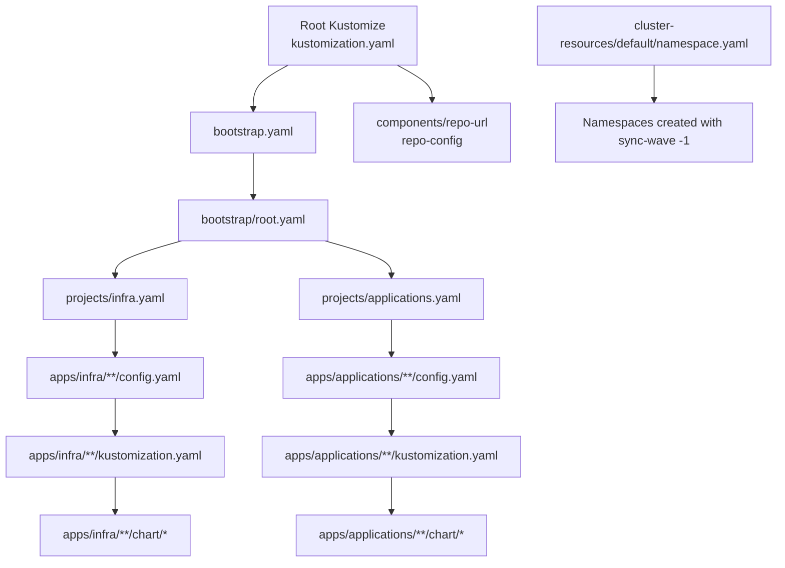
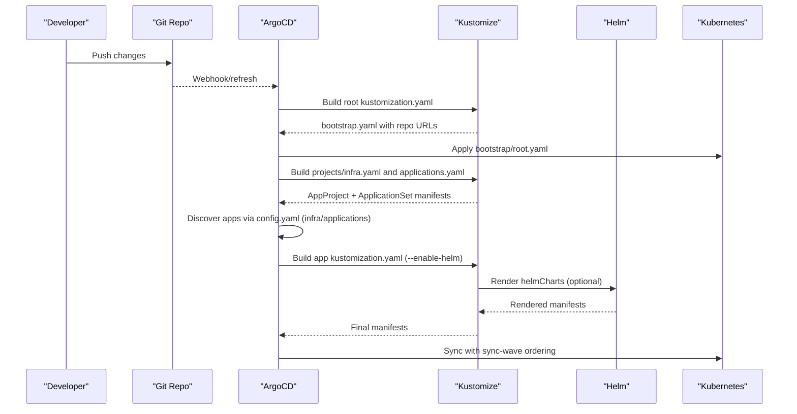
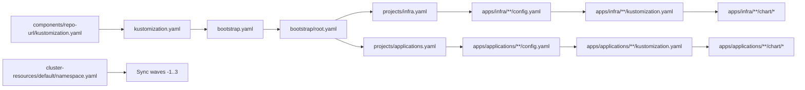

# Application Structure and Organization

<cite>
**Referenced Files in This Document**
- [README.md](file://README.md)
- [kustomization.yaml](file://kustomization.yaml)
- [bootstrap.yaml](file://bootstrap.yaml)
- [bootstrap/root.yaml](file://bootstrap/root.yaml)
- [bootstrap/cluster-resources.yaml](file://bootstrap/cluster-resources.yaml)
- [projects/kustomization.yaml](file://projects/kustomization.yaml)
- [projects/infra.yaml](file://projects/infra.yaml)
- [projects/applications.yaml](file://projects/applications.yaml)
- [cluster-resources/default/namespace.yaml](file://cluster-resources/default/namespace.yaml)
- [apps/infra/cloudflared/config.yaml](file://apps/infra/cloudflared/config.yaml)
- [apps/infra/cloudflared/kustomization.yaml](file://apps/infra/cloudflared/kustomization.yaml)
- [apps/infra/cloudflared/chart/kustomization.yaml](file://apps/infra/cloudflared/chart/kustomization.yaml)
- [apps/infra/cloudflared/chart/values.yaml](file://apps/infra/cloudflared/chart/values.yaml)
- [apps/infra/gateway-api/config.yaml](file://apps/infra/gateway-api/config.yaml)
- [apps/applications/helloworld-api/config.yaml](file://apps/applications/helloworld-api/config.yaml)
- [apps/applications/tcp-demo/config.yaml](file://apps/applications/tcp-demo/config.yaml)
- [components/repo-url/kustomization.yaml](file://components/repo-url/kustomization.yaml)
</cite>

## Update Summary
**Changes Made**
- Updated project structure to reflect new organization with apps/infra/ for infrastructure components and apps/applications/ for user-facing applications
- Replaced references to apps/playground/ with apps/applications/ throughout the documentation
- Updated ApplicationSet generators to point to new directory structure
- Revised application organization examples to reflect consolidated structure
- Updated namespace management examples to show both infrastructure and application namespaces

## Table of Contents
1. [Introduction](#introduction)
2. [Project Structure](#project-structure)
3. [Core Components](#core-components)
4. [Architecture Overview](#architecture-overview)
5. [Detailed Component Analysis](#detailed-component-analysis)
6. [Dependency Analysis](#dependency-analysis)
7. [Performance Considerations](#performance-considerations)
8. [Troubleshooting Guide](#troubleshooting-guide)
9. [Conclusion](#conclusion)

## Introduction
This document explains the standard application structure used in this GitOps system. It covers:
- The mandatory config.yaml format and its role in ApplicationSet discovery and per-app configuration
- The role of kustomization.yaml in defining namespaces and composing resources
- The optional chart/ directory pattern for Helm-based deployments
- How applications are organized by type (infrastructure vs applications) and how this affects configuration patterns
- Examples of minimal application setups and the purpose of each configuration file
- Namespace isolation principles and how applications inherit from base configurations

## Project Structure
The repository follows a layered GitOps structure:
- Root Kustomize composes bootstrap artifacts and injects repository URLs
- Bootstrap installs the root Application pointing to projects/
- projects/ defines AppProjects and ApplicationSets that discover apps under apps/**
- apps/** contains application folders with config.yaml and kustomization.yaml, optionally with a chart/ directory for Helm

**Diagram sources**
- [kustomization.yaml:1-21](file://kustomization.yaml#L1-L21)
- [bootstrap.yaml:1-26](file://bootstrap.yaml#L1-L26)
- [bootstrap/root.yaml:1-37](file://bootstrap/root.yaml#L1-L37)
- [projects/infra.yaml:1-86](file://projects/infra.yaml#L1-L86)
- [projects/applications.yaml:1-85](file://projects/applications.yaml#L1-L85)
- [apps/infra/cloudflared/config.yaml:1-4](file://apps/infra/cloudflared/config.yaml#L1-L4)
- [apps/infra/cloudflared/kustomization.yaml:1-8](file://apps/infra/cloudflared/kustomization.yaml#L1-L8)
- [apps/infra/cloudflared/chart/kustomization.yaml:1-11](file://apps/infra/cloudflared/chart/kustomization.yaml#L1-L11)
- [apps/applications/helloworld-api/config.yaml:1-4](file://apps/applications/helloworld-api/config.yaml#L1-L4)
- [apps/applications/tcp-demo/config.yaml:1-4](file://apps/applications/tcp-demo/config.yaml#L1-L4)
- [cluster-resources/default/namespace.yaml:1-108](file://cluster-resources/default/namespace.yaml#L1-L108)

**Section sources**
- [README.md:96-150](file://README.md#L96-L150)
- [README.md:160-167](file://README.md#L160-L167)

## Core Components
- Root Kustomize: Composes bootstrap.yaml and injects repo URLs from components/repo-url
- Bootstrap: Creates the root Application and applies cluster-resources and secrets
- Projects: Defines AppProjects and ApplicationSets that scan for config.yaml files
- Apps: Per-application folders with config.yaml and kustomization.yaml; optional Helm via chart/

Key responsibilities:
- config.yaml: Declares destination namespace and optional sync-wave annotation for ordering
- kustomization.yaml: Sets namespace and includes chart/ or raw resources
- chart/: Optional Helm chart packaged with helmCharts and values

**Section sources**
- [README.md:57-75](file://README.md#L57-L75)
- [README.md:160-167](file://README.md#L160-L167)
- [README.md:176-179](file://README.md#L176-L179)

## Architecture Overview
The GitOps pipeline and sync order are orchestrated by sync-wave annotations and ApplicationSet generators.

**Diagram sources**
- [README.md:66-84](file://README.md#L66-L84)
- [kustomization.yaml:1-21](file://kustomization.yaml#L1-L21)
- [bootstrap/root.yaml:1-37](file://bootstrap/root.yaml#L1-L37)
- [projects/infra.yaml:33-60](file://projects/infra.yaml#L33-L60)
- [projects/applications.yaml:34-60](file://projects/applications.yaml#L34-L60)
- [apps/infra/cloudflared/kustomization.yaml:1-8](file://apps/infra/cloudflared/kustomization.yaml#L1-L8)
- [apps/infra/cloudflared/chart/kustomization.yaml:1-11](file://apps/infra/cloudflared/chart/kustomization.yaml#L1-L11)

## Detailed Component Analysis

### config.yaml: Application Discovery and Destination Namespace
Purpose:
- Provides destination namespace for the Application
- Optionally sets sync-wave for ordering
- Supports arbitrary annotations passed into ApplicationSet templatePatch

Typical fields:
- destNamespace: overrides the default derived namespace
- annotations: map of annotations applied to generated Application

Example references:
- Infrastructure app with explicit namespace and sync-wave
  - [apps/infra/cloudflared/config.yaml:1-4](file://apps/infra/cloudflared/config.yaml#L1-L4)
  - [apps/infra/gateway-api/config.yaml:1-6](file://apps/infra/gateway-api/config.yaml#L1-L6)
- Application app with its own namespace and late sync
  - [apps/applications/helloworld-api/config.yaml:1-4](file://apps/applications/helloworld-api/config.yaml#L1-L4)
  - [apps/applications/tcp-demo/config.yaml:1-4](file://apps/applications/tcp-demo/config.yaml#L1-L4)

How it integrates:
- ApplicationSet generators match apps/**/config.yaml and pass fields into templates
  - [projects/infra.yaml:38-58](file://projects/infra.yaml#L38-L58)
  - [projects/applications.yaml:38-58](file://projects/applications.yaml#L38-L58)
- Template uses destNamespace to set destination.namespace
  - [projects/infra.yaml:51-53](file://projects/infra.yaml#L51-L53)
  - [projects/applications.yaml:51-53](file://projects/applications.yaml#L51-L53)

**Section sources**
- [README.md:168-174](file://README.md#L168-L174)
- [projects/infra.yaml:38-58](file://projects/infra.yaml#L38-L58)
- [projects/applications.yaml:38-58](file://projects/applications.yaml#L38-L58)
- [apps/infra/cloudflared/config.yaml:1-4](file://apps/infra/cloudflared/config.yaml#L1-L4)
- [apps/infra/gateway-api/config.yaml:1-6](file://apps/infra/gateway-api/config.yaml#L1-L6)
- [apps/applications/helloworld-api/config.yaml:1-4](file://apps/applications/helloworld-api/config.yaml#L1-L4)
- [apps/applications/tcp-demo/config.yaml:1-4](file://apps/applications/tcp-demo/config.yaml#L1-L4)

### kustomization.yaml: Namespace and Resource Composition
Purpose:
- Sets the namespace for the app (used by ArgoCD destination if not overridden)
- Includes chart/ directory for Helm rendering
- Can include raw resources or overlays

Examples:
- Infrastructure app with namespace and chart inclusion
  - [apps/infra/cloudflared/kustomization.yaml:1-8](file://apps/infra/cloudflared/kustomization.yaml#L1-L8)
- Application app with namespace and chart inclusion
  - [apps/applications/helloworld-api/kustomization.yaml](file://apps/applications/helloworld-api/kustomization.yaml)
  - [apps/applications/tcp-demo/kustomization.yaml](file://apps/applications/tcp-demo/kustomization.yaml)

Helm integration:
- Helm charts are declared via helmCharts in chart/kustomization.yaml
  - [apps/infra/cloudflared/chart/kustomization.yaml:1-11](file://apps/infra/cloudflared/chart/kustomization.yaml#L1-L11)

**Section sources**
- [apps/infra/cloudflared/kustomization.yaml:1-8](file://apps/infra/cloudflared/kustomization.yaml#L1-L8)
- [apps/infra/cloudflared/chart/kustomization.yaml:1-11](file://apps/infra/cloudflared/chart/kustomization.yaml#L1-L11)
- [apps/applications/helloworld-api/kustomization.yaml](file://apps/applications/helloworld-api/kustomization.yaml)
- [apps/applications/tcp-demo/kustomization.yaml](file://apps/applications/tcp-demo/kustomization.yaml)

### chart/ Directory Pattern: Helm-Based Deployments
Pattern:
- chart/kustomization.yaml declares helmCharts with repo, releaseName, version, and valuesFile
- chart/values.yaml supplies chart-specific values (e.g., images, args, envFrom)

Example:
- cloudflared Helm chart with deployment arguments and secret injection
  - [apps/infra/cloudflared/chart/kustomization.yaml:1-11](file://apps/infra/cloudflared/chart/kustomization.yaml#L1-L11)
  - [apps/infra/cloudflared/chart/values.yaml:1-40](file://apps/infra/cloudflared/chart/values.yaml#L1-L40)

Rendering:
- ApplicationSet enables Helm via Kustomize buildOptions
  - [projects/infra.yaml:59-60](file://projects/infra.yaml#L59-L60)
  - [projects/applications.yaml:59-60](file://projects/applications.yaml#L59-L60)

**Section sources**
- [apps/infra/cloudflared/chart/kustomization.yaml:1-11](file://apps/infra/cloudflared/chart/kustomization.yaml#L1-L11)
- [apps/infra/cloudflared/chart/values.yaml:1-40](file://apps/infra/cloudflared/chart/values.yaml#L1-L40)
- [projects/infra.yaml:59-60](file://projects/infra.yaml#L59-L60)
- [projects/applications.yaml:59-60](file://projects/applications.yaml#L59-L60)

### Application Organization: Infrastructure vs Applications
- Infrastructure apps (apps/infra): Platform components like Gateway API, cloudflared, datadog, Traefik, Kong Gateway, Rancher, ArgoCD
  - Often require earlier sync-waves and shared namespaces
  - Example: [apps/infra/gateway-api/config.yaml:1-6](file://apps/infra/gateway-api/config.yaml#L1-L6)
- Application apps (apps/applications): User-facing applications like helloworld-api, tcp-demo, udp-demo, cluster-check
  - May create their own namespaces and sync later (wave 3)
  - Example: [apps/applications/helloworld-api/config.yaml:1-4](file://apps/applications/helloworld-api/config.yaml#L1-L4), [apps/applications/tcp-demo/config.yaml:1-4](file://apps/applications/tcp-demo/config.yaml#L1-L4)

ApplicationSet generators:
- Infra scans apps/infra/**/config.yaml
  - [projects/infra.yaml:38-39](file://projects/infra.yaml#L38-L39)
- Applications scans apps/applications/**/config.yaml
  - [projects/applications.yaml:38-39](file://projects/applications.yaml#L38-L39)

**Section sources**
- [README.md:180-197](file://README.md#L180-L197)
- [projects/infra.yaml:38-39](file://projects/infra.yaml#L38-L39)
- [projects/applications.yaml:38-39](file://projects/applications.yaml#L38-L39)
- [apps/infra/gateway-api/config.yaml:1-6](file://apps/infra/gateway-api/config.yaml#L1-L6)
- [apps/applications/helloworld-api/config.yaml:1-4](file://apps/applications/helloworld-api/config.yaml#L1-L4)
- [apps/applications/tcp-demo/config.yaml:1-4](file://apps/applications/tcp-demo/config.yaml#L1-L4)

### Minimal Application Setup Examples
- Minimal infrastructure app:
  - Folder: apps/infra/<app>/
  - Files: config.yaml, kustomization.yaml, optional chart/
  - Reference: [apps/infra/cloudflared/config.yaml:1-4](file://apps/infra/cloudflared/config.yaml#L1-L4), [apps/infra/cloudflared/kustomization.yaml:1-8](file://apps/infra/cloudflared/kustomization.yaml#L1-L8)
- Minimal application app:
  - Folder: apps/applications/<app>/
  - Files: config.yaml, kustomization.yaml, optional chart/
  - Reference: [apps/applications/helloworld-api/config.yaml:1-4](file://apps/applications/helloworld-api/config.yaml#L1-L4), [apps/applications/tcp-demo/config.yaml:1-4](file://apps/applications/tcp-demo/config.yaml#L1-L4)

What each file does:
- config.yaml: Declares destNamespace and optional annotations (e.g., sync-wave)
- kustomization.yaml: Sets namespace and includes chart/ or raw resources
- chart/kustomization.yaml: Declares helmCharts and valuesFile
- chart/values.yaml: Supplies chart values

**Section sources**
- [README.md:160-167](file://README.md#L160-L167)
- [apps/infra/cloudflared/config.yaml:1-4](file://apps/infra/cloudflared/config.yaml#L1-L4)
- [apps/infra/cloudflared/kustomization.yaml:1-8](file://apps/infra/cloudflared/kustomization.yaml#L1-L8)
- [apps/infra/cloudflared/chart/kustomization.yaml:1-11](file://apps/infra/cloudflared/chart/kustomization.yaml#L1-L11)
- [apps/infra/cloudflared/chart/values.yaml:1-40](file://apps/infra/cloudflared/chart/values.yaml#L1-L40)
- [apps/applications/helloworld-api/config.yaml:1-4](file://apps/applications/helloworld-api/config.yaml#L1-L4)
- [apps/applications/tcp-demo/config.yaml:1-4](file://apps/applications/tcp-demo/config.yaml#L1-L4)

### Namespace Isolation and Base Configuration Inheritance
- Shared namespaces are provisioned early (sync-wave -1) via cluster-resources/default/namespace.yaml
  - [cluster-resources/default/namespace.yaml:1-108](file://cluster-resources/default/namespace.yaml#L1-L108)
- ApplicationSet cluster-resources ApplicationSet deploys these namespaces
  - [bootstrap/cluster-resources.yaml:1-33](file://bootstrap/cluster-resources.yaml#L1-L33)
- Applications inherit base configuration through:
  - Root Kustomize injecting repo URLs into bootstrap/root.yaml and projects/*
    - [kustomization.yaml:10-21](file://kustomization.yaml#L10-L21)
    - [bootstrap/kustomization.yaml:12-38](file://bootstrap/kustomization.yaml#L12-L38)
    - [projects/kustomization.yaml:11-22](file://projects/kustomization.yaml#L11-L22)
  - components/repo-url providing centralized repo-config
    - [components/repo-url/kustomization.yaml:1-11](file://components/repo-url/kustomization.yaml#L1-L11)

**Section sources**
- [README.md:76-86](file://README.md#L76-L86)
- [README.md:176-179](file://README.md#L176-L179)
- [bootstrap/cluster-resources.yaml:1-33](file://bootstrap/cluster-resources.yaml#L1-L33)
- [cluster-resources/default/namespace.yaml:1-108](file://cluster-resources/default/namespace.yaml#L1-L108)
- [kustomization.yaml:10-21](file://kustomization.yaml#L10-L21)
- [bootstrap/kustomization.yaml:12-38](file://bootstrap/kustomization.yaml#L12-L38)
- [projects/kustomization.yaml:11-22](file://projects/kustomization.yaml#L11-L22)
- [components/repo-url/kustomization.yaml:1-11](file://components/repo-url/kustomization.yaml#L1-L11)

## Dependency Analysis
Relationships between key files and their roles in the GitOps chain:

**Diagram sources**
- [components/repo-url/kustomization.yaml:1-11](file://components/repo-url/kustomization.yaml#L1-L11)
- [kustomization.yaml:1-21](file://kustomization.yaml#L1-L21)
- [bootstrap.yaml:1-26](file://bootstrap.yaml#L1-L26)
- [bootstrap/root.yaml:1-37](file://bootstrap/root.yaml#L1-L37)
- [projects/infra.yaml:1-86](file://projects/infra.yaml#L1-L86)
- [projects/applications.yaml:1-85](file://projects/applications.yaml#L1-L85)
- [apps/infra/cloudflared/config.yaml:1-4](file://apps/infra/cloudflared/config.yaml#L1-L4)
- [apps/infra/cloudflared/kustomization.yaml:1-8](file://apps/infra/cloudflared/kustomization.yaml#L1-L8)
- [apps/infra/cloudflared/chart/kustomization.yaml:1-11](file://apps/infra/cloudflared/chart/kustomization.yaml#L1-L11)
- [apps/applications/helloworld-api/config.yaml:1-4](file://apps/applications/helloworld-api/config.yaml#L1-L4)
- [apps/applications/tcp-demo/config.yaml:1-4](file://apps/applications/tcp-demo/config.yaml#L1-L4)
- [cluster-resources/default/namespace.yaml:1-108](file://cluster-resources/default/namespace.yaml#L1-L108)

**Section sources**
- [README.md:66-84](file://README.md#L66-L84)
- [projects/infra.yaml:33-60](file://projects/infra.yaml#L33-L60)
- [projects/applications.yaml:34-60](file://projects/applications.yaml#L34-L60)

## Performance Considerations
- Use sync-wave to avoid race conditions during creation of dependent resources (e.g., namespaces before apps, Gateway before HTTPRoutes)
- Prefer OCI Helm charts for reproducibility and faster rendering
- Keep chart/values minimal and centralized via components/repo-url to reduce duplication

## Troubleshooting Guide
Common issues and resolutions:
- Missing namespaces: Ensure cluster-resources ApplicationSet runs with sync-wave 0 and namespaces with wave -1
  - [bootstrap/cluster-resources.yaml:1-33](file://bootstrap/cluster-resources.yaml#L1-L33)
  - [cluster-resources/default/namespace.yaml:1-108](file://cluster-resources/default/namespace.yaml#L1-L108)
- Wrong destination namespace: Verify destNamespace in config.yaml and ApplicationSet template
  - [projects/infra.yaml:51-53](file://projects/infra.yaml#L51-L53)
  - [projects/applications.yaml:51-53](file://projects/applications.yaml#L51-L53)
- Helm rendering errors: Confirm helmCharts presence and valuesFile path in chart/kustomization.yaml
  - [apps/infra/cloudflared/chart/kustomization.yaml:1-11](file://apps/infra/cloudflared/chart/kustomization.yaml#L1-L11)
- Repo URL placeholders not replaced: Check replacements in root and project kustomizations
  - [kustomization.yaml:10-21](file://kustomization.yaml#L10-L21)
  - [bootstrap/kustomization.yaml:12-38](file://bootstrap/kustomization.yaml#L12-L38)
  - [projects/kustomization.yaml:11-22](file://projects/kustomization.yaml#L11-L22)

**Section sources**
- [README.md:76-86](file://README.md#L76-L86)
- [bootstrap/cluster-resources.yaml:1-33](file://bootstrap/cluster-resources.yaml#L1-L33)
- [cluster-resources/default/namespace.yaml:1-108](file://cluster-resources/default/namespace.yaml#L1-L108)
- [projects/infra.yaml:51-53](file://projects/infra.yaml#L51-L53)
- [projects/applications.yaml:51-53](file://projects/applications.yaml#L51-L53)
- [apps/infra/cloudflared/chart/kustomization.yaml:1-11](file://apps/infra/cloudflared/chart/kustomization.yaml#L1-L11)
- [kustomization.yaml:10-21](file://kustomization.yaml#L10-L21)
- [bootstrap/kustomization.yaml:12-38](file://bootstrap/kustomization.yaml#L12-L38)
- [projects/kustomization.yaml:11-22](file://projects/kustomization.yaml#L11-L22)

## Conclusion
This GitOps structure enforces predictable application organization and deployment:
- config.yaml drives discovery and per-app configuration
- kustomization.yaml controls namespace and resource composition
- chart/ standardizes Helm-based deployments
- ApplicationSet generators and sync-wave annotations enforce safe ordering
- Shared namespaces and centralized repo configuration ensure consistency and isolation