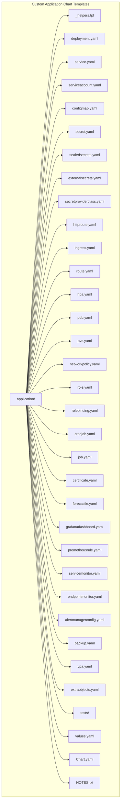
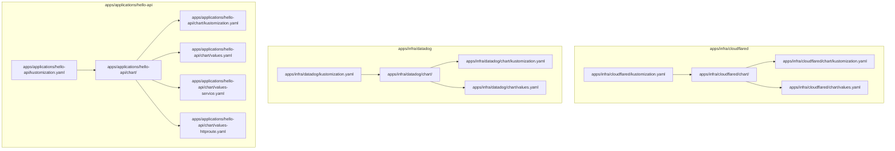
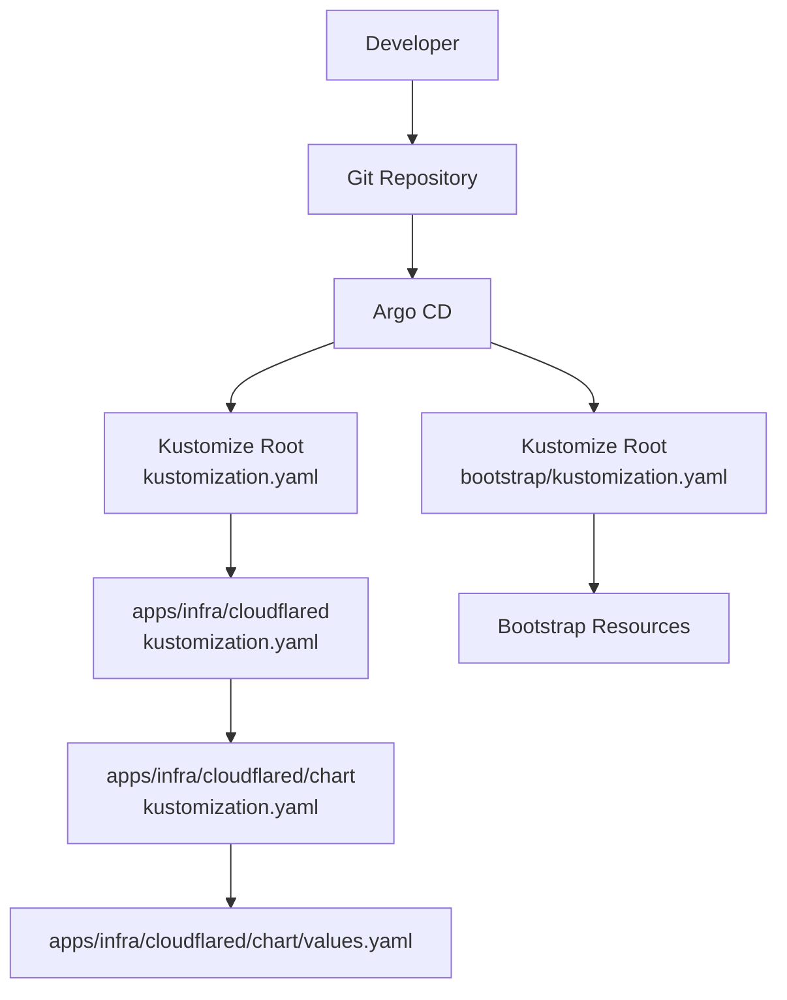
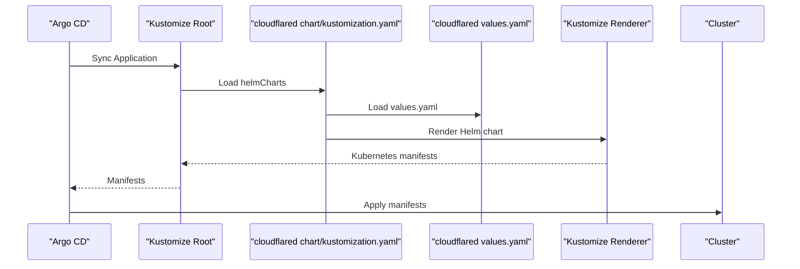
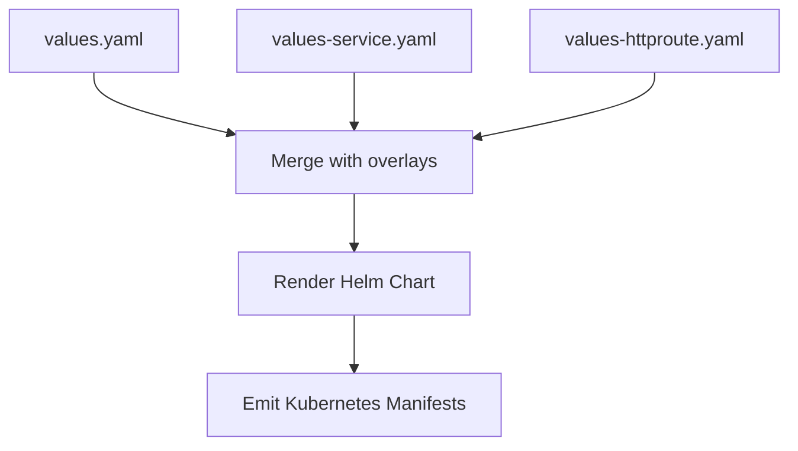
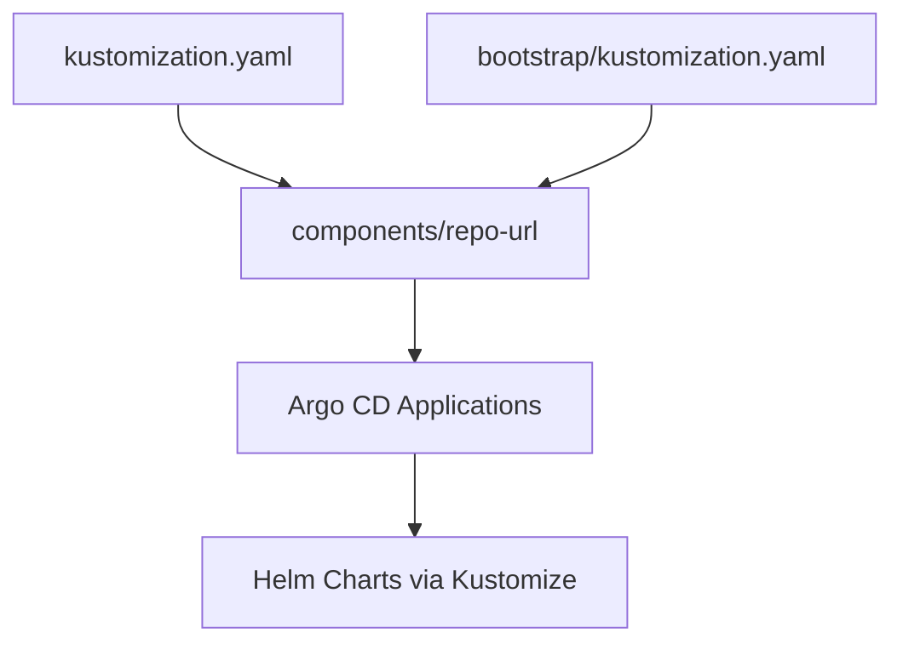

# Helm Chart Integration

<cite>
**Referenced Files in This Document**
- [guide/3. project_helm/README.md](file://guide/3. project_helm/README.md)
- [guide/3. project_helm/helm_application/README.md](file://guide/3. project_helm/helm_application/README.md)
- [guide/3. project_helm/helm_application/application/Chart.yaml](file://guide/3. project_helm/helm_application/application/Chart.yaml)
- [guide/3. project_helm/helm_application/application/values.yaml](file://guide/3. project_helm/helm_application/application/values.yaml)
- [guide/3. project_helm/helm_application/application/templates/deployment.yaml](file://guide/3. project_helm/helm_application/application/templates/deployment.yaml)
- [guide/3. project_helm/helm_application/application/templates/_helpers.tpl](file://guide/3. project_helm/helm_application/application/templates/_helpers.tpl)
- [guide/3. project_helm/helm_application/application/.helmignore](file://guide/3. project_helm/helm_application/application/.helmignore)
- [guide/3. project_helm/helm_application/Makefile](file://guide/3. project_helm/helm_application/Makefile)
- [guide/3. project_helm/helm_application/application/tests/deployment_test.yaml](file://guide/3. project_helm/helm_application/application/tests/deployment_test.yaml)
- [apps/infra/cloudflared/kustomization.yaml](file://apps/infra/cloudflared/kustomization.yaml)
- [apps/infra/cloudflared/chart/kustomization.yaml](file://apps/infra/cloudflared/chart/kustomization.yaml)
- [apps/infra/cloudflared/chart/values.yaml](file://apps/infra/cloudflared/chart/values.yaml)
- [apps/infra/datadog/kustomization.yaml](file://apps/infra/datadog/kustomization.yaml)
- [apps/infra/datadog/chart/kustomization.yaml](file://apps/infra/datadog/chart/kustomization.yaml)
- [apps/infra/datadog/chart/values.yaml](file://apps/infra/datadog/chart/values.yaml)
- [apps/applications/hello-api/kustomization.yaml](file://apps/applications/hello-api/kustomization.yaml)
- [apps/applications/hello-api/chart/kustomization.yaml](file://apps/applications/hello-api/chart/kustomization.yaml)
- [apps/applications/hello-api/chart/values.yaml](file://apps/applications/hello-api/chart/values.yaml)
- [apps/applications/hello-api/chart/values-service.yaml](file://apps/applications/hello-api/chart/values-service.yaml)
- [apps/applications/hello-api/chart/values-httproute.yaml](file://apps/applications/hello-api/chart/values-httproute.yaml)
- [apps/infra/argocd-ingress/chart/values.yaml](file://apps/infra/argocd-ingress/chart/values.yaml)
- [apps/infra/rancher/chart/values.yaml](file://apps/infra/rancher/chart/values.yaml)
- [bootstrap/kustomization.yaml](file://bootstrap/kustomization.yaml)
- [kustomization.yaml](file://kustomization.yaml)
</cite>

## Update Summary
**Changes Made**
- Added comprehensive documentation of the custom OCI Helm chart infrastructure
- Documented the 20+ template files in the custom application chart
- Added detailed build and publish workflow for the custom chart
- Enhanced integration patterns with Kustomize and Argo CD
- Included testing framework documentation and best practices

## Table of Contents
1. [Introduction](#introduction)
2. [Custom OCI Helm Chart Infrastructure](#custom-oci-helm-chart-infrastructure)
3. [Project Structure](#project-structure)
4. [Core Components](#core-components)
5. [Architecture Overview](#architecture-overview)
6. [Detailed Component Analysis](#detailed-component-analysis)
7. [Build and Publish Workflow](#build-and-publish-workflow)
8. [Testing Framework](#testing-framework)
9. [Dependency Analysis](#dependency-analysis)
10. [Performance Considerations](#performance-considerations)
11. [Troubleshooting Guide](#troubleshooting-guide)
12. [Conclusion](#conclusion)

## Introduction
This document explains how Helm charts are integrated into the Kustomize ecosystem and how Argo CD manages Helm-based releases. The repository now includes a comprehensive custom OCI Helm chart infrastructure built on the Stakater/application chart, providing standardized deployment patterns across multiple applications. It focuses on the --enable-helm flag behavior in Kustomize, the chart/ directory layout, and how Helm values are organized and customized per environment. It also covers how Helm releases map to Kubernetes resources managed by Argo CD, and provides practical examples from the repository for cloudflared, datadog, and cert-manager. Finally, it outlines environment-specific customization strategies and common troubleshooting steps.

## Custom OCI Helm Chart Infrastructure
The repository implements a custom OCI Helm chart that serves as the foundation for all application deployments. This chart is a fork of the Stakater/application generic Helm chart and is published as an OCI artifact at `oci://ghcr.io/hoangvu75/helm_application`.

### Chart Structure and Capabilities
The custom chart provides comprehensive Kubernetes resource management through 20+ template files covering:



**Diagram sources**
- [guide/3. project_helm/helm_application/README.md:13-51](file://guide/3. project_helm/helm_application/README.md#L13-L51)

**Section sources**
- [guide/3. project_helm/helm_application/README.md:11-51](file://guide/3. project_helm/helm_application/README.md#L11-L51)
- [guide/3. project_helm/helm_application/application/Chart.yaml:1-26](file://guide/3. project_helm/helm_application/application/Chart.yaml#L1-L26)

## Project Structure
The repository organizes chart-based applications under apps/<team>/<app>/ with a chart/ subdirectory containing Kustomize and Helm configuration. Each app's top-level kustomization.yaml references the chart resource, while chart/kustomization.yaml defines helmCharts entries that Kustomize processes to render manifests.



**Diagram sources**
- [apps/infra/cloudflared/kustomization.yaml:1-8](file://apps/infra/cloudflared/kustomization.yaml#L1-L8)
- [apps/infra/cloudflared/chart/kustomization.yaml:1-11](file://apps/infra/cloudflared/chart/kustomization.yaml#L1-L11)
- [apps/infra/cloudflared/chart/values.yaml:1-40](file://apps/infra/cloudflared/chart/values.yaml#L1-L40)
- [apps/infra/datadog/kustomization.yaml:1-8](file://apps/infra/datadog/kustomization.yaml#L1-L8)
- [apps/infra/datadog/chart/kustomization.yaml:1-11](file://apps/infra/datadog/chart/kustomization.yaml#L1-L11)
- [apps/infra/datadog/chart/values.yaml:1-89](file://apps/infra/datadog/chart/values.yaml#L1-L89)
- [apps/applications/hello-api/kustomization.yaml:1-8](file://apps/applications/hello-api/kustomization.yaml#L1-L8)
- [apps/applications/hello-api/chart/kustomization.yaml:1-14](file://apps/applications/hello-api/chart/kustomization.yaml#L1-L14)
- [apps/applications/hello-api/chart/values.yaml:1-23](file://apps/applications/hello-api/chart/values.yaml#L1-L23)
- [apps/applications/hello-api/chart/values-service.yaml:1-6](file://apps/applications/hello-api/chart/values-service.yaml#L1-L6)
- [apps/applications/hello-api/chart/values-httproute.yaml:1-26](file://apps/applications/hello-api/chart/values-httproute.yaml#L1-L26)

**Section sources**
- [apps/infra/cloudflared/kustomization.yaml:1-8](file://apps/infra/cloudflared/kustomization.yaml#L1-L8)
- [apps/infra/datadog/kustomization.yaml:1-8](file://apps/infra/datadog/kustomization.yaml#L1-L8)
- [apps/applications/hello-api/kustomization.yaml:1-8](file://apps/applications/hello-api/kustomization.yaml#L1-L8)

## Core Components
- **Custom OCI Helm Chart**: A comprehensive application chart providing 20+ template files for standardized Kubernetes resource management
- **Helm chart packaging via Kustomize**: Each chart/ directory contains a Kustomization that declares helmCharts with repository, release name, namespace, version, and values file(s)
- **Values management**: Values are stored in values.yaml and optionally split into environment-specific overlays (e.g., values-service.yaml, values-httproute.yaml)
- **Namespace scoping**: Helm release namespace is set per chart Kustomization and applied consistently across rendered resources
- **Argo CD integration**: Applications in Argo CD point to Kustomize roots that include chart resources; Argo CD delegates Helm rendering to Kustomize

### Custom Chart Features
The custom chart provides extensive capabilities including:
- **Workload Management**: Support for Deployments, StatefulSets, Jobs, and CronJobs
- **Service Exposure**: HTTPRoute, Ingress, and OpenShift Route support
- **Security**: RBAC, ServiceAccounts, Secrets, and SecretProviderClass integration
- **Monitoring**: ServiceMonitors, PrometheusRules, and GrafanaDashboards
- **Scaling**: HorizontalPodAutoscalers and VerticalPodAutoscalers
- **Networking**: NetworkPolicies, PodDisruptionBudgets, and PersistentVolumeClaims
- **Observability**: AlertmanagerConfig, EndpointMonitor, and Backup resources

**Section sources**
- [guide/3. project_helm/helm_application/README.md:31-416](file://guide/3. project_helm/helm_application/README.md#L31-L416)
- [guide/3. project_helm/helm_application/application/values.yaml:1-800](file://guide/3. project_helm/helm_application/application/values.yaml#L1-L800)
- [apps/infra/cloudflared/chart/kustomization.yaml:1-11](file://apps/infra/cloudflared/chart/kustomization.yaml#L1-L11)
- [apps/infra/cloudflared/chart/values.yaml:1-40](file://apps/infra/cloudflared/chart/values.yaml#L1-L40)
- [apps/infra/datadog/chart/kustomization.yaml:1-11](file://apps/infra/datadog/chart/kustomization.yaml#L1-L11)
- [apps/infra/datadog/chart/values.yaml:1-89](file://apps/infra/datadog/chart/values.yaml#L1-L89)
- [apps/applications/hello-api/chart/kustomization.yaml:1-14](file://apps/applications/hello-api/chart/kustomization.yaml#L1-L14)
- [apps/applications/hello-api/chart/values.yaml:1-23](file://apps/applications/hello-api/chart/values.yaml#L1-L23)
- [apps/applications/hello-api/chart/values-service.yaml:1-6](file://apps/applications/hello-api/chart/values-service.yaml#L1-L6)
- [apps/applications/hello-api/chart/values-httproute.yaml:1-26](file://apps/applications/hello-api/chart/values-httproute.yaml#L1-L26)

## Architecture Overview
Kustomize renders Helm charts declared in chart/kustomization.yaml and emits Kubernetes manifests consumed by Argo CD. The Argo CD Application or ApplicationSet selects the Kustomize root, which includes chart resources. Argo CD applies the resulting manifests to the cluster.



**Diagram sources**
- [kustomization.yaml:1-21](file://kustomization.yaml#L1-L21)
- [bootstrap/kustomization.yaml:1-38](file://bootstrap/kustomization.yaml#L1-L38)
- [apps/infra/cloudflared/kustomization.yaml:1-8](file://apps/infra/cloudflared/kustomization.yaml#L1-L8)
- [apps/infra/cloudflared/chart/kustomization.yaml:1-11](file://apps/infra/cloudflared/chart/kustomization.yaml#L1-L11)
- [apps/infra/cloudflared/chart/values.yaml:1-40](file://apps/infra/cloudflared/chart/values.yaml#L1-L40)

## Detailed Component Analysis

### Cloudflared Helm Integration
Cloudflared is packaged as a Helm chart and deployed into the cloudflared namespace. The chart Kustomization defines the upstream repository, release name, and values file. The values file configures deployment settings, image, probes, and environment injection from a secret.



**Diagram sources**
- [apps/infra/cloudflared/kustomization.yaml:1-8](file://apps/infra/cloudflared/kustomization.yaml#L1-L8)
- [apps/infra/cloudflared/chart/kustomization.yaml:1-11](file://apps/infra/cloudflared/chart/kustomization.yaml#L1-L11)
- [apps/infra/cloudflared/chart/values.yaml:1-40](file://apps/infra/cloudflared/chart/values.yaml#L1-L40)

**Section sources**
- [apps/infra/cloudflared/kustomization.yaml:1-8](file://apps/infra/cloudflared/kustomization.yaml#L1-L8)
- [apps/infra/cloudflared/chart/kustomization.yaml:1-11](file://apps/infra/cloudflared/chart/kustomization.yaml#L1-L11)
- [apps/infra/cloudflared/chart/values.yaml:1-40](file://apps/infra/cloudflared/chart/values.yaml#L1-L40)

### Datadog Helm Integration
Datadog is configured via a Helm chart with extensive monitoring features enabled. The values file sets API credentials, cluster name, site, and various agent components. The chart Kustomization specifies the official Datadog Helm repository and version.


**Diagram sources**
- [apps/infra/datadog/chart/kustomization.yaml:1-11](file://apps/infra/datadog/chart/kustomization.yaml#L1-L11)
- [apps/infra/datadog/chart/values.yaml:1-89](file://apps/infra/datadog/chart/values.yaml#L1-L89)

**Section sources**
- [apps/infra/datadog/kustomization.yaml:1-8](file://apps/infra/datadog/kustomization.yaml#L1-L8)
- [apps/infra/datadog/chart/kustomization.yaml:1-11](file://apps/infra/datadog/chart/kustomization.yaml#L1-L11)
- [apps/infra/datadog/chart/values.yaml:1-89](file://apps/infra/datadog/chart/values.yaml#L1-L89)

### Hello-api Helm Integration with Multiple Values Overlays
Hello-api demonstrates advanced Helm values customization using multiple overlay files. The base values define the deployment, while values-service.yaml and values-httproute.yaml add service and Gateway API HTTPRoute configurations. This enables environment-specific customizations without duplicating base settings.



**Diagram sources**
- [apps/applications/hello-api/chart/kustomization.yaml:1-14](file://apps/applications/hello-api/chart/kustomization.yaml#L1-L14)
- [apps/applications/hello-api/chart/values.yaml:1-23](file://apps/applications/hello-api/chart/values.yaml#L1-L23)
- [apps/applications/hello-api/chart/values-service.yaml:1-6](file://apps/applications/hello-api/chart/values-service.yaml#L1-L6)
- [apps/applications/hello-api/chart/values-httproute.yaml:1-26](file://apps/applications/hello-api/chart/values-httproute.yaml#L1-L26)

**Section sources**
- [apps/applications/hello-api/kustomization.yaml:1-8](file://apps/applications/hello-api/kustomization.yaml#L1-L8)
- [apps/applications/hello-api/chart/kustomization.yaml:1-14](file://apps/applications/hello-api/chart/kustomization.yaml#L1-L14)
- [apps/applications/hello-api/chart/values.yaml:1-23](file://apps/applications/hello-api/chart/values.yaml#L1-L23)
- [apps/applications/hello-api/chart/values-service.yaml:1-6](file://apps/applications/hello-api/chart/values-service.yaml#L1-L6)
- [apps/applications/hello-api/chart/values-httproute.yaml:1-26](file://apps/applications/hello-api/chart/values-httproute.yaml#L1-L26)

### Environment-Specific Customization Strategies
- **Single values file per environment**: Maintain separate values-<env>.yaml files and reference them via additionalValuesFiles in chart/kustomization.yaml
- **Feature toggles**: Use boolean flags in values.yaml to enable/disable components per environment
- **Secret injection**: Reference secrets via envFrom or secret keys in values.yaml to avoid committing sensitive data
- **Namespace isolation**: Set releaseNamespace per chart to prevent cross-environment interference

Examples present in:
- Hello-api with multiple overlays
- Argocd-ingress disabling deployment/service via values
- Rancher ingress disabled and bootstrap password set

**Section sources**
- [apps/applications/hello-api/chart/kustomization.yaml:1-14](file://apps/applications/hello-api/chart/kustomization.yaml#L1-L14)
- [apps/infra/argocd-ingress/chart/values.yaml:1-7](file://apps/infra/argocd-ingress/chart/values.yaml#L1-L7)
- [apps/infra/rancher/chart/values.yaml:1-9](file://apps/infra/rancher/chart/values.yaml#L1-L9)

## Build and Publish Workflow
The custom OCI Helm chart follows a structured build and publish workflow:

### Development Process
1. **Edit Templates and Values**: Modify files in `helm_application/application/`
2. **Run Tests**: Execute Helm unittest suite for validation
3. **Build and Push**: Package and publish to OCI registry
4. **Update References**: Bump version in consuming applications

### Build Commands
```bash
# Install development dependencies
make install-hooks

# Run tests
cd helm_application/application
helm unittest .

# Build chart
helm package application/

# Publish to OCI registry
helm push application-6.16.1.tgz oci://ghcr.io/hoangvu75/helm_application

# Bump chart version
make bump-chart VERSION=6.16.1
```

### Chart Configuration
The chart uses `.helmignore` to exclude development files and includes comprehensive documentation generation through `helm-docs-built`.

**Section sources**
- [guide/3. project_helm/README.md:131-145](file://guide/3. project_helm/README.md#L131-L145)
- [guide/3. project_helm/helm_application/Makefile:1-15](file://guide/3. project_helm/helm_application/Makefile#L1-L15)
- [guide/3. project_helm/helm_application/application/.helmignore:1-7](file://guide/3. project_helm/helm_application/application/.helmignore#L1-L7)

## Testing Framework
The custom chart includes a comprehensive testing framework using Helm unittest:

### Test Categories
- **Deployment Tests**: Validate container configuration, image handling, and service account management
- **Template Rendering**: Test conditional template rendering and value processing
- **Resource Generation**: Verify proper Kubernetes resource generation

### Test Examples
The deployment test suite validates critical functionality:
- OAuth proxy container inclusion/exclusion
- Image repository/tag/digest handling
- Service account name resolution
- Probe configuration validation
- Environment variable injection

**Section sources**
- [guide/3. project_helm/helm_application/application/tests/deployment_test.yaml:1-281](file://guide/3. project_helm/helm_application/application/tests/deployment_test.yaml#L1-L281)

## Dependency Analysis
Kustomize depends on Helm repositories and chart versions defined in chart/kustomization.yaml. The top-level kustomization.yaml and bootstrap/kustomization.yaml coordinate Argo CD Application selection and repository URL replacement.



**Diagram sources**
- [kustomization.yaml:1-21](file://kustomization.yaml#L1-L21)
- [bootstrap/kustomization.yaml:1-38](file://bootstrap/kustomization.yaml#L1-L38)

**Section sources**
- [kustomization.yaml:1-21](file://kustomization.yaml#L1-L21)
- [bootstrap/kustomization.yaml:1-38](file://bootstrap/kustomization.yaml#L1-L38)

## Performance Considerations
- **Limit overlay proliferation**: Prefer a small number of focused overlays to reduce merge complexity
- **Pin chart versions**: Specify exact versions in chart/kustomization.yaml to avoid unexpected upgrades
- **Minimize probe overhead**: Disable unnecessary probes in production-like environments via values
- **Consolidate resources**: Keep related resources (e.g., HTTPRoute) close to the application chart to simplify sync waves
- **OCI Registry Optimization**: Leverage OCI registry caching for faster chart pulls in CI/CD pipelines

## Troubleshooting Guide
Common Helm-related deployment issues and resolutions:

### Helm Repository Connectivity Errors
- Verify chart.repo URLs and network access from the Argo CD server
- Confirm chart version exists and is reachable
- Check OCI registry authentication and network policies

### Values Merge Conflicts
- Inspect additionalValuesFiles ordering and overlapping keys
- Validate YAML syntax and indentation
- Use `helm get values <release>` to debug effective values

### Namespace Mismatch Issues
- Ensure releaseNamespace in chart/kustomization.yaml matches the target namespace
- Check Argo CD destination namespace alignment
- Verify namespace-scoped vs cluster-scoped resource placement

### Secret and Configuration Management
- Confirm referenced secret names in values.yaml exist in the target namespace
- Validate envFrom and secretKeyRef references
- Check SecretProviderClass and ExternalSecret configurations for CSI integration

### Gateway API and HTTPRoute Problems
- Check that Gateway API CRDs are installed and routes are annotated appropriately
- Confirm parentRefs match existing Gateway names and namespaces
- Validate HTTPRoute rules and backend references

### Custom Chart Specific Issues
- **Template Rendering Failures**: Use `helm template . --debug` to troubleshoot template issues
- **Missing Helper Functions**: Ensure `_helpers.tpl` is properly included in templates
- **Version Compatibility**: Verify custom chart version compatibility with Argo CD and Kustomize versions

### Debugging Steps
- Dry-run Kustomize rendering locally to inspect generated manifests
- Review Argo CD logs for Helm and Kustomize errors
- Temporarily disable optional components (e.g., probes, extra overlays) to isolate issues
- Use `kubectl get all -o yaml` to capture actual cluster state for comparison

**Section sources**
- [apps/applications/hello-api/chart/kustomization.yaml:1-14](file://apps/applications/hello-api/chart/kustomization.yaml#L1-L14)
- [apps/applications/hello-api/chart/values-httproute.yaml:1-26](file://apps/applications/hello-api/chart/values-httproute.yaml#L1-L26)
- [apps/infra/datadog/chart/kustomization.yaml:1-11](file://apps/infra/datadog/chart/kustomization.yaml#L1-L11)

## Conclusion
By structuring Helm charts within chart/ directories and declaring helmCharts in Kustomize, this repository achieves a clean GitOps workflow. The introduction of the comprehensive custom OCI Helm chart infrastructure provides standardized deployment patterns across multiple applications, while the detailed testing framework ensures reliability and consistency. Argo CD consumes Kustomize-rendered manifests from chart-based applications, enabling robust, declarative management of Helm releases. The examples demonstrate scalable patterns for values management, environment customization, and integration with Gateway API resources. The documented build and publish workflow, combined with comprehensive troubleshooting guidance, provides a solid foundation for maintaining and extending the Helm chart ecosystem.