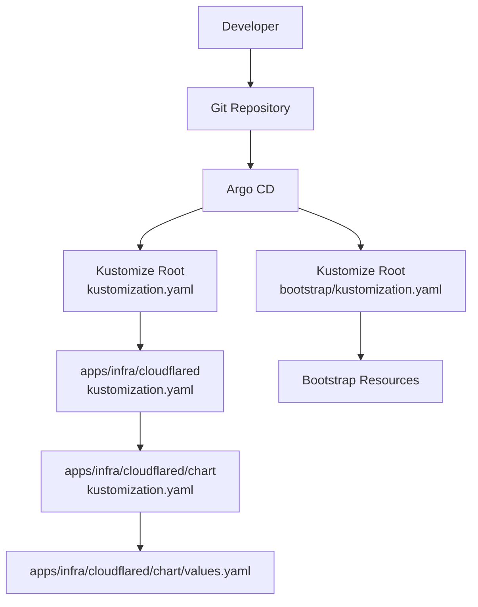
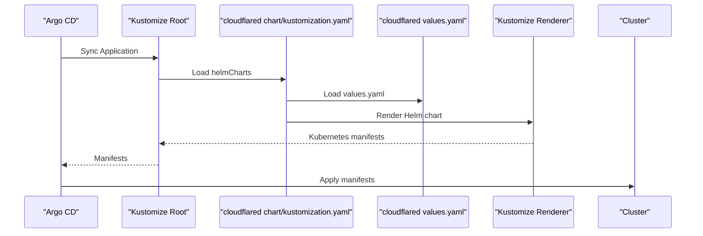
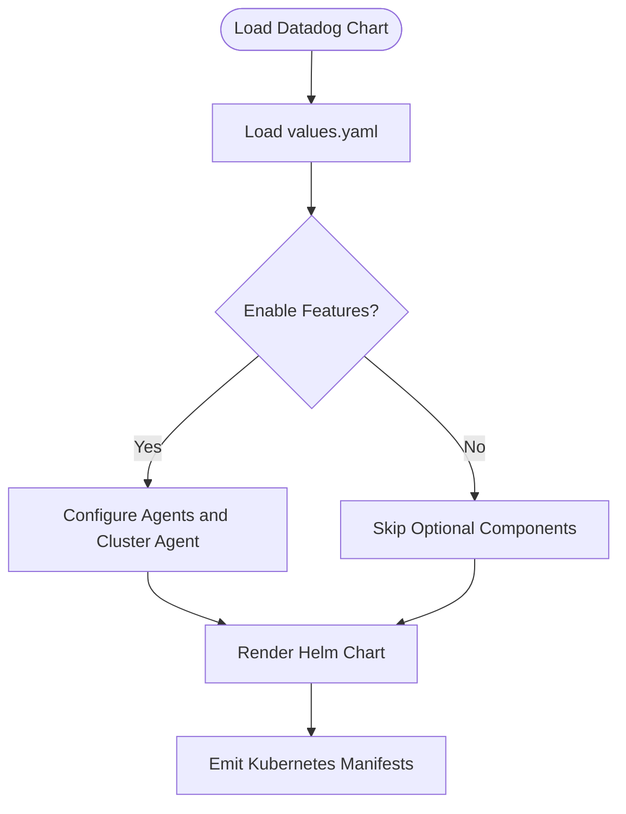
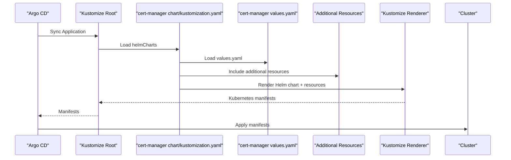
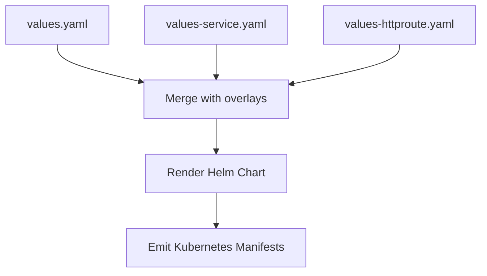
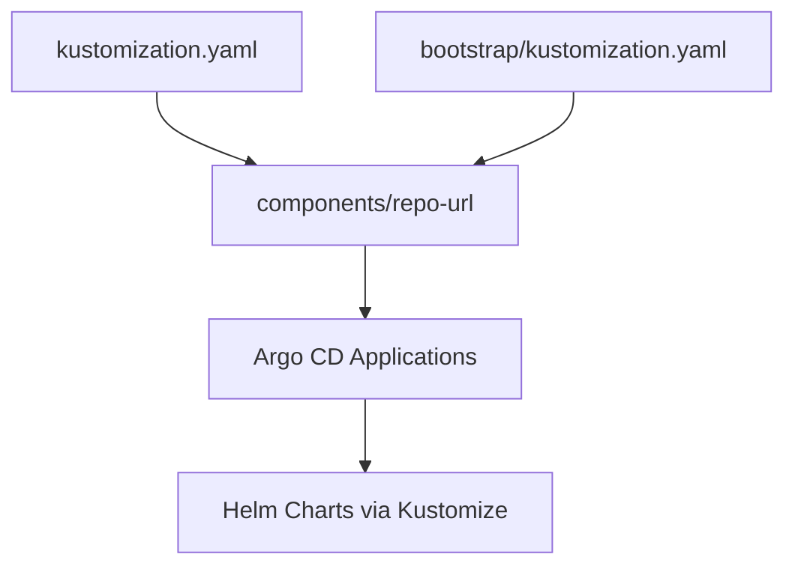

# Helm Chart Integration

<cite>
**Referenced Files in This Document**
- [apps/infra/cloudflared/kustomization.yaml](file://apps/infra/cloudflared/kustomization.yaml)
- [apps/infra/cloudflared/chart/kustomization.yaml](file://apps/infra/cloudflared/chart/kustomization.yaml)
- [apps/infra/cloudflared/chart/values.yaml](file://apps/infra/cloudflared/chart/values.yaml)
- [apps/infra/datadog/kustomization.yaml](file://apps/infra/datadog/kustomization.yaml)
- [apps/infra/datadog/chart/kustomization.yaml](file://apps/infra/datadog/chart/kustomization.yaml)
- [apps/infra/datadog/chart/values.yaml](file://apps/infra/datadog/chart/values.yaml)
- [apps/playground/cert-manager/kustomization.yaml](file://apps/playground/cert-manager/kustomization.yaml)
- [apps/playground/cert-manager/chart/kustomization.yaml](file://apps/playground/cert-manager/chart/kustomization.yaml)
- [apps/playground/cert-manager/chart/values.yaml](file://apps/playground/cert-manager/chart/values.yaml)
- [apps/playground/hello-api/kustomization.yaml](file://apps/playground/hello-api/kustomization.yaml)
- [apps/playground/hello-api/chart/kustomization.yaml](file://apps/playground/hello-api/chart/kustomization.yaml)
- [apps/playground/hello-api/chart/values.yaml](file://apps/playground/hello-api/chart/values.yaml)
- [apps/playground/hello-api/chart/values-service.yaml](file://apps/playground/hello-api/chart/values-service.yaml)
- [apps/playground/hello-api/chart/values-httproute.yaml](file://apps/playground/hello-api/chart/values-httproute.yaml)
- [apps/playground/argocd-ingress/chart/values.yaml](file://apps/playground/argocd-ingress/chart/values.yaml)
- [apps/playground/rancher/chart/values.yaml](file://apps/playground/rancher/chart/values.yaml)
- [bootstrap/kustomization.yaml](file://bootstrap/kustomization.yaml)
- [kustomization.yaml](file://kustomization.yaml)
</cite>

## Table of Contents
1. [Introduction](#introduction)
2. [Project Structure](#project-structure)
3. [Core Components](#core-components)
4. [Architecture Overview](#architecture-overview)
5. [Detailed Component Analysis](#detailed-component-analysis)
6. [Dependency Analysis](#dependency-analysis)
7. [Performance Considerations](#performance-considerations)
8. [Troubleshooting Guide](#troubleshooting-guide)
9. [Conclusion](#conclusion)

## Introduction
This document explains how Helm charts are integrated into the Kustomize ecosystem and how Argo CD manages Helm-based releases. It focuses on the --enable-helm flag behavior in Kustomize, the chart/ directory layout, and how Helm values are organized and customized per environment. It also covers how Helm releases map to Kubernetes resources managed by Argo CD, and provides practical examples from the repository for cloudflared, datadog, and cert-manager. Finally, it outlines environment-specific customization strategies and common troubleshooting steps.

## Project Structure

```mermaid
graph TB
subgraph "apps/infra/cloudflared"
cf_k["apps/infra/cloudflared/kustomization.yaml"]
cf_chart["apps/infra/cloudflared/chart/"]
cf_helm["apps/infra/cloudflared/chart/kustomization.yaml"]
cf_vals["apps/infra/cloudflared/chart/values.yaml"]
cf_k --> cf_chart
cf_chart --> cf_helm
cf_chart --> cf_vals
end
subgraph "apps/infra/datadog"
dd_k["apps/infra/datadog/kustomization.yaml"]
dd_chart["apps/infra/datadog/chart/"]
dd_helm["apps/infra/datadog/chart/kustomization.yaml"]
dd_vals["apps/infra/datadog/chart/values.yaml"]
dd_k --> dd_chart
dd_chart --> dd_helm
dd_chart --> dd_vals
end
subgraph "apps/playground/cert-manager"
cm_k["apps/playground/cert-manager/kustomization.yaml"]
cm_chart["apps/playground/cert-manager/chart/"]
cm_helm["apps/playground/cert-manager/chart/kustomization.yaml"]
cm_vals["apps/playground/cert-manager/chart/values.yaml"]
cm_k --> cm_chart
cm_chart --> cm_helm
cm_chart --> cm_vals
end
subgraph "apps/playground/hello-api"
ha_k["apps/playground/hello-api/kustomization.yaml"]
ha_chart["apps/playground/hello-api/chart/"]
ha_helm["apps/playground/hello-api/chart/kustomization.yaml"]
ha_vals["apps/playground/hello-api/chart/values.yaml"]
ha_vs["apps/playground/hello-api/chart/values-service.yaml"]
ha_vhr["apps/playground/hello-api/chart/values-httproute.yaml"]
ha_k --> ha_chart
ha_chart --> ha_helm
ha_chart --> ha_vals
ha_chart --> ha_vs
ha_chart --> ha_vhr
end
```

The repository organizes chart-based applications under apps/<team>/<app>/ with a chart/ subdirectory containing Kustomize and Helm configuration. Each app’s top-level kustomization.yaml references the chart resource, while chart/kustomization.yaml defines helmCharts entries that Kustomize processes to render manifests.

**Diagram sources**
- [apps/infra/cloudflared/kustomization.yaml:1-8](file://apps/infra/cloudflared/kustomization.yaml#L1-L8)
- [apps/infra/cloudflared/chart/kustomization.yaml:1-11](file://apps/infra/cloudflared/chart/kustomization.yaml#L1-L11)
- [apps/infra/cloudflared/chart/values.yaml:1-40](file://apps/infra/cloudflared/chart/values.yaml#L1-L40)
- [apps/infra/datadog/kustomization.yaml:1-8](file://apps/infra/datadog/kustomization.yaml#L1-L8)
- [apps/infra/datadog/chart/kustomization.yaml:1-11](file://apps/infra/datadog/chart/kustomization.yaml#L1-L11)
- [apps/infra/datadog/chart/values.yaml:1-89](file://apps/infra/datadog/chart/values.yaml#L1-L89)
- [apps/playground/cert-manager/kustomization.yaml:1-6](file://apps/playground/cert-manager/kustomization.yaml#L1-L6)
- [apps/playground/cert-manager/chart/kustomization.yaml:1-13](file://apps/playground/cert-manager/chart/kustomization.yaml#L1-L13)
- [apps/playground/cert-manager/chart/values.yaml:1-6](file://apps/playground/cert-manager/chart/values.yaml#L1-L6)
- [apps/playground/hello-api/kustomization.yaml:1-8](file://apps/playground/hello-api/kustomization.yaml#L1-L8)
- [apps/playground/hello-api/chart/kustomization.yaml:1-14](file://apps/playground/hello-api/chart/kustomization.yaml#L1-L14)
- [apps/playground/hello-api/chart/values.yaml:1-23](file://apps/playground/hello-api/chart/values.yaml#L1-L23)
- [apps/playground/hello-api/chart/values-service.yaml:1-6](file://apps/playground/hello-api/chart/values-service.yaml#L1-L6)
- [apps/playground/hello-api/chart/values-httproute.yaml:1-26](file://apps/playground/hello-api/chart/values-httproute.yaml#L1-L26)

**Section sources**
- [apps/infra/cloudflared/kustomization.yaml:1-8](file://apps/infra/cloudflared/kustomization.yaml#L1-L8)
- [apps/infra/datadog/kustomization.yaml:1-8](file://apps/infra/datadog/kustomization.yaml#L1-L8)
- [apps/playground/cert-manager/kustomization.yaml:1-6](file://apps/playground/cert-manager/kustomization.yaml#L1-L6)
- [apps/playground/hello-api/kustomization.yaml:1-8](file://apps/playground/hello-api/kustomization.yaml#L1-L8)

## Core Components
- Helm chart packaging via Kustomize: Each chart/ directory contains a Kustomization that declares helmCharts with repository, release name, namespace, version, and values file(s).
- Values management: Values are stored in values.yaml and optionally split into environment-specific overlays (e.g., values-service.yaml, values-httproute.yaml).
- Namespace scoping: Helm release namespace is set per chart Kustomization and applied consistently across rendered resources.
- Argo CD integration: Applications in Argo CD point to Kustomize roots that include chart resources; Argo CD delegates Helm rendering to Kustomize.

Key implementation references:
- Cloudflared Helm chart definition and values
- Datadog Helm chart definition and values
- Cert-manager Helm chart definition and values
- Hello-api Helm chart with multiple values overlays

**Section sources**
- [apps/infra/cloudflared/chart/kustomization.yaml:1-11](file://apps/infra/cloudflared/chart/kustomization.yaml#L1-L11)
- [apps/infra/cloudflared/chart/values.yaml:1-40](file://apps/infra/cloudflared/chart/values.yaml#L1-L40)
- [apps/infra/datadog/chart/kustomization.yaml:1-11](file://apps/infra/datadog/chart/kustomization.yaml#L1-L11)
- [apps/infra/datadog/chart/values.yaml:1-89](file://apps/infra/datadog/chart/values.yaml#L1-L89)
- [apps/playground/cert-manager/chart/kustomization.yaml:1-13](file://apps/playground/cert-manager/chart/kustomization.yaml#L1-L13)
- [apps/playground/cert-manager/chart/values.yaml:1-6](file://apps/playground/cert-manager/chart/values.yaml#L1-L6)
- [apps/playground/hello-api/chart/kustomization.yaml:1-14](file://apps/playground/hello-api/chart/kustomization.yaml#L1-L14)
- [apps/playground/hello-api/chart/values.yaml:1-23](file://apps/playground/hello-api/chart/values.yaml#L1-L23)
- [apps/playground/hello-api/chart/values-service.yaml:1-6](file://apps/playground/hello-api/chart/values-service.yaml#L1-L6)
- [apps/playground/hello-api/chart/values-httproute.yaml:1-26](file://apps/playground/hello-api/chart/values-httproute.yaml#L1-L26)

## Architecture Overview
Kustomize renders Helm charts declared in chart/kustomization.yaml and emits Kubernetes manifests consumed by Argo CD. The Argo CD Application or ApplicationSet selects the Kustomize root, which includes chart resources. Argo CD applies the resulting manifests to the cluster.

**Diagram sources**
- [kustomization.yaml:1-21](file://kustomization.yaml#L1-L21)
- [bootstrap/kustomization.yaml:1-38](file://bootstrap/kustomization.yaml#L1-L38)
- [apps/infra/cloudflared/kustomization.yaml:1-8](file://apps/infra/cloudflared/kustomization.yaml#L1-L8)
- [apps/infra/cloudflared/chart/kustomization.yaml:1-11](file://apps/infra/cloudflared/chart/kustomization.yaml#L1-L11)
- [apps/infra/cloudflared/chart/values.yaml:1-40](file://apps/infra/cloudflared/chart/values.yaml#L1-L40)

## Detailed Component Analysis

### Cloudflared Helm Integration
Cloudflared is packaged as a Helm chart and deployed into the cloudflared namespace. The chart Kustomization defines the upstream repository, release name, and values file. The values file configures deployment settings, image, probes, and environment injection from a secret.

**Diagram sources**
- [apps/infra/cloudflared/kustomization.yaml:1-8](file://apps/infra/cloudflared/kustomization.yaml#L1-L8)
- [apps/infra/cloudflared/chart/kustomization.yaml:1-11](file://apps/infra/cloudflared/chart/kustomization.yaml#L1-L11)
- [apps/infra/cloudflared/chart/values.yaml:1-40](file://apps/infra/cloudflared/chart/values.yaml#L1-L40)

**Section sources**
- [apps/infra/cloudflared/kustomization.yaml:1-8](file://apps/infra/cloudflared/kustomization.yaml#L1-L8)
- [apps/infra/cloudflared/chart/kustomization.yaml:1-11](file://apps/infra/cloudflared/chart/kustomization.yaml#L1-L11)
- [apps/infra/cloudflared/chart/values.yaml:1-40](file://apps/infra/cloudflared/chart/values.yaml#L1-L40)

### Datadog Helm Integration
Datadog is configured via a Helm chart with extensive monitoring features enabled. The values file sets API credentials, cluster name, site, and various agent components. The chart Kustomization specifies the official Datadog Helm repository and version.

**Diagram sources**
- [apps/infra/datadog/chart/kustomization.yaml:1-11](file://apps/infra/datadog/chart/kustomization.yaml#L1-L11)
- [apps/infra/datadog/chart/values.yaml:1-89](file://apps/infra/datadog/chart/values.yaml#L1-L89)

**Section sources**
- [apps/infra/datadog/kustomization.yaml:1-8](file://apps/infra/datadog/kustomization.yaml#L1-L8)
- [apps/infra/datadog/chart/kustomization.yaml:1-11](file://apps/infra/datadog/chart/kustomization.yaml#L1-L11)
- [apps/infra/datadog/chart/values.yaml:1-89](file://apps/infra/datadog/chart/values.yaml#L1-L89)

### Cert-manager Helm Integration
Cert-manager is installed via a Helm chart with CRD installation enabled and a dedicated namespace. Additional resources (e.g., TLS CA) are included alongside the Helm release.

**Diagram sources**
- [apps/playground/cert-manager/kustomization.yaml:1-6](file://apps/playground/cert-manager/kustomization.yaml#L1-L6)
- [apps/playground/cert-manager/chart/kustomization.yaml:1-13](file://apps/playground/cert-manager/chart/kustomization.yaml#L1-L13)
- [apps/playground/cert-manager/chart/values.yaml:1-6](file://apps/playground/cert-manager/chart/values.yaml#L1-L6)

**Section sources**
- [apps/playground/cert-manager/kustomization.yaml:1-6](file://apps/playground/cert-manager/kustomization.yaml#L1-L6)
- [apps/playground/cert-manager/chart/kustomization.yaml:1-13](file://apps/playground/cert-manager/chart/kustomization.yaml#L1-L13)
- [apps/playground/cert-manager/chart/values.yaml:1-6](file://apps/playground/cert-manager/chart/values.yaml#L1-L6)

### Hello-api Helm Integration with Multiple Values Overlays
Hello-api demonstrates advanced Helm values customization using multiple overlay files. The base values define the deployment, while values-service.yaml and values-httproute.yaml add service and Gateway API HTTPRoute configurations. This enables environment-specific customizations without duplicating base settings.

**Diagram sources**
- [apps/playground/hello-api/chart/kustomization.yaml:1-14](file://apps/playground/hello-api/chart/kustomization.yaml#L1-L14)
- [apps/playground/hello-api/chart/values.yaml:1-23](file://apps/playground/hello-api/chart/values.yaml#L1-L23)
- [apps/playground/hello-api/chart/values-service.yaml:1-6](file://apps/playground/hello-api/chart/values-service.yaml#L1-L6)
- [apps/playground/hello-api/chart/values-httproute.yaml:1-26](file://apps/playground/hello-api/chart/values-httproute.yaml#L1-L26)

**Section sources**
- [apps/playground/hello-api/kustomization.yaml:1-8](file://apps/playground/hello-api/kustomization.yaml#L1-L8)
- [apps/playground/hello-api/chart/kustomization.yaml:1-14](file://apps/playground/hello-api/chart/kustomization.yaml#L1-L14)
- [apps/playground/hello-api/chart/values.yaml:1-23](file://apps/playground/hello-api/chart/values.yaml#L1-L23)
- [apps/playground/hello-api/chart/values-service.yaml:1-6](file://apps/playground/hello-api/chart/values-service.yaml#L1-L6)
- [apps/playground/hello-api/chart/values-httproute.yaml:1-26](file://apps/playground/hello-api/chart/values-httproute.yaml#L1-L26)

### Environment-Specific Customization Strategies
- Single values file per environment: Maintain separate values-<env>.yaml files and reference them via additionalValuesFiles in chart/kustomization.yaml.
- Feature toggles: Use boolean flags in values.yaml to enable/disable components per environment.
- Secret injection: Reference secrets via envFrom or secret keys in values.yaml to avoid committing sensitive data.
- Namespace isolation: Set releaseNamespace per chart to prevent cross-environment interference.

Examples present in:
- Hello-api with multiple overlays
- Argocd-ingress disabling deployment/service via values
- Rancher ingress disabled and bootstrap password set

**Section sources**
- [apps/playground/hello-api/chart/kustomization.yaml:1-14](file://apps/playground/hello-api/chart/kustomization.yaml#L1-L14)
- [apps/playground/argocd-ingress/chart/values.yaml:1-7](file://apps/playground/argocd-ingress/chart/values.yaml#L1-L7)
- [apps/playground/rancher/chart/values.yaml:1-9](file://apps/playground/rancher/chart/values.yaml#L1-L9)

## Dependency Analysis
Kustomize depends on Helm repositories and chart versions defined in chart/kustomization.yaml. The top-level kustomization.yaml and bootstrap/kustomization.yaml coordinate Argo CD Application selection and repository URL replacement.

**Diagram sources**
- [kustomization.yaml:1-21](file://kustomization.yaml#L1-L21)
- [bootstrap/kustomization.yaml:1-38](file://bootstrap/kustomization.yaml#L1-L38)

**Section sources**
- [kustomization.yaml:1-21](file://kustomization.yaml#L1-L21)
- [bootstrap/kustomization.yaml:1-38](file://bootstrap/kustomization.yaml#L1-L38)

## Performance Considerations
- Limit overlay proliferation: Prefer a small number of focused overlays to reduce merge complexity.
- Pin chart versions: Specify exact versions in chart/kustomization.yaml to avoid unexpected upgrades.
- Minimize probe overhead: Disable unnecessary probes in production-like environments via values.
- Consolidate resources: Keep related resources (e.g., HTTPRoute) close to the application chart to simplify sync waves.

## Troubleshooting Guide
Common Helm-related deployment issues and resolutions:

- Helm repository connectivity errors
  - Verify chart.repo URLs and network access from the Argo CD server.
  - Confirm chart version exists and is reachable.

- Values merge conflicts
  - Inspect additionalValuesFiles ordering and overlapping keys.
  - Validate YAML syntax and indentation.

- Namespace mismatch
  - Ensure releaseNamespace in chart/kustomization.yaml matches the target namespace.
  - Check Argo CD destination namespace alignment.

- Missing secrets or configmaps
  - Confirm referenced secret names in values.yaml exist in the target namespace.
  - Validate envFrom and secretKeyRef references.

- HTTPRoute or Gateway API not applied
  - Check that Gateway API CRDs are installed and routes are annotated appropriately.
  - Confirm parentRefs match existing Gateway names and namespaces.

- Debugging steps
  - Dry-run Kustomize rendering locally to inspect generated manifests.
  - Review Argo CD logs for Helm and Kustomize errors.
  - Temporarily disable optional components (e.g., probes, extra overlays) to isolate issues.

**Section sources**
- [apps/playground/hello-api/chart/kustomization.yaml:1-14](file://apps/playground/hello-api/chart/kustomization.yaml#L1-L14)
- [apps/playground/hello-api/chart/values-httproute.yaml:1-26](file://apps/playground/hello-api/chart/values-httproute.yaml#L1-L26)
- [apps/playground/cert-manager/chart/kustomization.yaml:1-13](file://apps/playground/cert-manager/chart/kustomization.yaml#L1-L13)

## Conclusion
By structuring Helm charts within chart/ directories and declaring helmCharts in Kustomize, this repository achieves a clean GitOps workflow. Argo CD consumes Kustomize-rendered manifests from chart-based applications, enabling robust, declarative management of Helm releases. The examples demonstrate scalable patterns for values management, environment customization, and integration with Gateway API resources.