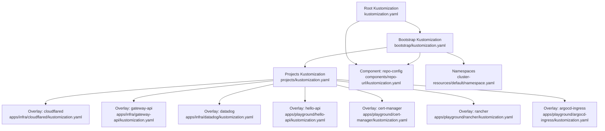
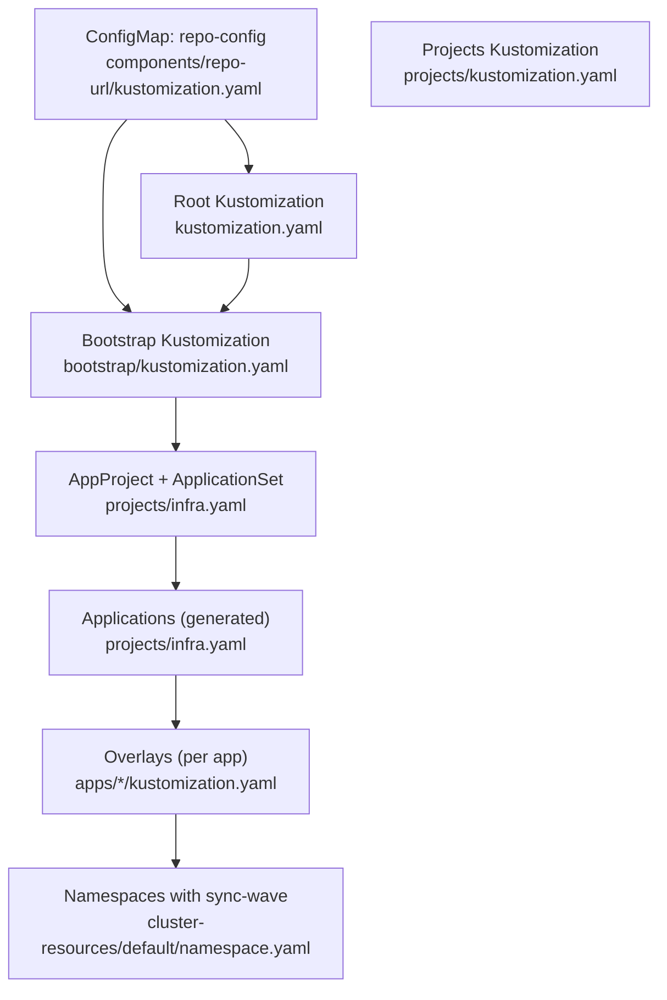
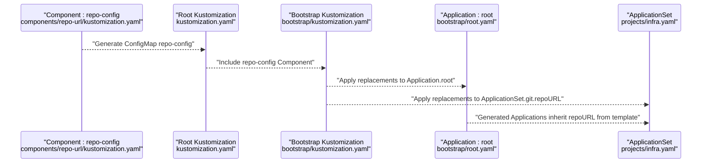
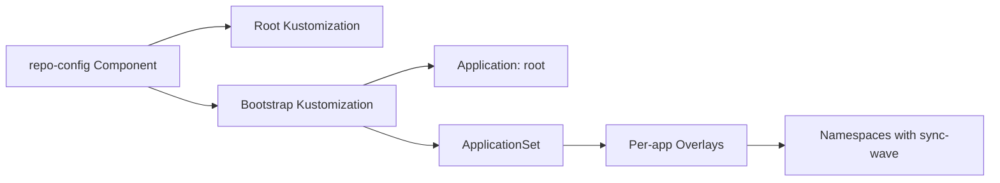

# Kustomize Configuration Patterns

<cite>
**Referenced Files in This Document**
- [kustomization.yaml](file://kustomization.yaml)
- [bootstrap/kustomization.yaml](file://bootstrap/kustomization.yaml)
- [components/repo-url/kustomization.yaml](file://components/repo-url/kustomization.yaml)
- [cluster-resources/default/namespace.yaml](file://cluster-resources/default/namespace.yaml)
- [apps/infra/cloudflared/kustomization.yaml](file://apps/infra/cloudflared/kustomization.yaml)
- [apps/infra/gateway-api/kustomization.yaml](file://apps/infra/gateway-api/kustomization.yaml)
- [apps/playground/hello-api/kustomization.yaml](file://apps/playground/hello-api/kustomization.yaml)
- [apps/playground/cert-manager/kustomization.yaml](file://apps/playground/cert-manager/kustomization.yaml)
- [apps/infra/datadog/kustomization.yaml](file://apps/infra/datadog/kustomization.yaml)
- [apps/playground/rancher/kustomization.yaml](file://apps/playground/rancher/kustomization.yaml)
- [apps/playground/argocd-ingress/kustomization.yaml](file://apps/playground/argocd-ingress/kustomization.yaml)
- [projects/kustomization.yaml](file://projects/kustomization.yaml)
- [projects/infra.yaml](file://projects/infra.yaml)
- [bootstrap/root.yaml](file://bootstrap/root.yaml)
- [bootstrap/secrets.yaml](file://bootstrap/secrets.yaml)
</cite>

## Table of Contents
1. [Introduction](#introduction)
2. [Project Structure](#project-structure)
3. [Core Components](#core-components)
4. [Architecture Overview](#architecture-overview)
5. [Detailed Component Analysis](#detailed-component-analysis)
6. [Dependency Analysis](#dependency-analysis)
7. [Performance Considerations](#performance-considerations)
8. [Troubleshooting Guide](#troubleshooting-guide)
9. [Conclusion](#conclusion)

## Introduction
This document explains the Kustomize configuration patterns used across the application layer. It focuses on how kustomization.yaml files define namespaces, resources, and component inheritance; how base configurations relate to environment-specific customizations; and how overlays and shared components are referenced. It also covers resource inclusion patterns, overlay strategies, namespace management, resource ordering via annotations, and how Kustomize merges multiple layers into final manifests. Finally, it documents common Kustomize patterns such as replacements, images, and variables.

## Project Structure
The repository organizes Kustomize layers as follows:
- Root Kustomization defines shared components and top-level replacements.
- Bootstrap layer composes foundational resources and applies replacements to Argo CD Applications.
- Projects layer defines Argo CD AppProjects and ApplicationSets that drive per-environment deployments.
- Apps layer contains environment-specific overlays under infra and playground, each setting a namespace and referencing Helm charts.
- Components encapsulate reusable configuration (e.g., a repo-config ConfigMap generator).
- Cluster resources define Namespaces with Argo CD sync-wave annotations to enforce ordering.

**Diagram sources**
- [kustomization.yaml:1-21](file://kustomization.yaml#L1-L21)
- [bootstrap/kustomization.yaml:1-38](file://bootstrap/kustomization.yaml#L1-L38)
- [projects/kustomization.yaml:1-22](file://projects/kustomization.yaml#L1-L22)
- [components/repo-url/kustomization.yaml:1-11](file://components/repo-url/kustomization.yaml#L1-L11)
- [cluster-resources/default/namespace.yaml:1-52](file://cluster-resources/default/namespace.yaml#L1-L52)
- [apps/infra/cloudflared/kustomization.yaml:1-8](file://apps/infra/cloudflared/kustomization.yaml#L1-L8)
- [apps/infra/gateway-api/kustomization.yaml:1-9](file://apps/infra/gateway-api/kustomization.yaml#L1-L9)
- [apps/infra/datadog/kustomization.yaml:1-8](file://apps/infra/datadog/kustomization.yaml#L1-L8)
- [apps/playground/hello-api/kustomization.yaml:1-8](file://apps/playground/hello-api/kustomization.yaml#L1-L8)
- [apps/playground/cert-manager/kustomization.yaml:1-6](file://apps/playground/cert-manager/kustomization.yaml#L1-L6)
- [apps/playground/rancher/kustomization.yaml:1-9](file://apps/playground/rancher/kustomization.yaml#L1-L9)
- [apps/playground/argocd-ingress/kustomization.yaml:1-9](file://apps/playground/argocd-ingress/kustomization.yaml#L1-L9)

**Section sources**
- [kustomization.yaml:1-21](file://kustomization.yaml#L1-L21)
- [bootstrap/kustomization.yaml:1-38](file://bootstrap/kustomization.yaml#L1-L38)
- [projects/kustomization.yaml:1-22](file://projects/kustomization.yaml#L1-L22)
- [components/repo-url/kustomization.yaml:1-11](file://components/repo-url/kustomization.yaml#L1-L11)
- [cluster-resources/default/namespace.yaml:1-52](file://cluster-resources/default/namespace.yaml#L1-L52)

## Core Components
- Shared Component: A Component generates a ConfigMap named repo-config with two literal fields (repository URLs). This is included at the root and bootstrap layers to centralize repository configuration.
- Replacements: The root and bootstrap layers use replacements to inject the generated repo-config values into Argo CD Application and ApplicationSet resources. This enables dynamic wiring of source repositories without hardcoding URLs.
- Namespaces: The default cluster-resources layer defines Namespaces with Argo CD sync annotations to control ordering during synchronization.

Key patterns:
- Centralized variables via a Component’s configMapGenerator.
- Dynamic injection of variables into Argo CD resources using replacements.
- Explicit namespace scoping in overlays to isolate workloads.

**Section sources**
- [components/repo-url/kustomization.yaml:1-11](file://components/repo-url/kustomization.yaml#L1-L11)
- [kustomization.yaml:10-21](file://kustomization.yaml#L10-L21)
- [bootstrap/kustomization.yaml:12-38](file://bootstrap/kustomization.yaml#L12-L38)
- [cluster-resources/default/namespace.yaml:1-52](file://cluster-resources/default/namespace.yaml#L1-L52)

## Architecture Overview
The deployment pipeline is driven by Argo CD ApplicationSets that generate per-app Application resources. These Applications reference Kustomize overlays that set namespaces and include Helm charts. The root and bootstrap layers inject repository URLs dynamically using replacements.

**Diagram sources**
- [components/repo-url/kustomization.yaml:1-11](file://components/repo-url/kustomization.yaml#L1-L11)
- [kustomization.yaml:1-21](file://kustomization.yaml#L1-L21)
- [bootstrap/kustomization.yaml:1-38](file://bootstrap/kustomization.yaml#L1-L38)
- [projects/infra.yaml:1-85](file://projects/infra.yaml#L1-L85)
- [projects/kustomization.yaml:1-22](file://projects/kustomization.yaml#L1-L22)
- [apps/infra/cloudflared/kustomization.yaml:1-8](file://apps/infra/cloudflared/kustomization.yaml#L1-L8)
- [apps/infra/gateway-api/kustomization.yaml:1-9](file://apps/infra/gateway-api/kustomization.yaml#L1-L9)
- [apps/playground/hello-api/kustomization.yaml:1-8](file://apps/playground/hello-api/kustomization.yaml#L1-L8)
- [cluster-resources/default/namespace.yaml:1-52](file://cluster-resources/default/namespace.yaml#L1-L52)

## Detailed Component Analysis

### Base Layer: Root Kustomization
- Purpose: Declares shared components and top-level replacements.
- Component inclusion: Adds the repo-config Component.
- Replacements: Injects repo-config data into Argo CD Application resources, ensuring centralized repository configuration.

**Section sources**
- [kustomization.yaml:1-21](file://kustomization.yaml#L1-L21)

### Bootstrap Layer
- Purpose: Composes foundational resources and applies replacements to Argo CD Applications and ApplicationSets.
- Resources: Includes root Application, cluster-resources, and secrets Application.
- Component inclusion: Adds the repo-config Component.
- Replacements:
  - Injects repo-config.url into Application.spec.source.repoURL.
  - Injects repo-config.url into ApplicationSet.git.repoURL.
  - Injects repo-config.secrets_url into the secrets Application.spec.source.repoURL.

**Section sources**
- [bootstrap/kustomization.yaml:1-38](file://bootstrap/kustomization.yaml#L1-L38)
- [bootstrap/root.yaml:1-37](file://bootstrap/root.yaml#L1-L37)
- [bootstrap/secrets.yaml:1-24](file://bootstrap/secrets.yaml#L1-L24)

### Component: repo-config
- Purpose: Generates a ConfigMap named repo-config with two literal fields (repository URLs).
- Behavior: DisableNameSuffixHash ensures deterministic names for Argo CD replacements.

**Section sources**
- [components/repo-url/kustomization.yaml:1-11](file://components/repo-url/kustomization.yaml#L1-L11)

### Cluster Resources: Namespaces with Ordering
- Purpose: Define Namespaces with Argo CD sync annotations to control ordering.
- Pattern: Uses argocd.argoproj.io/sync-wave to ensure early creation of Namespaces before dependent resources.

**Section sources**
- [cluster-resources/default/namespace.yaml:1-52](file://cluster-resources/default/namespace.yaml#L1-L52)

### Overlays: Environment-Specific Customizations
- Infra Overlay Examples:
  - cloudflared: Sets namespace and includes chart resources.
  - gateway-api: Sets namespace and includes remote install manifest plus chart.
  - datadog: Sets namespace and includes chart resources.
- Playground Overlay Examples:
  - hello-api: Sets namespace and includes chart resources.
  - cert-manager: Includes chart resources.
  - rancher: Sets namespace to cattle-system and includes chart.
  - argocd-ingress: Sets namespace and includes chart.

These overlays demonstrate:
- Namespace scoping per application.
- Resource inclusion via local chart directories and external manifests.
- Consistent use of Kustomize to merge Helm charts into final manifests.

**Section sources**
- [apps/infra/cloudflared/kustomization.yaml:1-8](file://apps/infra/cloudflared/kustomization.yaml#L1-L8)
- [apps/infra/gateway-api/kustomization.yaml:1-9](file://apps/infra/gateway-api/kustomization.yaml#L1-L9)
- [apps/infra/datadog/kustomization.yaml:1-8](file://apps/infra/datadog/kustomization.yaml#L1-L8)
- [apps/playground/hello-api/kustomization.yaml:1-8](file://apps/playground/hello-api/kustomization.yaml#L1-L8)
- [apps/playground/cert-manager/kustomization.yaml:1-6](file://apps/playground/cert-manager/kustomization.yaml#L1-L6)
- [apps/playground/rancher/kustomization.yaml:1-9](file://apps/playground/rancher/kustomization.yaml#L1-L9)
- [apps/playground/argocd-ingress/kustomization.yaml:1-9](file://apps/playground/argocd-ingress/kustomization.yaml#L1-L9)

### Projects Layer: AppProject and ApplicationSet
- AppProject: Defines cluster and namespace resource whitelists and sync options.
- ApplicationSet: Git generator produces per-app Application resources, templating repoURL, targetRevision, path, and destination namespace.
- Replacements: Injects repo-config.url into the ApplicationSet git generator values to wire repository URLs dynamically.

**Section sources**
- [projects/infra.yaml:1-85](file://projects/infra.yaml#L1-L85)
- [projects/kustomization.yaml:1-22](file://projects/kustomization.yaml#L1-L22)

### Replacement Flow: How Variables Are Merged
This sequence shows how repo-config values are injected into Argo CD resources.

**Diagram sources**
- [components/repo-url/kustomization.yaml:1-11](file://components/repo-url/kustomization.yaml#L1-L11)
- [kustomization.yaml:10-21](file://kustomization.yaml#L10-L21)
- [bootstrap/kustomization.yaml:12-38](file://bootstrap/kustomization.yaml#L12-L38)
- [bootstrap/root.yaml:15-18](file://bootstrap/root.yaml#L15-L18)
- [projects/infra.yaml:34-58](file://projects/infra.yaml#L34-L58)

## Dependency Analysis
- Component Coupling:
  - Root and bootstrap layers depend on the repo-config Component.
  - Bootstrap depends on root resources (root Application, cluster-resources, secrets).
  - Projects layer depends on bootstrap for repository URLs and on overlays for per-app manifests.
- Namespace Dependencies:
  - Overlays set namespaces; cluster-resources Namespaces are annotated for early creation.
- Replacement Dependencies:
  - Argo CD Applications and ApplicationSets depend on the presence of repo-config to resolve dynamic URLs.

**Diagram sources**
- [components/repo-url/kustomization.yaml:1-11](file://components/repo-url/kustomization.yaml#L1-L11)
- [kustomization.yaml:1-21](file://kustomization.yaml#L1-L21)
- [bootstrap/kustomization.yaml:1-38](file://bootstrap/kustomization.yaml#L1-L38)
- [bootstrap/root.yaml:1-37](file://bootstrap/root.yaml#L1-L37)
- [projects/infra.yaml:1-85](file://projects/infra.yaml#L1-L85)
- [apps/infra/cloudflared/kustomization.yaml:1-8](file://apps/infra/cloudflared/kustomization.yaml#L1-L8)
- [cluster-resources/default/namespace.yaml:1-52](file://cluster-resources/default/namespace.yaml#L1-L52)

**Section sources**
- [kustomization.yaml:1-21](file://kustomization.yaml#L1-L21)
- [bootstrap/kustomization.yaml:1-38](file://bootstrap/kustomization.yaml#L1-L38)
- [projects/infra.yaml:1-85](file://projects/infra.yaml#L1-L85)

## Performance Considerations
- Minimizing Replacements: Keep replacement targets focused to reduce unnecessary updates across many resources.
- Component Reuse: Centralize shared configuration (e.g., repo-config) to avoid duplication and speed up reconciliation.
- Namespace Ordering: Use sync-wave annotations to prevent repeated failures caused by missing Namespaces.
- Chart Complexity: Large Helm charts increase Kustomize build time; consider splitting charts or optimizing values where appropriate.

## Troubleshooting Guide
Common issues and resolutions:
- Missing Namespaces:
  - Symptom: Resources fail to apply due to missing namespace.
  - Resolution: Ensure cluster-resources Namespaces exist with appropriate sync-wave annotations; confirm Argo CD sync options create namespaces automatically.
- Incorrect Repository URLs:
  - Symptom: Applications fail to sync due to wrong repoURL.
  - Resolution: Verify replacements in root and bootstrap layers; confirm repo-config values are present and applied to Applications/ApplicationSets.
- Replacement Target Not Found:
  - Symptom: Replacements do not update target resources.
  - Resolution: Confirm target selectors match resource kinds/names and fieldPaths are correct; check that resources are included in the Kustomize graph.
- Helm Build Failures:
  - Symptom: Kustomize fails when building Helm charts.
  - Resolution: Validate chart paths and values; ensure Kustomize buildOptions enable Helm support as configured.

**Section sources**
- [cluster-resources/default/namespace.yaml:1-52](file://cluster-resources/default/namespace.yaml#L1-L52)
- [bootstrap/root.yaml:19-28](file://bootstrap/root.yaml#L19-L28)
- [bootstrap/kustomization.yaml:12-38](file://bootstrap/kustomization.yaml#L12-L38)
- [projects/kustomization.yaml:11-22](file://projects/kustomization.yaml#L11-L22)

## Conclusion
This repository demonstrates robust Kustomize patterns:
- Centralized variables via a Component and dynamic injection through replacements.
- Clear separation between base, bootstrap, and overlay layers.
- Explicit namespace scoping and ordering via annotations to ensure reliable reconciliation.
- Scalable per-app overlays that include Helm charts while maintaining consistent configuration.

These patterns provide a solid foundation for managing multi-environment deployments with Argo CD and Kustomize.