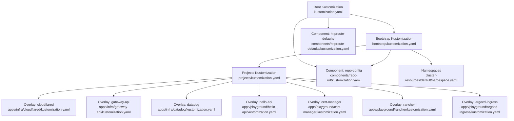
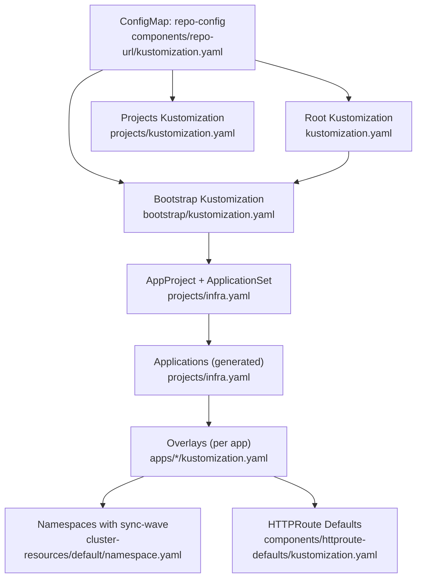
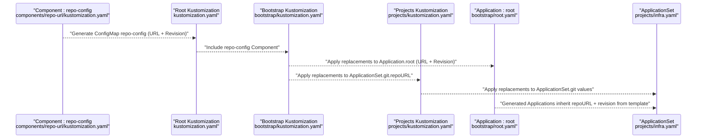
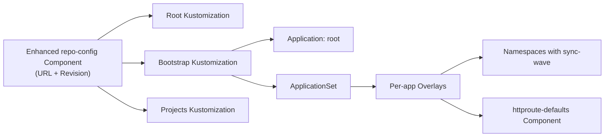

# Kustomize Configuration Patterns

<cite>
**Referenced Files in This Document**
- [kustomization.yaml](file://kustomization.yaml)
- [bootstrap/kustomization.yaml](file://bootstrap/kustomization.yaml)
- [components/repo-url/kustomization.yaml](file://components/repo-url/kustomization.yaml)
- [components/httproute-defaults/kustomization.yaml](file://components/httproute-defaults/kustomization.yaml)
- [cluster-resources/default/namespace.yaml](file://cluster-resources/default/namespace.yaml)
- [apps/infra/cloudflared/kustomization.yaml](file://apps/infra/cloudflared/kustomization.yaml)
- [apps/infra/gateway-api/kustomization.yaml](file://apps/infra/gateway-api/kustomization.yaml)
- [apps/playground/hello-api/kustomization.yaml](file://apps/playground/hello-api/kustomization.yaml)
- [apps/playground/cert-manager/kustomization.yaml](file://apps/playground/cert-manager/kustomization.yaml)
- [apps/infra/datadog/kustomization.yaml](file://apps/infra/datadog/kustomization.yaml)
- [apps/playground/rancher/kustomization.yaml](file://apps/playground/rancher/kustomization.yaml)
- [apps/playground/argocd-ingress/kustomization.yaml](file://apps/playground/argocd-ingress/kustomization.yaml)
- [projects/kustomization.yaml](file://projects/kustomization.yaml)
- [projects/infra.yaml](file://projects/infra.yaml)
- [bootstrap/root.yaml](file://bootstrap/root.yaml)
- [bootstrap/secrets.yaml](file://bootstrap/secrets.yaml)
</cite>

## Update Summary
**Changes Made**
- Updated centralized repo-config management to include manifest and secrets revision fields
- Enhanced replacement patterns to support both URL and revision targeting across all layers
- Documented standardized PLACEHOLDER values in project templates
- Consolidated syncOptions configurations into centralized AppProject and ApplicationSet definitions
- Added comprehensive httproute-defaults component documentation
- Updated namespace management patterns with sync-wave annotations

## Table of Contents
1. [Introduction](#introduction)
2. [Project Structure](#project-structure)
3. [Core Components](#core-components)
4. [Architecture Overview](#architecture-overview)
5. [Detailed Component Analysis](#detailed-component-analysis)
6. [Dependency Analysis](#dependency-analysis)
7. [Performance Considerations](#performance-considerations)
8. [Troubleshooting Guide](#troubleshooting-guide)
9. [Conclusion](#conclusion)

## Introduction
This document explains the Kustomize configuration patterns used across the application layer. It focuses on how kustomization.yaml files define namespaces, resources, and component inheritance; how base configurations relate to environment-specific customizations; and how overlays and shared components are referenced. The repository now features standardized project templates with PLACEHOLDER values and consolidated syncOptions configurations managed through centralized repo-config ConfigMap generation. It also covers resource inclusion patterns, overlay strategies, namespace management, resource ordering via annotations, and how Kustomize merges multiple layers into final manifests. Finally, it documents common Kustomize patterns such as replacements, images, and variables.

## Project Structure
The repository organizes Kustomize layers with enhanced standardization:
- Root Kustomization defines shared components and top-level replacements with URL and revision targeting.
- Bootstrap layer composes foundational resources and applies comprehensive replacements to Argo CD Applications and ApplicationSets.
- Projects layer defines Argo CD AppProjects and ApplicationSets with standardized PLACEHOLDER values and consolidated syncOptions.
- Apps layer contains environment-specific overlays under infra and playground, each setting a namespace and referencing Helm charts.
- Components encapsulate reusable configuration including centralized repo-config management and httproute-defaults standardization.
- Cluster resources define Namespaces with Argo CD sync-wave annotations to enforce ordering.

**Diagram sources**
- [kustomization.yaml:1-31](file://kustomization.yaml#L1-L31)
- [bootstrap/kustomization.yaml:1-63](file://bootstrap/kustomization.yaml#L1-L63)
- [projects/kustomization.yaml:1-31](file://projects/kustomization.yaml#L1-L31)
- [components/repo-url/kustomization.yaml:1-13](file://components/repo-url/kustomization.yaml#L1-L13)
- [components/httproute-defaults/kustomization.yaml:1-32](file://components/httproute-defaults/kustomization.yaml#L1-L32)
- [cluster-resources/default/namespace.yaml:1-60](file://cluster-resources/default/namespace.yaml#L1-L60)
- [apps/infra/cloudflared/kustomization.yaml:1-8](file://apps/infra/cloudflared/kustomization.yaml#L1-L8)
- [apps/infra/gateway-api/kustomization.yaml:1-9](file://apps/infra/gateway-api/kustomization.yaml#L1-L9)
- [apps/infra/datadog/kustomization.yaml:1-8](file://apps/infra/datadog/kustomization.yaml#L1-L8)
- [apps/playground/hello-api/kustomization.yaml:1-11](file://apps/playground/hello-api/kustomization.yaml#L1-L11)
- [apps/playground/cert-manager/kustomization.yaml:1-6](file://apps/playground/cert-manager/kustomization.yaml#L1-L6)
- [apps/playground/rancher/kustomization.yaml:1-12](file://apps/playground/rancher/kustomization.yaml#L1-L12)
- [apps/playground/argocd-ingress/kustomization.yaml:1-9](file://apps/playground/argocd-ingress/kustomization.yaml#L1-L9)

**Section sources**
- [kustomization.yaml:1-31](file://kustomization.yaml#L1-L31)
- [bootstrap/kustomization.yaml:1-63](file://bootstrap/kustomization.yaml#L1-L63)
- [projects/kustomization.yaml:1-31](file://projects/kustomization.yaml#L1-L31)
- [components/repo-url/kustomization.yaml:1-13](file://components/repo-url/kustomization.yaml#L1-L13)
- [cluster-resources/default/namespace.yaml:1-60](file://cluster-resources/default/namespace.yaml#L1-L60)

## Core Components
- **Enhanced Shared Component**: A Component generates a ConfigMap named repo-config with four literal fields (repository URLs and revision targets). This is included at the root, bootstrap, and projects layers to centralize repository configuration management.
- **Comprehensive Replacements**: The root, bootstrap, and projects layers use replacements to inject both URL and revision values from the generated repo-config into Argo CD Application and ApplicationSet resources. This enables dynamic wiring of source repositories and target revisions without hardcoding values.
- **Standardized httproute-defaults Component**: A reusable component that ensures HTTPRoute resources consistently reference shared-gateway in gateway-api namespace and adds management annotations for tooling visibility.
- **Consolidated SyncOptions**: AppProject and ApplicationSet resources define unified sync policies including CreateNamespace=true and SkipDryRunOnMissingResource=true for consistent behavior across environments.

Key patterns:
- Centralized variables via a Component's configMapGenerator with URL and revision fields.
- Dynamic injection of variables into Argo CD resources using comprehensive replacements.
- Standardized HTTPRoute configuration through reusable components.
- Unified syncOptions management for predictable reconciliation behavior.

**Section sources**
- [components/repo-url/kustomization.yaml:1-13](file://components/repo-url/kustomization.yaml#L1-L13)
- [components/httproute-defaults/kustomization.yaml:1-32](file://components/httproute-defaults/kustomization.yaml#L1-L32)
- [kustomization.yaml:10-31](file://kustomization.yaml#L10-L31)
- [bootstrap/kustomization.yaml:12-63](file://bootstrap/kustomization.yaml#L12-L63)
- [projects/infra.yaml:72-74](file://projects/infra.yaml#L72-L74)
- [cluster-resources/default/namespace.yaml:1-60](file://cluster-resources/default/namespace.yaml#L1-L60)

## Architecture Overview
The deployment pipeline is driven by Argo CD ApplicationSets that generate per-app Application resources with standardized PLACEHOLDER values. These Applications reference Kustomize overlays that set namespaces and include Helm charts. The enhanced root, bootstrap, and projects layers inject both repository URLs and target revisions dynamically using comprehensive replacements.

**Diagram sources**
- [components/repo-url/kustomization.yaml:1-13](file://components/repo-url/kustomization.yaml#L1-L13)
- [kustomization.yaml:1-31](file://kustomization.yaml#L1-L31)
- [bootstrap/kustomization.yaml:1-63](file://bootstrap/kustomization.yaml#L1-L63)
- [projects/infra.yaml:1-85](file://projects/infra.yaml#L1-L85)
- [projects/kustomization.yaml:1-31](file://projects/kustomization.yaml#L1-L31)
- [apps/infra/cloudflared/kustomization.yaml:1-8](file://apps/infra/cloudflared/kustomization.yaml#L1-L8)
- [apps/infra/gateway-api/kustomization.yaml:1-9](file://apps/infra/gateway-api/kustomization.yaml#L1-L9)
- [apps/playground/hello-api/kustomization.yaml:1-11](file://apps/playground/hello-api/kustomization.yaml#L1-L11)
- [components/httproute-defaults/kustomization.yaml:1-32](file://components/httproute-defaults/kustomization.yaml#L1-L32)
- [cluster-resources/default/namespace.yaml:1-60](file://cluster-resources/default/namespace.yaml#L1-L60)

## Detailed Component Analysis

### Base Layer: Root Kustomization
- **Purpose**: Declares shared components and top-level replacements with comprehensive URL and revision targeting.
- **Component inclusion**: Adds the enhanced repo-config Component with URL and revision fields.
- **Enhanced Replacements**: Injects both repo-config.url and repo-config.manifest_revision into Argo CD Application resources, ensuring centralized repository configuration and target revision management.

**Updated** Enhanced to support both URL and revision replacements for comprehensive configuration management.

**Section sources**
- [kustomization.yaml:1-31](file://kustomization.yaml#L1-L31)

### Bootstrap Layer
- **Purpose**: Composes foundational resources and applies comprehensive replacements to Argo CD Applications and ApplicationSets.
- **Resources**: Includes root Application, cluster-resources, and secrets Application.
- **Component inclusion**: Adds the enhanced repo-config Component with URL and revision fields.
- **Comprehensive Replacements**:
  - Injects repo-config.url into Application.spec.source.repoURL and ApplicationSet.git.repoURL.
  - Injects repo-config.secrets_url into the secrets Application.spec.source.repoURL.
  - Injects repo-config.manifest_revision and repo-config.secrets_revision into targetRevision fields.
  - Supports both URL and revision targeting for complete configuration management.

**Updated** Expanded to handle both URL and revision replacements across all target resources.

**Section sources**
- [bootstrap/kustomization.yaml:1-63](file://bootstrap/kustomization.yaml#L1-L63)
- [bootstrap/root.yaml:1-37](file://bootstrap/root.yaml#L1-L37)
- [bootstrap/secrets.yaml:1-24](file://bootstrap/secrets.yaml#L1-L24)

### Component: Enhanced repo-config
- **Purpose**: Generates a ConfigMap named repo-config with four literal fields (repository URLs and revision targets).
- **Enhanced Fields**: Includes url, secrets_url, manifest_revision, and secrets_revision for comprehensive configuration management.
- **Behavior**: DisableNameSuffixHash ensures deterministic names for Argo CD replacements.

**Updated** Enhanced to include revision fields alongside URL fields for complete configuration management.

**Section sources**
- [components/repo-url/kustomization.yaml:1-13](file://components/repo-url/kustomization.yaml#L1-L13)

### Component: httproute-defaults
- **Purpose**: Provides standardized HTTPRoute configuration across all applications.
- **Functionality**: Ensures parentRefs[0] always references shared-gateway in gateway-api namespace and adds management annotations.
- **Usage**: Include this component in any kustomization that contains HTTPRoute resources.

**New** Added comprehensive documentation for the httproute-defaults component.

**Section sources**
- [components/httproute-defaults/kustomization.yaml:1-32](file://components/httproute-defaults/kustomization.yaml#L1-L32)

### Cluster Resources: Namespaces with Ordering
- **Purpose**: Define Namespaces with Argo CD sync annotations to control ordering.
- **Pattern**: Uses argocd.argoproj.io/sync-wave to ensure early creation of Namespaces before dependent resources.

**Section sources**
- [cluster-resources/default/namespace.yaml:1-60](file://cluster-resources/default/namespace.yaml#L1-L60)

### Overlays: Environment-Specific Customizations
- **Infra Overlay Examples**:
  - cloudflared: Sets namespace and includes chart resources.
  - gateway-api: Sets namespace and includes remote install manifest plus chart.
  - datadog: Sets namespace and includes chart resources.
- **Playground Overlay Examples**:
  - hello-api: Sets namespace and includes chart resources with httproute-defaults component.
  - cert-manager: Includes chart resources.
  - rancher: Sets namespace to cattle-system and includes chart with httproute-defaults component.
  - argocd-ingress: Sets namespace and includes chart.

**Updated** Enhanced to demonstrate httproute-defaults component integration in relevant overlays.

These overlays demonstrate:
- Namespace scoping per application.
- Resource inclusion via local chart directories and external manifests.
- Consistent use of Kustomize to merge Helm charts into final manifests.
- Standardized HTTPRoute configuration through reusable components.

**Section sources**
- [apps/infra/cloudflared/kustomization.yaml:1-8](file://apps/infra/cloudflared/kustomization.yaml#L1-L8)
- [apps/infra/gateway-api/kustomization.yaml:1-9](file://apps/infra/gateway-api/kustomization.yaml#L1-L9)
- [apps/infra/datadog/kustomization.yaml:1-8](file://apps/infra/datadog/kustomization.yaml#L1-L8)
- [apps/playground/hello-api/kustomization.yaml:1-11](file://apps/playground/hello-api/kustomization.yaml#L1-L11)
- [apps/playground/cert-manager/kustomization.yaml:1-6](file://apps/playground/cert-manager/kustomization.yaml#L1-L6)
- [apps/playground/rancher/kustomization.yaml:1-12](file://apps/playground/rancher/kustomization.yaml#L1-L12)
- [apps/playground/argocd-ingress/kustomization.yaml:1-9](file://apps/playground/argocd-ingress/kustomization.yaml#L1-L9)

### Projects Layer: Standardized Templates
- **AppProject**: Defines cluster and namespace resource whitelists with consolidated sync options including PruneLast=true.
- **ApplicationSet**: Git generator produces per-app Application resources with standardized PLACEHOLDER values for repoURL and revision, templating cluster, project, app_path, and name variables.
- **Standardized Templates**: All ApplicationSet templates use PLACEHOLDER values for repoURL and revision, enabling consistent configuration across environments.
- **Unified SyncOptions**: ApplicationSet templates define CreateNamespace=true and SkipDryRunOnMissingResource=true for consistent behavior.

**Updated** Enhanced to document standardized PLACEHOLDER values and consolidated syncOptions configurations.

**Section sources**
- [projects/infra.yaml:1-85](file://projects/infra.yaml#L1-L85)
- [projects/kustomization.yaml:1-31](file://projects/kustomization.yaml#L1-L31)

### Replacement Flow: Enhanced Variable Management
This sequence shows how enhanced repo-config values are injected into Argo CD resources with comprehensive URL and revision targeting.

**Updated** Enhanced to show comprehensive URL and revision replacement flows.

**Diagram sources**
- [components/repo-url/kustomization.yaml:1-13](file://components/repo-url/kustomization.yaml#L1-L13)
- [kustomization.yaml:10-31](file://kustomization.yaml#L10-L31)
- [bootstrap/kustomization.yaml:12-63](file://bootstrap/kustomization.yaml#L12-L63)
- [projects/kustomization.yaml:11-31](file://projects/kustomization.yaml#L11-L31)
- [bootstrap/root.yaml:15-18](file://bootstrap/root.yaml#L15-L18)
- [projects/infra.yaml:34-58](file://projects/infra.yaml#L34-L58)

## Dependency Analysis
- **Enhanced Component Coupling**:
  - Root, bootstrap, and projects layers depend on the enhanced repo-config Component with URL and revision fields.
  - Bootstrap depends on root resources (root Application, cluster-resources, secrets).
  - Projects layer depends on bootstrap for repository URLs and on overlays for per-app manifests.
  - Overlays depend on httproute-defaults component for HTTPRoute standardization.
- **Namespace Dependencies**:
  - Overlays set namespaces; cluster-resources Namespaces are annotated for early creation.
- **Enhanced Replacement Dependencies**:
  - Argo CD Applications and ApplicationSets depend on the presence of enhanced repo-config to resolve dynamic URLs and target revisions.

**Updated** Enhanced to show comprehensive component dependencies and httproute-defaults integration.

**Diagram sources**
- [components/repo-url/kustomization.yaml:1-13](file://components/repo-url/kustomization.yaml#L1-L13)
- [kustomization.yaml:1-31](file://kustomization.yaml#L1-L31)
- [bootstrap/kustomization.yaml:1-63](file://bootstrap/kustomization.yaml#L1-L63)
- [projects/kustomization.yaml:1-31](file://projects/kustomization.yaml#L1-L31)
- [bootstrap/root.yaml:1-37](file://bootstrap/root.yaml#L1-L37)
- [projects/infra.yaml:1-85](file://projects/infra.yaml#L1-L85)
- [apps/infra/cloudflared/kustomization.yaml:1-8](file://apps/infra/cloudflared/kustomization.yaml#L1-L8)
- [apps/playground/hello-api/kustomization.yaml:1-11](file://apps/playground/hello-api/kustomization.yaml#L1-L11)
- [components/httproute-defaults/kustomization.yaml:1-32](file://components/httproute-defaults/kustomization.yaml#L1-L32)
- [cluster-resources/default/namespace.yaml:1-60](file://cluster-resources/default/namespace.yaml#L1-L60)

**Section sources**
- [kustomization.yaml:1-31](file://kustomization.yaml#L1-L31)
- [bootstrap/kustomization.yaml:1-63](file://bootstrap/kustomization.yaml#L1-L63)
- [projects/infra.yaml:1-85](file://projects/infra.yaml#L1-L85)

## Performance Considerations
- **Minimizing Replacements**: Keep replacement targets focused to reduce unnecessary updates across many resources.
- **Component Reuse**: Centralize shared configuration (enhanced repo-config with URL and revision fields) to avoid duplication and speed up reconciliation.
- **Namespace Ordering**: Use sync-wave annotations to prevent repeated failures caused by missing Namespaces.
- **Chart Complexity**: Large Helm charts increase Kustomize build time; consider splitting charts or optimizing values where appropriate.
- **Component Efficiency**: The httproute-defaults component reduces configuration overhead across multiple applications.

**Updated** Enhanced to include component efficiency considerations.

## Troubleshooting Guide
Common issues and resolutions:
- **Missing Namespaces**:
  - Symptom: Resources fail to apply due to missing namespace.
  - Resolution: Ensure cluster-resources Namespaces exist with appropriate sync-wave annotations; confirm Argo CD sync options create namespaces automatically.
- **Incorrect Repository URLs or Revisions**:
  - Symptom: Applications fail to sync due to wrong repoURL or targetRevision.
  - Resolution: Verify replacements in root, bootstrap, and projects layers; confirm enhanced repo-config values are present and applied to Applications/ApplicationSets.
- **PLACEHOLDER Values Not Resolved**:
  - Symptom: Generated Applications still contain PLACEHOLDER values instead of actual configuration.
  - Resolution: Ensure ApplicationSet templates are processed by Kustomize to replace PLACEHOLDER values with actual repo-config data.
- **HTTPRoute Configuration Issues**:
  - Symptom: HTTPRoute resources don't reference shared-gateway or lack management annotations.
  - Resolution: Verify httproute-defaults component is included in relevant overlays; check strategic merge patch configuration.
- **Replacement Target Not Found**:
  - Symptom: Replacements do not update target resources.
  - Resolution: Confirm target selectors match resource kinds/names and fieldPaths are correct; check that resources are included in the Kustomize graph.
- **Helm Build Failures**:
  - Symptom: Kustomize fails when building Helm charts.
  - Resolution: Validate chart paths and values; ensure Kustomize buildOptions enable Helm support as configured.

**Updated** Enhanced to address PLACEHOLDER values, enhanced repo-config management, and httproute-defaults component troubleshooting.

**Section sources**
- [cluster-resources/default/namespace.yaml:1-60](file://cluster-resources/default/namespace.yaml#L1-L60)
- [bootstrap/root.yaml:19-37](file://bootstrap/root.yaml#L19-L37)
- [bootstrap/kustomization.yaml:12-63](file://bootstrap/kustomization.yaml#L12-L63)
- [projects/kustomization.yaml:11-31](file://projects/kustomization.yaml#L11-L31)
- [components/httproute-defaults/kustomization.yaml:15-32](file://components/httproute-defaults/kustomization.yaml#L15-L32)

## Conclusion
This repository demonstrates robust and standardized Kustomize patterns:
- **Centralized Configuration Management**: Enhanced repo-config Component with URL and revision fields provides comprehensive configuration management across all layers.
- **Standardized Templates**: ApplicationSet templates use PLACEHOLDER values for consistent configuration across environments.
- **Consolidated SyncOptions**: Unified sync policies including CreateNamespace=true and SkipDryRunOnMissingResource=true ensure predictable reconciliation behavior.
- **Reusable Components**: httproute-defaults component standardizes HTTPRoute configuration across all applications.
- **Clear Separation**: Well-defined base, bootstrap, and overlay layers with enhanced dependency management.
- **Explicit Namespace Scoping**: Namespaces with sync-wave annotations ensure reliable reconciliation order.
- **Scalable Overlays**: Per-app overlays with component reuse while maintaining consistent configuration.

These enhanced patterns provide a solid foundation for managing multi-environment deployments with Argo CD and Kustomize, featuring improved configuration management, standardized templates, and reusable components.