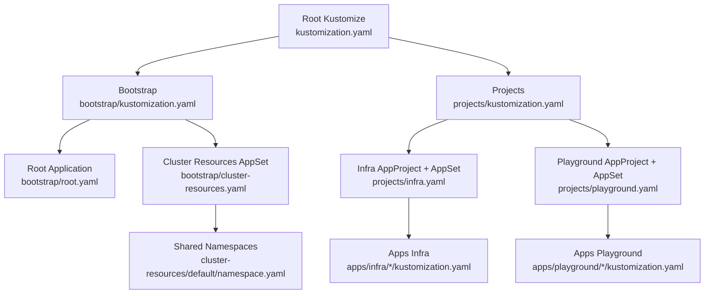
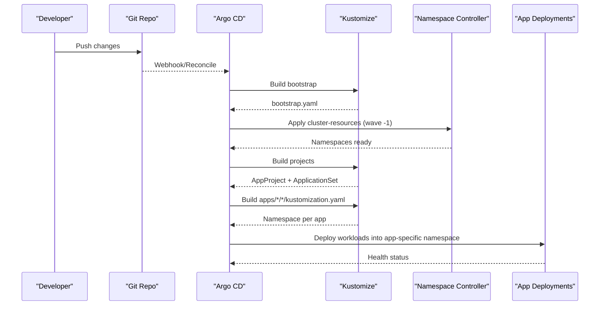
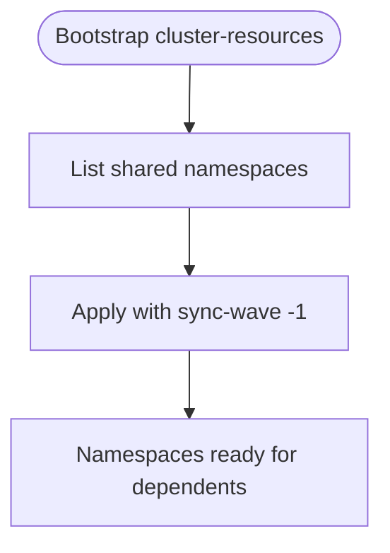
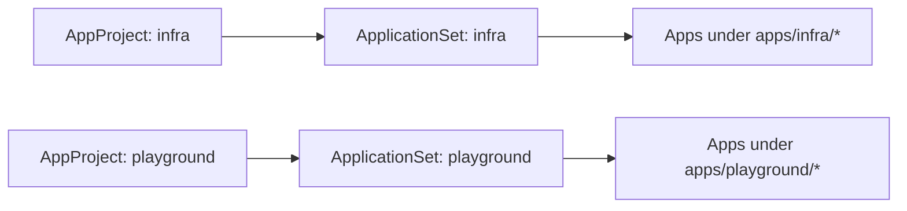
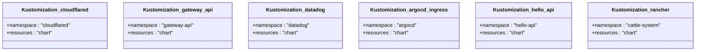
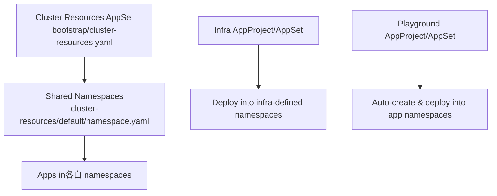
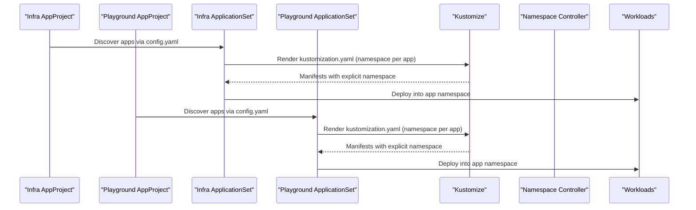
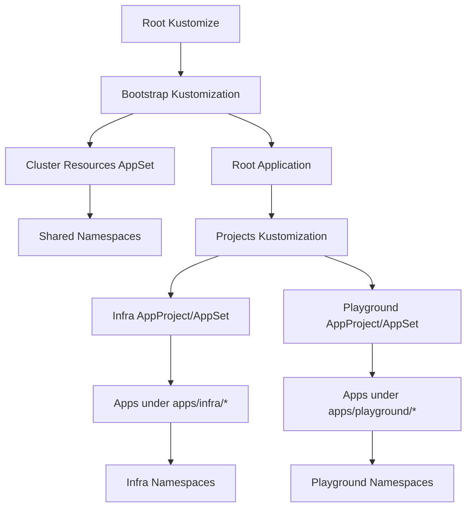

# Namespace Management and Isolation

<cite>
**Referenced Files in This Document**
- [README.md](file://README.md)
- [bootstrap/kustomization.yaml](file://bootstrap/kustomization.yaml)
- [bootstrap/root.yaml](file://bootstrap/root.yaml)
- [bootstrap/cluster-resources.yaml](file://bootstrap/cluster-resources.yaml)
- [cluster-resources/default/namespace.yaml](file://cluster-resources/default/namespace.yaml)
- [projects/kustomization.yaml](file://projects/kustomization.yaml)
- [projects/infra.yaml](file://projects/infra.yaml)
- [projects/playground.yaml](file://projects/playground.yaml)
- [apps/infra/cloudflared/kustomization.yaml](file://apps/infra/cloudflared/kustomization.yaml)
- [apps/infra/gateway-api/kustomization.yaml](file://apps/infra/gateway-api/kustomization.yaml)
- [apps/infra/datadog/kustomization.yaml](file://apps/infra/datadog/kustomization.yaml)
- [apps/playground/argocd-ingress/kustomization.yaml](file://apps/playground/argocd-ingress/kustomization.yaml)
- [apps/playground/cert-manager/kustomization.yaml](file://apps/playground/cert-manager/kustomization.yaml)
- [apps/playground/hello-api/kustomization.yaml](file://apps/playground/hello-api/kustomization.yaml)
- [apps/playground/rancher/kustomization.yaml](file://apps/playground/rancher/kustomization.yaml)
</cite>

## Table of Contents
1. [Introduction](#introduction)
2. [Project Structure](#project-structure)
3. [Core Components](#core-components)
4. [Architecture Overview](#architecture-overview)
5. [Detailed Component Analysis](#detailed-component-analysis)
6. [Dependency Analysis](#dependency-analysis)
7. [Performance Considerations](#performance-considerations)
8. [Troubleshooting Guide](#troubleshooting-guide)
9. [Conclusion](#conclusion)
10. [Appendices](#appendices)

## Introduction
This document explains the namespace management and isolation strategies implemented in the GitOps repository. It focuses on how each application defines its own namespace via Kustomize, how shared namespaces are provisioned early in the bootstrap process, and how Argo CD’s sync waves and AppProject scoping enforce logical separation between application types. It also covers the relationship between application namespaces and cluster-level resources, conflict prevention, independent deployment cycles, and lifecycle management.

## Project Structure
The repository organizes manifests across three layers:
- Bootstrap layer: bootstraps Argo CD and shared cluster resources.
- Projects layer: defines AppProjects and ApplicationSets per application type (infra vs. playground).
- Apps layer: individual applications declare their namespace and Helm/Kustomize resources.

**Diagram sources**
- [bootstrap/kustomization.yaml:1-38](file://bootstrap/kustomization.yaml#L1-L38)
- [bootstrap/root.yaml:1-37](file://bootstrap/root.yaml#L1-L37)
- [bootstrap/cluster-resources.yaml:1-33](file://bootstrap/cluster-resources.yaml#L1-L33)
- [cluster-resources/default/namespace.yaml:1-52](file://cluster-resources/default/namespace.yaml#L1-L52)
- [projects/kustomization.yaml:1-22](file://projects/kustomization.yaml#L1-L22)
- [projects/infra.yaml:1-85](file://projects/infra.yaml#L1-L85)
- [projects/playground.yaml:1-90](file://projects/playground.yaml#L1-L90)
- [apps/infra/cloudflared/kustomization.yaml:1-8](file://apps/infra/cloudflared/kustomization.yaml#L1-L8)
- [apps/playground/hello-api/kustomization.yaml:1-8](file://apps/playground/hello-api/kustomization.yaml#L1-L8)

**Section sources**
- [README.md:87-118](file://README.md#L87-L118)
- [bootstrap/kustomization.yaml:1-38](file://bootstrap/kustomization.yaml#L1-L38)
- [projects/kustomization.yaml:1-22](file://projects/kustomization.yaml#L1-L22)

## Core Components
- Bootstrap chain provisions Argo CD and shared cluster resources before application namespaces exist.
- AppProjects scope ApplicationSets to specific application families (infra, playground), isolating destinations and source repos.
- ApplicationSets discover apps via config.yaml and render Kustomize manifests that set the namespace per app.
- Shared namespaces are created early (sync wave -1) so dependent apps can safely reference them.

Key behaviors:
- Shared namespaces are declared in cluster-resources/default/namespace.yaml and applied with sync-wave -1.
- Infra AppProject/AppSet sets destination.namespace to '*' to allow deploying into any namespace.
- Playground AppProject/AppSet sets CreateNamespace=true and SkipDryRunOnMissingResource=true to auto-provision app namespaces.

**Section sources**
- [README.md:144-147](file://README.md#L144-L147)
- [bootstrap/cluster-resources.yaml:1-33](file://bootstrap/cluster-resources.yaml#L1-L33)
- [cluster-resources/default/namespace.yaml:1-52](file://cluster-resources/default/namespace.yaml#L1-L52)
- [projects/infra.yaml:1-85](file://projects/infra.yaml#L1-L85)
- [projects/playground.yaml:1-90](file://projects/playground.yaml#L1-L90)

## Architecture Overview
The namespace lifecycle is orchestrated by Argo CD sync waves and Kustomize namespace directives:

**Diagram sources**
- [bootstrap/root.yaml:1-37](file://bootstrap/root.yaml#L1-L37)
- [bootstrap/cluster-resources.yaml:1-33](file://bootstrap/cluster-resources.yaml#L1-L33)
- [cluster-resources/default/namespace.yaml:1-52](file://cluster-resources/default/namespace.yaml#L1-L52)
- [projects/infra.yaml:1-85](file://projects/infra.yaml#L1-L85)
- [projects/playground.yaml:1-90](file://projects/playground.yaml#L1-L90)
- [apps/infra/cloudflared/kustomization.yaml:1-8](file://apps/infra/cloudflared/kustomization.yaml#L1-L8)
- [apps/playground/hello-api/kustomization.yaml:1-8](file://apps/playground/hello-api/kustomization.yaml#L1-L8)

## Detailed Component Analysis

### Shared Namespaces Provisioning (Sync Wave -1)
Shared namespaces are defined centrally and applied before application deployments to prevent race conditions. They are annotated with sync-wave -1 to guarantee creation order.

**Diagram sources**
- [bootstrap/cluster-resources.yaml:1-33](file://bootstrap/cluster-resources.yaml#L1-L33)
- [cluster-resources/default/namespace.yaml:1-52](file://cluster-resources/default/namespace.yaml#L1-L52)

**Section sources**
- [README.md:144-147](file://README.md#L144-L147)
- [bootstrap/cluster-resources.yaml:1-33](file://bootstrap/cluster-resources.yaml#L1-L33)
- [cluster-resources/default/namespace.yaml:1-52](file://cluster-resources/default/namespace.yaml#L1-L52)

### AppProject and ApplicationSet Scoping
AppProjects define cluster and namespace resource whitelists and bind ApplicationSets to specific application families. This enforces logical separation between infra and playground apps.

**Diagram sources**
- [projects/infra.yaml:1-85](file://projects/infra.yaml#L1-L85)
- [projects/playground.yaml:1-90](file://projects/playground.yaml#L1-L90)

**Section sources**
- [projects/infra.yaml:1-85](file://projects/infra.yaml#L1-L85)
- [projects/playground.yaml:1-90](file://projects/playground.yaml#L1-L90)

### Per-Application Namespace Definition
Each application declares its namespace in its Kustomization. This ensures workloads are deployed into isolated namespaces and simplifies ownership and quota enforcement.

Examples:
- Infra app: cloudflared namespace
- Infra app: gateway-api namespace
- Infra app: datadog namespace
- Playground app: argocd namespace
- Playground app: hello-api namespace
- Playground app: cattle-system namespace

**Diagram sources**
- [apps/infra/cloudflared/kustomization.yaml:1-8](file://apps/infra/cloudflared/kustomization.yaml#L1-L8)
- [apps/infra/gateway-api/kustomization.yaml:1-9](file://apps/infra/gateway-api/kustomization.yaml#L1-L9)
- [apps/infra/datadog/kustomization.yaml:1-8](file://apps/infra/datadog/kustomization.yaml#L1-L8)
- [apps/playground/argocd-ingress/kustomization.yaml:1-9](file://apps/playground/argocd-ingress/kustomization.yaml#L1-L9)
- [apps/playground/hello-api/kustomization.yaml:1-8](file://apps/playground/hello-api/kustomization.yaml#L1-L8)
- [apps/playground/rancher/kustomization.yaml:1-9](file://apps/playground/rancher/kustomization.yaml#L1-L9)

**Section sources**
- [apps/infra/cloudflared/kustomization.yaml:1-8](file://apps/infra/cloudflared/kustomization.yaml#L1-L8)
- [apps/infra/gateway-api/kustomization.yaml:1-9](file://apps/infra/gateway-api/kustomization.yaml#L1-L9)
- [apps/infra/datadog/kustomization.yaml:1-8](file://apps/infra/datadog/kustomization.yaml#L1-L8)
- [apps/playground/argocd-ingress/kustomization.yaml:1-9](file://apps/playground/argocd-ingress/kustomization.yaml#L1-L9)
- [apps/playground/hello-api/kustomization.yaml:1-8](file://apps/playground/hello-api/kustomization.yaml#L1-L8)
- [apps/playground/rancher/kustomization.yaml:1-9](file://apps/playground/rancher/kustomization.yaml#L1-L9)

### Relationship Between Application Namespaces and Cluster-Level Resources
- Shared namespaces (e.g., gateway-api, datadog, argocd) are provisioned early and reused by multiple apps.
- Cluster-scoped resources (e.g., Gateway API CRDs, ClusterRoles) are installed via ApplicationSets and referenced by apps in their respective namespaces.
- ApplicationSets in playground set CreateNamespace=true to auto-create app namespaces when missing.

**Diagram sources**
- [bootstrap/cluster-resources.yaml:1-33](file://bootstrap/cluster-resources.yaml#L1-L33)
- [cluster-resources/default/namespace.yaml:1-52](file://cluster-resources/default/namespace.yaml#L1-L52)
- [projects/infra.yaml:1-85](file://projects/infra.yaml#L1-L85)
- [projects/playground.yaml:1-90](file://projects/playground.yaml#L1-L90)

**Section sources**
- [bootstrap/cluster-resources.yaml:1-33](file://bootstrap/cluster-resources.yaml#L1-L33)
- [cluster-resources/default/namespace.yaml:1-52](file://cluster-resources/default/namespace.yaml#L1-L52)
- [projects/playground.yaml:72-74](file://projects/playground.yaml#L72-L74)

### Namespace Isolation and Independent Deployment Cycles
- AppProjects isolate infra and playground apps, preventing cross-project interference.
- ApplicationSets render Kustomize manifests per app, setting the namespace per application.
- Sync waves ensure shared namespaces and cluster resources exist before apps deploy, enabling independent deployment cycles per app family.

**Diagram sources**
- [projects/infra.yaml:1-85](file://projects/infra.yaml#L1-L85)
- [projects/playground.yaml:1-90](file://projects/playground.yaml#L1-L90)
- [apps/infra/cloudflared/kustomization.yaml:1-8](file://apps/infra/cloudflared/kustomization.yaml#L1-L8)
- [apps/playground/hello-api/kustomization.yaml:1-8](file://apps/playground/hello-api/kustomization.yaml#L1-L8)

**Section sources**
- [projects/infra.yaml:1-85](file://projects/infra.yaml#L1-L85)
- [projects/playground.yaml:1-90](file://projects/playground.yaml#L1-L90)

### Default Namespace Baseline for Shared Cluster Resources
- The default namespace group is the baseline for shared cluster resources (e.g., shared namespaces).
- These are applied with sync-wave -1 to ensure availability before dependent apps deploy.
- ApplicationSets in the projects layer target these namespaces or auto-create app-specific ones.

**Section sources**
- [README.md:144-147](file://README.md#L144-L147)
- [bootstrap/cluster-resources.yaml:1-33](file://bootstrap/cluster-resources.yaml#L1-L33)
- [cluster-resources/default/namespace.yaml:1-52](file://cluster-resources/default/namespace.yaml#L1-L52)

### Namespace Lifecycle Management and Cleanup
- Creation: Playground ApplicationSets set CreateNamespace=true to provision app namespaces automatically.
- Cleanup: AppProject pruning policies and ApplicationSet self-heal/prune settings support lifecycle management.
- Dry-run behavior: SkipDryRunOnMissingResource=true reduces unnecessary dry-run failures when namespaces are missing.

**Section sources**
- [projects/playground.yaml:72-74](file://projects/playground.yaml#L72-L74)
- [projects/infra.yaml:61-65](file://projects/infra.yaml#L61-L65)
- [bootstrap/root.yaml:34-36](file://bootstrap/root.yaml#L34-L36)

## Dependency Analysis
The following diagram shows how bootstrap, projects, and apps depend on each other to establish namespace isolation and resource provisioning.

**Diagram sources**
- [bootstrap/kustomization.yaml:1-38](file://bootstrap/kustomization.yaml#L1-L38)
- [bootstrap/root.yaml:1-37](file://bootstrap/root.yaml#L1-L37)
- [bootstrap/cluster-resources.yaml:1-33](file://bootstrap/cluster-resources.yaml#L1-L33)
- [cluster-resources/default/namespace.yaml:1-52](file://cluster-resources/default/namespace.yaml#L1-L52)
- [projects/kustomization.yaml:1-22](file://projects/kustomization.yaml#L1-L22)
- [projects/infra.yaml:1-85](file://projects/infra.yaml#L1-L85)
- [projects/playground.yaml:1-90](file://projects/playground.yaml#L1-L90)
- [apps/infra/cloudflared/kustomization.yaml:1-8](file://apps/infra/cloudflared/kustomization.yaml#L1-L8)
- [apps/playground/hello-api/kustomization.yaml:1-8](file://apps/playground/hello-api/kustomization.yaml#L1-L8)

**Section sources**
- [bootstrap/kustomization.yaml:1-38](file://bootstrap/kustomization.yaml#L1-L38)
- [projects/kustomization.yaml:1-22](file://projects/kustomization.yaml#L1-L22)

## Performance Considerations
- Sync waves reduce contention by ensuring prerequisites exist before dependent resources are created.
- ApplicationSet pruning and self-healing minimize drift and keep clusters aligned with desired state.
- Auto-creation of namespaces avoids manual intervention and reduces operational overhead.

[No sources needed since this section provides general guidance]

## Troubleshooting Guide
Common issues and resolutions:
- Namespace does not exist during app sync:
  - Verify shared namespaces were applied with sync-wave -1.
  - Confirm playground ApplicationSet has CreateNamespace=true and SkipDryRunOnMissingResource=true.
- Cross-project interference:
  - Ensure AppProjects restrict destinations and source repos appropriately.
- Race conditions between Gateway and HTTPRoutes:
  - Use sync waves to ensure Gateway exists before HTTPRoutes are applied.

**Section sources**
- [bootstrap/cluster-resources.yaml:1-33](file://bootstrap/cluster-resources.yaml#L1-L33)
- [cluster-resources/default/namespace.yaml:1-52](file://cluster-resources/default/namespace.yaml#L1-L52)
- [projects/playground.yaml:72-74](file://projects/playground.yaml#L72-L74)
- [README.md:76-85](file://README.md#L76-L85)

## Conclusion
This repository implements robust namespace management and isolation by combining centralized shared namespace provisioning, AppProject scoping, and per-application namespace declarations via Kustomize. The sync-wave orchestration and ApplicationSet automation enable independent deployment cycles while preventing resource conflicts and ensuring predictable upgrades.

[No sources needed since this section summarizes without analyzing specific files]

## Appendices

### Appendix A: Namespace Creation Examples
- Shared namespaces are defined in cluster-resources/default/namespace.yaml and applied with sync-wave -1.
- Playground apps rely on CreateNamespace=true to auto-provision their namespaces.

**Section sources**
- [cluster-resources/default/namespace.yaml:1-52](file://cluster-resources/default/namespace.yaml#L1-L52)
- [projects/playground.yaml:72-74](file://projects/playground.yaml#L72-L74)

### Appendix B: RBAC Considerations
- AppProjects whitelist cluster and namespace resources, limiting what apps can manage.
- Destination scoping confines apps to permitted namespaces, reducing blast radius.

**Section sources**
- [projects/infra.yaml:10-20](file://projects/infra.yaml#L10-L20)
- [projects/playground.yaml:9-20](file://projects/playground.yaml#L9-L20)

### Appendix C: Resource Quotas
- Enforce resource quotas at the namespace level to constrain compute and storage usage per app.
- Combine with namespace-scoped LimitRanges and PodSecurity Standards for consistent governance.

[No sources needed since this section provides general guidance]