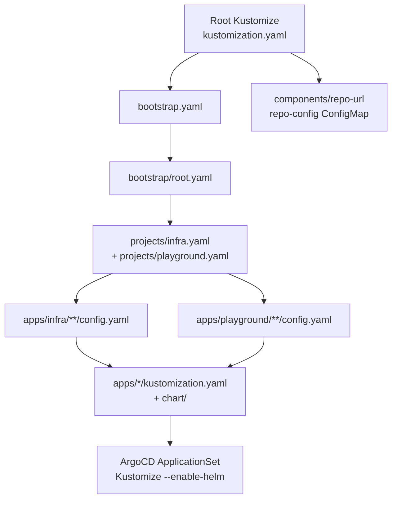
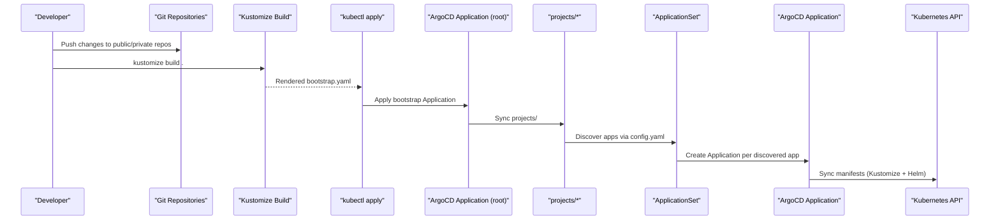
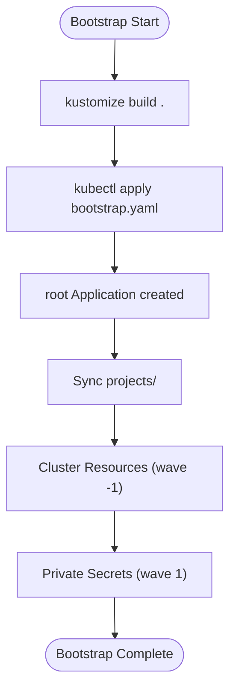
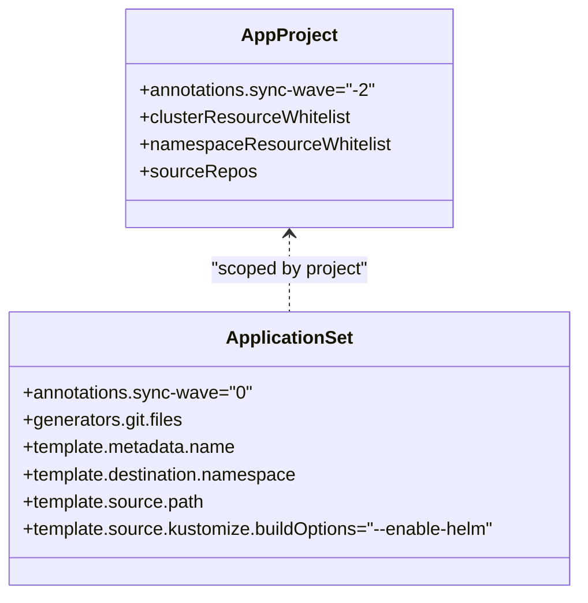
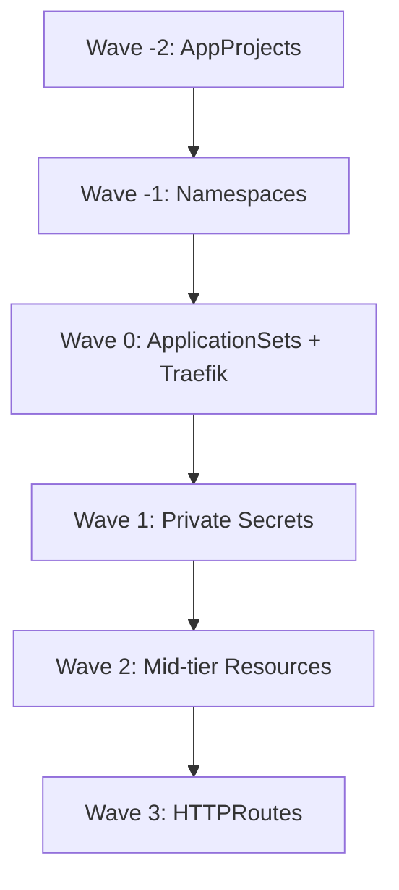
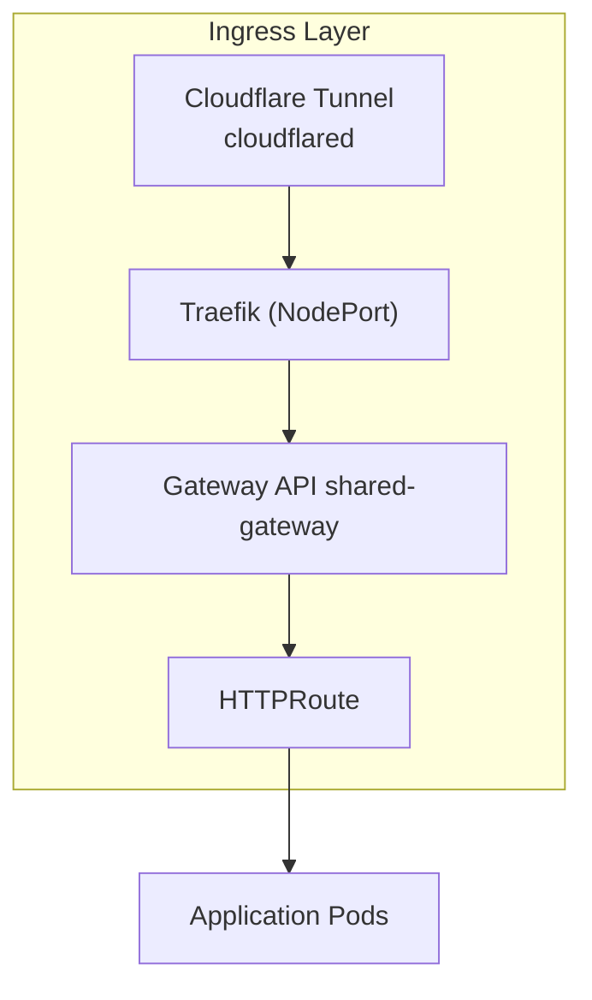
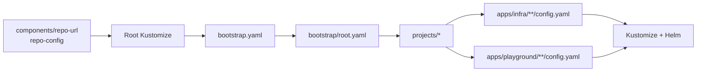
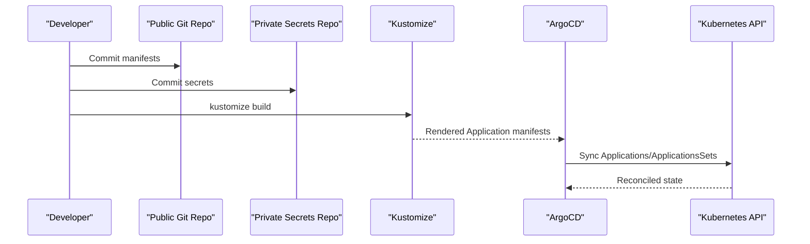

# Architecture and Design

<cite>
**Referenced Files in This Document**
- [README.md](file://README.md)
- [bootstrap.yaml](file://bootstrap.yaml)
- [kustomization.yaml](file://kustomization.yaml)
- [components/repo-url/kustomization.yaml](file://components/repo-url/kustomization.yaml)
- [bootstrap/kustomization.yaml](file://bootstrap/kustomization.yaml)
- [bootstrap/root.yaml](file://bootstrap/root.yaml)
- [bootstrap/cluster-resources.yaml](file://bootstrap/cluster-resources.yaml)
- [bootstrap/secrets.yaml](file://bootstrap/secrets.yaml)
- [projects/kustomization.yaml](file://projects/kustomization.yaml)
- [projects/infra.yaml](file://projects/infra.yaml)
- [projects/playground.yaml](file://projects/playground.yaml)
- [apps/infra/gateway-api/kustomization.yaml](file://apps/infra/gateway-api/kustomization.yaml)
- [cluster-resources/default/namespace.yaml](file://cluster-resources/default/namespace.yaml)
- [apps/infra/cloudflared/config.yaml](file://apps/infra/cloudflared/config.yaml)
- [apps/infra/datadog/config.yaml](file://apps/infra/datadog/config.yaml)
- [apps/playground/argocd-ingress/config.yaml](file://apps/playground/argocd-ingress/config.yaml)
- [apps/playground/rancher/config.yaml](file://apps/playground/rancher/config.yaml)
- [apps/playground/cert-manager/config.yaml](file://apps/playground/cert-manager/config.yaml)
</cite>

## Table of Contents
1. [Introduction](#introduction)
2. [Project Structure](#project-structure)
3. [Core Components](#core-components)
4. [Architecture Overview](#architecture-overview)
5. [Detailed Component Analysis](#detailed-component-analysis)
6. [Dependency Analysis](#dependency-analysis)
7. [Performance Considerations](#performance-considerations)
8. [Troubleshooting Guide](#troubleshooting-guide)
9. [Conclusion](#conclusion)
10. [Appendices](#appendices)

## Introduction
This document describes the GitOps infrastructure management system built on ArgoCD, Kustomize, and Helm. It explains the multi-layered configuration system, ApplicationSets, and namespace isolation. It documents the bootstrap chain, project definitions, and application configurations, and details the sync ordering mechanism using sync waves (-2 to +3). It also covers system boundaries, data flows from Git repositories through ArgoCD to the Kubernetes API server, and technology stack integrations including ArgoCD CRDs, Kubernetes Gateway API, Helm OCI registries, and Cloudflare Tunnel. Scalability, security, and deployment topology considerations are addressed.

## Project Structure
The repository is organized around a layered GitOps pipeline:
- Root Kustomize composes the bootstrap Application and injects repository URLs from a shared component.
- Bootstrap layer deploys the root Application, cluster resources, and private secrets.
- Projects define AppProjects and ApplicationSets that discover applications via config files.
- Apps define per-application manifests and optional Helm charts, with optional sync-wave annotations.

**Diagram sources**
- [kustomization.yaml:1-21](file://kustomization.yaml#L1-L21)
- [bootstrap.yaml:1-26](file://bootstrap.yaml#L1-L26)
- [components/repo-url/kustomization.yaml:1-11](file://components/repo-url/kustomization.yaml#L1-L11)
- [bootstrap/root.yaml:1-37](file://bootstrap/root.yaml#L1-L37)
- [projects/infra.yaml:1-85](file://projects/infra.yaml#L1-L85)
- [projects/playground.yaml:1-90](file://projects/playground.yaml#L1-L90)

**Section sources**
- [README.md:87-118](file://README.md#L87-L118)
- [kustomization.yaml:1-21](file://kustomization.yaml#L1-L21)
- [bootstrap/kustomization.yaml:1-38](file://bootstrap/kustomization.yaml#L1-L38)
- [projects/kustomization.yaml:1-22](file://projects/kustomization.yaml#L1-L22)

## Core Components
- Root Kustomize and bootstrap Application: Builds and applies the initial bootstrap Application, injecting repository URLs from a shared ConfigMap.
- Bootstrap layer: Deploys the root Application, cluster resources (namespaces), and private secrets.
- Projects layer: Defines AppProjects and ApplicationSets that scan for application config files and render them with Kustomize and Helm.
- Apps layer: Per-application definitions with optional Helm charts and optional namespace and sync-wave annotations.

Key implementation patterns:
- Centralized repository URL management via a shared Kustomize Component.
- Replacement-driven templating to propagate URLs across Applications and ApplicationSets.
- ApplicationSet Git file generators scanning for config.yaml files to discover apps.
- Sync waves encoded as annotations to enforce ordered synchronization.

**Section sources**
- [README.md:57-86](file://README.md#L57-L86)
- [bootstrap.yaml:1-26](file://bootstrap.yaml#L1-L26)
- [kustomization.yaml:10-21](file://kustomization.yaml#L10-L21)
- [bootstrap/kustomization.yaml:12-38](file://bootstrap/kustomization.yaml#L12-L38)
- [projects/kustomization.yaml:11-22](file://projects/kustomization.yaml#L11-L22)
- [projects/infra.yaml:33-85](file://projects/infra.yaml#L33-L85)
- [projects/playground.yaml:33-90](file://projects/playground.yaml#L33-L90)

## Architecture Overview
The system enforces a deterministic bootstrap chain and controlled sync order:
- Initial bootstrap: Root Kustomize injects repo URLs and applies bootstrap.yaml to create the root Application.
- Bootstrap phase: The root Application points to projects/, which define AppProjects and ApplicationSets.
- Cluster resources: Namespaces and shared cluster objects are created with sync-wave -1.
- Secrets: Private secrets are synchronized from a dedicated private repository with sync-wave 1.
- Mid-tier resources: Gateways, monitoring, and other platform components are applied with sync-wave 2.
- Ingress: HTTPRoutes are applied last (sync-wave 3) to ensure upstream Gateway resources exist.

**Diagram sources**
- [README.md:59-75](file://README.md#L59-L75)
- [bootstrap/root.yaml:10-37](file://bootstrap/root.yaml#L10-L37)
- [projects/infra.yaml:23-85](file://projects/infra.yaml#L23-L85)
- [projects/playground.yaml:23-90](file://projects/playground.yaml#L23-L90)

## Detailed Component Analysis

### Bootstrap System
The bootstrap system establishes the initial ArgoCD state and centralizes repository URL configuration:
- Root Kustomize composes bootstrap.yaml and injects repo URLs from components/repo-url.
- bootstrap/root.yaml points to projects/ and ignores transient diffs for ApplicationSet and ConfigMap annotations.
- bootstrap/cluster-resources.yaml provisions namespaces and shared cluster objects with sync-wave -1.
- bootstrap/secrets.yaml syncs private secrets from a separate repository with sync-wave 1.

**Diagram sources**
- [README.md:68-75](file://README.md#L68-L75)
- [kustomization.yaml:1-21](file://kustomization.yaml#L1-L21)
- [bootstrap/root.yaml:10-37](file://bootstrap/root.yaml#L10-L37)
- [bootstrap/cluster-resources.yaml:1-33](file://bootstrap/cluster-resources.yaml#L1-L33)
- [bootstrap/secrets.yaml:1-24](file://bootstrap/secrets.yaml#L1-L24)

**Section sources**
- [bootstrap.yaml:1-26](file://bootstrap.yaml#L1-L26)
- [kustomization.yaml:1-21](file://kustomization.yaml#L1-L21)
- [bootstrap/kustomization.yaml:1-38](file://bootstrap/kustomization.yaml#L1-L38)
- [bootstrap/root.yaml:1-37](file://bootstrap/root.yaml#L1-L37)
- [bootstrap/cluster-resources.yaml:1-33](file://bootstrap/cluster-resources.yaml#L1-L33)
- [bootstrap/secrets.yaml:1-24](file://bootstrap/secrets.yaml#L1-L24)

### Project Definitions and ApplicationSets
Projects define AppProjects and ApplicationSets that scan for application config files:
- projects/infra.yaml and projects/playground.yaml define AppProjects and ApplicationSets.
- ApplicationSets use Git file generators to discover config.yaml files under apps/infra/** and apps/playground/** respectively.
- Templates derive Application names, destinations, and source paths from discovered config files.
- Sync waves are set at the project level (wave 0) and can be overridden per app via annotations.

**Diagram sources**
- [projects/infra.yaml:1-85](file://projects/infra.yaml#L1-L85)
- [projects/playground.yaml:1-90](file://projects/playground.yaml#L1-L90)

**Section sources**
- [projects/infra.yaml:1-85](file://projects/infra.yaml#L1-L85)
- [projects/playground.yaml:1-90](file://projects/playground.yaml#L1-L90)
- [projects/kustomization.yaml:1-22](file://projects/kustomization.yaml#L1-L22)

### Application Configurations and Namespace Isolation
Applications are defined by config.yaml files discovered by ApplicationSets:
- config.yaml supports destNamespace and argocd.argoproj.io/sync-wave annotations.
- Namespace isolation is enforced by setting destination namespaces per app.
- Shared namespaces are provisioned with sync-wave -1 to ensure availability before apps deploy.

Examples:
- Infra apps (cloudflared, datadog, cert-manager) use sync-wave 2.
- Playground apps (argocd-ingress, rancher) use sync-wave 3.
- cluster-resources/default/namespace.yaml defines shared namespaces with sync-wave -1.

**Section sources**
- [apps/infra/cloudflared/config.yaml:1-4](file://apps/infra/cloudflared/config.yaml#L1-L4)
- [apps/infra/datadog/config.yaml:1-6](file://apps/infra/datadog/config.yaml#L1-L6)
- [apps/playground/argocd-ingress/config.yaml:1-4](file://apps/playground/argocd-ingress/config.yaml#L1-L4)
- [apps/playground/rancher/config.yaml:1-5](file://apps/playground/rancher/config.yaml#L1-L5)
- [apps/playground/cert-manager/config.yaml:1-5](file://apps/playground/cert-manager/config.yaml#L1-L5)
- [cluster-resources/default/namespace.yaml:1-52](file://cluster-resources/default/namespace.yaml#L1-L52)

### Sync Ordering Mechanism (Waves -2 to +3)
The system uses ArgoCD sync waves to guarantee safe, ordered reconciliation:
- Wave -2: AppProjects are created first to establish scoping and permissions.
- Wave -1: Namespaces are created to ensure destinations exist before app sync.
- Wave 0: ApplicationSets and Traefik Deployment are created to provide discovery and ingress control.
- Wave 1: Private secrets are synchronized from the dedicated private repository.
- Wave 2: Mid-tier platform resources (Gateway, Datadog, cert-manager) are applied.
- Wave 3: HTTPRoutes are applied last to ensure upstream Gateway resources exist.

**Diagram sources**
- [README.md:76-86](file://README.md#L76-L86)
- [projects/infra.yaml:4-7](file://projects/infra.yaml#L4-L7)
- [projects/infra.yaml:26-28](file://projects/infra.yaml#L26-L28)
- [bootstrap/cluster-resources.yaml:4-6](file://bootstrap/cluster-resources.yaml#L4-L6)
- [bootstrap/secrets.yaml:7](file://bootstrap/secrets.yaml#L7)
- [apps/infra/cloudflared/config.yaml:3](file://apps/infra/cloudflared/config.yaml#L3)
- [apps/infra/datadog/config.yaml:5](file://apps/infra/datadog/config.yaml#L5)
- [apps/playground/argocd-ingress/config.yaml:3](file://apps/playground/argocd-ingress/config.yaml#L3)
- [apps/playground/rancher/config.yaml:3](file://apps/playground/rancher/config.yaml#L3)

**Section sources**
- [README.md:76-86](file://README.md#L76-L86)
- [projects/infra.yaml:4-7](file://projects/infra.yaml#L4-L7)
- [projects/infra.yaml:26-28](file://projects/infra.yaml#L26-L28)
- [bootstrap/cluster-resources.yaml:4-6](file://bootstrap/cluster-resources.yaml#L4-L6)
- [bootstrap/secrets.yaml:7](file://bootstrap/secrets.yaml#L7)
- [apps/infra/cloudflared/config.yaml:3](file://apps/infra/cloudflared/config.yaml#L3)
- [apps/infra/datadog/config.yaml:5](file://apps/infra/datadog/config.yaml#L5)
- [apps/playground/argocd-ingress/config.yaml:3](file://apps/playground/argocd-ingress/config.yaml#L3)
- [apps/playground/rancher/config.yaml:3](file://apps/playground/rancher/config.yaml#L3)

### Technology Stack Integration
- ArgoCD CRDs: Application, AppProject, ApplicationSet are used extensively for GitOps orchestration.
- Kubernetes Gateway API: Gateway API CRDs are installed and Traefik acts as the Gateway API controller.
- Helm OCI Registries: Helm charts are referenced via Kustomize with --enable-helm to support OCI registries.
- Cloudflare Tunnel: cloudflared pods terminate tunnels and forward traffic to cluster services.

**Diagram sources**
- [README.md:38-48](file://README.md#L38-L48)
- [apps/infra/gateway-api/kustomization.yaml:1-9](file://apps/infra/gateway-api/kustomization.yaml#L1-L9)

**Section sources**
- [README.md:38-48](file://README.md#L38-L48)
- [apps/infra/gateway-api/kustomization.yaml:1-9](file://apps/infra/gateway-api/kustomization.yaml#L1-L9)

## Dependency Analysis
The system exhibits strong separation of concerns:
- Root Kustomize depends on a shared component for repository URLs.
- Bootstrap depends on the root Application and replacement logic to propagate URLs.
- Projects depend on ApplicationSets and config.yaml discovery.
- Apps depend on Kustomize rendering and optional Helm charts.

**Diagram sources**
- [components/repo-url/kustomization.yaml:1-11](file://components/repo-url/kustomization.yaml#L1-L11)
- [kustomization.yaml:1-21](file://kustomization.yaml#L1-L21)
- [bootstrap/root.yaml:1-37](file://bootstrap/root.yaml#L1-L37)
- [projects/infra.yaml:1-85](file://projects/infra.yaml#L1-L85)
- [projects/playground.yaml:1-90](file://projects/playground.yaml#L1-L90)

**Section sources**
- [kustomization.yaml:1-21](file://kustomization.yaml#L1-L21)
- [bootstrap/kustomization.yaml:12-38](file://bootstrap/kustomization.yaml#L12-L38)
- [projects/kustomization.yaml:11-22](file://projects/kustomization.yaml#L11-L22)

## Performance Considerations
- Minimize churn: Use allowEmpty and selfHeal to reduce manual intervention during drift.
- Retry backoff: ApplicationSets and Applications configure retries to handle transient failures.
- Dry-run efficiency: SkipDryRunOnMissingResource can reduce reconciliation overhead for new namespaces.
- Parallelism: ApplicationSets can scale discovery and sync across many apps; tune requeueAfterSeconds appropriately.

[No sources needed since this section provides general guidance]

## Troubleshooting Guide
Common issues and remedies:
- Missing repository URLs: Verify repo-config ConfigMap and replacements in root and project kustomizations.
- Sync wave conflicts: Ensure annotations are present in config.yaml and that waves align with dependencies (e.g., HTTPRoutes after Gateway).
- Namespace creation failures: Confirm cluster-resources were applied with sync-wave -1 and that CreateNamespace is enabled where needed.
- Private secrets not found: Check bootstrap/secrets.yaml repoURL and branch; ensure secret resources exist in the private repository.
- Gateway API route not effective: Confirm Gateway API CRDs are installed and Traefik is running before applying HTTPRoutes.

**Section sources**
- [README.md:120-127](file://README.md#L120-L127)
- [README.md:160-163](file://README.md#L160-L163)
- [bootstrap/kustomization.yaml:12-38](file://bootstrap/kustomization.yaml#L12-L38)
- [projects/kustomization.yaml:11-22](file://projects/kustomization.yaml#L11-L22)
- [apps/playground/argocd-ingress/config.yaml:3](file://apps/playground/argocd-ingress/config.yaml#L3)
- [apps/playground/rancher/config.yaml:3](file://apps/playground/rancher/config.yaml#L3)

## Conclusion
This GitOps system leverages a bootstrap-first approach, centralized repository URL management, and strict sync waves to achieve predictable, scalable, and secure cluster management. ApplicationSets enable dynamic discovery of applications, while namespace isolation and AppProjects enforce governance. The integration of Gateway API, Helm OCI, and Cloudflare Tunnel provides robust ingress and exposure patterns suitable for production environments.

[No sources needed since this section summarizes without analyzing specific files]

## Appendices

### Data Flow from Git to Kubernetes

**Diagram sources**
- [README.md:68-75](file://README.md#L68-L75)
- [bootstrap/root.yaml:10-37](file://bootstrap/root.yaml#L10-L37)
- [projects/infra.yaml:33-85](file://projects/infra.yaml#L33-L85)
- [projects/playground.yaml:33-90](file://projects/playground.yaml#L33-L90)

### Security Patterns
- Private secrets are isolated in a separate repository and synced via a dedicated Application with pruning and foreground deletion.
- AppProjects restrict destinations and source repos, enforcing least-privilege scoping.
- Read-only kubectl commands are recommended for debugging; all state changes occur through Git and ArgoCD.

**Section sources**
- [README.md:120-127](file://README.md#L120-L127)
- [README.md:160-163](file://README.md#L160-L163)
- [bootstrap/secrets.yaml:1-24](file://bootstrap/secrets.yaml#L1-L24)
- [projects/infra.yaml:9-21](file://projects/infra.yaml#L9-L21)
- [projects/playground.yaml:9-21](file://projects/playground.yaml#L9-L21)

### Deployment Topology Notes
- Ingress topology uses Cloudflare Tunnel termination, followed by Traefik as a Gateway API controller, routing to a shared Gateway and HTTPRoutes.
- Application namespaces are isolated per project/app to prevent cross-project interference.

**Section sources**
- [README.md:38-48](file://README.md#L38-L48)
- [apps/infra/gateway-api/kustomization.yaml:1-9](file://apps/infra/gateway-api/kustomization.yaml#L1-L9)