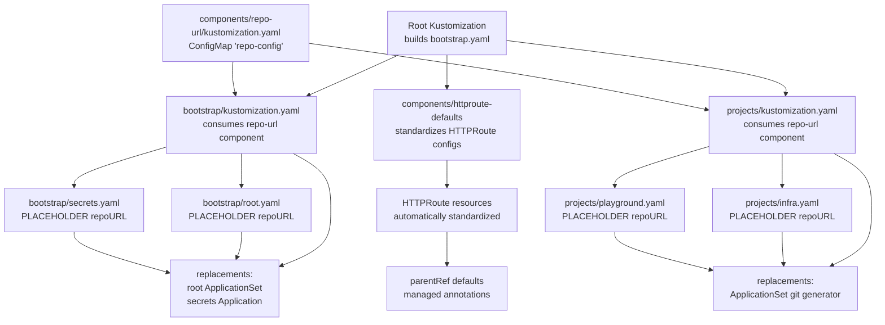
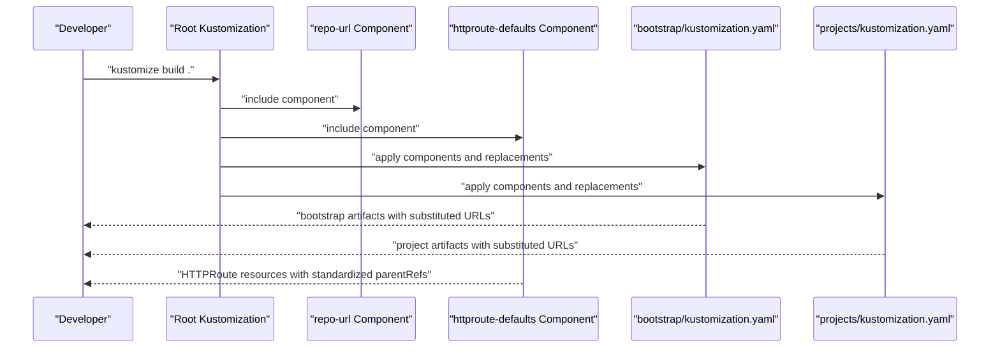
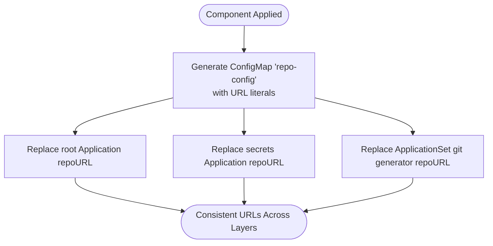
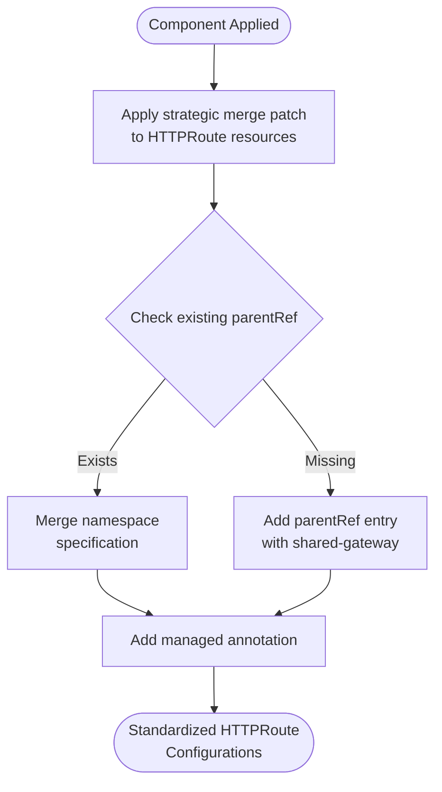
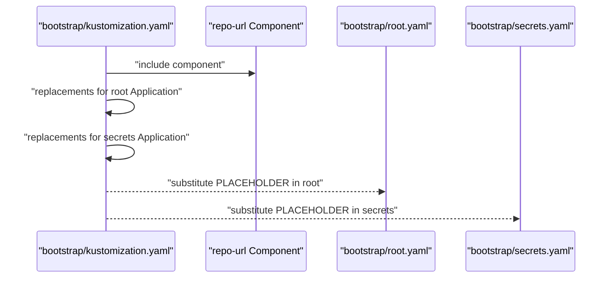
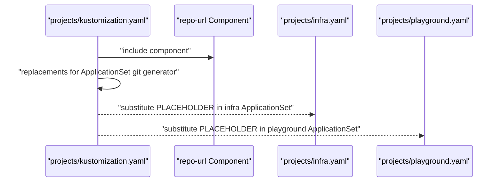
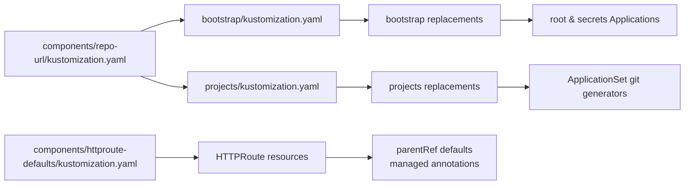
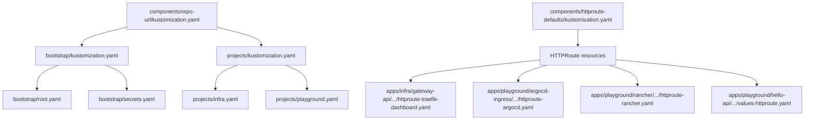

# Component-Based Design Patterns

<cite>
**Referenced Files in This Document**
- [README.md](file://README.md)
- [components/repo-url/kustomization.yaml](file://components/repo-url/kustomization.yaml)
- [components/httproute-defaults/kustomization.yaml](file://components/httproute-defaults/kustomization.yaml)
- [bootstrap/kustomization.yaml](file://bootstrap/kustomization.yaml)
- [bootstrap/root.yaml](file://bootstrap/root.yaml)
- [bootstrap/secrets.yaml](file://bootstrap/secrets.yaml)
- [projects/kustomization.yaml](file://projects/kustomization.yaml)
- [projects/infra.yaml](file://projects/infra.yaml)
- [projects/playground.yaml](file://projects/playground.yaml)
- [apps/infra/gateway-api/chart/httproute-traefik-dashboard.yaml](file://apps/infra/gateway-api/chart/httproute-traefik-dashboard.yaml)
- [apps/playground/argocd-ingress/chart/httproute-argocd.yaml](file://apps/playground/argocd-ingress/chart/httproute-argocd.yaml)
- [apps/playground/rancher/chart/httproute-rancher.yaml](file://apps/playground/rancher/chart/httproute-rancher.yaml)
- [apps/playground/hello-api/chart/values-httproute.yaml](file://apps/playground/hello-api/chart/values-httproute.yaml)
</cite>

## Update Summary
**Changes Made**
- Added documentation for the new HTTPRoute defaults component system
- Documented the centralized component approach that standardizes routing configurations
- Added examples of HTTPRoute parentRef standardization and annotation management
- Updated component analysis to include the new httproute-defaults component alongside repo-url

## Table of Contents
1. [Introduction](#introduction)
2. [Project Structure](#project-structure)
3. [Core Components](#core-components)
4. [Architecture Overview](#architecture-overview)
5. [Detailed Component Analysis](#detailed-component-analysis)
6. [Dependency Analysis](#dependency-analysis)
7. [Performance Considerations](#performance-considerations)
8. [Troubleshooting Guide](#troubleshooting-guide)
9. [Conclusion](#conclusion)

## Introduction
This document explains the component-based design patterns used across the repository to achieve reusable configuration templates and consistent behavior across multiple layers. The central theme is the use of Kustomize components to define shared configuration once and inject it into multiple targets, ensuring consistency, reducing duplication, and simplifying maintenance across environments. The repository now includes both the repo-url component (for centralized repository URL management) and the httproute-defaults component (for standardized HTTPRoute routing configurations), demonstrating how components serve as the central point for managing environment-specific customizations without duplicating configuration.

## Project Structure
The repository organizes configuration into layered components with two primary component types:
- **Repository URL Components**: Centralized management of repository URLs through the repo-url component
- **HTTPRoute Components**: Standardized routing configuration through the httproute-defaults component
- Root Kustomize builds bootstrap artifacts and injects component-defined values
- Bootstrap layer defines the initial ArgoCD Application and related resources
- Projects layer defines AppProjects and ApplicationSets that discover and deploy applications
- Components directory holds reusable templates consumed by higher layers

**Diagram sources**
- [README.md:87-118](file://README.md#L87-L118)
- [components/repo-url/kustomization.yaml:1-11](file://components/repo-url/kustomization.yaml#L1-L11)
- [components/httproute-defaults/kustomization.yaml:1-31](file://components/httproute-defaults/kustomization.yaml#L1-L31)
- [bootstrap/kustomization.yaml:1-38](file://bootstrap/kustomization.yaml#L1-L38)
- [projects/kustomization.yaml:1-22](file://projects/kustomization.yaml#L1-L22)
- [bootstrap/root.yaml:1-37](file://bootstrap/root.yaml#L1-L37)
- [bootstrap/secrets.yaml:1-24](file://bootstrap/secrets.yaml#L1-L24)
- [projects/infra.yaml:1-85](file://projects/infra.yaml#L1-L85)
- [projects/playground.yaml:1-90](file://projects/playground.yaml#L1-L90)

**Section sources**
- [README.md:57-118](file://README.md#L57-L118)
- [components/repo-url/kustomization.yaml:1-11](file://components/repo-url/kustomization.yaml#L1-L11)
- [components/httproute-defaults/kustomization.yaml:1-31](file://components/httproute-defaults/kustomization.yaml#L1-L31)
- [bootstrap/kustomization.yaml:1-38](file://bootstrap/kustomization.yaml#L1-L38)
- [projects/kustomization.yaml:1-22](file://projects/kustomization.yaml#L1-L22)

## Core Components
This section documents the reusable components and their roles in maintaining consistency across layers.

### Repository URL Component (repo-url)
- **Purpose**: Defines a shared ConfigMap containing repository URLs used across bootstrap and project configurations
- **Behavior**: Generates a ConfigMap named repo-config with literal values for manifest and secrets repositories. It disables name suffix hashing to keep the ConfigMap name stable for replacements
- **Consumption**: Both bootstrap and projects Kustomizations include this component and use replacements to substitute placeholder URLs in target resources

### HTTPRoute Defaults Component (httproute-defaults)
- **Purpose**: Standardizes HTTPRoute configurations across the entire cluster through centralized component management
- **Behavior**: Applies strategic merge patches to ensure all HTTPRoute resources consistently reference the shared-gateway in the gateway-api namespace and include managed annotations for tooling visibility
- **Mechanism**: Uses Kustomize patches to target HTTPRoute resources by parentRef "name" key, merging namespace specifications or adding parentRef entries as needed
- **Impact**: Eliminates manual parentRef configuration duplication and ensures consistent routing behavior across all HTTPRoute resources

Benefits of this approach:
- **Single source of truth for routing**: HTTPRoute defaults component provides centralized control over routing configurations
- **Environment-specific customization**: Changes to gateway references or annotations can be made in one place and propagated automatically
- **Reduced configuration duplication**: Eliminates repetitive parentRef specifications across multiple HTTPRoute resources
- **Maintenance simplicity**: Updates to routing standards require changes in one component location
- **Tooling integration**: Managed annotations enable better observability and automated tooling support

**Section sources**
- [components/repo-url/kustomization.yaml:1-11](file://components/repo-url/kustomization.yaml#L1-L11)
- [components/httproute-defaults/kustomization.yaml:1-31](file://components/httproute-defaults/kustomization.yaml#L1-L31)
- [bootstrap/kustomization.yaml:12-38](file://bootstrap/kustomization.yaml#L12-L38)
- [projects/kustomization.yaml:11-22](file://projects/kustomization.yaml#L11-L22)

## Architecture Overview
The system uses a layered approach with dual component systems:
- **Root Kustomization** builds bootstrap artifacts and consumes both repo-url and httproute-defaults components
- **Bootstrap Kustomization** applies the repo-url component and replaces placeholders in root and secrets Applications
- **Projects Kustomization** applies the repo-url component and replaces placeholders in ApplicationSets' git generators
- **HTTPRoute Defaults** component automatically standardizes routing configurations across all HTTPRoute resources
- **Replacement rules** map values from generated ConfigMap to target fields in ArgoCD resources
- **Strategic merge patches** ensure consistent HTTPRoute parentRef configurations

**Diagram sources**
- [README.md:57-75](file://README.md#L57-L75)
- [components/repo-url/kustomization.yaml:1-11](file://components/repo-url/kustomization.yaml#L1-L11)
- [components/httproute-defaults/kustomization.yaml:1-31](file://components/httproute-defaults/kustomization.yaml#L1-L31)
- [bootstrap/kustomization.yaml:1-38](file://bootstrap/kustomization.yaml#L1-L38)
- [projects/kustomization.yaml:1-22](file://projects/kustomization.yaml#L1-L22)

## Detailed Component Analysis

### Repository URL Component (repo-url)
- **Role**: Centralized repository URL provider
- **Mechanism**: Generates a stable-named ConfigMap with URL literals. Replacements target specific fields in ArgoCD resources
- **Impact**: Ensures bootstrap and project layers remain aligned with the same URLs without duplicating values

**Diagram sources**
- [components/repo-url/kustomization.yaml:1-11](file://components/repo-url/kustomization.yaml#L1-L11)
- [bootstrap/kustomization.yaml:12-38](file://bootstrap/kustomization.yaml#L12-L38)
- [projects/kustomization.yaml:11-22](file://projects/kustomization.yaml#L11-L22)

**Section sources**
- [components/repo-url/kustomization.yaml:1-11](file://components/repo-url/kustomization.yaml#L1-L11)

### HTTPRoute Defaults Component (httproute-defaults)
- **Role**: Centralized HTTPRoute configuration standardizer
- **Mechanism**: Applies strategic merge patches to HTTPRoute resources, ensuring consistent parentRef configurations and managed annotations
- **Behavior**: 
  - Ensures parentRefs[0] always references shared-gateway in gateway-api namespace
  - Adds routing.hoangvu75.space/managed annotation for tooling visibility
  - Merges namespace specifications for existing parentRef entries
  - Adds parentRef entries for routes without explicit parent references
- **Impact**: Eliminates manual HTTPRoute parentRef configuration duplication across the entire cluster

**Diagram sources**
- [components/httproute-defaults/kustomization.yaml:15-31](file://components/httproute-defaults/kustomization.yaml#L15-L31)

**Section sources**
- [components/httproute-defaults/kustomization.yaml:1-31](file://components/httproute-defaults/kustomization.yaml#L1-L31)

### Bootstrap Layer Integration
- **Consumes** repo-url component
- **Uses replacements** to substitute placeholder URLs in:
  - root Application's repoURL
  - secrets Application's repoURL
- **Ensures** the bootstrap chain starts with correct repository locations

**Diagram sources**
- [bootstrap/kustomization.yaml:4-38](file://bootstrap/kustomization.yaml#L4-L38)
- [bootstrap/root.yaml:15-17](file://bootstrap/root.yaml#L15-L17)
- [bootstrap/secrets.yaml:12-13](file://bootstrap/secrets.yaml#L12-L13)

**Section sources**
- [bootstrap/kustomization.yaml:4-38](file://bootstrap/kustomization.yaml#L4-L38)
- [bootstrap/root.yaml:15-17](file://bootstrap/root.yaml#L15-L17)
- [bootstrap/secrets.yaml:12-13](file://bootstrap/secrets.yaml#L12-L13)

### Projects Layer Integration
- **Consumes** repo-url component
- **Uses replacements** to substitute placeholder URLs in ApplicationSet git generators
- **Enables** consistent discovery and deployment across infra and playground projects

**Diagram sources**
- [projects/kustomization.yaml:4-22](file://projects/kustomization.yaml#L4-L22)
- [projects/infra.yaml:35](file://projects/infra.yaml#L35)
- [projects/playground.yaml:35](file://projects/playground.yaml#L35)

**Section sources**
- [projects/kustomization.yaml:4-22](file://projects/kustomization.yaml#L4-L22)
- [projects/infra.yaml:35](file://projects/infra.yaml#L35)
- [projects/playground.yaml:35](file://projects/playground.yaml#L35)

### Component Inheritance and Composition Patterns
- **Inheritance pattern**: Higher-layer Kustomizations inherit behavior from both repo-url and httproute-defaults components without duplicating values
- **Composition pattern**: Multiple layers (bootstrap and projects) compose the same components, ensuring consistent URL substitution and HTTPRoute standardization across the entire pipeline
- **Customization pattern**: Environment-specific overrides can be introduced by adjusting component values; replacements and patches propagate to all targets

**Diagram sources**
- [components/repo-url/kustomization.yaml:1-11](file://components/repo-url/kustomization.yaml#L1-L11)
- [components/httproute-defaults/kustomization.yaml:1-31](file://components/httproute-defaults/kustomization.yaml#L1-L31)
- [bootstrap/kustomization.yaml:4-38](file://bootstrap/kustomization.yaml#L4-L38)
- [projects/kustomization.yaml:4-22](file://projects/kustomization.yaml#L4-L22)

**Section sources**
- [components/repo-url/kustomization.yaml:1-11](file://components/repo-url/kustomization.yaml#L1-L11)
- [components/httproute-defaults/kustomization.yaml:1-31](file://components/httproute-defaults/kustomization.yaml#L1-L31)
- [bootstrap/kustomization.yaml:4-38](file://bootstrap/kustomization.yaml#L4-L38)
- [projects/kustomization.yaml:4-22](file://projects/kustomization.yaml#L4-L22)

## Dependency Analysis
The dependencies between components and their consumers are straightforward:
- **bootstrap/kustomization.yaml** depends on components/repo-url
- **projects/kustomization.yaml** depends on components/repo-url
- **HTTPRoute resources** depend on components/httproute-defaults for standardized configurations
- **Both** use replacements to connect generated ConfigMap to target resources
- **HTTPRoute defaults** component applies strategic merge patches to target HTTPRoute resources

**Diagram sources**
- [components/repo-url/kustomization.yaml:1-11](file://components/repo-url/kustomization.yaml#L1-L11)
- [components/httproute-defaults/kustomization.yaml:1-31](file://components/httproute-defaults/kustomization.yaml#L1-L31)
- [bootstrap/kustomization.yaml:4-38](file://bootstrap/kustomization.yaml#L4-L38)
- [projects/kustomization.yaml:4-22](file://projects/kustomization.yaml#L4-L22)
- [bootstrap/root.yaml:15-17](file://bootstrap/root.yaml#L15-L17)
- [bootstrap/secrets.yaml:12-13](file://bootstrap/secrets.yaml#L12-L13)
- [projects/infra.yaml:35](file://projects/infra.yaml#L35)
- [projects/playground.yaml:35](file://projects/playground.yaml#L35)
- [apps/infra/gateway-api/chart/httproute-traefik-dashboard.yaml:1-30](file://apps/infra/gateway-api/chart/httproute-traefik-dashboard.yaml#L1-L30)
- [apps/playground/argocd-ingress/chart/httproute-argocd.yaml:1-29](file://apps/playground/argocd-ingress/chart/httproute-argocd.yaml#L1-L29)
- [apps/playground/rancher/chart/httproute-rancher.yaml:1-30](file://apps/playground/rancher/chart/httproute-rancher.yaml#L1-L30)
- [apps/playground/hello-api/chart/values-httproute.yaml:1-26](file://apps/playground/hello-api/chart/values-httproute.yaml#L1-L26)

**Section sources**
- [bootstrap/kustomization.yaml:4-38](file://bootstrap/kustomization.yaml#L4-L38)
- [projects/kustomization.yaml:4-22](file://projects/kustomization.yaml#L4-L22)
- [components/httproute-defaults/kustomization.yaml:15-31](file://components/httproute-defaults/kustomization.yaml#L15-L31)

## Performance Considerations
- **Stable ConfigMap naming**: Disabling name suffix hashing in the repo-url component avoids unnecessary churn in downstream resources, improving sync predictability
- **Minimal replacements**: Using targeted replacements limits the scope of transformations, keeping the build and sync processes efficient
- **Layered composition**: Applying the same components across layers reduces duplication and speeds up maintenance without impacting runtime performance
- **Strategic merge patches**: HTTPRoute defaults component uses efficient patch strategies that minimize resource modifications while ensuring consistency
- **Centralized management**: Both component types reduce configuration overhead by eliminating repetitive settings across multiple resources

## Troubleshooting Guide
Common issues and resolutions:
- **Placeholder URLs not substituted**
  - Verify that bootstrap and projects Kustomizations include the repo-url component and define replacements targeting the correct fields
  - Confirm the generated ConfigMap name matches the replacement source
- **Incorrect repository URLs in ArgoCD**
  - Check the repo-url component values and ensure they match the intended manifest and secrets repositories
  - Validate that replacements are configured for all target resources (root Application, secrets Application, and ApplicationSet git generators)
- **HTTPRoute parentRef configuration issues**
  - Verify that the httproute-defaults component is included in kustomization.yaml files containing HTTPRoute resources
  - Check that HTTPRoute resources are being processed by the strategic merge patch (target kind matches HTTPRoute)
  - Ensure parentRef specifications are not conflicting with component defaults
- **Managed annotations missing**
  - Confirm the httproute-defaults component is properly included and processing HTTPRoute resources
  - Verify that the routing.hoangvu75.space/managed annotation is being added during component application
- **Sync order anomalies**
  - Review sync-wave annotations in target resources to ensure proper sequencing relative to the bootstrap and project layers
  - Check that HTTPRoute resources are being processed after gateway resources are available

**Section sources**
- [components/repo-url/kustomization.yaml:1-11](file://components/repo-url/kustomization.yaml#L1-L11)
- [components/httproute-defaults/kustomization.yaml:1-31](file://components/httproute-defaults/kustomization.yaml#L1-L31)
- [bootstrap/kustomization.yaml:12-38](file://bootstrap/kustomization.yaml#L12-L38)
- [projects/kustomization.yaml:11-22](file://projects/kustomization.yaml#L11-L22)
- [bootstrap/root.yaml:15-17](file://bootstrap/root.yaml#L15-L17)
- [bootstrap/secrets.yaml:12-13](file://bootstrap/secrets.yaml#L12-L13)
- [projects/infra.yaml:35](file://projects/infra.yaml#L35)
- [projects/playground.yaml:35](file://projects/playground.yaml#L35)

## Conclusion
The component-based design leverages Kustomize components to centralize configuration management and enforce consistency across bootstrap, project, and HTTPRoute layers. The dual-component system (repo-url and httproute-defaults) demonstrates how components serve as the central point for managing environment-specific customizations without duplicating configuration. By applying the repo-url component for repository URL management and the httproute-defaults component for HTTPRoute standardization, the system eliminates duplication, simplifies maintenance, and supports environment-specific customization through single sources of truth. This approach scales effectively as new layers or environments are introduced, preserving alignment and reducing operational overhead while ensuring consistent routing behavior across the entire cluster.