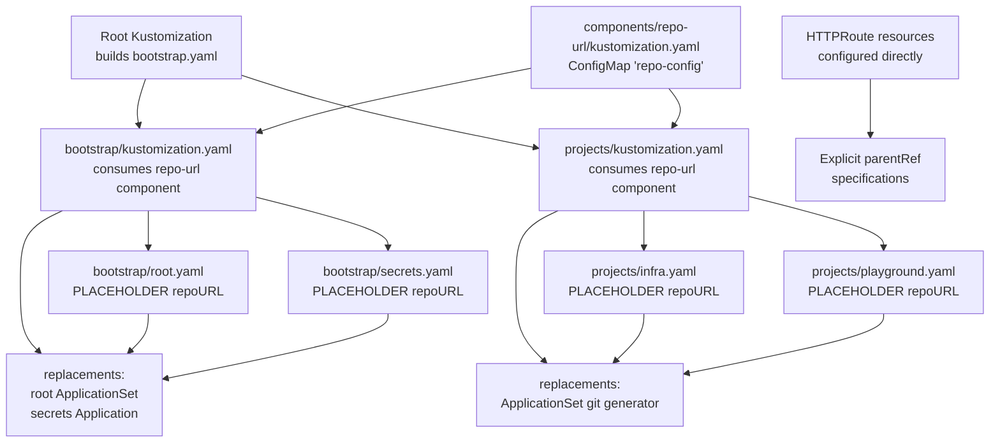
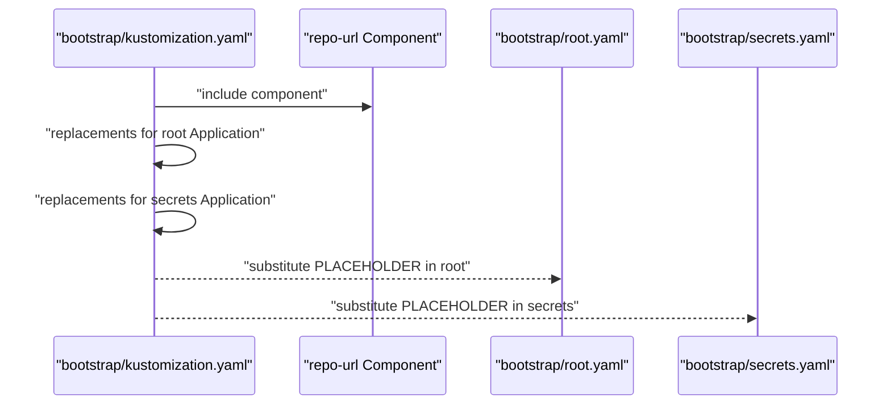
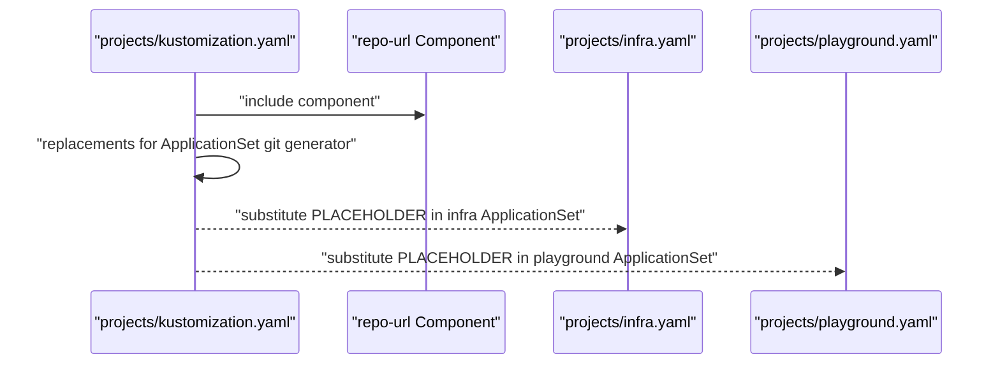
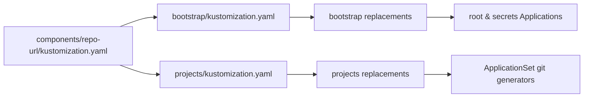
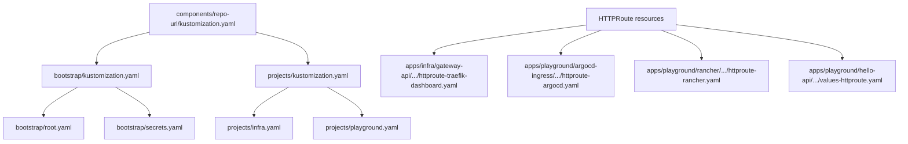

# Component-Based Design Patterns

<cite>
**Referenced Files in This Document**
- [README.md](file://README.md)
- [components/repo-url/kustomization.yaml](file://components/repo-url/kustomization.yaml)
- [bootstrap/kustomization.yaml](file://bootstrap/kustomization.yaml)
- [bootstrap/root.yaml](file://bootstrap/root.yaml)
- [bootstrap/secrets.yaml](file://bootstrap/secrets.yaml)
- [projects/kustomization.yaml](file://projects/kustomization.yaml)
- [projects/infra.yaml](file://projects/infra.yaml)
- [projects/playground.yaml](file://projects/playground.yaml)
- [apps/infra/gateway-api/chart/httproute-traefik-dashboard.yaml](file://apps/infra/gateway-api/chart/httproute-traefik-dashboard.yaml)
- [apps/playground/argocd-ingress/chart/httproute-argocd.yaml](file://apps/playground/argocd-ingress/chart/httproute-argocd.yaml)
- [apps/playground/rancher/chart/httproute-rancher.yaml](file://apps/playground/rancher/chart/httproute-rancher.yaml)
- [apps/playground/hello-api/chart/values-httproute.yaml](file://apps/playground/hello-api/chart/values-httproute.yaml)
</cite>

## Update Summary
**Changes Made**
- Removed documentation for the httproute-defaults component that was completely eliminated
- Updated architecture overview to reflect direct HTTPRoute configuration approach
- Removed references to strategic merge patches and centralized parentRef enforcement
- Revised component analysis to focus solely on repo-url component and direct HTTPRoute configuration
- Updated troubleshooting guide to remove HTTPRoute defaults-related issues
- Modified dependency analysis to show direct HTTPRoute resource dependencies

## Table of Contents
1. [Introduction](#introduction)
2. [Project Structure](#project-structure)
3. [Core Components](#core-components)
4. [Architecture Overview](#architecture-overview)
5. [Detailed Component Analysis](#detailed-component-analysis)
6. [Dependency Analysis](#dependency-analysis)
7. [Performance Considerations](#performance-considerations)
8. [Troubleshooting Guide](#troubleshooting-guide)
9. [Conclusion](#conclusion)

## Introduction
This document explains the component-based design patterns used across the repository to achieve reusable configuration templates and consistent behavior across multiple layers. The central theme is the use of Kustomize components to define shared configuration once and inject it into multiple targets, ensuring consistency, reducing duplication, and simplifying maintenance across environments. The repository currently focuses on the repo-url component (for centralized repository URL management) and direct HTTPRoute configuration patterns, demonstrating how components serve as the central point for managing environment-specific customizations without duplicating configuration.

## Project Structure
The repository organizes configuration into layered components with a single primary component type:
- **Repository URL Components**: Centralized management of repository URLs through the repo-url component
- Root Kustomize builds bootstrap artifacts and injects component-defined values
- Bootstrap layer defines the initial ArgoCD Application and related resources
- Projects layer defines AppProjects and ApplicationSets that discover and deploy applications
- Components directory holds reusable templates consumed by higher layers
- HTTPRoute resources are configured directly with explicit parentRef specifications

**Diagram sources**
- [README.md:87-118](file://README.md#L87-L118)
- [components/repo-url/kustomization.yaml:1-13](file://components/repo-url/kustomization.yaml#L1-L13)
- [bootstrap/kustomization.yaml:1-63](file://bootstrap/kustomization.yaml#L1-L63)
- [projects/kustomization.yaml:1-31](file://projects/kustomization.yaml#L1-L31)
- [bootstrap/root.yaml:1-37](file://bootstrap/root.yaml#L1-L37)
- [bootstrap/secrets.yaml:1-24](file://bootstrap/secrets.yaml#L1-L24)
- [projects/infra.yaml:1-85](file://projects/infra.yaml#L1-L85)
- [projects/playground.yaml:1-85](file://projects/playground.yaml#L1-L85)

**Section sources**
- [README.md:57-118](file://README.md#L57-L118)
- [components/repo-url/kustomization.yaml:1-13](file://components/repo-url/kustomization.yaml#L1-L13)
- [bootstrap/kustomization.yaml:1-63](file://bootstrap/kustomization.yaml#L1-L63)
- [projects/kustomization.yaml:1-31](file://projects/kustomization.yaml#L1-L31)

## Core Components
This section documents the reusable components and their roles in maintaining consistency across layers.

### Repository URL Component (repo-url)
- **Purpose**: Defines a shared ConfigMap containing repository URLs used across bootstrap and project configurations
- **Behavior**: Generates a ConfigMap named repo-config with literal values for manifest and secrets repositories. It disables name suffix hashing to keep the ConfigMap name stable for replacements
- **Consumption**: Both bootstrap and projects Kustomizations include this component and use replacements to substitute placeholder URLs in target resources

Benefits of this approach:
- **Single source of truth for repository URLs**: repo-url component provides centralized control over URL configurations
- **Environment-specific customization**: Changes to repository URLs can be made in one place and propagated automatically
- **Reduced configuration duplication**: Eliminates repetitive URL specifications across multiple ArgoCD resources
- **Maintenance simplicity**: Updates to repository locations require changes in one component location
- **Tooling integration**: Stable ConfigMap naming enables predictable resource management

**Section sources**
- [components/repo-url/kustomization.yaml:1-13](file://components/repo-url/kustomization.yaml#L1-L13)
- [bootstrap/kustomization.yaml:12-63](file://bootstrap/kustomization.yaml#L12-L63)
- [projects/kustomization.yaml:11-31](file://projects/kustomization.yaml#L11-L31)

## Architecture Overview
The system uses a layered approach with a single component system:
- **Root Kustomization** builds bootstrap artifacts and consumes the repo-url component
- **Bootstrap Kustomization** applies the repo-url component and replaces placeholders in root and secrets Applications
- **Projects Kustomization** applies the repo-url component and replaces placeholders in ApplicationSets' git generators
- **HTTPRoute resources** are configured directly with explicit parentRef specifications
- **Replacement rules** map values from generated ConfigMap to target fields in ArgoCD resources
- **Direct configuration** eliminates the need for centralized HTTPRoute standardization

**Diagram sources**
- [README.md:57-75](file://README.md#L57-L75)
- [components/repo-url/kustomization.yaml:1-13](file://components/repo-url/kustomization.yaml#L1-L13)
- [bootstrap/kustomization.yaml:1-63](file://bootstrap/kustomization.yaml#L1-L63)
- [projects/kustomization.yaml:1-31](file://projects/kustomization.yaml#L1-L31)

## Detailed Component Analysis

### Repository URL Component (repo-url)
- **Role**: Centralized repository URL provider
- **Mechanism**: Generates a stable-named ConfigMap with URL literals. Replacements target specific fields in ArgoCD resources
- **Impact**: Ensures bootstrap and project layers remain aligned with the same URLs without duplicating values

**Diagram sources**
- [components/repo-url/kustomization.yaml:1-13](file://components/repo-url/kustomization.yaml#L1-L13)
- [bootstrap/kustomization.yaml:12-63](file://bootstrap/kustomization.yaml#L12-L63)
- [projects/kustomization.yaml:11-31](file://projects/kustomization.yaml#L11-L31)

**Section sources**
- [components/repo-url/kustomization.yaml:1-13](file://components/repo-url/kustomization.yaml#L1-L13)

### Bootstrap Layer Integration
- **Consumes** repo-url component
- **Uses replacements** to substitute placeholder URLs in:
  - root Application's repoURL
  - secrets Application's repoURL
- **Ensures** the bootstrap chain starts with correct repository locations

**Diagram sources**
- [bootstrap/kustomization.yaml:4-63](file://bootstrap/kustomization.yaml#L4-L63)
- [bootstrap/root.yaml:15-18](file://bootstrap/root.yaml#L15-L18)
- [bootstrap/secrets.yaml:12-14](file://bootstrap/secrets.yaml#L12-L14)

**Section sources**
- [bootstrap/kustomization.yaml:4-63](file://bootstrap/kustomization.yaml#L4-L63)
- [bootstrap/root.yaml:15-18](file://bootstrap/root.yaml#L15-L18)
- [bootstrap/secrets.yaml:12-14](file://bootstrap/secrets.yaml#L12-L14)

### Projects Layer Integration
- **Consumes** repo-url component
- **Uses replacements** to substitute placeholder URLs in ApplicationSet git generators
- **Enables** consistent discovery and deployment across infra and playground projects

**Diagram sources**
- [projects/kustomization.yaml:4-31](file://projects/kustomization.yaml#L4-L31)
- [projects/infra.yaml:34-45](file://projects/infra.yaml#L34-L45)
- [projects/playground.yaml:34-45](file://projects/playground.yaml#L34-L45)

**Section sources**
- [projects/kustomization.yaml:4-31](file://projects/kustomization.yaml#L4-L31)
- [projects/infra.yaml:34-45](file://projects/infra.yaml#L34-L45)
- [projects/playground.yaml:34-45](file://projects/playground.yaml#L34-L45)

### Component Inheritance and Composition Patterns
- **Inheritance pattern**: Higher-layer Kustomizations inherit behavior from the repo-url component without duplicating values
- **Composition pattern**: Multiple layers (bootstrap and projects) compose the same component, ensuring consistent URL substitution across the entire pipeline
- **Customization pattern**: Environment-specific overrides can be introduced by adjusting component values; replacements propagate to all targets

**Diagram sources**
- [components/repo-url/kustomization.yaml:1-13](file://components/repo-url/kustomization.yaml#L1-L13)
- [bootstrap/kustomization.yaml:4-63](file://bootstrap/kustomization.yaml#L4-L63)
- [projects/kustomization.yaml:4-31](file://projects/kustomization.yaml#L4-L31)

**Section sources**
- [components/repo-url/kustomization.yaml:1-13](file://components/repo-url/kustomization.yaml#L1-L13)
- [bootstrap/kustomization.yaml:4-63](file://bootstrap/kustomization.yaml#L4-L63)
- [projects/kustomization.yaml:4-31](file://projects/kustomization.yaml#L4-L31)

## Dependency Analysis
The dependencies between components and their consumers are straightforward:
- **bootstrap/kustomization.yaml** depends on components/repo-url
- **projects/kustomization.yaml** depends on components/repo-url
- **HTTPRoute resources** depend directly on gateway resources and contain explicit parentRef configurations
- **Both** use replacements to connect generated ConfigMap to target resources
- **HTTPRoute resources** are configured directly without centralized component standardization

**Diagram sources**
- [components/repo-url/kustomization.yaml:1-13](file://components/repo-url/kustomization.yaml#L1-L13)
- [bootstrap/kustomization.yaml:4-63](file://bootstrap/kustomization.yaml#L4-L63)
- [projects/kustomization.yaml:4-31](file://projects/kustomization.yaml#L4-L31)
- [bootstrap/root.yaml:15-18](file://bootstrap/root.yaml#L15-L18)
- [bootstrap/secrets.yaml:12-14](file://bootstrap/secrets.yaml#L12-L14)
- [projects/infra.yaml:34-45](file://projects/infra.yaml#L34-L45)
- [projects/playground.yaml:34-45](file://projects/playground.yaml#L34-L45)
- [apps/infra/gateway-api/chart/httproute-traefik-dashboard.yaml:1-30](file://apps/infra/gateway-api/chart/httproute-traefik-dashboard.yaml#L1-L30)
- [apps/playground/argocd-ingress/chart/httproute-argocd.yaml:1-29](file://apps/playground/argocd-ingress/chart/httproute-argocd.yaml#L1-L29)
- [apps/playground/rancher/chart/httproute-rancher.yaml:1-30](file://apps/playground/rancher/chart/httproute-rancher.yaml#L1-L30)
- [apps/playground/hello-api/chart/values-httproute.yaml:1-26](file://apps/playground/hello-api/chart/values-httproute.yaml#L1-L26)

**Section sources**
- [bootstrap/kustomization.yaml:4-63](file://bootstrap/kustomization.yaml#L4-L63)
- [projects/kustomization.yaml:4-31](file://projects/kustomization.yaml#L4-L31)

## Performance Considerations
- **Stable ConfigMap naming**: Disabling name suffix hashing in the repo-url component avoids unnecessary churn in downstream resources, improving sync predictability
- **Minimal replacements**: Using targeted replacements limits the scope of transformations, keeping the build and sync processes efficient
- **Layered composition**: Applying the same component across layers reduces duplication and speeds up maintenance without impacting runtime performance
- **Direct configuration**: HTTPRoute resources are configured directly without centralized component processing, reducing complexity and potential failure points
- **Centralized management**: The single component reduces configuration overhead by eliminating repetitive settings across multiple resources

## Troubleshooting Guide
Common issues and resolutions:
- **Placeholder URLs not substituted**
  - Verify that bootstrap and projects Kustomizations include the repo-url component and define replacements targeting the correct fields
  - Confirm the generated ConfigMap name matches the replacement source
- **Incorrect repository URLs in ArgoCD**
  - Check the repo-url component values and ensure they match the intended manifest and secrets repositories
  - Validate that replacements are configured for all target resources (root Application, secrets Application, and ApplicationSet git generators)
- **HTTPRoute parentRef configuration issues**
  - Verify that HTTPRoute resources contain explicit parentRef specifications pointing to the shared-gateway in the gateway-api namespace
  - Check that HTTPRoute resources specify the correct namespace for parent references
  - Ensure parentRef specifications match the actual gateway resource configuration
- **Sync order anomalies**
  - Review sync-wave annotations in target resources to ensure proper sequencing relative to the bootstrap and project layers
  - Check that HTTPRoute resources have appropriate sync waves (typically wave 3) to ensure they sync after gateways are available
- **Gateway connectivity problems**
  - Verify that the shared-gateway resource exists in the gateway-api namespace before HTTPRoute resources attempt to reference it
  - Check that gateway resources are deployed in the correct namespace and have proper status

**Section sources**
- [components/repo-url/kustomization.yaml:1-13](file://components/repo-url/kustomization.yaml#L1-L13)
- [bootstrap/kustomization.yaml:12-63](file://bootstrap/kustomization.yaml#L12-L63)
- [projects/kustomization.yaml:11-31](file://projects/kustomization.yaml#L11-L31)
- [bootstrap/root.yaml:15-18](file://bootstrap/root.yaml#L15-L18)
- [bootstrap/secrets.yaml:12-14](file://bootstrap/secrets.yaml#L12-L14)
- [projects/infra.yaml:34-45](file://projects/infra.yaml#L34-L45)
- [projects/playground.yaml:34-45](file://projects/playground.yaml#L34-L45)

## Conclusion
The component-based design leverages Kustomize components to centralize configuration management and enforce consistency across bootstrap and project layers. The current system focuses on the repo-url component for repository URL management, demonstrating how components serve as the central point for managing environment-specific customizations without duplicating configuration. By applying the repo-url component for centralized URL management, the system eliminates duplication, simplifies maintenance, and supports environment-specific customization through a single source of truth. This approach scales effectively as new layers or environments are introduced, preserving alignment and reducing operational overhead while ensuring consistent repository configuration across the entire cluster.