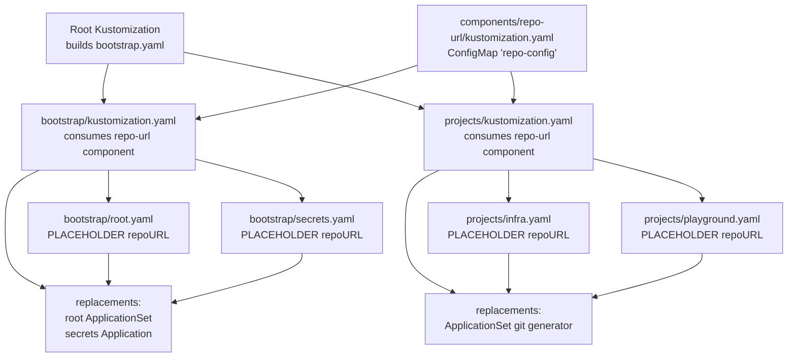
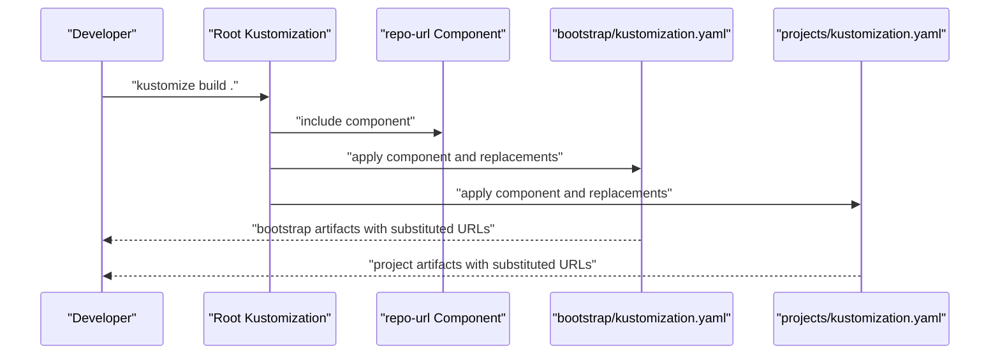
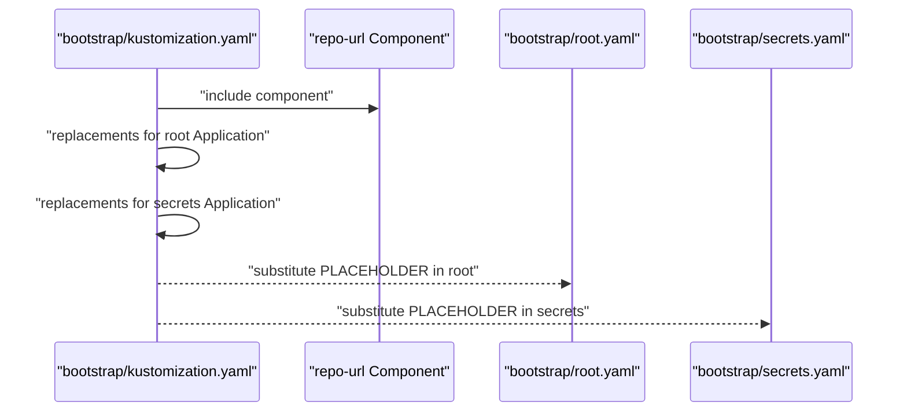
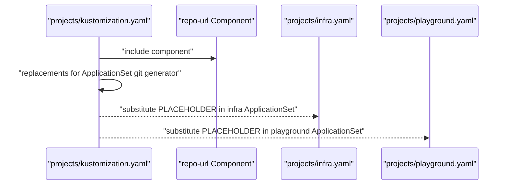
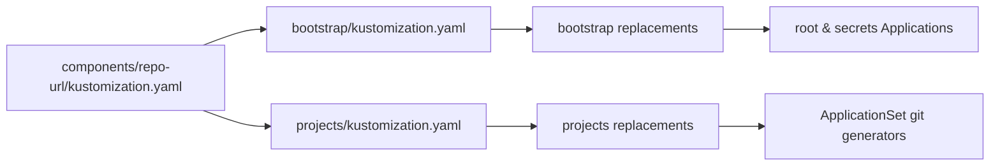
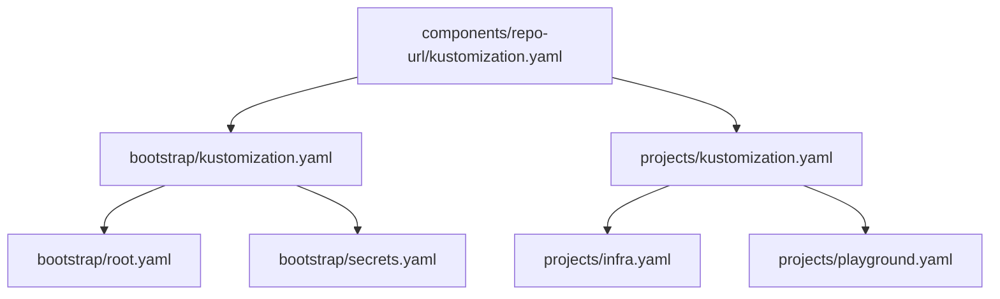

# Component-Based Design Patterns

<cite>
**Referenced Files in This Document**
- [README.md](file://README.md)
- [components/repo-url/kustomization.yaml](file://components/repo-url/kustomization.yaml)
- [bootstrap/kustomization.yaml](file://bootstrap/kustomization.yaml)
- [bootstrap/root.yaml](file://bootstrap/root.yaml)
- [bootstrap/secrets.yaml](file://bootstrap/secrets.yaml)
- [projects/kustomization.yaml](file://projects/kustomization.yaml)
- [projects/infra.yaml](file://projects/infra.yaml)
- [projects/playground.yaml](file://projects/playground.yaml)
</cite>

## Table of Contents
1. [Introduction](#introduction)
2. [Project Structure](#project-structure)
3. [Core Components](#core-components)
4. [Architecture Overview](#architecture-overview)
5. [Detailed Component Analysis](#detailed-component-analysis)
6. [Dependency Analysis](#dependency-analysis)
7. [Performance Considerations](#performance-considerations)
8. [Troubleshooting Guide](#troubleshooting-guide)
9. [Conclusion](#conclusion)

## Introduction
This document explains the component-based design patterns used across the repository to achieve reusable configuration templates and consistent behavior across multiple layers. The central theme is the use of Kustomize components to define shared configuration once and inject it into multiple targets, ensuring consistency, reducing duplication, and simplifying maintenance across environments. The repo-url component serves as the single source of truth for repository URLs, while bootstrap and project configurations consume this component to maintain alignment between the root bootstrap process and per-project ApplicationSets.

## Project Structure
The repository organizes configuration into layered components:
- Root Kustomize builds bootstrap artifacts and injects component-defined values.
- Bootstrap layer defines the initial ArgoCD Application and related resources, consuming the repo-url component.
- Projects layer defines AppProjects and ApplicationSets that discover and deploy applications, also consuming the repo-url component.
- Components directory holds reusable templates (repo-url) consumed by higher layers.

**Diagram sources**
- [README.md:87-118](file://README.md#L87-L118)
- [components/repo-url/kustomization.yaml:1-11](file://components/repo-url/kustomization.yaml#L1-L11)
- [bootstrap/kustomization.yaml:1-38](file://bootstrap/kustomization.yaml#L1-L38)
- [projects/kustomization.yaml:1-22](file://projects/kustomization.yaml#L1-L22)
- [bootstrap/root.yaml:1-37](file://bootstrap/root.yaml#L1-L37)
- [bootstrap/secrets.yaml:1-24](file://bootstrap/secrets.yaml#L1-L24)
- [projects/infra.yaml:1-85](file://projects/infra.yaml#L1-L85)
- [projects/playground.yaml:1-90](file://projects/playground.yaml#L1-L90)

**Section sources**
- [README.md:57-118](file://README.md#L57-L118)
- [components/repo-url/kustomization.yaml:1-11](file://components/repo-url/kustomization.yaml#L1-L11)
- [bootstrap/kustomization.yaml:1-38](file://bootstrap/kustomization.yaml#L1-L38)
- [projects/kustomization.yaml:1-22](file://projects/kustomization.yaml#L1-L22)

## Core Components
This section documents the reusable components and their roles in maintaining consistency across layers.

- repo-url component
  - Purpose: Defines a shared ConfigMap containing repository URLs used across bootstrap and project configurations.
  - Behavior: Generates a ConfigMap named repo-config with literal values for manifest and secrets repositories. It disables name suffix hashing to keep the ConfigMap name stable for replacements.
  - Consumption: Both bootstrap and projects Kustomizations include this component and use replacements to substitute placeholder URLs in target resources.

- repo-config-bootstrap and repo-config-projects
  - These are conceptual components referenced in the documentation objective. They represent logical groupings of configuration that align with bootstrap and project layers respectively. While the actual implementation uses the repo-url component and explicit replacements, the conceptual grouping helps explain how the same shared values are applied consistently across bootstrap and project contexts.

Benefits of this approach:
- Single source of truth for repository URLs reduces duplication and ensures consistency.
- Environment-specific customization is achieved by changing the component values once; downstream replacements propagate automatically.
- Maintenance simplicity: updates to repository URLs require changes in one place.

**Section sources**
- [components/repo-url/kustomization.yaml:1-11](file://components/repo-url/kustomization.yaml#L1-L11)
- [bootstrap/kustomization.yaml:12-38](file://bootstrap/kustomization.yaml#L12-L38)
- [projects/kustomization.yaml:11-22](file://projects/kustomization.yaml#L11-L22)

## Architecture Overview
The system uses a layered approach:
- Root Kustomization builds bootstrap artifacts and consumes the repo-url component.
- Bootstrap Kustomization applies the component and replaces placeholders in root and secrets Applications.
- Projects Kustomization applies the component and replaces placeholders in ApplicationSets’ git generators.
- Replacement rules map values from the generated ConfigMap to target fields in ArgoCD resources.

**Diagram sources**
- [README.md:57-75](file://README.md#L57-L75)
- [components/repo-url/kustomization.yaml:1-11](file://components/repo-url/kustomization.yaml#L1-L11)
- [bootstrap/kustomization.yaml:1-38](file://bootstrap/kustomization.yaml#L1-L38)
- [projects/kustomization.yaml:1-22](file://projects/kustomization.yaml#L1-L22)

## Detailed Component Analysis

### repo-url Component
- Role: Centralized repository URL provider.
- Mechanism: Generates a stable-named ConfigMap with URL literals. Replacements target specific fields in ArgoCD resources.
- Impact: Ensures bootstrap and project layers remain aligned with the same URLs without duplicating values.

**Diagram sources**
- [components/repo-url/kustomization.yaml:1-11](file://components/repo-url/kustomization.yaml#L1-L11)
- [bootstrap/kustomization.yaml:12-38](file://bootstrap/kustomization.yaml#L12-L38)
- [projects/kustomization.yaml:11-22](file://projects/kustomization.yaml#L11-L22)

**Section sources**
- [components/repo-url/kustomization.yaml:1-11](file://components/repo-url/kustomization.yaml#L1-L11)

### Bootstrap Layer Integration
- Consumes repo-url component.
- Uses replacements to substitute placeholder URLs in:
  - root Application’s repoURL.
  - secrets Application’s repoURL.
- Ensures the bootstrap chain starts with correct repository locations.

**Diagram sources**
- [bootstrap/kustomization.yaml:4-38](file://bootstrap/kustomization.yaml#L4-L38)
- [bootstrap/root.yaml:15-17](file://bootstrap/root.yaml#L15-L17)
- [bootstrap/secrets.yaml:12-13](file://bootstrap/secrets.yaml#L12-L13)

**Section sources**
- [bootstrap/kustomization.yaml:4-38](file://bootstrap/kustomization.yaml#L4-L38)
- [bootstrap/root.yaml:15-17](file://bootstrap/root.yaml#L15-L17)
- [bootstrap/secrets.yaml:12-13](file://bootstrap/secrets.yaml#L12-L13)

### Projects Layer Integration
- Consumes repo-url component.
- Uses replacements to substitute placeholder URLs in ApplicationSet git generators.
- Enables consistent discovery and deployment across infra and playground projects.

**Diagram sources**
- [projects/kustomization.yaml:4-22](file://projects/kustomization.yaml#L4-L22)
- [projects/infra.yaml:35](file://projects/infra.yaml#L35)
- [projects/playground.yaml:35](file://projects/playground.yaml#L35)

**Section sources**
- [projects/kustomization.yaml:4-22](file://projects/kustomization.yaml#L4-L22)
- [projects/infra.yaml:35](file://projects/infra.yaml#L35)
- [projects/playground.yaml:35](file://projects/playground.yaml#L35)

### Component Inheritance and Composition Patterns
- Inheritance pattern: Higher-layer Kustomizations inherit behavior from the repo-url component without duplicating values.
- Composition pattern: Multiple layers (bootstrap and projects) compose the same component, ensuring consistent URL substitution across the entire pipeline.
- Customization pattern: Environment-specific overrides can be introduced by adjusting the repo-url component values; replacements propagate to all targets.

**Diagram sources**
- [components/repo-url/kustomization.yaml:1-11](file://components/repo-url/kustomization.yaml#L1-L11)
- [bootstrap/kustomization.yaml:4-38](file://bootstrap/kustomization.yaml#L4-L38)
- [projects/kustomization.yaml:4-22](file://projects/kustomization.yaml#L4-L22)

**Section sources**
- [components/repo-url/kustomization.yaml:1-11](file://components/repo-url/kustomization.yaml#L1-L11)
- [bootstrap/kustomization.yaml:4-38](file://bootstrap/kustomization.yaml#L4-L38)
- [projects/kustomization.yaml:4-22](file://projects/kustomization.yaml#L4-L22)

## Dependency Analysis
The dependencies between components and their consumers are straightforward:
- bootstrap/kustomization.yaml depends on components/repo-url.
- projects/kustomization.yaml depends on components/repo-url.
- Both use replacements to connect the generated ConfigMap to target resources.

**Diagram sources**
- [components/repo-url/kustomization.yaml:1-11](file://components/repo-url/kustomization.yaml#L1-L11)
- [bootstrap/kustomization.yaml:4-38](file://bootstrap/kustomization.yaml#L4-L38)
- [projects/kustomization.yaml:4-22](file://projects/kustomization.yaml#L4-L22)
- [bootstrap/root.yaml:15-17](file://bootstrap/root.yaml#L15-L17)
- [bootstrap/secrets.yaml:12-13](file://bootstrap/secrets.yaml#L12-L13)
- [projects/infra.yaml:35](file://projects/infra.yaml#L35)
- [projects/playground.yaml:35](file://projects/playground.yaml#L35)

**Section sources**
- [bootstrap/kustomization.yaml:4-38](file://bootstrap/kustomization.yaml#L4-L38)
- [projects/kustomization.yaml:4-22](file://projects/kustomization.yaml#L4-L22)

## Performance Considerations
- Stable ConfigMap naming: Disabling name suffix hashing in the repo-url component avoids unnecessary churn in downstream resources, improving sync predictability.
- Minimal replacements: Using targeted replacements limits the scope of transformations, keeping the build and sync processes efficient.
- Layered composition: Applying the same component across layers reduces duplication and speeds up maintenance without impacting runtime performance.

## Troubleshooting Guide
Common issues and resolutions:
- Placeholder URLs not substituted
  - Verify that bootstrap and projects Kustomizations include the repo-url component and define replacements targeting the correct fields.
  - Confirm the generated ConfigMap name matches the replacement source.
- Incorrect repository URLs in ArgoCD
  - Check the repo-url component values and ensure they match the intended manifest and secrets repositories.
  - Validate that replacements are configured for all target resources (root Application, secrets Application, and ApplicationSet git generators).
- Sync order anomalies
  - Review sync-wave annotations in target resources to ensure proper sequencing relative to the bootstrap and project layers.

**Section sources**
- [components/repo-url/kustomization.yaml:1-11](file://components/repo-url/kustomization.yaml#L1-L11)
- [bootstrap/kustomization.yaml:12-38](file://bootstrap/kustomization.yaml#L12-L38)
- [projects/kustomization.yaml:11-22](file://projects/kustomization.yaml#L11-L22)
- [bootstrap/root.yaml:15-17](file://bootstrap/root.yaml#L15-L17)
- [bootstrap/secrets.yaml:12-13](file://bootstrap/secrets.yaml#L12-L13)
- [projects/infra.yaml:35](file://projects/infra.yaml#L35)
- [projects/playground.yaml:35](file://projects/playground.yaml#L35)

## Conclusion
The component-based design leverages Kustomize components and replacements to centralize repository URL configuration and enforce consistency across bootstrap and project layers. By applying the repo-url component and using targeted replacements, the system eliminates duplication, simplifies maintenance, and supports environment-specific customization through a single source of truth. This approach scales effectively as new layers or environments are introduced, preserving alignment and reducing operational overhead.