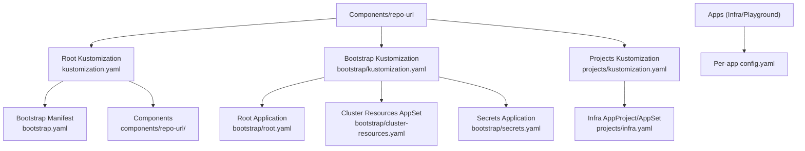
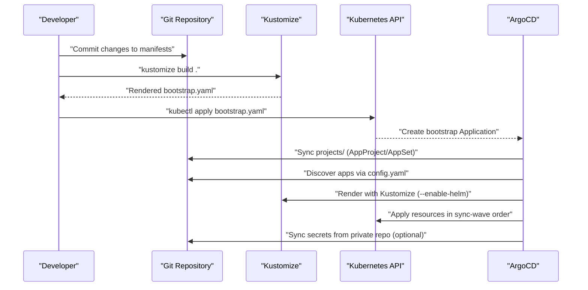
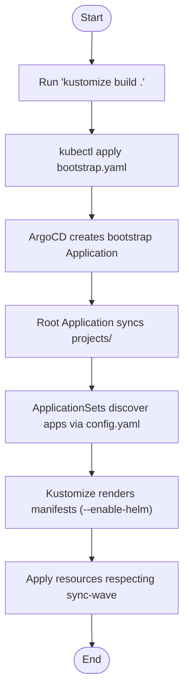
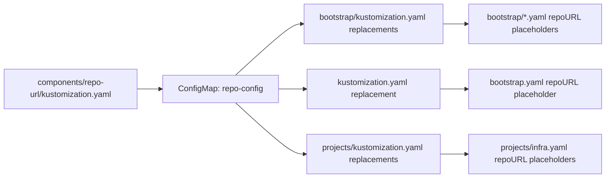
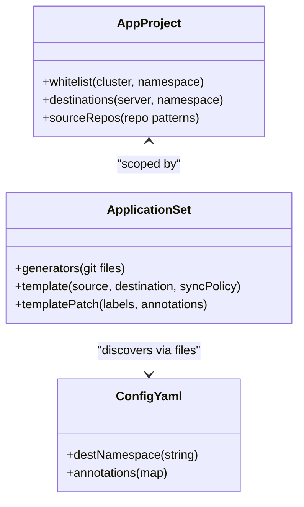
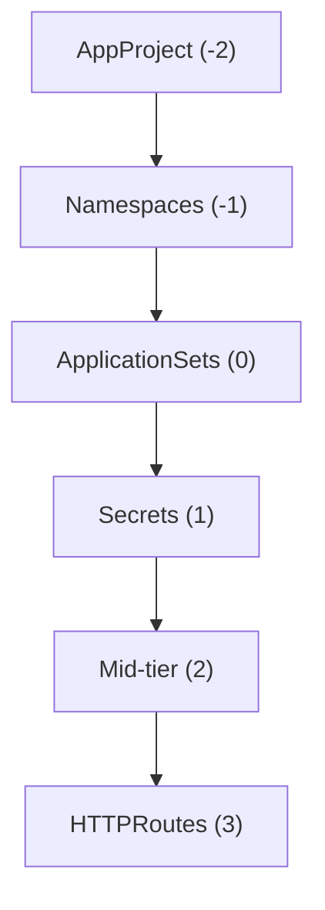
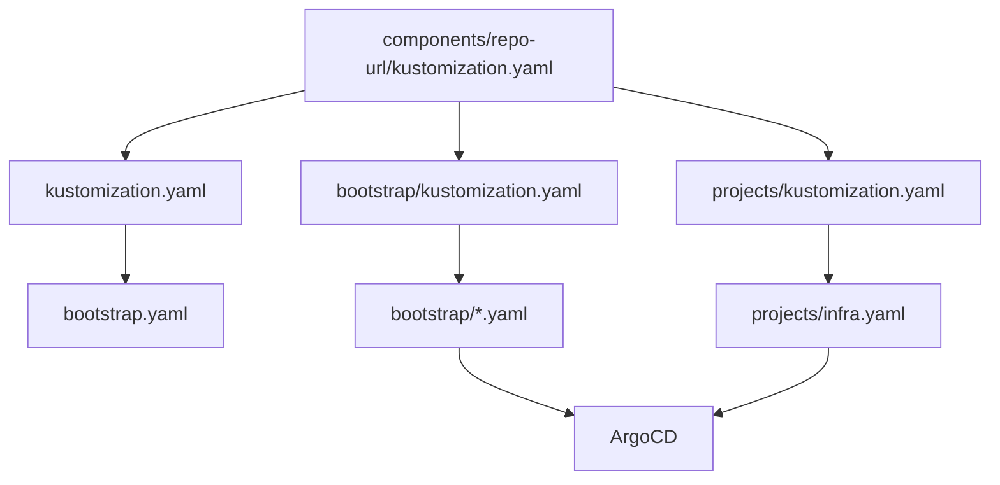

# GitOps Architecture Principles

<cite>
**Referenced Files in This Document**
- [README.md](file://README.md)
- [bootstrap.yaml](file://bootstrap.yaml)
- [bootstrap/kustomization.yaml](file://bootstrap/kustomization.yaml)
- [bootstrap/root.yaml](file://bootstrap/root.yaml)
- [bootstrap/cluster-resources.yaml](file://bootstrap/cluster-resources.yaml)
- [bootstrap/secrets.yaml](file://bootstrap/secrets.yaml)
- [components/repo-url/kustomization.yaml](file://components/repo-url/kustomization.yaml)
- [kustomization.yaml](file://kustomization.yaml)
- [projects/kustomization.yaml](file://projects/kustomization.yaml)
- [projects/infra.yaml](file://projects/infra.yaml)
- [apps/infra/gateway-api/config.yaml](file://apps/infra/gateway-api/config.yaml)
- [apps/infra/cloudflared/config.yaml](file://apps/infra/cloudflared/config.yaml)
- [apps/playground/rancher/config.yaml](file://apps/playground/rancher/config.yaml)
- [apps/playground/cert-manager/config.yaml](file://apps/playground/cert-manager/config.yaml)
- [cluster-resources/default/namespace.yaml](file://cluster-resources/default/namespace.yaml)
- [guide/argocd/argo_cd.md](file://guide/argocd/argo_cd.md)
</cite>

## Table of Contents
1. [Introduction](#introduction)
2. [Project Structure](#project-structure)
3. [Core Components](#core-components)
4. [Architecture Overview](#architecture-overview)
5. [Detailed Component Analysis](#detailed-component-analysis)
6. [Dependency Analysis](#dependency-analysis)
7. [Performance Considerations](#performance-considerations)
8. [Troubleshooting Guide](#troubleshooting-guide)
9. [Conclusion](#conclusion)

## Introduction
This document explains the GitOps architecture principles implemented in this Kubernetes infrastructure management system. It details the end-to-end workflow from a Git repository through ArgoCD to the Kubernetes API server, emphasizing that all cluster state changes originate from Git commits. It also documents the bootstrap chain, the repository URL substitution mechanism using a shared component, environment-specific deployment capabilities, the read-only debugging policy, and the preference for OCI Helm charts from ghcr.io. Practical examples illustrate how the system maintains consistency and auditability.

## Project Structure
The repository organizes GitOps artifacts into layered directories:
- Root Kustomization builds the initial bootstrap manifest and injects repository URLs.
- Bootstrap manifests define the root Application and supporting ApplicationSets for cluster resources and secrets.
- Projects define AppProjects and ApplicationSets that discover applications via config files.
- Apps contain infrastructure and playground applications with per-app configuration and optional Helm charts.
- Components provide reusable configuration, notably centralized repository URL definitions.
- Guides include installation steps and operational procedures.

**Diagram sources**
- [kustomization.yaml:1-21](file://kustomization.yaml#L1-L21)
- [bootstrap.yaml:1-26](file://bootstrap.yaml#L1-L26)
- [bootstrap/kustomization.yaml:1-38](file://bootstrap/kustomization.yaml#L1-L38)
- [bootstrap/root.yaml:1-37](file://bootstrap/root.yaml#L1-L37)
- [bootstrap/cluster-resources.yaml:1-33](file://bootstrap/cluster-resources.yaml#L1-L33)
- [bootstrap/secrets.yaml:1-24](file://bootstrap/secrets.yaml#L1-L24)
- [projects/kustomization.yaml:1-22](file://projects/kustomization.yaml#L1-L22)
- [projects/infra.yaml:1-85](file://projects/infra.yaml#L1-L85)

**Section sources**
- [README.md:87-118](file://README.md#L87-L118)
- [kustomization.yaml:1-21](file://kustomization.yaml#L1-L21)
- [bootstrap/kustomization.yaml:1-38](file://bootstrap/kustomization.yaml#L1-L38)
- [projects/kustomization.yaml:1-22](file://projects/kustomization.yaml#L1-L22)

## Core Components
- Centralized repository URL component: A shared component defines repository URLs for both the main and secrets repositories. This enables environment-specific deployments by replacing placeholders across all kustomizations.
- Bootstrap chain: The initial Application (bootstrap) is applied manually, which then creates the root Application pointing to projects/, which in turn discovers apps via config files.
- AppProject and ApplicationSet: AppProjects scope permissions and destinations; ApplicationSets discover and render applications using Kustomize with optional Helm support.
- Sync waves: Annotations enforce deterministic ordering across namespaces, cluster resources, ApplicationSets, secrets, mid-tier resources, and HTTPRoutes.
- Read-only debugging policy: Only read-only kubectl commands are permitted for inspection; all changes must originate from Git.

**Section sources**
- [components/repo-url/kustomization.yaml:1-11](file://components/repo-url/kustomization.yaml#L1-L11)
- [README.md:120-127](file://README.md#L120-L127)
- [README.md:76-86](file://README.md#L76-L86)
- [README.md:57-75](file://README.md#L57-L75)

## Architecture Overview
The GitOps pipeline follows a deterministic bootstrap and synchronization flow:
1. Build and apply the root bootstrap manifest using Kustomize and the shared repository component.
2. The root Application points to the projects directory, which defines AppProjects and ApplicationSets.
3. ApplicationSets discover apps by scanning config files and render them with Kustomize (including Helm).
4. Sync waves ensure prerequisites (namespaces, cluster resources, ApplicationSets) are established before dependent resources.
5. Secrets are synchronized from a private repository via a dedicated Application.

**Diagram sources**
- [README.md:57-75](file://README.md#L57-L75)
- [bootstrap.yaml:1-26](file://bootstrap.yaml#L1-L26)
- [bootstrap/root.yaml:1-37](file://bootstrap/root.yaml#L1-L37)
- [projects/infra.yaml:1-85](file://projects/infra.yaml#L1-L85)
- [bootstrap/secrets.yaml:1-24](file://bootstrap/secrets.yaml#L1-L24)

## Detailed Component Analysis

### Bootstrap Chain and Initial Application
- Root bootstrap Application: Defines destination, project, and source path/revision; repoURL is a placeholder to be replaced later.
- Root Application: Points to the projects directory and ignores transient differences for ApplicationSet and repo-config.
- Bootstrap Kustomization: Applies the repo-url component and replaces placeholders in root, cluster-resources, and secrets manifests.
- Root Kustomization: Applies the repo-url component and replaces the bootstrap Application’s repoURL.

**Diagram sources**
- [README.md:57-75](file://README.md#L57-L75)
- [bootstrap.yaml:1-26](file://bootstrap.yaml#L1-L26)
- [bootstrap/root.yaml:1-37](file://bootstrap/root.yaml#L1-L37)
- [bootstrap/kustomization.yaml:1-38](file://bootstrap/kustomization.yaml#L1-L38)
- [kustomization.yaml:1-21](file://kustomization.yaml#L1-L21)

**Section sources**
- [bootstrap.yaml:1-26](file://bootstrap.yaml#L1-L26)
- [bootstrap/root.yaml:1-37](file://bootstrap/root.yaml#L1-L37)
- [bootstrap/kustomization.yaml:1-38](file://bootstrap/kustomization.yaml#L1-L38)
- [kustomization.yaml:1-21](file://kustomization.yaml#L1-L21)

### Repository URL Substitution Mechanism
- Shared component: A single component defines url and secrets_url literals.
- Replacements: Multiple replacement rules replace placeholders in Applications and ApplicationSets across root, bootstrap, and projects kustomizations.
- Environment-specific deployments: By swapping the component or overriding values, teams can target different environments while keeping manifests identical.

**Diagram sources**
- [components/repo-url/kustomization.yaml:1-11](file://components/repo-url/kustomization.yaml#L1-L11)
- [bootstrap/kustomization.yaml:12-38](file://bootstrap/kustomization.yaml#L12-L38)
- [kustomization.yaml:10-21](file://kustomization.yaml#L10-L21)
- [projects/kustomization.yaml:11-22](file://projects/kustomization.yaml#L11-L22)

**Section sources**
- [components/repo-url/kustomization.yaml:1-11](file://components/repo-url/kustomization.yaml#L1-L11)
- [bootstrap/kustomization.yaml:12-38](file://bootstrap/kustomization.yaml#L12-L38)
- [kustomization.yaml:10-21](file://kustomization.yaml#L10-L21)
- [projects/kustomization.yaml:11-22](file://projects/kustomization.yaml#L11-L22)

### AppProject and ApplicationSet Discovery
- AppProject: Scopes cluster resources and destinations; used by ApplicationSets to constrain where resources can be deployed.
- ApplicationSet: Discovers apps by scanning config.yaml files under apps/infra and apps/playground, rendering Kustomize manifests with optional Helm support.
- Template customization: Destinations, namespaces, and annotations (including sync-wave) are derived from config.yaml and templatePatch.

**Diagram sources**
- [projects/infra.yaml:1-85](file://projects/infra.yaml#L1-L85)
- [apps/infra/gateway-api/config.yaml:1-6](file://apps/infra/gateway-api/config.yaml#L1-L6)
- [apps/infra/cloudflared/config.yaml:1-4](file://apps/infra/cloudflared/config.yaml#L1-L4)
- [apps/playground/rancher/config.yaml:1-5](file://apps/playground/rancher/config.yaml#L1-L5)
- [apps/playground/cert-manager/config.yaml:1-5](file://apps/playground/cert-manager/config.yaml#L1-L5)

**Section sources**
- [projects/infra.yaml:1-85](file://projects/infra.yaml#L1-L85)
- [apps/infra/gateway-api/config.yaml:1-6](file://apps/infra/gateway-api/config.yaml#L1-L6)
- [apps/infra/cloudflared/config.yaml:1-4](file://apps/infra/cloudflared/config.yaml#L1-L4)
- [apps/playground/rancher/config.yaml:1-5](file://apps/playground/rancher/config.yaml#L1-L5)
- [apps/playground/cert-manager/config.yaml:1-5](file://apps/playground/cert-manager/config.yaml#L1-L5)

### Sync Waves and Deterministic Ordering
- Sync waves: Annotations enforce ordering across AppProjects, namespaces, ApplicationSets, secrets, mid-tier resources, and HTTPRoutes.
- Namespace prerequisites: Shared namespaces are created early to ensure downstream apps can reference them.
- ApplicationSet generation: Controlled by templates and annotations to avoid race conditions.

**Diagram sources**
- [README.md:76-86](file://README.md#L76-L86)
- [cluster-resources/default/namespace.yaml:1-52](file://cluster-resources/default/namespace.yaml#L1-L52)
- [projects/infra.yaml:25-45](file://projects/infra.yaml#L25-L45)

**Section sources**
- [README.md:76-86](file://README.md#L76-L86)
- [cluster-resources/default/namespace.yaml:1-52](file://cluster-resources/default/namespace.yaml#L1-L52)
- [projects/infra.yaml:25-45](file://projects/infra.yaml#L25-L45)

### Private Secrets Management
- Dedicated Application: A bootstrap Application synchronizes secrets from a private repository.
- Sync policy: Automated pruning and self-healing ensure drift is corrected while preserving resources on deletion.
- Access control: Repository credentials are configured externally to allow ArgoCD to access private repos.

**Section sources**
- [bootstrap/secrets.yaml:1-24](file://bootstrap/secrets.yaml#L1-L24)
- [guide/argocd/argo_cd.md:18-22](file://guide/argocd/argo_cd.md#L18-L22)

### Read-Only Debugging Policy and OCI Helm Preference
- Read-only policy: Only read commands are permitted for debugging; all changes must originate from Git.
- OCI Helm preference: Charts are referenced via OCI registries (ghcr.io) for improved supply-chain security and reliability.

**Section sources**
- [README.md:120-127](file://README.md#L120-L127)

## Dependency Analysis
The system exhibits strong modularity and low coupling:
- Root Kustomization depends on the shared repo-url component and the bootstrap manifest.
- Bootstrap Kustomization depends on the same component and applies replacements to multiple Application/ApplicationSet manifests.
- Projects Kustomization depends on the component and applies replacements to ApplicationSet generators.
- Apps depend on config.yaml and optional chart directories; rendering is delegated to Kustomize with optional Helm.

**Diagram sources**
- [components/repo-url/kustomization.yaml:1-11](file://components/repo-url/kustomization.yaml#L1-L11)
- [kustomization.yaml:1-21](file://kustomization.yaml#L1-L21)
- [bootstrap/kustomization.yaml:1-38](file://bootstrap/kustomization.yaml#L1-L38)
- [projects/kustomization.yaml:1-22](file://projects/kustomization.yaml#L1-L22)
- [bootstrap.yaml:1-26](file://bootstrap.yaml#L1-L26)
- [projects/infra.yaml:1-85](file://projects/infra.yaml#L1-L85)

**Section sources**
- [components/repo-url/kustomization.yaml:1-11](file://components/repo-url/kustomization.yaml#L1-L11)
- [kustomization.yaml:1-21](file://kustomization.yaml#L1-L21)
- [bootstrap/kustomization.yaml:1-38](file://bootstrap/kustomization.yaml#L1-L38)
- [projects/kustomization.yaml:1-22](file://projects/kustomization.yaml#L1-L22)

## Performance Considerations
- Kustomize build options: Enabling Helm in the repository configuration streamlines chart rendering during sync.
- Retry/backoff: ApplicationSet templates include retry configuration to handle transient failures gracefully.
- Sync waves: Ordered synchronization reduces contention and avoids unnecessary rollouts.

**Section sources**
- [guide/argocd/argo_cd.md:7-9](file://guide/argocd/argo_cd.md#L7-L9)
- [projects/infra.yaml:66-71](file://projects/infra.yaml#L66-L71)
- [README.md:76-86](file://README.md#L76-L86)

## Troubleshooting Guide
- Bootstrap removal: If bootstrap must be deleted, remove finalizers and force-delete the Application.
- Applying bootstrap: Use the documented command to build and apply the bootstrap manifest.
- Accessing ArgoCD UI: Retrieve the initial admin password and forward the service locally.

**Section sources**
- [guide/argocd/argo_cd.md:24-33](file://guide/argocd/argo_cd.md#L24-L33)

## Conclusion
This GitOps system enforces a strict, auditable, and repeatable process: all cluster state changes originate from Git commits, validated by ArgoCD and applied deterministically via Kustomize and ApplicationSets. The shared repository URL component centralizes environment configuration, enabling safe, environment-specific deployments. The read-only debugging policy and preference for OCI Helm charts further strengthen security and reliability. Together, these practices ensure consistency, traceability, and operational safety across the platform.