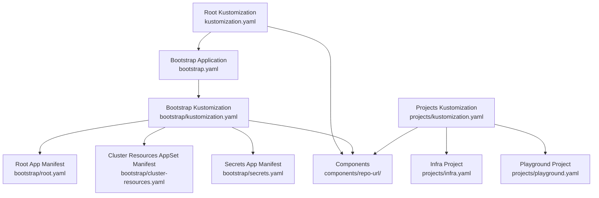
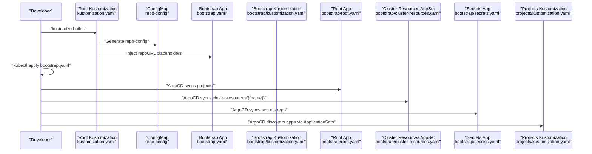
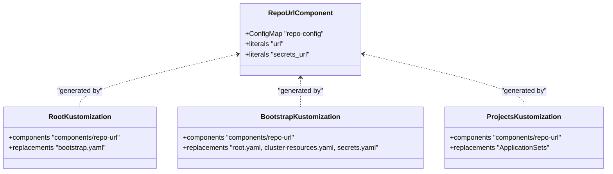
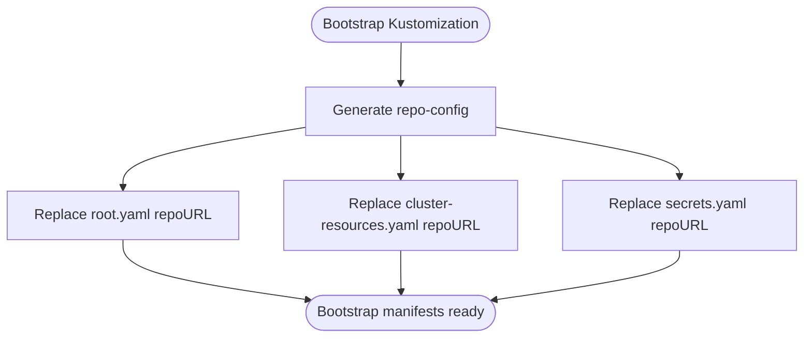
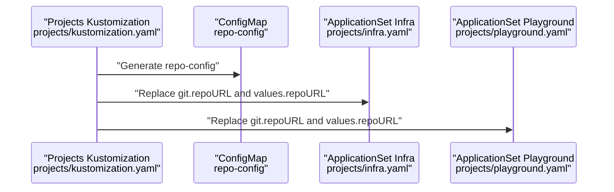
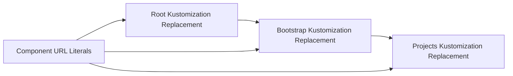
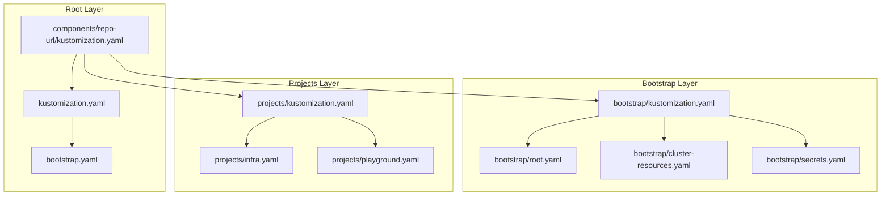

# Multi-Layered Configuration System

<cite>
**Referenced Files in This Document**
- [bootstrap.yaml](file://bootstrap.yaml)
- [kustomization.yaml](file://kustomization.yaml)
- [bootstrap/kustomization.yaml](file://bootstrap/kustomization.yaml)
- [components/repo-url/kustomization.yaml](file://components/repo-url/kustomization.yaml)
- [projects/kustomization.yaml](file://projects/kustomization.yaml)
- [bootstrap/root.yaml](file://bootstrap/root.yaml)
- [bootstrap/cluster-resources.yaml](file://bootstrap/cluster-resources.yaml)
- [bootstrap/secrets.yaml](file://bootstrap/secrets.yaml)
- [projects/infra.yaml](file://projects/infra.yaml)
- [projects/playground.yaml](file://projects/playground.yaml)
- [README.md](file://README.md)
</cite>

## Table of Contents
1. [Introduction](#introduction)
2. [Project Structure](#project-structure)
3. [Core Components](#core-components)
4. [Architecture Overview](#architecture-overview)
5. [Detailed Component Analysis](#detailed-component-analysis)
6. [Dependency Analysis](#dependency-analysis)
7. [Performance Considerations](#performance-considerations)
8. [Troubleshooting Guide](#troubleshooting-guide)
9. [Conclusion](#conclusion)

## Introduction
This document explains the multi-layered configuration system that powers GitOps-driven Kubernetes management with ArgoCD, Kustomize, and Helm. The system centers on a single source of truth for repository URLs managed via a reusable component, ensuring consistency across bootstrap, project definitions, and application deployments. It demonstrates how a component-based design enables centralized configuration, controlled propagation of changes, and environment-specific customization through layered substitutions.

## Project Structure
The repository organizes configuration into distinct layers:
- Root layer: Builds the initial bootstrap Application manifest using a component that injects repository URLs.
- Bootstrap layer: Applies the same component to root, cluster-resources, and secrets manifests, replacing placeholders with actual URLs.
- Projects layer: Defines AppProjects and ApplicationSets that discover applications via config files, again using component substitution.
- Apps layer: Individual application definitions under infra and playground, each driven by ApplicationSets.

**Diagram sources**
- [kustomization.yaml:1-21](file://kustomization.yaml#L1-L21)
- [bootstrap.yaml:1-26](file://bootstrap.yaml#L1-L26)
- [bootstrap/kustomization.yaml:1-38](file://bootstrap/kustomization.yaml#L1-L38)
- [bootstrap/root.yaml:1-37](file://bootstrap/root.yaml#L1-L37)
- [bootstrap/cluster-resources.yaml:1-33](file://bootstrap/cluster-resources.yaml#L1-L33)
- [bootstrap/secrets.yaml:1-24](file://bootstrap/secrets.yaml#L1-L24)
- [projects/kustomization.yaml:1-22](file://projects/kustomization.yaml#L1-L22)
- [projects/infra.yaml:1-85](file://projects/infra.yaml#L1-L85)
- [projects/playground.yaml:1-90](file://projects/playground.yaml#L1-L90)
- [components/repo-url/kustomization.yaml:1-11](file://components/repo-url/kustomization.yaml#L1-L11)

**Section sources**
- [README.md:87-118](file://README.md#L87-L118)
- [kustomization.yaml:1-21](file://kustomization.yaml#L1-L21)
- [projects/kustomization.yaml:1-22](file://projects/kustomization.yaml#L1-L22)

## Core Components
- Centralized repository URL component: A Kustomize Component generates a ConfigMap containing repository URLs used across the system. This ensures a single source of truth for both public and private repositories.
- Replacement mechanism: Kustomize replacements bind the generated ConfigMap values into placeholder fields across multiple manifests, enabling consistent substitution without duplicating values.

Key behaviors:
- The root Kustomization composes the component and injects URLs into the bootstrap Application manifest.
- The bootstrap Kustomization reuses the same component to replace placeholders in root, cluster-resources, and secrets manifests.
- The projects Kustomization substitutes placeholders in ApplicationSets that drive app discovery.

Benefits:
- Centralization reduces duplication and risk of drift.
- Component reuse enforces consistency across environments and layers.
- Controlled propagation through replacements ensures predictable updates.

**Section sources**
- [components/repo-url/kustomization.yaml:1-11](file://components/repo-url/kustomization.yaml#L1-L11)
- [kustomization.yaml:10-21](file://kustomization.yaml#L10-L21)
- [bootstrap/kustomization.yaml:12-38](file://bootstrap/kustomization.yaml#L12-L38)
- [projects/kustomization.yaml:11-22](file://projects/kustomization.yaml#L11-L22)

## Architecture Overview
The system follows a bootstrap chain that progresses from a single root build to layered application management:

**Diagram sources**
- [README.md:57-75](file://README.md#L57-L75)
- [kustomization.yaml:1-21](file://kustomization.yaml#L1-L21)
- [bootstrap.yaml:1-26](file://bootstrap.yaml#L1-L26)
- [bootstrap/kustomization.yaml:1-38](file://bootstrap/kustomization.yaml#L1-L38)
- [bootstrap/root.yaml:1-37](file://bootstrap/root.yaml#L1-L37)
- [bootstrap/cluster-resources.yaml:1-33](file://bootstrap/cluster-resources.yaml#L1-L33)
- [bootstrap/secrets.yaml:1-24](file://bootstrap/secrets.yaml#L1-L24)
- [projects/kustomization.yaml:1-22](file://projects/kustomization.yaml#L1-L22)

## Detailed Component Analysis

### Component-Based Design Pattern
The component-based design encapsulates shared configuration (repository URLs) in a single, reusable unit. This pattern promotes:
- Reusability: Same component applied across root, bootstrap, and projects layers.
- Consistency: Uniform URL injection prevents mismatches across manifests.
- Maintainability: Centralized updates to the component propagate downstream.

**Diagram sources**
- [components/repo-url/kustomization.yaml:1-11](file://components/repo-url/kustomization.yaml#L1-L11)
- [kustomization.yaml:4-6](file://kustomization.yaml#L4-L6)
- [bootstrap/kustomization.yaml:4-6](file://bootstrap/kustomization.yaml#L4-L6)
- [projects/kustomization.yaml:4-6](file://projects/kustomization.yaml#L4-L6)

**Section sources**
- [components/repo-url/kustomization.yaml:1-11](file://components/repo-url/kustomization.yaml#L1-L11)
- [kustomization.yaml:4-6](file://kustomization.yaml#L4-L6)
- [bootstrap/kustomization.yaml:4-6](file://bootstrap/kustomization.yaml#L4-L6)
- [projects/kustomization.yaml:4-6](file://projects/kustomization.yaml#L4-L6)

### Bootstrap System and Placeholder Substitution
The bootstrap system applies the same component to three key manifests while replacing placeholders:
- Root Application: Points to the projects directory and uses the public repository URL.
- Cluster Resources ApplicationSet: Creates namespaces and shared cluster objects using the public repository URL.
- Secrets Application: Syncs private secrets from a dedicated repository using the secrets URL.

**Diagram sources**
- [bootstrap/kustomization.yaml:12-38](file://bootstrap/kustomization.yaml#L12-L38)
- [bootstrap/root.yaml:15-18](file://bootstrap/root.yaml#L15-L18)
- [bootstrap/cluster-resources.yaml:25-28](file://bootstrap/cluster-resources.yaml#L25-L28)
- [bootstrap/secrets.yaml:12-15](file://bootstrap/secrets.yaml#L12-L15)

**Section sources**
- [bootstrap/kustomization.yaml:12-38](file://bootstrap/kustomization.yaml#L12-L38)
- [bootstrap/root.yaml:15-18](file://bootstrap/root.yaml#L15-L18)
- [bootstrap/cluster-resources.yaml:25-28](file://bootstrap/cluster-resources.yaml#L25-L28)
- [bootstrap/secrets.yaml:12-15](file://bootstrap/secrets.yaml#L12-L15)

### Project Definitions and Component Substitution
Project definitions under projects/ reuse the same component substitution mechanism:
- Infra and Playground projects define ApplicationSets that scan for app config files and inject repository URLs.
- The projects Kustomization composes the component and replaces placeholders in ApplicationSet generator configurations.

**Diagram sources**
- [projects/kustomization.yaml:11-22](file://projects/kustomization.yaml#L11-L22)
- [projects/infra.yaml:34-45](file://projects/infra.yaml#L34-L45)
- [projects/playground.yaml:34-45](file://projects/playground.yaml#L34-L45)

**Section sources**
- [projects/kustomization.yaml:11-22](file://projects/kustomization.yaml#L11-L22)
- [projects/infra.yaml:34-45](file://projects/infra.yaml#L34-L45)
- [projects/playground.yaml:34-45](file://projects/playground.yaml#L34-L45)

### Configuration Inheritance and Propagation
Changes propagate through the layered system as follows:
- Updating the component’s URL literals triggers replacements in:
  - Root Kustomization → bootstrap.yaml
  - Bootstrap Kustomization → root.yaml, cluster-resources.yaml, secrets.yaml
  - Projects Kustomization → ApplicationSets in infra.yaml and playground.yaml
- This inheritance ensures consistent updates across bootstrap, project definitions, and app discovery.

**Diagram sources**
- [components/repo-url/kustomization.yaml:8-10](file://components/repo-url/kustomization.yaml#L8-L10)
- [kustomization.yaml:10-21](file://kustomization.yaml#L10-L21)
- [bootstrap/kustomization.yaml:12-38](file://bootstrap/kustomization.yaml#L12-L38)
- [projects/kustomization.yaml:11-22](file://projects/kustomization.yaml#L11-L22)

**Section sources**
- [components/repo-url/kustomization.yaml:8-10](file://components/repo-url/kustomization.yaml#L8-L10)
- [kustomization.yaml:10-21](file://kustomization.yaml#L10-L21)
- [bootstrap/kustomization.yaml:12-38](file://bootstrap/kustomization.yaml#L12-L38)
- [projects/kustomization.yaml:11-22](file://projects/kustomization.yaml#L11-L22)

## Dependency Analysis
The system exhibits strong cohesion within layers and controlled coupling between layers:
- Root layer depends on the component and produces bootstrap.yaml.
- Bootstrap layer depends on the component and applies replacements to three core manifests.
- Projects layer depends on the component and applies replacements to ApplicationSets.
- Apps layer depends on project-driven discovery and Kustomize/Helm rendering.

**Diagram sources**
- [components/repo-url/kustomization.yaml:1-11](file://components/repo-url/kustomization.yaml#L1-L11)
- [kustomization.yaml:1-21](file://kustomization.yaml#L1-L21)
- [bootstrap.yaml:1-26](file://bootstrap.yaml#L1-L26)
- [bootstrap/kustomization.yaml:1-38](file://bootstrap/kustomization.yaml#L1-L38)
- [bootstrap/root.yaml:1-37](file://bootstrap/root.yaml#L1-L37)
- [bootstrap/cluster-resources.yaml:1-33](file://bootstrap/cluster-resources.yaml#L1-L33)
- [bootstrap/secrets.yaml:1-24](file://bootstrap/secrets.yaml#L1-L24)
- [projects/kustomization.yaml:1-22](file://projects/kustomization.yaml#L1-L22)
- [projects/infra.yaml:1-85](file://projects/infra.yaml#L1-L85)
- [projects/playground.yaml:1-90](file://projects/playground.yaml#L1-L90)

**Section sources**
- [README.md:57-75](file://README.md#L57-L75)
- [kustomization.yaml:4-6](file://kustomization.yaml#L4-L6)
- [bootstrap/kustomization.yaml:4-6](file://bootstrap/kustomization.yaml#L4-L6)
- [projects/kustomization.yaml:4-6](file://projects/kustomization.yaml#L4-L6)

## Performance Considerations
- Centralized URL management minimizes repeated computation and reduces risk of misconfiguration.
- Component reuse avoids redundant resource generation, improving build performance.
- Replacement-driven updates ensure only necessary fields change during sync, reducing churn.

## Troubleshooting Guide
Common issues and resolutions:
- Placeholder not replaced: Verify the component is included in the Kustomization and the replacement selectors match the target fields.
- Wrong repository URL: Confirm the component’s URL literals are correct and that replacements target the intended manifests.
- Sync order conflicts: Review sync-wave annotations to ensure proper sequencing across cluster-resources, secrets, and application deployments.

**Section sources**
- [bootstrap/kustomization.yaml:12-38](file://bootstrap/kustomization.yaml#L12-L38)
- [projects/kustomization.yaml:11-22](file://projects/kustomization.yaml#L11-L22)
- [README.md:76-85](file://README.md#L76-L85)

## Conclusion
This multi-layered configuration system leverages a component-based design to centralize repository URL management and propagate changes consistently across bootstrap, project definitions, and application discovery. By applying the same component substitution mechanism at each layer, the system achieves maintainability, consistency, and flexible environment-specific customization through controlled propagation and explicit sync ordering.