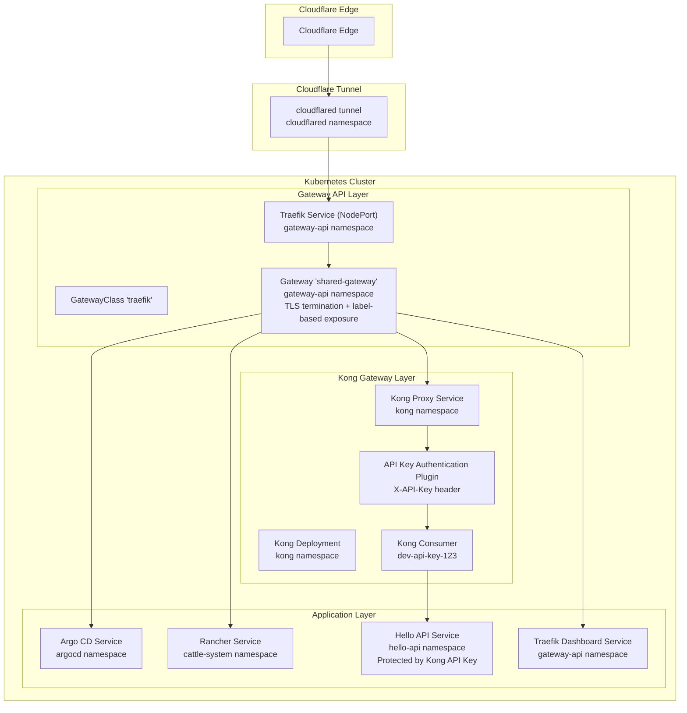
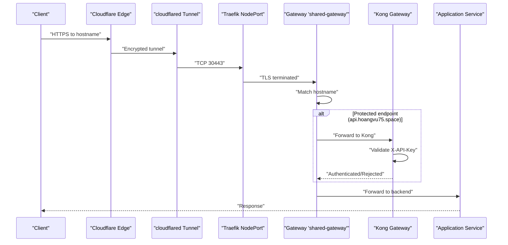
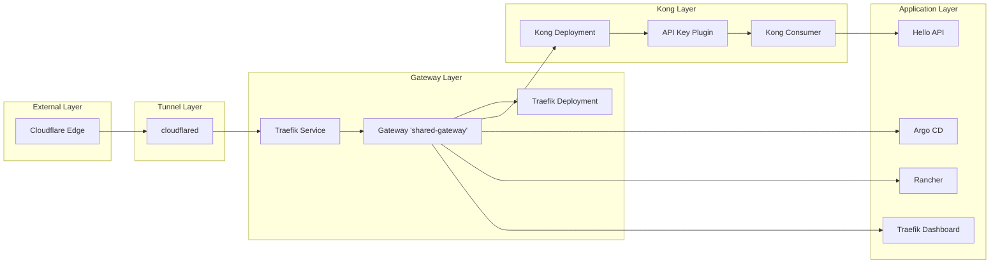

# Network Flow and Ingress Architecture

<cite>
**Referenced Files in This Document**
- [values.yaml](file://apps/infra/cloudflared/chart/values.yaml)
- [config.yaml](file://apps/infra/cloudflared/config.yaml)
- [gatewayclass.yaml](file://apps/infra/gateway-api/chart/gatewayclass.yaml)
- [gateway.yaml](file://apps/infra/gateway-api/chart/gateway.yaml)
- [traefik.yaml](file://apps/infra/gateway-api/chart/traefik.yaml)
- [traefik-static.yaml](file://apps/infra/gateway-api/chart/traefik-static.yaml)
- [httproute-traefik-dashboard.yaml](file://apps/infra/gateway-api/chart/httproute-traefik-dashboard.yaml)
- [httproute-argocd.yaml](file://apps/infra/argocd-ingress/chart/httproute-argocd.yaml)
- [httproute-rancher.yaml](file://apps/infra/rancher/chart/httproute-rancher.yaml)
- [values.yaml](file://apps/infra/kong/chart/values.yaml)
- [httproute-kong.yaml](file://apps/infra/kong/chart/httproute-kong.yaml)
- [kong-plugin-key-auth.yaml](file://apps/infra/kong/chart/kong-plugin-key-auth.yaml)
- [kong-consumer.yaml](file://apps/infra/kong/chart/kong-consumer.yaml)
- [externalname-hello-api.yaml](file://apps/infra/kong/chart/externalname-hello-api.yaml)
- [hello-api-ingress.yaml](file://apps/infra/kong/chart/hello-api-ingress.yaml)
- [namespace.yaml](file://cluster-resources/default/namespace.yaml)
</cite>

## Update Summary
**Changes Made**
- Added comprehensive Kong Gateway infrastructure with API key authentication as the primary security layer
- Updated network flow to include Kong Gateway between Cloudflare and applications for enhanced API security
- Implemented multi-layered security architecture with Cloudflare tunnel encryption + Gateway TLS termination + Kong API key validation
- Enhanced HTTPRoute configuration to route specific hostnames (api.hoangvu75.space) through Kong for API authentication
- Added KongPlugin and KongConsumer resources for API key management and validation
- Updated hostname-to-backend mapping to reflect Kong-protected endpoints

## Table of Contents
1. [Introduction](#introduction)
2. [Project Structure](#project-structure)
3. [Core Components](#core-components)
4. [Architecture Overview](#architecture-overview)
5. [Detailed Component Analysis](#detailed-component-analysis)
6. [Namespace Exposure Control](#namespace-exposure-control)
7. [Dependency Analysis](#dependency-analysis)
8. [Performance Considerations](#performance-considerations)
9. [Troubleshooting Guide](#troubleshooting-guide)
10. [Security Enhancements](#security-enhancements)
11. [Conclusion](#conclusion)

## Introduction
This document describes the network flow and ingress architecture for a Kubernetes cluster that implements a multi-layered security approach for external traffic. The architecture routes Cloudflare Edge traffic through a Cloudflare tunnel to a shared Gateway API Gateway backed by Traefik, then through Kong Gateway with API key authentication, and finally to applications. This enhanced security model provides defense-in-depth through layered authentication and authorization mechanisms while maintaining hostname-based routing via HTTPRoutes.

## Project Structure
The network stack is composed of four primary layers:
- **Cloudflare Tunnel Layer**: Cloudflared agents establish encrypted tunnels from the cluster to Cloudflare Edge
- **Gateway API Layer**: Traefik serves as the Gateway API controller with shared Gateway for TLS termination
- **Kong Gateway Layer**: API key authentication and authorization for sensitive endpoints
- **Application Layer**: Workloads exposed through Services with hostname-based routing

**Diagram sources**
- [values.yaml:1-40](file://apps/infra/cloudflared/chart/values.yaml#L1-L40)
- [gateway.yaml:1-34](file://apps/infra/gateway-api/chart/gateway.yaml#L1-L34)
- [traefik.yaml:120-157](file://apps/infra/gateway-api/chart/traefik.yaml#L120-L157)
- [values.yaml:16-37](file://apps/infra/kong/chart/values.yaml#L16-L37)
- [httproute-kong.yaml:1-30](file://apps/infra/kong/chart/httproute-kong.yaml#L1-L30)
- [kong-plugin-key-auth.yaml:1-12](file://apps/infra/kong/chart/kong-plugin-key-auth.yaml#L1-L12)
- [kong-consumer.yaml:1-24](file://apps/infra/kong/chart/kong-consumer.yaml#L1-L24)

## Core Components

### Cloudflare Tunnel (cloudflared)
- **Purpose**: Establishes encrypted outbound tunnels from the cluster to Cloudflare Edge
- **Configuration**: Deploys 2 replicas with HTTP/2 protocol and token-based authentication
- **Security**: All traffic encrypted end-to-end between Cloudflare Edge and cluster

### Gateway API Controller (Traefik)
- **Purpose**: Implements Gateway API specification and acts as ingress controller
- **Deployment**: Single replica with RBAC permissions for Gateway API resources
- **Service Exposure**: NodePort Service exposing ports 80 (30080) and 443 (30443) for external traffic

### Shared Gateway (Label-Based Routing)
- **Purpose**: Centralized Gateway with TLS termination and namespace exposure control
- **Listeners**: HTTP (80) and HTTPS (443) with TLS termination using wildcard certificate
- **Exposure Control**: Uses label-based namespace selection (`routing.hoangvu75.space/expose: "true"`)

### Kong Gateway Infrastructure
- **Purpose**: Provides API key authentication and authorization for sensitive endpoints
- **Configuration**: DB-less mode with Kong Ingress Controller managing configuration
- **Security Features**: Custom header validation (X-API-Key), credential hiding, multiple consumer support

### HTTPRoute Configuration
- **Direct Parent References**: Applications specify parentRefs to shared-gateway
- **Hostname Matching**: Exact hostname-based routing with path prefixes
- **Header Modification**: Forwarded headers for proper upstream handling

**Section sources**
- [values.yaml:1-40](file://apps/infra/cloudflared/chart/values.yaml#L1-L40)
- [gateway.yaml:1-34](file://apps/infra/gateway-api/chart/gateway.yaml#L1-L34)
- [traefik.yaml:59-157](file://apps/infra/gateway-api/chart/traefik.yaml#L59-L157)
- [values.yaml:16-37](file://apps/infra/kong/chart/values.yaml#L16-L37)
- [httproute-kong.yaml:1-30](file://apps/infra/kong/chart/httproute-kong.yaml#L1-L30)

## Architecture Overview
The traffic flow now implements a multi-layered security approach:

1. **Cloudflare Edge**: Receives inbound traffic for configured hostnames
2. **Cloudflare Tunnel**: Encrypted tunnel connection established by cloudflared
3. **Traefik Gateway**: TLS termination and initial routing based on hostname
4. **Kong Gateway**: API key validation for protected endpoints (api.hoangvu75.space)
5. **Application Services**: Backend services handling business logic

**Diagram sources**
- [values.yaml:11-18](file://apps/infra/cloudflared/chart/values.yaml#L11-L18)
- [gateway.yaml:20-34](file://apps/infra/gateway-api/chart/gateway.yaml#L20-L34)
- [httproute-kong.yaml:12-29](file://apps/infra/kong/chart/httproute-kong.yaml#L12-L29)
- [kong-plugin-key-auth.yaml:8-11](file://apps/infra/kong/chart/kong-plugin-key-auth.yaml#L8-L11)

## Detailed Component Analysis

### Cloudflare Tunnel Implementation
- **Deployment Configuration**: 2 replicas with HTTP/2 protocol and token authentication
- **Resource Management**: Minimal CPU/Memory requests with appropriate limits
- **Security Model**: End-to-end encryption between Cloudflare Edge and cluster

### Gateway API Controller (Traefik)
- **RBAC Permissions**: Comprehensive permissions for Gateway API resources
- **Service Exposure**: NodePort Service with ports 80 (30080), 443 (30443), and admin (8080)
- **Metrics Integration**: Prometheus scraping and Datadog monitoring support

### Shared Gateway Configuration
- **Listener Configuration**: HTTP (80) and HTTPS (443) with TLS termination
- **Certificate Management**: Wildcard certificate stored as Kubernetes Secret
- **Namespace Exposure**: Label-based selection using `routing.hoangvu75.space/expose: "true"`

### Kong Gateway Security Layer
- **API Key Plugin**: Configured with custom header name (X-API-Key)
- **Consumer Management**: Predefined consumer with development API key (dev-api-key-123)
- **Credential Security**: Hide credentials from response headers
- **Service Integration**: ExternalName service pointing to hello-api backend

### HTTPRoute Examples and Routing Logic
- **Argo CD Route**: Direct routing to argocd-server Service
- **Rancher Route**: Direct routing to rancher Service  
- **Kong Route**: Routes to Kong Proxy Service with API key authentication
- **Traefik Dashboard**: Direct routing to Traefik admin interface

**Section sources**
- [values.yaml:19-37](file://apps/infra/kong/chart/values.yaml#L19-L37)
- [kong-plugin-key-auth.yaml:1-12](file://apps/infra/kong/chart/kong-plugin-key-auth.yaml#L1-L12)
- [kong-consumer.yaml:1-24](file://apps/infra/kong/chart/kong-consumer.yaml#L1-L24)
- [httproute-argocd.yaml:1-29](file://apps/infra/argocd-ingress/chart/httproute-argocd.yaml#L1-L29)
- [httproute-rancher.yaml:1-30](file://apps/infra/rancher/chart/httproute-rancher.yaml#L1-L30)
- [httproute-kong.yaml:1-30](file://apps/infra/kong/chart/httproute-kong.yaml#L1-L30)

## Namespace Exposure Control
The architecture implements label-based namespace exposure control for scalable and secure routing management.

### Label-Based Control Mechanism
- **Label Definition**: `routing.hoangvu75.space/expose: "true"`
- **Gateway Configuration**: Gateway listeners specify `from: Selector` with label matching
- **Namespace Selection**: Only namespaces with expose label can reference shared Gateway

### Namespace Configuration Matrix

| Namespace | Label Status | Purpose | Gateway Access |
|-----------|--------------|---------|----------------|
| gateway-api | ✅ Exposed | Gateway infrastructure | ✅ Allowed |
| cloudflared | ❌ Not exposed | Tunnel agents | ❌ Denied |
| cert-manager | ❌ Not exposed | Certificate management | ❌ Denied |
| cattle-system | ✅ Exposed | Rancher application | ✅ Allowed |
| datadog | ❌ Not exposed | Monitoring | ❌ Denied |
| hello-api | ✅ Exposed | Hello API application | ✅ Allowed |
| tcp-demo | ✅ Exposed | TCP demo application | ✅ Allowed |
| udp-demo | ✅ Exposed | UDP demo application | ✅ Allowed |
| cluster-check | ❌ Not exposed | Health checks | ❌ Denied |
| kong | ✅ Exposed | Kong Gateway infrastructure | ✅ Allowed |
| argocd | ✅ Exposed | Argo CD application | ✅ Allowed |

### Benefits of Label-Based Control
- **Scalability**: Easy addition of new namespaces without Gateway reconfiguration
- **Security**: Explicit opt-in model prevents accidental exposure
- **Maintainability**: Centralized control through labels rather than static lists

**Section sources**
- [gateway.yaml:14-28](file://apps/infra/gateway-api/chart/gateway.yaml#L14-L28)
- [namespace.yaml:10-94](file://cluster-resources/default/namespace.yaml#L10-L94)

## Dependency Analysis
The multi-layered architecture creates dependencies between components that must be carefully managed.

**Diagram sources**
- [values.yaml:11-18](file://apps/infra/cloudflared/chart/values.yaml#L11-L18)
- [gateway.yaml:1-34](file://apps/infra/gateway-api/chart/gateway.yaml#L1-L34)
- [values.yaml:16-37](file://apps/infra/kong/chart/values.yaml#L16-L37)
- [kong-plugin-key-auth.yaml:1-12](file://apps/infra/kong/chart/kong-plugin-key-auth.yaml#L1-L12)
- [kong-consumer.yaml:1-24](file://apps/infra/kong/chart/kong-consumer.yaml#L1-L24)

**Section sources**
- [gatewayclass.yaml:1-10](file://apps/infra/gateway-api/chart/gatewayclass.yaml#L1-L10)
- [gateway.yaml:1-34](file://apps/infra/gateway-api/chart/gateway.yaml#L1-L34)
- [traefik.yaml:59-157](file://apps/infra/gateway-api/chart/traefik.yaml#L59-L157)
- [values.yaml:16-37](file://apps/infra/kong/chart/values.yaml#L16-L37)

## Performance Considerations
- **Traefik Resource Usage**: Minimal CPU/Memory requests suitable for small to medium workloads
- **Cloudflared Throughput**: 2 replicas provide redundancy without significant performance impact
- **Kong Overhead**: API key validation adds minimal latency while providing significant security benefits
- **NodePort Exposure**: Simple but lacks advanced load balancing; consider external load balancers for production
- **TLS Termination**: Gateway handles TLS termination, reducing CPU overhead in application pods

## Troubleshooting Guide

### Common Issues and Resolutions

#### Cloudflare Tunnel Connectivity
- **Issue**: No traffic reaching cluster via tunnel
- **Check**: cloudflared deployment health and tunnel token secret
- **Resolution**: Verify tunnel connection status and token validity

#### TLS Certificate Problems
- **Issue**: TLS handshake failures or certificate errors
- **Check**: Wildcard certificate Secret existence and validity
- **Resolution**: Rotate certificates and ensure proper DNS configuration

#### HTTPRoute Matching Failures
- **Issue**: Hostname not matching any HTTPRoute
- **Check**: Exact hostname match and parentRef configuration
- **Resolution**: Verify HTTPRoute hostnames and namespace exposure labels

#### Kong API Key Authentication
- **Issue**: API key validation failures for protected endpoints
- **Check**: X-API-Key header presence and correct API key value
- **Resolution**: Include proper header or use Kong Consumer credentials

#### Backend Service Issues
- **Issue**: Applications not receiving traffic
- **Check**: Service selectors, Pod readiness, and namespace exposure
- **Resolution**: Verify Service configuration and Pod status

#### Gateway API Resource Problems
- **Issue**: Gateway API resources not applied
- **Check**: CRD installation and controller name matching
- **Resolution**: Install CRDs and verify controller configuration

**Section sources**
- [values.yaml:19-21](file://apps/infra/cloudflared/chart/values.yaml#L19-L21)
- [gateway.yaml:23-34](file://apps/infra/gateway-api/chart/gateway.yaml#L23-L34)
- [kong-plugin-key-auth.yaml:8-11](file://apps/infra/kong/chart/kong-plugin-key-auth.yaml#L8-L11)
- [kong-consumer.yaml:21-23](file://apps/infra/kong/chart/kong-consumer.yaml#L21-L23)

## Security Enhancements

### Multi-Layered Security Architecture
- **Layer 1**: Cloudflare Tunnel Encryption - End-to-end encryption between edge and cluster
- **Layer 2**: Gateway TLS Termination - Centralized TLS termination with wildcard certificates
- **Layer 3**: Kong API Key Authentication - Authorization for sensitive endpoints
- **Layer 4**: Namespace Isolation - Label-based exposure control prevents unauthorized access

### API Key Security Features
- **Custom Header Validation**: X-API-Key header with configurable naming
- **Credential Hiding**: Prevents API key exposure in response headers
- **Multiple Consumers**: Support for different API keys per client or application
- **Secure Storage**: API key credentials stored as Kubernetes Secrets

### Traffic Flow Security
- **Encrypted Ingress**: All traffic encrypted via Cloudflare tunnel
- **TLS Termination**: Centralized TLS termination reduces complexity
- **Authorization**: API key validation prevents unauthorized access to protected endpoints
- **Namespace Control**: Explicit exposure labels prevent cross-namespace routing

### Monitoring and Observability
- **Prometheus Metrics**: Built-in metrics collection for all components
- **Datadog Integration**: Comprehensive monitoring and alerting capabilities
- **Request Logging**: Header modification ensures proper upstream logging

**Section sources**
- [values.yaml:29-37](file://apps/infra/kong/chart/values.yaml#L29-L37)
- [kong-plugin-key-auth.yaml:8-11](file://apps/infra/kong/chart/kong-plugin-key-auth.yaml#L8-L11)
- [kong-consumer.yaml:21-23](file://apps/infra/kong/chart/kong-consumer.yaml#L21-L23)

## Conclusion
This multi-layered ingress architecture provides comprehensive security through Cloudflare tunnel encryption, Gateway TLS termination, and Kong API key authentication. The architecture successfully routes traffic from Cloudflare Edge through cloudflared tunnels to Traefik Gateway, then through Kong for API authentication, and finally to applications. The label-based namespace exposure control ensures scalable and secure routing management, while the NodePort Service provides simple external access. The enhanced security model with API key validation for sensitive endpoints demonstrates defense-in-depth architecture, making the system resilient against various attack vectors. With proper monitoring, API key management, and namespace controls, this architecture offers a robust, scalable, and highly secure ingress solution for production environments.