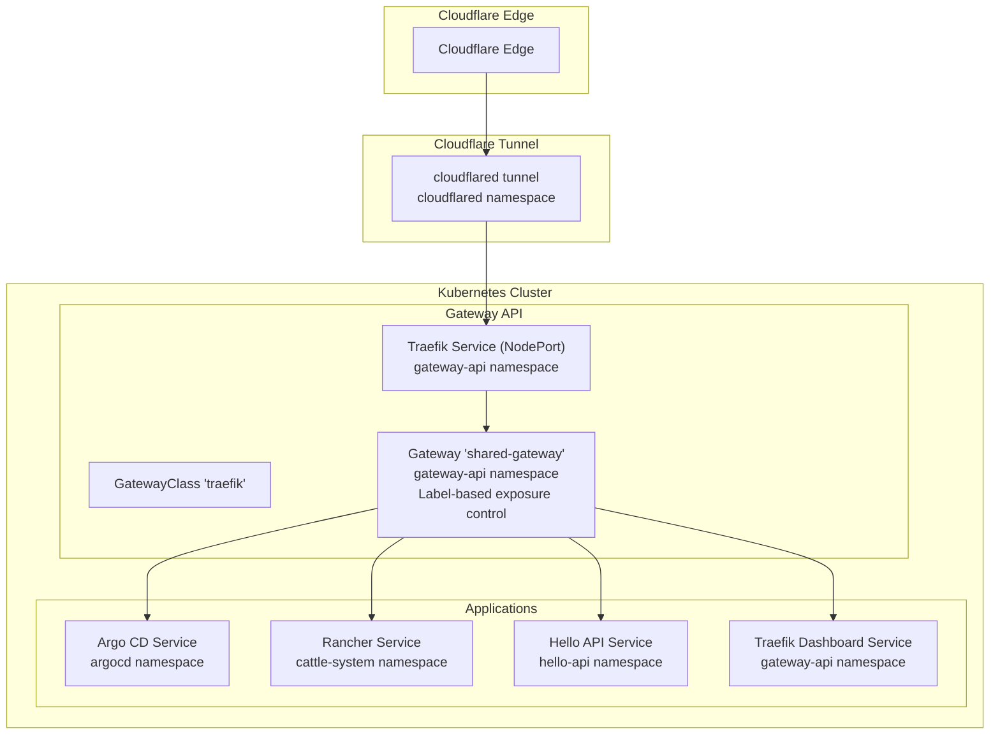
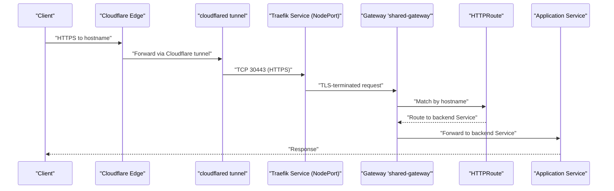
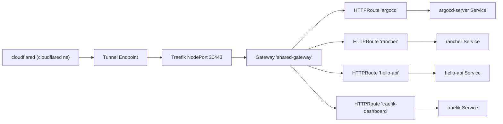

# Network Flow and Ingress Architecture

<cite>
**Referenced Files in This Document**
- [values.yaml](file://apps/infra/cloudflared/chart/values.yaml)
- [config.yaml](file://apps/infra/cloudflared/config.yaml)
- [kustomization.yaml](file://apps/infra/cloudflared/kustomization.yaml)
- [gatewayclass.yaml](file://apps/infra/gateway-api/chart/gatewayclass.yaml)
- [gateway.yaml](file://apps/infra/gateway-api/chart/gateway.yaml)
- [traefik.yaml](file://apps/infra/gateway-api/chart/traefik.yaml)
- [httproute-traefik-dashboard.yaml](file://apps/infra/gateway-api/chart/httproute-traefik-dashboard.yaml)
- [httproute-argocd.yaml](file://apps/playground/argocd-ingress/chart/httproute-argocd.yaml)
- [httproute-rancher.yaml](file://apps/playground/rancher/chart/httproute-rancher.yaml)
- [kustomization.yaml](file://apps/infra/gateway-api/kustomization.yaml)
- [kustomization.yaml](file://components/httproute-defaults/kustomization.yaml)
- [namespace.yaml](file://cluster-resources/default/namespace.yaml)
- [values-httproute.yaml](file://apps/playground/hello-api/chart/values-httproute.yaml)
- [kustomization.yaml](file://apps/playground/hello-api/kustomization.yaml)
</cite>

## Update Summary
**Changes Made**
- Added documentation for the new HTTPRoute defaults component and its role in routing standardization
- Enhanced documentation about namespace labeling with routing.hoangvu75.space/expose labels for selective routing exposure
- Updated Gateway configuration to use label-based namespace selection instead of explicit namespace lists
- Added new hello-api example demonstrating the HTTPRoute defaults component in action

## Table of Contents
1. [Introduction](#introduction)
2. [Project Structure](#project-structure)
3. [Core Components](#core-components)
4. [Architecture Overview](#architecture-overview)
5. [Detailed Component Analysis](#detailed-component-analysis)
6. [HTTPRoute Defaults Component](#httproute-defaults-component)
7. [Namespace Exposure Control](#namespace-exposure-control)
8. [Dependency Analysis](#dependency-analysis)
9. [Performance Considerations](#performance-considerations)
10. [Troubleshooting Guide](#troubleshooting-guide)
11. [Conclusion](#conclusion)

## Introduction
This document describes the network flow and ingress architecture for a Kubernetes cluster that routes external traffic from Cloudflare Edge through a Cloudflare tunnel to a shared Gateway API Gateway backed by Traefik, and finally to applications. It explains how hostname-based routing is implemented via HTTPRoutes, details the NodePort configuration for Traefik, and documents the security model including TLS termination, Cloudflare tunnel encryption, and namespace isolation. The architecture now includes standardized HTTPRoute defaults and label-based namespace exposure control for improved routing consistency and operational simplicity.

## Project Structure
The network stack is composed of:
- Cloudflared tunnel agent deployed in the cloudflared namespace
- Gateway API CRDs installed in the cluster and Traefik configured as the Gateway API controller
- A shared Gateway named shared-gateway in the gateway-api namespace with label-based namespace exposure control
- HTTPRoute resources with standardized defaults applied via the HTTPRoute defaults component
- Applications exposed via Services and accessed through Traefik's NodePort service



**Diagram sources**
- [values.yaml:1-40](file://apps/infra/cloudflared/chart/values.yaml#L1-L40)
- [kustomization.yaml:1-8](file://apps/infra/cloudflared/kustomization.yaml#L1-L8)
- [gatewayclass.yaml:1-10](file://apps/infra/gateway-api/chart/gatewayclass.yaml#L1-L10)
- [gateway.yaml:1-33](file://apps/infra/gateway-api/chart/gateway.yaml#L1-L33)
- [traefik.yaml:98-120](file://apps/infra/gateway-api/chart/traefik.yaml#L98-L120)
- [httproute-argocd.yaml:1-29](file://apps/playground/argocd-ingress/chart/httproute-argocd.yaml#L1-L29)
- [httproute-rancher.yaml:1-30](file://apps/playground/rancher/chart/httproute-rancher.yaml#L1-L30)
- [httproute-traefik-dashboard.yaml:1-30](file://apps/infra/gateway-api/chart/httproute-traefik-dashboard.yaml#L1-L30)

**Section sources**
- [kustomization.yaml:1-9](file://apps/infra/gateway-api/kustomization.yaml#L1-L9)
- [kustomization.yaml:1-8](file://apps/infra/cloudflared/kustomization.yaml#L1-L8)

## Core Components
- Cloudflared tunnel agent: Runs as a deployment in the cloudflared namespace, configured to connect to Cloudflare tunnels using a token from a secret. It exposes no Kubernetes Service by default.
- Gateway API controller: Traefik runs as a Deployment in the gateway-api namespace with RBAC and watches Gateway API resources. It exposes a NodePort Service on ports 30080 (HTTP) and 30443 (HTTPS).
- Shared Gateway: A single Gateway named shared-gateway in the gateway-api namespace that accepts HTTP (port 80) and HTTPS (port 443) listeners and terminates TLS with a wildcard certificate secret. Now uses label-based namespace exposure control.
- HTTPRoute defaults component: A standardized component that ensures consistent HTTPRoute configuration across the cluster, automatically setting parentRefs and management annotations.
- HTTPRoutes: Application-specific HTTPRoute resources that inherit defaults from the HTTPRoute defaults component and define hostname-based routing rules.

Key implementation references:
- Cloudflared deployment arguments and environment injection for the tunnel token
- GatewayClass controller name and description
- Gateway listeners with label-based namespace exposure control
- Traefik Deployment and NodePort Service exposing ports 80/443/admin
- HTTPRoute defaults component patches for parentRefs and annotations
- HTTPRoute examples for Argo CD, Rancher, Hello API, and Traefik dashboard

**Section sources**
- [values.yaml:1-40](file://apps/infra/cloudflared/chart/values.yaml#L1-L40)
- [gatewayclass.yaml:1-10](file://apps/infra/gateway-api/chart/gatewayclass.yaml#L1-L10)
- [gateway.yaml:1-33](file://apps/infra/gateway-api/chart/gateway.yaml#L1-L33)
- [traefik.yaml:56-120](file://apps/infra/gateway-api/chart/traefik.yaml#L56-L120)
- [kustomization.yaml:1-32](file://components/httproute-defaults/kustomization.yaml#L1-L32)
- [httproute-argocd.yaml:1-29](file://apps/playground/argocd-ingress/chart/httproute-argocd.yaml#L1-L29)
- [httproute-rancher.yaml:1-30](file://apps/playground/rancher/chart/httproute-rancher.yaml#L1-L30)
- [httproute-traefik-dashboard.yaml:1-30](file://apps/infra/gateway-api/chart/httproute-traefik-dashboard.yaml#L1-L30)

## Architecture Overview
The traffic path from Cloudflare Edge to applications follows these steps:
1. Cloudflare Edge receives inbound traffic for configured hostnames.
2. Traffic is routed to the configured Cloudflare tunnel endpoint.
3. cloudflared forwards traffic to the cluster via the tunnel.
4. The shared Gateway in the gateway-api namespace receives the request on port 443 (HTTPS) with TLS termination.
5. The Gateway delegates routing decisions to Traefik, which selects the appropriate HTTPRoute based on hostname.
6. Traefik forwards the request to the matching backend Service based on the HTTPRoute configuration.
7. The application Service routes traffic to the pod(s) running the workload.



**Diagram sources**
- [values.yaml:11-18](file://apps/infra/cloudflared/chart/values.yaml#L11-L18)
- [gateway.yaml:17-26](file://apps/infra/gateway-api/chart/gateway.yaml#L17-L26)
- [traefik.yaml:98-120](file://apps/infra/gateway-api/chart/traefik.yaml#L98-L120)
- [httproute-argocd.yaml:9-29](file://apps/playground/argocd-ingress/chart/httproute-argocd.yaml#L9-L29)
- [httproute-rancher.yaml:9-30](file://apps/playground/rancher/chart/httproute-rancher.yaml#L9-L30)
- [httproute-traefik-dashboard.yaml:9-30](file://apps/infra/gateway-api/chart/httproute-traefik-dashboard.yaml#L9-L30)

## Detailed Component Analysis

### Cloudflare Tunnel (cloudflared)
- Purpose: Establishes an outbound, encrypted tunnel from the cluster to Cloudflare Edge.
- Configuration highlights:
  - Deployment runs with arguments to start the tunnel and inject a token from a Kubernetes Secret.
  - No Kubernetes Service is created for cloudflared; traffic reaches the cluster via the tunnel proxy.
  - Replicas are set to 2 for availability.

Operational implications:
- The tunnel encrypts traffic between the cluster and Cloudflare Edge.
- Failover occurs automatically if one cloudflared pod dies; the tunnel remains functional with the second replica.

**Section sources**
- [values.yaml:1-40](file://apps/infra/cloudflared/chart/values.yaml#L1-L40)
- [config.yaml:1-4](file://apps/infra/cloudflared/config.yaml#L1-L4)
- [kustomization.yaml:1-8](file://apps/infra/cloudflared/kustomization.yaml#L1-L8)

### Gateway API Controller (Traefik)
- Purpose: Implements the Gateway API specification and acts as the ingress controller for Gateways and HTTPRoutes.
- Configuration highlights:
  - GatewayClass named 'traefik' with controller name indicating Traefik's Gateway API implementation.
  - Traefik Deployment in the gateway-api namespace with RBAC to watch Gateway API resources.
  - NodePort Service exposing ports 80 (nodePort 30080) and 443 (nodePort 30443) for external traffic.

Routing behavior:
- Gateway listeners accept HTTP (port 80) and HTTPS (port 443) with TLS termination enabled.
- HTTPRoutes in application namespaces bind to the shared Gateway and define hostname-based routing.
- **Updated**: Gateway now uses label-based namespace exposure control via routing.hoangvu75.space/expose labels.

**Section sources**
- [gatewayclass.yaml:1-10](file://apps/infra/gateway-api/chart/gatewayclass.yaml#L1-L10)
- [gateway.yaml:1-33](file://apps/infra/gateway-api/chart/gateway.yaml#L1-L33)
- [traefik.yaml:56-120](file://apps/infra/gateway-api/chart/traefik.yaml#L56-L120)
- [kustomization.yaml:1-9](file://apps/infra/gateway-api/kustomization.yaml#L1-L9)

### Shared Gateway (hostname-based routing with label control)
- Purpose: Centralized Gateway that accepts traffic from namespaces with specific labels and terminates TLS.
- Listener configuration:
  - HTTP listener on port 80 with label-based namespace exposure control.
  - HTTPS listener on port 443 with TLS termination using a wildcard certificate stored as a Secret.
- Allowed routes: Only namespaces labeled with routing.hoangvu75.space/expose: "true" can reference this Gateway via HTTPRoute.

Routing enforcement:
- Hostname matching is enforced by HTTPRoute hostnames; only matching routes are considered.
- **Updated**: Namespace exposure controlled by labels rather than explicit namespace lists for better scalability.

**Section sources**
- [gateway.yaml:1-33](file://apps/infra/gateway-api/chart/gateway.yaml#L1-L33)

### HTTPRoute Examples and Backend Mapping
- Argo CD HTTPRoute:
  - Hostname: argocd.hoangvu75.space
  - Parent Gateway: shared-gateway in gateway-api namespace
  - Backend: argocd-server Service on port 80
- Rancher HTTPRoute:
  - Hostname: rancher.hoangvu75.space
  - Parent Gateway: shared-gateway in gateway-api namespace
  - Backend: rancher Service on port 80
- Hello API HTTPRoute:
  - Hostname: api.hoangvu75.space
  - Parent Gateway: shared-gateway in gateway-api namespace
  - Backend: hello-api Service on port 5678
- Traefik Dashboard HTTPRoute:
  - Hostname: traefik.hoangvu75.space
  - Parent Gateway: shared-gateway in gateway-api namespace
  - Backend: traefik Service on port 8080

Hostname-to-backend mapping table:
- argocd.hoangvu75.space -> argocd-server Service (port 80)
- rancher.hoangvu75.space -> rancher Service (port 80)
- api.hoangvu75.space -> hello-api Service (port 5678)
- traefik.hoangvu75.space -> traefik Service (port 8080)

Note: These mappings are derived from the HTTPRoute hostnames and backendRefs in the manifests.

**Section sources**
- [httproute-argocd.yaml:1-29](file://apps/playground/argocd-ingress/chart/httproute-argocd.yaml#L1-L29)
- [httproute-rancher.yaml:1-30](file://apps/playground/rancher/chart/httproute-rancher.yaml#L1-L30)
- [httproute-traefik-dashboard.yaml:1-30](file://apps/infra/gateway-api/chart/httproute-traefik-dashboard.yaml#L1-L30)
- [values-httproute.yaml:1-26](file://apps/playground/hello-api/chart/values-httproute.yaml#L1-L26)

### NodePort Integration with Gateway API
- Traefik NodePort Service:
  - Port 80 mapped to NodePort 30080
  - Port 443 mapped to NodePort 30443
  - Port 8080 for Traefik dashboard
- How it integrates:
  - External clients reach the cluster via Cloudflare tunnel to TCP 30443 (HTTPS).
  - The Gateway terminates TLS and forwards to the appropriate HTTPRoute.
  - HTTPRoutes select the correct backend Service based on hostname.

**Section sources**
- [traefik.yaml:98-120](file://apps/infra/gateway-api/chart/traefik.yaml#L98-L120)
- [gateway.yaml:17-26](file://apps/infra/gateway-api/chart/gateway.yaml#L17-L26)

## HTTPRoute Defaults Component
**New** The HTTPRoute defaults component provides standardized configuration for all HTTPRoute resources in the cluster, ensuring consistent routing behavior and operational visibility.

### Purpose and Functionality
- **Standardization**: Ensures all HTTPRoutes consistently reference the shared-gateway in the gateway-api namespace
- **Management Visibility**: Automatically adds routing.hoangvu75.space/managed: "true" annotation for tooling visibility
- **Operational Consistency**: Eliminates manual configuration errors by enforcing standardized parentRefs

### Implementation Details
The component applies strategic merge patches to HTTPRoute resources:

```yaml
patches:
  - target:
      kind: HTTPRoute
    patch: |-
      apiVersion: gateway.networking.k8s.io/v1
      kind: HTTPRoute
      metadata:
        name: ""
        annotations:
          routing.hoangvu75.space/managed: "true"
      spec:
        parentRefs:
          - name: shared-gateway
            namespace: gateway-api
```

### Usage Pattern
Applications include the component in their kustomization.yaml:

```yaml
components:
  - ../../../components/httproute-defaults
```

**Section sources**
- [kustomization.yaml:1-32](file://components/httproute-defaults/kustomization.yaml#L1-L32)

## Namespace Exposure Control
**Enhanced** The architecture now uses label-based namespace exposure control for improved scalability and operational simplicity.

### Label-Based Control Mechanism
- **Label Definition**: routing.hoangvu75.space/expose: "true"
- **Gateway Configuration**: Gateway listeners specify `from: Selector` with label matching
- **Namespace Selection**: Only namespaces with the expose label are permitted to use the shared Gateway

### Namespace Configuration
Application namespaces are labeled appropriately:

| Namespace | Label | Purpose |
|-----------|-------|---------|
| gateway-api | routing.hoangvu75.space/expose: "true" | Gateway namespace |
| argocd | routing.hoangvu75.space/expose: "true" | Argo CD application |
| cattle-system | routing.hoangvu75.space/expose: "true" | Rancher application |
| hello-api | routing.hoangvu75.space/expose: "true" | Hello API application |

### Benefits
- **Scalability**: Easy addition of new namespaces without Gateway reconfiguration
- **Security**: Explicit opt-in model prevents accidental exposure
- **Maintainability**: Centralized control through labels rather than static lists

**Section sources**
- [gateway.yaml:14-28](file://apps/infra/gateway-api/chart/gateway.yaml#L14-L28)
- [namespace.yaml:10-59](file://cluster-resources/default/namespace.yaml#L10-L59)

## Dependency Analysis
The following diagram shows the primary dependencies among components:



**Diagram sources**
- [values.yaml:11-18](file://apps/infra/cloudflared/chart/values.yaml#L11-L18)
- [traefik.yaml:98-120](file://apps/infra/gateway-api/chart/traefik.yaml#L98-L120)
- [gateway.yaml:1-33](file://apps/infra/gateway-api/chart/gateway.yaml#L1-L33)
- [httproute-argocd.yaml:9-29](file://apps/playground/argocd-ingress/chart/httproute-argocd.yaml#L9-L29)
- [httproute-rancher.yaml:9-30](file://apps/playground/rancher/chart/httproute-rancher.yaml#L9-L30)
- [httproute-traefik-dashboard.yaml:9-30](file://apps/infra/gateway-api/chart/httproute-traefik-dashboard.yaml#L9-L30)

**Section sources**
- [gatewayclass.yaml:1-10](file://apps/infra/gateway-api/chart/gatewayclass.yaml#L1-L10)
- [gateway.yaml:1-33](file://apps/infra/gateway-api/chart/gateway.yaml#L1-L33)
- [traefik.yaml:56-120](file://apps/infra/gateway-api/chart/traefik.yaml#L56-L120)
- [httproute-argocd.yaml:1-29](file://apps/playground/argocd-ingress/chart/httproute-argocd.yaml#L1-L29)
- [httproute-rancher.yaml:1-30](file://apps/playground/rancher/chart/httproute-rancher.yaml#L1-L30)
- [httproute-traefik-dashboard.yaml:1-30](file://apps/infra/gateway-api/chart/httproute-traefik-dashboard.yaml#L1-L30)

## Performance Considerations
- Traefik resource requests and limits are modest, suitable for small to medium workloads. Scale horizontally if needed.
- cloudflared runs with minimal CPU/memory requests; ensure adequate capacity for expected tunnel throughput.
- Gateway API controller overhead is low compared to traditional ingress controllers; keep HTTPRoute rules concise to reduce route computation.
- NodePort exposure is simple but lacks advanced load balancing features; consider adding external load balancers if scaling beyond a single-node cluster.
- **Updated**: HTTPRoute defaults component adds minimal overhead during kustomization but provides significant operational benefits through standardization.

## Troubleshooting Guide
Common issues and resolutions:
- No traffic reaching applications via Cloudflare tunnel
  - Verify cloudflared deployment is healthy and the tunnel token secret is present.
  - Confirm the tunnel is connected and traffic is being forwarded to the cluster.
  - Check firewall and Cloudflare tunnel configuration.
- TLS handshake failures or certificate errors
  - Ensure the wildcard certificate Secret referenced by the Gateway exists and is valid.
  - Confirm the certificate covers the hostnames used in HTTPRoutes.
- Hostname not matching any HTTPRoute
  - Verify HTTPRoute hostnames exactly match the requested domain.
  - Ensure HTTPRoute parentRefs point to the shared Gateway in the gateway-api namespace.
  - **Updated**: Verify the application namespace has the routing.hoangvu75.space/expose: "true" label.
- Backend not receiving traffic
  - Confirm the backend Service exists and targets the correct Pod ports.
  - Check Service selectors and Pod readiness.
- Gateway API resources not applied
  - Ensure Gateway API CRDs are installed in the cluster.
  - Verify the GatewayClass controller name matches Traefik's controller name.
- NodePort connectivity issues
  - Validate NodePort Service is created and reachable from outside the cluster.
  - Confirm firewall rules allow inbound connections to ports 30080 and 30443.
- **New**: HTTPRoute defaults component issues
  - Verify the HTTPRoute defaults component is included in the application's kustomization.
  - Check that HTTPRoute parentRefs are being properly patched to reference shared-gateway.
  - Ensure the routing.hoangvu75.space/managed annotation is present on HTTPRoutes.

**Section sources**
- [values.yaml:19-21](file://apps/infra/cloudflared/chart/values.yaml#L19-L21)
- [gateway.yaml:23-26](file://apps/infra/gateway-api/chart/gateway.yaml#L23-L26)
- [gatewayclass.yaml:8-8](file://apps/infra/gateway-api/chart/gatewayclass.yaml#L8-L8)
- [traefik.yaml:98-120](file://apps/infra/gateway-api/chart/traefik.yaml#L98-L120)
- [httproute-argocd.yaml:12-29](file://apps/playground/argocd-ingress/chart/httproute-argocd.yaml#L12-L29)
- [httproute-rancher.yaml:12-30](file://apps/playground/rancher/chart/httproute-rancher.yaml#L12-L30)
- [httproute-traefik-dashboard.yaml:12-30](file://apps/infra/gateway-api/chart/httproute-traefik-dashboard.yaml#L12-L30)
- [kustomization.yaml:1-32](file://components/httproute-defaults/kustomization.yaml#L1-L32)

## Security Implications
- TLS termination at the Gateway:
  - HTTPS traffic is terminated at the Gateway using a wildcard certificate, reducing TLS overhead inside the cluster.
  - Ensure the certificate is rotated regularly and stored securely as a Kubernetes Secret.
- Cloudflare tunnel encryption:
  - All traffic between Cloudflare Edge and the cluster is encrypted via the tunnel, protecting against interception.
- Namespace isolation:
  - Applications reside in separate namespaces with explicit exposure labels (e.g., argocd, cattle-system, hello-api), limiting blast radius.
  - HTTPRoute resources are scoped to specific namespaces via label-based selection, preventing unintended cross-namespace routing.
- **Updated**: HTTPRoute defaults component enhances security through standardized configuration and management visibility.
- Additional hardening recommendations:
  - Enforce RBAC and limit permissions for the Traefik ServiceAccount.
  - Use NetworkPolicies to restrict inbound traffic to the Traefik Service.
  - Monitor Gateway and HTTPRoute status to detect misconfigurations early.
  - Regularly audit namespace labels to ensure only intended namespaces are exposed.

## Conclusion
This architecture leverages Cloudflare tunnels for secure, encrypted ingress into the cluster, a shared Gateway for centralized, TLS-terminating routing with label-based namespace exposure control, and Gateway API HTTPRoutes with standardized defaults for hostname-based routing to applications. The HTTPRoute defaults component ensures consistent configuration across the cluster, while label-based namespace exposure control provides scalable and secure routing management. The NodePort Service exposes the Gateway externally, while namespace isolation and strict TLS termination provide strong security boundaries. With proper monitoring, the HTTPRoute defaults component, and label-based controls, this design offers a robust, scalable, and operationally efficient ingress solution.