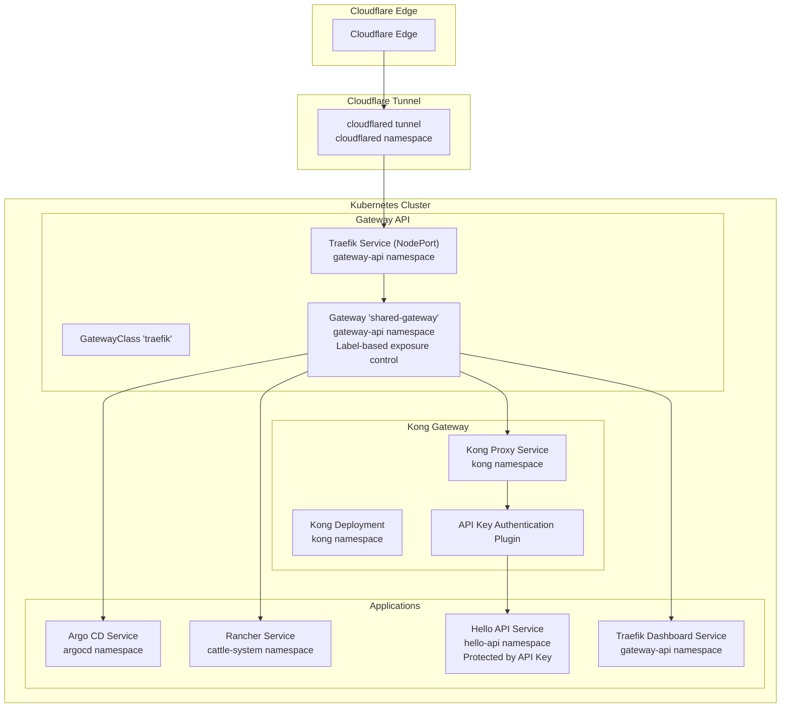
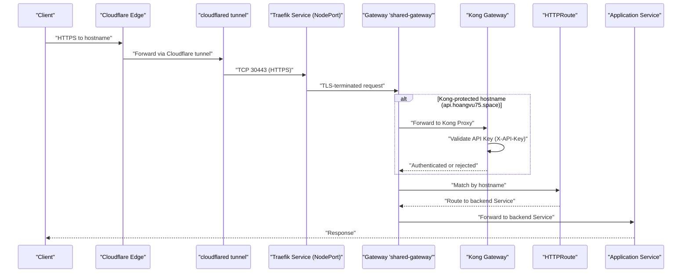
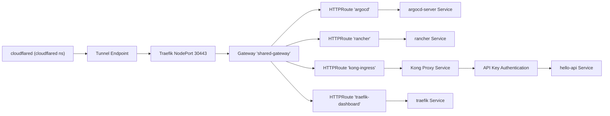

# Network Flow and Ingress Architecture

<cite>
**Referenced Files in This Document**
- [values.yaml](file://apps/infra/cloudflared/chart/values.yaml)
- [config.yaml](file://apps/infra/cloudflared/config.yaml)
- [kustomization.yaml](file://apps/infra/cloudflared/kustomization.yaml)
- [gatewayclass.yaml](file://apps/infra/gateway-api/chart/gatewayclass.yaml)
- [gateway.yaml](file://apps/infra/gateway-api/chart/gateway.yaml)
- [traefik.yaml](file://apps/infra/gateway-api/chart/traefik.yaml)
- [traefik-static.yaml](file://apps/infra/gateway-api/chart/traefik-static.yaml)
- [httproute-traefik-dashboard.yaml](file://apps/infra/gateway-api/chart/httproute-traefik-dashboard.yaml)
- [httproute-argocd.yaml](file://apps/playground/argocd-ingress/chart/httproute-argocd.yaml)
- [httproute-rancher.yaml](file://apps/playground/rancher/chart/httproute-rancher.yaml)
- [kustomization.yaml](file://apps/infra/gateway-api/kustomization.yaml)
- [namespace.yaml](file://cluster-resources/default/namespace.yaml)
- [values-httproute.yaml](file://apps/playground/hello-api/chart/values-httproute.yaml)
- [kustomization.yaml](file://apps/playground/hello-api/kustomization.yaml)
- [values.yaml](file://apps/infra/kong/chart/values.yaml)
- [httproute-kong.yaml](file://apps/infra/kong/chart/httproute-kong.yaml)
- [kustomization.yaml](file://apps/infra/kong/kustomization.yaml)
</cite>

## Update Summary
**Changes Made**
- Added Kong Gateway infrastructure with API key authentication as an additional layer
- Updated network flow to include Kong Gateway between Cloudflare and applications
- Enhanced security model with API key authentication plugin in Kong
- Updated HTTPRoute configuration to route through Kong for specific hostnames
- Modified architecture diagrams to reflect the new Kong Gateway component

## Table of Contents
1. [Introduction](#introduction)
2. [Project Structure](#project-structure)
3. [Core Components](#core-components)
4. [Architecture Overview](#architecture-overview)
5. [Detailed Component Analysis](#detailed-component-analysis)
6. [Namespace Exposure Control](#namespace-exposure-control)
7. [Dependency Analysis](#dependency-analysis)
8. [Performance Considerations](#performance-considerations)
9. [Troubleshooting Guide](#troubleshooting-guide)
10. [Security Enhancements](#security-enhancements)
11. [Conclusion](#conclusion)

## Introduction
This document describes the network flow and ingress architecture for a Kubernetes cluster that routes external traffic from Cloudflare Edge through a Cloudflare tunnel to a shared Gateway API Gateway backed by Traefik, then through Kong Gateway with API key authentication, and finally to applications. The architecture implements enhanced security through API key authentication while maintaining hostname-based routing via HTTPRoutes. It explains how the traffic path has been extended to include Kong as an additional security layer and details the security implications of this multi-layered approach.

## Project Structure
The network stack is composed of:
- Cloudflared tunnel agent deployed in the cloudflared namespace
- Gateway API CRDs installed in the cluster and Traefik configured as the Gateway API controller
- A shared Gateway named shared-gateway in the gateway-api namespace with label-based namespace exposure control
- Kong Gateway with API key authentication plugin in the kong namespace
- HTTPRoute resources with direct parentRef specification to the shared-gateway
- Applications exposed via Services and accessed through the enhanced routing pipeline

**Diagram sources**
- [values.yaml:1-40](file://apps/infra/cloudflared/chart/values.yaml#L1-L40)
- [gatewayclass.yaml:1-10](file://apps/infra/gateway-api/chart/gatewayclass.yaml#L1-L10)
- [gateway.yaml:1-34](file://apps/infra/gateway-api/chart/gateway.yaml#L1-L34)
- [traefik.yaml:98-157](file://apps/infra/gateway-api/chart/traefik.yaml#L98-L157)
- [values.yaml:16-37](file://apps/infra/kong/chart/values.yaml#L16-L37)
- [httproute-kong.yaml:1-29](file://apps/infra/kong/chart/httproute-kong.yaml#L1-L29)

**Section sources**
- [kustomization.yaml:1-9](file://apps/infra/gateway-api/kustomization.yaml#L1-L9)
- [kustomization.yaml:1-8](file://apps/infra/cloudflared/kustomization.yaml#L1-L8)
- [kustomization.yaml:1-8](file://apps/infra/kong/kustomization.yaml#L1-L8)

## Core Components
- Cloudflared tunnel agent: Runs as a deployment in the cloudflared namespace, configured to connect to Cloudflare tunnels using a token from a secret. It exposes no Kubernetes Service by default.
- Gateway API controller: Traefik runs as a Deployment in the gateway-api namespace with RBAC and watches Gateway API resources. It exposes a NodePort Service on ports 30080 (HTTP) and 30443 (HTTPS).
- Shared Gateway: A single Gateway named shared-gateway in the gateway-api namespace that accepts HTTP (port 80) and HTTPS (port 443) listeners and terminates TLS with a wildcard certificate secret. Uses label-based namespace exposure control.
- Kong Gateway: A deployment in the kong namespace with API key authentication plugin enabled. Provides an additional layer of security with API key validation before forwarding to applications.
- HTTPRoutes: Application-specific HTTPRoute resources that directly specify parentRefs to the shared-gateway and define hostname-based routing rules, with special handling for Kong-protected endpoints.

Key implementation references:
- Cloudflared deployment arguments and environment injection for the tunnel token
- GatewayClass controller name and description
- Gateway listeners with label-based namespace exposure control
- Traefik Deployment and NodePort Service exposing ports 80/443/admin
- Kong deployment with DB-less configuration and API key authentication plugin
- HTTPRoute examples for Argo CD, Rancher, Hello API, and Traefik dashboard with direct parentRef specification

**Section sources**
- [values.yaml:1-40](file://apps/infra/cloudflared/chart/values.yaml#L1-L40)
- [gatewayclass.yaml:1-10](file://apps/infra/gateway-api/chart/gatewayclass.yaml#L1-L10)
- [gateway.yaml:1-34](file://apps/infra/gateway-api/chart/gateway.yaml#L1-L34)
- [traefik.yaml:59-157](file://apps/infra/gateway-api/chart/traefik.yaml#L59-L157)
- [values.yaml:16-37](file://apps/infra/kong/chart/values.yaml#L16-L37)
- [httproute-argocd.yaml:1-29](file://apps/playground/argocd-ingress/chart/httproute-argocd.yaml#L1-L29)
- [httproute-rancher.yaml:1-30](file://apps/playground/rancher/chart/httproute-rancher.yaml#L1-L30)
- [httproute-traefik-dashboard.yaml:1-30](file://apps/infra/gateway-api/chart/httproute-traefik-dashboard.yaml#L1-L30)

## Architecture Overview
The traffic path from Cloudflare Edge to applications now follows these enhanced steps:
1. Cloudflare Edge receives inbound traffic for configured hostnames.
2. Traffic is routed to the configured Cloudflare tunnel endpoint.
3. cloudflared forwards traffic to the cluster via the tunnel.
4. The shared Gateway in the gateway-api namespace receives the request on port 443 (HTTPS) with TLS termination.
5. For specific hostnames (like api.hoangvu75.space), the request is forwarded to Kong Gateway for API key authentication.
6. Kong validates the API key header (X-API-Key) and either rejects or forwards the request to the backend service.
7. For non-Kong protected hostnames, the Gateway delegates routing decisions to Traefik, which selects the appropriate HTTPRoute based on hostname.
8. Traefik forwards the request to the matching backend Service based on the HTTPRoute configuration.
9. The application Service routes traffic to the pod(s) running the workload.

**Diagram sources**
- [values.yaml:11-18](file://apps/infra/cloudflared/chart/values.yaml#L11-L18)
- [gateway.yaml:20-34](file://apps/infra/gateway-api/chart/gateway.yaml#L20-L34)
- [traefik.yaml:120-157](file://apps/infra/gateway-api/chart/traefik.yaml#L120-L157)
- [httproute-argocd.yaml:9-29](file://apps/playground/argocd-ingress/chart/httproute-argocd.yaml#L9-L29)
- [httproute-rancher.yaml:9-30](file://apps/playground/rancher/chart/httproute-rancher.yaml#L9-L30)
- [httproute-traefik-dashboard.yaml:9-30](file://apps/infra/gateway-api/chart/httproute-traefik-dashboard.yaml#L9-L30)
- [httproute-kong.yaml:12-29](file://apps/infra/kong/chart/httproute-kong.yaml#L12-L29)

## Detailed Component Analysis

### Cloudflare Tunnel (cloudflared)
- Purpose: Establishes an outbound, encrypted tunnel from the cluster to Cloudflare Edge.
- Configuration highlights:
  - Deployment runs with arguments to start the tunnel and inject a token from a Kubernetes Secret.
  - No Kubernetes Service is created for cloudflared; traffic reaches the cluster via the tunnel proxy.
  - Replicas are set to 2 for availability.

Operational implications:
- The tunnel encrypts traffic between the cluster and Cloudflare Edge.
- Failover occurs automatically if one cloudflared pod dies; the tunnel remains functional with the second replica.

**Section sources**
- [values.yaml:1-40](file://apps/infra/cloudflared/chart/values.yaml#L1-L40)
- [config.yaml:1-4](file://apps/infra/cloudflared/config.yaml#L1-L4)
- [kustomization.yaml:1-8](file://apps/infra/cloudflared/kustomization.yaml#L1-L8)

### Gateway API Controller (Traefik)
- Purpose: Implements the Gateway API specification and acts as the ingress controller for Gateways and HTTPRoutes.
- Configuration highlights:
  - GatewayClass named 'traefik' with controller name indicating Traefik's Gateway API implementation.
  - Traefik Deployment in the gateway-api namespace with RBAC to watch Gateway API resources.
  - NodePort Service exposing ports 80 (nodePort 30080) and 443 (nodePort 30443) for external traffic.

Routing behavior:
- Gateway listeners accept HTTP (port 80) and HTTPS (port 443) with TLS termination enabled.
- HTTPRoutes in application namespaces directly reference the shared Gateway via parentRefs and define hostname-based routing.
- Uses label-based namespace exposure control via routing.hoangvu75.space/expose labels.

**Section sources**
- [gatewayclass.yaml:1-10](file://apps/infra/gateway-api/chart/gatewayclass.yaml#L1-L10)
- [gateway.yaml:1-34](file://apps/infra/gateway-api/chart/gateway.yaml#L1-L34)
- [traefik.yaml:59-157](file://apps/infra/gateway-api/chart/traefik.yaml#L59-L157)
- [kustomization.yaml:1-9](file://apps/infra/gateway-api/kustomization.yaml#L1-L9)

### Shared Gateway (hostname-based routing with label control)
- Purpose: Centralized Gateway that accepts traffic from namespaces with specific labels and terminates TLS.
- Listener configuration:
  - HTTP listener on port 80 with label-based namespace exposure control.
  - HTTPS listener on port 443 with TLS termination using a wildcard certificate stored as a Secret.
- Allowed routes: Only namespaces labeled with routing.hoangvu75.space/expose: "true" can reference this Gateway via HTTPRoute.

Routing enforcement:
- Hostname matching is enforced by HTTPRoute hostnames; only matching routes are considered.
- Uses label-based namespace exposure control rather than explicit namespace lists for better scalability.

**Section sources**
- [gateway.yaml:1-34](file://apps/infra/gateway-api/chart/gateway.yaml#L1-L34)

### Kong Gateway Infrastructure
- Purpose: Provides API key authentication as an additional security layer between Cloudflare and applications.
- Configuration highlights:
  - Deployment runs in the kong namespace with DB-less mode enabled via KIC (Kong Ingress Controller).
  - KIC (v3.3) watches Kubernetes Ingress, KongPlugin, and KongConsumer CRDs to configure Kong.
  - API key authentication plugin configured with custom header name (X-API-Key).
  - Consumer with key-auth credentials for API key validation.
  - ExternalName service bridges the kong namespace to hello-api namespace for cross-namespace routing.
  - HTTPRoute routes `api.hoangvu75.space` from Traefik shared-gateway → kong-proxy:80.
  - All images pulled from GHCR (ghcr.io/hoangvu75/) to avoid Docker Hub rate limits.

Security features:
- API key validation occurs before traffic reaches backend applications.
- Multiple API keys can be managed per consumer for different client access levels.
- Credentials can be hidden from response headers for security.

**Section sources**
- [values.yaml](file://apps/infra/kong/chart/values.yaml)
- [kong-plugin-key-auth.yaml](file://apps/infra/kong/chart/kong-plugin-key-auth.yaml)
- [kong-consumer.yaml](file://apps/infra/kong/chart/kong-consumer.yaml)
- [hello-api-ingress.yaml](file://apps/infra/kong/chart/hello-api-ingress.yaml)
- [externalname-hello-api.yaml](file://apps/infra/kong/chart/externalname-hello-api.yaml)
- [httproute-kong.yaml](file://apps/infra/kong/chart/httproute-kong.yaml)
- [kustomization.yaml](file://apps/infra/kong/chart/kustomization.yaml)

### HTTPRoute Examples and Enhanced Backend Mapping
- Argo CD HTTPRoute:
  - Hostname: argocd.hoangvu75.space
  - Parent Gateway: shared-gateway in gateway-api namespace (direct parentRef specification)
  - Backend: argocd-server Service on port 80
- Rancher HTTPRoute:
  - Hostname: rancher.hoangvu75.space
  - Parent Gateway: shared-gateway in gateway-api namespace (direct parentRef specification)
  - Backend: rancher Service on port 80
- Hello API HTTPRoute:
  - Hostname: api.hoangvu75.space
  - Parent Gateway: shared-gateway in gateway-api namespace (direct parentRef specification)
  - Backend: Kong Proxy Service (kong-proxy) on port 80
  - Additional: Kong HTTPRoute with API key authentication filter
- Traefik Dashboard HTTPRoute:
  - Hostname: traefik.hoangvu75.space
  - Parent Gateway: shared-gateway in gateway-api namespace (direct parentRef specification)
  - Backend: traefik Service on port 8080

Enhanced hostname-to-backend mapping table:
- argocd.hoangvu75.space -> argocd-server Service (port 80)
- rancher.hoangvu75.space -> rancher Service (port 80)
- api.hoangvu75.space -> Kong Proxy Service (port 80) with API key authentication
- traefik.hoangvu75.space -> traefik Service (port 8080)

**Section sources**
- [httproute-argocd.yaml:1-29](file://apps/playground/argocd-ingress/chart/httproute-argocd.yaml#L1-L29)
- [httproute-rancher.yaml:1-30](file://apps/playground/rancher/chart/httproute-rancher.yaml#L1-L30)
- [httproute-traefik-dashboard.yaml:1-30](file://apps/infra/gateway-api/chart/httproute-traefik-dashboard.yaml#L1-L30)
- [values-httproute.yaml:1-26](file://apps/playground/hello-api/chart/values-httproute.yaml#L1-L26)
- [httproute-kong.yaml:12-29](file://apps/infra/kong/chart/httproute-kong.yaml#L12-L29)

### NodePort Integration with Gateway API
- Traefik NodePort Service:
  - Port 80 mapped to NodePort 30080
  - Port 443 mapped to NodePort 30443
  - Port 8080 for Traefik dashboard
- How it integrates:
  - External clients reach the cluster via Cloudflare tunnel to TCP 30443 (HTTPS).
  - The Gateway terminates TLS and forwards to the appropriate HTTPRoute.
  - HTTPRoutes select the correct backend Service based on hostname.
  - Kong receives authenticated requests and forwards to backend services.

**Section sources**
- [traefik.yaml:120-157](file://apps/infra/gateway-api/chart/traefik.yaml#L120-L157)
- [gateway.yaml:20-34](file://apps/infra/gateway-api/chart/gateway.yaml#L20-L34)

## Namespace Exposure Control
The architecture uses label-based namespace exposure control for improved scalability and operational simplicity.

### Label-Based Control Mechanism
- **Label Definition**: routing.hoangvu75.space/expose: "true"
- **Gateway Configuration**: Gateway listeners specify `from: Selector` with label matching
- **Namespace Selection**: Only namespaces with the expose label are permitted to use the shared Gateway

### Namespace Configuration
Application namespaces are labeled appropriately:

| Namespace | Label | Purpose |
|-----------|-------|---------|
| gateway-api | routing.hoangvu75.space/expose: "true" | Gateway namespace |
| argocd | routing.hoangvu75.space/expose: "true" | Argo CD application |
| cattle-system | routing.hoangvu75.space/expose: "true" | Rancher application |
| hello-api | routing.hoangvu75.space/expose: "true" | Hello API application (with Kong protection) |
| kong | routing.hoangvu75.space/expose: "true" | Kong Gateway infrastructure |

### Benefits
- **Scalability**: Easy addition of new namespaces without Gateway reconfiguration
- **Security**: Explicit opt-in model prevents accidental exposure
- **Maintainability**: Centralized control through labels rather than static lists

**Section sources**
- [gateway.yaml:14-28](file://apps/infra/gateway-api/chart/gateway.yaml#L14-L28)
- [namespace.yaml:10-59](file://cluster-resources/default/namespace.yaml#L10-L59)

## Dependency Analysis
The following diagram shows the primary dependencies among components with the new Kong Gateway integration:

**Diagram sources**
- [values.yaml:11-18](file://apps/infra/cloudflared/chart/values.yaml#L11-L18)
- [traefik.yaml:120-157](file://apps/infra/gateway-api/chart/traefik.yaml#L120-L157)
- [gateway.yaml:1-34](file://apps/infra/gateway-api/chart/gateway.yaml#L1-L34)
- [httproute-argocd.yaml:9-29](file://apps/playground/argocd-ingress/chart/httproute-argocd.yaml#L9-L29)
- [httproute-rancher.yaml:9-30](file://apps/playground/rancher/chart/httproute-rancher.yaml#L9-L30)
- [httproute-traefik-dashboard.yaml:9-30](file://apps/infra/gateway-api/chart/httproute-traefik-dashboard.yaml#L9-L30)
- [httproute-kong.yaml:9-29](file://apps/infra/kong/chart/httproute-kong.yaml#L9-L29)

**Section sources**
- [gatewayclass.yaml:1-10](file://apps/infra/gateway-api/chart/gatewayclass.yaml#L1-L10)
- [gateway.yaml:1-34](file://apps/infra/gateway-api/chart/gateway.yaml#L1-L34)
- [traefik.yaml:59-157](file://apps/infra/gateway-api/chart/traefik.yaml#L59-L157)
- [httproute-argocd.yaml:1-29](file://apps/playground/argocd-ingress/chart/httproute-argocd.yaml#L1-L29)
- [httproute-rancher.yaml:1-30](file://apps/playground/rancher/chart/httproute-rancher.yaml#L1-L30)
- [httproute-traefik-dashboard.yaml:1-30](file://apps/infra/gateway-api/chart/httproute-traefik-dashboard.yaml#L1-L30)
- [httproute-kong.yaml:1-29](file://apps/infra/kong/chart/httproute-kong.yaml#L1-L29)

## Performance Considerations
- Traefik resource requests and limits are modest, suitable for small to medium workloads. Scale horizontally if needed.
- cloudflared runs with minimal CPU/memory requests; ensure adequate capacity for expected tunnel throughput.
- Gateway API controller overhead is low compared to traditional ingress controllers; keep HTTPRoute rules concise to reduce route computation.
- Kong adds minimal overhead for API key validation but provides significant security benefits.
- NodePort exposure is simple but lacks advanced load balancing features; consider adding external load balancers if scaling beyond a single-node cluster.
- API key validation occurs at the edge of the cluster, reducing processing overhead inside the cluster.

## Troubleshooting Guide
Common issues and resolutions:
- No traffic reaching applications via Cloudflare tunnel
  - Verify cloudflared deployment is healthy and the tunnel token secret is present.
  - Confirm the tunnel is connected and traffic is being forwarded to the cluster.
  - Check firewall and Cloudflare tunnel configuration.
- TLS handshake failures or certificate errors
  - Ensure the wildcard certificate Secret referenced by the Gateway exists and is valid.
  - Confirm the certificate covers the hostnames used in HTTPRoutes.
- Hostname not matching any HTTPRoute
  - Verify HTTPRoute hostnames exactly match the requested domain.
  - Ensure HTTPRoute parentRefs point to the shared Gateway in the gateway-api namespace.
  - Verify the application namespace has the routing.hoangvu75.space/expose: "true" label.
- Backend not receiving traffic
  - Confirm the backend Service exists and targets the correct Pod ports.
  - Check Service selectors and Pod readiness.
- Gateway API resources not applied
  - Ensure Gateway API CRDs are installed in the cluster.
  - Verify the GatewayClass controller name matches Traefik's controller name.
- NodePort connectivity issues
  - Validate NodePort Service is created and reachable from outside the cluster.
  - Confirm firewall rules allow inbound connections to ports 30080 and 30443.
- Kong API key authentication failures
  - Verify the X-API-Key header is included in requests to Kong-protected endpoints.
  - Check that the API key matches the configured consumer credentials.
  - Ensure the Kong Proxy Service is reachable from the Gateway.
- Kong service unreachable
  - Verify Kong deployment is running and healthy.
  - Check Kong Proxy Service configuration and port mappings.
  - Confirm Kong HTTPRoute is properly configured and attached to the shared Gateway.

**Section sources**
- [values.yaml:19-21](file://apps/infra/cloudflared/chart/values.yaml#L19-L21)
- [gateway.yaml:23-34](file://apps/infra/gateway-api/chart/gateway.yaml#L23-L34)
- [gatewayclass.yaml:8-10](file://apps/infra/gateway-api/chart/gatewayclass.yaml#L8-L10)
- [traefik.yaml:120-157](file://apps/infra/gateway-api/chart/traefik.yaml#L120-L157)
- [httproute-argocd.yaml:12-29](file://apps/playground/argocd-ingress/chart/httproute-argocd.yaml#L12-L29)
- [httproute-rancher.yaml:12-30](file://apps/playground/rancher/chart/httproute-rancher.yaml#L12-L30)
- [httproute-traefik-dashboard.yaml:12-30](file://apps/infra/gateway-api/chart/httproute-traefik-dashboard.yaml#L12-L30)
- [values.yaml:29-37](file://apps/infra/kong/chart/values.yaml#L29-L37)
- [httproute-kong.yaml:12-29](file://apps/infra/kong/chart/httproute-kong.yaml#L12-L29)

## Security Enhancements
- TLS termination at the Gateway:
  - HTTPS traffic is terminated at the Gateway using a wildcard certificate, reducing TLS overhead inside the cluster.
  - Ensure the certificate is rotated regularly and stored securely as a Kubernetes Secret.
- Cloudflare tunnel encryption:
  - All traffic between Cloudflare Edge and the cluster is encrypted via the tunnel, protecting against interception.
- Enhanced API Security with Kong:
  - API key authentication adds an additional security layer for sensitive endpoints.
  - Custom header name (X-API-Key) provides flexibility in API key management.
  - Credentials can be hidden from response headers for enhanced security.
  - Multiple consumers can be managed for different client access levels.
- Namespace isolation:
  - Applications reside in separate namespaces with explicit exposure labels (e.g., argocd, cattle-system, hello-api, kong).
  - HTTPRoute resources are scoped to specific namespaces via label-based selection, preventing unintended cross-namespace routing.
- Multi-layered security approach:
  - Cloudflare tunnel encryption + Gateway TLS termination + Kong API key authentication provides defense in depth.
  - API key validation occurs at the cluster boundary, reducing attack surface on internal services.

**Section sources**
- [values.yaml:29-37](file://apps/infra/kong/chart/values.yaml#L29-L37)
- [httproute-kong.yaml:19-26](file://apps/infra/kong/chart/httproute-kong.yaml#L19-L26)

## Conclusion
This architecture leverages Cloudflare tunnels for secure, encrypted ingress into the cluster, a shared Gateway for centralized, TLS-terminating routing with label-based namespace exposure control, and Kong Gateway with API key authentication for enhanced security. The traffic path now includes an additional security layer where Kong validates API keys before forwarding requests to backend applications. The direct parentRef approach with Traefik and Kong provides simplified configuration management while label-based namespace exposure control ensures scalable and secure routing management. The NodePort Service exposes the Gateway externally, while namespace isolation, strict TLS termination, and API key authentication provide strong security boundaries. With proper monitoring, label-based controls, and API key management, this multi-layered design offers a robust, scalable, and highly secure ingress solution.