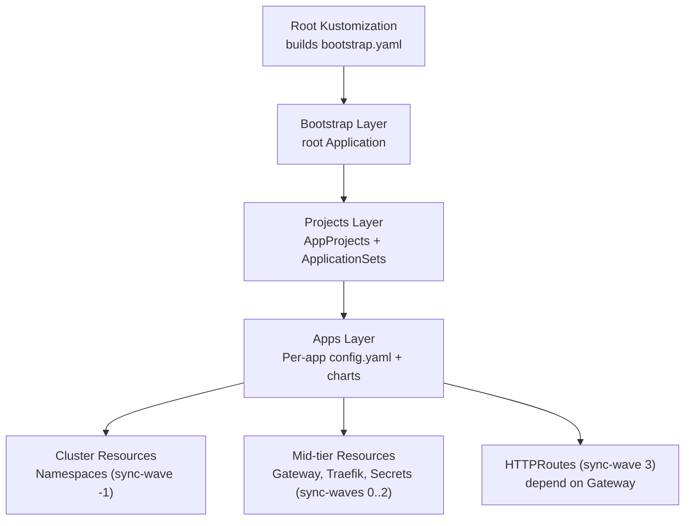
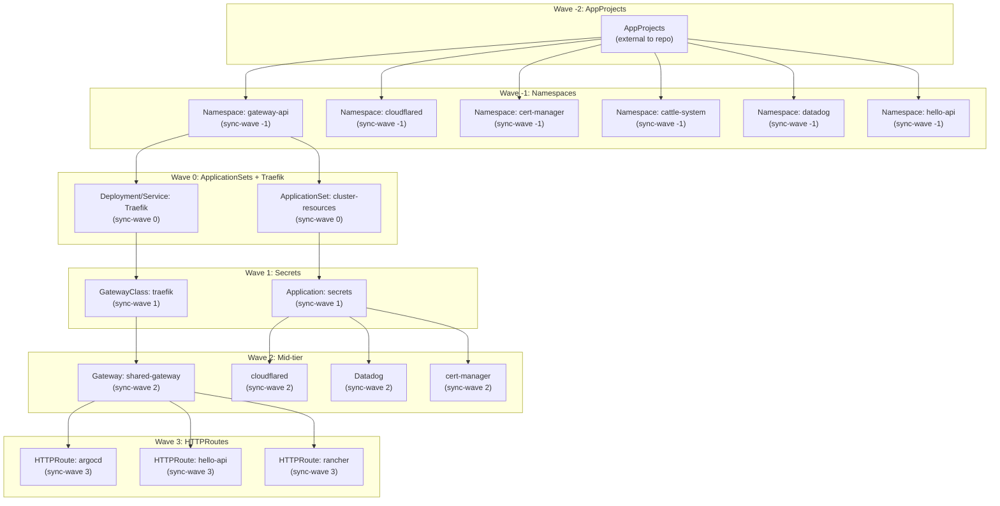
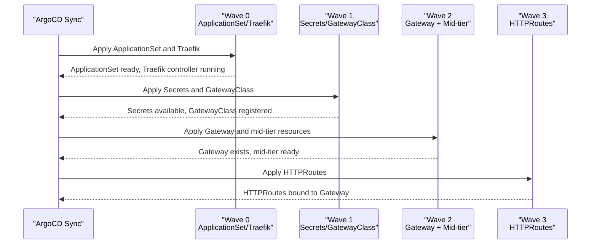

# Sync Ordering and Deployment Strategy

<cite>
**Referenced Files in This Document**
- [README.md](file://README.md)
- [cluster-resources.yaml](file://bootstrap/cluster-resources.yaml)
- [secrets.yaml](file://bootstrap/secrets.yaml)
- [namespace.yaml](file://cluster-resources/default/namespace.yaml)
- [config.yaml](file://apps/infra/gateway-api/config.yaml)
- [traefik.yaml](file://apps/infra/gateway-api/chart/traefik.yaml)
- [gateway.yaml](file://apps/infra/gateway-api/chart/gateway.yaml)
- [gatewayclass.yaml](file://apps/infra/gateway-api/chart/gatewayclass.yaml)
- [cloudflared config.yaml](file://apps/infra/cloudflared/config.yaml)
- [datadog config.yaml](file://apps/infra/datadog/config.yaml)
- [cert-manager config.yaml](file://apps/playground/cert-manager/config.yaml)
- [argocd-ingress config.yaml](file://apps/playground/argocd-ingress/config.yaml)
- [argocd-ingress httproute-argocd.yaml](file://apps/playground/argocd-ingress/chart/httproute-argocd.yaml)
- [hello-api values-httproute.yaml](file://apps/playground/hello-api/chart/values-httproute.yaml)
- [rancher config.yaml](file://apps/playground/rancher/config.yaml)
</cite>

## Table of Contents
1. [Introduction](#introduction)
2. [Project Structure](#project-structure)
3. [Core Components](#core-components)
4. [Architecture Overview](#architecture-overview)
5. [Detailed Component Analysis](#detailed-component-analysis)
6. [Dependency Analysis](#dependency-analysis)
7. [Performance Considerations](#performance-considerations)
8. [Troubleshooting Guide](#troubleshooting-guide)
9. [Conclusion](#conclusion)

## Introduction
This document explains the sync ordering mechanism used to deploy Kubernetes resources in a predictable sequence. It focuses on the sync-wave annotation system and the sequential deployment strategy that ensures dependencies are satisfied before dependent resources are created. The strategy groups resources into waves from -2 to +3, ensuring AppProjects, Namespaces, ApplicationSets and Traefik run first, followed by Secrets, mid-tier platform resources, and finally HTTPRoutes that rely on Gateways.

## Project Structure
The repository organizes manifests across several layers:
- Root build pipeline produces a bootstrap manifest consumed by ArgoCD.
- Bootstrap layer defines the root Application and foundational ApplicationSets.
- Projects define AppProjects and ApplicationSets that discover per-app configurations.
- Apps define per-application manifests and optional config.yaml files that can set sync-wave.

**Section sources**
- [README.md:57-75](file://README.md#L57-L75)
- [README.md:87-118](file://README.md#L87-L118)

## Core Components
- Sync-wave annotation: An annotation applied to ArgoCD Application/ApplicationSet or individual Kubernetes manifests to control ordering during ArgoCD sync.
- Waves:
  - Wave -2: AppProjects
  - Wave -1: Namespaces
  - Wave 0: ApplicationSets, Traefik Deployment
  - Wave 1: Secrets from private repo
  - Wave 2: Mid-tier resources (e.g., Gateway, Datadog, cert-manager)
  - Wave 3: HTTPRoutes (must run after Gateway exists)

These waves prevent dependency conflicts by ensuring prerequisites are created before dependents.

**Section sources**
- [README.md:76-85](file://README.md#L76-L85)
- [README.md:136-142](file://README.md#L136-L142)

## Architecture Overview
The deployment proceeds in waves. The following diagram maps the waves to concrete manifests and their roles.

**Diagram sources**
- [cluster-resources.yaml:4-5](file://bootstrap/cluster-resources.yaml#L4-L5)
- [namespace.yaml:8-9](file://cluster-resources/default/namespace.yaml#L8-L9)
- [traefik.yaml:61](file://apps/infra/gateway-api/chart/traefik.yaml#L61)
- [traefik.yaml:103](file://apps/infra/gateway-api/chart/traefik.yaml#L103)
- [gatewayclass.yaml:5-6](file://apps/infra/gateway-api/chart/gatewayclass.yaml#L5-L6)
- [gateway.yaml:6-7](file://apps/infra/gateway-api/chart/gateway.yaml#L6-L7)
- [cloudflared config.yaml:2-3](file://apps/infra/cloudflared/config.yaml#L2-L3)
- [datadog config.yaml:4-5](file://apps/infra/datadog/config.yaml#L4-L5)
- [cert-manager config.yaml:2-3](file://apps/playground/cert-manager/config.yaml#L2-L3)
- [argocd-ingress config.yaml:2-3](file://apps/playground/argocd-ingress/config.yaml#L2-L3)
- [argocd-ingress httproute-argocd.yaml:6-7](file://apps/playground/argocd-ingress/chart/httproute-argocd.yaml#L6-L7)
- [hello-api values-httproute.yaml:3-4](file://apps/playground/hello-api/chart/values-httproute.yaml#L3-L4)
- [rancher config.yaml:2-3](file://apps/playground/rancher/config.yaml#L2-L3)

**Section sources**
- [README.md:76-85](file://README.md#L76-L85)
- [README.md:144-146](file://README.md#L144-L146)

## Detailed Component Analysis

### Wave -2: AppProjects
- Responsibility: Define ArgoCD AppProjects that govern permissions and sync policies for application sets.
- Placement: Managed externally to this repository; referenced by the root Application.
- Impact: Without AppProjects, ApplicationSets cannot be created or synced.

[No sources needed since this section describes conceptual placement rather than specific file content]

### Wave -1: Namespaces
- Responsibility: Create shared namespaces required by downstream apps.
- Manifests: Namespace resources annotated with sync-wave -1.
- Examples:
  - Namespace: gateway-api
  - Namespace: cloudflared
  - Namespace: cert-manager
  - Namespace: cattle-system
  - Namespace: datadog
  - Namespace: hello-api

Rationale:
- Ensures target namespaces exist before ArgoCD attempts to deploy resources into them.

**Section sources**
- [namespace.yaml:8-9](file://cluster-resources/default/namespace.yaml#L8-L9)
- [namespace.yaml:15-16](file://cluster-resources/default/namespace.yaml#L15-L16)
- [namespace.yaml:21-23](file://cluster-resources/default/namespace.yaml#L21-L23)
- [namespace.yaml:28-30](file://cluster-resources/default/namespace.yaml#L28-L30)
- [namespace.yaml:35-37](file://cluster-resources/default/namespace.yaml#L35-L37)
- [namespace.yaml:49-51](file://cluster-resources/default/namespace.yaml#L49-L51)

### Wave 0: ApplicationSets and Traefik
- Responsibility: Discover and render per-app manifests; deploy Traefik as the Gateway API controller.
- Manifests:
  - ApplicationSet: cluster-resources (sync-wave 0)
  - Deployment/Service: Traefik (sync-wave 0)
  - Application: secrets (sync-wave 1) appears in this wave’s logical grouping but is scheduled by wave 1
- Rationale:
  - ApplicationSets must exist before discovering apps.
  - Traefik must be ready to serve Gateway API resources before Gateways and HTTPRoutes are created.

**Section sources**
- [cluster-resources.yaml:4-5](file://bootstrap/cluster-resources.yaml#L4-L5)
- [traefik.yaml:61](file://apps/infra/gateway-api/chart/traefik.yaml#L61)
- [traefik.yaml:103](file://apps/infra/gateway-api/chart/traefik.yaml#L103)

### Wave 1: Secrets
- Responsibility: Sync secrets from a private repository.
- Manifests:
  - Application: secrets (sync-wave 1)
  - GatewayClass: traefik (sync-wave 1)
- Rationale:
  - Secrets must be present before dependent resources (e.g., TLS certs) that reference them.
  - GatewayClass must be created so the Gateway controller can operate.

**Section sources**
- [secrets.yaml:6-7](file://bootstrap/secrets.yaml#L6-L7)
- [gatewayclass.yaml:5-6](file://apps/infra/gateway-api/chart/gatewayclass.yaml#L5-L6)

### Wave 2: Mid-tier Resources
- Responsibility: Deploy platform components that enable ingress and monitoring.
- Manifests:
  - Gateway: shared-gateway (sync-wave 2)
  - cloudflared (sync-wave 2)
  - Datadog (sync-wave 2)
  - cert-manager (sync-wave 2)
- Rationale:
  - Gateway must exist before HTTPRoutes can route traffic.
  - Other mid-tier resources (monitoring, certificates) are deployed alongside Gateway.

**Section sources**
- [gateway.yaml:6-7](file://apps/infra/gateway-api/chart/gateway.yaml#L6-L7)
- [cloudflared config.yaml:2-3](file://apps/infra/cloudflared/config.yaml#L2-L3)
- [datadog config.yaml:4-5](file://apps/infra/datadog/config.yaml#L4-L5)
- [cert-manager config.yaml:2-3](file://apps/playground/cert-manager/config.yaml#L2-L3)

### Wave 3: HTTPRoutes
- Responsibility: Route traffic to backend services via Gateway.
- Manifests:
  - HTTPRoute: argocd (sync-wave 3)
  - HTTPRoute: hello-api (sync-wave 3)
  - HTTPRoute: rancher (sync-wave 3)
- Rationale:
  - HTTPRoutes depend on an existing Gateway and its controller (Traefik) to become effective.

**Section sources**
- [argocd-ingress config.yaml:2-3](file://apps/playground/argocd-ingress/config.yaml#L2-L3)
- [argocd-ingress httproute-argocd.yaml:6-7](file://apps/playground/argocd-ingress/chart/httproute-argocd.yaml#L6-L7)
- [hello-api values-httproute.yaml:3-4](file://apps/playground/hello-api/chart/values-httproute.yaml#L3-L4)
- [rancher config.yaml:2-3](file://apps/playground/rancher/config.yaml#L2-L3)

### Sync-Wave Annotation System
- Where to set:
  - On Application/ApplicationSet manifests to control ArgoCD sync order.
  - On individual Kubernetes manifests (e.g., Deployment, Service, Gateway, HTTPRoute) to refine ordering within an app.
- Example locations:
  - ApplicationSet: cluster-resources
  - Application: secrets
  - Deployment/Service: Traefik
  - GatewayClass: traefik
  - Gateway: shared-gateway
  - HTTPRoute: argocd
  - cloudflared, Datadog, cert-manager
- Reference example in repository documentation showing how to set the annotation in config.yaml.

**Section sources**
- [README.md:136-142](file://README.md#L136-L142)
- [cluster-resources.yaml:4-5](file://bootstrap/cluster-resources.yaml#L4-L5)
- [secrets.yaml:6-7](file://bootstrap/secrets.yaml#L6-L7)
- [traefik.yaml:61](file://apps/infra/gateway-api/chart/traefik.yaml#L61)
- [traefik.yaml:103](file://apps/infra/gateway-api/chart/traefik.yaml#L103)
- [gatewayclass.yaml:5-6](file://apps/infra/gateway-api/chart/gatewayclass.yaml#L5-L6)
- [gateway.yaml:6-7](file://apps/infra/gateway-api/chart/gateway.yaml#L6-L7)
- [argocd-ingress config.yaml:2-3](file://apps/playground/argocd-ingress/config.yaml#L2-L3)
- [argocd-ingress httproute-argocd.yaml:6-7](file://apps/playground/argocd-ingress/chart/httproute-argocd.yaml#L6-L7)
- [cloudflared config.yaml:2-3](file://apps/infra/cloudflared/config.yaml#L2-L3)
- [datadog config.yaml:4-5](file://apps/infra/datadog/config.yaml#L4-L5)
- [cert-manager config.yaml:2-3](file://apps/playground/cert-manager/config.yaml#L2-L3)

## Dependency Analysis
The following sequence diagram illustrates how resources depend on each other and how waves enforce correct ordering.

**Diagram sources**
- [cluster-resources.yaml:4-5](file://bootstrap/cluster-resources.yaml#L4-L5)
- [traefik.yaml:61](file://apps/infra/gateway-api/chart/traefik.yaml#L61)
- [gatewayclass.yaml:5-6](file://apps/infra/gateway-api/chart/gatewayclass.yaml#L5-L6)
- [gateway.yaml:6-7](file://apps/infra/gateway-api/chart/gateway.yaml#L6-L7)
- [argocd-ingress httproute-argocd.yaml:6-7](file://apps/playground/argocd-ingress/chart/httproute-argocd.yaml#L6-L7)

## Performance Considerations
- Minimizing sync duration: Keep sync-wave assignments tight to avoid unnecessary delays.
- Resource readiness: Ensure Traefik is healthy before creating Gateways and HTTPRoutes to reduce reconciliation loops.
- Namespace creation: Pre-creating namespaces avoids repeated failures when deploying into new namespaces.

[No sources needed since this section provides general guidance]

## Troubleshooting Guide
Common issues and resolutions:

- HTTPRoute fails to attach to Gateway
  - Symptom: HTTPRoute remains unscheduled or shows missing parent gateway.
  - Cause: Gateway does not exist yet.
  - Fix: Verify Gateway is in wave 2 and HTTPRoutes are in wave 3; confirm sync-wave annotations are present on both Gateway and HTTPRoute.

- HTTPRoute references non-existent secret
  - Symptom: TLS or header modifier filters fail due to missing secret.
  - Cause: Secrets not yet synced.
  - Fix: Ensure Secrets application runs in wave 1; confirm the referenced secret exists before HTTPRoute creation.

- Application fails to deploy into a new namespace
  - Symptom: ArgoCD reports permission or namespace errors.
  - Cause: Target namespace not created yet.
  - Fix: Confirm namespace manifests are annotated with sync-wave -1 and were applied before the app.

- GatewayClass not recognized
  - Symptom: Gateway stays unready or controller does not reconcile.
  - Cause: GatewayClass not created.
  - Fix: Ensure GatewayClass is in wave 1 and created before Gateway.

Best practices:
- Assign sync-wave consistently across related resources (e.g., Gateway and its HTTPRoutes).
- Use negative waves for prerequisites and positive waves for dependents.
- Keep wave gaps minimal to reduce total sync time.
- Validate the order by reviewing ArgoCD logs and resource statuses after each wave completes.

**Section sources**
- [README.md:76-85](file://README.md#L76-L85)
- [namespace.yaml:8-9](file://cluster-resources/default/namespace.yaml#L8-L9)
- [gateway.yaml:6-7](file://apps/infra/gateway-api/chart/gateway.yaml#L6-L7)
- [argocd-ingress httproute-argocd.yaml:6-7](file://apps/playground/argocd-ingress/chart/httproute-argocd.yaml#L6-L7)

## Conclusion
The sync-wave mechanism enforces a deterministic deployment order that prevents dependency conflicts. By assigning AppProjects, Namespaces, ApplicationSets, and Traefik to early waves, Secrets and GatewayClass to wave 1, mid-tier resources to wave 2, and HTTPRoutes to wave 3, the system ensures Gateways exist before HTTPRoutes can function. Use the annotation system to align resource creation order with runtime dependencies, and follow the troubleshooting steps to diagnose and resolve common issues.