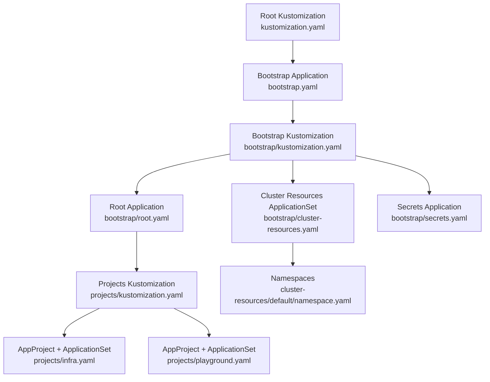
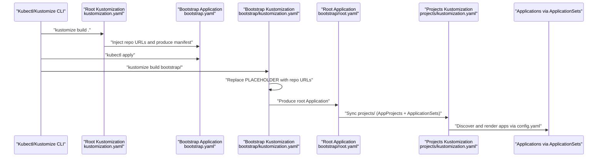
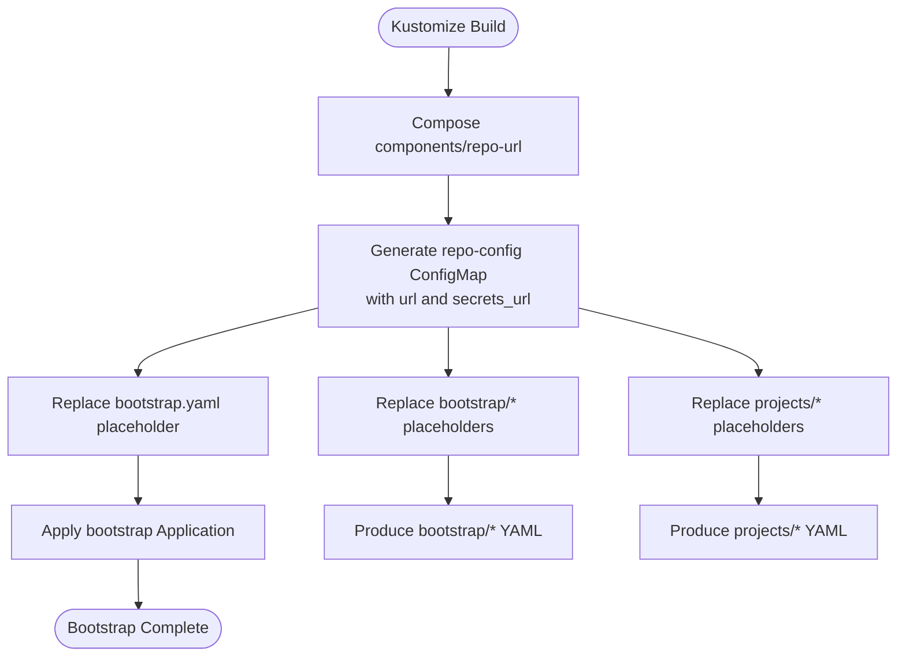
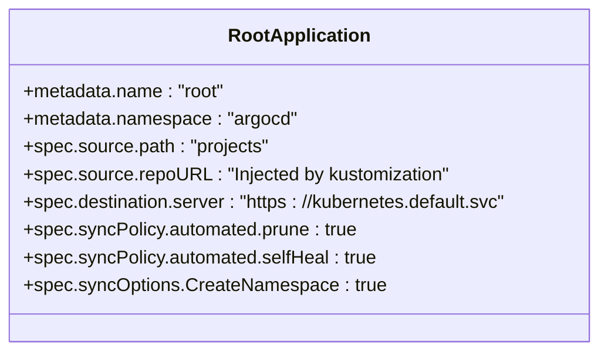
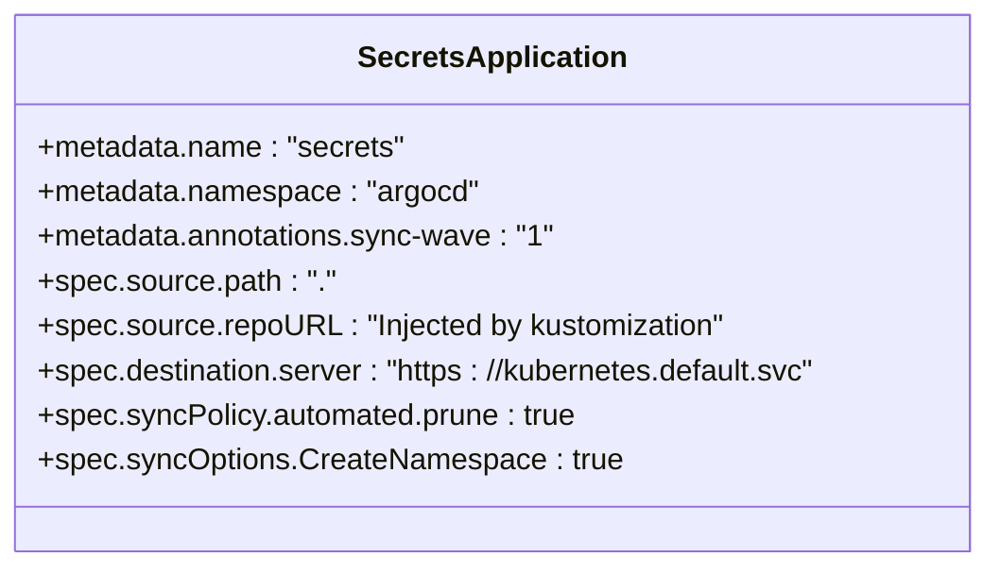
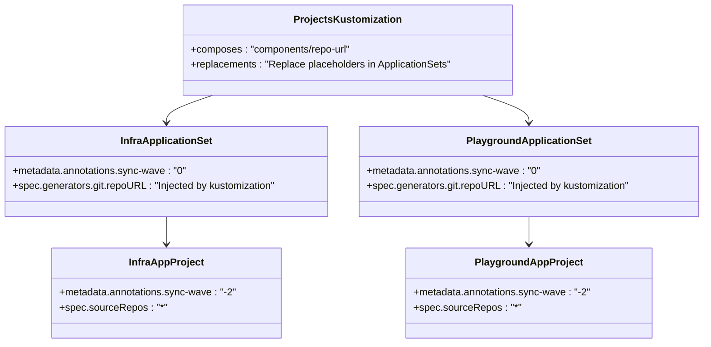
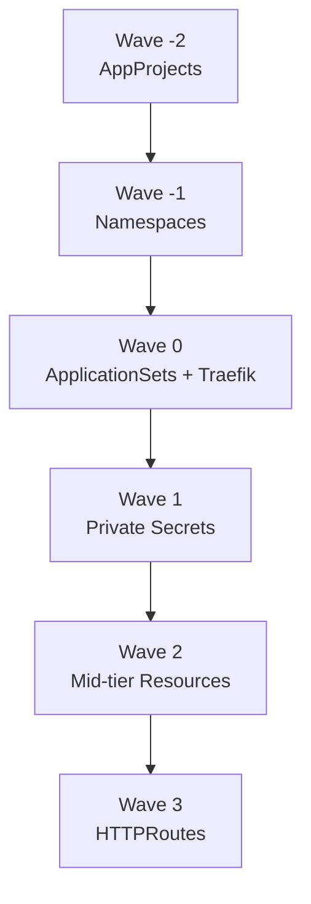
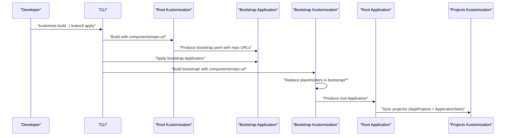
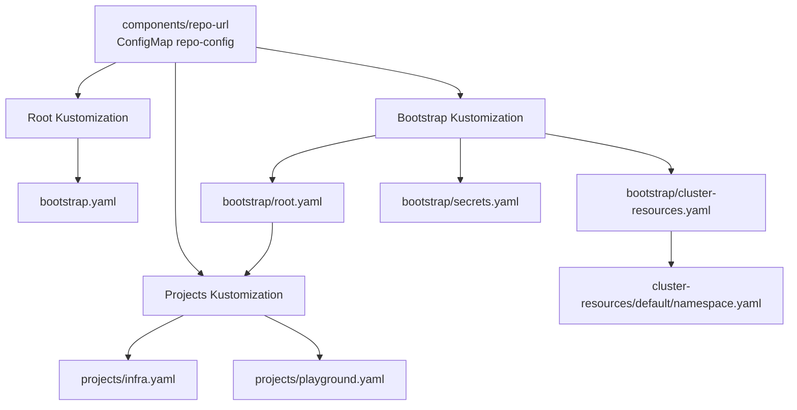

# Bootstrap System

<cite>
**Referenced Files in This Document**
- [bootstrap/kustomization.yaml](file://bootstrap/kustomization.yaml)
- [bootstrap/root.yaml](file://bootstrap/root.yaml)
- [bootstrap/cluster-resources.yaml](file://bootstrap/cluster-resources.yaml)
- [bootstrap/secrets.yaml](file://bootstrap/secrets.yaml)
- [bootstrap.yaml](file://bootstrap.yaml)
- [kustomization.yaml](file://kustomization.yaml)
- [components/repo-url/kustomization.yaml](file://components/repo-url/kustomization.yaml)
- [projects/kustomization.yaml](file://projects/kustomization.yaml)
- [projects/infra.yaml](file://projects/infra.yaml)
- [projects/playground.yaml](file://projects/playground.yaml)
- [cluster-resources/default/namespace.yaml](file://cluster-resources/default/namespace.yaml)
- [README.md](file://README.md)
- [guide/argocd/argo_cd.md](file://guide/argocd/argo_cd.md)
- [guide/argocd/argocd-repository-secrets.yaml](file://guide/argocd/argocd-repository-secrets.yaml)
</cite>

## Table of Contents
1. [Introduction](#introduction)
2. [Project Structure](#project-structure)
3. [Core Components](#core-components)
4. [Architecture Overview](#architecture-overview)
5. [Detailed Component Analysis](#detailed-component-analysis)
6. [Dependency Analysis](#dependency-analysis)
7. [Performance Considerations](#performance-considerations)
8. [Troubleshooting Guide](#troubleshooting-guide)
9. [Conclusion](#conclusion)

## Introduction
This document explains the bootstrap system that initializes the entire GitOps infrastructure using ArgoCD, Kustomize, and Helm. It covers the bootstrap chain from kustomize build through bootstrap.yaml to final cluster configuration, the repository URL substitution mechanism using components/repo-url, and how placeholders are replaced during kustomization. It also documents the root Application configuration pointing to projects/, the cluster-resources.yaml ApplicationSet for namespace creation, and secrets.yaml for synchronizing private repository content. Finally, it explains the sync wave ordering (-2 to +3) and why certain resources must be created before others, and how bootstrap components collectively establish the foundation for the entire infrastructure management system.

## Project Structure
The bootstrap system is composed of:
- Root Kustomization that injects repository URLs and applies the bootstrap Application
- Bootstrap Kustomization that applies the same component to replace placeholders in root, cluster-resources, and secrets
- Root Application that points to projects/
- Projects that define AppProjects and ApplicationSets
- Cluster resources that provision shared namespaces and cluster-level objects
- Secrets Application that synchronizes private repository content



**Diagram sources**
- [kustomization.yaml:1-21](file://kustomization.yaml#L1-L21)
- [bootstrap.yaml:1-26](file://bootstrap.yaml#L1-L26)
- [bootstrap/kustomization.yaml:1-38](file://bootstrap/kustomization.yaml#L1-L38)
- [bootstrap/root.yaml:1-37](file://bootstrap/root.yaml#L1-L37)
- [bootstrap/cluster-resources.yaml:1-33](file://bootstrap/cluster-resources.yaml#L1-L33)
- [bootstrap/secrets.yaml:1-24](file://bootstrap/secrets.yaml#L1-L24)
- [projects/kustomization.yaml:1-22](file://projects/kustomization.yaml#L1-L22)
- [projects/infra.yaml:1-85](file://projects/infra.yaml#L1-L85)
- [projects/playground.yaml:1-90](file://projects/playground.yaml#L1-L90)
- [cluster-resources/default/namespace.yaml:1-52](file://cluster-resources/default/namespace.yaml#L1-L52)

**Section sources**
- [README.md:57-118](file://README.md#L57-L118)
- [kustomization.yaml:1-21](file://kustomization.yaml#L1-L21)
- [bootstrap/kustomization.yaml:1-38](file://bootstrap/kustomization.yaml#L1-L38)

## Core Components
- Root Kustomization injects repository URLs via a shared component and applies bootstrap.yaml. It replaces the placeholder in bootstrap.yaml with the configured repo URL.
- Bootstrap Kustomization injects the same component and replaces placeholders in root.yaml, cluster-resources.yaml, and secrets.yaml.
- Root Application (bootstrap/root.yaml) points to projects/ and automates sync with pruning and self-healing.
- Cluster Resources ApplicationSet (bootstrap/cluster-resources.yaml) provisions namespaces and cluster-level objects with sync-wave 0.
- Secrets Application (bootstrap/secrets.yaml) synchronizes private repository content with sync-wave 1.
- Projects Kustomization (projects/kustomization.yaml) injects repository URLs and replaces placeholders in ApplicationSets.
- AppProjects and ApplicationSets (projects/infra.yaml, projects/playground.yaml) define discovery and sync behavior for applications.

**Section sources**
- [kustomization.yaml:1-21](file://kustomization.yaml#L1-L21)
- [bootstrap/kustomization.yaml:1-38](file://bootstrap/kustomization.yaml#L1-L38)
- [bootstrap/root.yaml:1-37](file://bootstrap/root.yaml#L1-L37)
- [bootstrap/cluster-resources.yaml:1-33](file://bootstrap/cluster-resources.yaml#L1-L33)
- [bootstrap/secrets.yaml:1-24](file://bootstrap/secrets.yaml#L1-L24)
- [projects/kustomization.yaml:1-22](file://projects/kustomization.yaml#L1-L22)
- [projects/infra.yaml:1-85](file://projects/infra.yaml#L1-L85)
- [projects/playground.yaml:1-90](file://projects/playground.yaml#L1-L90)

## Architecture Overview
The bootstrap chain proceeds in stages:
1. Root Kustomization builds bootstrap.yaml with repository URLs injected from components/repo-url and applies it to create the initial bootstrap Application.
2. Bootstrap Kustomization applies the same component to replace placeholders in root.yaml, cluster-resources.yaml, and secrets.yaml.
3. Root Application (bootstrap/root.yaml) syncs projects/, which define AppProjects and ApplicationSets.
4. Cluster Resources ApplicationSet (bootstrap/cluster-resources.yaml) creates namespaces and shared cluster objects with sync-wave -1.
5. Secrets Application (bootstrap/secrets.yaml) synchronizes private repository content with sync-wave 1.
6. ApplicationSets in projects/ discover apps via config.yaml files and render them with Kustomize and Helm.
7. Applications render manifests and are synced according to their own sync waves.



**Diagram sources**
- [README.md:59-75](file://README.md#L59-L75)
- [kustomization.yaml:1-21](file://kustomization.yaml#L1-L21)
- [bootstrap.yaml:1-26](file://bootstrap.yaml#L1-L26)
- [bootstrap/kustomization.yaml:1-38](file://bootstrap/kustomization.yaml#L1-L38)
- [bootstrap/root.yaml:1-37](file://bootstrap/root.yaml#L1-L37)
- [projects/kustomization.yaml:1-22](file://projects/kustomization.yaml#L1-L22)

## Detailed Component Analysis

### Repository URL Substitution Mechanism
- Centralized definition: components/repo-url/kustomization.yaml defines a ConfigMap named repo-config with two data fields: url and secrets_url.
- Root Kustomization: kustomization.yaml composes components/repo-url and replaces the placeholder in bootstrap.yaml with the url value.
- Bootstrap Kustomization: bootstrap/kustomization.yaml composes components/repo-url and replaces placeholders in root.yaml, cluster-resources.yaml, and secrets.yaml with url and secrets_url respectively.
- Projects Kustomization: projects/kustomization.yaml composes components/repo-url and replaces placeholders in ApplicationSets with the url value.



**Diagram sources**
- [components/repo-url/kustomization.yaml:1-11](file://components/repo-url/kustomization.yaml#L1-L11)
- [kustomization.yaml:1-21](file://kustomization.yaml#L1-L21)
- [bootstrap/kustomization.yaml:1-38](file://bootstrap/kustomization.yaml#L1-L38)
- [projects/kustomization.yaml:1-22](file://projects/kustomization.yaml#L1-L22)

**Section sources**
- [components/repo-url/kustomization.yaml:1-11](file://components/repo-url/kustomization.yaml#L1-L11)
- [kustomization.yaml:10-20](file://kustomization.yaml#L10-L20)
- [bootstrap/kustomization.yaml:12-37](file://bootstrap/kustomization.yaml#L12-L37)
- [projects/kustomization.yaml:11-21](file://projects/kustomization.yaml#L11-L21)

### Root Application Configuration
- bootstrap/root.yaml defines the root Application that:
  - Targets the projects/ directory
  - Uses the repo URL injected by kustomization
  - Automates sync with pruning and self-healing
  - Ignores differences for ApplicationSet and repo-config to avoid noise
  - Creates namespaces when needed



**Diagram sources**
- [bootstrap/root.yaml:1-37](file://bootstrap/root.yaml#L1-L37)

**Section sources**
- [bootstrap/root.yaml:10-36](file://bootstrap/root.yaml#L10-L36)

### Cluster Resources ApplicationSet
- bootstrap/cluster-resources.yaml defines an ApplicationSet that:
  - Provisions namespaces and cluster-level objects
  - Uses sync-wave 0 to coordinate with other resources
  - References repo URL injected by kustomization
  - Generates a cluster-resources-<name> Application per element

```mermaid
classDiagram
class ClusterResourcesAppSet {
+metadata.name : "cluster-resources"
+metadata.namespace : "argocd"
+metadata.annotations.sync-wave : "0"
+spec.generators.list.elements : "[{ name : default }]"
+spec.template.spec.source.path : "cluster-resources/{{name}}"
+spec.template.spec.source.repoURL : "Injected by kustomization"
+spec.syncPolicy.preserveResourcesOnDeletion : true
}
```

**Diagram sources**
- [bootstrap/cluster-resources.yaml:1-33](file://bootstrap/cluster-resources.yaml#L1-L33)

**Section sources**
- [bootstrap/cluster-resources.yaml:4-32](file://bootstrap/cluster-resources.yaml#L4-L32)
- [cluster-resources/default/namespace.yaml:1-52](file://cluster-resources/default/namespace.yaml#L1-L52)

### Secrets Application
- bootstrap/secrets.yaml defines an Application that:
  - Synchronizes private repository content
  - Uses sync-wave 1 to ensure prerequisites are ready
  - References repo URL injected by kustomization
  - Creates namespaces when needed



**Diagram sources**
- [bootstrap/secrets.yaml:1-24](file://bootstrap/secrets.yaml#L1-L24)

**Section sources**
- [bootstrap/secrets.yaml:7,13-23](file://bootstrap/secrets.yaml#L7,13-L23)

### Projects Kustomization and ApplicationSets
- projects/kustomization.yaml composes components/repo-url and replaces placeholders in ApplicationSets with the url value.
- projects/infra.yaml and projects/playground.yaml define:
  - AppProjects with sync-wave -2 to ensure projects exist before apps
  - ApplicationSets with sync-wave 0 to discover apps via config.yaml files
  - Template rendering with Kustomize and Helm support



**Diagram sources**
- [projects/kustomization.yaml:1-22](file://projects/kustomization.yaml#L1-L22)
- [projects/infra.yaml:1-85](file://projects/infra.yaml#L1-L85)
- [projects/playground.yaml:1-90](file://projects/playground.yaml#L1-L90)

**Section sources**
- [projects/kustomization.yaml:11-21](file://projects/kustomization.yaml#L11-L21)
- [projects/infra.yaml:6,27,35-58](file://projects/infra.yaml#L6,27,35-L58)
- [projects/playground.yaml:6,27,35-58](file://projects/playground.yaml#L6,27,35-L58)

### Sync Wave Ordering and Dependencies
- AppProjects: sync-wave -2 to ensure project existence before apps attempt to join.
- Namespaces: sync-wave -1 to ensure namespaces exist before apps deploy.
- ApplicationSets and Traefik Deployment: sync-wave 0 to coordinate discovery and early platform components.
- Secrets from private repo: sync-wave 1 to ensure ArgoCD has repository credentials.
- Mid-tier resources (e.g., Gateway, Datadog): sync-wave 2.
- HTTPRoutes: sync-wave 3 to ensure Gateways exist before Routes bind.



**Diagram sources**
- [projects/infra.yaml:6](file://projects/infra.yaml#L6)
- [projects/playground.yaml:6](file://projects/playground.yaml#L6)
- [cluster-resources/default/namespace.yaml:9](file://cluster-resources/default/namespace.yaml#L9)
- [bootstrap/cluster-resources.yaml:5](file://bootstrap/cluster-resources.yaml#L5)
- [bootstrap/secrets.yaml:7](file://bootstrap/secrets.yaml#L7)
- [README.md:76-85](file://README.md#L76-L85)

**Section sources**
- [README.md:76-85](file://README.md#L76-L85)
- [projects/infra.yaml:6](file://projects/infra.yaml#L6)
- [projects/playground.yaml:6](file://projects/playground.yaml#L6)
- [bootstrap/cluster-resources.yaml:5](file://bootstrap/cluster-resources.yaml#L5)
- [bootstrap/secrets.yaml:7](file://bootstrap/secrets.yaml#L7)
- [cluster-resources/default/namespace.yaml:9](file://cluster-resources/default/namespace.yaml#L9)

### Bootstrap Chain Execution
- Initial bootstrap: kustomize build . injects repo URLs and applies bootstrap.yaml to create the root Application.
- Bootstrap phase: bootstrap/kustomization.yaml replaces placeholders in root.yaml, cluster-resources.yaml, and secrets.yaml.
- Projects phase: bootstrap/root.yaml syncs projects/, which define AppProjects and ApplicationSets.
- Cluster resources phase: bootstrap/cluster-resources.yaml provisions namespaces and cluster objects.
- Secrets phase: bootstrap/secrets.yaml synchronizes private repository content.
- Discovery and rendering: ApplicationSets discover apps via config.yaml files and render with Kustomize and Helm.



**Diagram sources**
- [README.md:59-75](file://README.md#L59-L75)
- [kustomization.yaml:1-21](file://kustomization.yaml#L1-L21)
- [bootstrap.yaml:1-26](file://bootstrap.yaml#L1-L26)
- [bootstrap/kustomization.yaml:1-38](file://bootstrap/kustomization.yaml#L1-L38)
- [bootstrap/root.yaml:1-37](file://bootstrap/root.yaml#L1-L37)
- [projects/kustomization.yaml:1-22](file://projects/kustomization.yaml#L1-L22)

**Section sources**
- [README.md:59-75](file://README.md#L59-L75)
- [guide/argocd/argo_cd.md:24-33](file://guide/argocd/argo_cd.md#L24-L33)

## Dependency Analysis
The bootstrap system exhibits tight coupling between Kustomize components and ArgoCD resources:
- components/repo-url provides centralized repository URL configuration consumed by root, bootstrap, and projects Kustomizations.
- bootstrap/root.yaml depends on projects/ being available and configured.
- bootstrap/cluster-resources.yaml depends on bootstrap/root.yaml having created the projects resources.
- bootstrap/secrets.yaml depends on ArgoCD repository credentials being established prior to sync.
- projects/infra.yaml and projects/playground.yaml depend on AppProjects existing (sync-wave -2) and namespaces being ready (sync-wave -1).



**Diagram sources**
- [components/repo-url/kustomization.yaml:1-11](file://components/repo-url/kustomization.yaml#L1-L11)
- [kustomization.yaml:1-21](file://kustomization.yaml#L1-L21)
- [bootstrap/kustomization.yaml:1-38](file://bootstrap/kustomization.yaml#L1-L38)
- [projects/kustomization.yaml:1-22](file://projects/kustomization.yaml#L1-L22)
- [bootstrap/root.yaml:1-37](file://bootstrap/root.yaml#L1-L37)
- [bootstrap/cluster-resources.yaml:1-33](file://bootstrap/cluster-resources.yaml#L1-L33)
- [bootstrap/secrets.yaml:1-24](file://bootstrap/secrets.yaml#L1-L24)
- [projects/infra.yaml:1-85](file://projects/infra.yaml#L1-L85)
- [projects/playground.yaml:1-90](file://projects/playground.yaml#L1-L90)
- [cluster-resources/default/namespace.yaml:1-52](file://cluster-resources/default/namespace.yaml#L1-L52)

**Section sources**
- [components/repo-url/kustomization.yaml:1-11](file://components/repo-url/kustomization.yaml#L1-L11)
- [bootstrap/kustomization.yaml:4-10](file://bootstrap/kustomization.yaml#L4-L10)
- [projects/kustomization.yaml:4-9](file://projects/kustomization.yaml#L4-L9)

## Performance Considerations
- Minimizing sync cycles: Use sync waves to order resources so dependent resources wait for prerequisites, reducing failed retries and rollbacks.
- Efficient discovery: ApplicationSets leverage git file discovery to reduce unnecessary renders by targeting specific config.yaml paths.
- Kustomize build options: Enabling Helm support reduces duplication and improves maintainability.
- Namespace creation: Using CreateNamespace in syncOptions avoids manual namespace management overhead.

## Troubleshooting Guide
- Placeholder remains unresolved: Verify components/repo-url is composed in kustomization.yaml and replacements are defined for the target resources.
- Root Application fails to sync projects/: Ensure bootstrap/root.yaml is applied and projects/ is reachable from the configured repo URL.
- Cluster resources not created: Confirm bootstrap/cluster-resources.yaml is applied and namespaces are annotated with sync-wave -1.
- Secrets not synchronized: Ensure bootstrap/secrets.yaml is applied and ArgoCD repository secrets exist for the private repository URL.
- ApplicationSet discovery errors: Check projects/*/ApplicationSets for correct git generator repoURL and file path patterns.
- ArgoCD installation and bootstrap application: Follow the guide to install ArgoCD, expose the UI, apply repository secrets, and apply bootstrap.

**Section sources**
- [README.md:59-75](file://README.md#L59-L75)
- [guide/argocd/argo_cd.md:1-34](file://guide/argocd/argo_cd.md#L1-L34)
- [guide/argocd/argocd-repository-secrets.yaml:1-30](file://guide/argocd/argocd-repository-secrets.yaml#L1-L30)

## Conclusion
The bootstrap system establishes a robust, GitOps-driven foundation for Kubernetes infrastructure management. By centralizing repository URL configuration, applying a deterministic sync wave ordering, and leveraging ArgoCD’s Application and ApplicationSet capabilities, it ensures predictable provisioning of projects, namespaces, platform components, and applications. The separation of concerns—root bootstrap, cluster resources, secrets, and application discovery—enables scalable and maintainable infrastructure as code.