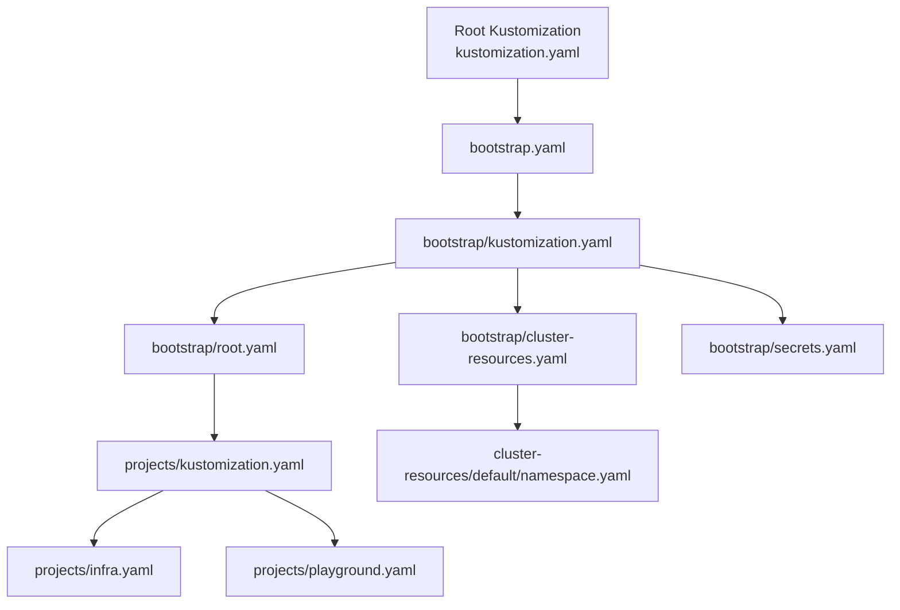
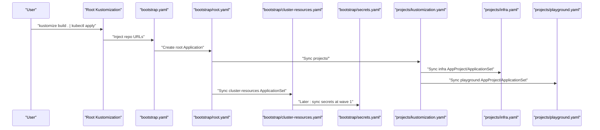
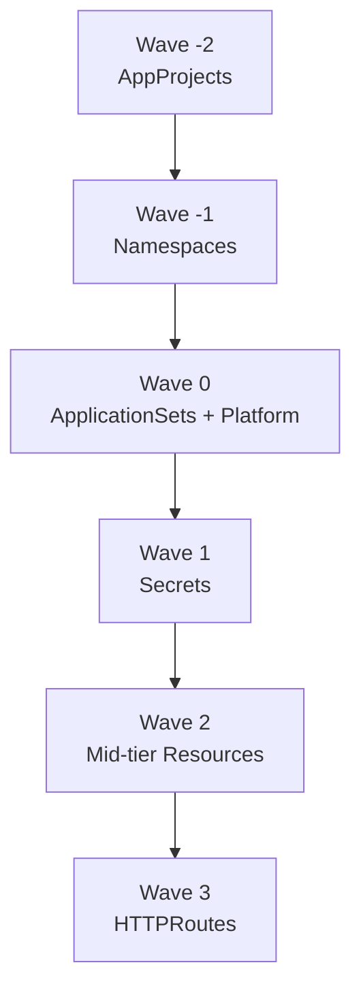
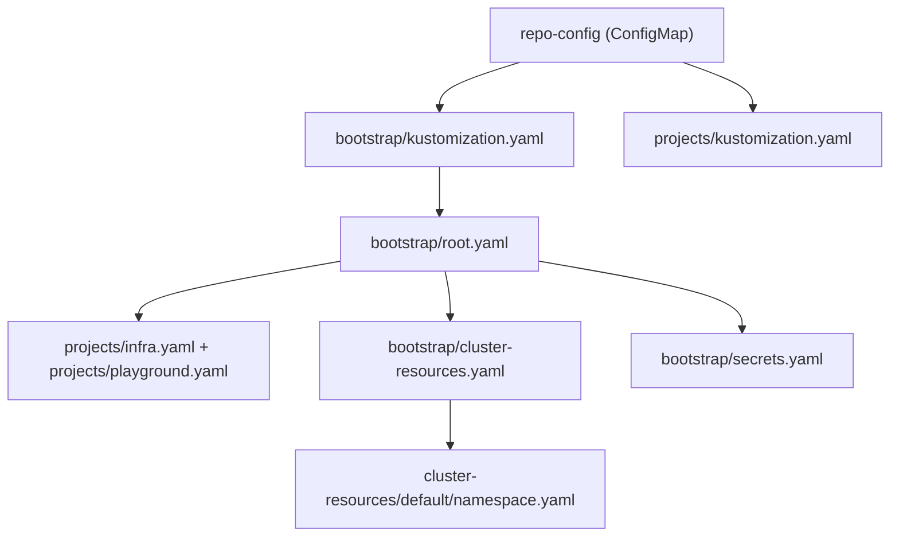

# Cluster Resources Management

<cite>
**Referenced Files in This Document**
- [bootstrap/cluster-resources.yaml](file://bootstrap/cluster-resources.yaml)
- [bootstrap/kustomization.yaml](file://bootstrap/kustomization.yaml)
- [bootstrap/root.yaml](file://bootstrap/root.yaml)
- [bootstrap/secrets.yaml](file://bootstrap/secrets.yaml)
- [cluster-resources/default/namespace.yaml](file://cluster-resources/default/namespace.yaml)
- [projects/kustomization.yaml](file://projects/kustomization.yaml)
- [projects/infra.yaml](file://projects/infra.yaml)
- [projects/playground.yaml](file://projects/playground.yaml)
- [bootstrap.yaml](file://bootstrap.yaml)
- [README.md](file://README.md)
- [components/repo-url/kustomization.yaml](file://components/repo-url/kustomization.yaml)
- [apps/infra/cloudflared/config.yaml](file://apps/infra/cloudflared/config.yaml)
- [apps/playground/rancher/config.yaml](file://apps/playground/rancher/config.yaml)
</cite>

## Table of Contents
1. [Introduction](#introduction)
2. [Project Structure](#project-structure)
3. [Core Components](#core-components)
4. [Architecture Overview](#architecture-overview)
5. [Detailed Component Analysis](#detailed-component-analysis)
6. [Dependency Analysis](#dependency-analysis)
7. [Performance Considerations](#performance-considerations)
8. [Troubleshooting Guide](#troubleshooting-guide)
9. [Conclusion](#conclusion)

## Introduction
This document explains the cluster resources management system that establishes essential shared resources during ArgoCD bootstrap. It focuses on how bootstrap/cluster-resources.yaml creates foundational cluster objects before application-specific resources are deployed, the namespace creation process, default namespace configuration, and the relationship between bootstrap resources and application namespaces. It also covers the timing of resource creation in relation to sync waves and dependency ordering, and highlights examples of cluster-wide resources provisioned during bootstrap such as namespaces and shared configurations.

## Project Structure
The repository organizes GitOps resources across several layers:
- Root Kustomization builds bootstrap.yaml and injects repository URLs.
- bootstrap/ contains the bootstrap chain: root Application, cluster-resources ApplicationSet, and secrets Application.
- projects/ defines AppProjects and ApplicationSets that discover applications under apps/.
- cluster-resources/default/ contains shared cluster namespaces created early in the bootstrap process.
- apps/ contains infrastructure and playground applications with per-app configuration.

**Diagram sources**
- [bootstrap.yaml:1-26](file://bootstrap.yaml#L1-L26)
- [bootstrap/kustomization.yaml:1-38](file://bootstrap/kustomization.yaml#L1-L38)
- [bootstrap/root.yaml:1-37](file://bootstrap/root.yaml#L1-L37)
- [bootstrap/cluster-resources.yaml:1-33](file://bootstrap/cluster-resources.yaml#L1-L33)
- [bootstrap/secrets.yaml:1-24](file://bootstrap/secrets.yaml#L1-L24)
- [projects/kustomization.yaml:1-22](file://projects/kustomization.yaml#L1-L22)
- [projects/infra.yaml:1-85](file://projects/infra.yaml#L1-L85)
- [projects/playground.yaml:1-90](file://projects/playground.yaml#L1-L90)
- [cluster-resources/default/namespace.yaml:1-52](file://cluster-resources/default/namespace.yaml#L1-L52)

**Section sources**
- [README.md:87-118](file://README.md#L87-L118)
- [bootstrap.yaml:1-26](file://bootstrap.yaml#L1-L26)
- [bootstrap/kustomization.yaml:1-38](file://bootstrap/kustomization.yaml#L1-L38)

## Core Components
- bootstrap/cluster-resources.yaml: Defines an ApplicationSet that provisions cluster-scoped resources and shared namespaces early in the bootstrap process using sync-wave -1.
- cluster-resources/default/namespace.yaml: Contains a list of shared namespaces with sync-wave -1 to ensure availability before application deployments.
- bootstrap/root.yaml: The root Application that points to projects/ and orchestrates AppProjects and ApplicationSets.
- projects/infra.yaml and projects/playground.yaml: Define AppProjects and ApplicationSets that discover and deploy applications under apps/.
- bootstrap/secrets.yaml: Synchronizes private secrets from a separate repository at sync-wave 1.
- components/repo-url/kustomization.yaml: Provides centralized repository URL configuration injected into bootstrap and projects Kustomizations.

**Section sources**
- [bootstrap/cluster-resources.yaml:1-33](file://bootstrap/cluster-resources.yaml#L1-L33)
- [cluster-resources/default/namespace.yaml:1-52](file://cluster-resources/default/namespace.yaml#L1-L52)
- [bootstrap/root.yaml:1-37](file://bootstrap/root.yaml#L1-L37)
- [projects/infra.yaml:1-85](file://projects/infra.yaml#L1-L85)
- [projects/playground.yaml:1-90](file://projects/playground.yaml#L1-L90)
- [bootstrap/secrets.yaml:1-24](file://bootstrap/secrets.yaml#L1-L24)
- [components/repo-url/kustomization.yaml:1-11](file://components/repo-url/kustomization.yaml#L1-L11)

## Architecture Overview
The bootstrap architecture ensures that cluster-wide prerequisites are established before application-specific resources are created. The sequence leverages ArgoCD’s sync waves to enforce ordering.

**Diagram sources**
- [bootstrap.yaml:1-26](file://bootstrap.yaml#L1-L26)
- [bootstrap/root.yaml:1-37](file://bootstrap/root.yaml#L1-L37)
- [bootstrap/cluster-resources.yaml:1-33](file://bootstrap/cluster-resources.yaml#L1-L33)
- [bootstrap/secrets.yaml:1-24](file://bootstrap/secrets.yaml#L1-L24)
- [projects/kustomization.yaml:1-22](file://projects/kustomization.yaml#L1-L22)
- [projects/infra.yaml:1-85](file://projects/infra.yaml#L1-L85)
- [projects/playground.yaml:1-90](file://projects/playground.yaml#L1-L90)

## Detailed Component Analysis

### Bootstrap Chain and Sync Waves
- AppProject creation occurs at wave -2 via annotations in projects/infra.yaml and projects/playground.yaml.
- Namespace creation occurs at wave -1 via cluster-resources/default/namespace.yaml and bootstrap/cluster-resources.yaml.
- ApplicationSets and platform components (e.g., Traefik) occur at wave 0.
- Secrets synchronization occurs at wave 1.
- Mid-tier resources occur at wave 2.
- HTTPRoutes are applied last (wave 3) to ensure underlying Gateway resources exist.

**Section sources**
- [README.md:76-86](file://README.md#L76-L86)
- [projects/infra.yaml:6-7](file://projects/infra.yaml#L6-L7)
- [projects/playground.yaml:6-7](file://projects/playground.yaml#L6-L7)
- [cluster-resources/default/namespace.yaml:8](file://cluster-resources/default/namespace.yaml#L8)
- [bootstrap/cluster-resources.yaml:5](file://bootstrap/cluster-resources.yaml#L5)
- [bootstrap/secrets.yaml:7](file://bootstrap/secrets.yaml#L7)
- [apps/infra/cloudflared/config.yaml:3](file://apps/infra/cloudflared/config.yaml#L3)
- [apps/playground/rancher/config.yaml:3](file://apps/playground/rancher/config.yaml#L3)

### bootstrap/cluster-resources.yaml
Purpose:
- Creates an ApplicationSet named cluster-resources that generates ArgoCD Applications for cluster-scoped resources located under cluster-resources/<name>.
- Uses sync-wave -1 to ensure these resources are applied before application-specific resources.
- References cluster-resources/default/namespace.yaml to provision shared namespaces.

Key behaviors:
- Generates a single element named default.
- Sets preserveResourcesOnDeletion to keep generated resources when the ApplicationSet is removed.
- Uses a placeholder repoURL that is replaced by the repo-url component.

**Section sources**
- [bootstrap/cluster-resources.yaml:1-33](file://bootstrap/cluster-resources.yaml#L1-L33)
- [bootstrap/kustomization.yaml:24-27](file://bootstrap/kustomization.yaml#L24-L27)
- [components/repo-url/kustomization.yaml:4-10](file://components/repo-url/kustomization.yaml#L4-L10)

### cluster-resources/default/namespace.yaml
Purpose:
- Defines a set of shared namespaces with sync-wave -1 to guarantee their existence prior to application deployments.
- Ensures namespaces such as gateway-api, cloudflared, cert-manager, cattle-system, datadog, and others are ready before apps reference them.

Isolation pattern:
- Namespaces act as resource isolation boundaries for applications. Applications specify destNamespace in their config.yaml to route resources to the appropriate namespace.

**Section sources**
- [cluster-resources/default/namespace.yaml:1-52](file://cluster-resources/default/namespace.yaml#L1-L52)
- [apps/infra/cloudflared/config.yaml:1](file://apps/infra/cloudflared/config.yaml#L1)
- [apps/playground/rancher/config.yaml:1](file://apps/playground/rancher/config.yaml#L1)

### bootstrap/root.yaml
Purpose:
- The root Application that points to projects/ and orchestrates the rest of the bootstrap chain.
- Enables CreateNamespace=true to ensure the argocd namespace exists.
- Ignores differences for ApplicationSet and ConfigMap metadata to stabilize sync behavior.

**Section sources**
- [bootstrap/root.yaml:1-37](file://bootstrap/root.yaml#L1-L37)

### bootstrap/secrets.yaml
Purpose:
- Synchronizes private secrets from a separate repository at sync-wave 1.
- Uses CreateNamespace=true to ensure the argocd namespace exists.
- Applies a foreground finalizer to coordinate cleanup order.

**Section sources**
- [bootstrap/secrets.yaml:1-24](file://bootstrap/secrets.yaml#L1-L24)

### projects/ AppProjects and ApplicationSets
Purpose:
- AppProjects define cluster and namespace resource whitelists and destination constraints.
- ApplicationSets discover applications under apps/infra and apps/playground via config.yaml files.
- Both infra.yaml and playground.yaml set sync-wave 0 and enable CreateNamespace=true for discovered apps.

Discovery mechanism:
- ApplicationSets scan for config.yaml files under apps/*/ and render Kustomize manifests with Helm support enabled.

**Section sources**
- [projects/infra.yaml:1-85](file://projects/infra.yaml#L1-L85)
- [projects/playground.yaml:1-90](file://projects/playground.yaml#L1-L90)

### Repository URL Injection
Purpose:
- components/repo-url/kustomization.yaml generates a repo-config ConfigMap with url and secrets_url.
- bootstrap/kustomization.yaml and projects/kustomization.yaml replace PLACEHOLDER values in Applications and ApplicationSets using replacements.

**Section sources**
- [components/repo-url/kustomization.yaml:1-11](file://components/repo-url/kustomization.yaml#L1-L11)
- [bootstrap/kustomization.yaml:12-27](file://bootstrap/kustomization.yaml#L12-L27)
- [projects/kustomization.yaml:11-22](file://projects/kustomization.yaml#L11-L22)

## Dependency Analysis
The bootstrap system enforces strict dependency ordering through sync waves and centralized repository URL injection.

**Diagram sources**
- [components/repo-url/kustomization.yaml:4-10](file://components/repo-url/kustomization.yaml#L4-L10)
- [bootstrap/kustomization.yaml:12-27](file://bootstrap/kustomization.yaml#L12-L27)
- [projects/kustomization.yaml:11-22](file://projects/kustomization.yaml#L11-L22)
- [bootstrap/root.yaml:1-37](file://bootstrap/root.yaml#L1-L37)
- [projects/infra.yaml:1-85](file://projects/infra.yaml#L1-L85)
- [projects/playground.yaml:1-90](file://projects/playground.yaml#L1-L90)
- [bootstrap/cluster-resources.yaml:1-33](file://bootstrap/cluster-resources.yaml#L1-L33)
- [cluster-resources/default/namespace.yaml:1-52](file://cluster-resources/default/namespace.yaml#L1-L52)
- [bootstrap/secrets.yaml:1-24](file://bootstrap/secrets.yaml#L1-L24)

**Section sources**
- [bootstrap/kustomization.yaml:12-27](file://bootstrap/kustomization.yaml#L12-L27)
- [projects/kustomization.yaml:11-22](file://projects/kustomization.yaml#L11-L22)

## Performance Considerations
- Sync waves prevent race conditions and reduce failed retries by ensuring prerequisite resources exist before dependent ones.
- Using CreateNamespace=true avoids manual namespace provisioning steps and reduces operational overhead.
- Replacing repo URLs centrally minimizes duplication and improves maintainability.
- ApplicationSets with allowEmpty and selfHeal improve resilience against transient failures.

## Troubleshooting Guide
Common issues and resolutions:
- Missing namespaces: Verify cluster-resources/default/namespace.yaml was applied at wave -1 and that ApplicationSet generation succeeded.
- Secret sync failures: Confirm bootstrap/secrets.yaml is at wave 1 and repo URL replacement occurred.
- ApplicationSet not discovering apps: Check projects/infra.yaml and projects/playground.yaml for correct git generator paths and ensure config.yaml entries exist.
- Namespace mismatch: Ensure apps/*/config.yaml sets destNamespace correctly and aligns with cluster-resources namespaces.
- Repo URL placeholders: Validate components/repo-url/kustomization.yaml and replacement blocks in bootstrap/kustomization.yaml and projects/kustomization.yaml.

**Section sources**
- [cluster-resources/default/namespace.yaml:1-52](file://cluster-resources/default/namespace.yaml#L1-L52)
- [bootstrap/secrets.yaml:1-24](file://bootstrap/secrets.yaml#L1-L24)
- [projects/infra.yaml:33-45](file://projects/infra.yaml#L33-L45)
- [projects/playground.yaml:33-45](file://projects/playground.yaml#L33-L45)
- [apps/infra/cloudflared/config.yaml:1](file://apps/infra/cloudflared/config.yaml#L1)
- [apps/playground/rancher/config.yaml:1](file://apps/playground/rancher/config.yaml#L1)
- [components/repo-url/kustomization.yaml:4-10](file://components/repo-url/kustomization.yaml#L4-L10)
- [bootstrap/kustomization.yaml:12-27](file://bootstrap/kustomization.yaml#L12-L27)
- [projects/kustomization.yaml:11-22](file://projects/kustomization.yaml#L11-L22)

## Conclusion
The cluster resources management system establishes a reliable foundation for GitOps-driven Kubernetes operations. By leveraging ApplicationSets, sync waves, and centralized repository URL configuration, it ensures that shared namespaces and cluster-wide resources are provisioned before application-specific workloads. This approach provides predictable ordering, strong isolation via namespaces, and maintainable configuration across infrastructure and experimental environments.