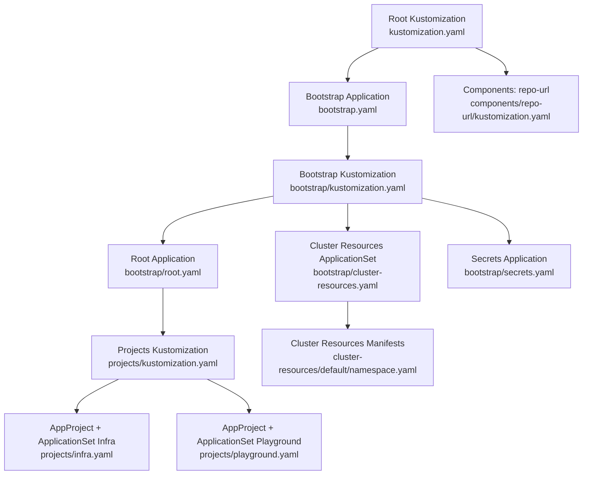
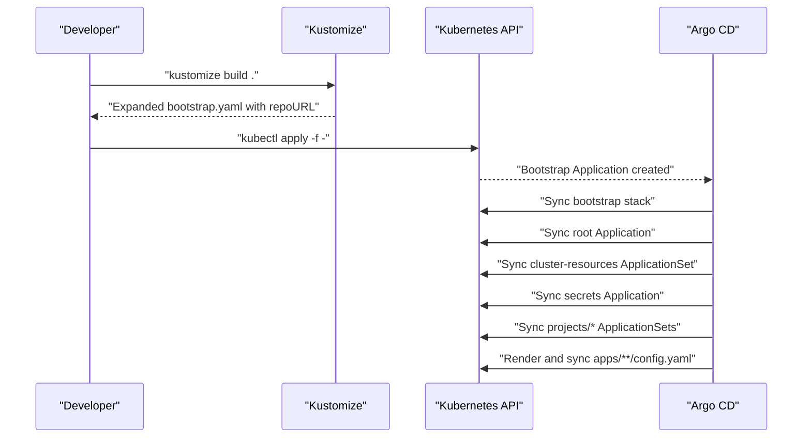
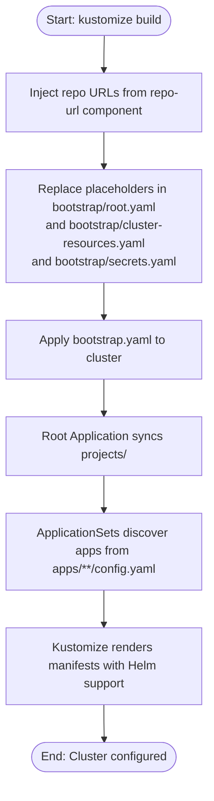
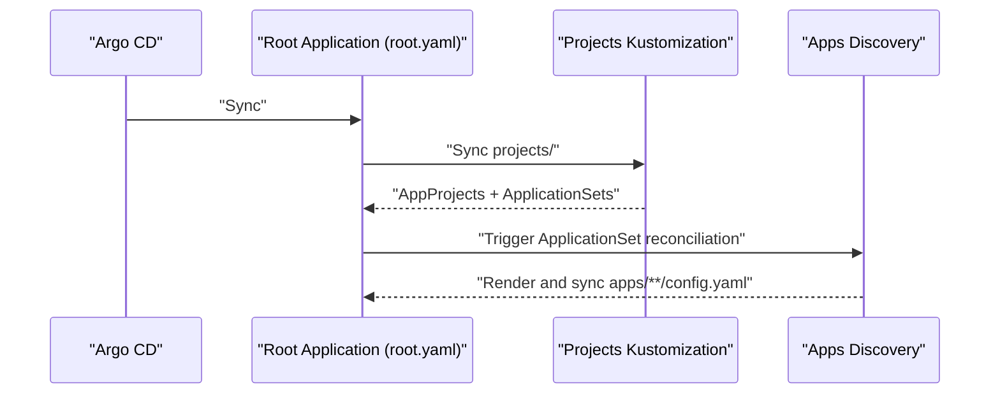
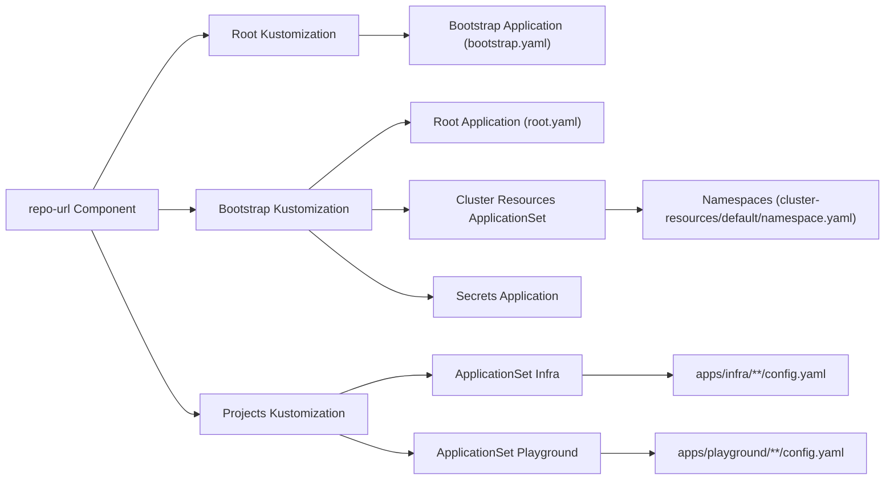

# Initial Setup Process

<cite>
**Referenced Files in This Document**
- [bootstrap.yaml](file://bootstrap.yaml)
- [kustomization.yaml](file://kustomization.yaml)
- [components/repo-url/kustomization.yaml](file://components/repo-url/kustomization.yaml)
- [bootstrap/kustomization.yaml](file://bootstrap/kustomization.yaml)
- [bootstrap/root.yaml](file://bootstrap/root.yaml)
- [bootstrap/cluster-resources.yaml](file://bootstrap/cluster-resources.yaml)
- [bootstrap/secrets.yaml](file://bootstrap/secrets.yaml)
- [projects/kustomization.yaml](file://projects/kustomization.yaml)
- [projects/infra.yaml](file://projects/infra.yaml)
- [projects/playground.yaml](file://projects/playground.yaml)
- [cluster-resources/default/namespace.yaml](file://cluster-resources/default/namespace.yaml)
- [README.md](file://README.md)
- [guide/argocd/argo_cd.md](file://guide/argocd/argo_cd.md)
- [guide/argocd/argocd-repository-secrets.yaml](file://guide/argocd/argocd-repository-secrets.yaml)
</cite>

## Table of Contents
1. [Introduction](#introduction)
2. [Project Structure](#project-structure)
3. [Core Components](#core-components)
4. [Architecture Overview](#architecture-overview)
5. [Detailed Component Analysis](#detailed-component-analysis)
6. [Dependency Analysis](#dependency-analysis)
7. [Performance Considerations](#performance-considerations)
8. [Troubleshooting Guide](#troubleshooting-guide)
9. [Conclusion](#conclusion)
10. [Appendices](#appendices)

## Introduction
This document explains the initial bootstrap setup process that establishes the GitOps foundation for the cluster using Argo CD, Kustomize, and Helm. It details the step-by-step bootstrap chain from kustomize build through bootstrap.yaml to final cluster configuration, how the root Application orchestrates the setup, the automated sync policy with prune and self-heal, the repository URL placeholder mechanism, and the destination configuration pointing to the local Kubernetes API server. Practical examples, common setup issues, and verification steps are included to ensure successful initialization.

## Project Structure
The bootstrap process is orchestrated by a layered Kustomize configuration:
- Root Kustomization builds bootstrap.yaml and injects repository URLs from a shared component.
- The bootstrap directory contains Argo CD Applications and ApplicationSet manifests that orchestrate cluster setup.
- Projects define AppProjects and ApplicationSets that discover and render application manifests from apps folders.
- Cluster resources define shared namespaces and cluster-wide objects with explicit sync ordering.

**Diagram sources**
- [kustomization.yaml:1-21](file://kustomization.yaml#L1-L21)
- [components/repo-url/kustomization.yaml:1-11](file://components/repo-url/kustomization.yaml#L1-L11)
- [bootstrap.yaml:1-26](file://bootstrap.yaml#L1-L26)
- [bootstrap/kustomization.yaml:1-38](file://bootstrap/kustomization.yaml#L1-L38)
- [bootstrap/root.yaml:1-37](file://bootstrap/root.yaml#L1-L37)
- [bootstrap/cluster-resources.yaml:1-33](file://bootstrap/cluster-resources.yaml#L1-L33)
- [bootstrap/secrets.yaml:1-24](file://bootstrap/secrets.yaml#L1-L24)
- [projects/kustomization.yaml:1-22](file://projects/kustomization.yaml#L1-L22)
- [projects/infra.yaml:1-85](file://projects/infra.yaml#L1-L85)
- [projects/playground.yaml:1-90](file://projects/playground.yaml#L1-L90)
- [cluster-resources/default/namespace.yaml:1-52](file://cluster-resources/default/namespace.yaml#L1-L52)

**Section sources**
- [README.md:57-118](file://README.md#L57-L118)
- [kustomization.yaml:1-21](file://kustomization.yaml#L1-L21)
- [components/repo-url/kustomization.yaml:1-11](file://components/repo-url/kustomization.yaml#L1-L11)

## Core Components
- Root Application (bootstrap.yaml): A one-time manual application that installs the bootstrap stack into the argocd namespace. It points to the bootstrap directory and uses a placeholder for repoURL, which is later resolved by Kustomize.
- Bootstrap Kustomization (bootstrap/kustomization.yaml): Applies the repo-url component and replaces placeholders in root.yaml, cluster-resources.yaml, and secrets.yaml.
- Root Application (bootstrap/root.yaml): The orchestrator that syncs the projects directory, enabling AppProjects and ApplicationSets to discover applications.
- Cluster Resources ApplicationSet (bootstrap/cluster-resources.yaml): Creates shared namespaces and cluster objects with a negative sync wave to ensure prerequisites exist before apps deploy.
- Secrets Application (bootstrap/secrets.yaml): Syncs private secrets from a dedicated repository using repository credentials applied earlier.
- Projects Kustomization (projects/kustomization.yaml): Replaces placeholders in ApplicationSets so they can discover apps from the public repository.
- AppProjects and ApplicationSets (projects/infra.yaml, projects/playground.yaml): Define discovery rules and rendering options for apps under apps/infra and apps/playground.

**Section sources**
- [bootstrap.yaml:1-26](file://bootstrap.yaml#L1-L26)
- [bootstrap/kustomization.yaml:1-38](file://bootstrap/kustomization.yaml#L1-L38)
- [bootstrap/root.yaml:1-37](file://bootstrap/root.yaml#L1-L37)
- [bootstrap/cluster-resources.yaml:1-33](file://bootstrap/cluster-resources.yaml#L1-L33)
- [bootstrap/secrets.yaml:1-24](file://bootstrap/secrets.yaml#L1-L24)
- [projects/kustomization.yaml:1-22](file://projects/kustomization.yaml#L1-L22)
- [projects/infra.yaml:1-85](file://projects/infra.yaml#L1-L85)
- [projects/playground.yaml:1-90](file://projects/playground.yaml#L1-L90)

## Architecture Overview
The bootstrap architecture follows a deterministic order:
1. Build and apply bootstrap.yaml with repository URLs injected by Kustomize.
2. The bootstrap stack (root Application, ApplicationSet, and Secrets Application) is installed.
3. The root Application syncs projects/, which define AppProjects and ApplicationSets.
4. ApplicationSets discover and render application manifests from apps/**/config.yaml using Kustomize with Helm support.
5. Cluster resources (namespaces and shared objects) are created with explicit sync waves to ensure prerequisites.

**Diagram sources**
- [README.md:57-75](file://README.md#L57-L75)
- [kustomization.yaml:1-21](file://kustomization.yaml#L1-L21)
- [bootstrap.yaml:1-26](file://bootstrap.yaml#L1-L26)
- [bootstrap/root.yaml:1-37](file://bootstrap/root.yaml#L1-L37)
- [bootstrap/cluster-resources.yaml:1-33](file://bootstrap/cluster-resources.yaml#L1-L33)
- [bootstrap/secrets.yaml:1-24](file://bootstrap/secrets.yaml#L1-L24)
- [projects/kustomization.yaml:1-22](file://projects/kustomization.yaml#L1-L22)
- [projects/infra.yaml:1-85](file://projects/infra.yaml#L1-L85)
- [projects/playground.yaml:1-90](file://projects/playground.yaml#L1-L90)

## Detailed Component Analysis

### Bootstrap Chain and Placeholder Resolution
- Root Kustomization (kustomization.yaml) includes the repo-url component and injects repoURL into the bootstrap Application.
- Bootstrap Kustomization (bootstrap/kustomization.yaml) applies the same component and replaces placeholders in root.yaml, cluster-resources.yaml, and secrets.yaml.
- Projects Kustomization (projects/kustomization.yaml) replaces placeholders in ApplicationSets so they can discover apps from the public repository.

**Diagram sources**
- [kustomization.yaml:1-21](file://kustomization.yaml#L1-L21)
- [components/repo-url/kustomization.yaml:1-11](file://components/repo-url/kustomization.yaml#L1-L11)
- [bootstrap/kustomization.yaml:1-38](file://bootstrap/kustomization.yaml#L1-L38)
- [bootstrap/root.yaml:1-37](file://bootstrap/root.yaml#L1-L37)
- [bootstrap/cluster-resources.yaml:1-33](file://bootstrap/cluster-resources.yaml#L1-L33)
- [bootstrap/secrets.yaml:1-24](file://bootstrap/secrets.yaml#L1-L24)
- [projects/kustomization.yaml:1-22](file://projects/kustomization.yaml#L1-L22)
- [projects/infra.yaml:1-85](file://projects/infra.yaml#L1-L85)
- [projects/playground.yaml:1-90](file://projects/playground.yaml#L1-L90)

**Section sources**
- [README.md:57-75](file://README.md#L57-L75)
- [kustomization.yaml:1-21](file://kustomization.yaml#L1-L21)
- [bootstrap/kustomization.yaml:1-38](file://bootstrap/kustomization.yaml#L1-L38)
- [projects/kustomization.yaml:1-22](file://projects/kustomization.yaml#L1-L22)

### Root Application Orchestration
- The root Application (bootstrap/root.yaml) points to the projects directory and automates synchronization with prune and self-heal enabled.
- It ignores differences for ApplicationSet templates and the repo-config ConfigMap to prevent drift from Kustomize replacements.
- It ensures namespaces are created before application deployments using sync options.

**Diagram sources**
- [bootstrap/root.yaml:1-37](file://bootstrap/root.yaml#L1-L37)
- [projects/kustomization.yaml:1-22](file://projects/kustomization.yaml#L1-L22)
- [projects/infra.yaml:1-85](file://projects/infra.yaml#L1-L85)
- [projects/playground.yaml:1-90](file://projects/playground.yaml#L1-L90)

**Section sources**
- [bootstrap/root.yaml:1-37](file://bootstrap/root.yaml#L1-L37)
- [projects/kustomization.yaml:1-22](file://projects/kustomization.yaml#L1-L22)

### Automated Sync Policy and Self-Heal
- The bootstrap Application (bootstrap.yaml) enables automated sync with prune and self-heal, ensuring the cluster state matches the repository and cleans up orphaned resources.
- The root Application (bootstrap/root.yaml) mirrors these settings and adds namespace creation options.
- ApplicationSets and Applications inherit similar policies to maintain consistency across the stack.

**Section sources**
- [bootstrap.yaml:19-26](file://bootstrap.yaml#L19-L26)
- [bootstrap/root.yaml:29-37](file://bootstrap/root.yaml#L29-L37)

### Destination Configuration and Project Boundary
- All Applications and ApplicationSets target the local Kubernetes API server and the argocd namespace.
- The project boundary is set to default for all bootstrap components, aligning with the default Argo CD project.

**Section sources**
- [bootstrap.yaml:11-14](file://bootstrap.yaml#L11-L14)
- [bootstrap/root.yaml:11-14](file://bootstrap/root.yaml#L11-L14)
- [bootstrap/cluster-resources.yaml:22-24](file://bootstrap/cluster-resources.yaml#L22-L24)
- [bootstrap/secrets.yaml:16-18](file://bootstrap/secrets.yaml#L16-L18)

### Repository URL Placeholder Mechanism
- The repo-url component generates a ConfigMap named repo-config with two fields: url and secrets_url.
- Kustomize replacements in multiple kustomizations replace PLACEHOLDER with the actual repository URLs in Applications and ApplicationSets.
- The root Kustomization replaces the bootstrap Application’s repoURL.
- The bootstrap Kustomization replaces placeholders in root.yaml, cluster-resources.yaml, and secrets.yaml.
- The projects Kustomization replaces placeholders in ApplicationSets.

**Section sources**
- [components/repo-url/kustomization.yaml:4-10](file://components/repo-url/kustomization.yaml#L4-L10)
- [kustomization.yaml:10-20](file://kustomization.yaml#L10-L20)
- [bootstrap/kustomization.yaml:12-37](file://bootstrap/kustomization.yaml#L12-L37)
- [projects/kustomization.yaml:11-21](file://projects/kustomization.yaml#L11-L21)

### Cluster Resources and Namespace Creation
- The cluster-resources ApplicationSet provisions shared namespaces and cluster objects with a negative sync wave to ensure prerequisites exist before apps deploy.
- The cluster-resources/default/namespace.yaml defines multiple namespaces annotated with sync waves.

**Section sources**
- [bootstrap/cluster-resources.yaml:1-33](file://bootstrap/cluster-resources.yaml#L1-L33)
- [cluster-resources/default/namespace.yaml:1-52](file://cluster-resources/default/namespace.yaml#L1-L52)

### Secrets Management
- The secrets Application syncs private secrets from a dedicated repository.
- Repository credentials are applied as Kubernetes Secrets with labels recognized by Argo CD.

**Section sources**
- [bootstrap/secrets.yaml:1-24](file://bootstrap/secrets.yaml#L1-L24)
- [guide/argocd/argocd-repository-secrets.yaml:1-30](file://guide/argocd/argocd-repository-secrets.yaml#L1-L30)

## Dependency Analysis
The bootstrap stack exhibits a strict dependency order:
- Root Kustomization depends on the repo-url component to resolve placeholders.
- Bootstrap Kustomization depends on the repo-url component and resources from bootstrap/.
- Projects Kustomization depends on the repo-url component and resources from projects/.
- ApplicationSets depend on AppProjects and cluster resources to exist before syncing applications.

**Diagram sources**
- [components/repo-url/kustomization.yaml:1-11](file://components/repo-url/kustomization.yaml#L1-L11)
- [kustomization.yaml:1-21](file://kustomization.yaml#L1-L21)
- [bootstrap/kustomization.yaml:1-38](file://bootstrap/kustomization.yaml#L1-L38)
- [projects/kustomization.yaml:1-22](file://projects/kustomization.yaml#L1-L22)
- [bootstrap/cluster-resources.yaml:1-33](file://bootstrap/cluster-resources.yaml#L1-L33)
- [cluster-resources/default/namespace.yaml:1-52](file://cluster-resources/default/namespace.yaml#L1-L52)
- [projects/infra.yaml:1-85](file://projects/infra.yaml#L1-L85)
- [projects/playground.yaml:1-90](file://projects/playground.yaml#L1-L90)

**Section sources**
- [README.md:57-86](file://README.md#L57-L86)
- [bootstrap/kustomization.yaml:1-38](file://bootstrap/kustomization.yaml#L1-L38)
- [projects/kustomization.yaml:1-22](file://projects/kustomization.yaml#L1-L22)

## Performance Considerations
- Kustomize buildOptions enable Helm support in the Argo CD repo server, allowing efficient chart rendering.
- Sync waves ensure ordered reconciliation, reducing conflicts and transient failures.
- Automated sync with prune and self-heal minimizes manual intervention but requires careful change management.

[No sources needed since this section provides general guidance]

## Troubleshooting Guide
Common setup issues and resolutions:
- Missing repository credentials for private secrets: Apply repository secrets before applying bootstrap to allow Argo CD to access the private repository.
- Placeholder not resolved: Verify the repo-url component is included and replacements are configured in kustomizations.
- Root Application stuck: Check Argo CD logs and ensure the projects directory is reachable and valid.
- Namespace creation delays: Confirm cluster-resources ApplicationSet is healthy and namespaces are annotated with appropriate sync waves.
- ApplicationSet discovery failures: Validate config.yaml presence and correctness under apps/**/.

Verification steps:
- Confirm bootstrap Application exists and is healthy.
- Verify root Application has synced projects and created AppProjects.
- Check ApplicationSets are generating Applications and syncing successfully.
- Ensure namespaces are present and cluster resources are reconciled.
- Validate that apps/**/config.yaml are being rendered and synced.

**Section sources**
- [guide/argocd/argo_cd.md:1-34](file://guide/argocd/argo_cd.md#L1-L34)
- [bootstrap.yaml:1-26](file://bootstrap.yaml#L1-L26)
- [bootstrap/root.yaml:1-37](file://bootstrap/root.yaml#L1-L37)
- [bootstrap/cluster-resources.yaml:1-33](file://bootstrap/cluster-resources.yaml#L1-L33)
- [bootstrap/secrets.yaml:1-24](file://bootstrap/secrets.yaml#L1-L24)
- [projects/infra.yaml:1-85](file://projects/infra.yaml#L1-L85)
- [projects/playground.yaml:1-90](file://projects/playground.yaml#L1-L90)

## Conclusion
The bootstrap process establishes a robust GitOps foundation by combining Kustomize’s centralized placeholder resolution with Argo CD’s declarative synchronization. The root Application orchestrates the setup, automated policies ensure consistency, and sync waves guarantee proper ordering. By following the documented sequence and verification steps, teams can reliably initialize and maintain their cluster configuration.

[No sources needed since this section summarizes without analyzing specific files]

## Appendices
- Practical bootstrap sequence:
  - Install Argo CD and expose the UI.
  - Apply repository secrets for private access.
  - Run kustomize build and apply bootstrap.yaml.
  - Monitor bootstrap stack and root Application.
  - Verify ApplicationSets and app deployments.

- Sync order reference:
  - AppProjects (-2), Namespaces (-1), ApplicationSets/Deployments (0), Secrets (1), Mid-tier resources (2), HTTPRoutes (3).

**Section sources**
- [guide/argocd/argo_cd.md:1-34](file://guide/argocd/argo_cd.md#L1-L34)
- [README.md:76-86](file://README.md#L76-L86)