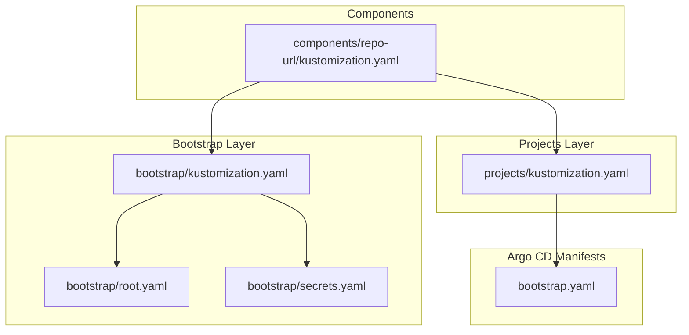
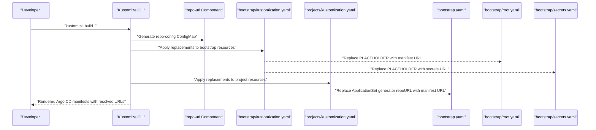
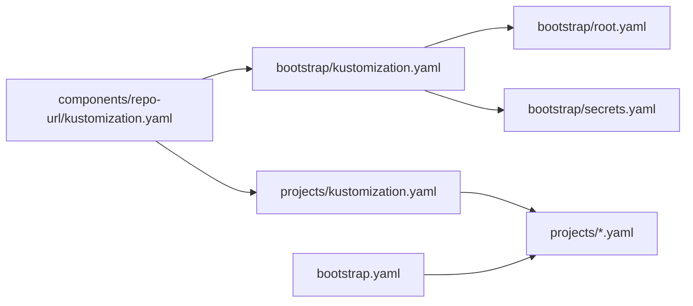

# Repository Configuration

<cite>
**Referenced Files in This Document**
- [bootstrap.yaml](file://bootstrap.yaml)
- [bootstrap/kustomization.yaml](file://bootstrap/kustomization.yaml)
- [bootstrap/root.yaml](file://bootstrap/root.yaml)
- [bootstrap/secrets.yaml](file://bootstrap/secrets.yaml)
- [components/repo-url/kustomization.yaml](file://components/repo-url/kustomization.yaml)
- [projects/kustomization.yaml](file://projects/kustomization.yaml)
- [guide/argocd/argo_cd.md](file://guide/argocd/argo_cd.md)
- [guide/k8s_manifest_secrets/argo_cd.md](file://guide/k8s_manifest_secrets/argo_cd.md)
</cite>

## Table of Contents
1. [Introduction](#introduction)
2. [Project Structure](#project-structure)
3. [Core Components](#core-components)
4. [Architecture Overview](#architecture-overview)
5. [Detailed Component Analysis](#detailed-component-analysis)
6. [Dependency Analysis](#dependency-analysis)
7. [Performance Considerations](#performance-considerations)
8. [Troubleshooting Guide](#troubleshooting-guide)
9. [Conclusion](#conclusion)

## Introduction
This document explains the repository configuration system used to manage URL substitution during the Argo CD bootstrap process. It focuses on how the PLACEHOLDER mechanism in bootstrap manifests is replaced by actual repository URLs during kustomization, how centralized repository URLs are defined via a shared component, and how different components serve distinct roles in managing bootstrap versus project-level repository configurations. It also covers environment-specific URL configuration, private repository access patterns, and security considerations for repository credentials and tokens.

## Project Structure
The repository organizes bootstrap and project-level manifests with a central kustomization component that defines repository URLs and a set of replacement rules to propagate those URLs into Argo CD Application and ApplicationSet resources.

**Diagram sources**
- [bootstrap/kustomization.yaml:1-38](file://bootstrap/kustomization.yaml#L1-L38)
- [components/repo-url/kustomization.yaml:1-11](file://components/repo-url/kustomization.yaml#L1-L11)
- [projects/kustomization.yaml:1-22](file://projects/kustomization.yaml#L1-L22)
- [bootstrap/root.yaml:1-37](file://bootstrap/root.yaml#L1-L37)
- [bootstrap/secrets.yaml:1-24](file://bootstrap/secrets.yaml#L1-L24)
- [bootstrap.yaml:1-26](file://bootstrap.yaml#L1-L26)

**Section sources**
- [bootstrap/kustomization.yaml:1-38](file://bootstrap/kustomization.yaml#L1-L38)
- [components/repo-url/kustomization.yaml:1-11](file://components/repo-url/kustomization.yaml#L1-L11)
- [projects/kustomization.yaml:1-22](file://projects/kustomization.yaml#L1-L22)
- [bootstrap/root.yaml:1-37](file://bootstrap/root.yaml#L1-L37)
- [bootstrap/secrets.yaml:1-24](file://bootstrap/secrets.yaml#L1-L24)
- [bootstrap.yaml:1-26](file://bootstrap.yaml#L1-L26)

## Core Components
- Centralized repository URL definition:
  - A ConfigMap named repo-config is generated by the repo-url component, containing keys for manifest and secrets repository URLs.
- Bootstrap-time URL substitution:
  - Replacement rules in bootstrap kustomization replace PLACEHOLDER values in bootstrap/root.yaml and bootstrap/secrets.yaml with the URLs from repo-config.
- Project-time URL substitution:
  - Replacement rules in projects kustomization replace PLACEHOLDER values in ApplicationSet generators with the manifest repository URL from repo-config.

Key behaviors:
- The repo-config ConfigMap is generated with a fixed name and literal entries for repository URLs.
- Replacements target specific Argo CD resource fields (Application.spec.source.repoURL, ApplicationSet.spec.template.spec.source.repoURL, and ApplicationSet generators) to ensure manifests point to the correct repositories.

**Section sources**
- [components/repo-url/kustomization.yaml:1-11](file://components/repo-url/kustomization.yaml#L1-L11)
- [bootstrap/kustomization.yaml:12-38](file://bootstrap/kustomization.yaml#L12-L38)
- [projects/kustomization.yaml:11-22](file://projects/kustomization.yaml#L11-L22)

## Architecture Overview
The system uses a layered approach:
- The repo-url component defines repository URLs centrally.
- Bootstrap kustomization injects these URLs into bootstrap-level Application and ApplicationSet resources.
- Projects kustomization injects the manifest repository URL into project-level ApplicationSet generators.

**Diagram sources**
- [components/repo-url/kustomization.yaml:1-11](file://components/repo-url/kustomization.yaml#L1-L11)
- [bootstrap/kustomization.yaml:12-38](file://bootstrap/kustomization.yaml#L12-L38)
- [projects/kustomization.yaml:11-22](file://projects/kustomization.yaml#L11-L22)
- [bootstrap/root.yaml:17-17](file://bootstrap/root.yaml#L17-L17)
- [bootstrap/secrets.yaml:13-13](file://bootstrap/secrets.yaml#L13-L13)
- [bootstrap.yaml:17-17](file://bootstrap.yaml#L17-L17)

## Detailed Component Analysis

### Centralized Repository URL Management (repo-url component)
- Purpose: Provide a single source of truth for repository URLs used across bootstrap and project layers.
- Mechanism: Generates a ConfigMap with named literal entries for manifest and secrets repository URLs.
- Usage: Consumed by replacement rules in both bootstrap and projects kustomizations.

Operational notes:
- The ConfigMap name is fixed, ensuring deterministic selection by replacement rules.
- The component is included as a Kustomize Component in both bootstrap and projects layers.

**Section sources**
- [components/repo-url/kustomization.yaml:1-11](file://components/repo-url/kustomization.yaml#L1-L11)
- [bootstrap/kustomization.yaml:4-5](file://bootstrap/kustomization.yaml#L4-L5)
- [projects/kustomization.yaml:4-5](file://projects/kustomization.yaml#L4-L5)

### Bootstrap Layer URL Substitution
- Bootstrap Application (bootstrap.yaml):
  - Contains a placeholder for repoURL that is intended to be replaced by the manifest repository URL.
- Root Application (bootstrap/root.yaml):
  - Contains a placeholder for repoURL that is replaced by the manifest repository URL during bootstrap kustomization.
- Secrets Application (bootstrap/secrets.yaml):
  - Contains a placeholder for repoURL that is replaced by the secrets repository URL during bootstrap kustomization.
- Replacement rules:
  - Target Application and ApplicationSet resources.
  - Replace specific field paths under spec.source.repoURL and ApplicationSet generators.

Security and ordering:
- The secrets Application is annotated to ensure early synchronization so that secrets are available before other resources require them.

**Section sources**
- [bootstrap.yaml:17-17](file://bootstrap.yaml#L17-L17)
- [bootstrap/root.yaml:17-17](file://bootstrap/root.yaml#L17-L17)
- [bootstrap/secrets.yaml:13-13](file://bootstrap/secrets.yaml#L13-L13)
- [bootstrap/kustomization.yaml:12-38](file://bootstrap/kustomization.yaml#L12-L38)

### Projects Layer URL Substitution
- Projects Kustomization:
  - Includes the repo-url component.
  - Defines a replacement rule to populate ApplicationSet git generator repoURL and values.repoURL with the manifest repository URL from repo-config.

Use cases:
- Ensures project-level ApplicationSets consistently use the same manifest repository URL without embedding it directly in each ApplicationSet.

**Section sources**
- [projects/kustomization.yaml:1-22](file://projects/kustomization.yaml#L1-L22)

### Difference Between repo-config-bootstrap and repo-config-projects
- repo-config-bootstrap:
  - Manages repository URLs for bootstrap resources (root Application, secrets Application, and related bootstrap manifests).
  - Provides manifest and secrets repository URLs injected into bootstrap kustomization.
- repo-config-projects:
  - Manages repository URLs for project-level resources (ApplicationSets and related project manifests).
  - Provides the manifest repository URL injected into projects kustomization.

Note: The repository includes directories for both components. The current kustomization files demonstrate usage of a shared repo-url component. If separate repo-config-* components exist, they would mirror the pattern shown by the repo-url component but scoped to their respective layers.

[No sources needed since this section explains conceptual differences inferred from directory structure and current usage]

### Environment-Specific URL Configuration
- Single source of truth:
  - Update the repo-config ConfigMap literals in the repo-url component to switch environments (e.g., dev, staging, prod).
- Field-level targeting:
  - Replacement rules target specific field paths, allowing precise control over which resources receive which URLs.
- Example scenarios:
  - Manifest repository URL for production vs. development.
  - Separate secrets repository for sensitive overlays per environment.

[No sources needed since this section provides general guidance]

### Private Repository Access Patterns
- ArgoCD repository secrets:
  - Apply repository secrets to enable Argo CD to access private repositories.
- Order of operations:
  - Synchronize the secrets Application first to ensure credentials are available before other resources attempt to clone private repositories.

**Section sources**
- [guide/argocd/argo_cd.md:18-22](file://guide/argocd/argo_cd.md#L18-L22)
- [bootstrap/secrets.yaml:6-8](file://bootstrap/secrets.yaml#L6-L8)

### Security Considerations for Repository Credentials and Tokens
- Prefer repository secrets:
  - Use ArgoCD repository secrets to avoid embedding credentials in manifests.
- Limit scope:
  - Grant least-privilege access to tokens and restrict repository permissions.
- Avoid exposing URLs:
  - Keep repository URLs and tokens out of public repositories; rely on ArgoCD’s secret management.
- Rotation and auditing:
  - Regularly rotate tokens and monitor access logs.

**Section sources**
- [guide/argocd/argo_cd.md:18-22](file://guide/argocd/argo_cd.md#L18-L22)
- [guide/k8s_manifest_secrets/argo_cd.md:1-46](file://guide/k8s_manifest_secrets/argo_cd.md#L1-L46)

## Dependency Analysis
The following diagram shows how the repo-url component is consumed and how replacement rules propagate URLs across bootstrap and project layers.

**Diagram sources**
- [components/repo-url/kustomization.yaml:1-11](file://components/repo-url/kustomization.yaml#L1-L11)
- [bootstrap/kustomization.yaml:4-5](file://bootstrap/kustomization.yaml#L4-L5)
- [projects/kustomization.yaml:4-5](file://projects/kustomization.yaml#L4-L5)
- [bootstrap/root.yaml:17-17](file://bootstrap/root.yaml#L17-L17)
- [bootstrap/secrets.yaml:13-13](file://bootstrap/secrets.yaml#L13-L13)
- [bootstrap.yaml:17-17](file://bootstrap.yaml#L17-L17)

**Section sources**
- [bootstrap/kustomization.yaml:12-38](file://bootstrap/kustomization.yaml#L12-L38)
- [projects/kustomization.yaml:11-22](file://projects/kustomization.yaml#L11-L22)

## Performance Considerations
- Centralized URL management reduces duplication and minimizes rework when switching environments.
- Replacement rules operate at kustomization time, avoiding runtime overhead in Argo CD.
- Keeping repository URLs in a single ConfigMap simplifies audits and reduces human error.

[No sources needed since this section provides general guidance]

## Troubleshooting Guide
Common issues and resolutions:
- Placeholder not replaced:
  - Verify the repo-config ConfigMap exists and contains the expected keys.
  - Confirm replacement rules select the correct resources and field paths.
- Wrong repository cloned:
  - Check that replacement targets match the intended Application/ApplicationSet names and field paths.
  - Ensure the correct component is included in each kustomization.
- Private repository access failures:
  - Confirm repository secrets are applied and synchronized before other resources requiring those credentials.
  - Validate token permissions and repository visibility.
- Secrets not available in time:
  - Ensure the secrets Application is configured with appropriate sync waves to run earlier than dependent resources.

**Section sources**
- [bootstrap/kustomization.yaml:12-38](file://bootstrap/kustomization.yaml#L12-L38)
- [projects/kustomization.yaml:11-22](file://projects/kustomization.yaml#L11-L22)
- [bootstrap/secrets.yaml:6-8](file://bootstrap/secrets.yaml#L6-L8)
- [guide/argocd/argo_cd.md:18-22](file://guide/argocd/argo_cd.md#L18-L22)

## Conclusion
The repository configuration system leverages a shared repo-url component and targeted replacement rules to centralize and automate URL substitution across bootstrap and project layers. This approach improves maintainability, reduces errors, and supports environment-specific configurations while enabling secure private repository access through ArgoCD repository secrets.