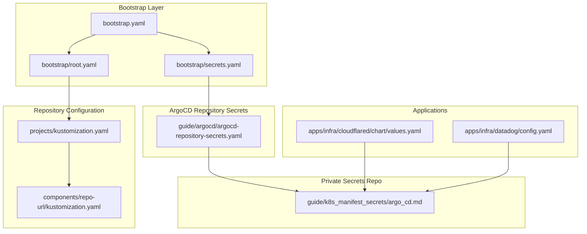
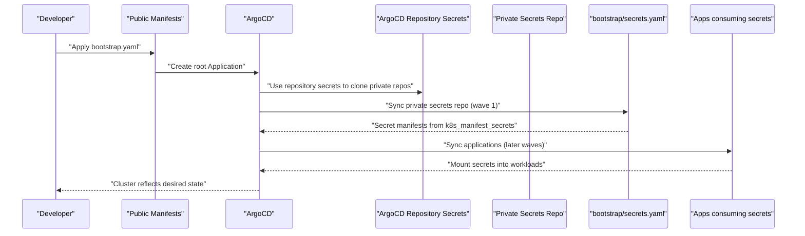
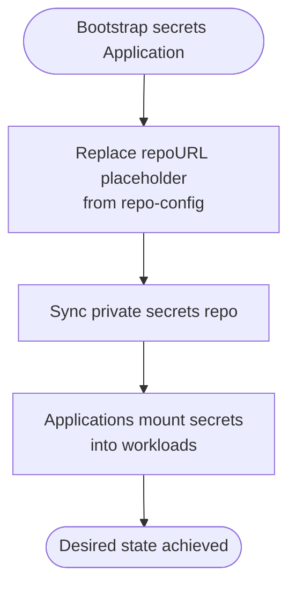
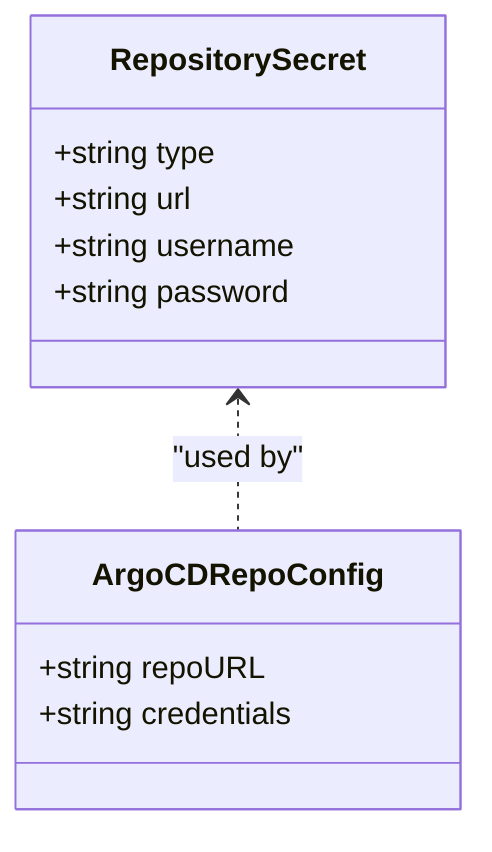
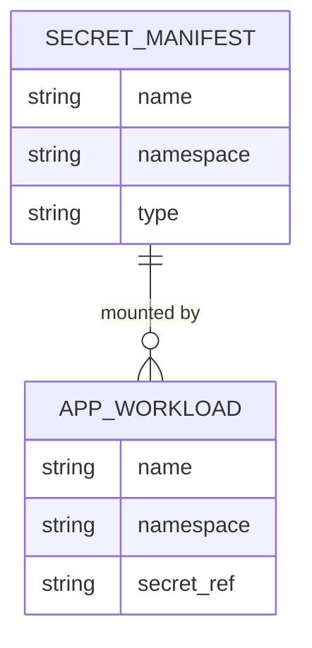
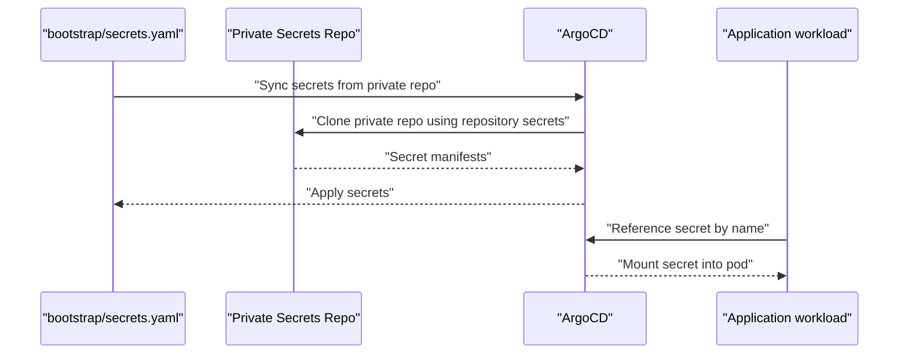
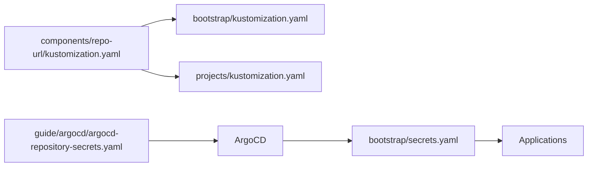

# Secret Handling

<cite>
**Referenced Files in This Document**
- [README.md](file://README.md)
- [bootstrap.yaml](file://bootstrap.yaml)
- [bootstrap/kustomization.yaml](file://bootstrap/kustomization.yaml)
- [bootstrap/root.yaml](file://bootstrap/root.yaml)
- [bootstrap/secrets.yaml](file://bootstrap/secrets.yaml)
- [components/repo-url/kustomization.yaml](file://components/repo-url/kustomization.yaml)
- [projects/kustomization.yaml](file://projects/kustomization.yaml)
- [projects/infra.yaml](file://projects/infra.yaml)
- [guide/argocd/argocd-repository-secrets.yaml](file://guide/argocd/argocd-repository-secrets.yaml)
- [guide/k8s_manifest_secrets/argo_cd.md](file://guide/k8s_manifest_secrets/argo_cd.md)
- [apps/infra/cloudflared/chart/values.yaml](file://apps/infra/cloudflared/chart/values.yaml)
- [apps/infra/datadog/config.yaml](file://apps/infra/datadog/config.yaml)
</cite>

## Table of Contents
1. [Introduction](#introduction)
2. [Project Structure](#project-structure)
3. [Core Components](#core-components)
4. [Architecture Overview](#architecture-overview)
5. [Detailed Component Analysis](#detailed-component-analysis)
6. [Dependency Analysis](#dependency-analysis)
7. [Performance Considerations](#performance-considerations)
8. [Troubleshooting Guide](#troubleshooting-guide)
9. [Conclusion](#conclusion)
10. [Appendices](#appendices)

## Introduction
This document explains the secret management system used during bootstrap and ongoing operations. It details how bootstrap/secrets.yaml coordinates with ArgoCD repository secrets to securely access private repositories, how secrets are created and named, and how bootstrap secrets relate to application-specific secrets. It also covers security implications, credential rotation, least-privilege access patterns, compliance and audit considerations, and practical operational guidance.

## Project Structure
The secret management system spans three layers:
- Bootstrap layer: Defines the root Application and the secrets Application that syncs a private secrets repository.
- Repository configuration layer: Centralizes repository URLs and injects them into Applications and ApplicationSets.
- Application layer: Consumes secrets from the private repository via ArgoCD’s repository secrets and mounts them into workloads.

**Diagram sources**
- [bootstrap/root.yaml:1-37](file://bootstrap/root.yaml#L1-L37)
- [bootstrap/secrets.yaml:1-24](file://bootstrap/secrets.yaml#L1-L24)
- [bootstrap.yaml:1-26](file://bootstrap.yaml#L1-L26)
- [components/repo-url/kustomization.yaml:1-11](file://components/repo-url/kustomization.yaml#L1-L11)
- [projects/kustomization.yaml:1-22](file://projects/kustomization.yaml#L1-L22)
- [apps/infra/cloudflared/chart/values.yaml:1-39](file://apps/infra/cloudflared/chart/values.yaml#L1-L39)
- [apps/infra/datadog/config.yaml:1-5](file://apps/infra/datadog/config.yaml#L1-L5)
- [guide/argocd/argocd-repository-secrets.yaml:1-30](file://guide/argocd/argocd-repository-secrets.yaml#L1-L30)
- [guide/k8s_manifest_secrets/argo_cd.md:1-46](file://guide/k8s_manifest_secrets/argo_cd.md#L1-L46)

**Section sources**
- [README.md:57-118](file://README.md#L57-L118)
- [bootstrap.yaml:1-26](file://bootstrap.yaml#L1-L26)
- [bootstrap/kustomization.yaml:1-38](file://bootstrap/kustomization.yaml#L1-L38)
- [bootstrap/root.yaml:1-37](file://bootstrap/root.yaml#L1-L37)
- [bootstrap/secrets.yaml:1-24](file://bootstrap/secrets.yaml#L1-L24)
- [components/repo-url/kustomization.yaml:1-11](file://components/repo-url/kustomization.yaml#L1-L11)
- [projects/kustomization.yaml:1-22](file://projects/kustomization.yaml#L1-L22)
- [projects/infra.yaml:1-85](file://projects/infra.yaml#L1-L85)
- [guide/argocd/argocd-repository-secrets.yaml:1-30](file://guide/argocd/argocd-repository-secrets.yaml#L1-L30)
- [guide/k8s_manifest_secrets/argo_cd.md:1-46](file://guide/k8s_manifest_secrets/argo_cd.md#L1-L46)
- [apps/infra/cloudflared/chart/values.yaml:1-39](file://apps/infra/cloudflared/chart/values.yaml#L1-L39)
- [apps/infra/datadog/config.yaml:1-5](file://apps/infra/datadog/config.yaml#L1-L5)

## Core Components
- Bootstrap root Application: Declares the projects directory as source and automates synchronization with pruning and self-healing.
- Bootstrap secrets Application: Declares a dedicated Application to sync secrets from a private repository, enabling ArgoCD to access private repos.
- Repository URL configuration: A centralized ConfigMap generator supplies repository URLs consumed by Applications and ApplicationSets.
- ArgoCD repository secrets: Kubernetes Secrets labeled for ArgoCD repository access, containing credentials for accessing private repositories.
- Private secrets repository: Holds Kubernetes Secret manifests for application-specific credentials, mounted into workloads by applications.

Key behaviors:
- URL injection: The bootstrap and projects Kustomizations replace placeholders with repository URLs from a central ConfigMap.
- Sync waves: Secrets are applied in wave 1, ensuring they are available before dependent applications run in later waves.
- Least privilege: Separate repository secrets for public and private repositories; applications consume only the secrets they need.

**Section sources**
- [bootstrap/root.yaml:1-37](file://bootstrap/root.yaml#L1-L37)
- [bootstrap/secrets.yaml:1-24](file://bootstrap/secrets.yaml#L1-L24)
- [bootstrap/kustomization.yaml:12-38](file://bootstrap/kustomization.yaml#L12-L38)
- [components/repo-url/kustomization.yaml:4-10](file://components/repo-url/kustomization.yaml#L4-L10)
- [projects/kustomization.yaml:11-22](file://projects/kustomization.yaml#L11-L22)
- [guide/argocd/argocd-repository-secrets.yaml:5-29](file://guide/argocd/argocd-repository-secrets.yaml#L5-L29)
- [guide/k8s_manifest_secrets/argo_cd.md:6-45](file://guide/k8s_manifest_secrets/argo_cd.md#L6-L45)
- [README.md:76-85](file://README.md#L76-L85)

## Architecture Overview
The secret handling architecture ensures that:
- Public bootstrap manifests never contain credentials.
- ArgoCD accesses private repositories via repository secrets.
- The private secrets repository is synchronized by a dedicated Application with a controlled sync wave.
- Applications mount secrets from the private repository into workloads using standard Kubernetes Secret references.

**Diagram sources**
- [bootstrap.yaml:1-26](file://bootstrap.yaml#L1-L26)
- [bootstrap/root.yaml:1-37](file://bootstrap/root.yaml#L1-L37)
- [bootstrap/secrets.yaml:1-24](file://bootstrap/secrets.yaml#L1-L24)
- [guide/argocd/argocd-repository-secrets.yaml:5-29](file://guide/argocd/argocd-repository-secrets.yaml#L5-L29)
- [guide/k8s_manifest_secrets/argo_cd.md:6-45](file://guide/k8s_manifest_secrets/argo_cd.md#L6-L45)
- [apps/infra/cloudflared/chart/values.yaml:19-21](file://apps/infra/cloudflared/chart/values.yaml#L19-L21)

## Detailed Component Analysis

### Bootstrap Secrets Application
Purpose:
- Enable ArgoCD to access the private secrets repository by pointing the Application to the private repo URL.
- Coordinate with repository secrets to authenticate with the private repo.

Behavior:
- Uses a placeholder for repoURL that is replaced by Kustomize using the central ConfigMap.
- Applies a sync wave to ensure secrets are available before dependent apps run.
- Enables pruning and self-healing to maintain a clean state.

**Diagram sources**
- [bootstrap/secrets.yaml:10-24](file://bootstrap/secrets.yaml#L10-L24)
- [bootstrap/kustomization.yaml:32-37](file://bootstrap/kustomization.yaml#L32-L37)
- [components/repo-url/kustomization.yaml:4-10](file://components/repo-url/kustomization.yaml#L4-L10)

**Section sources**
- [bootstrap/secrets.yaml:1-24](file://bootstrap/secrets.yaml#L1-L24)
- [bootstrap/kustomization.yaml:32-37](file://bootstrap/kustomization.yaml#L32-L37)
- [components/repo-url/kustomization.yaml:4-10](file://components/repo-url/kustomization.yaml#L4-L10)
- [README.md:70-74](file://README.md#L70-L74)

### Repository Secrets and Access Control
Purpose:
- Provide ArgoCD with credentials to access private repositories hosting manifests and secrets.

Guidelines:
- Create Kubernetes Secrets labeled for ArgoCD repository access.
- Store credentials for the public manifests repo and the private secrets repo separately.
- Keep credentials out of the public manifests repository.

**Diagram sources**
- [guide/argocd/argocd-repository-secrets.yaml:5-29](file://guide/argocd/argocd-repository-secrets.yaml#L5-L29)

**Section sources**
- [guide/argocd/argocd-repository-secrets.yaml:1-30](file://guide/argocd/argocd-repository-secrets.yaml#L1-L30)
- [README.md:160-163](file://README.md#L160-L163)

### Private Secrets Repository and Naming Conventions
Purpose:
- Store Kubernetes Secret manifests for application credentials.
- Provide a single source of truth for sensitive configuration data.

Naming conventions:
- Secrets are named semantically (for example, application-specific names).
- TLS secrets use the standard Kubernetes TLS type and include appropriate keys.

**Diagram sources**
- [guide/k8s_manifest_secrets/argo_cd.md:10-45](file://guide/k8s_manifest_secrets/argo_cd.md#L10-L45)
- [apps/infra/cloudflared/chart/values.yaml:19-21](file://apps/infra/cloudflared/chart/values.yaml#L19-L21)

**Section sources**
- [guide/k8s_manifest_secrets/argo_cd.md:6-45](file://guide/k8s_manifest_secrets/argo_cd.md#L6-L45)
- [apps/infra/cloudflared/chart/values.yaml:17-21](file://apps/infra/cloudflared/chart/values.yaml#L17-L21)

### Relationship Between Bootstrap Secrets and Application-Specific Secrets
- Bootstrap secrets Application synchronizes the private secrets repository into the cluster.
- Applications reference secrets by name and namespace, mounting them into containers via standard Kubernetes mechanisms.
- Sync waves ensure secrets exist before applications attempt to mount them.

**Diagram sources**
- [bootstrap/secrets.yaml:1-24](file://bootstrap/secrets.yaml#L1-L24)
- [guide/argocd/argocd-repository-secrets.yaml:5-29](file://guide/argocd/argocd-repository-secrets.yaml#L5-L29)
- [guide/k8s_manifest_secrets/argo_cd.md:10-45](file://guide/k8s_manifest_secrets/argo_cd.md#L10-L45)
- [apps/infra/cloudflared/chart/values.yaml:19-21](file://apps/infra/cloudflared/chart/values.yaml#L19-L21)

**Section sources**
- [README.md:72-74](file://README.md#L72-L74)
- [apps/infra/cloudflared/chart/values.yaml:19-21](file://apps/infra/cloudflared/chart/values.yaml#L19-L21)
- [apps/infra/datadog/config.yaml:1-5](file://apps/infra/datadog/config.yaml#L1-L5)

## Dependency Analysis
- Centralized repository URLs: The repo-config ConfigMap drives URL substitution across bootstrap and projects Kustomizations.
- Repository secrets dependency: ArgoCD requires repository secrets to access private repositories.
- Sync wave dependency: Secrets must be available before applications that depend on them.

**Diagram sources**
- [components/repo-url/kustomization.yaml:4-10](file://components/repo-url/kustomization.yaml#L4-L10)
- [bootstrap/kustomization.yaml:12-38](file://bootstrap/kustomization.yaml#L12-L38)
- [projects/kustomization.yaml:11-22](file://projects/kustomization.yaml#L11-L22)
- [guide/argocd/argocd-repository-secrets.yaml:5-29](file://guide/argocd/argocd-repository-secrets.yaml#L5-L29)
- [bootstrap/secrets.yaml:1-24](file://bootstrap/secrets.yaml#L1-L24)

**Section sources**
- [components/repo-url/kustomization.yaml:4-10](file://components/repo-url/kustomization.yaml#L4-L10)
- [bootstrap/kustomization.yaml:12-38](file://bootstrap/kustomization.yaml#L12-L38)
- [projects/kustomization.yaml:11-22](file://projects/kustomization.yaml#L11-L22)
- [guide/argocd/argocd-repository-secrets.yaml:5-29](file://guide/argocd/argocd-repository-secrets.yaml#L5-L29)

## Performance Considerations
- Minimize repeated cloning: Use repository secrets to avoid repeated authentication overhead.
- Reduce sync frequency: Tune ApplicationSet generators’ requeue intervals appropriately.
- Limit secret scope: Keep the private secrets repository small and focused to reduce sync time.
- Use pruning judiciously: Ensure pruning aligns with operational needs to avoid unnecessary churn.

## Troubleshooting Guide
Common issues and resolutions:
- Authentication failures to private repositories:
  - Verify repository secrets exist and are labeled correctly.
  - Confirm the correct credentials are set for the intended repository URL.
  - Ensure the repository secrets are applied before applying bootstrap.
- Secrets not available to applications:
  - Check the sync wave order; secrets must be in wave 1.
  - Verify the Application references the correct secret name and namespace.
  - Confirm the private secrets repository is accessible via repository secrets.
- ApplicationSet discovery not using repository URLs:
  - Validate that the central ConfigMap contains the correct URLs.
  - Ensure replacements are configured in Kustomizations to propagate URLs to Applications and ApplicationSets.

Operational steps:
- Re-apply repository secrets if credentials change.
- Re-run bootstrap to refresh placeholder substitutions.
- Inspect Application statuses and logs for detailed errors.

**Section sources**
- [guide/argocd/argocd-repository-secrets.yaml:1-30](file://guide/argocd/argocd-repository-secrets.yaml#L1-L30)
- [bootstrap/kustomization.yaml:12-38](file://bootstrap/kustomization.yaml#L12-L38)
- [projects/kustomization.yaml:11-22](file://projects/kustomization.yaml#L11-L22)
- [README.md:76-85](file://README.md#L76-L85)

## Conclusion
The secret management system separates concerns cleanly: public bootstrap manifests, ArgoCD repository secrets, and a private secrets repository. This separation enables least-privilege access, secure credential handling, and auditable operations. By following the documented patterns—repository URL centralization, strict labeling of repository secrets, and wave-driven synchronization—you can maintain a robust and compliant secret lifecycle.

## Appendices

### Practical Setup Examples
- Applying repository secrets:
  - Use the provided repository secrets manifest to create ArgoCD repository secrets for both the public and private repositories.
- Bootstrapping:
  - Build and apply the root bootstrap Application; Kustomize will inject repository URLs and create the root Application.
- Verifying secret availability:
  - After bootstrap, confirm that secrets from the private repository are present in the cluster and referenced by applications.

**Section sources**
- [guide/argocd/argocd-repository-secrets.yaml:18-29](file://guide/argocd/argocd-repository-secrets.yaml#L18-L29)
- [bootstrap.yaml:15-18](file://bootstrap.yaml#L15-L18)
- [README.md:68-74](file://README.md#L68-L74)

### Security and Compliance Best Practices
- Credential rotation:
  - Revoke old tokens and issue new ones; update repository secrets accordingly.
  - Re-apply repository secrets and re-run bootstrap to refresh URL placeholders.
- Least privilege:
  - Grant repository secrets only to repositories they need to access.
  - Scope application-specific secrets to their respective namespaces.
- Audit and traceability:
  - Track changes to repository secrets and private secrets via Git history.
  - Use ArgoCD sync logs to monitor successful and failed syncs.
  - Maintain separation between public and private repositories to minimize exposure.

**Section sources**
- [guide/argocd/argocd-repository-secrets.yaml:1-3](file://guide/argocd/argocd-repository-secrets.yaml#L1-L3)
- [README.md:160-163](file://README.md#L160-L163)