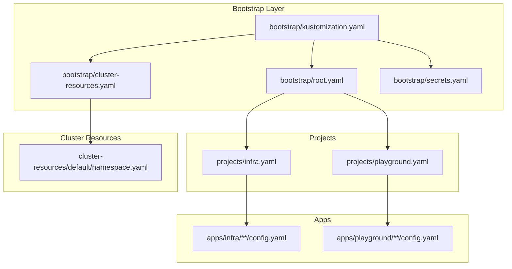
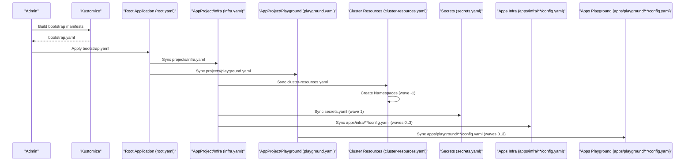
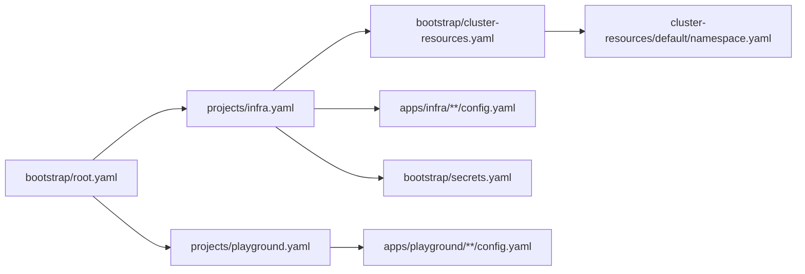

# Cluster Resources

<cite>
**Referenced Files in This Document**
- [README.md](file://README.md)
- [bootstrap/kustomization.yaml](file://bootstrap/kustomization.yaml)
- [bootstrap/root.yaml](file://bootstrap/root.yaml)
- [bootstrap/cluster-resources.yaml](file://bootstrap/cluster-resources.yaml)
- [bootstrap/secrets.yaml](file://bootstrap/secrets.yaml)
- [cluster-resources/default/namespace.yaml](file://cluster-resources/default/namespace.yaml)
- [projects/infra.yaml](file://projects/infra.yaml)
- [projects/playground.yaml](file://projects/playground.yaml)
- [apps/infra/cloudflared/config.yaml](file://apps/infra/cloudflared/config.yaml)
- [apps/infra/gateway-api/config.yaml](file://apps/infra/gateway-api/config.yaml)
- [apps/infra/datadog/config.yaml](file://apps/infra/datadog/config.yaml)
- [apps/playground/cert-manager/config.yaml](file://apps/playground/cert-manager/config.yaml)
- [apps/playground/hello-api/config.yaml](file://apps/playground/hello-api/config.yaml)
- [apps/playground/rancher/config.yaml](file://apps/playground/rancher/config.yaml)
- [apps/playground/argocd-ingress/config.yaml](file://apps/playground/argocd-ingress/config.yaml)
</cite>

## Table of Contents
1. [Introduction](#introduction)
2. [Project Structure](#project-structure)
3. [Core Components](#core-components)
4. [Architecture Overview](#architecture-overview)
5. [Detailed Component Analysis](#detailed-component-analysis)
6. [Dependency Analysis](#dependency-analysis)
7. [Performance Considerations](#performance-considerations)
8. [Troubleshooting Guide](#troubleshooting-guide)
9. [Conclusion](#conclusion)
10. [Appendices](#appendices)

## Introduction
This document explains how cluster resources and namespaces are modeled and orchestrated across the GitOps pipeline. It focuses on:
- Shared cluster objects and namespace isolation strategies
- The sync wave ordering (-1) for namespace creation and its impact on application readiness
- How cluster resources relate to application deployments, including dependency management and resource allocation
- Examples of namespace definitions, resource placement, and operational patterns
- Multi-tenant considerations and isolation across application groups

## Project Structure
The repository organizes cluster bootstrapping, shared resources, and application projects as follows:
- Root Kustomization composes bootstrap manifests and injects repository URLs centrally.
- Bootstrap layer defines the root Application and ApplicationSets for cluster resources and secrets.
- Shared cluster resources (namespaces) are provisioned early via a dedicated ApplicationSet with negative sync waves.
- Projects define AppProjects and ApplicationSets that discover and deploy applications from the apps/ hierarchy.
- Applications declare destination namespaces and optional sync waves to enforce ordering.

**Diagram sources**
- [bootstrap/kustomization.yaml:1-38](file://bootstrap/kustomization.yaml#L1-L38)
- [bootstrap/root.yaml:1-37](file://bootstrap/root.yaml#L1-L37)
- [bootstrap/cluster-resources.yaml:1-33](file://bootstrap/cluster-resources.yaml#L1-L33)
- [bootstrap/secrets.yaml:1-24](file://bootstrap/secrets.yaml#L1-L24)
- [cluster-resources/default/namespace.yaml:1-52](file://cluster-resources/default/namespace.yaml#L1-L52)
- [projects/infra.yaml:1-85](file://projects/infra.yaml#L1-L85)
- [projects/playground.yaml:1-90](file://projects/playground.yaml#L1-L90)

**Section sources**
- [README.md:68-118](file://README.md#L68-L118)
- [bootstrap/kustomization.yaml:1-38](file://bootstrap/kustomization.yaml#L1-L38)
- [bootstrap/root.yaml:1-37](file://bootstrap/root.yaml#L1-L37)
- [bootstrap/cluster-resources.yaml:1-33](file://bootstrap/cluster-resources.yaml#L1-L33)
- [bootstrap/secrets.yaml:1-24](file://bootstrap/secrets.yaml#L1-L24)
- [cluster-resources/default/namespace.yaml:1-52](file://cluster-resources/default/namespace.yaml#L1-L52)
- [projects/infra.yaml:1-85](file://projects/infra.yaml#L1-L85)
- [projects/playground.yaml:1-90](file://projects/playground.yaml#L1-L90)

## Core Components
- Root Application: Orchestrates the bootstrap chain and points to the projects directory.
- ApplicationSets: Discover and render applications from the apps/ hierarchy using Kustomize and Helm.
- AppProjects: Define resource whitelists and destination clusters/namespaces per project.
- Cluster Resources ApplicationSet: Creates shared namespaces with negative sync waves to guarantee availability before apps deploy.
- Secrets Application: Synchronizes private secrets from a separate repository at a controlled wave.

Key responsibilities:
- Ensure namespace existence before dependent resources attempt to bind to them.
- Enforce project-level isolation and allow-lists for safe multi-tenant operation.
- Control sync order to avoid race conditions between CRDs, controllers, and workloads.

**Section sources**
- [bootstrap/root.yaml:1-37](file://bootstrap/root.yaml#L1-L37)
- [projects/infra.yaml:1-85](file://projects/infra.yaml#L1-L85)
- [projects/playground.yaml:1-90](file://projects/playground.yaml#L1-L90)
- [bootstrap/cluster-resources.yaml:1-33](file://bootstrap/cluster-resources.yaml#L1-L33)
- [bootstrap/secrets.yaml:1-24](file://bootstrap/secrets.yaml#L1-L24)

## Architecture Overview
The sync wave model enforces deterministic ordering across the cluster provisioning pipeline. The sequence below reflects the intended synchronization order and dependencies.

**Diagram sources**
- [README.md:76-86](file://README.md#L76-L86)
- [bootstrap/root.yaml:1-37](file://bootstrap/root.yaml#L1-L37)
- [projects/infra.yaml:1-85](file://projects/infra.yaml#L1-L85)
- [projects/playground.yaml:1-90](file://projects/playground.yaml#L1-L90)
- [bootstrap/cluster-resources.yaml:1-33](file://bootstrap/cluster-resources.yaml#L1-L33)
- [bootstrap/secrets.yaml:1-24](file://bootstrap/secrets.yaml#L1-L24)
- [apps/infra/cloudflared/config.yaml:1-4](file://apps/infra/cloudflared/config.yaml#L1-L4)
- [apps/infra/gateway-api/config.yaml:1-6](file://apps/infra/gateway-api/config.yaml#L1-L6)
- [apps/playground/hello-api/config.yaml:1-4](file://apps/playground/hello-api/config.yaml#L1-L4)
- [apps/playground/rancher/config.yaml:1-5](file://apps/playground/rancher/config.yaml#L1-L5)
- [apps/playground/argocd-ingress/config.yaml:1-4](file://apps/playground/argocd-ingress/config.yaml#L1-L4)

## Detailed Component Analysis

### Shared Cluster Objects and Namespace Definitions
- Cluster resources are defined as an ApplicationSet that generates a set of namespaces and applies them with a negative sync wave to ensure they exist before downstream resources depend on them.
- The namespace definitions include commonly shared namespaces such as gateway-api, cloudflared, cert-manager, cattle-system, datadog, and others.

Operational implications:
- Negative sync waves guarantee namespace existence prior to application deployments.
- This pattern prevents failures caused by missing namespaces during early sync phases.

**Section sources**
- [bootstrap/cluster-resources.yaml:1-33](file://bootstrap/cluster-resources.yaml#L1-L33)
- [cluster-resources/default/namespace.yaml:1-52](file://cluster-resources/default/namespace.yaml#L1-L52)
- [README.md:144-147](file://README.md#L144-L147)

### Namespace Creation and Sync Wave Ordering
- The cluster-resources ApplicationSet runs at wave 0 by default, while each namespace manifest carries an annotation to run at wave -1. This ensures namespaces are created before the ApplicationSet completes its own sync.
- The documented sync order places AppProjects at wave -2, namespaces at wave -1, ApplicationSets at wave 0, secrets at wave 1, mid-tier resources at wave 2, and HTTPRoutes at wave 3.

Practical outcomes:
- Controllers and CRDs can be installed in wave 2 before HTTPRoutes in wave 3 rely on them.
- Secrets are synchronized before apps that require them are deployed.

**Section sources**
- [bootstrap/cluster-resources.yaml:4-6](file://bootstrap/cluster-resources.yaml#L4-L6)
- [cluster-resources/default/namespace.yaml:8-9](file://cluster-resources/default/namespace.yaml#L8-L9)
- [README.md:76-86](file://README.md#L76-L86)

### Relationship Between Cluster Resources and Application Deployments
- AppProjects define per-project permissions and destination constraints.
- ApplicationSets discover applications from the apps/ hierarchy and render them with Kustomize and Helm.
- Applications specify destNamespace and optional sync waves to align with shared resource availability.

Dependency management examples:
- Gateway API resources require CRDs and controllers to be present before HTTPRoutes can attach to Gateways.
- Cert-manager and other mid-tier controllers are installed before workloads that request certificates.
- HTTPRoutes are applied last so they can safely reference existing Gateways and Services.

**Section sources**
- [projects/infra.yaml:1-85](file://projects/infra.yaml#L1-L85)
- [projects/playground.yaml:1-90](file://projects/playground.yaml#L1-L90)
- [apps/infra/gateway-api/config.yaml:1-6](file://apps/infra/gateway-api/config.yaml#L1-L6)
- [apps/playground/cert-manager/config.yaml:1-5](file://apps/playground/cert-manager/config.yaml#L1-L5)
- [apps/playground/argocd-ingress/config.yaml:1-4](file://apps/playground/argocd-ingress/config.yaml#L1-L4)
- [apps/playground/hello-api/config.yaml:1-4](file://apps/playground/hello-api/config.yaml#L1-L4)
- [apps/playground/rancher/config.yaml:1-5](file://apps/playground/rancher/config.yaml#L1-L5)
- [apps/infra/cloudflared/config.yaml:1-4](file://apps/infra/cloudflared/config.yaml#L1-L4)
- [apps/infra/datadog/config.yaml:1-6](file://apps/infra/datadog/config.yaml#L1-L6)

### Resource Allocation and Quotas
- The repository does not define ResourceQuotas or LimitRanges in the provided files.
- Multi-tenant isolation is primarily achieved through AppProjects and explicit namespace scoping in ApplicationSets and applications.

Recommendations (conceptual):
- Consider adding ResourceQuotas per namespace for CPU/memory limits and Pod counts.
- Use LimitRanges for default requests/limits at the namespace level.
- Apply PodSecurity admission policies via namespace labels or PodSecurity labels.

[No sources needed since this section provides general guidance]

### RBAC Configurations
- The repository does not include RBAC Role/RoleBinding/ClusterRole/ClusterRoleBinding definitions in the analyzed files.
- Access control is implicitly governed by Argo CD AppProject whitelists and destination constraints.

Recommendations (conceptual):
- Define fine-grained RBAC per namespace or per AppProject.
- Use RoleBindings for developer teams and ClusterRoleBindings sparingly.
- Leverage Argo CD’s built-in sync-wave and sync-options to prevent unauthorized drift.

[No sources needed since this section provides general guidance]

### Multi-Tenant Considerations and Isolation
- AppProjects isolate clusters, namespaces, and repositories per tenant or team.
- ApplicationSets restrict destinations and allow-list cluster and namespace resources.
- Namespace-scoped applications ensure that workloads do not interfere across tenants.

Operational benefits:
- Prevents cross-project resource conflicts.
- Enables independent release cadence per project.
- Simplifies auditing and compliance through explicit allow-lists.

**Section sources**
- [projects/infra.yaml:10-21](file://projects/infra.yaml#L10-L21)
- [projects/playground.yaml:10-21](file://projects/playground.yaml#L10-L21)
- [projects/infra.yaml:51-53](file://projects/infra.yaml#L51-L53)
- [projects/playground.yaml:51-53](file://projects/playground.yaml#L51-L53)

## Dependency Analysis
The following diagram maps the primary dependencies among bootstrap, projects, cluster resources, and applications.

**Diagram sources**
- [bootstrap/root.yaml:1-37](file://bootstrap/root.yaml#L1-L37)
- [projects/infra.yaml:1-85](file://projects/infra.yaml#L1-L85)
- [projects/playground.yaml:1-90](file://projects/playground.yaml#L1-L90)
- [bootstrap/cluster-resources.yaml:1-33](file://bootstrap/cluster-resources.yaml#L1-L33)
- [cluster-resources/default/namespace.yaml:1-52](file://cluster-resources/default/namespace.yaml#L1-L52)
- [bootstrap/secrets.yaml:1-24](file://bootstrap/secrets.yaml#L1-L24)

**Section sources**
- [README.md:76-86](file://README.md#L76-L86)
- [bootstrap/root.yaml:1-37](file://bootstrap/root.yaml#L1-L37)
- [projects/infra.yaml:1-85](file://projects/infra.yaml#L1-L85)
- [projects/playground.yaml:1-90](file://projects/playground.yaml#L1-L90)
- [bootstrap/cluster-resources.yaml:1-33](file://bootstrap/cluster-resources.yaml#L1-L33)
- [cluster-resources/default/namespace.yaml:1-52](file://cluster-resources/default/namespace.yaml#L1-L52)
- [bootstrap/secrets.yaml:1-24](file://bootstrap/secrets.yaml#L1-L24)

## Performance Considerations
- Using negative sync waves for namespaces reduces retries and failures during early sync phases.
- Centralized repository URL replacement avoids repeated manual updates and reduces human error.
- Kustomize build options enable Helm integration without increasing maintenance overhead.

[No sources needed since this section provides general guidance]

## Troubleshooting Guide
Common issues and remedies:
- Missing namespaces for HTTPRoutes: Verify that cluster-resources ApplicationSet has completed and namespaces exist at wave -1.
- Secrets not found by applications: Confirm that the secrets Application runs at wave 1 and that application configs reference the correct secret names.
- CRDs or controllers not ready before workloads: Ensure ApplicationSets for mid-tier resources run at wave 2 and that HTTPRoutes run at wave 3.
- Cross-project interference: Review AppProject whitelists and destination constraints to confirm isolation boundaries.

**Section sources**
- [README.md:76-86](file://README.md#L76-L86)
- [bootstrap/cluster-resources.yaml:1-33](file://bootstrap/cluster-resources.yaml#L1-L33)
- [bootstrap/secrets.yaml:1-24](file://bootstrap/secrets.yaml#L1-L24)
- [projects/infra.yaml:1-85](file://projects/infra.yaml#L1-L85)
- [projects/playground.yaml:1-90](file://projects/playground.yaml#L1-L90)

## Conclusion
The repository employs a structured, wave-driven approach to cluster resource provisioning and application deployment. Shared namespaces are created early with negative sync waves, ensuring downstream resources can bind reliably. AppProjects and ApplicationSets provide multi-tenant isolation and deterministic rollout ordering. While ResourceQuotas and RBAC are not defined in the analyzed files, the current design leverages Argo CD’s project-level controls to maintain safety and separation across application groups.

[No sources needed since this section summarizes without analyzing specific files]

## Appendices

### Appendix A: Sync Wave Reference
- Wave -2: AppProjects
- Wave -1: Namespaces
- Wave 0: ApplicationSets, Traefik Deployment
- Wave 1: Secrets from private repo
- Wave 2: Gateway, Datadog, and other mid-tier resources
- Wave 3: HTTPRoutes (last, after Gateway exists)

**Section sources**
- [README.md:76-86](file://README.md#L76-L86)

### Appendix B: Namespace Placement Examples
- Shared namespaces: gateway-api, cloudflared, cert-manager, cattle-system, datadog
- Application-specific namespaces: argocd, hello-api, rancher, etc.

**Section sources**
- [cluster-resources/default/namespace.yaml:1-52](file://cluster-resources/default/namespace.yaml#L1-L52)
- [apps/playground/hello-api/config.yaml:1-4](file://apps/playground/hello-api/config.yaml#L1-L4)
- [apps/playground/rancher/config.yaml:1-5](file://apps/playground/rancher/config.yaml#L1-L5)
- [apps/playground/argocd-ingress/config.yaml:1-4](file://apps/playground/argocd-ingress/config.yaml#L1-L4)
- [apps/infra/gateway-api/config.yaml:1-6](file://apps/infra/gateway-api/config.yaml#L1-L6)
- [apps/infra/cloudflared/config.yaml:1-4](file://apps/infra/cloudflared/config.yaml#L1-L4)
- [apps/infra/datadog/config.yaml:1-6](file://apps/infra/datadog/config.yaml#L1-L6)
- [apps/playground/cert-manager/config.yaml:1-5](file://apps/playground/cert-manager/config.yaml#L1-L5)