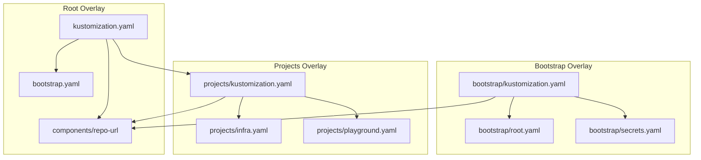
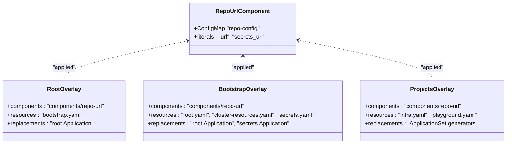
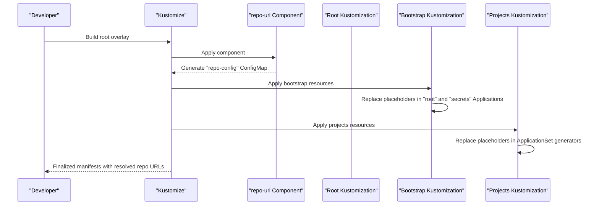
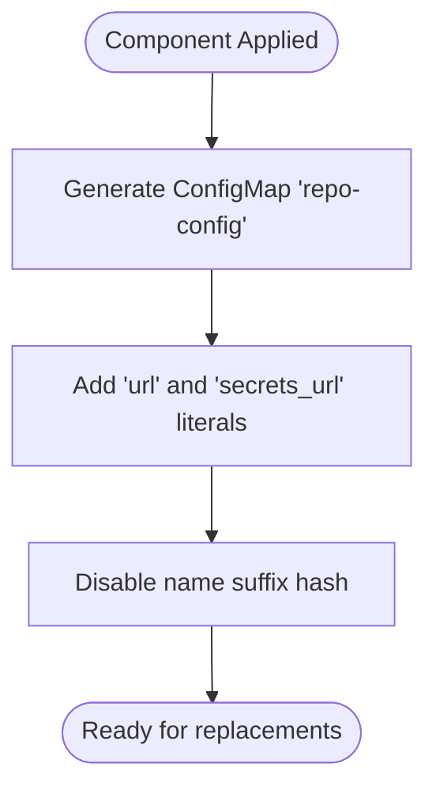
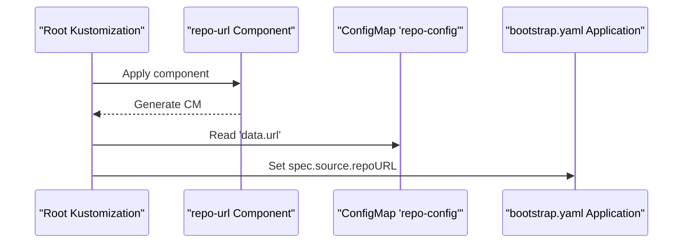
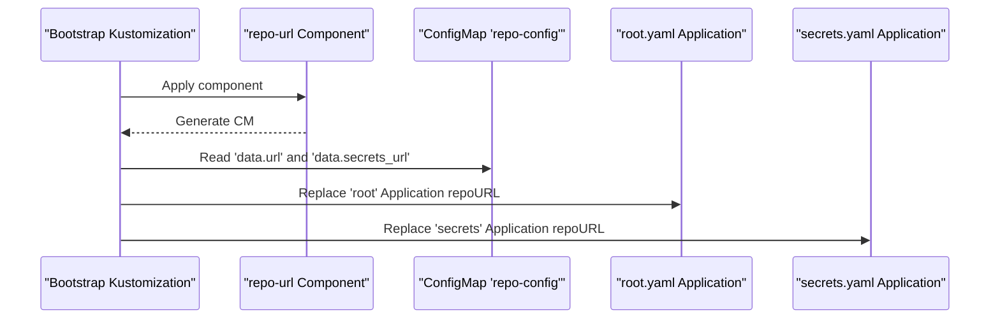
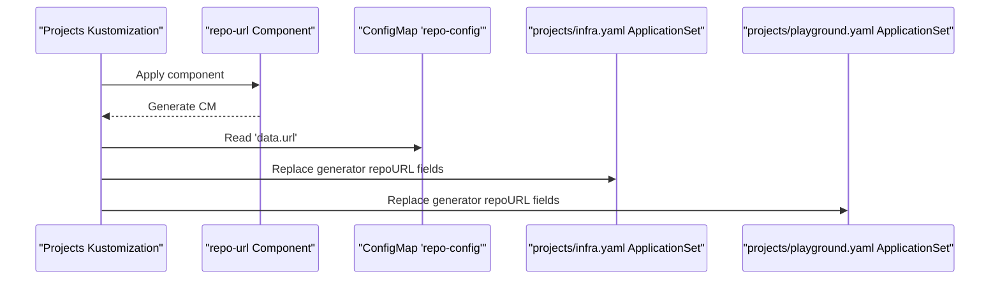
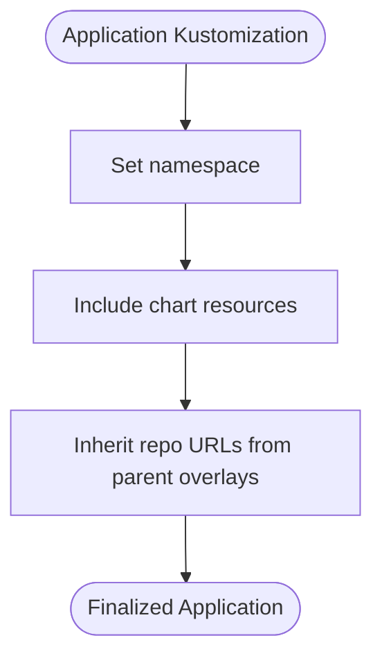
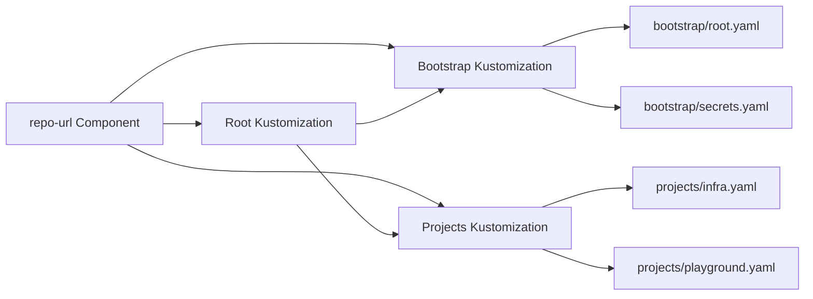

# Configuration Management

<cite>
**Referenced Files in This Document**
- [components/repo-url/kustomization.yaml](file://components/repo-url/kustomization.yaml)
- [bootstrap/kustomization.yaml](file://bootstrap/kustomization.yaml)
- [kustomization.yaml](file://kustomization.yaml)
- [projects/kustomization.yaml](file://projects/kustomization.yaml)
- [bootstrap/root.yaml](file://bootstrap/root.yaml)
- [bootstrap/secrets.yaml](file://bootstrap/secrets.yaml)
- [bootstrap.yaml](file://bootstrap.yaml)
- [projects/infra.yaml](file://projects/infra.yaml)
- [projects/playground.yaml](file://projects/playground.yaml)
- [apps/infra/cloudflared/kustomization.yaml](file://apps/infra/cloudflared/kustomization.yaml)
</cite>

## Table of Contents
1. [Introduction](#introduction)
2. [Project Structure](#project-structure)
3. [Core Components](#core-components)
4. [Architecture Overview](#architecture-overview)
5. [Detailed Component Analysis](#detailed-component-analysis)
6. [Dependency Analysis](#dependency-analysis)
7. [Performance Considerations](#performance-considerations)
8. [Troubleshooting Guide](#troubleshooting-guide)
9. [Conclusion](#conclusion)

## Introduction
This document explains the configuration management system built on Kustomize components. It focuses on a central repository URL management strategy that ensures a single source of truth for Git repository URLs across bootstrap, projects, and applications. The system leverages Kustomize Components to define shared configuration and Kustomize Replacements to inject repository URLs into Argo CD resources at build time. This approach enables consistent configuration across environments and simplifies maintenance by consolidating repository URL definitions in one place.

## Project Structure
The repository organizes configuration into layered Kustomize overlays:
- Root overlay applies components and top-level resources.
- Bootstrap overlay defines initial Argo CD Applications and Secrets Applications.
- Projects overlay defines Argo CD AppProjects and ApplicationSets per environment.
- Apps overlay contains application-specific charts and configurations.

Key relationships:
- Root overlay composes the repo-url component and includes the bootstrap overlay.
- Bootstrap overlay composes the repo-url component and replaces placeholder URLs in Argo CD resources.
- Projects overlay composes the repo-url component and replaces placeholder URLs in ApplicationSets.
- Apps overlays are application-specific and inherit repository URLs via the parent overlays.

**Diagram sources**
- [kustomization.yaml:1-21](file://kustomization.yaml#L1-L21)
- [bootstrap/kustomization.yaml:1-38](file://bootstrap/kustomization.yaml#L1-L38)
- [projects/kustomization.yaml:1-22](file://projects/kustomization.yaml#L1-L22)

**Section sources**
- [kustomization.yaml:1-21](file://kustomization.yaml#L1-L21)
- [bootstrap/kustomization.yaml:1-38](file://bootstrap/kustomization.yaml#L1-L38)
- [projects/kustomization.yaml:1-22](file://projects/kustomization.yaml#L1-L22)

## Core Components
The central component is repo-url, which generates a ConfigMap containing repository URLs. This ConfigMap is consumed by replacements in each overlay to populate Argo CD resource fields.

- Component definition: Generates a ConfigMap named repo-config with two literal keys: url and secrets_url.
- Usage: Applied by root, bootstrap, and projects overlays to supply repository URLs.

**Diagram sources**
- [components/repo-url/kustomization.yaml:1-11](file://components/repo-url/kustomization.yaml#L1-L11)
- [kustomization.yaml:1-21](file://kustomization.yaml#L1-L21)
- [bootstrap/kustomization.yaml:1-38](file://bootstrap/kustomization.yaml#L1-L38)
- [projects/kustomization.yaml:1-22](file://projects/kustomization.yaml#L1-L22)

**Section sources**
- [components/repo-url/kustomization.yaml:1-11](file://components/repo-url/kustomization.yaml#L1-L11)
- [kustomization.yaml:4-21](file://kustomization.yaml#L4-L21)
- [bootstrap/kustomization.yaml:4-38](file://bootstrap/kustomization.yaml#L4-L38)
- [projects/kustomization.yaml:4-22](file://projects/kustomization.yaml#L4-L22)

## Architecture Overview
The system enforces a single source of truth for repository URLs by generating a centralized ConfigMap and replacing placeholders in Argo CD resources during kustomization. This ensures consistency across bootstrap, projects, and applications.

**Diagram sources**
- [components/repo-url/kustomization.yaml:1-11](file://components/repo-url/kustomization.yaml#L1-L11)
- [kustomization.yaml:1-21](file://kustomization.yaml#L1-L21)
- [bootstrap/kustomization.yaml:1-38](file://bootstrap/kustomization.yaml#L1-L38)
- [projects/kustomization.yaml:1-22](file://projects/kustomization.yaml#L1-L22)

## Detailed Component Analysis

### Centralized Repository URL Component
The repo-url component defines a ConfigMap with repository URLs. This ConfigMap is the single source of truth for all overlays that apply this component.

- Purpose: Provide url and secrets_url values used by replacements.
- Behavior: Disables name suffix hashing so the ConfigMap name remains stable for reliable targeting.

**Diagram sources**
- [components/repo-url/kustomization.yaml:1-11](file://components/repo-url/kustomization.yaml#L1-L11)

**Section sources**
- [components/repo-url/kustomization.yaml:4-11](file://components/repo-url/kustomization.yaml#L4-L11)

### Root Overlay Composition
The root overlay composes the repo-url component and includes bootstrap.yaml. It also performs a replacement to set the bootstrap Application’s repoURL from the component-generated ConfigMap.

- Composition: Applies components/repo-url and includes bootstrap.yaml.
- Replacement: Populates the bootstrap Application’s repoURL field.

**Diagram sources**
- [kustomization.yaml:1-21](file://kustomization.yaml#L1-L21)
- [bootstrap.yaml:1-26](file://bootstrap.yaml#L1-L26)

**Section sources**
- [kustomization.yaml:4-21](file://kustomization.yaml#L4-L21)
- [bootstrap.yaml:15-18](file://bootstrap.yaml#L15-L18)

### Bootstrap Overlay Composition and Replacements
The bootstrap overlay composes the repo-url component and replaces placeholders in multiple Argo CD resources:
- root Application: Sets spec.source.repoURL.
- secrets Application: Sets spec.source.repoURL.
- ApplicationSet cluster-resources: Sets spec.template.spec.source.repoURL.

**Diagram sources**
- [bootstrap/kustomization.yaml:1-38](file://bootstrap/kustomization.yaml#L1-L38)
- [bootstrap/root.yaml:15-18](file://bootstrap/root.yaml#L15-L18)
- [bootstrap/secrets.yaml:12-15](file://bootstrap/secrets.yaml#L12-L15)

**Section sources**
- [bootstrap/kustomization.yaml:4-38](file://bootstrap/kustomization.yaml#L4-L38)
- [bootstrap/root.yaml:15-18](file://bootstrap/root.yaml#L15-L18)
- [bootstrap/secrets.yaml:12-15](file://bootstrap/secrets.yaml#L12-L15)

### Projects Overlay Composition and Replacements
The projects overlay composes the repo-url component and replaces placeholders in ApplicationSet generators:
- infra ApplicationSet: Sets spec.generators.0.git.repoURL and spec.generators.0.git.values.repoURL.
- playground ApplicationSet: Sets similar generator fields.

**Diagram sources**
- [projects/kustomization.yaml:1-22](file://projects/kustomization.yaml#L1-L22)
- [projects/infra.yaml:35-45](file://projects/infra.yaml#L35-L45)
- [projects/playground.yaml:35-45](file://projects/playground.yaml#L35-L45)

**Section sources**
- [projects/kustomization.yaml:4-22](file://projects/kustomization.yaml#L4-L22)
- [projects/infra.yaml:35-45](file://projects/infra.yaml#L35-L45)
- [projects/playground.yaml:35-45](file://projects/playground.yaml#L35-L45)

### Application-Level Overlays
Application overlays (for example, apps/infra/cloudflared) inherit repository URLs from their parent overlays. They apply the application chart as a resource and set a namespace.

- Example: apps/infra/cloudflared overlay sets namespace and includes the chart directory.

**Diagram sources**
- [apps/infra/cloudflared/kustomization.yaml:1-8](file://apps/infra/cloudflared/kustomization.yaml#L1-L8)

**Section sources**
- [apps/infra/cloudflared/kustomization.yaml:4-8](file://apps/infra/cloudflared/kustomization.yaml#L4-L8)

## Dependency Analysis
The system exhibits a clear dependency chain:
- Root overlay depends on the repo-url component and bootstrap overlay.
- Bootstrap overlay depends on the repo-url component and Argo CD resources.
- Projects overlay depends on the repo-url component and ApplicationSets.
- Applications depend on their parent overlays and inherit repository URLs.

**Diagram sources**
- [kustomization.yaml:1-21](file://kustomization.yaml#L1-L21)
- [bootstrap/kustomization.yaml:1-38](file://bootstrap/kustomization.yaml#L1-L38)
- [projects/kustomization.yaml:1-22](file://projects/kustomization.yaml#L1-L22)
- [bootstrap/root.yaml:1-37](file://bootstrap/root.yaml#L1-L37)
- [bootstrap/secrets.yaml:1-24](file://bootstrap/secrets.yaml#L1-L24)
- [projects/infra.yaml:1-85](file://projects/infra.yaml#L1-L85)
- [projects/playground.yaml:1-90](file://projects/playground.yaml#L1-L90)

**Section sources**
- [kustomization.yaml:1-21](file://kustomization.yaml#L1-L21)
- [bootstrap/kustomization.yaml:1-38](file://bootstrap/kustomization.yaml#L1-L38)
- [projects/kustomization.yaml:1-22](file://projects/kustomization.yaml#L1-L22)

## Performance Considerations
- Component reuse: Applying the repo-url component minimizes duplication and reduces build overhead.
- Stable ConfigMap names: Disabling name suffix hashing for the repo-config ConfigMap improves reliability of replacements.
- Replacement scope: Limit replacements to only the fields that require dynamic values to reduce unnecessary diffs.

## Troubleshooting Guide
Common issues and resolutions:
- Placeholder not replaced: Verify that the repo-url component is included in the overlay and that the replacement selectors match the target resources.
- Wrong repository URL: Confirm the ConfigMap literals for url and secrets_url are correct and that replacements target the intended fields.
- Resource not found: Ensure the target resource names and kinds in replacements match the actual manifests.

**Section sources**
- [components/repo-url/kustomization.yaml:4-11](file://components/repo-url/kustomization.yaml#L4-L11)
- [bootstrap/kustomization.yaml:12-38](file://bootstrap/kustomization.yaml#L12-L38)
- [projects/kustomization.yaml:11-22](file://projects/kustomization.yaml#L11-L22)

## Conclusion
The configuration management system establishes a robust, component-based architecture centered on a single source of truth for repository URLs. By applying the repo-url component and using targeted replacements, the system ensures consistent and maintainable configuration across bootstrap, projects, and applications. This approach simplifies updates, reduces errors, and supports scalable management of multiple environments and applications.