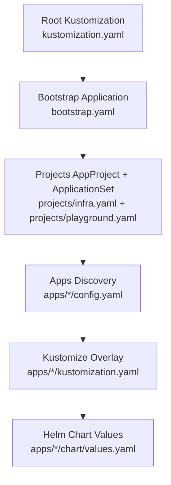
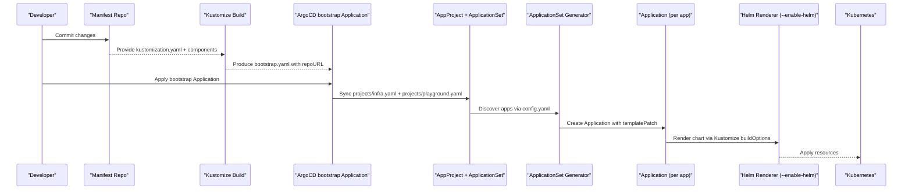
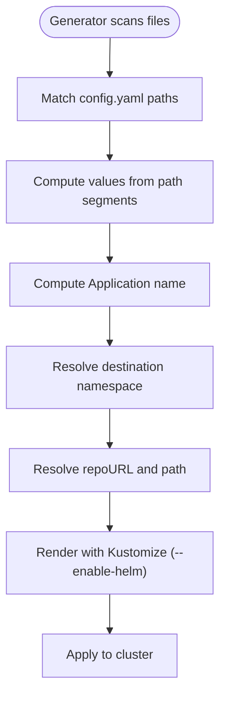
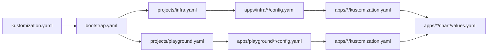

# Developer Reference

<cite>
**Referenced Files in This Document**
- [README.md](file://README.md)
- [bootstrap.yaml](file://bootstrap.yaml)
- [kustomization.yaml](file://kustomization.yaml)
- [opencode.json](file://opencode.json)
- [projects/infra.yaml](file://projects/infra.yaml)
- [projects/playground.yaml](file://projects/playground.yaml)
- [apps/infra/cloudflared/config.yaml](file://apps/infra/cloudflared/config.yaml)
- [apps/infra/cloudflared/kustomization.yaml](file://apps/infra/cloudflared/kustomization.yaml)
- [apps/infra/cloudflared/chart/values.yaml](file://apps/infra/cloudflared/chart/values.yaml)
- [apps/infra/datadog/config.yaml](file://apps/infra/datadog/config.yaml)
- [apps/infra/datadog/kustomization.yaml](file://apps/infra/datadog/kustomization.yaml)
- [apps/infra/datadog/chart/values.yaml](file://apps/infra/datadog/chart/values.yaml)
- [apps/infra/gateway-api/config.yaml](file://apps/infra/gateway-api/config.yaml)
- [apps/infra/gateway-api/kustomization.yaml](file://apps/infra/gateway-api/kustomization.yaml)
- [apps/infra/gateway-api/chart/traefik.yaml](file://apps/infra/gateway-api/chart/traefik.yaml)
- [apps/playground/argocd-ingress/config.yaml](file://apps/playground/argocd-ingress/config.yaml)
- [apps/playground/argocd-ingress/kustomization.yaml](file://apps/playground/argocd-ingress/kustomization.yaml)
- [apps/playground/argocd-ingress/chart/values.yaml](file://apps/playground/argocd-ingress/chart/values.yaml)
- [apps/playground/cert-manager/config.yaml](file://apps/playground/cert-manager/config.yaml)
- [apps/playground/rancher/config.yaml](file://apps/playground/rancher/config.yaml)
- [apps/playground/hello-api/config.yaml](file://apps/playground/hello-api/config.yaml)
</cite>

## Table of Contents
1. [Introduction](#introduction)
2. [Project Structure](#project-structure)
3. [Core Components](#core-components)
4. [Architecture Overview](#architecture-overview)
5. [Detailed Component Analysis](#detailed-component-analysis)
6. [Dependency Analysis](#dependency-analysis)
7. [Performance Considerations](#performance-considerations)
8. [Troubleshooting Guide](#troubleshooting-guide)
9. [Contribution Guidelines](#contribution-guidelines)
10. [Release Procedures](#release-procedures)
11. [Version Compatibility and Migration](#version-compatibility-and-migration)
12. [Conclusion](#conclusion)
13. [Appendices](#appendices)

## Introduction
This Developer Reference documents the GitOps configuration schema, parameter definitions, and interface specifications used across ArgoCD ApplicationSets, Kubernetes resources, and Helm-based applications. It consolidates the configuration patterns for:
- ApplicationSet discovery and templating
- Application-level configuration via config.yaml
- Kustomize overlays and Helm chart values
- Sync waves and ordering guarantees
- Private secrets management and repository URL injection
- Contribution and release processes

It is intended for contributors and advanced users who maintain or extend the cluster manifests and CI/CD pipelines.

## Project Structure
The repository follows a layered GitOps structure:
- Root Kustomize injects repository URLs and produces bootstrap.yaml
- bootstrap.yaml defines the root Application that points to the projects/ directory
- projects/ contains AppProject and ApplicationSet definitions that discover apps via config.yaml files
- apps/ contains per-application folders with config.yaml, kustomization.yaml, and optional chart/ values

**Diagram sources**
- [kustomization.yaml:1-21](file://kustomization.yaml#L1-L21)
- [bootstrap.yaml:1-26](file://bootstrap.yaml#L1-L26)
- [projects/infra.yaml:1-85](file://projects/infra.yaml#L1-L85)
- [projects/playground.yaml:1-90](file://projects/playground.yaml#L1-L90)

**Section sources**
- [README.md:87-118](file://README.md#L87-L118)
- [kustomization.yaml:1-21](file://kustomization.yaml#L1-L21)
- [bootstrap.yaml:1-26](file://bootstrap.yaml#L1-L26)
- [projects/infra.yaml:1-85](file://projects/infra.yaml#L1-L85)
- [projects/playground.yaml:1-90](file://projects/playground.yaml#L1-L90)

## Core Components
This section documents the primary configuration interfaces and schemas used across the repository.

### ApplicationSet Schema and Parameters
ApplicationSet generators and templates define how ArgoCD discovers and renders applications.

Key generator fields:
- repoURL: Source repository URL (placeholder injected by Kustomize)
- revision: Target branch/tag for discovery
- files: Glob pattern to locate config.yaml files
- values: Template values extracted from the discovered path

Template fields:
- name: Application name (computed from project and app folder)
- namespace: Destination namespace (always argocd for Application)
- destination.namespace: Per-app override via config.yaml destNamespace
- destination.server: Kubernetes API server endpoint
- project: AppProject name
- source.repoURL/targetRevision/path: Defaults derived from values
- kustomize.buildOptions: Enable Helm processing (--enable-helm)
- syncPolicy: Automated sync with pruning and self-healing

TemplatePatch fields:
- labels and annotations: Merged from config.yaml into Application metadata
- spec.syncPolicy.syncOptions: Namespace creation and dry-run skipping for playground

**Section sources**
- [projects/infra.yaml:33-45](file://projects/infra.yaml#L33-L45)
- [projects/infra.yaml:46-85](file://projects/infra.yaml#L46-L85)
- [projects/playground.yaml:33-45](file://projects/playground.yaml#L33-L45)
- [projects/playground.yaml:46-90](file://projects/playground.yaml#L46-L90)

### Application config.yaml Schema
Each app contributes a minimal config.yaml to control namespace and sync ordering.

Fields:
- destNamespace: Overrides the default inferred namespace
- annotations: Supports argocd annotations (e.g., sync-wave)
- labels: Optional labels merged into Application metadata via templatePatch

Example reference paths:
- [apps/infra/cloudflared/config.yaml:1-4](file://apps/infra/cloudflared/config.yaml#L1-L4)
- [apps/infra/datadog/config.yaml:1-6](file://apps/infra/datadog/config.yaml#L1-L6)
- [apps/infra/gateway-api/config.yaml:1-6](file://apps/infra/gateway-api/config.yaml#L1-L6)
- [apps/playground/argocd-ingress/config.yaml:1-4](file://apps/playground/argocd-ingress/config.yaml#L1-L4)
- [apps/playground/cert-manager/config.yaml:1-5](file://apps/playground/cert-manager/config.yaml#L1-L5)
- [apps/playground/rancher/config.yaml:1-5](file://apps/playground/rancher/config.yaml#L1-L5)
- [apps/playground/hello-api/config.yaml:1-4](file://apps/playground/hello-api/config.yaml#L1-L4)

**Section sources**
- [README.md:136-143](file://README.md#L136-L143)
- [apps/infra/cloudflared/config.yaml:1-4](file://apps/infra/cloudflared/config.yaml#L1-L4)
- [apps/infra/datadog/config.yaml:1-6](file://apps/infra/datadog/config.yaml#L1-L6)
- [apps/infra/gateway-api/config.yaml:1-6](file://apps/infra/gateway-api/config.yaml#L1-L6)
- [apps/playground/argocd-ingress/config.yaml:1-4](file://apps/playground/argocd-ingress/config.yaml#L1-L4)
- [apps/playground/cert-manager/config.yaml:1-5](file://apps/playground/cert-manager/config.yaml#L1-L5)
- [apps/playground/rancher/config.yaml:1-5](file://apps/playground/rancher/config.yaml#L1-L5)
- [apps/playground/hello-api/config.yaml:1-4](file://apps/playground/hello-api/config.yaml#L1-L4)

### Kustomize Overlay Schema
Kustomization files define namespace scoping and resource composition.

Fields:
- namespace: Sets the overlay’s target namespace
- resources: References chart/ or remote manifests
- helmCharts: Optional Helm chart references (enabled via kustomize buildOptions)

Example reference paths:
- [apps/infra/cloudflared/kustomization.yaml:1-8](file://apps/infra/cloudflared/kustomization.yaml#L1-L8)
- [apps/infra/datadog/kustomization.yaml:1-8](file://apps/infra/datadog/kustomization.yaml#L1-L8)
- [apps/infra/gateway-api/kustomization.yaml:1-9](file://apps/infra/gateway-api/kustomization.yaml#L1-L9)
- [apps/playground/argocd-ingress/kustomization.yaml:1-9](file://apps/playground/argocd-ingress/kustomization.yaml#L1-L9)

**Section sources**
- [apps/infra/cloudflared/kustomization.yaml:1-8](file://apps/infra/cloudflared/kustomization.yaml#L1-L8)
- [apps/infra/datadog/kustomization.yaml:1-8](file://apps/infra/datadog/kustomization.yaml#L1-L8)
- [apps/infra/gateway-api/kustomization.yaml:1-9](file://apps/infra/gateway-api/kustomization.yaml#L1-L9)
- [apps/playground/argocd-ingress/kustomization.yaml:1-9](file://apps/playground/argocd-ingress/kustomization.yaml#L1-L9)

### Helm Chart Values Schema
Chart values configure container images, probes, resources, and feature toggles.

Examples:
- cloudflared: deployment image, args, envFrom secret, resource requests/limits
- datadog: agent/operator configuration, cluster agent, logs/apm/process settings, node tolerations
- argocd-ingress: disables default deployment/service in favor of HTTPRoute-managed ingress

Reference paths:
- [apps/infra/cloudflared/chart/values.yaml:1-40](file://apps/infra/cloudflared/chart/values.yaml#L1-L40)
- [apps/infra/datadog/chart/values.yaml:1-89](file://apps/infra/datadog/chart/values.yaml#L1-L89)
- [apps/playground/argocd-ingress/chart/values.yaml:1-7](file://apps/playground/argocd-ingress/chart/values.yaml#L1-L7)

**Section sources**
- [apps/infra/cloudflared/chart/values.yaml:1-40](file://apps/infra/cloudflared/chart/values.yaml#L1-L40)
- [apps/infra/datadog/chart/values.yaml:1-89](file://apps/infra/datadog/chart/values.yaml#L1-L89)
- [apps/playground/argocd-ingress/chart/values.yaml:1-7](file://apps/playground/argocd-ingress/chart/values.yaml#L1-L7)

### Repository URL Injection and Replacement
Root Kustomization injects repoURL placeholders into bootstrap.yaml and projects/* via a ConfigMap replacement.

Fields:
- components: Adds repo-url component
- replacements: Substitutes Application.spec.source.repoURL from ConfigMap.data.url

Reference paths:
- [kustomization.yaml:4-21](file://kustomization.yaml#L4-L21)
- [bootstrap.yaml:15-18](file://bootstrap.yaml#L15-L18)
- [projects/infra.yaml:35](file://projects/infra.yaml#L35)
- [projects/playground.yaml:35](file://projects/playground.yaml#L35)

**Section sources**
- [kustomization.yaml:1-21](file://kustomization.yaml#L1-L21)
- [bootstrap.yaml:15-18](file://bootstrap.yaml#L15-L18)
- [projects/infra.yaml:35](file://projects/infra.yaml#L35)
- [projects/playground.yaml:35](file://projects/playground.yaml#L35)

## Architecture Overview
The system enforces a deterministic sync order using sync-wave annotations and ArgoCD’s ApplicationSet discovery.

**Diagram sources**
- [README.md:57-86](file://README.md#L57-L86)
- [kustomization.yaml:1-21](file://kustomization.yaml#L1-L21)
- [bootstrap.yaml:1-26](file://bootstrap.yaml#L1-L26)
- [projects/infra.yaml:33-85](file://projects/infra.yaml#L33-L85)
- [projects/playground.yaml:33-90](file://projects/playground.yaml#L33-L90)

## Detailed Component Analysis

### ApplicationSet Generators and Templates
- Generators: Git-based discovery with file globbing for config.yaml
- Template: Computes name, destination namespace, project, repoURL, path, and kustomize buildOptions
- TemplatePatch: Injects labels and annotations from config.yaml into Application metadata

**Diagram sources**
- [projects/infra.yaml:33-85](file://projects/infra.yaml#L33-L85)
- [projects/playground.yaml:33-90](file://projects/playground.yaml#L33-L90)

**Section sources**
- [projects/infra.yaml:33-85](file://projects/infra.yaml#L33-L85)
- [projects/playground.yaml:33-90](file://projects/playground.yaml#L33-L90)

### Application config.yaml Options
- destNamespace: Overrides inferred namespace for the Application’s destination
- annotations: Supports sync-wave and other ArgoCD annotations
- labels: Merged into Application metadata via templatePatch

Reference paths:
- [apps/infra/cloudflared/config.yaml:1-4](file://apps/infra/cloudflared/config.yaml#L1-L4)
- [apps/infra/datadog/config.yaml:1-6](file://apps/infra/datadog/config.yaml#L1-L6)
- [apps/infra/gateway-api/config.yaml:1-6](file://apps/infra/gateway-api/config.yaml#L1-L6)
- [apps/playground/argocd-ingress/config.yaml:1-4](file://apps/playground/argocd-ingress/config.yaml#L1-L4)
- [apps/playground/cert-manager/config.yaml:1-5](file://apps/playground/cert-manager/config.yaml#L1-L5)
- [apps/playground/rancher/config.yaml:1-5](file://apps/playground/rancher/config.yaml#L1-L5)
- [apps/playground/hello-api/config.yaml:1-4](file://apps/playground/hello-api/config.yaml#L1-L4)

**Section sources**
- [README.md:136-143](file://README.md#L136-L143)
- [apps/infra/cloudflared/config.yaml:1-4](file://apps/infra/cloudflared/config.yaml#L1-L4)
- [apps/infra/datadog/config.yaml:1-6](file://apps/infra/datadog/config.yaml#L1-L6)
- [apps/infra/gateway-api/config.yaml:1-6](file://apps/infra/gateway-api/config.yaml#L1-L6)
- [apps/playground/argocd-ingress/config.yaml:1-4](file://apps/playground/argocd-ingress/config.yaml#L1-L4)
- [apps/playground/cert-manager/config.yaml:1-5](file://apps/playground/cert-manager/config.yaml#L1-L5)
- [apps/playground/rancher/config.yaml:1-5](file://apps/playground/rancher/config.yaml#L1-L5)
- [apps/playground/hello-api/config.yaml:1-4](file://apps/playground/hello-api/config.yaml#L1-L4)

### Kustomize Overlays and Helm Rendering
- namespace: Sets the overlay namespace
- resources: Includes chart/ or remote manifests
- buildOptions: Enables Helm rendering via Kustomize

Reference paths:
- [apps/infra/cloudflared/kustomization.yaml:1-8](file://apps/infra/cloudflared/kustomization.yaml#L1-L8)
- [apps/infra/datadog/kustomization.yaml:1-8](file://apps/infra/datadog/kustomization.yaml#L1-L8)
- [apps/infra/gateway-api/kustomization.yaml:1-9](file://apps/infra/gateway-api/kustomization.yaml#L1-L9)
- [apps/playground/argocd-ingress/kustomization.yaml:1-9](file://apps/playground/argocd-ingress/kustomization.yaml#L1-L9)

**Section sources**
- [apps/infra/cloudflared/kustomization.yaml:1-8](file://apps/infra/cloudflared/kustomization.yaml#L1-L8)
- [apps/infra/datadog/kustomization.yaml:1-8](file://apps/infra/datadog/kustomization.yaml#L1-L8)
- [apps/infra/gateway-api/kustomization.yaml:1-9](file://apps/infra/gateway-api/kustomization.yaml#L1-L9)
- [apps/playground/argocd-ingress/kustomization.yaml:1-9](file://apps/playground/argocd-ingress/kustomization.yaml#L1-L9)

### Helm Chart Values Examples
- cloudflared: deployment image, replicas, args, envFrom secret, probes disabled, resource requests/limits
- datadog: agent/operator configuration, cluster agent, logs/apm/process settings, node tolerations
- argocd-ingress: disables default deployment/service to rely on HTTPRoute

Reference paths:
- [apps/infra/cloudflared/chart/values.yaml:1-40](file://apps/infra/cloudflared/chart/values.yaml#L1-L40)
- [apps/infra/datadog/chart/values.yaml:1-89](file://apps/infra/datadog/chart/values.yaml#L1-L89)
- [apps/playground/argocd-ingress/chart/values.yaml:1-7](file://apps/playground/argocd-ingress/chart/values.yaml#L1-L7)

**Section sources**
- [apps/infra/cloudflared/chart/values.yaml:1-40](file://apps/infra/cloudflared/chart/values.yaml#L1-L40)
- [apps/infra/datadog/chart/values.yaml:1-89](file://apps/infra/datadog/chart/values.yaml#L1-L89)
- [apps/playground/argocd-ingress/chart/values.yaml:1-7](file://apps/playground/argocd-ingress/chart/values.yaml#L1-L7)

### Private Secrets Management
Secrets are synchronized from a private repository via a dedicated Application and placed in the appropriate namespaces. This keeps sensitive data out of the public repository.

Reference paths:
- [README.md:160-163](file://README.md#L160-L163)

**Section sources**
- [README.md:160-163](file://README.md#L160-L163)

## Dependency Analysis
The following diagram shows the primary dependencies among configuration components.

**Diagram sources**
- [kustomization.yaml:1-21](file://kustomization.yaml#L1-L21)
- [bootstrap.yaml:1-26](file://bootstrap.yaml#L1-L26)
- [projects/infra.yaml:1-85](file://projects/infra.yaml#L1-L85)
- [projects/playground.yaml:1-90](file://projects/playground.yaml#L1-L90)
- [apps/infra/cloudflared/config.yaml:1-4](file://apps/infra/cloudflared/config.yaml#L1-L4)
- [apps/playground/argocd-ingress/config.yaml:1-4](file://apps/playground/argocd-ingress/config.yaml#L1-L4)
- [apps/infra/cloudflared/kustomization.yaml:1-8](file://apps/infra/cloudflared/kustomization.yaml#L1-L8)
- [apps/playground/argocd-ingress/kustomization.yaml:1-9](file://apps/playground/argocd-ingress/kustomization.yaml#L1-L9)
- [apps/infra/cloudflared/chart/values.yaml:1-40](file://apps/infra/cloudflared/chart/values.yaml#L1-L40)
- [apps/playground/argocd-ingress/chart/values.yaml:1-7](file://apps/playground/argocd-ingress/chart/values.yaml#L1-L7)

**Section sources**
- [kustomization.yaml:1-21](file://kustomization.yaml#L1-L21)
- [bootstrap.yaml:1-26](file://bootstrap.yaml#L1-L26)
- [projects/infra.yaml:1-85](file://projects/infra.yaml#L1-L85)
- [projects/playground.yaml:1-90](file://projects/playground.yaml#L1-L90)
- [apps/infra/cloudflared/config.yaml:1-4](file://apps/infra/cloudflared/config.yaml#L1-L4)
- [apps/playground/argocd-ingress/config.yaml:1-4](file://apps/playground/argocd-ingress/config.yaml#L1-L4)
- [apps/infra/cloudflared/kustomization.yaml:1-8](file://apps/infra/cloudflared/kustomization.yaml#L1-L8)
- [apps/playground/argocd-ingress/kustomization.yaml:1-9](file://apps/playground/argocd-ingress/kustomization.yaml#L1-L9)
- [apps/infra/cloudflared/chart/values.yaml:1-40](file://apps/infra/cloudflared/chart/values.yaml#L1-L40)
- [apps/playground/argocd-ingress/chart/values.yaml:1-7](file://apps/playground/argocd-ingress/chart/values.yaml#L1-L7)

## Performance Considerations
- Use sync-wave to stagger deployments and avoid contention during shared resource creation (e.g., Gateways, Certificates).
- Limit retries and backoff in ApplicationSet syncPolicy to prevent excessive reconciliation loops.
- Prefer OCI Helm charts and enable Helm via Kustomize buildOptions to reduce manual templating overhead.
- Keep probes disabled for long-lived connectors (e.g., cloudflared) to minimize unnecessary health checks.

## Troubleshooting Guide
Common issues and resolutions:
- Application stuck in OutOfSync: Verify sync-wave ordering and that dependent resources (Gateways/Certificates) exist.
- Missing namespace: Ensure CreateNamespace=true is set in syncOptions for the Application or ApplicationSet template.
- Private secrets missing: Confirm the private secrets Application is synced and the Secret exists in the expected namespace.
- Chart rendering failures: Validate Helm values and ensure --enable-helm is present in kustomize buildOptions.

**Section sources**
- [projects/playground.yaml:72-90](file://projects/playground.yaml#L72-L90)
- [apps/infra/gateway-api/config.yaml:1-6](file://apps/infra/gateway-api/config.yaml#L1-L6)
- [README.md:160-163](file://README.md#L160-L163)

## Contribution Guidelines
- All changes must be committed to Git; do not use kubectl to modify cluster state directly.
- Preferred chart sources: OCI Helm charts from the documented OCI registry.
- Use the provided ApplicationSet patterns to add new apps; place config.yaml under apps/infra or apps/playground.
- Keep secrets in a private repository and sync via bootstrap/secrets.yaml.

**Section sources**
- [README.md:120-127](file://README.md#L120-L127)
- [README.md:128-135](file://README.md#L128-L135)
- [README.md:160-163](file://README.md#L160-L163)

## Release Procedures
- Tag and release Helm charts in the upstream repository.
- Update chart references in values.yaml to the released versions.
- Run kustomize build locally to validate rendering before applying.
- Monitor ApplicationSet and Applications for successful sync and OutOfSync status.

[No sources needed since this section provides general guidance]

## Version Compatibility and Migration
- Gateway API: Ensure CRDs are installed before deploying Gateway resources.
- Helm rendering: Use --enable-helm consistently across overlays.
- Sync waves: Maintain backward-compatible wave values to preserve ordering.

**Section sources**
- [apps/infra/gateway-api/kustomization.yaml:1-9](file://apps/infra/gateway-api/kustomization.yaml#L1-L9)
- [projects/infra.yaml:59](file://projects/infra.yaml#L59)
- [projects/playground.yaml:59](file://projects/playground.yaml#L59)

## Conclusion
This reference consolidates the configuration schemas and operational patterns used across ArgoCD, Kustomize, and Helm in this repository. By adhering to the ApplicationSet discovery patterns, config.yaml conventions, and sync-wave ordering, contributors can reliably add, update, and troubleshoot applications while maintaining a secure separation of concerns for secrets and chart sources.

## Appendices

### Reference Tables

#### ApplicationSet Template Fields
- name: Computed from project and app folder
- namespace: argocd
- destination.namespace: From config.yaml destNamespace or app folder
- destination.server: Kubernetes API server
- project: AppProject name
- source.repoURL/targetRevision/path: Derived from values
- kustomize.buildOptions: --enable-helm
- syncPolicy: Automated, prune, selfHeal, retry/backoff

**Section sources**
- [projects/infra.yaml:46-85](file://projects/infra.yaml#L46-L85)
- [projects/playground.yaml:46-90](file://projects/playground.yaml#L46-L90)

#### Application config.yaml Fields
- destNamespace: Overrides destination namespace
- annotations: Supports sync-wave and other ArgoCD annotations
- labels: Merged into Application metadata

**Section sources**
- [README.md:136-143](file://README.md#L136-L143)
- [apps/infra/cloudflared/config.yaml:1-4](file://apps/infra/cloudflared/config.yaml#L1-L4)
- [apps/infra/datadog/config.yaml:1-6](file://apps/infra/datadog/config.yaml#L1-L6)
- [apps/infra/gateway-api/config.yaml:1-6](file://apps/infra/gateway-api/config.yaml#L1-L6)
- [apps/playground/argocd-ingress/config.yaml:1-4](file://apps/playground/argocd-ingress/config.yaml#L1-L4)
- [apps/playground/cert-manager/config.yaml:1-5](file://apps/playground/cert-manager/config.yaml#L1-L5)
- [apps/playground/rancher/config.yaml:1-5](file://apps/playground/rancher/config.yaml#L1-L5)
- [apps/playground/hello-api/config.yaml:1-4](file://apps/playground/hello-api/config.yaml#L1-L4)

#### Kustomize Overlay Fields
- namespace: Target namespace for the overlay
- resources: chart/ or remote manifest references
- helmCharts: Optional Helm chart references

**Section sources**
- [apps/infra/cloudflared/kustomization.yaml:1-8](file://apps/infra/cloudflared/kustomization.yaml#L1-L8)
- [apps/infra/datadog/kustomization.yaml:1-8](file://apps/infra/datadog/kustomization.yaml#L1-L8)
- [apps/infra/gateway-api/kustomization.yaml:1-9](file://apps/infra/gateway-api/kustomization.yaml#L1-L9)
- [apps/playground/argocd-ingress/kustomization.yaml:1-9](file://apps/playground/argocd-ingress/kustomization.yaml#L1-L9)

#### Helm Values Highlights
- cloudflared: deployment image/tag, args, envFrom secret, probes disabled, resource limits
- datadog: agent/operator settings, cluster agent, logs/apm/process, node tolerations
- argocd-ingress: disables default deployment/service

**Section sources**
- [apps/infra/cloudflared/chart/values.yaml:1-40](file://apps/infra/cloudflared/chart/values.yaml#L1-L40)
- [apps/infra/datadog/chart/values.yaml:1-89](file://apps/infra/datadog/chart/values.yaml#L1-L89)
- [apps/playground/argocd-ingress/chart/values.yaml:1-7](file://apps/playground/argocd-ingress/chart/values.yaml#L1-L7)

#### Sync Waves
- AppProjects: -2
- Namespaces: -1
- ApplicationSets, Traefik Deployment: 0
- Secrets from private repo: 1
- Mid-tier resources (Gateway, Datadog): 2
- HTTPRoutes: 3 (applied last)

**Section sources**
- [README.md:76-86](file://README.md#L76-L86)

#### OpenCode Configuration
- Model selection and agent roles for automated assistance
- Permission settings for subagents (e.g., deny edit for SRE/SA)

**Section sources**
- [opencode.json:1-52](file://opencode.json#L1-L52)