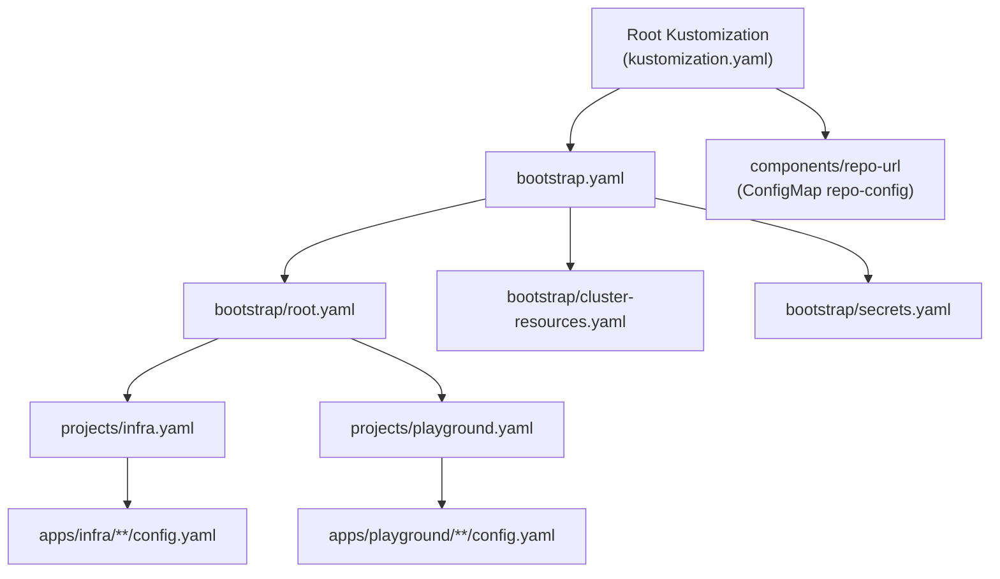
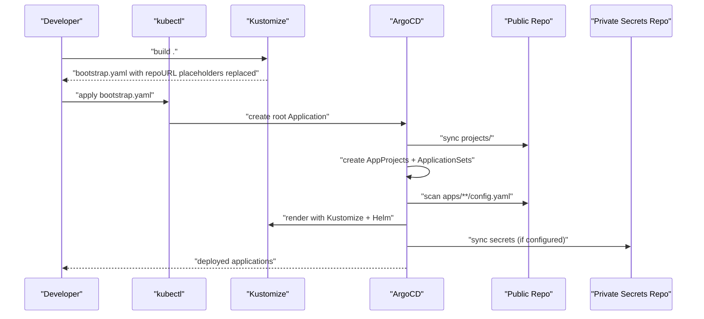
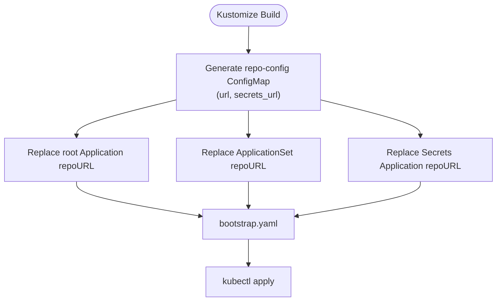
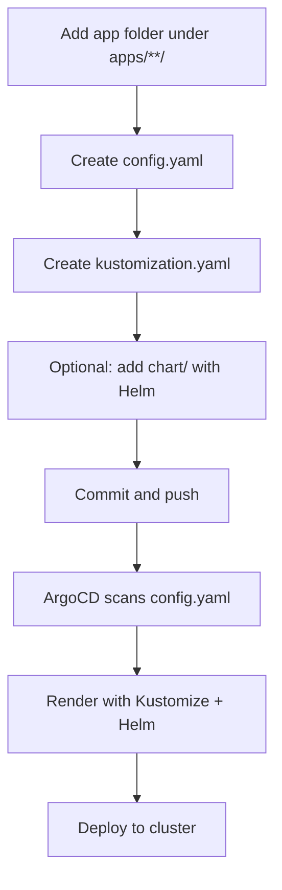
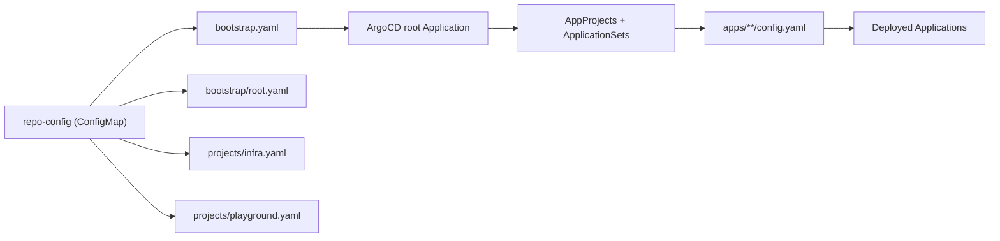

# Getting Started

<cite>
**Referenced Files in This Document**
- [README.md](file://README.md)
- [bootstrap.yaml](file://bootstrap.yaml)
- [kustomization.yaml](file://kustomization.yaml)
- [bootstrap/kustomization.yaml](file://bootstrap/kustomization.yaml)
- [bootstrap/root.yaml](file://bootstrap/root.yaml)
- [bootstrap/secrets.yaml](file://bootstrap/secrets.yaml)
- [components/repo-url/kustomization.yaml](file://components/repo-url/kustomization.yaml)
- [projects/kustomization.yaml](file://projects/kustomization.yaml)
- [projects/infra.yaml](file://projects/infra.yaml)
- [projects/playground.yaml](file://projects/playground.yaml)
- [apps/infra/gateway-api/kustomization.yaml](file://apps/infra/gateway-api/kustomization.yaml)
- [apps/infra/cloudflared/kustomization.yaml](file://apps/infra/cloudflared/kustomization.yaml)
- [apps/playground/argocd-ingress/kustomization.yaml](file://apps/playground/argocd-ingress/kustomization.yaml)
</cite>

## Table of Contents
1. [Introduction](#introduction)
2. [Project Structure](#project-structure)
3. [Core Components](#core-components)
4. [Architecture Overview](#architecture-overview)
5. [Detailed Component Analysis](#detailed-component-analysis)
6. [Dependency Analysis](#dependency-analysis)
7. [Performance Considerations](#performance-considerations)
8. [Troubleshooting Guide](#troubleshooting-guide)
9. [Conclusion](#conclusion)
10. [Appendices](#appendices)

## Introduction
This guide helps new users set up a GitOps-driven Kubernetes infrastructure managed by ArgoCD, Kustomize, and Helm. It covers prerequisites, initial bootstrap, repository configuration, secret management, and deploying your first application. You will learn how the bootstrap chain works, how repository URLs are substituted, and how ArgoCD discovers and deploys applications.

Prerequisites
- A Kubernetes cluster with administrative access
- kubectl installed and configured to connect to your cluster
- kustomize installed
- ArgoCD server installed and reachable
- Basic understanding of GitOps: desired state stored in Git, ArgoCD enforces it on the cluster

Initial setup steps
- Prepare your repositories:
  - Public manifests repository containing this codebase
  - Private secrets repository for sensitive data
- Configure repository URLs centrally so they can be substituted during kustomize build
- Run the bootstrap command to create the root Application and start the bootstrap chain
- Verify ArgoCD sync waves and application deployments

## Project Structure
The repository organizes manifests into layers:
- Root Kustomization builds bootstrap.yaml and injects repository URLs
- Bootstrap layer defines the root Application, cluster resources, and secrets Application
- Projects define AppProjects and ApplicationSets that discover applications
- Apps define individual applications under infra and playground
- Components provide shared configuration (notably repository URL definitions)

**Diagram sources**
- [kustomization.yaml:1-21](file://kustomization.yaml#L1-L21)
- [bootstrap.yaml:1-26](file://bootstrap.yaml#L1-L26)
- [components/repo-url/kustomization.yaml:1-11](file://components/repo-url/kustomization.yaml#L1-L11)
- [bootstrap/root.yaml:1-37](file://bootstrap/root.yaml#L1-L37)
- [projects/infra.yaml:1-85](file://projects/infra.yaml#L1-L85)
- [projects/playground.yaml:1-90](file://projects/playground.yaml#L1-L90)

**Section sources**
- [README.md:87-118](file://README.md#L87-L118)
- [README.md:57-86](file://README.md#L57-L86)

## Core Components
- Root Kustomization: central place to build bootstrap.yaml and inject repository URLs
- Bootstrap layer: root Application, cluster resources, and secrets Application
- Projects: AppProjects and ApplicationSets that scan for app config files
- Apps: individual applications under infra and playground, each with a config.yaml and optional Kustomize/Helm

Key behaviors
- Repository URL substitution via a shared ConfigMap generated by a component
- Sync waves to control order of creation across namespaces and cluster-scoped resources
- ApplicationSet scanning of config.yaml files to render and deploy applications

**Section sources**
- [README.md:68-75](file://README.md#L68-L75)
- [README.md:76-86](file://README.md#L76-L86)
- [README.md:120-127](file://README.md#L120-L127)

## Architecture Overview
The bootstrap chain starts with building bootstrap.yaml and applying it to the cluster. The root Application points to the projects directory, which defines AppProjects and ApplicationSets. These discover applications under apps/**/config.yaml, render them with Kustomize (including Helm), and deploy them.

**Diagram sources**
- [README.md:59-75](file://README.md#L59-L75)
- [kustomization.yaml:10-21](file://kustomization.yaml#L10-L21)
- [bootstrap/kustomization.yaml:12-38](file://bootstrap/kustomization.yaml#L12-L38)
- [projects/kustomization.yaml:11-22](file://projects/kustomization.yaml#L11-L22)
- [bootstrap/root.yaml:15-18](file://bootstrap/root.yaml#L15-L18)
- [bootstrap/secrets.yaml:12-13](file://bootstrap/secrets.yaml#L12-L13)

## Detailed Component Analysis

### Bootstrap Chain and Initial Setup
- Build and apply the root manifest:
  - Build the root Kustomization to produce bootstrap.yaml with repository URLs injected
  - Apply the resulting manifest to create the root Application
- Bootstrap layer:
  - Root Application points to projects/
  - Cluster resources Application ensures namespaces and shared cluster objects exist early
  - Secrets Application syncs a private repository for sensitive data
- Projects layer:
  - AppProjects define per-project permissions and scoping
  - ApplicationSets scan for config.yaml files and render applications with Kustomize/Helm

Step-by-step bootstrap
1. Build the root Kustomization to inject repository URLs
2. Apply the built manifest to install the root Application
3. ArgoCD syncs projects/, creating AppProjects and ApplicationSets
4. ApplicationSets discover apps/**/config.yaml and render them
5. Optional: configure secrets via bootstrap/secrets.yaml

Verification
- Check ArgoCD UI for the root Application and downstream Applications
- Confirm sync waves align with expectations
- Validate that namespaces and cluster resources are created before dependent apps

**Section sources**
- [README.md:59-75](file://README.md#L59-L75)
- [README.md:76-86](file://README.md#L76-L86)
- [bootstrap.yaml:15-18](file://bootstrap.yaml#L15-L18)
- [bootstrap/root.yaml:15-18](file://bootstrap/root.yaml#L15-L18)
- [bootstrap/secrets.yaml:12-13](file://bootstrap/secrets.yaml#L12-L13)
- [projects/infra.yaml:34-45](file://projects/infra.yaml#L34-L45)
- [projects/playground.yaml:34-45](file://projects/playground.yaml#L34-L45)

### Repository URL Substitution
Centralized repository URLs are defined in a component and injected into multiple targets:
- Root Application and ApplicationSets receive the public repo URL
- Secrets Application receives the private repo URL
- The same mechanism runs at root, bootstrap, and projects levels

How it works
- A component generates a ConfigMap named repo-config with url and secrets_url
- Kustomize replacements update repoURL fields in Applications and ApplicationSets
- The root Kustomization injects the public repo URL into bootstrap.yaml
- The bootstrap Kustomization injects the public and private repo URLs into bootstrap resources

**Diagram sources**
- [components/repo-url/kustomization.yaml:4-10](file://components/repo-url/kustomization.yaml#L4-L10)
- [kustomization.yaml:10-21](file://kustomization.yaml#L10-L21)
- [bootstrap/kustomization.yaml:12-38](file://bootstrap/kustomization.yaml#L12-L38)
- [projects/kustomization.yaml:11-22](file://projects/kustomization.yaml#L11-L22)

**Section sources**
- [components/repo-url/kustomization.yaml:4-10](file://components/repo-url/kustomization.yaml#L4-L10)
- [kustomization.yaml:10-21](file://kustomization.yaml#L10-L21)
- [bootstrap/kustomization.yaml:12-38](file://bootstrap/kustomization.yaml#L12-L38)
- [projects/kustomization.yaml:11-22](file://projects/kustomization.yaml#L11-L22)

### Secret Management
Secrets are kept in a separate private repository and synchronized via ArgoCD:
- Configure the private repo URL in the component
- The bootstrap/secrets.yaml Application syncs the private repository
- Secrets are applied with a sync wave to ensure they are available before dependent apps

Best practices
- Keep secrets out of the public repository
- Use ArgoCD’s automated sync with pruning and self-healing
- Manage sensitive data through the private repository and avoid embedding credentials in public manifests

**Section sources**
- [README.md:160-163](file://README.md#L160-L163)
- [bootstrap/secrets.yaml:12-13](file://bootstrap/secrets.yaml#L12-L13)
- [components/repo-url/kustomization.yaml:9-10](file://components/repo-url/kustomization.yaml#L9-L10)

### First Application Deployment
To add a new application:
1. Create a folder under apps/infra/<name>/ or apps/playground/<name>/
2. Add a config.yaml with optional destination namespace and sync wave annotations
3. Add a Kustomization and optional chart/ directory
4. If using Helm, reference charts via Kustomize helmCharts blocks with --enable-helm
5. Commit and push; ArgoCD discovers and syncs automatically

Example applications
- apps/infra/gateway-api: installs Gateway API CRDs and Traefik via Kustomize
- apps/infra/cloudflared: Cloudflare tunnel connector
- apps/playground/argocd-ingress: exposes ArgoCD UI via HTTPRoute

**Diagram sources**
- [README.md:128-134](file://README.md#L128-L134)
- [apps/infra/gateway-api/kustomization.yaml:1-9](file://apps/infra/gateway-api/kustomization.yaml#L1-L9)
- [apps/infra/cloudflared/kustomization.yaml:1-8](file://apps/infra/cloudflared/kustomization.yaml#L1-L8)
- [apps/playground/argocd-ingress/kustomization.yaml:1-9](file://apps/playground/argocd-ingress/kustomization.yaml#L1-L9)

**Section sources**
- [README.md:128-134](file://README.md#L128-L134)
- [README.md:148-158](file://README.md#L148-L158)

## Dependency Analysis
The bootstrap chain depends on:
- Central repository URL configuration
- Correct sync waves to ensure dependencies resolve in order
- ApplicationSet scanning to discover and render applications

**Diagram sources**
- [components/repo-url/kustomization.yaml:4-10](file://components/repo-url/kustomization.yaml#L4-L10)
- [kustomization.yaml:10-21](file://kustomization.yaml#L10-L21)
- [bootstrap/root.yaml:15-18](file://bootstrap/root.yaml#L15-L18)
- [projects/infra.yaml:34-45](file://projects/infra.yaml#L34-L45)
- [projects/playground.yaml:34-45](file://projects/playground.yaml#L34-L45)

**Section sources**
- [README.md:76-86](file://README.md#L76-L86)
- [README.md:120-127](file://README.md#L120-L127)

## Performance Considerations
- Use sync waves to minimize conflicts and race conditions
- Prefer OCI Helm charts and centralized chart repositories to reduce build overhead
- Limit ApplicationSet scanning scope to necessary paths to improve discovery performance
- Enable pruning and self-healing judiciously to maintain a clean state

## Troubleshooting Guide
Common issues and resolutions
- Repository URL placeholder not replaced
  - Ensure the component generating repo-config is included and the replacements are present in kustomization.yaml files at root, bootstrap, and projects levels
  - Verify the ConfigMap literals for url and secrets_url are correct
- Application stuck in OutOfSync
  - Check ApplicationSet scanning for config.yaml and rendered Kustomize output
  - Review sync waves and dependencies (e.g., namespaces created before apps)
- Secrets not applied
  - Confirm the private repo URL is configured and accessible
  - Verify the Secrets Application is enabled and synced with the correct path
- ArgoCD UI not reachable
  - Confirm ingress exposure via HTTPRoute and that Gateway exists before HTTPRoutes
  - Validate hostnames and TLS configuration

Operational checks
- Inspect ArgoCD Applications and ApplicationSets for errors
- Use kubectl describe on Applications and ApplicationSets
- Review ArgoCD logs and events for sync failures

**Section sources**
- [README.md:160-163](file://README.md#L160-L163)
- [README.md:76-86](file://README.md#L76-L86)
- [README.md:120-127](file://README.md#L120-L127)

## Conclusion
You now have the essentials to bootstrap a GitOps-managed Kubernetes cluster with ArgoCD, Kustomize, and Helm. By centralizing repository URLs, controlling sync waves, and leveraging ApplicationSets, you can reliably deploy and manage infrastructure and applications from Git. Continue by adding your first application under apps/infra or apps/playground and validating the deployment through ArgoCD.

## Appendices

### Initial Setup Checklist
- Install and configure kubectl and kustomize
- Install ArgoCD and ensure access
- Fork or prepare public and private repositories
- Configure repo-config with correct URLs
- Build and apply bootstrap.yaml
- Monitor ArgoCD for successful sync of root Application and downstream resources

### Practical Examples
- Adding an application under apps/infra/myapp:
  - Create config.yaml with destNamespace if needed
  - Add kustomization.yaml and optional chart/
  - Commit and push
- Verifying deployment:
  - Check ArgoCD for the new Application
  - Confirm the workload pods are Running
  - Validate network connectivity via HTTPRoute if applicable