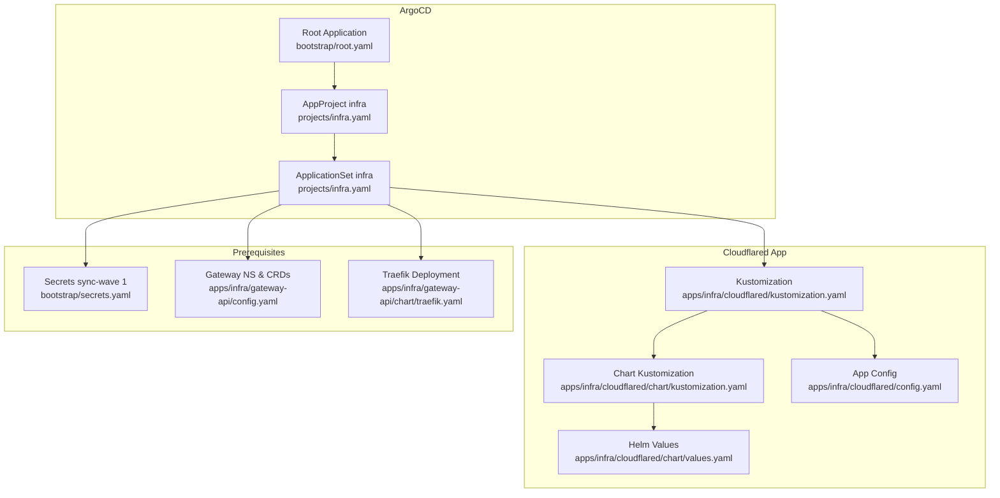
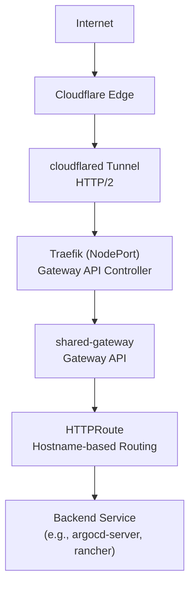
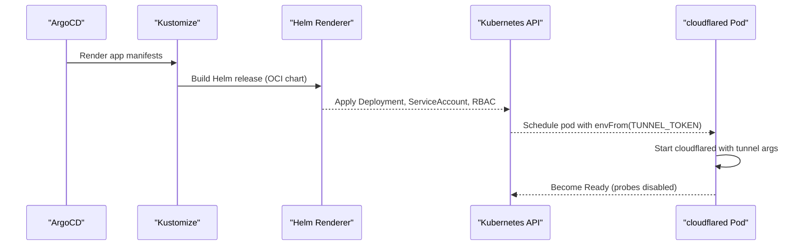
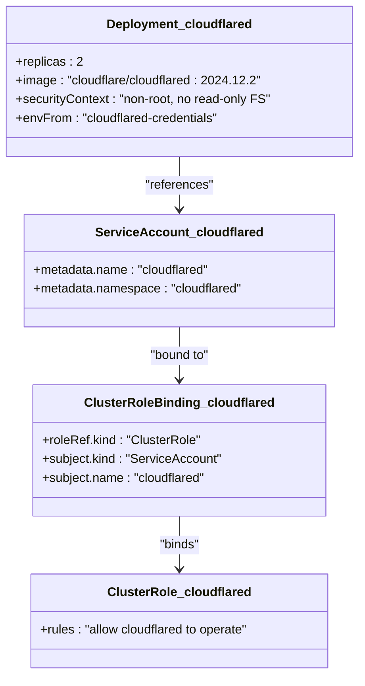
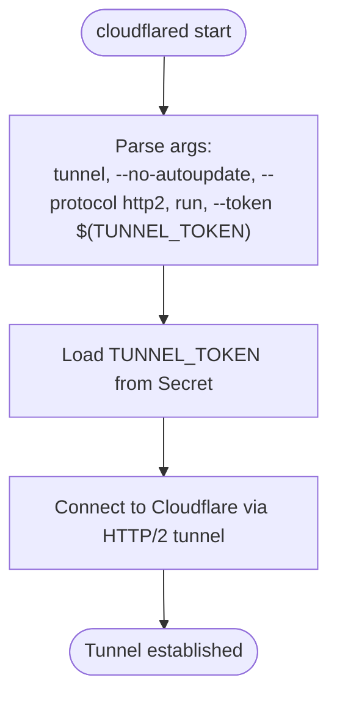
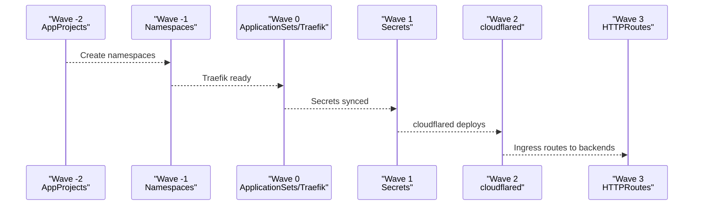
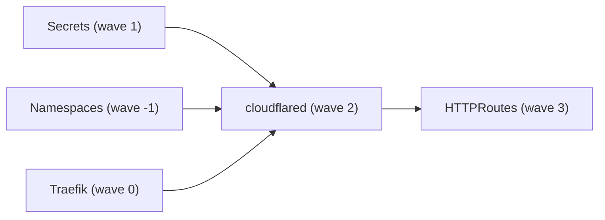

# Cloudflare Tunnel

<cite>
**Referenced Files in This Document**
- [README.md](file://README.md)
- [cloudflared-kustomization.yaml](file://apps/infra/cloudflared/kustomization.yaml)
- [cloudflared-chart-kustomization.yaml](file://apps/infra/cloudflared/chart/kustomization.yaml)
- [cloudflared-values.yaml](file://apps/infra/cloudflared/chart/values.yaml)
- [cloudflared-config.yaml](file://apps/infra/cloudflared/config.yaml)
- [secrets-bootstrap.yaml](file://bootstrap/secrets.yaml)
- [infra-project.yaml](file://projects/infra.yaml)
- [gateway-traefik-deployment.yaml](file://apps/infra/gateway-api/chart/traefik.yaml)
- [gateway-config.yaml](file://apps/infra/gateway-api/config.yaml)
- [argo-cd-guide.md](file://guide/argocd/argo_cd.md)
- [k8s-manifest-secrets-guide.md](file://guide/k8s_manifest_secrets/argo_cd.md)
</cite>

## Table of Contents
1. [Introduction](#introduction)
2. [Project Structure](#project-structure)
3. [Core Components](#core-components)
4. [Architecture Overview](#architecture-overview)
5. [Detailed Component Analysis](#detailed-component-analysis)
6. [Dependency Analysis](#dependency-analysis)
7. [Performance Considerations](#performance-considerations)
8. [Troubleshooting Guide](#troubleshooting-guide)
9. [Conclusion](#conclusion)
10. [Appendices](#appendices)

## Introduction
This document explains how Cloudflare Tunnel (cloudflared) is deployed and configured in this GitOps repository. It covers the cloudflared pod setup, authentication with Cloudflare via a tunnel token, and how the tunnel integrates with the cluster ingress stack. It also documents the sync wave ordering (wave 2), namespace isolation, and how internal services are exposed through Cloudflare tunnels. Guidance is included for certificate management, DNS record updates, health checks, and production considerations.

## Project Structure
The cloudflared deployment is defined as a Helm-based application under the infrastructure project. It is orchestrated by ArgoCD via ApplicationSets and Kustomize, with strict sync ordering to ensure prerequisites exist before cloudflared starts.

**Diagram sources**
- [README.md:76-86](file://README.md#L76-L86)
- [cloudflared-kustomization.yaml:1-8](file://apps/infra/cloudflared/kustomization.yaml#L1-L8)
- [cloudflared-chart-kustomization.yaml:1-11](file://apps/infra/cloudflared/chart/kustomization.yaml#L1-L11)
- [cloudflared-values.yaml:1-40](file://apps/infra/cloudflared/chart/values.yaml#L1-L40)
- [cloudflared-config.yaml:1-4](file://apps/infra/cloudflared/config.yaml#L1-L4)
- [secrets-bootstrap.yaml:1-24](file://bootstrap/secrets.yaml#L1-L24)
- [gateway-config.yaml:1-5](file://apps/infra/gateway-api/config.yaml#L1-L5)
- [gateway-traefik-deployment.yaml:1-95](file://apps/infra/gateway-api/chart/traefik.yaml#L1-L95)

**Section sources**
- [README.md:76-86](file://README.md#L76-L86)
- [cloudflared-kustomization.yaml:1-8](file://apps/infra/cloudflared/kustomization.yaml#L1-L8)
- [cloudflared-chart-kustomization.yaml:1-11](file://apps/infra/cloudflared/chart/kustomization.yaml#L1-L11)
- [cloudflared-values.yaml:1-40](file://apps/infra/cloudflared/chart/values.yaml#L1-L40)
- [cloudflared-config.yaml:1-4](file://apps/infra/cloudflared/config.yaml#L1-L4)
- [secrets-bootstrap.yaml:1-24](file://bootstrap/secrets.yaml#L1-L24)
- [gateway-config.yaml:1-5](file://apps/infra/gateway-api/config.yaml#L1-L5)
- [gateway-traefik-deployment.yaml:1-95](file://apps/infra/gateway-api/chart/traefik.yaml#L1-L95)

## Core Components
- cloudflared Helm release: Managed as a Helm chart via Kustomize, deployed into the cloudflared namespace with two replicas.
- Authentication: Tunnel token supplied via a Kubernetes Secret mounted into the pod via envFrom.
- Ingress integration: cloudflared forwards tunnel traffic to the cluster ingress stack (Traefik + Gateway API), which routes to backend Services.
- Sync ordering: cloudflared runs at wave 2, after namespaces and secrets exist and before HTTPRoutes are applied.

Key implementation references:
- Release definition and namespace: [cloudflared-chart-kustomization.yaml:4-10](file://apps/infra/cloudflared/chart/kustomization.yaml#L4-L10)
- Pod configuration and token injection: [cloudflared-values.yaml:3-39](file://apps/infra/cloudflared/chart/values.yaml#L3-L39)
- App-level sync wave: [cloudflared-config.yaml:2-3](file://apps/infra/cloudflared/config.yaml#L2-L3)
- Secret lifecycle (sync-wave 1): [secrets-bootstrap.yaml:6-7](file://bootstrap/secrets.yaml#L6-L7)
- Namespace creation (sync-wave -1): [infra-project.yaml:6](file://projects/infra.yaml#L6)

**Section sources**
- [cloudflared-chart-kustomization.yaml:4-10](file://apps/infra/cloudflared/chart/kustomization.yaml#L4-L10)
- [cloudflared-values.yaml:3-39](file://apps/infra/cloudflared/chart/values.yaml#L3-L39)
- [cloudflared-config.yaml:2-3](file://apps/infra/cloudflared/config.yaml#L2-L3)
- [secrets-bootstrap.yaml:6-7](file://bootstrap/secrets.yaml#L6-L7)
- [infra-project.yaml:6](file://projects/infra.yaml#L6)

## Architecture Overview
The external traffic flow leverages Cloudflare’s global network and a persistent HTTP/2 tunnel to reach the cluster ingress stack. The tunnel is established by cloudflared inside the cluster, which decapsulates Cloudflare traffic and forwards it to Traefik. Traefik, acting as a Gateway API controller, routes traffic to backend Services according to Gateway and HTTPRoute resources.

**Diagram sources**
- [README.md:5-36](file://README.md#L5-L36)
- [README.md:38-47](file://README.md#L38-L47)
- [gateway-traefik-deployment.yaml:56-95](file://apps/infra/gateway-api/chart/traefik.yaml#L56-L95)

**Section sources**
- [README.md:5-36](file://README.md#L5-L36)
- [README.md:38-47](file://README.md#L38-L47)
- [gateway-traefik-deployment.yaml:56-95](file://apps/infra/gateway-api/chart/traefik.yaml#L56-L95)

## Detailed Component Analysis

### cloudflared Deployment and Authentication
- Helm release: The cloudflared Helm chart is fetched from an OCI registry and released into the cloudflared namespace with a values file.
- Pod arguments: The cloudflared command includes tunnel mode, protocol selection, and token-based authentication.
- Token injection: The tunnel token is provided via a Kubernetes Secret mounted through envFrom.
- Probes: Liveness and readiness probes are disabled in the current configuration.

**Diagram sources**
- [cloudflared-chart-kustomization.yaml:4-10](file://apps/infra/cloudflared/chart/kustomization.yaml#L4-L10)
- [cloudflared-values.yaml:11-21](file://apps/infra/cloudflared/chart/values.yaml#L11-L21)

**Section sources**
- [cloudflared-chart-kustomization.yaml:4-10](file://apps/infra/cloudflared/chart/kustomization.yaml#L4-L10)
- [cloudflared-values.yaml:11-21](file://apps/infra/cloudflared/chart/values.yaml#L11-L21)

### RBAC, Service Accounts, and Namespace Isolation
- Namespace: The cloudflared app targets the cloudflared namespace via Kustomization.
- ServiceAccount and RBAC: The Helm chart provisions a ServiceAccount and ClusterRole/ClusterRoleBinding for cloudflared. The values file sets the container security context and resource limits.
- Namespace isolation: The cloudflared namespace is created by earlier sync waves, ensuring the app deploys in a dedicated namespace.

**Diagram sources**
- [cloudflared-values.yaml:3-39](file://apps/infra/cloudflared/chart/values.yaml#L3-L39)
- [cloudflared-kustomization.yaml:4](file://apps/infra/cloudflared/kustomization.yaml#L4)

**Section sources**
- [cloudflared-values.yaml:3-39](file://apps/infra/cloudflared/chart/values.yaml#L3-L39)
- [cloudflared-kustomization.yaml:4](file://apps/infra/cloudflared/kustomization.yaml#L4)

### Tunnel Establishment and Secure Tunnel Creation
- Mode: cloudflared runs in tunnel mode with HTTP/2 protocol and auto-update disabled.
- Token: The tunnel token is provided via a Secret mounted into the pod.
- Service exposure: No Kubernetes Service is created for cloudflared; the tunnel handles external connectivity.

**Diagram sources**
- [cloudflared-values.yaml:11-18](file://apps/infra/cloudflared/chart/values.yaml#L11-L18)

**Section sources**
- [cloudflared-values.yaml:11-18](file://apps/infra/cloudflared/chart/values.yaml#L11-L18)

### Network Policy and Outbound Connectivity
- Outbound egress: The cloudflared pod connects to Cloudflare’s edge IPs over HTTP/2. Ensure egress policies allow outbound TCP to Cloudflare’s edge IP ranges.
- DNS resolution: The pod relies on cluster DNS to resolve Cloudflare hostnames. Verify CoreDNS or upstream resolvers are reachable.
- In-cluster routing: After tunnel decapsulation, traffic is routed to Traefik and then to backend Services via Gateway API.

Note: Specific NetworkPolicy resources are not present in the referenced cloudflared manifests. If you require egress restrictions, define a NetworkPolicy in the cloudflared namespace to allow egress to Cloudflare’s edge IPs and DNS servers.

**Section sources**
- [README.md:42-47](file://README.md#L42-L47)
- [cloudflared-values.yaml:23-26](file://apps/infra/cloudflared/chart/values.yaml#L23-L26)

### Sync Wave Ordering and Namespace Isolation
- Sync order: cloudflared runs at wave 2, after namespaces (wave -1) and secrets (wave 1), and before HTTPRoutes (wave 3).
- Namespace creation: The infra AppProject defines sync-wave -2 for AppProjects, and namespaces are created by cluster-resources with wave -1.
- App placement: The cloudflared ApplicationSet discovers apps via config.yaml and places them into the cloudflared namespace.

**Diagram sources**
- [README.md:76-86](file://README.md#L76-L86)
- [infra-project.yaml:6](file://projects/infra.yaml#L6)
- [secrets-bootstrap.yaml:7](file://bootstrap/secrets.yaml#L7)
- [cloudflared-config.yaml:3](file://apps/infra/cloudflared/config.yaml#L3)

**Section sources**
- [README.md:76-86](file://README.md#L76-L86)
- [infra-project.yaml:6](file://projects/infra.yaml#L6)
- [secrets-bootstrap.yaml:7](file://bootstrap/secrets.yaml#L7)
- [cloudflared-config.yaml:3](file://apps/infra/cloudflared/config.yaml#L3)

### Exposing Internal Services via Cloudflare Tunnels
- HTTP tunnel: Configure HTTPRoute resources to route traffic to backend Services. The ingress stack (Traefik + Gateway API) handles hostname-based routing.
- TCP tunnel: For TCP services, configure TCPRoute resources similarly. The ingress stack must expose appropriate entry points and forward traffic to backend Services.
- TLS termination: TLS is terminated at Cloudflare; internal traffic can use plain HTTP to backend Services. Alternatively, enable TLS between Cloudflare and the cluster if required.

References:
- Ingress stack and routing: [README.md:38-47](file://README.md#L38-L47)
- Traefik as Gateway API controller: [gateway-traefik-deployment.yaml:56-95](file://apps/infra/gateway-api/chart/traefik.yaml#L56-L95)

**Section sources**
- [README.md:38-47](file://README.md#L38-L47)
- [gateway-traefik-deployment.yaml:56-95](file://apps/infra/gateway-api/chart/traefik.yaml#L56-L95)

### Certificate Management and Automatic DNS Records
- Certificates: TLS certificates for external domains are managed externally (e.g., via cert-manager in playground). The cloudflared tunnel terminates TLS at Cloudflare.
- DNS records: Cloudflare automatically manages DNS records for the tunnel. Ensure the tunnel token grants the necessary permissions for DNS updates.

References:
- External certificate management: [README.md:156](file://README.md#L156)
- Tunnel token provisioning: [k8s-manifest-secrets-guide.md:8-18](file://guide/k8s_manifest_secrets/argo_cd.md#L8-L18)

**Section sources**
- [README.md:156](file://README.md#L156)
- [k8s-manifest-secrets-guide.md:8-18](file://guide/k8s_manifest_secrets/argo_cd.md#L8-L18)

### Health Checks
- Pod liveness/readiness: Disabled in the current configuration. If needed, enable probes to ensure restarts on failure.
- Tunnel health: Monitor cloudflared logs and metrics to detect tunnel disconnections or errors.

References:
- Probe configuration: [cloudflared-values.yaml:23-26](file://apps/infra/cloudflared/chart/values.yaml#L23-L26)

**Section sources**
- [cloudflared-values.yaml:23-26](file://apps/infra/cloudflared/chart/values.yaml#L23-L26)

## Dependency Analysis
cloudflared depends on:
- Namespace existence (wave -1)
- Secrets availability (wave 1)
- Gateway API CRDs and Traefik (wave 0)
- HTTPRoutes (wave 3) for final routing

**Diagram sources**
- [README.md:76-86](file://README.md#L76-L86)
- [secrets-bootstrap.yaml:7](file://bootstrap/secrets.yaml#L7)
- [infra-project.yaml:6](file://projects/infra.yaml#L6)
- [cloudflared-config.yaml:3](file://apps/infra/cloudflared/config.yaml#L3)

**Section sources**
- [README.md:76-86](file://README.md#L76-L86)
- [secrets-bootstrap.yaml:7](file://bootstrap/secrets.yaml#L7)
- [infra-project.yaml:6](file://projects/infra.yaml#L6)
- [cloudflared-config.yaml:3](file://apps/infra/cloudflared/config.yaml#L3)

## Performance Considerations
- Replicas: Two cloudflared replicas provide high availability for the tunnel.
- Resource limits: CPU and memory requests/limits are modest; adjust based on observed traffic volume.
- Protocol: HTTP/2 reduces overhead for long-lived connections.
- Egress optimization: Ensure outbound connectivity to Cloudflare is not throttled by network policies.

**Section sources**
- [cloudflared-values.yaml:5, 27-33](file://apps/infra/cloudflared/chart/values.yaml#L5,L27-L33)

## Troubleshooting Guide
- Tunnel token issues:
  - Confirm the Secret exists in the cloudflared namespace and contains the expected key.
  - Reference: [k8s-manifest-secrets-guide.md:8-18](file://guide/k8s_manifest_secrets/argo_cd.md#L8-L18)
- Sync order problems:
  - Verify cloudflared runs at wave 2 and HTTPRoutes at wave 3.
  - Reference: [README.md:76-86](file://README.md#L76-L86)
- Missing namespaces:
  - Ensure cluster-resources with wave -1 created the cloudflared namespace.
  - Reference: [infra-project.yaml:6](file://projects/infra.yaml#L6)
- Network connectivity:
  - Check egress to Cloudflare’s edge IPs and DNS resolution.
  - Reference: [README.md:42-47](file://README.md#L42-L47)
- Probe-related restarts:
  - If enabling probes, ensure thresholds align with tunnel startup time.
  - Reference: [cloudflared-values.yaml:23-26](file://apps/infra/cloudflared/chart/values.yaml#L23-L26)

**Section sources**
- [k8s-manifest-secrets-guide.md:8-18](file://guide/k8s_manifest_secrets/argo_cd.md#L8-L18)
- [README.md:76-86](file://README.md#L76-L86)
- [infra-project.yaml:6](file://projects/infra.yaml#L6)
- [README.md:42-47](file://README.md#L42-L47)
- [cloudflared-values.yaml:23-26](file://apps/infra/cloudflared/chart/values.yaml#L23-L26)

## Conclusion
The cloudflared deployment in this repository follows a GitOps-first approach with strict sync ordering, dedicated namespace isolation, and seamless integration with the Gateway API-based ingress stack. Authentication is handled via a securely managed tunnel token, and the tunnel operates over HTTP/2 to Cloudflare’s edge. For production, monitor tunnel health, tune resource allocations, and ensure egress policies permit connectivity to Cloudflare while maintaining DNS resolution.

## Appendices
- ArgoCD installation and bootstrap workflow: [argo-cd-guide.md:1-34](file://guide/argocd/argo_cd.md#L1-L34)
- Secret management pattern: [k8s-manifest-secrets-guide.md:1-46](file://guide/k8s_manifest_secrets/argo_cd.md#L1-L46)