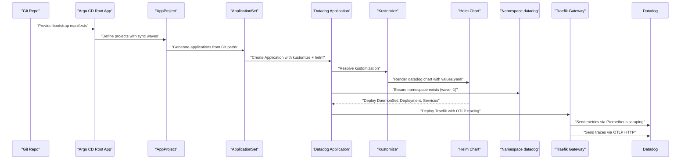
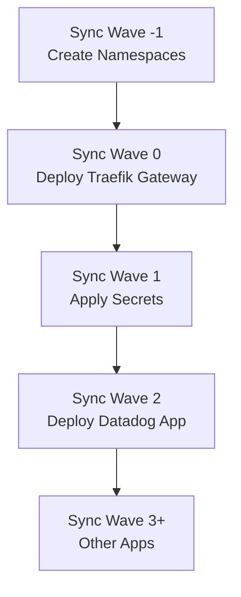
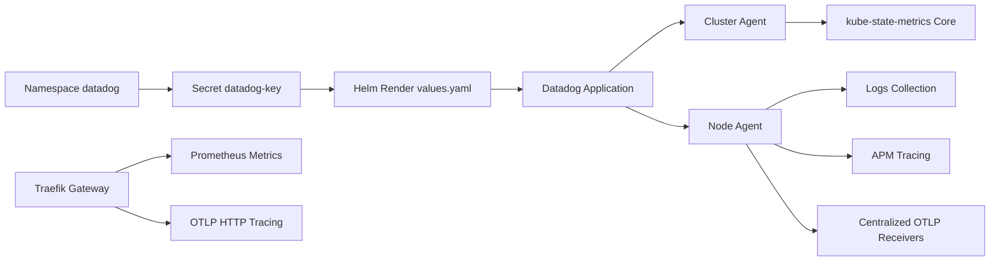

# Datadog Monitoring Agent

<cite>
**Referenced Files in This Document**
- [values.yaml](file://apps/infra/datadog/chart/values.yaml)
- [config.yaml](file://apps/infra/datadog/config.yaml)
- [kustomization.yaml](file://apps/infra/datadog/chart/kustomization.yaml)
- [kustomization.yaml](file://apps/infra/datadog/kustomization.yaml)
- [root.yaml](file://bootstrap/root.yaml)
- [kustomization.yaml](file://bootstrap/kustomization.yaml)
- [infra.yaml](file://projects/infra.yaml)
- [namespace.yaml](file://cluster-resources/default/namespace.yaml)
- [traefik-static.yaml](file://apps/infra/gateway-api/chart/traefik-static.yaml)
- [traefik.yaml](file://apps/infra/gateway-api/chart/traefik.yaml)
- [README.md](file://guide/5. datadog_integration/README.md)
</cite>

## Update Summary
**Changes Made**
- Added comprehensive Datadog Integration Guide covering Logs, Metrics, and Traces integration with Traefik
- Updated OTLP receiver configuration documentation to reflect centralized Helm values.yaml configuration under datadog.otlp.receiver.protocols section
- Enhanced OpenTelemetry Protocol section with new configuration syntax and benefits
- Added detailed configuration examples for Traefik access logs, Prometheus metrics, and OTLP tracing
- Included troubleshooting procedures for Datadog Agent status verification
- Updated architecture diagrams to show new centralized OTLP configuration approach
- Enhanced dependency analysis to reflect improved OTLP receiver management

## Table of Contents
1. [Introduction](#introduction)
2. [Project Structure](#project-structure)
3. [Core Components](#core-components)
4. [Architecture Overview](#architecture-overview)
5. [Detailed Component Analysis](#detailed-component-analysis)
6. [Dependency Analysis](#dependency-analysis)
7. [Performance Considerations](#performance-considerations)
8. [Troubleshooting Guide](#troubleshooting-guide)
9. [Conclusion](#conclusion)
10. [Appendices](#appendices)

## Introduction
This document explains the Datadog monitoring agent deployment and configuration in this Kubernetes manifest repository. It covers installation via Helm, cluster agent setup, APM instrumentation, metric collection strategies, and integration with Kubernetes monitoring. The configuration now includes comprehensive OpenTelemetry Protocol (OTLP) support with centralized configuration through Helm values.yaml, expanded Prometheus scraping capabilities for Traefik metrics collection, and integration with Kubernetes monitoring. It also documents sync wave ordering and dependency management with other infrastructure components, and provides guidance for custom metrics, logs, traces, monitors, dashboards, notebooks, troubleshooting, performance impact mitigation, and cost optimization for large-scale deployments.

**Updated**: Added comprehensive Datadog Integration Guide covering Logs, Metrics, and Traces integration with Traefik, including detailed configuration examples and troubleshooting procedures.

## Project Structure
The Datadog stack is provisioned as a Helm-based Application managed by Argo CD. The deployment pipeline is orchestrated through Kustomize and ApplicationSets, ensuring predictable ordering across namespaces and components. The system now includes integrated Traefik gateway with OpenTelemetry tracing and Prometheus metrics scraping.

Key elements:
- Datadog Helm chart configured under apps/infra/datadog/chart
- Argo CD ApplicationSet and AppProject definitions under projects
- Bootstrap configuration wiring repo URLs and enabling Helm support
- Cluster namespaces created with explicit sync waves
- Traefik gateway with integrated OpenTelemetry tracing and Prometheus metrics

```mermaid
graph TB
subgraph "Bootstrap"
ROOT["root.yaml"]
BOOT_K["bootstrap/kustomization.yaml"]
END
subgraph "Projects"
INFRA_YAML["projects/infra.yaml"]
END
subgraph "Datadog App"
DATADOG_K["apps/infra/datadog/kustomization.yaml"]
CHART_K["apps/infra/datadog/chart/kustomization.yaml"]
VALUES["apps/infra/datadog/chart/values.yaml"]
CONFIG["apps/infra/datadog/config.yaml"]
END
subgraph "Traefik Gateway"
TRAEFIK_DEPLOYMENT["apps/infra/gateway-api/chart/traefik.yaml"]
TRAEFIK_STATIC["apps/infra/gateway-api/chart/traefik-static.yaml"]
END
subgraph "Cluster Namespaces"
NS_DEFAULT["cluster-resources/default/namespace.yaml"]
END
ROOT --> BOOT_K
BOOT_K --> INFRA_YAML
INFRA_YAML --> DATADOG_K
DATADOG_K --> CHART_K
CHART_K --> VALUES
DATADOG_K --> CONFIG
INFRA_YAML --> NS_DEFAULT
TRAEFIK_DEPLOYMENT --> TRAEFIK_STATIC
```

**Diagram sources**
- [root.yaml:1-37](file://bootstrap/root.yaml#L1-L37)
- [kustomization.yaml:1-63](file://bootstrap/kustomization.yaml#L1-L63)
- [infra.yaml:1-85](file://projects/infra.yaml#L1-L85)
- [kustomization.yaml:1-8](file://apps/infra/datadog/kustomization.yaml#L1-L8)
- [kustomization.yaml:1-11](file://apps/infra/datadog/chart/kustomization.yaml#L1-L11)
- [values.yaml:1-103](file://apps/infra/datadog/chart/values.yaml#L1-L103)
- [config.yaml:1-6](file://apps/infra/datadog/config.yaml#L1-L6)
- [namespace.yaml:1-85](file://cluster-resources/default/namespace.yaml#L1-L85)
- [traefik.yaml:1-157](file://apps/infra/gateway-api/chart/traefik.yaml#L1-L157)
- [traefik-static.yaml:1-52](file://apps/infra/gateway-api/chart/traefik-static.yaml#L1-L52)

**Section sources**
- [root.yaml:1-37](file://bootstrap/root.yaml#L1-L37)
- [kustomization.yaml:1-63](file://bootstrap/kustomization.yaml#L1-L63)
- [infra.yaml:1-85](file://projects/infra.yaml#L1-L85)
- [kustomization.yaml:1-8](file://apps/infra/datadog/kustomization.yaml#L1-L8)
- [kustomization.yaml:1-11](file://apps/infra/datadog/chart/kustomization.yaml#L1-L11)
- [values.yaml:1-103](file://apps/infra/datadog/chart/values.yaml#L1-L103)
- [config.yaml:1-6](file://apps/infra/datadog/config.yaml#L1-L6)
- [namespace.yaml:1-85](file://cluster-resources/default/namespace.yaml#L1-L85)
- [traefik.yaml:1-157](file://apps/infra/gateway-api/chart/traefik.yaml#L1-L157)
- [traefik-static.yaml:1-52](file://apps/infra/gateway-api/chart/traefik-static.yaml#L1-L52)

## Core Components
- Datadog Helm Chart
  - Enabled features: Orchestrator Explorer, kube-state-metrics Core, logs, APM (Unix domain socket and TCP), process agent, cluster agent.
  - Site and cluster name configured; API key supplied via existing secret.
  - Agents and cluster agent images pinned to a specific tag.
  - **Enhanced**: Centralized OTLP support with HTTP and gRPC protocol receivers configured through Helm values.yaml.
- Argo CD Application and ApplicationSet
  - ApplicationSet generates per-environment applications from Git paths.
  - Sync waves coordinate namespace creation, secrets, and app deployments.
- Secrets Management
  - Datadog API key stored in a Secret and mounted as an existing secret for the chart.
- **New**: Traefik Gateway Integration
  - OpenTelemetry tracing via OTLP HTTP to Datadog APM
  - Prometheus metrics scraping with enhanced Traefik metrics collection
  - Layer 4 routing for TCP/UDP services with observability integration

Key configuration anchors:
- Helm chart values define site, cluster name, APM, logs, process agent, kube-state-metrics, and cluster agent settings.
- Datadog Application configures namespace and sync wave.
- ApplicationSet and AppProject define sync waves and automation policies.
- Traefik static configuration enables OTLP tracing and Prometheus metrics.

**Section sources**
- [values.yaml:1-103](file://apps/infra/datadog/chart/values.yaml#L1-L103)
- [config.yaml:1-6](file://apps/infra/datadog/config.yaml#L1-L6)
- [kustomization.yaml:1-11](file://apps/infra/datadog/chart/kustomization.yaml#L1-L11)
- [infra.yaml:1-85](file://projects/infra.yaml#L1-L85)
- [traefik-static.yaml:43-47](file://apps/infra/gateway-api/chart/traefik-static.yaml#L43-L47)
- [traefik.yaml:76-81](file://apps/infra/gateway-api/chart/traefik.yaml#L76-L81)

## Architecture Overview
The Datadog monitoring stack is deployed as follows:
- Argo CD root Application watches the projects path and enables Helm builds.
- ApplicationSet discovers Datadog configs under apps/infra/*/config.yaml and creates Applications accordingly.
- Each Datadog Application applies the Helm chart in the datadog namespace with values from values.yaml.
- Cluster namespaces are created early via sync wave -1 to ensure prerequisites are present before deploying workloads.
- **Enhanced**: Traefik gateway is deployed with OpenTelemetry tracing and Prometheus metrics scraping, integrating with Datadog for comprehensive observability.



**Diagram sources**
- [root.yaml:1-37](file://bootstrap/root.yaml#L1-L37)
- [infra.yaml:1-85](file://projects/infra.yaml#L1-L85)
- [kustomization.yaml:1-8](file://apps/infra/datadog/kustomization.yaml#L1-L8)
- [kustomization.yaml:1-11](file://apps/infra/datadog/chart/kustomization.yaml#L1-L11)
- [values.yaml:1-103](file://apps/infra/datadog/chart/values.yaml#L1-L103)
- [namespace.yaml:1-85](file://cluster-resources/default/namespace.yaml#L1-L85)
- [traefik.yaml:1-157](file://apps/infra/gateway-api/chart/traefik.yaml#L1-L157)
- [traefik-static.yaml:1-52](file://apps/infra/gateway-api/chart/traefik-static.yaml#L1-L52)

## Detailed Component Analysis

### Datadog Helm Chart Configuration
- Site and cluster name: Used to target the correct Datadog intake and label metrics with the logical cluster identity.
- API key: Provided via an existing secret to avoid embedding credentials in manifests.
- Kubernetes and orchestrator insights:
  - Orchestrator Explorer enabled with container scrubbing.
  - kube-state-metrics Core enabled with RBAC creation.
- Logs:
  - Enabled with container log collection enabled.
- APM:
  - Unix domain socket and TCP ports enabled for trace ingestion.
- Process agent:
  - Enabled with process and container collection.
- Cluster agent:
  - Enabled with replicas and image tag pinned.
  - Environment variables set for site and orchestrator explorer.
- Node agent:
  - Image tag pinned.
  - Tolerations allow scheduling on control-plane nodes.
  - Environment variables include site, orchestrator explorer, and host-derived hostname.
  - Resource requests and limits defined.
- **Enhanced**: Centralized OTLP Protocol Support
  - HTTP and gRPC protocol receivers configured through Helm values.yaml under datadog.otlp.receiver.protocols section.
  - Explicit protocol enablement: enabled: true for both HTTP and gRPC.
  - Structured configuration eliminates environment variable management complexity.

Operational implications:
- Enabling logs and APM increases resource consumption; tune requests/limits accordingly.
- Pinning image tags ensures reproducible upgrades; plan rollouts with sync waves.
- Tolerations enable coverage on control-plane nodes but should be reviewed for security posture.
- **Enhanced**: Centralized OTLP configuration provides better control and reduces configuration drift.

**Section sources**
- [values.yaml:1-103](file://apps/infra/datadog/chart/values.yaml#L1-L103)

### Argo CD Application and Sync Waves
- Datadog Application:
  - Destinations namespace set to datadog.
  - Sync wave annotation "2" places it after secrets and namespaces.
- Secrets Application:
  - Sync wave "1" deploys secrets before apps.
- Namespace creation:
  - Many namespaces created with wave "-1" to ensure prerequisites exist.
- Projects:
  - AppProject and ApplicationSet define automation and sync waves for infra and playground clusters.
- **Enhanced**: Traefik Gateway
  - Deployed with sync wave "0" to ensure it's available before other applications.
  - Provides distributed tracing and metrics collection infrastructure.



**Diagram sources**
- [namespace.yaml:1-85](file://cluster-resources/default/namespace.yaml#L1-L85)
- [config.yaml:1-6](file://apps/infra/datadog/config.yaml#L1-L6)
- [infra.yaml:1-85](file://projects/infra.yaml#L1-L85)
- [traefik.yaml:64-65](file://apps/infra/gateway-api/chart/traefik.yaml#L64-L65)

**Section sources**
- [config.yaml:1-6](file://apps/infra/datadog/config.yaml#L1-L6)
- [namespace.yaml:1-85](file://cluster-resources/default/namespace.yaml#L1-L85)
- [infra.yaml:1-85](file://projects/infra.yaml#L1-L85)
- [traefik.yaml:64-65](file://apps/infra/gateway-api/chart/traefik.yaml#L64-L65)

### Installation and Upgrade Process
- Bootstrap Argo CD and enable Helm support.
- Apply bootstrap manifests to wire repo URLs and enable Kustomize build options.
- Ensure secrets are applied prior to deploying Datadog.
- **Enhanced**: Deploy Traefik gateway with sync wave "0" for immediate observability infrastructure.
- Argo CD will render the Helm chart with values.yaml and deploy to the datadog namespace.

Operational tips:
- Use dry-run and diff views in Argo CD to preview changes.
- Leverage sync waves to guarantee prerequisite resources exist.
- Keep image tags pinned for stability; promote updates via controlled waves.
- **Enhanced**: Monitor OTLP receiver health and Traefik metrics scraping status during deployment.

**Section sources**
- [root.yaml:1-37](file://bootstrap/root.yaml#L1-L37)
- [kustomization.yaml:1-63](file://bootstrap/kustomization.yaml#L1-L63)
- [kustomization.yaml:1-11](file://apps/infra/datadog/chart/kustomization.yaml#L1-L11)
- [values.yaml:1-103](file://apps/infra/datadog/chart/values.yaml#L1-L103)
- [traefik.yaml:64-65](file://apps/infra/gateway-api/chart/traefik.yaml#L64-L65)

### Kubernetes Monitoring Integration
- Node-level metrics: Collected by the node agent; ensure scheduling tolerations and resource limits are appropriate.
- Pod resource utilization: kube-state-metrics Core provides rich metrics for Pods, Deployments, Services, and more.
- Service performance tracking: APM traces and logs correlate with Kubernetes service names and labels.
- **Enhanced**: Distributed tracing integration via OpenTelemetry Protocol.
- **Enhanced**: Prometheus metrics scraping for Traefik gateway and other services.

Recommendations:
- Enable container scrubbing to protect sensitive data in logs and traces.
- Use cluster agent for centralized coordination and reduced agent duplication costs.
- **Enhanced**: Leverage centralized OTLP configuration for modern observability stack integration.
- **Enhanced**: Utilize Prometheus scraping for comprehensive metrics collection.

**Section sources**
- [values.yaml:19-23](file://apps/infra/datadog/chart/values.yaml#L19-L23)
- [values.yaml:24-26](file://apps/infra/datadog/chart/values.yaml#L24-L26)
- [values.yaml:28-31](file://apps/infra/datadog/chart/values.yaml#L28-L31)
- [values.yaml:32-39](file://apps/infra/datadog/chart/values.yaml#L32-L39)
- [values.yaml:41-44](file://apps/infra/datadog/chart/values.yaml#L41-L44)
- [values.yaml:33-36](file://apps/infra/datadog/chart/values.yaml#L33-L36)

### Centralized OpenTelemetry Protocol (OTLP) Configuration
**Updated Section**: The Datadog monitoring stack now uses centralized OpenTelemetry Protocol configuration through Helm values.yaml for improved manageability and consistency.

- **Structured Configuration Approach**:
  - datadog.otlp.receiver.protocols section defines protocol-specific settings
  - HTTP protocol: enabled: true for JSON/HTTP-based OTLP ingestion
  - gRPC protocol: enabled: true for high-performance streaming OTLP ingestion
  - Eliminates environment variable management complexity

- **Benefits of Centralized Configuration**:
  - Single source of truth for OTLP settings across all agents
  - Improved version control and auditability
  - Reduced configuration drift between environments
  - Enhanced validation and linting support
  - Simplified troubleshooting and debugging

- **Configuration Anchors**:
  - Helm values.yaml provides structured OTLP protocol definitions
  - Automatic protocol discovery and activation through centralized values
  - Consistent configuration across cluster agent and node agents

- **Migration from Environment Variables**:
  - Previous approach used DD_OTLP_CONFIG_RECEIVER_PROTOCOLS_* environment variables
  - New approach consolidates configuration in values.yaml
  - Maintains backward compatibility while encouraging best practices

**Section sources**
- [values.yaml:32-39](file://apps/infra/datadog/chart/values.yaml#L32-L39)

### Comprehensive Datadog Integration with Traefik

**New Section**: This section provides a complete guide to Datadog integration covering Logs, Metrics, and Traces from Traefik to Datadog.

#### Logs Integration (stdout collection)
**Agent Configuration** (`values.yaml`):
```yaml
logs:
  enabled: true
  containerCollectAll: true
```

**Traefik Configuration** (`traefik-static.yaml`):
```yaml
accessLog:
  format: json
  filters:
    statusCodes: ["200-499"]
  fields:
    defaultMode: keep
```

Every container's stdout is automatically collected (`containerCollectAll: true`). For Traefik specifically, the `accessLog` is enabled to produce **per-request JSON log entries** with:
- Client IP and port
- Request hostname and path
- Backend service name
- Response status code
- Request duration
- Bytes transferred

**View in Datadog:**
- [Log Explorer](https://us5.datadoghq.com/logs)
- Filter: `kube_namespace:gateway-api kube_service:traefik`

#### Metrics Integration (Prometheus scraping)
**Agent Configuration** (`values.yaml`):
```yaml
prometheusScrape:
  enabled: true
  serviceEndpoints: true
```

**Traefik Configuration** (`traefik-static.yaml`):
```yaml
metrics:
  prometheus:
    entryPoint: metrics
    addEntryPointsLabels: true
    addServicesLabels: true
```

Traefik exposes Prometheus-formatted metrics on `:9082/metrics`. The Datadog Agent scrapes this endpoint using **autodiscovery annotations** on the Traefik pod:

```yaml
# traefik.yaml — pod template annotations
ad.datadoghq.com/traefik.check_names: ["openmetrics"]
ad.datadoghq.com/traefik.init_configs: ['{}']
ad.datadoghq.com/traefik.instances: ['{"openmetrics_endpoint":"http://%%host%%:9082/metrics","namespace":"traefik","metrics":["^traefik_"]}']
```

> **Note:** Standard Prometheus annotations (`prometheus.io/scrape: "true"`) are also present but Datadog requires its own `ad.datadoghq.com/` annotations for autodiscovery.

Available metrics (~16 total) include:

| Metric Prefix | Description |
|--------------|-------------|
| `traefik_entrypoint_*` | Traffic entering each entryPoint (port 80, 443, 9000, 9001) |
| `traefik_service_*` | Traffic forwarded to each backend service |
| `traefik_router_*` | Traffic matched by each router rule |
| `traefik_config_*` | Configuration reload health |
| `traefik_tcp_*` / `traefik_udp_*` | Layer 4 connection counters |

**View in Datadog:**
- [Metrics Summary](https://us5.datadoghq.com/metric/summary?filter=traefik)

#### Traces Integration (OTLP APM)
**Agent Configuration** (`values.yaml`):
```yaml
otlp:
  receiver:
    protocols:
      http:
        enabled: true
      grpc:
        enabled: true
```

**Traefik Configuration** (`traefik-static.yaml`):
```yaml
tracing:
  otlp:
    http:
      endpoint: http://datadog.datadog:4318/v1/traces
```

Traefik sends an OpenTelemetry trace span for every HTTP request it processes. The Datadog Agent's OTLP receiver accepts it on `:4318` and forwards to Datadog APM.

**View in Datadog:**
- [APM Traces](https://us5.datadoghq.com/apm/traces?query=service%3Atraefik)
- Filter: `service:traefik`

Each trace shows the full request journey through Traefik's pipeline:

```
GET /helloworld (45ms)
├── Router (0.2ms)         ← hostname/path matching
├── RequestHeaderModifier  ← X-Forwarded-Proto/Port
└── Service (44ms)         ← backend hello-api
```

**Section sources**
- [README.md:24-31](file://guide/5. datadog_integration/README.md#L24-L31)
- [README.md:35-40](file://guide/5. datadog_integration/README.md#L35-L40)
- [README.md:42-50](file://guide/5. datadog_integration/README.md#L42-L50)
- [README.md:68-73](file://guide/5. datadog_integration/README.md#L68-L73)
- [README.md:75-82](file://guide/5. datadog_integration/README.md#L75-L82)
- [README.md:86-91](file://guide/5. datadog_integration/README.md#L86-L91)
- [README.md:110-119](file://guide/5. datadog_integration/README.md#L110-L119)
- [README.md:121-127](file://guide/5. datadog_integration/README.md#L121-L127)
- [values.yaml:24-26](file://apps/infra/datadog/chart/values.yaml#L24-L26)
- [values.yaml:41-44](file://apps/infra/datadog/chart/values.yaml#L41-L44)
- [values.yaml:32-39](file://apps/infra/datadog/chart/values.yaml#L32-L39)
- [traefik-static.yaml:36-41](file://apps/infra/gateway-api/chart/traefik-static.yaml#L36-L41)
- [traefik-static.yaml:28-33](file://apps/infra/gateway-api/chart/traefik-static.yaml#L28-L33)
- [traefik-static.yaml:43-47](file://apps/infra/gateway-api/chart/traefik-static.yaml#L43-L47)
- [traefik.yaml:76-81](file://apps/infra/gateway-api/chart/traefik.yaml#L76-L81)

### Additional Features
#### Process Collection
```yaml
processAgent:
  enabled: true
  processCollection: true
  containerCollection: true
```
Enables live process monitoring in Datadog.

#### Orchestrator Explorer
```yaml
orchestratorExplorer:
  enabled: true
kubeStateMetricsCore:
  enabled: true
```
Enables Kubernetes resource view (pods, deployments, services) in the Datadog UI.

**Section sources**
- [values.yaml:46-49](file://apps/infra/datadog/chart/values.yaml#L46-L49)
- [values.yaml:14-22](file://apps/infra/datadog/chart/values.yaml#L14-L22)

### Troubleshooting Procedures
**New Section**: Comprehensive troubleshooting procedures for Datadog Agent status verification and integration validation.

#### Check Datadog Agent status
```bash
kubectl exec -n datadog daemonset/datadog -- agent status
```

#### Verify OTLP receiver is running
```bash
kubectl exec -n datadog daemonset/datadog -- agent status | grep -A 8 "OTLP"
# Expected: Status: Enabled, Collector status: Running
```

#### Verify metrics scraping
```bash
kubectl exec -n datadog daemonset/datadog -- agent status | grep -A 15 "openmetrics"
# Look for an Instance ID containing "traefik" or "gateway-api"
```

#### Verify Traefik metrics endpoint
```bash
kubectl exec -n cluster-check deploy/cluster-check -- curl -s http://traefik.gateway-api:9082/metrics | head -20
```

#### Check Agent connectivity to Datadog
```bash
kubectl exec -n datadog daemonset/datadog -- agent status | grep "diagnostics"
```

**Section sources**
- [README.md:166-191](file://guide/5. datadog_integration/README.md#L166-L191)

### APM Instrumentation Configuration
- APM socket and port enabled for trace ingestion.
- Tracer libraries should target the agent's trace endpoint; ensure network policies allow traffic if applicable.
- Correlate traces with logs and metrics using Kubernetes service and pod labels.
- **Enhanced**: Centralized OTLP configuration enables integration with modern tracing frameworks.

Best practices:
- Use environment variables to configure tracer endpoints and service names.
- Enable trace sampling controls to manage overhead.
- Leverage Datadog APM dashboards and notebooks for service performance analysis.
- **Enhanced**: Consider centralized OTLP configuration for future-proofing observability infrastructure.

**Section sources**
- [values.yaml:28-31](file://apps/infra/datadog/chart/values.yaml#L28-L31)
- [values.yaml:32-39](file://apps/infra/datadog/chart/values.yaml#L32-L39)

### Metric Collection Strategies
- Use kube-state-metrics Core for rich Kubernetes resource metrics.
- Enable logs collection to enrich metrics with contextual information.
- Tag metrics with cluster name and node hostname for precise filtering.
- **Enhanced**: Prometheus scraping for Traefik and other services.
- **Enhanced**: Centralized OTLP-based metrics collection for modern observability stacks.

Optimization:
- Scope metric collection to essential namespaces and resources.
- Use cardinality controls and metric scrubbing to reduce noise.
- **Enhanced**: Implement selective metrics scraping to control data volume.
- **Enhanced**: Leverage centralized OTLP batching and compression for efficient transport.

**Section sources**
- [values.yaml:19-23](file://apps/infra/datadog/chart/values.yaml#L19-L23)
- [values.yaml:24-26](file://apps/infra/datadog/chart/values.yaml#L24-L26)
- [values.yaml:41-44](file://apps/infra/datadog/chart/values.yaml#L41-L44)
- [values.yaml:33-36](file://apps/infra/datadog/chart/values.yaml#L33-L36)

### Custom Dashboards and Notebooks
- Create dashboards to visualize node CPU/memory, pod restarts, APM latency, and throughput.
- Use notebooks to explore correlations between logs, traces, and metrics.
- Share dashboards and notebooks across teams via Argo CD for consistency.
- **Enhanced**: Include Traefik metrics and distributed tracing visualizations.
- **Enhanced**: Leverage centralized OTLP data for advanced observability analytics.

### Monitors and Alerting Rules
- Define monitors for critical thresholds: node pressure, pod restart storms, APM error rates, and latency SLOs.
- Use Argo CD to manage monitor configurations as code alongside infrastructure.
- Configure notification channels and escalation policies in Datadog.
- **Enhanced**: Monitor OTLP receiver health and metrics scraping success rates.
- **Enhanced**: Track Traefik gateway performance and availability.

### Log Aggregation and Trace Correlation
- Enable container log collection and APM tracing.
- Use Kubernetes labels and annotations to enrich logs and traces.
- Correlate APM traces with logs and metrics in Datadog for root cause analysis.
- **Enhanced**: Integrate Traefik access logs with distributed tracing data.
- **Enhanced**: Leverage centralized OTLP configuration for unified observability data pipeline.

**Section sources**
- [values.yaml:24-26](file://apps/infra/datadog/chart/values.yaml#L24-L26)
- [values.yaml:28-31](file://apps/infra/datadog/chart/values.yaml#L28-L31)

## Dependency Analysis
The Datadog deployment depends on:
- Namespace availability (sync wave -1)
- Secrets presence (sync wave 1)
- Helm rendering and chart values
- Cluster agent readiness for centralized coordination
- **Enhanced**: Traefik gateway availability (sync wave 0) for distributed tracing and metrics
- **Enhanced**: Centralized OTLP configuration through values.yaml for consistent protocol management



**Diagram sources**
- [namespace.yaml:1-85](file://cluster-resources/default/namespace.yaml#L1-L85)
- [root.yaml:1-37](file://bootstrap/root.yaml#L1-L37)
- [values.yaml:1-103](file://apps/infra/datadog/chart/values.yaml#L1-L103)
- [config.yaml:1-6](file://apps/infra/datadog/config.yaml#L1-L6)
- [traefik.yaml:64-65](file://apps/infra/gateway-api/chart/traefik.yaml#L64-L65)
- [traefik-static.yaml:28-34](file://apps/infra/gateway-api/chart/traefik-static.yaml#L28-L34)
- [traefik-static.yaml:43-47](file://apps/infra/gateway-api/chart/traefik-static.yaml#L43-L47)

**Section sources**
- [namespace.yaml:1-85](file://cluster-resources/default/namespace.yaml#L1-L85)
- [root.yaml:1-37](file://bootstrap/root.yaml#L1-L37)
- [values.yaml:1-103](file://apps/infra/datadog/chart/values.yaml#L1-L103)
- [config.yaml:1-6](file://apps/infra/datadog/config.yaml#L1-L6)
- [traefik.yaml:64-65](file://apps/infra/gateway-api/chart/traefik.yaml#L64-L65)

## Performance Considerations
- Resource allocation: Review agent CPU/memory requests/limits and adjust for workload density.
- Tolerations: Ensure control-plane tolerations align with security posture and capacity planning.
- APM overhead: Tune sampling and batch sizes; disable APM on low-traffic environments if needed.
- Log volume: Scrub sensitive data and scope collection to essential containers.
- Image pinning: Maintain stable versions to avoid unexpected performance regressions during upgrades.
- **Enhanced**: Centralized OTLP receiver management: Monitor protocol-specific resource usage and optimize batching settings through structured configuration.
- **Enhanced**: Traefik metrics overhead: Balance metrics granularity with collection frequency to control data volume.

## Troubleshooting Guide
Common issues and resolutions:
- Missing API key: Verify the Secret exists in the datadog namespace and matches the existing secret name in values.
- Namespace not found: Confirm the namespace was created with sync wave -1.
- Helm rendering errors: Validate values.yaml and ensure the Helm chart version is compatible.
- APM connectivity: Check that APM socket/port is reachable from instrumented workloads and that network policies permit ingress.
- Logs missing: Confirm logs.enabled and containerCollectAll are set appropriately; verify container runtime and log paths.
- **Enhanced**: OTLP receiver issues: Verify datadog.otlp.receiver.protocols configuration in values.yaml and ensure HTTP/GRPC protocols are properly enabled.
- **Enhanced**: Traefik metrics scraping failures: Check Prometheus annotations and endpoint accessibility.
- **Enhanced**: Distributed tracing gaps: Verify OTLP HTTP endpoint configuration and network connectivity.

**Section sources**
- [values.yaml:1-103](file://apps/infra/datadog/chart/values.yaml#L1-L103)
- [namespace.yaml:1-85](file://cluster-resources/default/namespace.yaml#L1-L85)
- [root.yaml:1-37](file://bootstrap/root.yaml#L1-L37)
- [traefik-static.yaml:43-47](file://apps/infra/gateway-api/chart/traefik-static.yaml#L43-L47)

## Conclusion
This repository provides a robust, declarative Datadog monitoring setup integrated with Argo CD and Helm, now enhanced with centralized OpenTelemetry Protocol configuration and expanded Prometheus scraping capabilities. The integration with Traefik gateway provides distributed tracing and metrics collection for modern cloud-native applications. By leveraging sync waves, pinned image tags, comprehensive feature toggles, and centralized OTLP configuration, it supports scalable Kubernetes observability with future-proof architecture. Operators can extend dashboards, monitors, and notebooks while maintaining operational consistency and cost efficiency, and leverage modern observability standards through centralized OTLP integration.

**Updated**: The comprehensive Datadog Integration Guide now covers Logs, Metrics, and Traces integration with Traefik, including detailed configuration examples and troubleshooting procedures for a complete observability solution.

## Appendices

### Appendix A: Installation Checklist
- Install Argo CD and enable Helm support.
- Apply bootstrap manifests to wire repo URLs.
- Create the datadog namespace with sync wave -1.
- Apply secrets (datadog-key) with sync wave 1.
- Deploy Traefik gateway with sync wave 0 for observability infrastructure.
- Deploy Datadog Application with sync wave 2.
- Validate cluster agent and node agent health.
- **Enhanced**: Verify centralized OTLP receiver configuration in values.yaml and Traefik metrics scraping.
- **Enhanced**: Test distributed tracing integration between Traefik and Datadog APM.
- Configure APM, logs, and kube-state-metrics according to environment needs.

**Section sources**
- [root.yaml:1-37](file://bootstrap/root.yaml#L1-L37)
- [kustomization.yaml:1-63](file://bootstrap/kustomization.yaml#L1-L63)
- [namespace.yaml:1-85](file://cluster-resources/default/namespace.yaml#L1-L85)
- [config.yaml:1-6](file://apps/infra/datadog/config.yaml#L1-L6)
- [traefik.yaml:64-65](file://apps/infra/gateway-api/chart/traefik.yaml#L64-L65)

### Appendix B: Centralized OpenTelemetry Protocol Configuration Reference
**Updated Section**: Complete reference for centralized OTLP configuration in the Datadog monitoring stack.

- **Helm Values Configuration**:
  - datadog.otlp.receiver.protocols.http.enabled: true
  - datadog.otlp.receiver.protocols.grpc.enabled: true

- **Configuration Benefits**:
  - Centralized management through values.yaml
  - Improved version control and auditability
  - Reduced configuration drift
  - Enhanced validation and linting support
  - Consistent protocol settings across all agents

- **Migration from Environment Variables**:
  - Previous: DD_OTLP_CONFIG_RECEIVER_PROTOCOLS_HTTP_ENABLED, DD_OTLP_CONFIG_RECEIVER_PROTOCOLS_GRPC_ENABLED
  - Current: Structured YAML configuration under datadog.otlp.receiver.protocols
  - Maintains backward compatibility while encouraging best practices

- **Integration Points**:
  - Agent containers receive OTLP data through centralized configuration
  - Automatic protocol discovery and activation through Helm values
  - Consistent configuration across cluster agent and node agents

**Section sources**
- [values.yaml:32-39](file://apps/infra/datadog/chart/values.yaml#L32-L39)

### Appendix C: Datadog Integration Configuration Examples
**New Section**: Complete configuration examples for comprehensive Datadog integration.

#### Logs Configuration
**Datadog Agent** (`values.yaml`):
```yaml
logs:
  enabled: true
  containerCollectAll: true
```

**Traefik** (`traefik-static.yaml`):
```yaml
accessLog:
  format: json
  filters:
    statusCodes: ["200-499"]
  fields:
    defaultMode: keep
```

#### Metrics Configuration
**Datadog Agent** (`values.yaml`):
```yaml
prometheusScrape:
  enabled: true
  serviceEndpoints: true
```

**Traefik** (`traefik-static.yaml`):
```yaml
metrics:
  prometheus:
    entryPoint: metrics
    addEntryPointsLabels: true
    addServicesLabels: true
```

**Traefik Pod Annotations** (`traefik.yaml`):
```yaml
ad.datadoghq.com/traefik.check_names: '["openmetrics"]'
ad.datadoghq.com/traefik.init_configs: '[{}]'
ad.datadoghq.com/traefik.instances: '[{"openmetrics_endpoint":"http://%%host%%:9082/metrics","namespace":"traefik","metrics":["^traefik_"]}]'
```

#### Traces Configuration
**Datadog Agent** (`values.yaml`):
```yaml
otlp:
  receiver:
    protocols:
      http:
        enabled: true
      grpc:
        enabled: true
```

**Traefik** (`traefik-static.yaml`):
```yaml
tracing:
  otlp:
    http:
      endpoint: http://datadog.datadog:4318/v1/traces
```

**Section sources**
- [values.yaml:24-26](file://apps/infra/datadog/chart/values.yaml#L24-L26)
- [values.yaml:41-44](file://apps/infra/datadog/chart/values.yaml#L41-L44)
- [values.yaml:32-39](file://apps/infra/datadog/chart/values.yaml#L32-L39)
- [traefik-static.yaml:36-41](file://apps/infra/gateway-api/chart/traefik-static.yaml#L36-L41)
- [traefik-static.yaml:28-33](file://apps/infra/gateway-api/chart/traefik-static.yaml#L28-L33)
- [traefik-static.yaml:43-47](file://apps/infra/gateway-api/chart/traefik-static.yaml#L43-L47)
- [traefik.yaml:76-81](file://apps/infra/gateway-api/chart/traefik.yaml#L76-L81)