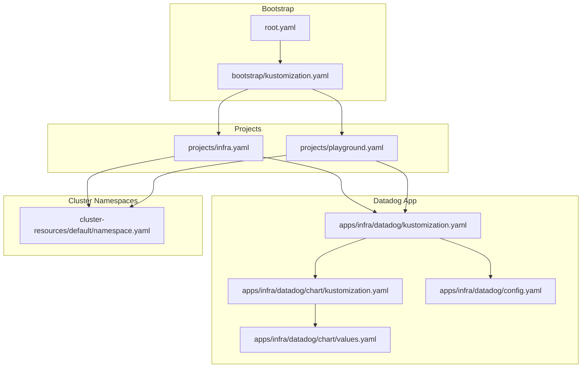
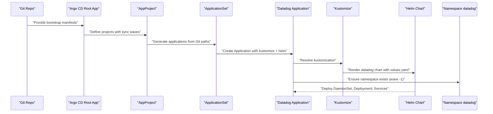
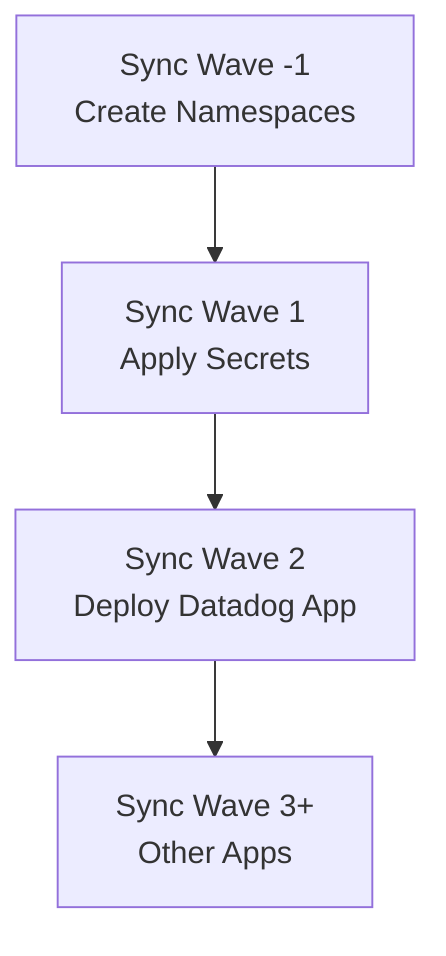
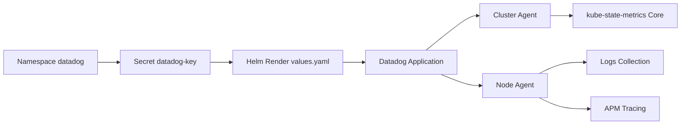

# Datadog Monitoring Agent

<cite>
**Referenced Files in This Document**
- [values.yaml](file://apps/infra/datadog/chart/values.yaml)
- [config.yaml](file://apps/infra/datadog/config.yaml)
- [kustomization.yaml](file://apps/infra/datadog/chart/kustomization.yaml)
- [kustomization.yaml](file://apps/infra/datadog/kustomization.yaml)
- [root.yaml](file://bootstrap/root.yaml)
- [kustomization.yaml](file://bootstrap/kustomization.yaml)
- [infra.yaml](file://projects/infra.yaml)
- [playground.yaml](file://projects/playground.yaml)
- [namespace.yaml](file://cluster-resources/default/namespace.yaml)
- [argo_cd.md](file://guide/argocd/argo_cd.md)
- [argo_cd.md](file://guide/k8s_manifest_secrets/argo_cd.md)
</cite>

## Table of Contents
1. [Introduction](#introduction)
2. [Project Structure](#project-structure)
3. [Core Components](#core-components)
4. [Architecture Overview](#architecture-overview)
5. [Detailed Component Analysis](#detailed-component-analysis)
6. [Dependency Analysis](#dependency-analysis)
7. [Performance Considerations](#performance-considerations)
8. [Troubleshooting Guide](#troubleshooting-guide)
9. [Conclusion](#conclusion)
10. [Appendices](#appendices)

## Introduction
This document explains the Datadog monitoring agent deployment and configuration in this Kubernetes manifest repository. It covers installation via Helm, cluster agent setup, APM instrumentation, metric collection strategies, and integration with Kubernetes monitoring. It also documents sync wave ordering and dependency management with other infrastructure components, and provides guidance for custom metrics, logs, traces, monitors, dashboards, notebooks, troubleshooting, performance impact mitigation, and cost optimization for large-scale deployments.

## Project Structure
The Datadog stack is provisioned as a Helm-based Application managed by Argo CD. The deployment pipeline is orchestrated through Kustomize and ApplicationSets, ensuring predictable ordering across namespaces and components.

Key elements:
- Datadog Helm chart configured under apps/infra/datadog/chart
- Argo CD ApplicationSet and AppProject definitions under projects
- Bootstrap configuration wiring repo URLs and enabling Helm support
- Cluster namespaces created with explicit sync waves

**Diagram sources**
- [root.yaml:1-37](file://bootstrap/root.yaml#L1-L37)
- [kustomization.yaml:1-38](file://bootstrap/kustomization.yaml#L1-L38)
- [infra.yaml:1-85](file://projects/infra.yaml#L1-L85)
- [playground.yaml:1-90](file://projects/playground.yaml#L1-L90)
- [kustomization.yaml:1-8](file://apps/infra/datadog/kustomization.yaml#L1-L8)
- [kustomization.yaml:1-11](file://apps/infra/datadog/chart/kustomization.yaml#L1-L11)
- [values.yaml:1-89](file://apps/infra/datadog/chart/values.yaml#L1-L89)
- [config.yaml:1-6](file://apps/infra/datadog/config.yaml#L1-L6)
- [namespace.yaml:1-52](file://cluster-resources/default/namespace.yaml#L1-L52)

**Section sources**
- [root.yaml:1-37](file://bootstrap/root.yaml#L1-L37)
- [kustomization.yaml:1-38](file://bootstrap/kustomization.yaml#L1-L38)
- [infra.yaml:1-85](file://projects/infra.yaml#L1-L85)
- [playground.yaml:1-90](file://projects/playground.yaml#L1-L90)
- [kustomization.yaml:1-8](file://apps/infra/datadog/kustomization.yaml#L1-L8)
- [kustomization.yaml:1-11](file://apps/infra/datadog/chart/kustomization.yaml#L1-L11)
- [values.yaml:1-89](file://apps/infra/datadog/chart/values.yaml#L1-L89)
- [config.yaml:1-6](file://apps/infra/datadog/config.yaml#L1-L6)
- [namespace.yaml:1-52](file://cluster-resources/default/namespace.yaml#L1-L52)

## Core Components
- Datadog Helm Chart
  - Enabled features: Orchestrator Explorer, kube-state-metrics Core, logs, APM (Unix domain socket and TCP), process agent, cluster agent.
  - Site and cluster name configured; API key supplied via existing secret.
  - Agents and cluster agent images pinned to a specific tag.
- Argo CD Application and ApplicationSet
  - ApplicationSet generates per-environment applications from Git paths.
  - Sync waves coordinate namespace creation, secrets, and app deployments.
- Secrets Management
  - Datadog API key stored in a Secret and mounted as an existing secret for the chart.

Key configuration anchors:
- Helm chart values define site, cluster name, APM, logs, process agent, kube-state-metrics, and cluster agent settings.
- Datadog Application configures namespace and sync wave.
- ApplicationSet and AppProject define sync waves and automation policies.

**Section sources**
- [values.yaml:1-89](file://apps/infra/datadog/chart/values.yaml#L1-L89)
- [config.yaml:1-6](file://apps/infra/datadog/config.yaml#L1-L6)
- [kustomization.yaml:1-11](file://apps/infra/datadog/chart/kustomization.yaml#L1-L11)
- [infra.yaml:1-85](file://projects/infra.yaml#L1-L85)
- [playground.yaml:1-90](file://projects/playground.yaml#L1-L90)

## Architecture Overview
The Datadog monitoring stack is deployed as follows:
- Argo CD root Application watches the projects path and enables Helm builds.
- ApplicationSet discovers Datadog configs under apps/infra/*/config.yaml and creates Applications accordingly.
- Each Datadog Application applies the Helm chart in the datadog namespace with values from values.yaml.
- Cluster namespaces are created early via sync wave -1 to ensure prerequisites are present before deploying workloads.

**Diagram sources**
- [root.yaml:1-37](file://bootstrap/root.yaml#L1-L37)
- [infra.yaml:1-85](file://projects/infra.yaml#L1-L85)
- [playground.yaml:1-90](file://projects/playground.yaml#L1-L90)
- [kustomization.yaml:1-8](file://apps/infra/datadog/kustomization.yaml#L1-L8)
- [kustomization.yaml:1-11](file://apps/infra/datadog/chart/kustomization.yaml#L1-L11)
- [values.yaml:1-89](file://apps/infra/datadog/chart/values.yaml#L1-L89)
- [namespace.yaml:1-52](file://cluster-resources/default/namespace.yaml#L1-L52)

## Detailed Component Analysis

### Datadog Helm Chart Configuration
- Site and cluster name: Used to target the correct Datadog intake and label metrics with the logical cluster identity.
- API key: Provided via an existing secret to avoid embedding credentials in manifests.
- Kubernetes and orchestrator insights:
  - Orchestrator Explorer enabled with container scrubbing.
  - kube-state-metrics Core enabled with RBAC creation.
- Logs:
  - Enabled with container log collection enabled.
- APM:
  - Unix domain socket and TCP ports enabled for trace ingestion.
- Process agent:
  - Enabled with process and container collection.
- Cluster agent:
  - Enabled with replicas and image tag pinned.
  - Environment variables set for site and orchestrator explorer.
- Node agent:
  - Image tag pinned.
  - Tolerations allow scheduling on control-plane nodes.
  - Environment variables include site, orchestrator explorer, and host-derived hostname.
  - Resource requests and limits defined.

Operational implications:
- Enabling logs and APM increases resource consumption; tune requests/limits accordingly.
- Pinning image tags ensures reproducible upgrades; plan rollouts with sync waves.
- Tolerations enable coverage on control-plane nodes but should be reviewed for security posture.

**Section sources**
- [values.yaml:1-89](file://apps/infra/datadog/chart/values.yaml#L1-L89)

### Argo CD Application and Sync Waves
- Datadog Application:
  - Destinations namespace set to datadog.
  - Sync wave annotation "2" places it after secrets and namespaces.
- Secrets Application:
  - Sync wave "1" deploys secrets before apps.
- Namespace creation:
  - Many namespaces created with wave "-1" to ensure prerequisites exist.
- Projects:
  - AppProject and ApplicationSet define automation and sync waves for infra and playground clusters.

**Diagram sources**
- [namespace.yaml:1-52](file://cluster-resources/default/namespace.yaml#L1-L52)
- [config.yaml:1-6](file://apps/infra/datadog/config.yaml#L1-L6)
- [infra.yaml:1-85](file://projects/infra.yaml#L1-L85)
- [playground.yaml:1-90](file://projects/playground.yaml#L1-L90)

**Section sources**
- [config.yaml:1-6](file://apps/infra/datadog/config.yaml#L1-L6)
- [namespace.yaml:1-52](file://cluster-resources/default/namespace.yaml#L1-L52)
- [infra.yaml:1-85](file://projects/infra.yaml#L1-L85)
- [playground.yaml:1-90](file://projects/playground.yaml#L1-L90)

### Installation and Upgrade Process
- Bootstrap Argo CD and enable Helm support.
- Apply bootstrap manifests to wire repo URLs and enable Kustomize build options.
- Ensure secrets are applied prior to deploying Datadog.
- Argo CD will render the Helm chart with values.yaml and deploy to the datadog namespace.

Operational tips:
- Use dry-run and diff views in Argo CD to preview changes.
- Leverage sync waves to guarantee prerequisite resources exist.
- Keep image tags pinned for stability; promote updates via controlled waves.

**Section sources**
- [argo_cd.md:1-34](file://guide/argocd/argo_cd.md#L1-L34)
- [kustomization.yaml:1-38](file://bootstrap/kustomization.yaml#L1-L38)
- [kustomization.yaml:1-11](file://apps/infra/datadog/chart/kustomization.yaml#L1-L11)
- [values.yaml:1-89](file://apps/infra/datadog/chart/values.yaml#L1-L89)

### Kubernetes Monitoring Integration
- Node-level metrics: Collected by the node agent; ensure scheduling tolerations and resource limits are appropriate.
- Pod resource utilization: kube-state-metrics Core provides rich metrics for Pods, Deployments, Services, and more.
- Service performance tracking: APM traces and logs correlate with Kubernetes service names and labels.

Recommendations:
- Enable container scrubbing to protect sensitive data in logs and traces.
- Use cluster agent for centralized coordination and reduced agent duplication costs.

**Section sources**
- [values.yaml:19-23](file://apps/infra/datadog/chart/values.yaml#L19-L23)
- [values.yaml:24-26](file://apps/infra/datadog/chart/values.yaml#L24-L26)
- [values.yaml:28-31](file://apps/infra/datadog/chart/values.yaml#L28-L31)
- [values.yaml:37-47](file://apps/infra/datadog/chart/values.yaml#L37-L47)
- [values.yaml:48-89](file://apps/infra/datadog/chart/values.yaml#L48-L89)

### APM Instrumentation Configuration
- APM socket and port enabled for trace ingestion.
- Tracer libraries should target the agent’s trace endpoint; ensure network policies allow traffic if applicable.
- Correlate traces with logs and metrics using Kubernetes service and pod labels.

Best practices:
- Use environment variables to configure tracer endpoints and service names.
- Enable trace sampling controls to manage overhead.
- Leverage Datadog APM dashboards and notebooks for service performance analysis.

**Section sources**
- [values.yaml:28-31](file://apps/infra/datadog/chart/values.yaml#L28-L31)
- [values.yaml:73-79](file://apps/infra/datadog/chart/values.yaml#L73-L79)

### Metric Collection Strategies
- Use kube-state-metrics Core for rich Kubernetes resource metrics.
- Enable logs collection to enrich metrics with contextual information.
- Tag metrics with cluster name and node hostname for precise filtering.

Optimization:
- Scope metric collection to essential namespaces and resources.
- Use cardinality controls and metric scrubbing to reduce noise.

**Section sources**
- [values.yaml:19-23](file://apps/infra/datadog/chart/values.yaml#L19-L23)
- [values.yaml:24-26](file://apps/infra/datadog/chart/values.yaml#L24-L26)
- [values.yaml:62-66](file://apps/infra/datadog/chart/values.yaml#L62-L66)

### Custom Dashboards and Notebooks
- Create dashboards to visualize node CPU/memory, pod restarts, APM latency, and throughput.
- Use notebooks to explore correlations between logs, traces, and metrics.
- Share dashboards and notebooks across teams via Argo CD for consistency.

[No sources needed since this section provides general guidance]

### Monitors and Alerting Rules
- Define monitors for critical thresholds: node pressure, pod restart storms, APM error rates, and latency SLOs.
- Use Argo CD to manage monitor configurations as code alongside infrastructure.
- Configure notification channels and escalation policies in Datadog.

[No sources needed since this section provides general guidance]

### Log Aggregation and Trace Correlation
- Enable container log collection and APM tracing.
- Use Kubernetes labels and annotations to enrich logs and traces.
- Correlate APM traces with logs and metrics in Datadog for root cause analysis.

**Section sources**
- [values.yaml:24-26](file://apps/infra/datadog/chart/values.yaml#L24-L26)
- [values.yaml:28-31](file://apps/infra/datadog/chart/values.yaml#L28-L31)

## Dependency Analysis
The Datadog deployment depends on:
- Namespace availability (sync wave -1)
- Secrets presence (sync wave 1)
- Helm rendering and chart values
- Cluster agent readiness for centralized coordination

**Diagram sources**
- [namespace.yaml:1-52](file://cluster-resources/default/namespace.yaml#L1-L52)
- [argo_cd.md:19-22](file://guide/k8s_manifest_secrets/argo_cd.md#L19-L22)
- [values.yaml:1-89](file://apps/infra/datadog/chart/values.yaml#L1-L89)
- [config.yaml:1-6](file://apps/infra/datadog/config.yaml#L1-L6)

**Section sources**
- [namespace.yaml:1-52](file://cluster-resources/default/namespace.yaml#L1-L52)
- [argo_cd.md:19-22](file://guide/k8s_manifest_secrets/argo_cd.md#L19-L22)
- [values.yaml:1-89](file://apps/infra/datadog/chart/values.yaml#L1-L89)
- [config.yaml:1-6](file://apps/infra/datadog/config.yaml#L1-L6)

## Performance Considerations
- Resource allocation: Review agent CPU/memory requests/limits and adjust for workload density.
- Tolerations: Ensure control-plane tolerations align with security posture and capacity planning.
- APM overhead: Tune sampling and batch sizes; disable APM on low-traffic environments if needed.
- Log volume: Scrub sensitive data and scope collection to essential containers.
- Image pinning: Maintain stable versions to avoid unexpected performance regressions during upgrades.

[No sources needed since this section provides general guidance]

## Troubleshooting Guide
Common issues and resolutions:
- Missing API key: Verify the Secret exists in the datadog namespace and matches the existing secret name in values.
- Namespace not found: Confirm the namespace was created with sync wave -1.
- Helm rendering errors: Validate values.yaml and ensure the Helm chart version is compatible.
- APM connectivity: Check that APM socket/port is reachable from instrumented workloads and that network policies permit ingress.
- Logs missing: Confirm logs.enabled and containerCollectAll are set appropriately; verify container runtime and log paths.

**Section sources**
- [values.yaml:1-89](file://apps/infra/datadog/chart/values.yaml#L1-L89)
- [namespace.yaml:1-52](file://cluster-resources/default/namespace.yaml#L1-L52)
- [argo_cd.md:19-22](file://guide/k8s_manifest_secrets/argo_cd.md#L19-L22)

## Conclusion
This repository provides a robust, declarative Datadog monitoring setup integrated with Argo CD and Helm. By leveraging sync waves, pinned image tags, and comprehensive feature toggles, it supports scalable Kubernetes observability. Operators can extend dashboards, monitors, and notebooks while maintaining operational consistency and cost efficiency.

[No sources needed since this section summarizes without analyzing specific files]

## Appendices

### Appendix A: Installation Checklist
- Install Argo CD and enable Helm support.
- Apply bootstrap manifests to wire repo URLs.
- Create the datadog namespace with sync wave -1.
- Apply secrets (datadog-key) with sync wave 1.
- Deploy Datadog Application with sync wave 2.
- Validate cluster agent and node agent health.
- Configure APM, logs, and kube-state-metrics according to environment needs.

**Section sources**
- [argo_cd.md:1-34](file://guide/argocd/argo_cd.md#L1-L34)
- [kustomization.yaml:1-38](file://bootstrap/kustomization.yaml#L1-L38)
- [namespace.yaml:1-52](file://cluster-resources/default/namespace.yaml#L1-L52)
- [argo_cd.md:19-22](file://guide/k8s_manifest_secrets/argo_cd.md#L19-L22)
- [config.yaml:1-6](file://apps/infra/datadog/config.yaml#L1-L6)