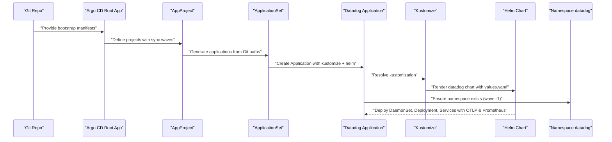
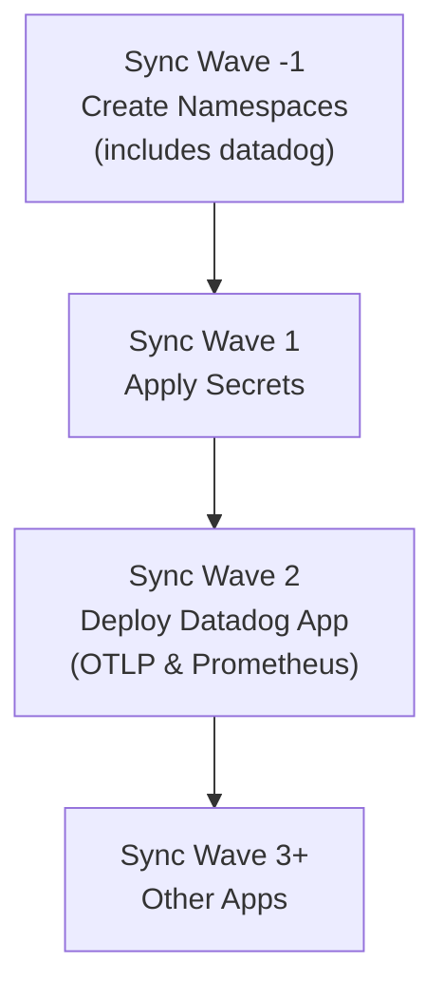
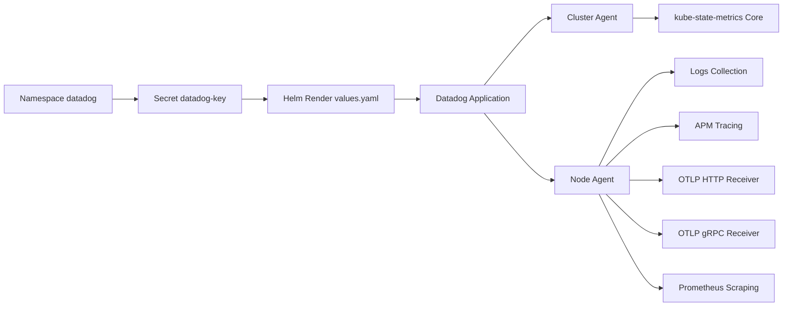

# Datadog Monitoring Agent

<cite>
**Referenced Files in This Document**
- [values.yaml](file://apps/infra/datadog/chart/values.yaml)
- [config.yaml](file://apps/infra/datadog/config.yaml)
- [kustomization.yaml](file://apps/infra/datadog/chart/kustomization.yaml)
- [kustomization.yaml](file://apps/infra/datadog/kustomization.yaml)
- [root.yaml](file://bootstrap/root.yaml)
- [kustomization.yaml](file://bootstrap/kustomization.yaml)
- [infra.yaml](file://projects/infra.yaml)
- [namespace.yaml](file://cluster-resources/default/namespace.yaml)
- [README.md](file://guide/5. datadog_integration/README.md)
</cite>

## Update Summary
**Changes Made**
- Enhanced OTLP receiver configuration documentation with HTTP and gRPC protocol support
- Added comprehensive Prometheus scraping integration details
- Updated metrics collection strategies to include enhanced observability features
- Expanded APM instrumentation configuration with improved trace collection
- Added new section on enhanced observability capabilities
- Updated dependency analysis to reflect new protocol support

## Table of Contents
1. [Introduction](#introduction)
2. [Project Structure](#project-structure)
3. [Core Components](#core-components)
4. [Architecture Overview](#architecture-overview)
5. [Detailed Component Analysis](#detailed-component-analysis)
6. [Enhanced Observability Features](#enhanced-observability-features)
7. [Dependency Analysis](#dependency-analysis)
8. [Performance Considerations](#performance-considerations)
9. [Troubleshooting Guide](#troubleshooting-guide)
10. [Conclusion](#conclusion)
11. [Appendices](#appendices)

## Introduction
This document explains the Datadog monitoring agent deployment and configuration in this Kubernetes manifest repository. The implementation now features enhanced observability with OTLP receivers supporting both HTTP and gRPC protocols, comprehensive Prometheus scraping integration, and improved metrics collection strategies. It covers installation via Helm, cluster agent setup, APM instrumentation, advanced metric collection, and integration with Kubernetes monitoring. The document also addresses sync wave ordering, dependency management, custom metrics, logs, traces, monitors, dashboards, notebooks, troubleshooting, performance impact mitigation, and cost optimization for large-scale deployments.

## Project Structure
The Datadog stack is provisioned as a Helm-based Application managed by Argo CD. The deployment pipeline is orchestrated through Kustomize and ApplicationSets, ensuring predictable ordering across namespaces and components with enhanced observability features.

Key elements:
- Datadog Helm chart configured under apps/infra/datadog/chart with OTLP and Prometheus support
- Argo CD ApplicationSet and AppProject definitions under projects
- Bootstrap configuration wiring repo URLs and enabling Helm support
- Cluster namespaces created with explicit sync waves
- Enhanced observability protocols enabled for comprehensive monitoring

```mermaid
graph TB
subgraph "Bootstrap"
ROOT["root.yaml"]
BOOT_K["bootstrap/kustomization.yaml"]
END
subgraph "Projects"
INFRA_YAML["projects/infra.yaml"]
END
subgraph "Datadog App"
DATADOG_K["apps/infra/datadog/kustomization.yaml"]
CHART_K["apps/infra/datadog/chart/kustomization.yaml"]
VALUES["apps/infra/datadog/chart/values.yaml"]
CONFIG["apps/infra/datadog/config.yaml"]
END
subgraph "Cluster Namespaces"
NS_DEFAULT["cluster-resources/default/namespace.yaml"]
END
ROOT --> BOOT_K
BOOT_K --> INFRA_YAML
INFRA_YAML --> DATADOG_K
DATADOG_K --> CHART_K
CHART_K --> VALUES
DATADOG_K --> CONFIG
INFRA_YAML --> NS_DEFAULT
```

**Diagram sources**
- [root.yaml:1-37](file://bootstrap/root.yaml#L1-L37)
- [kustomization.yaml:1-38](file://bootstrap/kustomization.yaml#L1-L38)
- [infra.yaml:1-86](file://projects/infra.yaml#L1-L86)
- [kustomization.yaml:1-8](file://apps/infra/datadog/kustomization.yaml#L1-L8)
- [kustomization.yaml:1-11](file://apps/infra/datadog/chart/kustomization.yaml#L1-L11)
- [values.yaml:1-101](file://apps/infra/datadog/chart/values.yaml#L1-L101)
- [config.yaml:1-4](file://apps/infra/datadog/config.yaml#L1-L4)
- [namespace.yaml:1-108](file://cluster-resources/default/namespace.yaml#L1-L108)

**Section sources**
- [root.yaml:1-37](file://bootstrap/root.yaml#L1-L37)
- [kustomization.yaml:1-38](file://bootstrap/kustomization.yaml#L1-L38)
- [infra.yaml:1-86](file://projects/infra.yaml#L1-L86)
- [kustomization.yaml:1-8](file://apps/infra/datadog/kustomization.yaml#L1-L8)
- [kustomization.yaml:1-11](file://apps/infra/datadog/chart/kustomization.yaml#L1-L11)
- [values.yaml:1-101](file://apps/infra/datadog/chart/values.yaml#L1-L101)
- [config.yaml:1-4](file://apps/infra/datadog/config.yaml#L1-L4)
- [namespace.yaml:1-108](file://cluster-resources/default/namespace.yaml#L1-L108)

## Core Components
- **Datadog Helm Chart**
  - Enhanced OTLP receiver with HTTP and gRPC protocol support
  - Comprehensive Prometheus scraping integration with service endpoints
  - Orchestrator Explorer, kube-state-metrics Core, logs, APM (Unix domain socket and TCP), process agent, cluster agent
  - Site and cluster name configured; API key supplied via existing secret
  - Agents and cluster agent images pinned to version 7.77.1
- **Argo CD Application and ApplicationSet**
  - ApplicationSet generates per-environment applications from Git paths
  - Sync waves coordinate namespace creation, secrets, and app deployments
- **Enhanced Observability Protocols**
  - OTLP HTTP receiver enabled for modern observability pipelines
  - OTLP gRPC receiver for high-performance telemetry collection
  - Prometheus scraping for comprehensive metrics discovery
- **Secrets Management**
  - Datadog API key stored in a Secret and mounted as an existing secret for the chart

Key configuration anchors:
- Helm chart values define site, cluster name, OTLP protocols, Prometheus scraping, APM, logs, process agent, kube-state-metrics, and cluster agent settings
- Datadog Application configures namespace and sync wave
- ApplicationSet and AppProject define sync waves and automation policies

**Section sources**
- [values.yaml:1-101](file://apps/infra/datadog/chart/values.yaml#L1-L101)
- [config.yaml:1-4](file://apps/infra/datadog/config.yaml#L1-L4)
- [kustomization.yaml:1-11](file://apps/infra/datadog/chart/kustomization.yaml#L1-L11)
- [infra.yaml:1-86](file://projects/infra.yaml#L1-L86)

## Architecture Overview
The enhanced Datadog monitoring stack is deployed with comprehensive observability protocols:
- Argo CD root Application watches the projects path and enables Helm builds
- ApplicationSet discovers Datadog configs under apps/infra/*/config.yaml and creates Applications accordingly
- Each Datadog Application applies the Helm chart in the datadog namespace with values from values.yaml
- Cluster namespaces are created early via sync wave -1 to ensure prerequisites are present before deploying workloads
- Enhanced OTLP receivers accept telemetry from modern observability stacks
- Prometheus scraping provides comprehensive metrics discovery across the cluster



**Diagram sources**
- [root.yaml:1-37](file://bootstrap/root.yaml#L1-L37)
- [infra.yaml:1-86](file://projects/infra.yaml#L1-L86)
- [kustomization.yaml:1-8](file://apps/infra/datadog/kustomization.yaml#L1-L8)
- [kustomization.yaml:1-11](file://apps/infra/datadog/chart/kustomization.yaml#L1-L11)
- [values.yaml:1-101](file://apps/infra/datadog/chart/values.yaml#L1-L101)
- [namespace.yaml:1-108](file://cluster-resources/default/namespace.yaml#L1-L108)

## Detailed Component Analysis

### Enhanced Datadog Helm Chart Configuration
- **Site and cluster name**: Used to target the correct Datadog intake and label metrics with the logical cluster identity
- **API key**: Provided via an existing secret to avoid embedding credentials in manifests
- **Enhanced OTLP Receivers**:
  - HTTP protocol enabled for modern observability pipelines
  - gRPC protocol enabled for high-performance telemetry collection
  - Supports OpenTelemetry standard for unified observability
- **Comprehensive Prometheus Scraping**:
  - Enabled with service endpoints for automatic discovery
  - Integrates with Kubernetes service discovery for dynamic target registration
- **Kubernetes and orchestrator insights**:
  - Orchestrator Explorer enabled with container scrubbing
  - kube-state-metrics Core enabled with RBAC creation
- **Logs**:
  - Enabled with container log collection enabled
- **APM**:
  - Unix domain socket and TCP ports enabled for trace ingestion
- **Process agent**:
  - Enabled with process and container collection
- **Cluster agent**:
  - Enabled with replicas and image tag pinned to 7.77.1
  - Environment variables set for site and orchestrator explorer
- **Node agent**:
  - Image tag pinned to 7.77.1
  - Tolerations allow scheduling on control-plane nodes
  - Environment variables include site, orchestrator explorer, and host-derived hostname
  - Resource requests and limits defined

Operational implications:
- Enabling enhanced OTLP receivers and Prometheus scraping increases resource consumption; tune requests/limits accordingly
- Pinning image tags ensures reproducible upgrades; plan rollouts with sync waves
- Tolerations enable coverage on control-plane nodes but should be reviewed for security posture
- OTLP HTTP and gRPC support provides flexibility for different telemetry sources and performance requirements

**Section sources**
- [values.yaml:1-101](file://apps/infra/datadog/chart/values.yaml#L1-L101)

### Argo CD Application and Sync Waves
- **Datadog Application**:
  - Destination namespace set to datadog
  - Sync wave annotation "2" places it after secrets and namespaces
- **Namespace creation**:
  - Multiple namespaces created with wave "-1" to ensure prerequisites exist
  - Includes datadog namespace for monitoring infrastructure
- **Projects**:
  - AppProject and ApplicationSet define automation and sync waves for infrastructure management



**Diagram sources**
- [namespace.yaml:1-108](file://cluster-resources/default/namespace.yaml#L1-L108)
- [config.yaml:1-4](file://apps/infra/datadog/config.yaml#L1-L4)
- [infra.yaml:1-86](file://projects/infra.yaml#L1-L86)

**Section sources**
- [config.yaml:1-4](file://apps/infra/datadog/config.yaml#L1-L4)
- [namespace.yaml:1-108](file://cluster-resources/default/namespace.yaml#L1-L108)
- [infra.yaml:1-86](file://projects/infra.yaml#L1-L86)

### Installation and Upgrade Process
- Bootstrap Argo CD and enable Helm support
- Apply bootstrap manifests to wire repo URLs and enable Kustomize build options
- Ensure secrets are applied prior to deploying Datadog
- Argo CD will render the Helm chart with values.yaml and deploy to the datadog namespace
- Enhanced OTLP receivers and Prometheus scraping are automatically configured

Operational tips:
- Use dry-run and diff views in Argo CD to preview changes
- Leverage sync waves to guarantee prerequisite resources exist
- Keep image tags pinned for stability; promote updates via controlled waves
- Monitor OTLP receiver health and Prometheus scraping targets after deployment

**Section sources**
- [root.yaml:1-37](file://bootstrap/root.yaml#L1-L37)
- [kustomization.yaml:1-38](file://bootstrap/kustomization.yaml#L1-L38)
- [kustomization.yaml:1-11](file://apps/infra/datadog/chart/kustomization.yaml#L1-L11)
- [values.yaml:1-101](file://apps/infra/datadog/chart/values.yaml#L1-L101)

### Kubernetes Monitoring Integration
- **Node-level metrics**: Collected by the node agent; ensure scheduling tolerations and resource limits are appropriate
- **Pod resource utilization**: kube-state-metrics Core provides rich metrics for Pods, Deployments, Services, and more
- **Service performance tracking**: APM traces and logs correlate with Kubernetes service names and labels
- **Enhanced metrics collection**: Prometheus scraping provides comprehensive metrics discovery across the cluster
- **Unified observability**: OTLP receivers support both HTTP and gRPC protocols for flexible telemetry ingestion

Recommendations:
- Enable container scrubbing to protect sensitive data in logs and traces
- Use cluster agent for centralized coordination and reduced agent duplication costs
- Leverage Prometheus scraping for automatic service discovery and metrics collection
- Configure OTLP receivers for modern observability stack integration

**Section sources**
- [values.yaml:19-23](file://apps/infra/datadog/chart/values.yaml#L19-L23)
- [values.yaml:24-26](file://apps/infra/datadog/chart/values.yaml#L24-L26)
- [values.yaml:28-31](file://apps/infra/datadog/chart/values.yaml#L28-L31)
- [values.yaml:32-38](file://apps/infra/datadog/chart/values.yaml#L32-L38)
- [values.yaml:40-42](file://apps/infra/datadog/chart/values.yaml#L40-L42)
- [values.yaml:48-101](file://apps/infra/datadog/chart/values.yaml#L48-L101)

### APM Instrumentation Configuration
- **APM socket and port enabled** for trace ingestion
- **Enhanced OTLP support** for modern observability pipelines
- Tracer libraries should target the agent's trace endpoint; ensure network policies allow traffic if applicable
- Correlate traces with logs and metrics using Kubernetes service and pod labels

Best practices:
- Use environment variables to configure tracer endpoints and service names
- Enable trace sampling controls to manage overhead
- Leverage Datadog APM dashboards and notebooks for service performance analysis
- Utilize OTLP HTTP and gRPC receivers for flexible telemetry ingestion

**Section sources**
- [values.yaml:28-31](file://apps/infra/datadog/chart/values.yaml#L28-L31)
- [values.yaml:32-38](file://apps/infra/datadog/chart/values.yaml#L32-L38)
- [values.yaml:73-79](file://apps/infra/datadog/chart/values.yaml#L73-L79)

### Enhanced Metrics Collection Strategies
- **Prometheus scraping**: Automatic discovery and collection of metrics from Kubernetes services
- **OTLP integration**: Unified observability with HTTP and gRPC protocol support
- **kube-state-metrics Core**: Rich Kubernetes resource metrics for comprehensive monitoring
- **Logs collection**: Contextual enrichment with telemetry data
- **Tagging strategy**: Use cluster name and node hostname for precise filtering and correlation

Optimization:
- Scope metric collection to essential namespaces and resources
- Use cardinality controls and metric scrubbing to reduce noise
- Leverage Prometheus service discovery for dynamic target management
- Configure OTLP receivers for optimal performance based on telemetry volume

**Section sources**
- [values.yaml:19-23](file://apps/infra/datadog/chart/values.yaml#L19-L23)
- [values.yaml:24-26](file://apps/infra/datadog/chart/values.yaml#L24-L26)
- [values.yaml:32-38](file://apps/infra/datadog/chart/values.yaml#L32-L38)
- [values.yaml:40-42](file://apps/infra/datadog/chart/values.yaml#L40-L42)
- [values.yaml:62-66](file://apps/infra/datadog/chart/values.yaml#L62-L66)

## Enhanced Observability Features

### OTLP Receiver Configuration
The Datadog agent now supports both HTTP and gRPC protocols for comprehensive OpenTelemetry integration:

**HTTP Protocol Configuration**:
- Enables modern observability pipelines with RESTful API
- Supports JSON payload format for trace data
- Compatible with popular OpenTelemetry collectors and SDKs
- Lower overhead for smaller telemetry batches

**gRPC Protocol Configuration**:
- High-performance binary protocol for large telemetry volumes
- Optimized for streaming telemetry data
- Reduced serialization overhead compared to HTTP
- Ideal for high-throughput observability scenarios

**Protocol Selection Guidelines**:
- Use HTTP for development environments and smaller deployments
- Use gRPC for production environments with high telemetry volume
- Consider network constraints and firewall policies when selecting protocols
- Monitor performance metrics to determine optimal protocol choice

**Section sources**
- [values.yaml:32-38](file://apps/infra/datadog/chart/values.yaml#L32-L38)

### Prometheus Scraping Integration
Enhanced Prometheus scraping provides comprehensive metrics discovery:

**Automatic Service Discovery**:
- Dynamic registration of Kubernetes services as scrape targets
- Automatic handling of service endpoints and port discovery
- Integration with Kubernetes service labels for filtering

**Configuration Benefits**:
- Reduced manual configuration overhead
- Automatic scaling with cluster size
- Consistent metrics collection across all services
- Support for multiple Prometheus-compatible exporters

**Monitoring Recommendations**:
- Implement service-level metrics collection for critical applications
- Use Prometheus relabeling for metric filtering and transformation
- Monitor scrape success rates and target availability
- Configure appropriate scrape intervals based on metric importance

**Section sources**
- [values.yaml:40-42](file://apps/infra/datadog/chart/values.yaml#L40-L42)

### Unified Observability Pipeline
The enhanced configuration supports a comprehensive observability ecosystem:

**Multi-Protocol Telemetry Ingestion**:
- HTTP and gRPC OTLP receivers for flexible telemetry collection
- Prometheus scraping for metrics discovery
- Native APM tracing for distributed system monitoring
- Structured logging for contextual observability

**Integration Patterns**:
- Modern observability stacks using OpenTelemetry standards
- Hybrid environments supporting multiple telemetry protocols
- Gradual migration from legacy monitoring solutions
- Unified dashboard and alerting across all observability signals

**Deployment Considerations**:
- Network configuration for OTLP receiver accessibility
- Resource allocation for multiple telemetry protocols
- Security considerations for public telemetry endpoints
- Performance tuning for high-volume telemetry ingestion

**Section sources**
- [values.yaml:24-26](file://apps/infra/datadog/chart/values.yaml#L24-L26)
- [values.yaml:28-31](file://apps/infra/datadog/chart/values.yaml#L28-L31)
- [values.yaml:32-38](file://apps/infra/datadog/chart/values.yaml#L32-L38)
- [values.yaml:40-42](file://apps/infra/datadog/chart/values.yaml#L40-L42)

## Dependency Analysis
The enhanced Datadog deployment depends on:
- Namespace availability (sync wave -1)
- Secrets presence (sync wave 1)
- Helm rendering and chart values with enhanced protocol support
- Cluster agent readiness for centralized coordination
- OTLP receiver availability for telemetry ingestion
- Prometheus service discovery for metrics collection



**Diagram sources**
- [namespace.yaml:1-108](file://cluster-resources/default/namespace.yaml#L1-L108)
- [values.yaml:1-101](file://apps/infra/datadog/chart/values.yaml#L1-L101)
- [config.yaml:1-4](file://apps/infra/datadog/config.yaml#L1-L4)

**Section sources**
- [namespace.yaml:1-108](file://cluster-resources/default/namespace.yaml#L1-L108)
- [values.yaml:1-101](file://apps/infra/datadog/chart/values.yaml#L1-L101)
- [config.yaml:1-4](file://apps/infra/datadog/config.yaml#L1-L4)

## Performance Considerations
- **Resource allocation**: Review agent CPU/memory requests/limits and adjust for workload density
- **Tolerations**: Ensure control-plane tolerations align with security posture and capacity planning
- **APM overhead**: Tune sampling and batch sizes; disable APM on low-traffic environments if needed
- **Log volume**: Scrub sensitive data and scope collection to essential containers
- **OTLP protocol selection**: Choose appropriate protocol based on telemetry volume and performance requirements
- **Prometheus scraping**: Monitor scrape success rates and optimize target discovery
- **Image pinning**: Maintain stable versions to avoid unexpected performance regressions during upgrades
- **Network optimization**: Configure OTLP receivers for optimal network performance

## Troubleshooting Guide
Common issues and resolutions:
- **Missing API key**: Verify the Secret exists in the datadog namespace and matches the existing secret name in values
- **Namespace not found**: Confirm the namespace was created with sync wave -1
- **Helm rendering errors**: Validate values.yaml and ensure the Helm chart version is compatible
- **APM connectivity**: Check that APM socket/port is reachable from instrumented workloads and that network policies permit ingress
- **Logs missing**: Confirm logs.enabled and containerCollectAll are set appropriately; verify container runtime and log paths
- **OTLP receiver issues**: Verify HTTP and gRPC protocols are enabled and accessible; check network policies and firewall rules
- **Prometheus scraping failures**: Monitor scrape success rates and verify service discovery configuration
- **Protocol performance**: Analyze telemetry volume and select optimal OTLP protocol based on performance metrics

**Section sources**
- [values.yaml:1-101](file://apps/infra/datadog/chart/values.yaml#L1-L101)
- [namespace.yaml:1-108](file://cluster-resources/default/namespace.yaml#L1-L108)

## Conclusion
This repository provides a robust, declarative Datadog monitoring setup integrated with Argo CD and Helm, featuring enhanced observability capabilities. The implementation now supports comprehensive OTLP receivers with HTTP and gRPC protocols, advanced Prometheus scraping integration, and improved metrics collection strategies. By leveraging sync waves, pinned image tags, and comprehensive feature toggles, it supports scalable Kubernetes observability with modern protocol support. Operators can extend dashboards, monitors, and notebooks while maintaining operational consistency and cost efficiency across enhanced observability features.

## Appendices

### Appendix A: Installation Checklist
- Install Argo CD and enable Helm support
- Apply bootstrap manifests to wire repo URLs
- Create the datadog namespace with sync wave -1
- Apply secrets (datadog-key) with sync wave 1
- Deploy Datadog Application with sync wave 2
- Validate cluster agent and node agent health
- Configure APM, logs, kube-state-metrics, OTLP receivers, and Prometheus scraping according to environment needs
- Test OTLP HTTP and gRPC receiver connectivity
- Verify Prometheus scraping targets and service discovery

**Section sources**
- [root.yaml:1-37](file://bootstrap/root.yaml#L1-L37)
- [kustomization.yaml:1-38](file://bootstrap/kustomization.yaml#L1-L38)
- [namespace.yaml:1-108](file://cluster-resources/default/namespace.yaml#L1-L108)
- [config.yaml:1-4](file://apps/infra/datadog/config.yaml#L1-L4)
- [values.yaml:1-101](file://apps/infra/datadog/chart/values.yaml#L1-L101)

### Appendix B: Enhanced Protocol Configuration Reference
**OTLP HTTP Receiver**:
```yaml
otlp:
  receiver:
    protocols:
      http:
        enabled: true
```

**OTLP gRPC Receiver**:
```yaml
otlp:
  receiver:
    protocols:
      grpc:
        enabled: true
```

**Prometheus Scraping**:
```yaml
prometheusScrape:
  enabled: true
  serviceEndpoints: true
```

**Section sources**
- [values.yaml:32-38](file://apps/infra/datadog/chart/values.yaml#L32-L38)
- [values.yaml:40-42](file://apps/infra/datadog/chart/values.yaml#L40-L42)