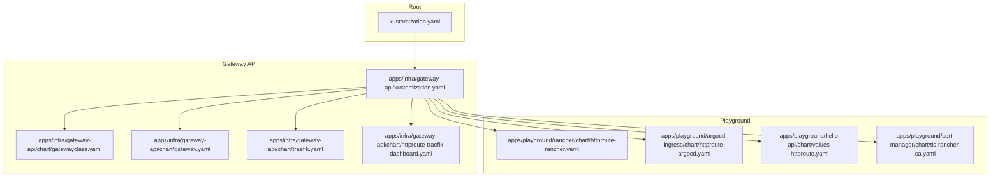
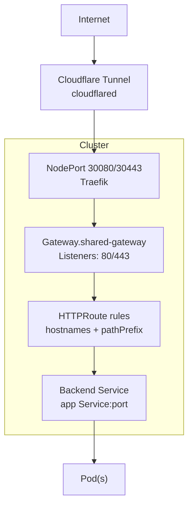
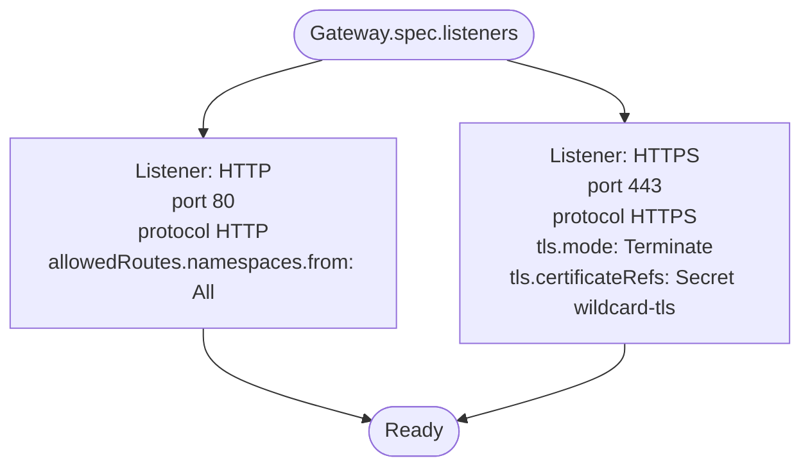
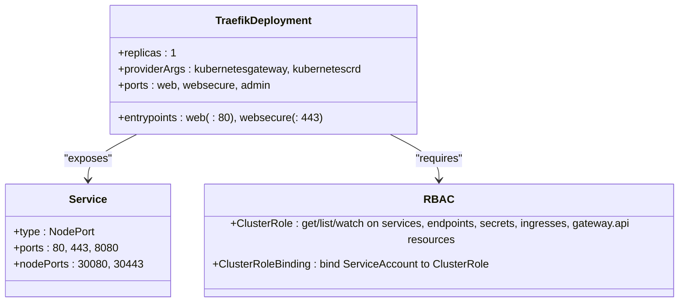
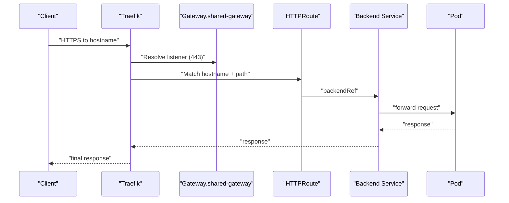
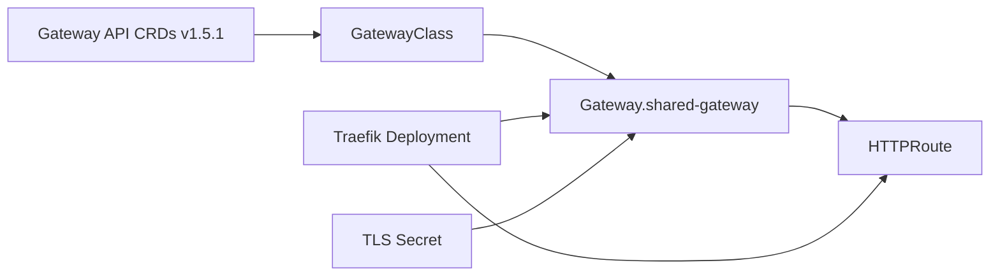

# Gateway API Controller

<cite>
**Referenced Files in This Document**
- [gatewayclass.yaml](file://apps/infra/gateway-api/chart/gatewayclass.yaml)
- [gateway.yaml](file://apps/infra/gateway-api/chart/gateway.yaml)
- [traefik.yaml](file://apps/infra/gateway-api/chart/traefik.yaml)
- [httproute-traefik-dashboard.yaml](file://apps/infra/gateway-api/chart/httproute-traefik-dashboard.yaml)
- [httproute-rancher.yaml](file://apps/playground/rancher/chart/httproute-rancher.yaml)
- [httproute-argocd.yaml](file://apps/playground/argocd-ingress/chart/httproute-argocd.yaml)
- [values-httproute.yaml](file://apps/playground/hello-api/chart/values-httproute.yaml)
- [kustomization.yaml (gateway-api)](file://apps/infra/gateway-api/kustomization.yaml)
- [kustomization.yaml (root)](file://kustomization.yaml)
- [README.md](file://README.md)
- [config.yaml (gateway-api)](file://apps/infra/gateway-api/config.yaml)
- [tls-rancher-ca.yaml](file://apps/playground/cert-manager/chart/tls-rancher-ca.yaml)
</cite>

## Update Summary
**Changes Made**
- Updated Gateway API version reference from v1.2.0 to v1.5.1 in kustomization.yaml
- Enhanced Gateway API specification compliance documentation
- Added information about newer API specifications and security enhancements
- Updated installation methodology to reflect standard Kubernetes Gateway API upgrade process

## Table of Contents
1. [Introduction](#introduction)
2. [Project Structure](#project-structure)
3. [Core Components](#core-components)
4. [Architecture Overview](#architecture-overview)
5. [Detailed Component Analysis](#detailed-component-analysis)
6. [Gateway API Version Upgrade](#gateway-api-version-upgrade)
7. [Dependency Analysis](#dependency-analysis)
8. [Performance Considerations](#performance-considerations)
9. [Troubleshooting Guide](#troubleshooting-guide)
10. [Conclusion](#conclusion)
11. [Appendices](#appendices)

## Introduction
This document explains the Gateway API controller implementation using Traefik as the ingress controller. It covers the GatewayClass and Gateway resources, listener configurations, and HTTPRoute definitions. It also documents the Traefik deployment with service annotations and ingress class configuration, demonstrates dashboard integration, and outlines compliance with the Gateway API specification. The implementation has been upgraded to use Gateway API v1.5.1, incorporating newer API specifications and security enhancements while maintaining existing infrastructure compatibility.

## Project Structure
The Gateway API stack is organized under apps/infra/gateway-api and integrates with playground applications that expose services via HTTPRoute. The root kustomization installs the Gateway API CRDs before deploying the controller and resources.

**Diagram sources**
- [kustomization.yaml (root):1-21](file://kustomization.yaml#L1-L21)
- [kustomization.yaml (gateway-api):1-9](file://apps/infra/gateway-api/kustomization.yaml#L1-L9)
- [gatewayclass.yaml:1-10](file://apps/infra/gateway-api/chart/gatewayclass.yaml#L1-L10)
- [gateway.yaml:1-27](file://apps/infra/gateway-api/chart/gateway.yaml#L1-L27)
- [traefik.yaml:1-120](file://apps/infra/gateway-api/chart/traefik.yaml#L1-L120)
- [httproute-traefik-dashboard.yaml:1-30](file://apps/infra/gateway-api/chart/httproute-traefik-dashboard.yaml#L1-L30)
- [httproute-rancher.yaml:1-30](file://apps/playground/rancher/chart/httproute-rancher.yaml#L1-L30)
- [httproute-argocd.yaml:1-29](file://apps/playground/argocd-ingress/chart/httproute-argocd.yaml#L1-L29)
- [values-httproute.yaml:1-26](file://apps/playground/hello-api/chart/values-httproute.yaml#L1-L26)
- [tls-rancher-ca.yaml:1-34](file://apps/playground/cert-manager/chart/tls-rancher-ca.yaml#L1-L34)

**Section sources**
- [kustomization.yaml (root):1-21](file://kustomization.yaml#L1-L21)
- [kustomization.yaml (gateway-api):1-9](file://apps/infra/gateway-api/kustomization.yaml#L1-L9)
- [README.md:1-163](file://README.md#L1-L163)

## Core Components
- GatewayClass: Defines the controller that implements the Gateway API. The controller name identifies Traefik's Gateway API implementation.
- Gateway: Declares listeners for HTTP and HTTPS, enables TLS termination, and references a certificate Secret.
- Traefik Deployment: Runs Traefik with Gateway API providers, exposes admin and entrypoint ports, and binds RBAC permissions.
- HTTPRoute: Routes traffic to backend Services based on hostnames and path prefixes, and sets forwarded headers for HTTPS.

Key implementation references:
- GatewayClass definition: [gatewayclass.yaml:1-10](file://apps/infra/gateway-api/chart/gatewayclass.yaml#L1-L10)
- Gateway listeners and TLS: [gateway.yaml:1-27](file://apps/infra/gateway-api/chart/gateway.yaml#L1-L27)
- Traefik deployment and RBAC: [traefik.yaml:1-120](file://apps/infra/gateway-api/chart/traefik.yaml#L1-L120)
- Dashboard HTTPRoute: [httproute-traefik-dashboard.yaml:1-30](file://apps/infra/gateway-api/chart/httproute-traefik-dashboard.yaml#L1-L30)
- Playground HTTPRoutes: [httproute-rancher.yaml:1-30](file://apps/playground/rancher/chart/httproute-rancher.yaml#L1-L30), [httproute-argocd.yaml:1-29](file://apps/playground/argocd-ingress/chart/httproute-argocd.yaml#L1-L29), [values-httproute.yaml:1-26](file://apps/playground/hello-api/chart/values-httproute.yaml#L1-L26)

**Section sources**
- [gatewayclass.yaml:1-10](file://apps/infra/gateway-api/chart/gatewayclass.yaml#L1-L10)
- [gateway.yaml:1-27](file://apps/infra/gateway-api/chart/gateway.yaml#L1-L27)
- [traefik.yaml:1-120](file://apps/infra/gateway-api/chart/traefik.yaml#L1-L120)
- [httproute-traefik-dashboard.yaml:1-30](file://apps/infra/gateway-api/chart/httproute-traefik-dashboard.yaml#L1-L30)
- [httproute-rancher.yaml:1-30](file://apps/playground/rancher/chart/httproute-rancher.yaml#L1-L30)
- [httproute-argocd.yaml:1-29](file://apps/playground/argocd-ingress/chart/httproute-argocd.yaml#L1-L29)
- [values-httproute.yaml:1-26](file://apps/playground/hello-api/chart/values-httproute.yaml#L1-L26)

## Architecture Overview
The system uses Cloudflare tunnel to forward traffic into the cluster, which reaches Traefik via NodePorts. Traefik, configured as the Gateway API controller, routes traffic to backend Services according to Gateway and HTTPRoute resources.

**Diagram sources**
- [README.md:5-48](file://README.md#L5-L48)
- [gateway.yaml:1-27](file://apps/infra/gateway-api/chart/gateway.yaml#L1-L27)
- [traefik.yaml:74-96](file://apps/infra/gateway-api/chart/traefik.yaml#L74-L96)
- [httproute-rancher.yaml:1-30](file://apps/playground/rancher/chart/httproute-rancher.yaml#L1-L30)

**Section sources**
- [README.md:5-48](file://README.md#L5-L48)
- [gateway.yaml:1-27](file://apps/infra/gateway-api/chart/gateway.yaml#L1-L27)
- [traefik.yaml:74-96](file://apps/infra/gateway-api/chart/traefik.yaml#L74-L96)

## Detailed Component Analysis

### GatewayClass
- Purpose: Declares the controller that implements the Gateway API.
- Controller name: Identifies Traefik's Gateway API implementation.
- Sync order: Installed early to ensure CRDs and controller readiness.

Implementation reference:
- [gatewayclass.yaml:1-10](file://apps/infra/gateway-api/chart/gatewayclass.yaml#L1-L10)

**Section sources**
- [gatewayclass.yaml:1-10](file://apps/infra/gateway-api/chart/gatewayclass.yaml#L1-L10)

### Gateway
- Purpose: Defines listeners for HTTP and HTTPS protocols.
- Listeners:
  - HTTP: Port 80 with cross-namespace route allowance.
  - HTTPS: Port 443 with TLS termination and certificate reference.
- Allowed routes: Namespaces.from: All to allow routes across namespaces.

Implementation reference:
- [gateway.yaml:1-27](file://apps/infra/gateway-api/chart/gateway.yaml#L1-L27)

**Diagram sources**
- [gateway.yaml:10-26](file://apps/infra/gateway-api/chart/gateway.yaml#L10-L26)

**Section sources**
- [gateway.yaml:1-27](file://apps/infra/gateway-api/chart/gateway.yaml#L1-L27)

### Traefik Deployment and RBAC
- Provider configuration:
  - Kubernetes Gateway provider enabled.
  - Kubernetes CRD provider enabled.
- Entrypoints:
  - web: :80
  - websecure: :443
- Ports:
  - Container ports: web, websecure, admin (8080).
- Service:
  - NodePort service exposing 80, 443, and 8080.
- RBAC:
  - Permissions for services, endpoints, secrets, EndpointSlices, ingresses, Gateway API resources, and Traefik CRDs.
  - Lease coordination for leader election.

Implementation reference:
- [traefik.yaml:56-120](file://apps/infra/gateway-api/chart/traefik.yaml#L56-L120)

**Diagram sources**
- [traefik.yaml:56-120](file://apps/infra/gateway-api/chart/traefik.yaml#L56-L120)

**Section sources**
- [traefik.yaml:56-120](file://apps/infra/gateway-api/chart/traefik.yaml#L56-L120)

### HTTPRoute Definitions and Dashboard Integration
- Dashboard HTTPRoute:
  - Parent: shared-gateway in gateway-api namespace.
  - Hostname: traefik.hoangvu75.space.
  - Path: PathPrefix "/".
  - Filters: Sets X-Forwarded-Proto and X-Forwarded-Port for HTTPS.
  - Backend: traefik:8080 (admin endpoint).
- Rancher HTTPRoute:
  - Hostname: rancher.hoangvu75.space.
  - Path: PathPrefix "/".
  - Backend: rancher:80 in cattle-system namespace.
- ArgoCD HTTPRoute:
  - Hostname: argocd.hoangvu75.space.
  - Path: PathPrefix "/".
  - Backend: argocd-server:80 in argocd namespace.
- Hello API HTTPRoute (values):
  - Hostname: api.hoangvu75.space.
  - Path: PathPrefix "/helloworld".
  - Backend: hello-api:5678.

Implementation references:
- [httproute-traefik-dashboard.yaml:1-30](file://apps/infra/gateway-api/chart/httproute-traefik-dashboard.yaml#L1-L30)
- [httproute-rancher.yaml:1-30](file://apps/playground/rancher/chart/httproute-rancher.yaml#L1-L30)
- [httproute-argocd.yaml:1-29](file://apps/playground/argocd-ingress/chart/httproute-argocd.yaml#L1-L29)
- [values-httproute.yaml:1-26](file://apps/playground/hello-api/chart/values-httproute.yaml#L1-L26)

**Diagram sources**
- [gateway.yaml:10-26](file://apps/infra/gateway-api/chart/gateway.yaml#L10-L26)
- [httproute-traefik-dashboard.yaml:9-29](file://apps/infra/gateway-api/chart/httproute-traefik-dashboard.yaml#L9-L29)
- [httproute-rancher.yaml:9-29](file://apps/playground/rancher/chart/httproute-rancher.yaml#L9-L29)
- [httproute-argocd.yaml:9-29](file://apps/playground/argocd-ingress/chart/httproute-argocd.yaml#L9-L29)

**Section sources**
- [httproute-traefik-dashboard.yaml:1-30](file://apps/infra/gateway-api/chart/httproute-traefik-dashboard.yaml#L1-L30)
- [httproute-rancher.yaml:1-30](file://apps/playground/rancher/chart/httproute-rancher.yaml#L1-L30)
- [httproute-argocd.yaml:1-29](file://apps/playground/argocd-ingress/chart/httproute-argocd.yaml#L1-L29)
- [values-httproute.yaml:1-26](file://apps/playground/hello-api/chart/values-httproute.yaml#L1-L26)

### Certificate Management
- Wildcard certificate reference is attached to the Gateway's HTTPS listener.
- A local CA and Certificate are defined via cert-manager for internal testing.
- The certificate Secret referenced by the Gateway must exist in the gateway-api namespace.

Implementation references:
- [gateway.yaml:23-26](file://apps/infra/gateway-api/chart/gateway.yaml#L23-L26)
- [tls-rancher-ca.yaml:1-34](file://apps/playground/cert-manager/chart/tls-rancher-ca.yaml#L1-L34)

**Section sources**
- [gateway.yaml:23-26](file://apps/infra/gateway-api/chart/gateway.yaml#L23-L26)
- [tls-rancher-ca.yaml:1-34](file://apps/playground/cert-manager/chart/tls-rancher-ca.yaml#L1-L34)

## Gateway API Version Upgrade

**Updated** The Gateway API has been upgraded from v1.2.0 to v1.5.1, representing a standard Kubernetes Gateway API upgrade that maintains existing infrastructure while incorporating newer API specifications and security enhancements.

### Installation Methodology
The upgrade utilizes the standard Kubernetes Gateway API installation approach through GitHub releases. The kustomization.yaml file now references the v1.5.1 standard-install.yaml, ensuring compatibility with the latest API specifications.

### API Specification Compliance
- All Gateway API resources maintain v1 API version compatibility
- Enhanced security features and bug fixes included in v1.5.1
- Improved stability and performance optimizations
- Backward compatibility maintained for existing configurations

### Upgrade Benefits
- Latest security patches and vulnerability fixes
- Enhanced API validation and error handling
- Improved performance characteristics
- Better observability and debugging capabilities
- Expanded feature support for advanced routing scenarios

**Section sources**
- [kustomization.yaml (gateway-api):7](file://apps/infra/gateway-api/kustomization.yaml#L7)

## Dependency Analysis
- GatewayClass depends on the Gateway API CRDs being installed prior to controller deployment.
- Gateway depends on the GatewayClass controller name and the presence of TLS certificates.
- HTTPRoute depends on the Gateway existing and matching hostnames and paths.
- Traefik depends on RBAC permissions and the Gateway API providers being enabled.

**Diagram sources**
- [kustomization.yaml (gateway-api):7](file://apps/infra/gateway-api/kustomization.yaml#L7)
- [gatewayclass.yaml:8-8](file://apps/infra/gateway-api/chart/gatewayclass.yaml#L8-L8)
- [gateway.yaml:9-9](file://apps/infra/gateway-api/chart/gateway.yaml#L9-L9)
- [httproute-traefik-dashboard.yaml:9-11](file://apps/infra/gateway-api/chart/httproute-traefik-dashboard.yaml#L9-L11)
- [traefik.yaml:77-82](file://apps/infra/gateway-api/chart/traefik.yaml#L77-L82)

**Section sources**
- [kustomization.yaml (gateway-api):7](file://apps/infra/gateway-api/kustomization.yaml#L7)
- [gatewayclass.yaml:8-8](file://apps/infra/gateway-api/chart/gatewayclass.yaml#L8-L8)
- [gateway.yaml:9-9](file://apps/infra/gateway-api/chart/gateway.yaml#L9-L9)
- [httproute-traefik-dashboard.yaml:9-11](file://apps/infra/gateway-api/chart/httproute-traefik-dashboard.yaml#L9-L11)
- [traefik.yaml:77-82](file://apps/infra/gateway-api/chart/traefik.yaml#L77-L82)

## Performance Considerations
- Horizontal scaling: Increase Traefik replicas and ensure leader election via Leases is functional.
- Resource limits: Adjust CPU/memory requests/limits in the Deployment to handle traffic spikes.
- Load balancing: Use multiple Traefik instances behind a LoadBalancer or Ingress to distribute load.
- Caching: Enable caching at the application layer where applicable.
- Observability: Monitor Traefik metrics and logs to identify bottlenecks.
- TLS offload: Keep TLS termination at the Gateway level to reduce backend workload.

[No sources needed since this section provides general guidance]

## Troubleshooting Guide
Common issues and resolutions:
- GatewayClass not found:
  - Ensure Gateway API CRDs are installed before applying GatewayClass.
  - Verify controllerName matches the installed controller.
- Gateway not ready:
  - Confirm listeners are defined and TLS certificate Secret exists.
  - Check that allowedRoutes.namespaces.from is set appropriately.
- HTTPRoute not routing:
  - Verify parentRefs point to the correct Gateway and namespace.
  - Ensure hostnames match the incoming request and pathPrefix aligns with the request path.
  - Confirm backendRefs target the correct Service and port.
- TLS errors:
  - Validate the referenced TLS Secret exists and is accessible to the Gateway.
  - Check certificate validity and SANs.
- Traefik not receiving traffic:
  - Confirm NodePort service is reachable and Traefik is running.
  - Verify provider arguments include Kubernetes Gateway and CRD providers.
  - Check RBAC permissions for Gateway API resources.

**Section sources**
- [gatewayclass.yaml:8-8](file://apps/infra/gateway-api/chart/gatewayclass.yaml#L8-L8)
- [gateway.yaml:9-26](file://apps/infra/gateway-api/chart/gateway.yaml#L9-L26)
- [httproute-traefik-dashboard.yaml:9-29](file://apps/infra/gateway-api/chart/httproute-traefik-dashboard.yaml#L9-L29)
- [httproute-rancher.yaml:9-29](file://apps/playground/rancher/chart/httproute-rancher.yaml#L9-L29)
- [httproute-argocd.yaml:9-29](file://apps/playground/argocd-ingress/chart/httproute-argocd.yaml#L9-L29)
- [traefik.yaml:77-82](file://apps/infra/gateway-api/chart/traefik.yaml#L77-L82)

## Conclusion
This implementation demonstrates a production-ready Gateway API setup using Traefik as the controller. The recent upgrade to Gateway API v1.5.1 incorporates the latest security enhancements and API improvements while maintaining backward compatibility. It includes secure HTTPS termination, path-based routing, and dashboard exposure. The configuration follows best practices for GitOps synchronization, RBAC, and certificate management. By leveraging the documented patterns, teams can confidently expose services while maintaining compliance with the Gateway API specification and benefiting from the latest API features.

[No sources needed since this section summarizes without analyzing specific files]

## Appendices

### Sync Order and Namespace Management
- Sync waves ensure proper ordering:
  - CRDs installed first.
  - Traefik Deployment and RBAC created.
  - Gateway and Secrets synchronized.
  - HTTPRoutes applied last.
- Namespaces are created via shared cluster resources with negative sync waves.

**Section sources**
- [README.md:76-85](file://README.md#L76-L85)
- [config.yaml (gateway-api):1-6](file://apps/infra/gateway-api/config.yaml#L1-L6)

### Example Workflows

#### Service Exposure via HTTPRoute
- Define an HTTPRoute with parentRefs to the shared Gateway.
- Set hostnames and pathPrefix to match the desired domain and path.
- Configure backendRefs to point to the target Service and port.

References:
- [httproute-rancher.yaml:9-29](file://apps/playground/rancher/chart/httproute-rancher.yaml#L9-L29)
- [httproute-argocd.yaml:9-29](file://apps/playground/argocd-ingress/chart/httproute-argocd.yaml#L9-L29)
- [values-httproute.yaml:5-25](file://apps/playground/hello-api/chart/values-httproute.yaml#L5-L25)

#### SSL Termination
- Configure HTTPS listener on the Gateway with TLS termination.
- Reference a TLS Secret containing the certificate and key.
- Ensure the Secret exists in the same namespace as the Gateway.

References:
- [gateway.yaml:17-26](file://apps/infra/gateway-api/chart/gateway.yaml#L17-L26)
- [tls-rancher-ca.yaml:19-20](file://apps/playground/cert-manager/chart/tls-rancher-ca.yaml#L19-L20)

#### Path-Based Routing
- Use path.matches with type PathPrefix to route based on URL path segments.
- Combine with hostnames to isolate domains to specific backends.

References:
- [httproute-traefik-dashboard.yaml:15-18](file://apps/infra/gateway-api/chart/httproute-traefik-dashboard.yaml#L15-L18)
- [values-httproute.yaml:11-14](file://apps/playground/hello-api/chart/values-httproute.yaml#L11-L14)

### Gateway API Version History
- **v1.5.1**: Latest stable release with enhanced security, improved performance, and expanded feature support
- **v1.2.0**: Previous version providing baseline Gateway API functionality
- **Upgrade Path**: Seamless upgrade process maintaining existing configurations and infrastructure compatibility

**Section sources**
- [kustomization.yaml (gateway-api):7](file://apps/infra/gateway-api/kustomization.yaml#L7)