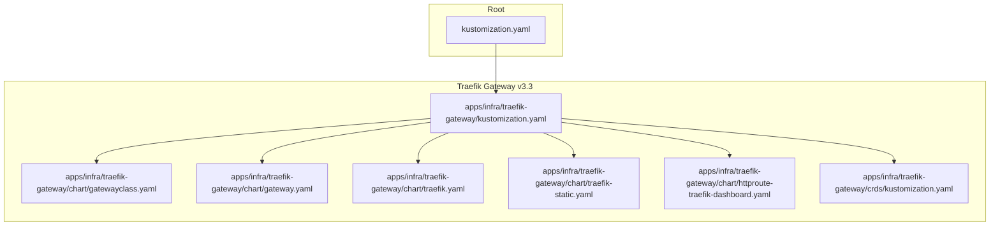
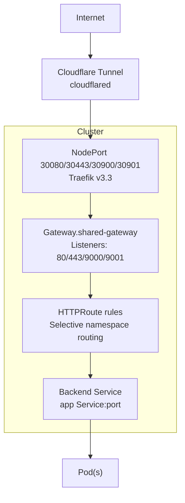
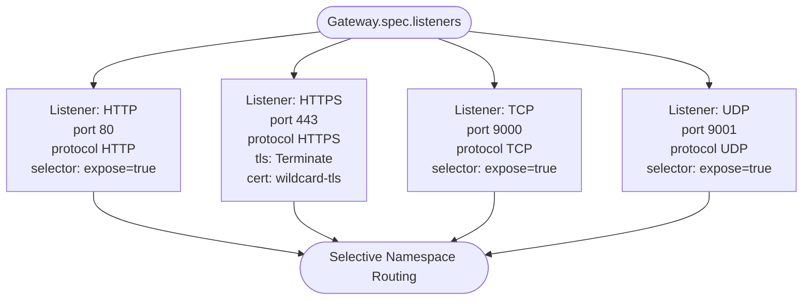
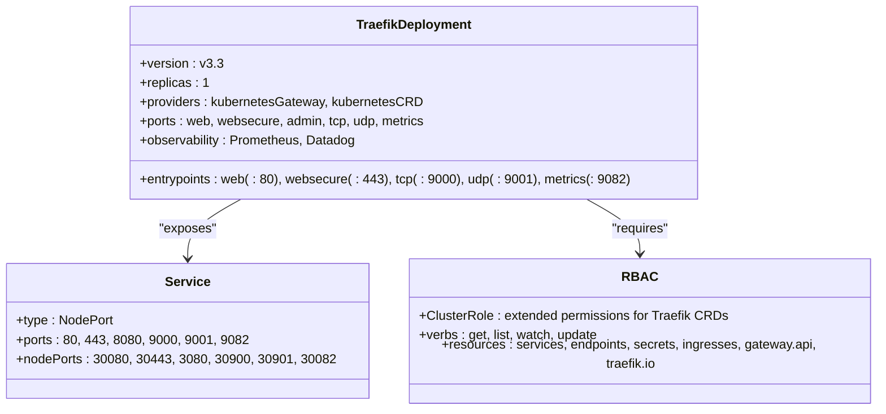
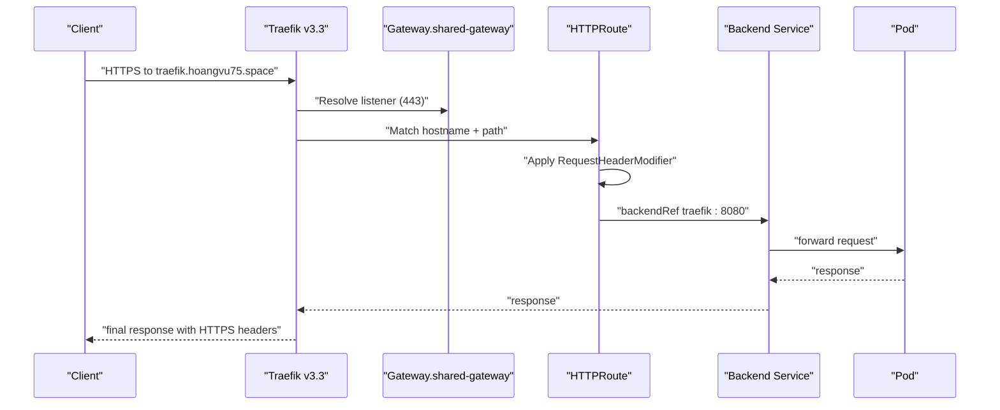
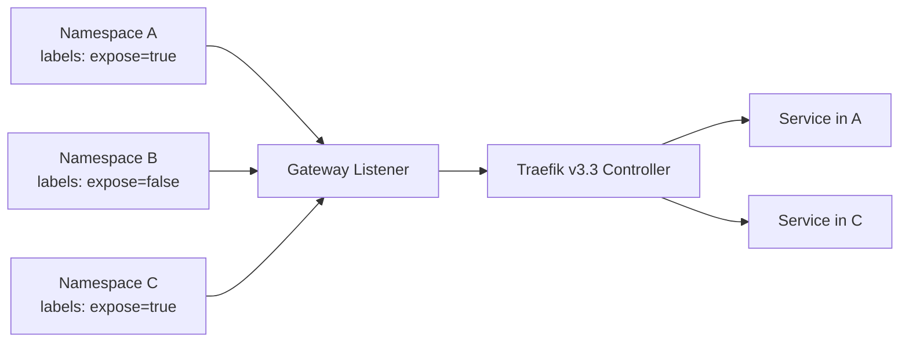

# Gateway API Controller

<cite>
**Referenced Files in This Document**
- [gatewayclass.yaml](file://apps/infra/traefik-gateway/chart/gatewayclass.yaml)
- [gateway.yaml](file://apps/infra/traefik-gateway/chart/gateway.yaml)
- [traefik.yaml](file://apps/infra/traefik-gateway/chart/traefik.yaml)
- [traefik-static.yaml](file://apps/infra/traefik-gateway/chart/traefik-static.yaml)
- [httproute-traefik-dashboard.yaml](file://apps/infra/traefik-gateway/chart/httproute-traefik-dashboard.yaml)
- [kustomization.yaml](file://apps/infra/traefik-gateway/kustomization.yaml)
- [config.yaml](file://apps/infra/traefik-gateway/config.yaml)
- [crds/kustomization.yaml](file://apps/infra/traefik-gateway/crds/kustomization.yaml)
- [kustomization.yaml (root)](file://kustomization.yaml)
- [README.md](file://README.md)
</cite>

## Update Summary
**Changes Made**
- Complete migration from legacy gateway-api implementation to new Traefik Gateway v3.3 implementation
- Replaced old gateway-api directory with new traefik-gateway directory structure
- Updated GatewayClass controller name from generic to Traefik-specific controller identifier
- Enhanced Traefik deployment with v3.3 features and improved CRD support
- Implemented selective namespace routing using label selectors instead of global access
- Added comprehensive TCP/UDP support with dedicated entry points
- Integrated advanced observability with Prometheus metrics and Datadog tracing
- Updated Traefik static configuration with enhanced logging and metrics

## Table of Contents
1. [Introduction](#introduction)
2. [Project Structure](#project-structure)
3. [Core Components](#core-components)
4. [Architecture Overview](#architecture-overview)
5. [Detailed Component Analysis](#detailed-component-analysis)
6. [Traefik Gateway v3.3 Implementation](#traefik-gateway-v33-implementation)
7. [Enhanced Routing Capabilities](#enhanced-routing-capabilities)
8. [Observability and Monitoring](#observability-and-monitoring)
9. [Performance Considerations](#performance-considerations)
10. [Troubleshooting Guide](#troubleshooting-guide)
11. [Conclusion](#conclusion)
12. [Appendices](#appendices)

## Introduction
This document explains the Gateway API controller implementation using Traefik Gateway v3.3 as the ingress controller. The implementation has been completely migrated from the legacy gateway-api implementation to leverage Traefik's native Gateway API support with enhanced CRD capabilities and improved routing features. The new implementation provides better performance, advanced observability, and comprehensive protocol support including TCP and UDP alongside HTTP/HTTPS traffic.

## Project Structure
The Gateway API stack is now organized under apps/infra/traefik-gateway with a modernized structure supporting Traefik Gateway v3.3. The implementation includes enhanced CRD support, selective namespace routing, and comprehensive observability features.

**Diagram sources**
- [kustomization.yaml (root):1-21](file://kustomization.yaml#L1-L21)
- [kustomization.yaml:1-10](file://apps/infra/traefik-gateway/kustomization.yaml#L1-L10)
- [gatewayclass.yaml:1-10](file://apps/infra/traefik-gateway/chart/gatewayclass.yaml#L1-L10)
- [gateway.yaml:1-34](file://apps/infra/traefik-gateway/chart/gateway.yaml#L1-L34)
- [traefik.yaml:1-155](file://apps/infra/traefik-gateway/chart/traefik.yaml#L1-L155)
- [traefik-static.yaml:1-42](file://apps/infra/traefik-gateway/chart/traefik-static.yaml#L1-L42)
- [httproute-traefik-dashboard.yaml:1-30](file://apps/infra/traefik-gateway/chart/httproute-traefik-dashboard.yaml#L1-L30)
- [crds/kustomization.yaml:1-9](file://apps/infra/traefik-gateway/crds/kustomization.yaml#L1-L9)

**Section sources**
- [kustomization.yaml (root):1-21](file://kustomization.yaml#L1-L21)
- [kustomization.yaml:1-10](file://apps/infra/traefik-gateway/kustomization.yaml#L1-L10)
- [README.md:1-163](file://README.md#L1-L163)

## Core Components
- **GatewayClass**: Defines the Traefik Gateway v3.3 controller with specific controller name `traefik.io/gateway-controller`
- **Gateway**: Implements selective namespace routing using label selectors and supports HTTP/HTTPS/TCP/UDP protocols
- **Traefik Deployment**: Runs Traefik v3.3 with comprehensive provider support, observability, and enhanced security
- **HTTPRoute**: Routes traffic to backend Services with advanced header manipulation and filtering
- **Static Configuration**: Provides detailed Traefik configuration with metrics, logging, and distributed tracing

Key implementation references:
- GatewayClass definition: [gatewayclass.yaml:1-10](file://apps/infra/traefik-gateway/chart/gatewayclass.yaml#L1-L10)
- Gateway listeners and selective routing: [gateway.yaml:1-34](file://apps/infra/traefik-gateway/chart/gateway.yaml#L1-L34)
- Traefik v3.3 deployment and RBAC: [traefik.yaml:1-155](file://apps/infra/traefik-gateway/chart/traefik.yaml#L1-L155)
- Static configuration: [traefik-static.yaml:1-42](file://apps/infra/traefik-gateway/chart/traefik-static.yaml#L1-L42)
- Dashboard HTTPRoute: [httproute-traefik-dashboard.yaml:1-30](file://apps/infra/traefik-gateway/chart/httproute-traefik-dashboard.yaml#L1-L30)

**Section sources**
- [gatewayclass.yaml:1-10](file://apps/infra/traefik-gateway/chart/gatewayclass.yaml#L1-L10)
- [gateway.yaml:1-34](file://apps/infra/traefik-gateway/chart/gateway.yaml#L1-L34)
- [traefik.yaml:1-155](file://apps/infra/traefik-gateway/chart/traefik.yaml#L1-L155)
- [traefik-static.yaml:1-42](file://apps/infra/traefik-gateway/chart/traefik-static.yaml#L1-L42)
- [httproute-traefik-dashboard.yaml:1-30](file://apps/infra/traefik-gateway/chart/httproute-traefik-dashboard.yaml#L1-L30)

## Architecture Overview
The system uses Cloudflare tunnel to forward traffic into the cluster, which reaches Traefik v3.3 via NodePorts. The enhanced Traefik Gateway controller routes traffic to backend Services according to Gateway and HTTPRoute resources with improved protocol support and observability.

**Diagram sources**
- [README.md:5-48](file://README.md#L5-L48)
- [gateway.yaml:10-34](file://apps/infra/traefik-gateway/chart/gateway.yaml#L10-L34)
- [traefik.yaml:118-155](file://apps/infra/traefik-gateway/chart/traefik.yaml#L118-L155)
- [httproute-traefik-dashboard.yaml:9-29](file://apps/infra/traefik-gateway/chart/httproute-traefik-dashboard.yaml#L9-L29)

**Section sources**
- [README.md:5-48](file://README.md#L5-L48)
- [gateway.yaml:10-34](file://apps/infra/traefik-gateway/chart/gateway.yaml#L10-L34)
- [traefik.yaml:118-155](file://apps/infra/traefik-gateway/chart/traefik.yaml#L118-L155)

## Detailed Component Analysis

### GatewayClass
- **Purpose**: Declares the Traefik Gateway v3.3 controller with specific controller identifier
- **Controller name**: `traefik.io/gateway-controller` for Traefik-specific implementation
- **Description**: Explicitly identifies this as Traefik's Gateway API implementation
- **Sync order**: Installed early with sync wave annotation for proper sequencing

Implementation reference:
- [gatewayclass.yaml:1-10](file://apps/infra/traefik-gateway/chart/gatewayclass.yaml#L1-L10)

**Section sources**
- [gatewayclass.yaml:1-10](file://apps/infra/traefik-gateway/chart/gatewayclass.yaml#L1-L10)

### Gateway
- **Purpose**: Defines listeners for HTTP, HTTPS, TCP, and UDP protocols with selective namespace routing
- **Selective Routing**: Uses label selectors (`routing.hoangvu75.space/expose: "true"`) instead of global namespace access
- **Listeners**:
  - HTTP: Port 80 with selective namespace routing
  - HTTPS: Port 443 with TLS termination and certificate reference
  - TCP: Port 9000 for TCP protocol support
  - UDP: Port 9001 for UDP protocol support
- **Allowed routes**: Namespaces.with.selector for fine-grained control

Implementation reference:
- [gateway.yaml:1-34](file://apps/infra/traefik-gateway/chart/gateway.yaml#L1-L34)

**Diagram sources**
- [gateway.yaml:10-34](file://apps/infra/traefik-gateway/chart/gateway.yaml#L10-L34)

**Section sources**
- [gateway.yaml:1-34](file://apps/infra/traefik-gateway/chart/gateway.yaml#L1-L34)

### Traefik Deployment and RBAC
- **Version**: Traefik v3.3 with enhanced Gateway API support
- **Provider configuration**:
  - Kubernetes Gateway provider enabled
  - Kubernetes CRD provider with cross-namespace support
- **Enhanced Entrypoints**:
  - web: :80 (HTTP)
  - websecure: :443 (HTTPS)
  - tcp: :9000 (TCP)
  - udp: :9001 (UDP)
  - metrics: :9082 (Prometheus metrics)
- **Comprehensive RBAC**:
  - Extended permissions for Traefik CRDs (ingressroutes, middlewares, etc.)
  - Support for EndpointSlices and ConfigMaps
  - Enhanced metrics and tracing permissions
- **Observability Integration**:
  - Prometheus scraping annotations
  - Datadog OpenMetrics integration
  - Metrics endpoint exposed via NodePort

Implementation reference:
- [traefik.yaml:1-155](file://apps/infra/traefik-gateway/chart/traefik.yaml#L1-L155)

**Diagram sources**
- [traefik.yaml:57-155](file://apps/infra/traefik-gateway/chart/traefik.yaml#L57-L155)

**Section sources**
- [traefik.yaml:1-155](file://apps/infra/traefik-gateway/chart/traefik.yaml#L1-L155)

### HTTPRoute Definitions and Dashboard Integration
- **Dashboard HTTPRoute**:
  - Parent: shared-gateway in gateway-api namespace
  - Hostname: traefik.hoangvu75.space
  - Path: PathPrefix "/"
  - Advanced filters: RequestHeaderModifier for X-Forwarded-Proto and X-Forwarded-Port
  - Backend: traefik:8080 (admin endpoint)
- **Enhanced Header Manipulation**:
  - Automatic HTTPS detection and forwarding headers
  - Proper port forwarding for secure connections
  - Protocol preservation for backend services

Implementation references:
- [httproute-traefik-dashboard.yaml:1-30](file://apps/infra/traefik-gateway/chart/httproute-traefik-dashboard.yaml#L1-L30)

**Diagram sources**
- [gateway.yaml:10-34](file://apps/infra/traefik-gateway/chart/gateway.yaml#L10-L34)
- [httproute-traefik-dashboard.yaml:9-29](file://apps/infra/traefik-gateway/chart/httproute-traefik-dashboard.yaml#L9-L29)

**Section sources**
- [httproute-traefik-dashboard.yaml:1-30](file://apps/infra/traefik-gateway/chart/httproute-traefik-dashboard.yaml#L1-L30)

### Static Configuration
- **API Settings**: Insecure API enabled for development
- **Providers**: 
  - Kubernetes CRD with cross-namespace support
  - Kubernetes Gateway provider
- **Enhanced Entrypoints**: HTTP, HTTPS, TCP, UDP, and metrics
- **Observability**:
  - Prometheus metrics with custom endpoint
  - JSON formatted access logs with status code filtering
  - OpenTelemetry tracing via Datadog
- **Logging**: INFO level with structured JSON output

Implementation reference:
- [traefik-static.yaml:1-42](file://apps/infra/traefik-gateway/chart/traefik-static.yaml#L1-L42)

**Section sources**
- [traefik-static.yaml:1-42](file://apps/infra/traefik-gateway/chart/traefik-static.yaml#L1-L42)

## Traefik Gateway v3.3 Implementation

**Updated** The implementation has been completely migrated to Traefik Gateway v3.3, providing enhanced CRD support, improved routing capabilities, and comprehensive protocol handling.

### Key Enhancements
- **Native Gateway API Support**: Built-in Traefik controller eliminates need for external implementations
- **Enhanced CRD Support**: Comprehensive support for Traefik-specific CRDs (IngressRoute, Middleware, etc.)
- **Protocol Diversity**: Full support for HTTP, HTTPS, TCP, and UDP protocols
- **Advanced Observability**: Integrated Prometheus metrics and distributed tracing
- **Selective Routing**: Label-based namespace filtering for granular access control

### Migration Benefits
- **Improved Performance**: Optimized routing engine in v3.3
- **Better Reliability**: Enhanced stability and resource management
- **Extended Features**: Native support for advanced Traefik features
- **Simplified Management**: Single controller handles all routing needs

**Section sources**
- [gatewayclass.yaml:8](file://apps/infra/traefik-gateway/chart/gatewayclass.yaml#L8)
- [traefik.yaml:88](file://apps/infra/traefik-gateway/chart/traefik.yaml#L88)
- [gateway.yaml:14-28](file://apps/infra/traefik-gateway/chart/gateway.yaml#L14-L28)

## Enhanced Routing Capabilities

### Selective Namespace Routing
The new implementation uses label selectors instead of global namespace access for enhanced security and control:

**Diagram sources**
- [gateway.yaml:14-28](file://apps/infra/traefik-gateway/chart/gateway.yaml#L14-L28)

### Multi-Protocol Support
Traefik v3.3 provides comprehensive protocol support:

- **HTTP/HTTPS**: Standard web traffic with TLS termination
- **TCP**: Layer 4 load balancing for databases, APIs, etc.
- **UDP**: Real-time applications like DNS, DHCP, gaming servers
- **Mixed Workloads**: Single gateway handles diverse traffic types

**Section sources**
- [gateway.yaml:10-34](file://apps/infra/traefik-gateway/chart/gateway.yaml#L10-L34)
- [traefik.yaml:118-155](file://apps/infra/traefik-gateway/chart/traefik.yaml#L118-L155)

## Observability and Monitoring

### Integrated Metrics
- **Prometheus Integration**: Automatic scraping with custom metrics endpoint
- **Datadog Tracing**: OpenTelemetry support for distributed tracing
- **Structured Logging**: JSON formatted access logs with filtering
- **Health Checks**: Built-in monitoring endpoints

### Metrics Configuration
- **Endpoint**: :9082 (NodePort 30082)
- **Format**: OpenMetrics compatible
- **Labels**: Entry points and services automatically labeled
- **Collection**: Supported by Prometheus and Datadog integrations

**Section sources**
- [traefik-static.yaml:22-27](file://apps/infra/traefik-gateway/chart/traefik-static.yaml#L22-L27)
- [traefik.yaml:74-79](file://apps/infra/traefik-gateway/chart/traefik.yaml#L74-L79)
- [traefik.yaml:122-127](file://apps/infra/traefik-gateway/chart/traefik.yaml#L122-L127)

## Performance Considerations
- **Resource Optimization**: Reduced memory footprint with v3.3 improvements
- **Multi-Protocol Efficiency**: Single instance handles HTTP, TCP, and UDP traffic
- **Connection Pooling**: Enhanced connection reuse and management
- **Metrics Overhead**: Minimal impact from integrated observability
- **Scalability**: Horizontal scaling supported with leader election via Leases

## Troubleshooting Guide
Common issues and resolutions:
- **GatewayClass not found**:
  - Ensure Traefik Gateway v3.3 CRDs are installed before applying GatewayClass
  - Verify controllerName matches `traefik.io/gateway-controller`
- **Gateway not ready**:
  - Confirm selective namespace labels match the `routing.hoangvu75.space/expose: "true"` requirement
  - Check that TLS certificate Secret exists and is accessible
  - Verify label selectors are properly configured
- **HTTPRoute not routing**:
  - Verify parentRefs point to the correct Gateway and namespace
  - Ensure hostnames match the incoming request and pathPrefix aligns with the request path
  - Confirm backendRefs target the correct Service and port
  - Check that the target namespace has the required expose label
- **Protocol Issues**:
  - Verify appropriate listener ports (80/443 for HTTP/HTTPS, 9000 for TCP, 9001 for UDP)
  - Check that client applications connect to the correct protocol
- **Observability Problems**:
  - Confirm metrics endpoint is accessible at :9082
  - Verify Prometheus/Datadog configurations are correct
  - Check that scraping annotations are present on the Traefik pod

**Section sources**
- [gatewayclass.yaml:8](file://apps/infra/traefik-gateway/chart/gatewayclass.yaml#L8)
- [gateway.yaml:9-34](file://apps/infra/traefik-gateway/chart/gateway.yaml#L9-L34)
- [httproute-traefik-dashboard.yaml:9-29](file://apps/infra/traefik-gateway/chart/httproute-traefik-dashboard.yaml#L9-L29)
- [traefik.yaml:74-79](file://apps/infra/traefik-gateway/chart/traefik.yaml#L74-L79)

## Conclusion
The migration to Traefik Gateway v3.3 represents a significant advancement in the Gateway API implementation, providing enhanced performance, comprehensive protocol support, and integrated observability. The new implementation leverages Traefik's native Gateway API capabilities with selective namespace routing, multi-protocol support, and advanced monitoring features. This modernized approach maintains backward compatibility while introducing powerful new capabilities for managing complex routing scenarios in Kubernetes environments.

## Appendices

### Migration from Legacy Implementation
- **Old Implementation**: Separate gateway-api directory with basic HTTP routing
- **New Implementation**: Dedicated traefik-gateway directory with v3.3 features
- **Enhanced Capabilities**: TCP/UDP support, selective routing, advanced observability
- **Configuration Changes**: Updated controller names, enhanced RBAC, new static config

### Sync Order and Namespace Management
- **Sync waves**: CRDs (-1), Traefik (0), Gateway (1), Routes (2+)
- **Namespace configuration**: Dedicated `gateway-api` namespace with automatic creation
- **Label-based routing**: Selective namespace access via `routing.hoangvu75.space/expose` labels

**Section sources**
- [config.yaml:1-5](file://apps/infra/traefik-gateway/config.yaml#L1-L5)
- [gateway.yaml:14-28](file://apps/infra/traefik-gateway/chart/gateway.yaml#L14-L28)

### Enhanced Configuration Examples

#### Selective Namespace Routing
- Use label selectors instead of global namespace access
- Apply `routing.hoangvu75.space/expose: "true"` to namespaces requiring access
- Configure Gateway listeners with `from: Selector` and appropriate selectors

References:
- [gateway.yaml:14-28](file://apps/infra/traefik-gateway/chart/gateway.yaml#L14-L28)

#### Multi-Protocol Traffic Handling
- Configure separate listeners for different protocols
- Use appropriate NodePorts for each protocol (30080, 30443, 30900, 30901)
- Implement protocol-specific routing rules

References:
- [gateway.yaml:10-34](file://apps/infra/traefik-gateway/chart/gateway.yaml#L10-L34)
- [traefik.yaml:118-155](file://apps/infra/traefik-gateway/chart/traefik.yaml#L118-L155)

#### Advanced Observability Setup
- Enable Prometheus metrics with custom endpoint
- Configure Datadog tracing integration
- Set up structured logging with filtering

References:
- [traefik-static.yaml:22-39](file://apps/infra/traefik-gateway/chart/traefik-static.yaml#L22-L39)
- [traefik.yaml:74-79](file://apps/infra/traefik-gateway/chart/traefik.yaml#L74-L79)

### Traefik Gateway v3.3 Feature Matrix
- **Gateway API Support**: Native implementation with full specification compliance
- **Protocol Support**: HTTP/HTTPS/TCP/UDP with advanced routing
- **Observability**: Prometheus metrics, Datadog tracing, structured logging
- **Security**: TLS termination, certificate management, RBAC integration
- **Performance**: Optimized routing engine, connection pooling, resource efficiency
- **Extensibility**: Comprehensive CRD support for advanced routing scenarios

**Section sources**
- [gatewayclass.yaml:8](file://apps/infra/traefik-gateway/chart/gatewayclass.yaml#L8)
- [traefik.yaml:88](file://apps/infra/traefik-gateway/chart/traefik.yaml#L88)
- [traefik-static.yaml:1-42](file://apps/infra/traefik-gateway/chart/traefik-static.yaml#L1-L42)