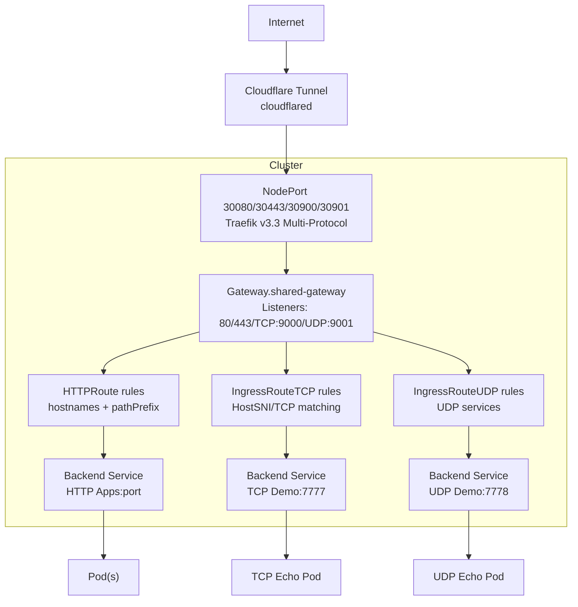
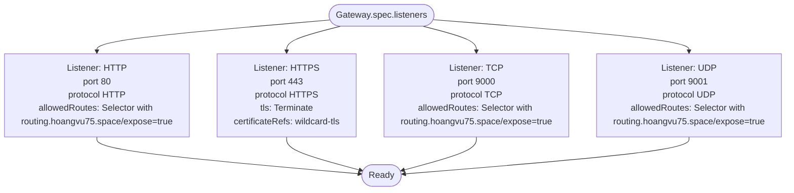
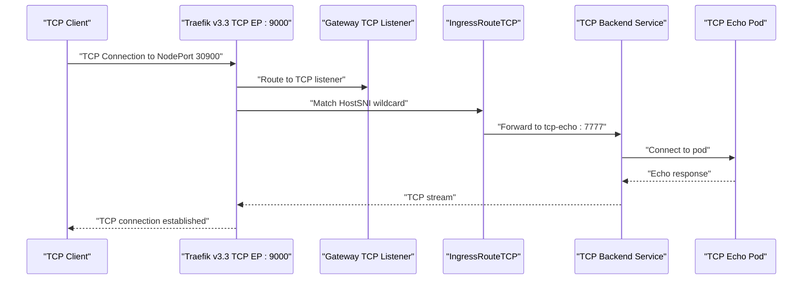
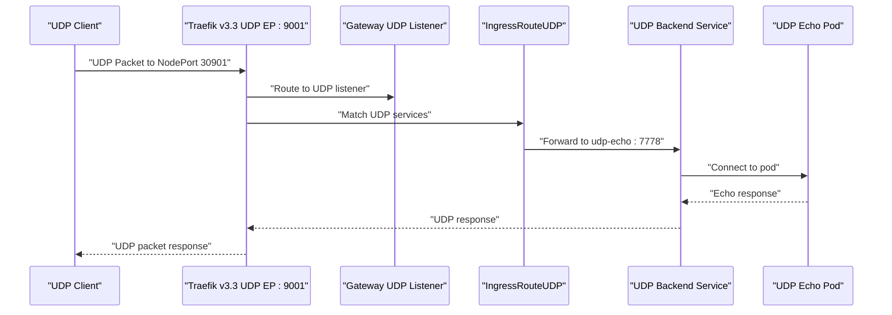
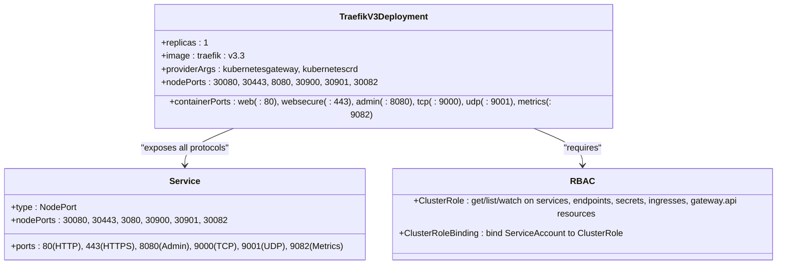
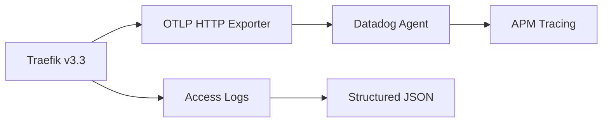
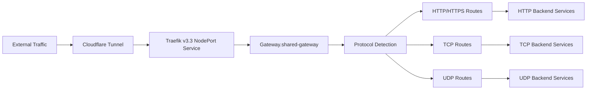

# Gateway API Controller

<cite>
**Referenced Files in This Document**
- [gatewayclass.yaml](file://apps/infra/gateway-api/chart/gatewayclass.yaml)
- [gateway.yaml](file://apps/infra/gateway-api/chart/gateway.yaml)
- [traefik.yaml](file://apps/infra/gateway-api/chart/traefik.yaml)
- [traefik-config.yaml](file://apps/infra/gateway-api/chart/traefik-config.yaml)
- [httproute-traefik-dashboard.yaml](file://apps/infra/gateway-api/chart/httproute-traefik-dashboard.yaml)
- [httproute-rancher.yaml](file://apps/playground/rancher/chart/httproute-rancher.yaml)
- [httproute-argocd.yaml](file://apps/playground/argocd-ingress/chart/httproute-argocd.yaml)
- [values-httproute.yaml](file://apps/playground/hello-api/chart/values-httproute.yaml)
- [ingressroutetcp.yaml](file://apps/applications/tcp-demo/chart/ingressroutetcp.yaml)
- [ingressrouteudp.yaml](file://apps/applications/udp-demo/chart/ingressrouteudp.yaml)
- [deployment.yaml (tcp-demo)](file://apps/applications/tcp-demo/chart/deployment.yaml)
- [deployment.yaml (udp-demo)](file://apps/applications/udp-demo/chart/deployment.yaml)
- [service.yaml (tcp-demo)](file://apps/applications/tcp-demo/chart/service.yaml)
- [service.yaml (udp-demo)](file://apps/applications/udp-demo/chart/service.yaml)
- [kustomization.yaml (gateway-api)](file://apps/infra/gateway-api/kustomization.yaml)
- [kustomization.yaml (tcp-demo)](file://apps/applications/tcp-demo/kustomization.yaml)
- [kustomization.yaml (udp-demo)](file://apps/applications/udp-demo/kustomization.yaml)
- [kustomization.yaml (root)](file://kustomization.yaml)
- [README.md](file://README.md)
- [README.md (tcp-udp-demo)](file://guide/tcp-udp-demo/README.md)
- [config.yaml (gateway-api)](file://apps/infra/gateway-api/config.yaml)
- [tls-rancher-ca.yaml](file://apps/playground/cert-manager/chart/tls-rancher-ca.yaml)
</cite>

## Update Summary
**Changes Made**
- Updated Traefik version to v3.3 with enhanced CRD integration for TCP/UDP ingress routing
- Migrated distributed tracing configuration from openTelemetry to otlp.http format for Traefik v3.x compatibility
- Added experimental KubernetesGateway provider channel for improved Gateway API support
- Enhanced Traefik deployment with dedicated TCP/UDP container ports and NodePort exposure
- Updated static configuration to support TCP/UDP entrypoints with proper protocol handling

## Table of Contents
1. [Introduction](#introduction)
2. [Project Structure](#project-structure)
3. [Core Components](#core-components)
4. [Architecture Overview](#architecture-overview)
5. [Enhanced Gateway API Configuration](#enhanced-gateway-api-configuration)
6. [Layer 4 Routing Implementation](#layer-4-routing-implementation)
7. [Traefik v3.x Deployment and Configuration](#traefik-v3x-deployment-and-configuration)
8. [Demo Applications](#demo-applications)
9. [Traffic Routing Patterns](#traffic-routing-patterns)
10. [Load Balancing and High Availability](#load-balancing-and-high-availability)
11. [Certificate Management](#certificate-management)
12. [Monitoring and Observability](#monitoring-and-observability)
13. [Performance Optimization](#performance-optimization)
14. [Troubleshooting Guide](#troubleshooting-guide)
15. [Conclusion](#conclusion)
16. [Appendices](#appendices)

## Introduction
This document explains the enhanced Gateway API controller implementation using Traefik v3.3 as the ingress controller, featuring comprehensive Layer 4 routing capabilities with full Traefik v3.x compatibility. The system extends beyond traditional HTTP/HTTPS routing to include TCP and UDP entrypoints, significantly expanding networking capabilities through enhanced CRD integration and modernized distributed tracing configuration.

## Project Structure
The enhanced Gateway API stack now includes dedicated TCP and UDP demo applications alongside the existing HTTP/HTTPS infrastructure, all running on Traefik v3.3 with improved CRD support and modernized observability features.

```mermaid
graph TB
subgraph "Root"
ROOT["kustomization.yaml"]
end
subgraph "Gateway API Infrastructure"
GA_K["apps/infra/gateway-api/kustomization.yaml"]
GA_GC["apps/infra/gateway-api/chart/gatewayclass.yaml"]
GA_GW["apps/infra/gateway-api/chart/gateway.yaml"]
GA_TR["apps/infra/gateway-api/chart/traefik.yaml"]
GA_TC["apps/infra/gateway-api/chart/traefik-config.yaml"]
GA_HD["apps/infra/gateway-api/chart/httproute-traefik-dashboard.yaml"]
end
subgraph "HTTP/HTTPS Applications"
HTTP_RN["apps/playground/rancher/chart/httproute-rancher.yaml"]
HTTP_AD["apps/playground/argocd-ingress/chart/httproute-argocd.yaml"]
HTTP_HL["apps/playground/hello-api/chart/values-httproute.yaml"]
end
subgraph "TCP/UDP Demo Applications"
TCP_DEMO["apps/applications/tcp-demo/"]
UDP_DEMO["apps/applications/udp-demo/"]
TCP_IR["apps/applications/tcp-demo/chart/ingressroutetcp.yaml"]
UDP_IR["apps/applications/udp-demo/chart/ingressrouteudp.yaml"]
TCP_DEP["apps/applications/tcp-demo/chart/deployment.yaml"]
UDP_DEP["apps/applications/udp-demo/chart/deployment.yaml"]
TCP_SVC["apps/applications/tcp-demo/chart/service.yaml"]
UDP_SVC["apps/applications/udp-demo/chart/service.yaml"]
end
subgraph "Cert Management"
CM_CA["apps/playground/cert-manager/chart/tls-rancher-ca.yaml"]
end
ROOT --> GA_K
GA_K --> GA_GC
GA_K --> GA_GW
GA_K --> GA_TR
GA_K --> GA_TC
GA_K --> GA_HD
GA_K --> HTTP_RN
GA_K --> HTTP_AD
GA_K --> HTTP_HL
GA_K --> TCP_DEMO
GA_K --> UDP_DEMO
GA_K --> CM_CA
TCP_DEMO --> TCP_IR
TCP_DEMO --> TCP_DEP
TCP_DEMO --> TCP_SVC
UDP_DEMO --> UDP_IR
UDP_DEMO --> UDP_DEP
UDP_DEMO --> UDP_SVC
```

**Diagram sources**
- [kustomization.yaml (root):1-21](file://kustomization.yaml#L1-L21)
- [kustomization.yaml (gateway-api):1-9](file://apps/infra/gateway-api/kustomization.yaml#L1-L9)
- [gatewayclass.yaml:1-10](file://apps/infra/gateway-api/chart/gatewayclass.yaml#L1-L10)
- [gateway.yaml:1-51](file://apps/infra/gateway-api/chart/gateway.yaml#L1-L51)
- [traefik.yaml:1-144](file://apps/infra/gateway-api/chart/traefik.yaml#L1-L144)
- [traefik-config.yaml:1-64](file://apps/infra/gateway-api/chart/traefik-config.yaml#L1-L64)
- [ingressroutetcp.yaml:1-21](file://apps/applications/tcp-demo/chart/ingressroutetcp.yaml#L1-L21)
- [ingressrouteudp.yaml:1-20](file://apps/applications/udp-demo/chart/ingressrouteudp.yaml#L1-L20)

**Section sources**
- [kustomization.yaml (root):1-21](file://kustomization.yaml#L1-L21)
- [kustomization.yaml (gateway-api):1-9](file://apps/infra/gateway-api/kustomization.yaml#L1-L9)
- [README.md:108-161](file://README.md#L108-L161)

## Core Components
The enhanced system now includes comprehensive Layer 4 routing capabilities alongside traditional HTTP/HTTPS routing, powered by Traefik v3.3:

- **GatewayClass**: Defines the controller that implements the Gateway API with Traefik v3.3 as the provider
- **Gateway**: Extended with HTTP, HTTPS, TCP, and UDP listeners supporting diverse traffic types
- **Traefik v3.3 Deployment**: Enhanced with dedicated TCP/UDP container ports and NodePort exposure
- **Static Configuration**: Supports TCP/UDP entrypoints with proper protocol handling and experimental Gateway provider
- **Demo Applications**: TCP and UDP echo servers demonstrating Layer 4 routing capabilities

**Section sources**
- [gatewayclass.yaml:1-10](file://apps/infra/gateway-api/chart/gatewayclass.yaml#L1-L10)
- [gateway.yaml:1-51](file://apps/infra/gateway-api/chart/gateway.yaml#L1-L51)
- [traefik.yaml:78-144](file://apps/infra/gateway-api/chart/traefik.yaml#L78-L144)
- [traefik-config.yaml:27-38](file://apps/infra/gateway-api/chart/traefik-config.yaml#L27-L38)

## Architecture Overview
The enhanced architecture now supports both Layer 7 HTTP/HTTPS and Layer 4 TCP/UDP traffic routing through Traefik v3.3 with improved CRD integration and modernized observability.

**Diagram sources**
- [README.md:5-48](file://README.md#L5-L48)
- [gateway.yaml:10-51](file://apps/infra/gateway-api/chart/gateway.yaml#L10-L51)
- [traefik.yaml:120-144](file://apps/infra/gateway-api/chart/traefik.yaml#L120-L144)
- [ingressroutetcp.yaml:14-20](file://apps/applications/tcp-demo/chart/ingressroutetcp.yaml#L14-L20)
- [ingressrouteudp.yaml:14-19](file://apps/applications/udp-demo/chart/ingressrouteudp.yaml#L14-L19)

**Section sources**
- [README.md:5-48](file://README.md#L5-L48)
- [gateway.yaml:10-51](file://apps/infra/gateway-api/chart/gateway.yaml#L10-L51)
- [traefik.yaml:120-144](file://apps/infra/gateway-api/chart/traefik.yaml#L120-L144)

## Enhanced Gateway API Configuration

### Gateway Resource Extensions
The Gateway resource now includes four distinct listeners supporting different protocols:

**Diagram sources**
- [gateway.yaml:10-51](file://apps/infra/gateway-api/chart/gateway.yaml#L10-L51)

**Section sources**
- [gateway.yaml:1-51](file://apps/infra/gateway-api/chart/gateway.yaml#L1-L51)

### Listener Protocol Support
Each listener type serves specific traffic patterns:

- **HTTP Listener (port 80)**: Standard HTTP routing for web applications
- **HTTPS Listener (port 443)**: Secure HTTP with TLS termination and certificate management
- **TCP Listener (port 9000)**: Layer 4 TCP forwarding for databases, message queues, and custom TCP services
- **UDP Listener (port 9001)**: Layer 4 UDP forwarding for DNS, DHCP, and real-time applications

**Section sources**
- [gateway.yaml:10-51](file://apps/infra/gateway-api/chart/gateway.yaml#L10-L51)

## Layer 4 Routing Implementation

### TCP Routing Configuration
The IngressRouteTCP resource demonstrates TCP traffic forwarding from Traefik's TCP entrypoint to backend services:

**Diagram sources**
- [ingressroutetcp.yaml:14-20](file://apps/applications/tcp-demo/chart/ingressroutetcp.yaml#L14-L20)
- [deployment.yaml (tcp-demo):19](file://apps/applications/tcp-demo/chart/deployment.yaml#L19)
- [service.yaml (tcp-demo):12-13](file://apps/applications/tcp-demo/chart/service.yaml#L12-L13)

**Section sources**
- [ingressroutetcp.yaml:1-21](file://apps/applications/tcp-demo/chart/ingressroutetcp.yaml#L1-L21)
- [deployment.yaml (tcp-demo):1-28](file://apps/applications/tcp-demo/chart/deployment.yaml#L1-L28)
- [service.yaml (tcp-demo):1-14](file://apps/applications/tcp-demo/chart/service.yaml#L1-L14)

### UDP Routing Configuration
The IngressRouteUDP resource handles UDP traffic forwarding with proper protocol considerations:

**Diagram sources**
- [ingressrouteudp.yaml:14-19](file://apps/applications/udp-demo/chart/ingressrouteudp.yaml#L14-L19)
- [deployment.yaml (udp-demo):19](file://apps/applications/udp-demo/chart/deployment.yaml#L19)
- [service.yaml (udp-demo):12-15](file://apps/applications/udp-demo/chart/service.yaml#L12-L15)

**Section sources**
- [ingressrouteudp.yaml:1-20](file://apps/applications/udp-demo/chart/ingressrouteudp.yaml#L1-L20)
- [deployment.yaml (udp-demo):1-29](file://apps/applications/udp-demo/chart/deployment.yaml#L1-L29)
- [service.yaml (udp-demo):1-15](file://apps/applications/udp-demo/chart/service.yaml#L1-L15)

## Traefik v3.x Deployment and Configuration

### Enhanced Container Configuration
The Traefik v3.3 deployment now includes dedicated ports for TCP and UDP protocols with improved CRD support:

**Diagram sources**
- [traefik.yaml:78-144](file://apps/infra/gateway-api/chart/traefik.yaml#L78-L144)

**Section sources**
- [traefik.yaml:78-144](file://apps/infra/gateway-api/chart/traefik.yaml#L78-L144)

### Static Configuration Extensions
The Traefik v3.3 static configuration now supports dedicated entrypoints for each protocol with enhanced CRD integration:

- **web**: HTTP entrypoint (:80) for standard web traffic
- **websecure**: HTTPS entrypoint (:443) with TLS termination
- **tcp**: TCP entrypoint (:9000) for Layer 4 TCP forwarding
- **udp**: UDP entrypoint (:9001/udp) for Layer 4 UDP forwarding
- **metrics**: Prometheus metrics entrypoint (:9082) for monitoring

**Updated** Enhanced with experimental KubernetesGateway provider and modernized distributed tracing configuration

**Section sources**
- [traefik-config.yaml:27-45](file://apps/infra/gateway-api/chart/traefik-config.yaml#L27-L45)

### Distributed Tracing Configuration
Traefik v3.3 now uses OTLP HTTP format for distributed tracing compatibility:

**Diagram sources**
- [traefik-config.yaml:55-60](file://apps/infra/gateway-api/chart/traefik-config.yaml#L55-L60)

**Section sources**
- [traefik-config.yaml:55-60](file://apps/infra/gateway-api/chart/traefik-config.yaml#L55-L60)

## Demo Applications

### TCP Echo Server
The tcp-demo application demonstrates TCP routing capabilities with a simple echo service:

- **Service**: ClusterIP service exposing port 7777
- **Deployment**: Alpine socat container listening on TCP port 7777
- **Routing**: IngressRouteTCP forwards traffic from Traefik's TCP entrypoint to the service
- **Testing**: Netcat client connects to NodePort 30900 for TCP echo functionality

**Section sources**
- [deployment.yaml (tcp-demo):16-28](file://apps/applications/tcp-demo/chart/deployment.yaml#L16-L28)
- [service.yaml (tcp-demo):7-14](file://apps/applications/tcp-demo/chart/service.yaml#L7-L14)
- [ingressroutetcp.yaml:14-20](file://apps/applications/tcp-demo/chart/ingressroutetcp.yaml#L14-L20)

### UDP Echo Server
The udp-demo application showcases UDP routing with connectionless communication:

- **Service**: ClusterIP service with UDP protocol on port 7778
- **Deployment**: Alpine socat container listening on UDP port 7778
- **Routing**: IngressRouteUDP forwards UDP packets from Traefik's UDP entrypoint
- **Testing**: Netcat client uses UDP flag (-u) to connect to NodePort 30901

**Section sources**
- [deployment.yaml (udp-demo):16-29](file://apps/applications/udp-demo/chart/deployment.yaml#L16-L29)
- [service.yaml (udp-demo):7-15](file://apps/applications/udp-demo/chart/service.yaml#L7-L15)
- [ingressrouteudp.yaml:14-19](file://apps/applications/udp-demo/chart/ingressrouteudp.yaml#L14-L19)

## Traffic Routing Patterns

### Multi-Protocol Traffic Flow
The enhanced system supports diverse traffic routing patterns with Traefik v3.3:

**Diagram sources**
- [gateway.yaml:10-51](file://apps/infra/gateway-api/chart/gateway.yaml#L10-L51)
- [traefik.yaml:120-144](file://apps/infra/gateway-api/chart/traefik.yaml#L120-L144)

### Namespace-Based Routing Control
All protocol listeners use namespace selectors to control traffic routing:

- **Selector Pattern**: `routing.hoangvu75.space/expose: "true"`
- **Scope**: Controls which namespaces can send traffic to each listener type
- **Security**: Prevents unauthorized namespace access to specific entrypoints

**Section sources**
- [gateway.yaml:14-19](file://apps/infra/gateway-api/chart/gateway.yaml#L14-L19)
- [gateway.yaml:23-28](file://apps/infra/gateway-api/chart/gateway.yaml#L23-L28)
- [gateway.yaml:37-42](file://apps/infra/gateway-api/chart/gateway.yaml#L37-L42)
- [gateway.yaml:46-51](file://apps/infra/gateway-api/chart/gateway.yaml#L46-L51)

## Load Balancing and High Availability

### Multi-Instance Deployment
For high-traffic scenarios, implement horizontal scaling:

- **Replica Scaling**: Increase Traefik replicas beyond 1 for redundancy
- **NodePort Distribution**: Each instance receives traffic on designated NodePorts
- **Health Checks**: Implement readiness probes for graceful scaling
- **Resource Limits**: Configure appropriate CPU/memory requests/limits

### Load Balancer Integration
Consider using LoadBalancer services for external traffic distribution:

- **External Load Balancer**: Distribute traffic across multiple Traefik instances
- **Session Persistence**: Configure sticky sessions for stateful applications
- **Health Monitoring**: Integrate with cloud provider health checks

## Certificate Management

### TLS Configuration
The HTTPS listener utilizes wildcard certificates for secure HTTP routing:

- **Certificate Reference**: wildcard-tls Secret in gateway-api namespace
- **TLS Mode**: Terminate TLS at the Gateway level
- **Certificate Validation**: Ensure certificate SANs match configured hostnames

**Section sources**
- [gateway.yaml:29-33](file://apps/infra/gateway-api/chart/gateway.yaml#L29-L33)

### Certificate Automation
Integrate with cert-manager for automated certificate management:

- **ACME Integration**: Automatic certificate issuance and renewal
- **DNS Challenges**: Configure DNS01 challenges for wildcard certificates
- **Secret Rotation**: Automated certificate rotation without downtime

## Monitoring and Observability

### Enhanced Metrics Collection
Traefik v3.3 provides comprehensive metrics for all protocol types:

- **Prometheus Metrics**: Exposed on port 9082 with protocol-specific metrics
- **Access Logs**: Structured JSON logs for all traffic types
- **Dashboard Integration**: Web-based dashboard showing HTTP/TCP/UDP routers

### Protocol-Specific Monitoring
Monitor traffic patterns for each protocol type:

- **TCP Metrics**: Connection counts, throughput, and latency
- **UDP Metrics**: Packet counts, error rates, and connectionless metrics
- **Combined Metrics**: Overall Traefik v3.3 performance across all protocols

### Distributed Tracing
Enhanced observability with modernized tracing:

- **OTLP HTTP Format**: Compatible with modern APM systems
- **Datadog Integration**: Direct export to Datadog Agent for APM
- **Structured Traces**: Detailed trace information for debugging

**Section sources**
- [traefik-config.yaml:40-65](file://apps/infra/gateway-api/chart/traefik-config.yaml#L40-L65)

## Performance Optimization

### Resource Allocation
Optimize Traefik v3.3 performance for multi-protocol workloads:

- **CPU Resources**: Scale CPU requests/limits based on expected concurrent connections
- **Memory Management**: Monitor memory usage for TCP/UDP connection tracking
- **Connection Limits**: Configure max connections per protocol type

### Network Optimization
Implement network-level optimizations:

- **Connection Pooling**: Reuse connections for persistent TCP services
- **UDP Buffer Management**: Optimize buffer sizes for high-throughput UDP applications
- **Protocol-Specific Tuning**: Tune kernel parameters for TCP/UDP performance

## Troubleshooting Guide

### Multi-Protocol Issues
Common problems and solutions for enhanced routing:

- **TCP/UDP Not Receiving Traffic**:
  - Verify NodePort service exposes ports 30900/30901
  - Check Traefik v3.3 container ports include tcp/udp entries
  - Confirm Gateway listeners accept traffic from target namespaces

- **TCP Echo Not Working**:
  - Test with netcat: `nc <node-ip> 30900`
  - Verify socat container is running and listening on port 7777
  - Check IngressRouteTCP entryPoints match Gateway TCP listener

- **UDP Echo Issues**:
  - Test with UDP flag: `nc -u <node-ip> 30901`
  - UDP may lose initial packets during listener setup
  - Verify socat UDP listener configuration

- **Mixed Protocol Conflicts**:
  - Ensure different protocols use non-conflicting ports
  - Check namespace selectors don't overlap incorrectly
  - Verify Traefik entrypoint addresses are unique

- **Tracing Issues**:
  - Verify OTLP HTTP endpoint connectivity
  - Check Datadog Agent availability
  - Validate trace exporter configuration

**Section sources**
- [traefik.yaml:120-144](file://apps/infra/gateway-api/chart/traefik.yaml#L120-L144)
- [gateway.yaml:10-51](file://apps/infra/gateway-api/chart/gateway.yaml#L10-L51)
- [ingressroutetcp.yaml:14-20](file://apps/applications/tcp-demo/chart/ingressroutetcp.yaml#L14-L20)
- [ingressrouteudp.yaml:14-19](file://apps/applications/udp-demo/chart/ingressrouteudp.yaml#L14-L19)

## Conclusion
The enhanced Gateway API controller implementation with Traefik v3.3 provides comprehensive multi-protocol routing capabilities, supporting HTTP/HTTPS for traditional web applications and TCP/UDP for modern cloud-native services. This expansion significantly broadens the system's networking capabilities while maintaining the proven reliability and performance of the Traefik ingress controller. The implementation demonstrates best practices for Layer 4 routing, multi-protocol traffic management, and comprehensive observability across all supported protocols, with full Traefik v3.x compatibility and modernized distributed tracing configuration.

## Appendices

### Complete Protocol Matrix
| Protocol | EntryPoint | Port | NodePort | Use Case | Security |
|----------|------------|------|----------|----------|----------|
| HTTP | web | :80 | 30080 | Traditional web apps | None |
| HTTPS | websecure | :443 | 30443 | Secure web apps | TLS Termination |
| TCP | tcp | :9000 | 30900 | Databases, APIs, Custom TCP | TLS Optional |
| UDP | udp | :9001/udp | 30901 | DNS, DHCP, Real-time | No Connection |

**Section sources**
- [traefik-config.yaml:27-38](file://apps/infra/gateway-api/chart/traefik-config.yaml#L27-L38)
- [traefik.yaml:120-144](file://apps/infra/gateway-api/chart/traefik.yaml#L120-L144)

### Traefik v3.x Compatibility Features
- **Version**: traefik:v3.3 for latest features and security updates
- **CRD Integration**: Enhanced support for TCP/UDP ingress routing
- **Experimental Provider**: KubernetesGateway experimental channel enabled
- **Modern Tracing**: OTLP HTTP format for compatibility with modern APM systems
- **Improved Performance**: Optimized resource usage and connection handling

### Testing Procedures
Comprehensive testing for multi-protocol environments:

- **HTTP/HTTPS Testing**: Validate certificate installation and TLS termination
- **TCP Testing**: Verify connection persistence and echo functionality
- **UDP Testing**: Confirm packet delivery despite connectionless nature
- **Mixed Protocol Testing**: Ensure coexistence without conflicts
- **Tracing Verification**: Validate OTLP HTTP export to Datadog Agent

**Section sources**
- [README.md (tcp-udp-demo):18-98](file://guide/tcp-udp-demo/README.md#L18-L98)

### Configuration Best Practices
- **Namespace Segregation**: Use namespace selectors to control protocol access
- **Resource Planning**: Allocate appropriate resources for expected concurrent connections
- **Monitoring Setup**: Implement comprehensive metrics collection for all protocols
- **Security Hardening**: Apply appropriate security measures for each protocol type
- **Tracing Configuration**: Ensure proper OTLP HTTP endpoint connectivity