# Gateway API Controller

<cite>
**Referenced Files in This Document**
- [gateway.yaml](file://apps/infra/gateway-api/chart/gateway.yaml)
- [gatewayclass.yaml](file://apps/infra/gateway-api/chart/gatewayclass.yaml)
- [traefik.yaml](file://apps/infra/gateway-api/chart/traefik.yaml)
- [traefik-static.yaml](file://apps/infra/gateway-api/chart/traefik-static.yaml)
- [httproute-traefik-dashboard.yaml](file://apps/infra/gateway-api/chart/httproute-traefik-dashboard.yaml)
- [kustomization.yaml (gateway-api):1-10](file://apps/infra/gateway-api/kustomization.yaml#L1-L10)
- [kustomization.yaml (gateway-api-chart):1-13](file://apps/infra/gateway-api/chart/kustomization.yaml#L1-L13)
- [kustomization.yaml (gateway-api-crds):1-9](file://apps/infra/gateway-api/crds/kustomization.yaml#L1-L9)
- [ingressroutetcp.yaml](file://apps/applications/tcp-demo/chart/ingressroutetcp.yaml)
- [ingressrouteudp.yaml](file://apps/applications/udp-demo/chart/ingressrouteudp.yaml)
- [deployment.yaml (tcp-demo)](file://apps/applications/tcp-demo/chart/deployment.yaml)
- [deployment.yaml (udp-demo)](file://apps/applications/udp-demo/chart/deployment.yaml)
- [service.yaml (tcp-demo)](file://apps/applications/tcp-demo/chart/service.yaml)
- [service.yaml (udp-demo)](file://apps/applications/udp-demo/chart/service.yaml)
- [httproute-rancher.yaml](file://apps/infra/rancher/chart/httproute-rancher.yaml)
- [httproute-argocd.yaml](file://apps/infra/argocd-ingress/chart/httproute-argocd.yaml)
- [values-httproute.yaml](file://apps/applications/hello-api/chart/values-httproute.yaml)
- [README.md](file://README.md)
- [README.md (tcp-udp-demo)](file://guide/tcp-udp-demo/README.md)
- [config.yaml (gateway-api)](file://apps/infra/gateway-api/config.yaml)
- [tls-rancher-ca.yaml](file://apps/infra/rancher/chart/tls-rancher-ca.yaml)
- [values.yaml (datadog)](file://apps/infra/datadog/chart/values.yaml)
- [config.yaml (datadog)](file://apps/infra/datadog/config.yaml)
</cite>

## Update Summary
**Changes Made**
- Enhanced Traefik metrics exposure with comprehensive Prometheus scraping annotations
- Added Datadog Autodiscovery configuration for intelligent metric collection
- Integrated Datadog Agent with OpenTelemetry HTTP exporter for APM tracing
- Implemented OpenMetrics format for standardized metric collection
- Added Prometheus service annotations for automatic scraping
- Enhanced monitoring pipeline with structured JSON access logs

## Table of Contents
1. [Introduction](#introduction)
2. [Project Structure](#project-structure)
3. [Core Components](#core-components)
4. [Architecture Overview](#architecture-overview)
5. [Standard Gateway API Configuration](#standard-gateway-api-configuration)
6. [Layer 4 Routing Implementation](#layer-4-routing-implementation)
7. [Traefik v3.x Deployment and Configuration](#traefik-v3x-deployment-and-configuration)
8. [Demo Applications](#demo-applications)
9. [Traffic Routing Patterns](#traffic-routing-patterns)
10. [Load Balancing and High Availability](#load-balancing-and-high-availability)
11. [Certificate Management](#certificate-management)
12. [Enhanced Monitoring and Observability](#enhanced-monitoring-and-observability)
13. [Performance Optimization](#performance-optimization)
14. [Troubleshooting Guide](#troubleshooting-guide)
15. [Conclusion](#conclusion)
16. [Appendices](#appendices)

## Introduction
This document explains the Gateway API controller implementation using Traefik v3.3 as the ingress controller, featuring a streamlined configuration approach with standard Gateway API v1.5.1 installation and modular Traefik configuration. The system provides comprehensive HTTP/HTTPS routing with optional TCP/UDP capabilities through CRD-based routing patterns, eliminating the need for experimental Gateway API listeners while maintaining full Traefik v3.x compatibility. Enhanced monitoring capabilities now include comprehensive Prometheus metrics exposure with Datadog Autodiscovery for intelligent metric collection and monitoring.

## Project Structure
The Gateway API stack now uses a simplified structure with standard CRD installation and modular configuration separation. The project maintains dedicated HTTP/HTTPS infrastructure alongside optional TCP/UDP demo applications, all running on Traefik v3.3 with improved CRD integration and modernized observability features including comprehensive monitoring with Prometheus and Datadog integration.

```mermaid
graph TB
subgraph "Root"
ROOT["kustomization.yaml"]
end
subgraph "Gateway API Infrastructure"
GA_K["apps/infra/gateway-api/kustomization.yaml"]
GA_STD["Standard Installation v1.5.1"]
GA_CRDS["apps/infra/gateway-api/crds/kustomization.yaml"]
GA_CHART["apps/infra/gateway-api/chart/kustomization.yaml"]
GA_GC["apps/infra/gateway-api/chart/gatewayclass.yaml"]
GA_GW["apps/infra/gateway-api/chart/gateway.yaml"]
GA_TR["apps/infra/gateway-api/chart/traefik.yaml"]
GA_TS["apps/infra/gateway-api/chart/traefik-static.yaml"]
GA_HD["apps/infra/gateway-api/chart/httproute-traefik-dashboard.yaml"]
end
subgraph "HTTP/HTTPS Applications"
HTTP_RN["apps/infra/rancher/chart/httproute-rancher.yaml"]
HTTP_AD["apps/infra/argocd-ingress/chart/httproute-argocd.yaml"]
HTTP_HL["apps/applications/hello-api/chart/values-httproute.yaml"]
end
subgraph "Optional TCP/UDP Demo Applications"
TCP_DEMO["apps/applications/tcp-demo/"]
UDP_DEMO["apps/applications/udp-demo/"]
TCP_IR["apps/applications/tcp-demo/chart/ingressroutetcp.yaml"]
UDP_IR["apps/applications/udp-demo/chart/ingressrouteudp.yaml"]
TCP_DEP["apps/applications/tcp-demo/chart/deployment.yaml"]
UDP_DEP["apps/applications/udp-demo/chart/deployment.yaml"]
TCP_SVC["apps/applications/tcp-demo/chart/service.yaml"]
UDP_SVC["apps/applications/udp-demo/chart/service.yaml"]
end
subgraph "Enhanced Monitoring"
MON_DD["apps/infra/datadog/chart/values.yaml"]
MON_CFG["Datadog Agent Configuration"]
MON_PROM["Prometheus Service Annotations"]
MON_AUTO["Datadog Autodiscovery"]
end
subgraph "Cert Management"
CM_CA["apps/infra/rancher/chart/tls-rancher-ca.yaml"]
end
ROOT --> GA_K
GA_K --> GA_STD
GA_K --> GA_CRDS
GA_K --> GA_CHART
GA_STD --> GA_GC
GA_STD --> GA_GW
GA_CHART --> GA_TR
GA_CHART --> GA_TS
GA_CHART --> GA_HD
GA_CHART --> HTTP_RN
GA_CHART --> HTTP_AD
GA_CHART --> HTTP_HL
GA_CHART --> TCP_DEMO
GA_CHART --> UDP_DEMO
GA_CHART --> CM_CA
GA_CHART --> MON_DD
MON_DD --> MON_CFG
MON_CFG --> MON_PROM
MON_CFG --> MON_AUTO
TCP_DEMO --> TCP_IR
TCP_DEMO --> TCP_DEP
TCP_DEMO --> TCP_SVC
UDP_DEMO --> UDP_IR
UDP_DEMO --> UDP_DEP
UDP_DEMO --> UDP_SVC
```

**Diagram sources**
- [kustomization.yaml (gateway-api):1-10](file://apps/infra/gateway-api/kustomization.yaml#L1-L10)
- [kustomization.yaml (gateway-api-crds):1-9](file://apps/infra/gateway-api/crds/kustomization.yaml#L1-L9)
- [kustomization.yaml (gateway-api-chart):1-13](file://apps/infra/gateway-api/chart/kustomization.yaml#L1-L13)
- [gatewayclass.yaml:1-10](file://apps/infra/gateway-api/chart/gatewayclass.yaml#L1-L10)
- [gateway.yaml:1-34](file://apps/infra/gateway-api/chart/gateway.yaml#L1-L34)
- [traefik.yaml:1-157](file://apps/infra/gateway-api/chart/traefik.yaml#L1-L157)
- [traefik-static.yaml:1-52](file://apps/infra/gateway-api/chart/traefik-static.yaml#L1-L52)
- [values.yaml (datadog):1-99](file://apps/infra/datadog/chart/values.yaml#L1-L99)

**Section sources**
- [kustomization.yaml (gateway-api):1-10](file://apps/infra/gateway-api/kustomization.yaml#L1-L10)
- [kustomization.yaml (gateway-api-crds):1-9](file://apps/infra/gateway-api/crds/kustomization.yaml#L1-L9)
- [kustomization.yaml (gateway-api-chart):1-13](file://apps/infra/gateway-api/chart/kustomization.yaml#L1-L13)
- [README.md:108-161](file://README.md#L108-L161)

## Core Components
The system now uses standard Gateway API v1.5.1 with a streamlined configuration approach, featuring Traefik v3.3 with modular static configuration separation, comprehensive monitoring capabilities, and enhanced observability through Prometheus and Datadog integration:

- **GatewayClass**: Standard implementation using traefik.io/gateway-controller as the provider
- **Gateway**: HTTP and HTTPS listeners with namespace-based routing control
- **Traefik v3.3 Deployment**: Modular configuration with separate static and dynamic config files and comprehensive monitoring annotations
- **Standard CRD Installation**: Official Gateway API v1.5.1 CRDs for stable resource definitions
- **Enhanced RBAC**: Updated permissions for standard Gateway API resources
- **Optional TCP/UDP Support**: CRD-based routing for Layer 4 protocols when needed
- **Prometheus Metrics Exposure**: Built-in metrics endpoint with service annotations for automatic scraping
- **Datadog Integration**: Autodiscovery configuration for intelligent metric collection and monitoring
- **OpenTelemetry Tracing**: OTLP HTTP exporter for distributed tracing to Datadog APM

**Updated** Enhanced monitoring capabilities with comprehensive Prometheus scraping annotations and Datadog Autodiscovery configuration

**Section sources**
- [gatewayclass.yaml:1-10](file://apps/infra/gateway-api/chart/gatewayclass.yaml#L1-L10)
- [gateway.yaml:1-34](file://apps/infra/gateway-api/chart/gateway.yaml#L1-L34)
- [traefik.yaml:10-45](file://apps/infra/gateway-api/chart/traefik.yaml#L10-L45)
- [traefik-static.yaml:10-14](file://apps/infra/gateway-api/chart/traefik-static.yaml#L10-L14)
- [traefik.yaml:75-82](file://apps/infra/gateway-api/chart/traefik.yaml#L75-L82)

## Architecture Overview
The streamlined architecture now focuses on standard Gateway API v1.5.1 with modular Traefik configuration, supporting HTTP/HTTPS routing with optional TCP/UDP capabilities through CRD-based patterns and comprehensive monitoring integration.

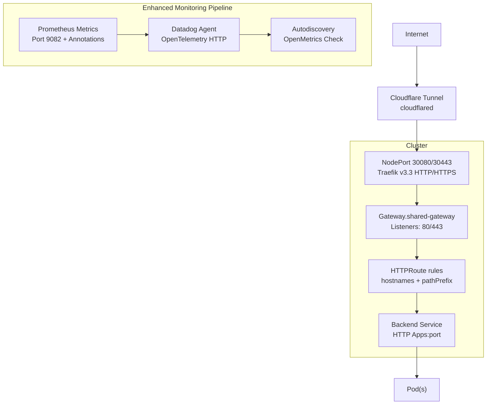

**Diagram sources**
- [README.md:5-48](file://README.md#L5-L48)
- [gateway.yaml:10-34](file://apps/infra/gateway-api/chart/gateway.yaml#L10-L34)
- [traefik.yaml:120-157](file://apps/infra/gateway-api/chart/traefik.yaml#L120-L157)
- [values.yaml (datadog):33-36](file://apps/infra/datadog/chart/values.yaml#L33-L36)

**Section sources**
- [README.md:5-48](file://README.md#L5-L48)
- [gateway.yaml:10-34](file://apps/infra/gateway-api/chart/gateway.yaml#L10-L34)
- [traefik.yaml:120-157](file://apps/infra/gateway-api/chart/traefik.yaml#L120-L157)

## Standard Gateway API Configuration

### Gateway Resource Definition
The Gateway resource now uses standard HTTP and HTTPS listeners with namespace-based routing control:

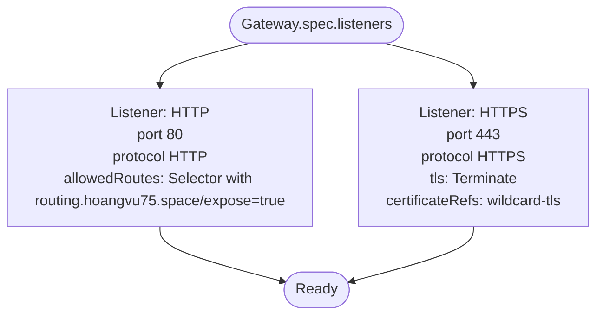

**Diagram sources**
- [gateway.yaml:10-34](file://apps/infra/gateway-api/chart/gateway.yaml#L10-L34)

**Section sources**
- [gateway.yaml:1-34](file://apps/infra/gateway-api/chart/gateway.yaml#L1-L34)

### Listener Protocol Support
Each listener type serves specific traffic patterns:

- **HTTP Listener (port 80)**: Standard HTTP routing for web applications
- **HTTPS Listener (port 443)**: Secure HTTP with TLS termination and certificate management

**Section sources**
- [gateway.yaml:10-34](file://apps/infra/gateway-api/chart/gateway.yaml#L10-L34)

## Layer 4 Routing Implementation

### TCP Routing Configuration
The IngressRouteTCP resource demonstrates TCP traffic forwarding from Traefik's TCP entrypoint to backend services:

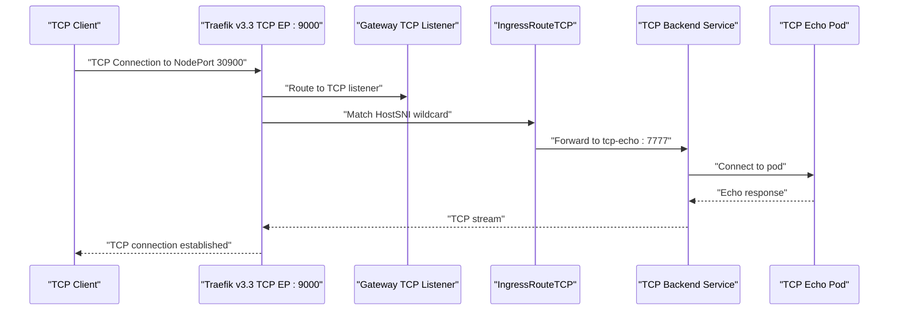

**Diagram sources**
- [ingressroutetcp.yaml:14-20](file://apps/applications/tcp-demo/chart/ingressroutetcp.yaml#L14-L20)
- [deployment.yaml (tcp-demo):19](file://apps/applications/tcp-demo/chart/deployment.yaml#L19)
- [service.yaml (tcp-demo):12-13](file://apps/applications/tcp-demo/chart/service.yaml#L12-L13)

**Section sources**
- [ingressroutetcp.yaml:1-21](file://apps/applications/tcp-demo/chart/ingressroutetcp.yaml#L1-L21)
- [deployment.yaml (tcp-demo):1-28](file://apps/applications/tcp-demo/chart/deployment.yaml#L1-L28)
- [service.yaml (tcp-demo):1-14](file://apps/applications/tcp-demo/chart/service.yaml#L1-L14)

### UDP Routing Configuration
The IngressRouteUDP resource handles UDP traffic forwarding with proper protocol considerations:

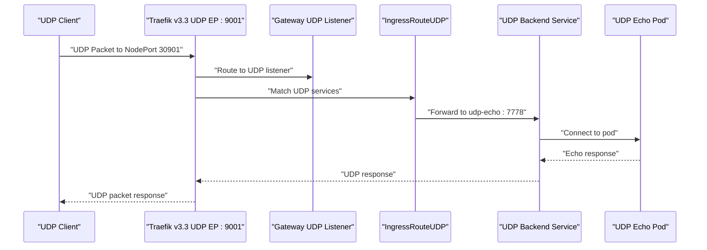

**Diagram sources**
- [ingressrouteudp.yaml:14-19](file://apps/applications/udp-demo/chart/ingressrouteudp.yaml#L14-L19)
- [deployment.yaml (udp-demo):19](file://apps/applications/udp-demo/chart/deployment.yaml#L19)
- [service.yaml (udp-demo):12-15](file://apps/applications/udp-demo/chart/service.yaml#L12-L15)

**Section sources**
- [ingressrouteudp.yaml:1-20](file://apps/applications/udp-demo/chart/ingressrouteudp.yaml#L1-L20)
- [deployment.yaml (udp-demo):1-29](file://apps/applications/udp-demo/chart/deployment.yaml#L1-L29)
- [service.yaml (udp-demo):1-15](file://apps/applications/udp-demo/chart/service.yaml#L1-L15)

## Traefik v3.x Deployment and Configuration

### Modular Configuration Approach
The Traefik v3.3 deployment now uses a modular configuration approach with separate static and dynamic configuration files and comprehensive monitoring integration:

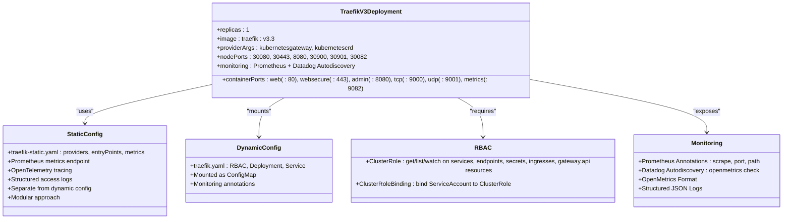

**Diagram sources**
- [traefik.yaml:78-157](file://apps/infra/gateway-api/chart/traefik.yaml#L78-L157)
- [traefik-static.yaml:10-52](file://apps/infra/gateway-api/chart/traefik-static.yaml#L10-L52)

**Section sources**
- [traefik.yaml:78-157](file://apps/infra/gateway-api/chart/traefik.yaml#L78-L157)
- [traefik-static.yaml:1-52](file://apps/infra/gateway-api/chart/traefik-static.yaml#L1-L52)

### Static Configuration Extensions
The Traefik v3.3 static configuration now supports dedicated entrypoints with standard provider configuration and comprehensive monitoring:

- **web**: HTTP entrypoint (:80) for standard web traffic
- **websecure**: HTTPS entrypoint (:443) with TLS termination
- **tcp**: TCP entrypoint (:9000) for Layer 4 TCP forwarding
- **udp**: UDP entrypoint (:9001/udp) for Layer 4 UDP forwarding
- **metrics**: Prometheus metrics entrypoint (:9082) for monitoring

**Updated** Static configuration separated into dedicated traefik-static.yaml file with enhanced monitoring capabilities

**Section sources**
- [traefik-static.yaml:15-27](file://apps/infra/gateway-api/chart/traefik-static.yaml#L15-L27)

### Standard Provider Configuration
The Traefik deployment now uses standard providers for stable operation with enhanced monitoring:

- **kubernetesCRD**: Standard CRD provider for IngressRoute resources
- **kubernetesGateway**: Standard Gateway API provider for Gateway resources
- **Allow Cross Namespace**: Enabled for flexible routing across namespaces
- **Prometheus Metrics**: Built-in metrics endpoint with configurable labels

**Section sources**
- [traefik-static.yaml:10-14](file://apps/infra/gateway-api/chart/traefik-static.yaml#L10-L14)

### Critical Config File Argument Fix
The Traefik deployment now uses the correct --configFile argument instead of the deprecated --config flag:

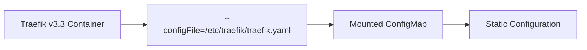

**Diagram sources**
- [traefik.yaml:84-86](file://apps/infra/gateway-api/chart/traefik.yaml#L84-L86)

**Section sources**
- [traefik.yaml:84-86](file://apps/infra/gateway-api/chart/traefik.yaml#L84-L86)

### Distributed Tracing Configuration
Traefik v3.3 now uses OTLP HTTP format for distributed tracing compatibility with Datadog APM:

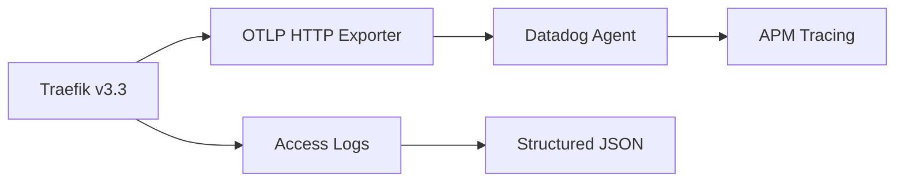

**Diagram sources**
- [traefik-static.yaml:43-48](file://apps/infra/gateway-api/chart/traefik-static.yaml#L43-L48)

**Section sources**
- [traefik-static.yaml:43-48](file://apps/infra/gateway-api/chart/traefik-static.yaml#L43-L48)

## Enhanced RBAC Permissions

### Standard Gateway Resource Access
The RBAC configuration has been updated to use standard Gateway API resources:

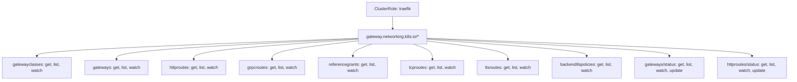

**Diagram sources**
- [traefik.yaml:27-38](file://apps/infra/gateway-api/chart/traefik.yaml#L27-L38)

**Section sources**
- [traefik.yaml:27-38](file://apps/infra/gateway-api/chart/traefik.yaml#L27-L38)

### Traefik CRD Resource Access
Additional permissions for Traefik-specific CRDs ensure full routing functionality:

- **traefik.io/**: Complete access to ingressroutes, ingressroutetcps, ingressrouteudps, middlewares, and related resources
- **Required for**: Advanced routing patterns, middleware chaining, and custom transport configurations

**Section sources**
- [traefik.yaml:36-38](file://apps/infra/gateway-api/chart/traefik.yaml#L36-L38)

## Standard CRDs Installation

### Gateway API v1.5.1 Installation
The Gateway API implementation now uses the official standard installation:

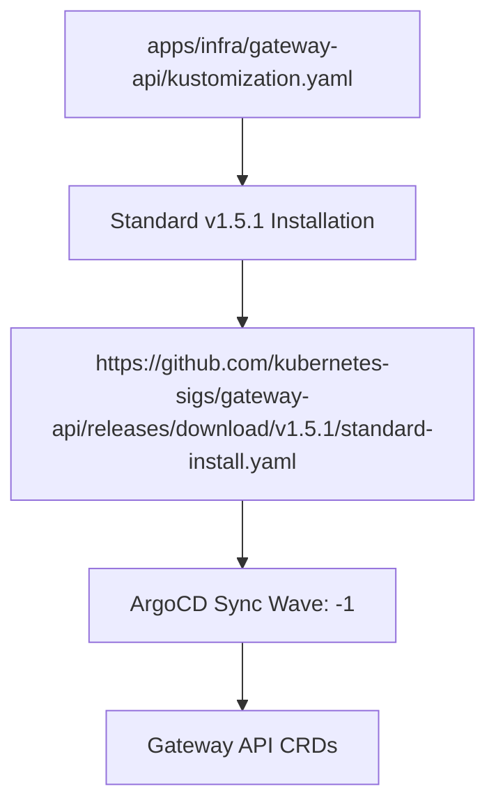

**Diagram sources**
- [kustomization.yaml (gateway-api):7](file://apps/infra/gateway-api/kustomization.yaml#L7)

**Section sources**
- [kustomization.yaml (gateway-api):7](file://apps/infra/gateway-api/kustomization.yaml#L7)

### Dedicated CRDs Subdirectory
The Gateway API implementation includes a dedicated CRDs directory with proper sync ordering:

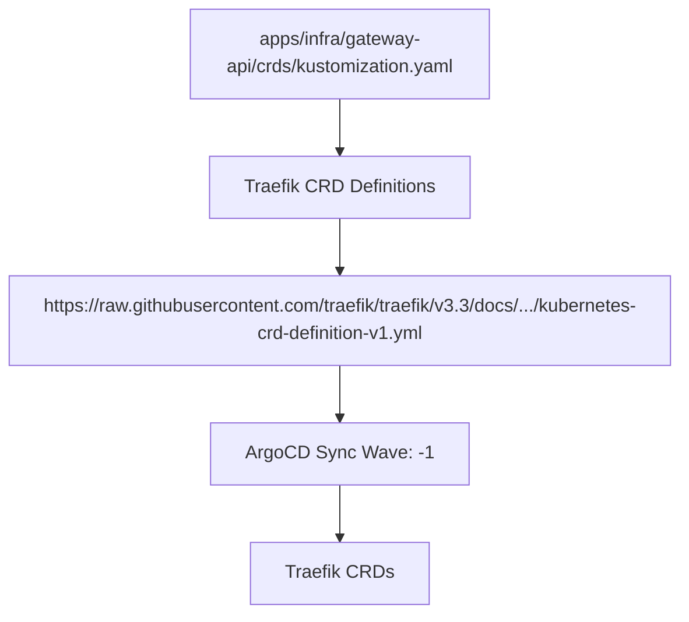

**Diagram sources**
- [kustomization.yaml (gateway-api-crds):5](file://apps/infra/gateway-api/crds/kustomization.yaml#L5)

**Section sources**
- [kustomization.yaml (gateway-api-crds):5](file://apps/infra/gateway-api/crds/kustomization.yaml#L5)

## Demo Applications

### TCP Echo Server
The tcp-demo application demonstrates TCP routing capabilities with a simple echo service:

- **Service**: ClusterIP service exposing port 7777
- **Deployment**: Alpine socat container listening on TCP port 7777
- **Routing**: IngressRouteTCP forwards traffic from Traefik's TCP entrypoint to the service
- **Testing**: Netcat client connects to NodePort 30900 for TCP echo functionality

**Section sources**
- [deployment.yaml (tcp-demo):16-28](file://apps/applications/tcp-demo/chart/deployment.yaml#L16-L28)
- [service.yaml (tcp-demo):7-14](file://apps/applications/tcp-demo/chart/service.yaml#L7-L14)
- [ingressroutetcp.yaml:14-20](file://apps/applications/tcp-demo/chart/ingressroutetcp.yaml#L14-L20)

### UDP Echo Server
The udp-demo application showcases UDP routing with connectionless communication:

- **Service**: ClusterIP service with UDP protocol on port 7778
- **Deployment**: Alpine socat container listening on UDP port 7778
- **Routing**: IngressRouteUDP forwards UDP packets from Traefik's UDP entrypoint
- **Testing**: Netcat client uses UDP flag (-u) to connect to NodePort 30901

**Section sources**
- [deployment.yaml (udp-demo):16-29](file://apps/applications/udp-demo/chart/deployment.yaml#L16-L29)
- [service.yaml (udp-demo):7-15](file://apps/applications/udp-demo/chart/service.yaml#L7-L15)
- [ingressrouteudp.yaml:14-19](file://apps/applications/udp-demo/chart/ingressrouteudp.yaml#L14-L19)

## Traffic Routing Patterns

### HTTP/HTTPS Traffic Flow
The system supports standard HTTP/HTTPS traffic routing with Traefik v3.3:

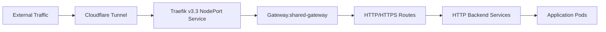

**Diagram sources**
- [gateway.yaml:10-34](file://apps/infra/gateway-api/chart/gateway.yaml#L10-L34)
- [traefik.yaml:120-157](file://apps/infra/gateway-api/chart/traefik.yaml#L120-L157)

### Namespace-Based Routing Control
The HTTP listener uses namespace selectors to control traffic routing:

- **Selector Pattern**: `routing.hoangvu75.space/expose: "true"`
- **Scope**: Controls which namespaces can send traffic to the Gateway
- **Security**: Prevents unauthorized namespace access to the Gateway

**Section sources**
- [gateway.yaml:14-19](file://apps/infra/gateway-api/chart/gateway.yaml#L14-L19)

## Load Balancing and High Availability

### Multi-Instance Deployment
For high-traffic scenarios, implement horizontal scaling:

- **Replica Scaling**: Increase Traefik replicas beyond 1 for redundancy
- **NodePort Distribution**: Each instance receives traffic on designated NodePorts
- **Health Checks**: Implement readiness probes for graceful scaling
- **Resource Limits**: Configure appropriate CPU/memory requests/limits

### Load Balancer Integration
Consider using LoadBalancer services for external traffic distribution:

- **External Load Balancer**: Distribute traffic across multiple Traefik instances
- **Session Persistence**: Configure sticky sessions for stateful applications
- **Health Monitoring**: Integrate with cloud provider health checks

## Certificate Management

### TLS Configuration
The HTTPS listener utilizes wildcard certificates for secure HTTP routing:

- **Certificate Reference**: wildcard-tls Secret in gateway-api namespace
- **TLS Mode**: Terminate TLS at the Gateway level
- **Certificate Validation**: Ensure certificate SANs match configured hostnames

**Section sources**
- [gateway.yaml:29-34](file://apps/infra/gateway-api/chart/gateway.yaml#L29-L34)

### Certificate Automation
Integrate with cert-manager for automated certificate management:

- **ACME Integration**: Automatic certificate issuance and renewal
- **DNS Challenges**: Configure DNS01 challenges for wildcard certificates
- **Secret Rotation**: Automated certificate rotation without downtime

## Enhanced Monitoring and Observability

### Comprehensive Metrics Exposure
Traefik v3.3 now provides enhanced metrics collection with comprehensive Prometheus integration:

- **Built-in Metrics Endpoint**: Dedicated metrics entrypoint (:9082) with Prometheus format
- **Service Annotations**: Automatic Prometheus scraping via prometheus.io annotations
- **Structured Metrics**: Rich metric labels including entry points and services
- **OpenMetrics Format**: Standardized format compatible with modern monitoring systems

### Datadog Autodiscovery Integration
Advanced monitoring capabilities through Datadog Autodiscovery:

- **OpenMetrics Check**: Intelligent metric collection for Traefik
- **Endpoint Configuration**: Automatic detection of metrics endpoints
- **Metric Filtering**: Selective collection of relevant Traefik metrics
- **Namespace Tagging**: Proper metric organization with namespace labels

### Prometheus Service Annotations
Automatic service discovery for Prometheus scraping:

- **prometheus.io/scrape**: Enable scraping for Traefik service
- **prometheus.io/port**: Specify metrics port (:9082)
- **prometheus.io/path**: Define metrics endpoint (/metrics)
- **Automatic Discovery**: Prometheus automatically discovers Traefik metrics

### Structured Access Logging
Enhanced logging for improved observability:

- **JSON Format**: Structured access logs for easy parsing
- **Datadog Ingestion**: Logs formatted for Datadog log processing
- **Status Code Filtering**: Filter logs by HTTP status codes (200-499)
- **Field Configuration**: Controlled field inclusion for efficient storage

### Distributed Tracing Integration
Modernized tracing with OpenTelemetry compatibility:

- **OTLP HTTP Exporter**: Standardized format for trace data
- **Datadog APM Integration**: Direct export to Datadog Agent
- **Structured Traces**: Detailed trace information for debugging
- **Performance Monitoring**: End-to-end request tracing

**Updated** Enhanced monitoring capabilities with comprehensive Prometheus scraping annotations and Datadog Autodiscovery configuration

**Section sources**
- [traefik.yaml:75-82](file://apps/infra/gateway-api/chart/traefik.yaml#L75-L82)
- [traefik-static.yaml:28-48](file://apps/infra/gateway-api/chart/traefik-static.yaml#L28-L48)
- [values.yaml (datadog):33-36](file://apps/infra/datadog/chart/values.yaml#L33-L36)

## Performance Optimization

### Resource Allocation
Optimize Traefik v3.3 performance for HTTP/HTTPS workloads:

- **CPU Resources**: Scale CPU requests/limits based on expected concurrent connections
- **Memory Management**: Monitor memory usage for connection handling
- **Connection Limits**: Configure max connections for HTTP/HTTPS traffic

### Network Optimization
Implement network-level optimizations:

- **Connection Pooling**: Reuse connections for persistent HTTP services
- **Protocol-Specific Tuning**: Tune kernel parameters for optimal HTTP/HTTPS performance

### Monitoring Optimization
Leverage enhanced monitoring for performance insights:

- **Metrics Collection**: Use built-in metrics for capacity planning
- **Trace Analysis**: Identify performance bottlenecks through distributed tracing
- **Log Analysis**: Monitor access patterns and error rates
- **Alerting Integration**: Set up alerts based on collected metrics

## Troubleshooting Guide

### Standard Installation Issues
Common problems and solutions for standard Gateway API v1.5.1:

- **Gateway Not Ready**:
  - Verify standard CRDs are installed before GatewayClass
  - Check ArgoCD sync waves for proper ordering
  - Confirm GatewayClass controller name matches traefik.io/gateway-controller

- **HTTP/HTTPS Not Working**:
  - Verify Gateway listeners accept traffic from target namespaces
  - Check HTTPRoute parentRefs reference correct Gateway
  - Confirm certificate references are valid

- **TCP/UDP Issues**:
  - Verify NodePort service exposes ports 30900/30901
  - Check Traefik v3.3 container ports include tcp/udp entries
  - Confirm IngressRouteTCP/UDP entryPoints match Gateway listeners

- **Tracing Issues**:
  - Verify OTLP HTTP endpoint connectivity
  - Check Datadog Agent availability
  - Validate trace exporter configuration

- **RBAC Permission Issues**:
  - Verify gateway.networking.k8s.io resources are accessible
  - Check status update permissions for gateways
  - Ensure Traefik CRD resources are permitted

- **Config File Issues**:
  - Confirm --configFile argument is used instead of deprecated --config
  - Verify ConfigMap is mounted at /etc/traefik
  - Check Traefik can read the static configuration

### Enhanced Monitoring Issues
Problems and solutions for the enhanced monitoring setup:

- **Metrics Not Appearing in Prometheus**:
  - Verify prometheus.io annotations are present on Traefik service
  - Check Prometheus service discovery configuration
  - Confirm metrics endpoint is reachable on port 9082
  - Validate OpenMetrics format compatibility

- **Datadog Autodiscovery Not Working**:
  - Verify ad.datadoghq.com annotations are correctly formatted
  - Check Datadog Agent can reach Traefik metrics endpoint
  - Confirm OpenMetrics check configuration syntax
  - Validate metric filtering patterns

- **Tracing Data Missing**:
  - Verify OTLP HTTP endpoint URL format
  - Check network connectivity between Traefik and Datadog Agent
  - Confirm Datadog Agent has proper APM configuration
  - Validate trace exporter credentials

- **Log Processing Issues**:
  - Verify accessLog format is set to JSON
  - Check Datadog log processing configuration
  - Confirm log filtering settings are appropriate
  - Validate field configuration for log parsing

**Section sources**
- [traefik.yaml:120-157](file://apps/infra/gateway-api/chart/traefik.yaml#L120-L157)
- [gateway.yaml:10-34](file://apps/infra/gateway-api/chart/gateway.yaml#L10-L34)
- [ingressroutetcp.yaml:14-20](file://apps/applications/tcp-demo/chart/ingressroutetcp.yaml#L14-L20)
- [ingressrouteudp.yaml:14-19](file://apps/applications/udp-demo/chart/ingressrouteudp.yaml#L14-L19)
- [traefik-static.yaml:10-14](file://apps/infra/gateway-api/chart/traefik-static.yaml#L10-L14)

## Conclusion
The Gateway API controller implementation with Traefik v3.3 provides a streamlined, production-ready solution using standard Gateway API v1.5.1 installation and modular configuration approach. The system focuses on reliable HTTP/HTTPS routing while maintaining the flexibility for optional TCP/UDP capabilities through CRD-based patterns. Enhanced monitoring capabilities now include comprehensive Prometheus metrics exposure with Datadog Autodiscovery for intelligent metric collection and monitoring, providing robust observability across all supported protocols. This approach eliminates the complexity of experimental features while preserving full Traefik v3.x compatibility and comprehensive observability.

## Appendices

### Complete Protocol Matrix
| Protocol | EntryPoint | Port | NodePort | Use Case | Security |
|----------|------------|------|----------|----------|----------|
| HTTP | web | :80 | 30080 | Traditional web apps | None |
| HTTPS | websecure | :443 | 30443 | Secure web apps | TLS Termination |
| TCP | tcp | :9000 | 30900 | Databases, APIs, Custom TCP | TLS Optional |
| UDP | udp | :9001/udp | 30901 | DNS, DHCP, Real-time | No Connection |
| Metrics | metrics | :9082 | 30082 | Monitoring | None |

**Section sources**
- [traefik-static.yaml:15-27](file://apps/infra/gateway-api/chart/traefik-static.yaml#L15-L27)
- [traefik.yaml:120-157](file://apps/infra/gateway-api/chart/traefik.yaml#L120-L157)

### Enhanced Monitoring Features
- **Version**: Gateway API v1.5.1 for stability and long-term support
- **CRD Integration**: Standard CRDs for HTTPRoute, TCPRoute, UDPRoute
- **Controller**: traefik.io/gateway-controller for official support
- **Modular Config**: Separate static and dynamic configuration files
- **Enhanced RBAC**: Updated permissions for standard resources
- **Improved Performance**: Optimized resource usage and connection handling
- **Prometheus Integration**: Built-in metrics endpoint with service annotations
- **Datadog Autodiscovery**: Intelligent metric collection and monitoring
- **OpenTelemetry Tracing**: Modernized distributed tracing compatibility
- **Structured Logging**: JSON format for enhanced log processing

### Testing Procedures
Comprehensive testing for standard Gateway API environment with enhanced monitoring:

- **HTTP/HTTPS Testing**: Validate certificate installation and TLS termination
- **Gateway Readiness**: Verify GatewayClass and Gateway status
- **Route Validation**: Confirm HTTPRoute routing to backend services
- **Tracing Verification**: Validate OTLP HTTP export to Datadog Agent
- **RBAC Testing**: Verify access to standard gateway.networking.k8s.io resources
- **Config Validation**: Confirm --configFile argument works correctly
- **CRD Testing**: Verify standard CRD installation and functionality
- **Metrics Testing**: Validate Prometheus scraping and Datadog Autodiscovery
- **Log Testing**: Confirm structured JSON access logs processing
- **Trace Testing**: Verify distributed tracing data collection

**Section sources**
- [README.md (tcp-udp-demo):18-98](file://guide/tcp-udp-demo/README.md#L18-L98)

### Configuration Best Practices
- **Namespace Segregation**: Use namespace selectors to control Gateway access
- **Resource Planning**: Allocate appropriate resources for expected concurrent connections
- **Monitoring Setup**: Implement comprehensive metrics collection for HTTP/HTTPS
- **Security Hardening**: Apply appropriate security measures for each protocol type
- **Tracing Configuration**: Ensure proper OTLP HTTP endpoint connectivity
- **RBAC Management**: Regularly review and update permissions for gateway resources
- **CRD Synchronization**: Monitor standard CRD functionality and availability
- **Monitoring Optimization**: Configure appropriate metric retention and alerting
- **Autodiscovery Tuning**: Optimize Datadog Autodiscovery for production workloads
- **Log Management**: Implement proper log rotation and retention policies